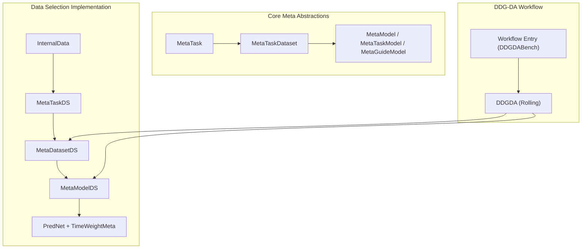
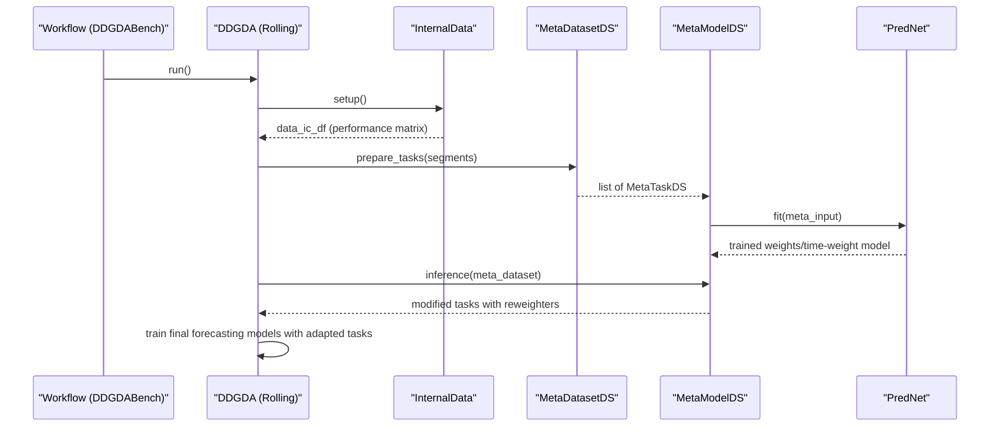
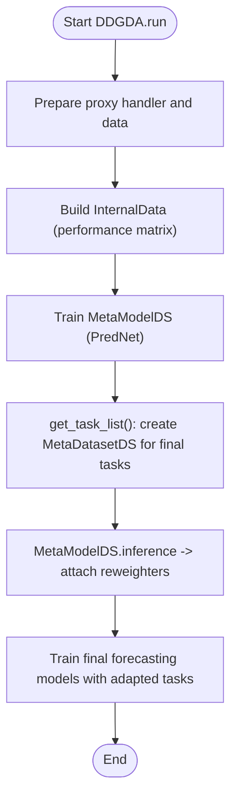
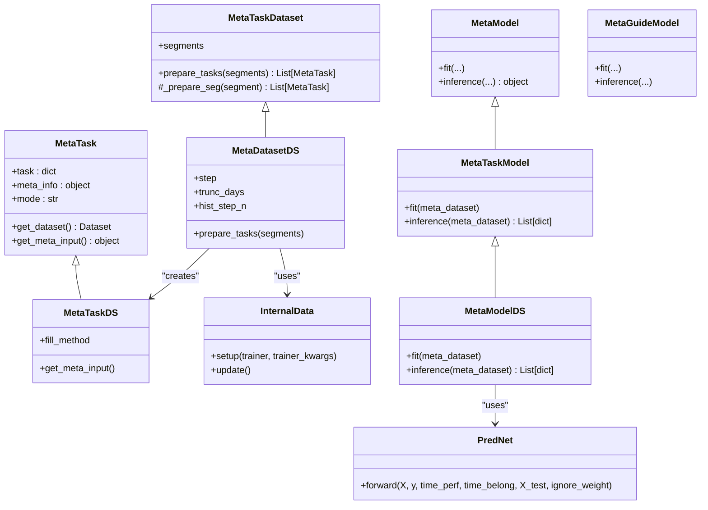
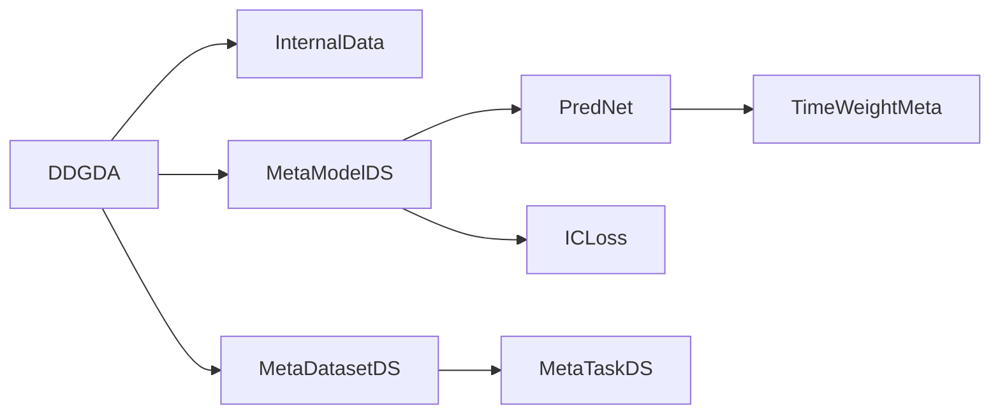

# Meta-Learning

<cite>
**Referenced Files in This Document**
- [meta.rst](file://docs/component/meta.rst)
- [task.py](file://qlib/model/meta/task.py)
- [dataset.py](file://qlib/model/meta/dataset.py)
- [model.py](file://qlib/model/meta/model.py)
- [workflow.py](file://examples/benchmarks_dynamic/DDG-DA/workflow.py)
- [ddgda.py](file://qlib/contrib/rolling/ddgda.py)
- [dataset.py](file://qlib/contrib/meta/data_selection/dataset.py)
- [model.py](file://qlib/contrib/meta/data_selection/model.py)
- [net.py](file://qlib/contrib/meta/data_selection/net.py)
- [utils.py](file://qlib/contrib/meta/data_selection/utils.py)
</cite>

## Table of Contents
1. Introduction
2. Project Structure
3. Core Components
4. Architecture Overview
5. Detailed Component Analysis
6. Dependency Analysis
7. Performance Considerations
8. Troubleshooting Guide
9. Conclusion

## Introduction
This document explains QLib’s meta-learning capabilities and adaptive modeling techniques for quantitative finance. It focuses on:
- The meta-learning framework for model adaptation and transfer learning across market regimes
- Data selection strategies that identify optimal training subsets based on recent market conditions
- Task-based meta-learning to handle multiple related prediction tasks
- Integration with dynamic market modeling, specifically DDG-DA (Data Distribution Generation for Predictable Concept Drift Adaptation)
- Practical guidance to implement custom meta-learning workflows and adapt models to new regimes
- Performance benefits and limitations observed in practice

QLib’s meta-controller provides a structured way to learn patterns among forecasting tasks and use them to guide future tasks, enabling robust adaptation to non-stationary financial data.

**Section sources**
- [meta.rst:9-68](file://docs/component/meta.rst#L9-L68)

## Project Structure
QLib organizes meta-learning into two layers:
- Core meta abstractions in qlib/model/meta (MetaTask, MetaTaskDataset, MetaModel/MetaTaskModel/MetaGuideModel)
- Concrete implementations for data-selection-based meta-learning in qlib/contrib/meta/data_selection (InternalData, MetaTaskDS, MetaDatasetDS, MetaModelDS, PredNet)
- An end-to-end workflow integrating DDG-DA in examples/benchmarks_dynamic/DDG-DA and qlib/contrib/rolling/ddgda.py

**Diagram sources**
- [task.py:8-57](file://qlib/model/meta/task.py#L8-L57)
- [dataset.py:10-78](file://qlib/model/meta/dataset.py#L10-L78)
- [model.py:10-76](file://qlib/model/meta/model.py#L10-L76)
- [dataset.py:23-417](file://qlib/contrib/meta/data_selection/dataset.py#L23-L417)
- [model.py:40-197](file://qlib/contrib/meta/data_selection/model.py#L40-L197)
- [net.py:11-75](file://qlib/contrib/meta/data_selection/net.py#L11-L75)
- [ddgda.py:70-389](file://qlib/contrib/rolling/ddgda.py#L70-L389)
- [workflow.py:17-45](file://examples/benchmarks_dynamic/DDG-DA/workflow.py#L17-L45)

**Section sources**
- [meta.rst:9-68](file://docs/component/meta.rst#L9-L68)
- [ddgda.py:70-389](file://qlib/contrib/rolling/ddgda.py#L70-L389)
- [workflow.py:17-45](file://examples/benchmarks_dynamic/DDG-DA/workflow.py#L17-L45)

## Core Components
- MetaTask: Encapsulates a single forecasting task along with meta-information used by the meta-model. Supports different processing modes (full, test, transfer).
- MetaTaskDataset: Manages lists of MetaTask instances and prepares segments for training or testing the meta-model.
- MetaModel: Abstract interface for meta-models; includes specialized types:
  - MetaTaskModel: Modifies base task definitions after training (used by data-selection approach).
  - MetaGuideModel: Guides the training process of base forecasting models during training.

These abstractions enable modular design where meta-knowledge can be learned from historical tasks and transferred to new tasks under changing market conditions.

**Section sources**
- [task.py:8-57](file://qlib/model/meta/task.py#L8-L57)
- [dataset.py:10-78](file://qlib/model/meta/dataset.py#L10-L78)
- [model.py:10-76](file://qlib/model/meta/model.py#L10-L76)

## Architecture Overview
The DDG-DA workflow integrates meta-learning with rolling forecasting:
- InternalData computes performance proxies (e.g., daily IC) over rolling windows to capture distribution similarity.
- MetaDatasetDS builds meta-tasks using these proxies and aligns them with forecasting tasks via RollingGen.
- MetaModelDS trains a network (PredNet) to predict sample weights conditioned on historical performance profiles.
- During inference, MetaModelDS attaches a reweighter to each forecasting task, adapting training emphasis to recent market regimes.

**Diagram sources**
- [workflow.py:17-45](file://examples/benchmarks_dynamic/DDG-DA/workflow.py#L17-L45)
- [ddgda.py:179-389](file://qlib/contrib/rolling/ddgda.py#L179-L389)
- [dataset.py:23-417](file://qlib/contrib/meta/data_selection/dataset.py#L23-L417)
- [model.py:40-197](file://qlib/contrib/meta/data_selection/model.py#L40-L197)
- [net.py:43-75](file://qlib/contrib/meta/data_selection/net.py#L43-L75)

## Detailed Component Analysis

### MetaTask and MetaTaskDataset
- MetaTask stores a base forecasting task and meta-information, supporting full/test/transfer modes to control what data is available during meta-training vs. inference.
- MetaTaskDataset generates MetaTask instances per segment and supports flexible segmentation strategies (by ratio or date boundary), enabling consistent alignment between meta-training and meta-testing.

Key behaviors:
- prepare_tasks returns lists of MetaTask for specified segments
- _prepare_seg implements segment-specific logic for splitting meta-tasks

**Section sources**
- [task.py:8-57](file://qlib/model/meta/task.py#L8-L57)
- [dataset.py:10-78](file://qlib/model/meta/dataset.py#L10-L78)

### InternalData and MetaTaskDS (Data Selection)
- InternalData trains proxy models on rolling windows and computes a performance matrix (data_ic_df) capturing how well past training windows predict current labels. This matrix serves as meta-input reflecting data distribution similarity.
- MetaTaskDS constructs processed meta-inputs:
  - time_perf: normalized historical performance series
  - time_belong: binary mask indicating which historical windows contribute to each sample
  - X, y, X_test, y_test: features and labels aligned to training/test splits
  - Handles missing values via configurable fill methods

Complexity considerations:
- Initialization of MetaTaskDS can be memory-intensive due to dataset preparation and mask construction
- Parallel computation is used for performance calculation across rolling windows

**Section sources**
- [dataset.py:23-234](file://qlib/contrib/meta/data_selection/dataset.py#L23-L234)

### MetaDatasetDS (Meta-Level Dataset)
- Builds a list of MetaTaskDS instances by iterating through rolling tasks generated from a task template
- Aligns meta-inputs with forecasting tasks using truncation and masking to avoid leakage
- Supports both percentage-based and date-based segmentation for train/test splits

**Section sources**
- [dataset.py:237-417](file://qlib/contrib/meta/data_selection/dataset.py#L237-L417)

### MetaModelDS and PredNet (Learning to Reweight)
- MetaModelDS trains PredNet to predict per-sample weights conditioned on historical performance profiles (time_perf) and assignment masks (time_belong)
- PredNet uses a closed-form weighted least-squares step to compute coefficients and predictions, with an optional regularization term
- TimeWeightMeta learns time-dependent weights from historical performance, with clipping strategies to stabilize training
- Loss functions include MSE and an Information Coefficient (IC) loss tailored for ranking-based evaluation common in finance

Training flow:
- Initializes networks and optimizers
- Runs epochs over train/test phases, logging metrics and saving models
- Inference attaches a TimeReweighter to each forecasting task, enabling regime-adaptive training emphasis

**Section sources**
- [model.py:40-197](file://qlib/contrib/meta/data_selection/model.py#L40-L197)
- [net.py:11-75](file://qlib/contrib/meta/data_selection/net.py#L11-L75)
- [utils.py:12-119](file://qlib/contrib/meta/data_selection/utils.py#L12-L119)

### DDG-DA Integration (Rolling Workflow)
- DDGDA orchestrates:
  - Proxy model training and feature importance extraction
  - Dumping handler and internal data for meta-learning
  - Training MetaModelDS on the prepared meta-dataset
  - Generating modified forecasting tasks with reweighters for final model training
- Supports switching between linear and GBDT proxy models and adjusts handlers accordingly

**Diagram sources**
- [ddgda.py:179-389](file://qlib/contrib/rolling/ddgda.py#L179-L389)

**Section sources**
- [ddgda.py:70-389](file://qlib/contrib/rolling/ddgda.py#L70-L389)
- [workflow.py:17-45](file://examples/benchmarks_dynamic/DDG-DA/workflow.py#L17-L45)

### Class Relationships (Code-Level Diagram)

**Diagram sources**
- [task.py:8-57](file://qlib/model/meta/task.py#L8-L57)
- [dataset.py:10-78](file://qlib/model/meta/dataset.py#L10-L78)
- [model.py:10-76](file://qlib/model/meta/model.py#L10-L76)
- [dataset.py:23-417](file://qlib/contrib/meta/data_selection/dataset.py#L23-L417)
- [model.py:40-197](file://qlib/contrib/meta/data_selection/model.py#L40-L197)
- [net.py:43-75](file://qlib/contrib/meta/data_selection/net.py#L43-L75)

## Dependency Analysis
- DDGDA depends on:
  - InternalData for computing performance proxies
  - MetaDatasetDS for building meta-tasks aligned with forecasting tasks
  - MetaModelDS for training and inference to produce reweighted tasks
  - Rolling workflow utilities for generating tasks and managing experiments
- MetaModelDS depends on:
  - PredNet and TimeWeightMeta for learning time-dependent sample weights
  - ICLoss for ranking-oriented optimization
  - Reweighter abstraction to attach time-based weights to forecasting tasks

**Diagram sources**
- [ddgda.py:179-389](file://qlib/contrib/rolling/ddgda.py#L179-L389)
- [dataset.py:23-417](file://qlib/contrib/meta/data_selection/dataset.py#L23-L417)
- [model.py:40-197](file://qlib/contrib/meta/data_selection/model.py#L40-L197)
- [net.py:11-75](file://qlib/contrib/meta/data_selection/net.py#L11-L75)
- [utils.py:12-119](file://qlib/contrib/meta/data_selection/utils.py#L12-L119)

**Section sources**
- [ddgda.py:179-389](file://qlib/contrib/rolling/ddgda.py#L179-L389)
- [dataset.py:23-417](file://qlib/contrib/meta/data_selection/dataset.py#L23-L417)
- [model.py:40-197](file://qlib/contrib/meta/data_selection/model.py#L40-L197)
- [net.py:11-75](file://qlib/contrib/meta/data_selection/net.py#L11-L75)
- [utils.py:12-119](file://qlib/contrib/meta/data_selection/utils.py#L12-L119)

## Performance Considerations
Benefits:
- Adaptive weighting improves robustness to concept drift by emphasizing historically similar periods
- Closed-form weighted least-squares in PredNet enables efficient training with interpretable coefficients
- IC-based loss aligns optimization with ranking quality commonly used in alpha research

Limitations:
- Memory and compute intensity during meta-task initialization and performance matrix computation
- Sensitivity to proxy model choice and preprocessing; misalignment can reduce transfer effectiveness
- Risk of leakage if truncation/masking is not correctly configured; careful handling of overlapping windows is required

Practical tips:
- Use feature selection (e.g., top-K by importance) to reduce dimensionality and improve stability
- Choose appropriate clip methods and thresholds to constrain weight magnitudes
- Validate meta-input normalization and fill strategies to avoid bias in sparse regions

[No sources needed since this section provides general guidance]

## Troubleshooting Guide
Common issues and resolutions:
- Most samples dropped during MetaTaskDS initialization: verify data availability and ensure sufficient valid rows after dropping NaNs
- Insufficient history length for meta-input: increase hist_step_n or adjust trunc_days to meet minimum requirements
- IC loss exceptions due to small sample sizes per day: adjust loss_skip_thresh to skip days with too few valid samples
- Handler configuration mismatches when switching proxy models: ensure preprocessors are compatible with chosen model type

Operational checks:
- Confirm experiment names and recorder paths are consistent across steps
- Verify that internal_data.pkl is loaded correctly before meta-inference
- Ensure working directory has sufficient disk space for intermediate artifacts

**Section sources**
- [dataset.py:151-166](file://qlib/contrib/meta/data_selection/dataset.py#L151-L166)
- [dataset.py:379-384](file://qlib/contrib/meta/data_selection/dataset.py#L379-L384)
- [utils.py:40-64](file://qlib/contrib/meta/data_selection/utils.py#L40-L64)
- [ddgda.py:128-157](file://qlib/contrib/rolling/ddgda.py#L128-L157)

## Conclusion
QLib’s meta-learning framework provides a principled approach to adapting forecasting models to evolving market regimes through data selection and task-based guidance. DDG-DA demonstrates how to leverage historical performance signals to reweight training data, improving robustness to concept drift. By combining core meta abstractions with concrete implementations, users can build custom workflows that transfer knowledge across tasks and dynamically adjust to new environments while maintaining computational efficiency and interpretability.

[No sources needed since this section summarizes without analyzing specific files]