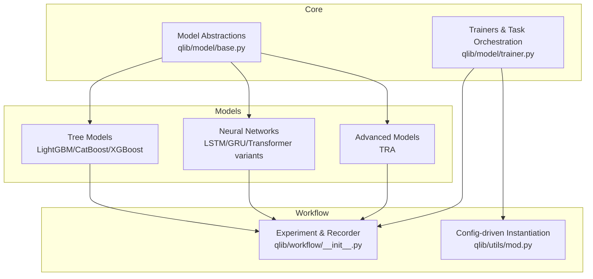
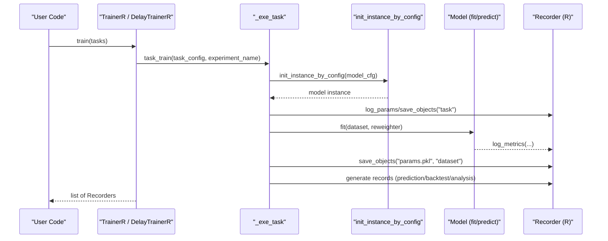
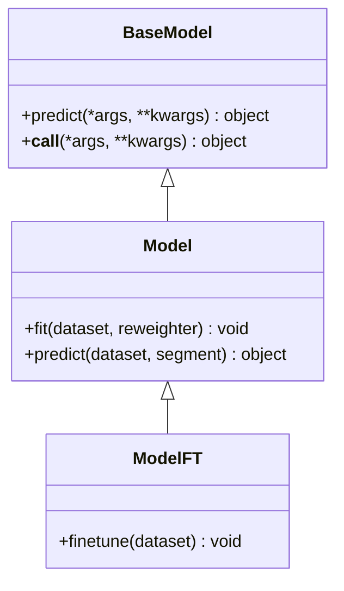
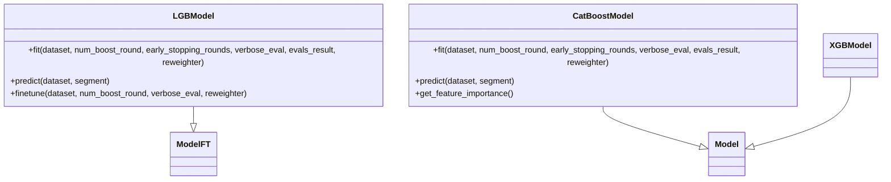
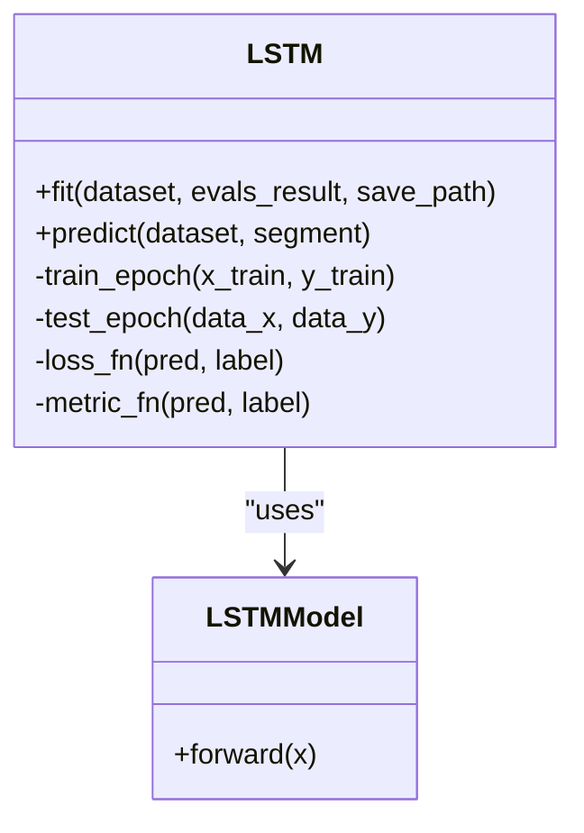
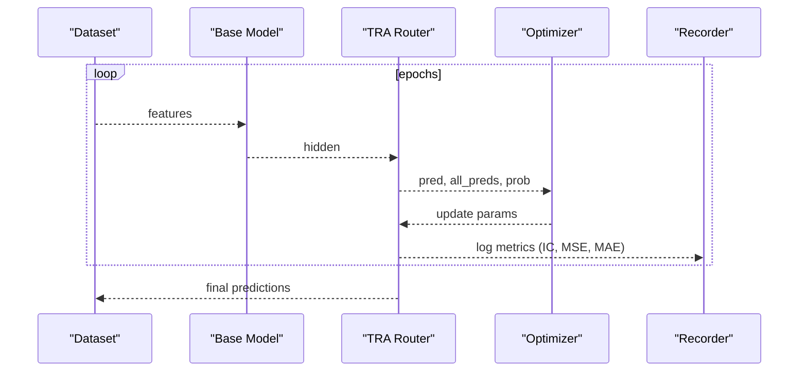
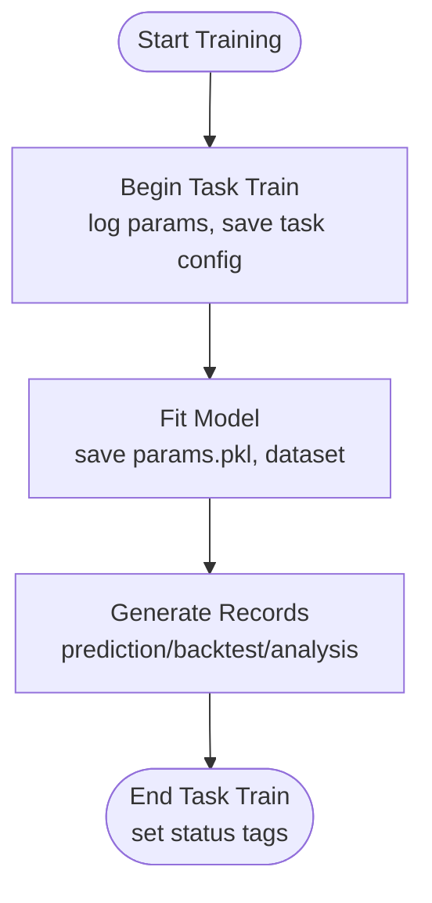
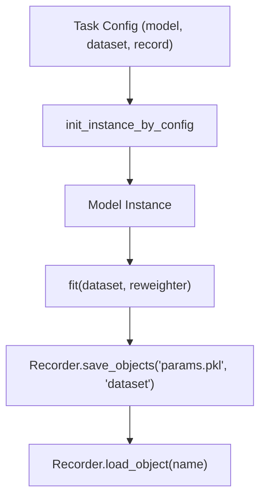
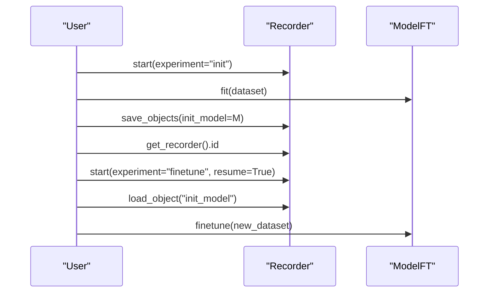
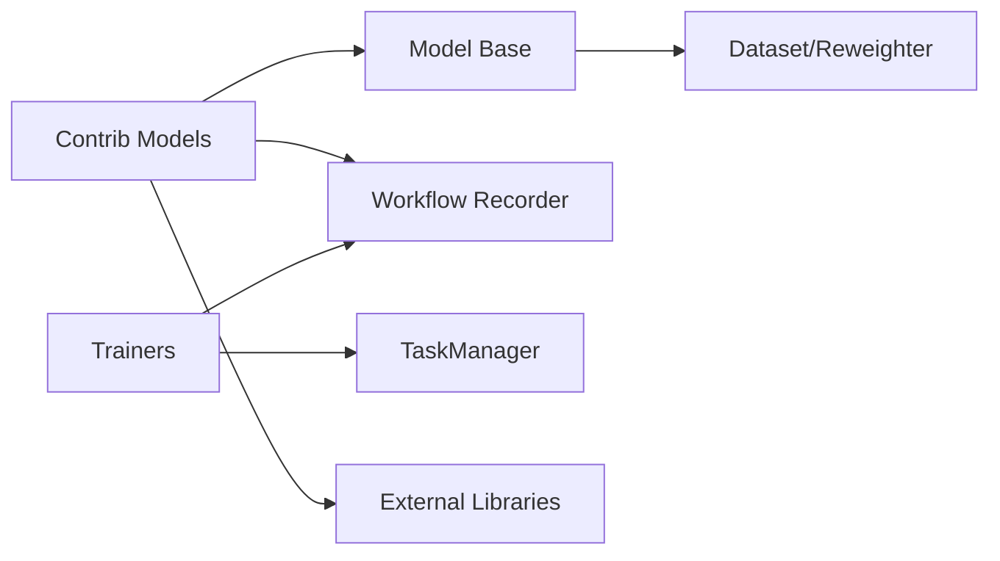

# Model Framework

<cite>
**Referenced Files in This Document**
- [base.py](file://qlib/model/base.py)
- [trainer.py](file://qlib/model/trainer.py)
- [__init__.py (contrib model)](file://qlib/contrib/model/__init__.py)
- [gbdt.py](file://qlib/contrib/model/gbdt.py)
- [catboost_model.py](file://qlib/contrib/model/catboost_model.py)
- [pytorch_lstm.py](file://qlib/contrib/model/pytorch_lstm.py)
- [model.py (TRA example)](file://examples/benchmarks/TRA/src/model.py)
- [__init__.py (workflow)](file://qlib/workflow/__init__.py)
- [mod.py](file://qlib/utils/mod.py)
</cite>

## Table of Contents
1. Introduction
2. Project Structure
3. Core Components
4. Architecture Overview
5. Detailed Component Analysis
6. Dependency Analysis
7. Performance Considerations
8. Troubleshooting Guide
9. Conclusion
10. Appendices

## Introduction
This document explains QLib’s model framework for machine learning across supervised paradigms, covering base interfaces, training orchestration, a broad model zoo (tree-based and neural networks), advanced models such as TRA, registration and serialization mechanisms, meta-learning capabilities, and integration with the workflow system. It also provides guidance on model interpretation, feature importance analysis, and benchmarking practices.

## Project Structure
QLib organizes modeling components into:
- Base model abstractions and trainer utilities under qlib/model
- Concrete implementations (LightGBM, CatBoost, PyTorch models) under qlib/contrib/model
- Advanced examples (e.g., TRA) under examples/benchmarks
- Experiment tracking and workflow orchestration under qlib/workflow
- Dynamic configuration and instantiation utilities under qlib/utils

**Diagram sources**
- [base.py:10-111](file://qlib/model/base.py#L10-L111)
- [trainer.py:131-620](file://qlib/model/trainer.py#L131-L620)
- [__init__.py (contrib model):1-44](file://qlib/contrib/model/__init__.py#L1-L44)
- [__init__.py (workflow):26-682](file://qlib/workflow/__init__.py#L26-L682)
- [mod.py:122-162](file://qlib/utils/mod.py#L122-L162)

**Section sources**
- [base.py:10-111](file://qlib/model/base.py#L10-L111)
- [trainer.py:131-620](file://qlib/model/trainer.py#L131-L620)
- [__init__.py (contrib model):1-44](file://qlib/contrib/model/__init__.py#L1-L44)
- [__init__.py (workflow):26-682](file://qlib/workflow/__init__.py#L26-L682)
- [mod.py:122-162](file://qlib/utils/mod.py#L122-L162)

## Core Components
- Base classes define the contract for learnable models:
  - BaseModel: abstract predict interface and callable wrapper
  - Model: adds fit and predict contracts; supports dataset and optional reweighter
  - ModelFT: extends with finetune capability for incremental adaptation
- Trainers manage task execution, experiment recording, and delayed or parallelized training workflows
- Workflow subsystem provides experiment/recorder context managers, parameter/metric logging, and artifact persistence

Key responsibilities:
- Data access via Dataset and optional Reweighter
- Training loops encapsulated per model type
- Consistent prediction API returning aligned indices
- Experiment tracking and model serialization through the recorder

**Section sources**
- [base.py:10-111](file://qlib/model/base.py#L10-L111)
- [trainer.py:42-128](file://qlib/model/trainer.py#L42-L128)
- [__init__.py (workflow):37-96](file://qlib/workflow/__init__.py#L37-L96)

## Architecture Overview
The training flow integrates configuration-driven instantiation, dataset preparation, model fitting, metric logging, and artifact saving.

**Diagram sources**
- [trainer.py:42-128](file://qlib/model/trainer.py#L42-L128)
- [mod.py:122-162](file://qlib/utils/mod.py#L122-L162)
- [__init__.py (workflow):481-590](file://qlib/workflow/__init__.py#L481-L590)

## Detailed Component Analysis

### Base Model Interfaces
- BaseModel: abstract predict and callable behavior
- Model: defines fit(dataset, reweighter) and predict(dataset, segment)
- ModelFT: adds finetune(dataset) for continued training from a saved state

These interfaces ensure consistent usage across tree-based and neural network models and integrate with the workflow recorder for artifacts and metrics.

**Diagram sources**
- [base.py:10-111](file://qlib/model/base.py#L10-L111)

**Section sources**
- [base.py:10-111](file://qlib/model/base.py#L10-L111)

### Tree-Based Models (LightGBM, CatBoost, XGBoost)
- LightGBM model:
  - Supports regression/classification objectives
  - Uses dataset segments (train/valid) and optional reweighter
  - Logs evaluation metrics during training
  - Provides predict returning a Series aligned to input index
- CatBoost model:
  - Supports RMSE/Logloss objectives
  - Handles weights via Reweighter
  - Exposes feature importance method
- XGBoost model:
  - Registered alongside other tree models for unified usage

All tree models implement fit/predict and integrate with the workflow recorder for metrics and artifacts.

**Diagram sources**
- [gbdt.py:16-127](file://qlib/contrib/model/gbdt.py#L16-L127)
- [catboost_model.py:17-101](file://qlib/contrib/model/catboost_model.py#L17-L101)

**Section sources**
- [gbdt.py:16-127](file://qlib/contrib/model/gbdt.py#L16-L127)
- [catboost_model.py:17-101](file://qlib/contrib/model/catboost_model.py#L17-L101)
- [__init__.py (contrib model):1-44](file://qlib/contrib/model/__init__.py#L1-L44)

### Neural Network Models (LSTM, GRU, Transformer Variants)
- LSTM model:
  - Configurable architecture (layers, hidden size, dropout)
  - Optimizer selection (Adam/SGD) and loss functions
  - Early stopping based on validation score
  - Batched training and inference with device placement (CPU/GPU)
  - Predict returns a Series aligned to input index
- Other PyTorch models (GRU, Transformer variants, etc.) are similarly registered and follow the same fit/predict contract

**Diagram sources**
- [pytorch_lstm.py:24-307](file://qlib/contrib/model/pytorch_lstm.py#L24-L307)

**Section sources**
- [pytorch_lstm.py:24-307](file://qlib/contrib/model/pytorch_lstm.py#L24-L307)
- [__init__.py (contrib model):27-44](file://qlib/contrib/model/__init__.py#L27-L44)

### Advanced Models (TRA)
- Temporal Routing Adaptor (TRA) wraps a base model (e.g., LSTM or Transformer) with a router that adapts predictions using historical losses and latent representations
- Training includes memory management, parameter averaging, and early stopping based on IC
- Evaluation computes MSE, MAE, IC, and ICIR; supports saving logs, model states, and predictions

**Diagram sources**
- [model.py (TRA example):26-324](file://examples/benchmarks/TRA/src/model.py#L26-L324)

**Section sources**
- [model.py (TRA example):26-324](file://examples/benchmarks/TRA/src/model.py#L26-L324)

### Training Framework and Orchestration
- TrainerR: linear training with Recorder tagging for status
- DelayTrainerR: two-phase training (begin/end) enabling deferred heavy computation
- TrainerRM/DelayTrainerRM: task pool-based parallel training with TaskManager integration
- _exe_task: instantiates model/dataset, fits model, saves artifacts, generates records (predictions/backtests/analyses)

**Diagram sources**
- [trainer.py:42-128](file://qlib/model/trainer.py#L42-L128)
- [trainer.py:209-338](file://qlib/model/trainer.py#L209-L338)
- [trainer.py:341-620](file://qlib/model/trainer.py#L341-L620)

**Section sources**
- [trainer.py:42-128](file://qlib/model/trainer.py#L42-L128)
- [trainer.py:209-338](file://qlib/model/trainer.py#L209-L338)
- [trainer.py:341-620](file://qlib/model/trainer.py#L341-L620)

### Model Registration, Loading, and Serialization
- Registration: contrib model __init__ aggregates available model classes, handling optional dependencies gracefully
- Loading: init_instance_by_config resolves class/type from string paths or module paths, supporting default modules and try_kwargs fallback
- Serialization: workflow Recorder.save_objects persists models and datasets; load_object retrieves artifacts by name

**Diagram sources**
- [__init__.py (contrib model):1-44](file://qlib/contrib/model/__init__.py#L1-L44)
- [mod.py:122-162](file://qlib/utils/mod.py#L122-L162)
- [__init__.py (workflow):481-540](file://qlib/workflow/__init__.py#L481-L540)

**Section sources**
- [__init__.py (contrib model):1-44](file://qlib/contrib/model/__init__.py#L1-L44)
- [mod.py:122-162](file://qlib/utils/mod.py#L122-L162)
- [__init__.py (workflow):481-540](file://qlib/workflow/__init__.py#L481-L540)

### Meta-Learning Capabilities and Adaptation
- ModelFT provides a finetune interface for incremental adaptation from previously trained models
- Example usage demonstrates saving an initial model and resuming via Recorder to continue training with new data
- Additional meta-learning constructs exist under qlib/model/meta and qlib/contrib/meta for task and dataset composition

**Diagram sources**
- [base.py:81-111](file://qlib/model/base.py#L81-L111)
- [__init__.py (workflow):37-96](file://qlib/workflow/__init__.py#L37-L96)

**Section sources**
- [base.py:81-111](file://qlib/model/base.py#L81-L111)
- [__init__.py (workflow):37-96](file://qlib/workflow/__init__.py#L37-L96)

### Implementing Custom Models and Integrating with Workflow
- Implement fit and predict according to Model interface; optionally extend ModelFT for finetuning
- Use DatasetH to prepare train/valid/test segments and extract features/labels
- Integrate with workflow by starting experiments via R.start and logging metrics/artifacts
- Register custom models by adding them to contrib model registry or referencing via module path in configs

Best practices:
- Ensure non-prefixed attributes for serializability
- Handle empty datasets and invalid labels explicitly
- Align prediction indices with dataset indices for downstream backtesting

**Section sources**
- [base.py:22-79](file://qlib/model/base.py#L22-L79)
- [gbdt.py:28-97](file://qlib/contrib/model/gbdt.py#L28-L97)
- [pytorch_lstm.py:204-284](file://qlib/contrib/model/pytorch_lstm.py#L204-L284)
- [__init__.py (workflow):481-590](file://qlib/workflow/__init__.py#L481-L590)

### Model Interpretation and Feature Importance
- Tree-based models expose feature importance methods (e.g., CatBoost.get_feature_importance)
- For neural networks, interpretability can be achieved via attention weights (e.g., TRA’s routing probabilities) or external tools integrated into the workflow

Practical steps:
- Extract importance scores post-fit and store as artifacts
- Visualize top features per asset/time window
- Combine with backtest attribution to assess impact

**Section sources**
- [catboost_model.py:86-96](file://qlib/contrib/model/catboost_model.py#L86-L96)
- [model.py (TRA example):475-533](file://examples/benchmarks/TRA/src/model.py#L475-L533)

### Performance Benchmarking Across Datasets
- Use standardized handlers and datasets (Alpha158/Alpha360) for consistent comparisons
- Leverage workflow records to compare metrics (IC, ICIR, MSE, MAE) across models
- Employ trainers to run multiple tasks and aggregate results

Guidelines:
- Keep hyperparameters comparable across runs
- Use early stopping criteria consistently
- Store evaluation logs and predictions for reproducibility

**Section sources**
- [trainer.py:42-128](file://qlib/model/trainer.py#L42-L128)
- [model.py (TRA example):146-202](file://examples/benchmarks/TRA/src/model.py#L146-L202)

## Dependency Analysis
- Model base classes depend on Dataset and Reweighter for data access
- Trainers depend on workflow Recorder and TaskManager for orchestration
- Contrib models depend on external libraries (LightGBM, CatBoost, PyTorch) with graceful fallbacks when unavailable
- Configuration-driven instantiation decouples model definitions from runtime code

**Diagram sources**
- [base.py:10-111](file://qlib/model/base.py#L10-L111)
- [trainer.py:131-620](file://qlib/model/trainer.py#L131-L620)
- [__init__.py (contrib model):1-44](file://qlib/contrib/model/__init__.py#L1-L44)

**Section sources**
- [base.py:10-111](file://qlib/model/base.py#L10-L111)
- [trainer.py:131-620](file://qlib/model/trainer.py#L131-L620)
- [__init__.py (contrib model):1-44](file://qlib/contrib/model/__init__.py#L1-L44)

## Performance Considerations
- Use appropriate batch sizes and device placement for neural models to balance throughput and memory
- Enable early stopping to prevent overfitting and reduce training time
- Prefer sparse or efficient data formats where possible; avoid unnecessary copies
- For tree models, leverage built-in callbacks (early stopping, logging) and consider GPU acceleration if supported
- Parallelize tasks via TrainerRM/DelayTrainerRM for multi-experiment runs

[No sources needed since this section provides general guidance]

## Troubleshooting Guide
Common issues and resolutions:
- Empty dataset errors: verify dataset configuration and segment availability before training
- Multi-label support: some tree models require 1D labels; reshape or adjust pipeline accordingly
- Unsupported optimizers/losses: ensure parameters match model capabilities
- Missing optional dependencies: install required packages (e.g., lightgbm, xgboost, catboost, pytorch) to enable corresponding models
- Recorder initialization conflicts: avoid reinitializing Qlib while an experiment is active

**Section sources**
- [gbdt.py:28-55](file://qlib/contrib/model/gbdt.py#L28-L55)
- [catboost_model.py:28-75](file://qlib/contrib/model/catboost_model.py#L28-L75)
- [pytorch_lstm.py:118-124](file://qlib/contrib/model/pytorch_lstm.py#L118-L124)
- [__init__.py (workflow):656-682](file://qlib/workflow/__init__.py#L656-L682)

## Conclusion
QLib’s model framework provides a cohesive interface for diverse machine learning approaches, robust training orchestration, and seamless integration with experiment tracking. The extensive model zoo covers tree-based and neural architectures, including advanced adaptive models like TRA. With clear registration, serialization, and meta-learning capabilities, users can implement custom models, interpret results, and benchmark performance across datasets efficiently.

[No sources needed since this section summarizes without analyzing specific files]

## Appendices
- Example configurations and workflows for each model are available in examples/benchmarks directories
- Refer to contributor documentation for extending the model registry and adding new algorithms

[No sources needed since this section provides general guidance]