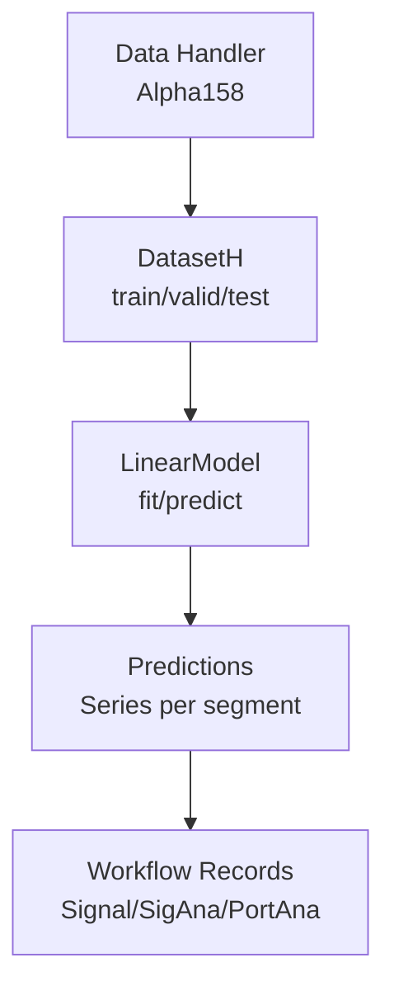
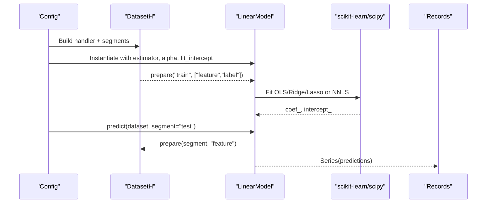
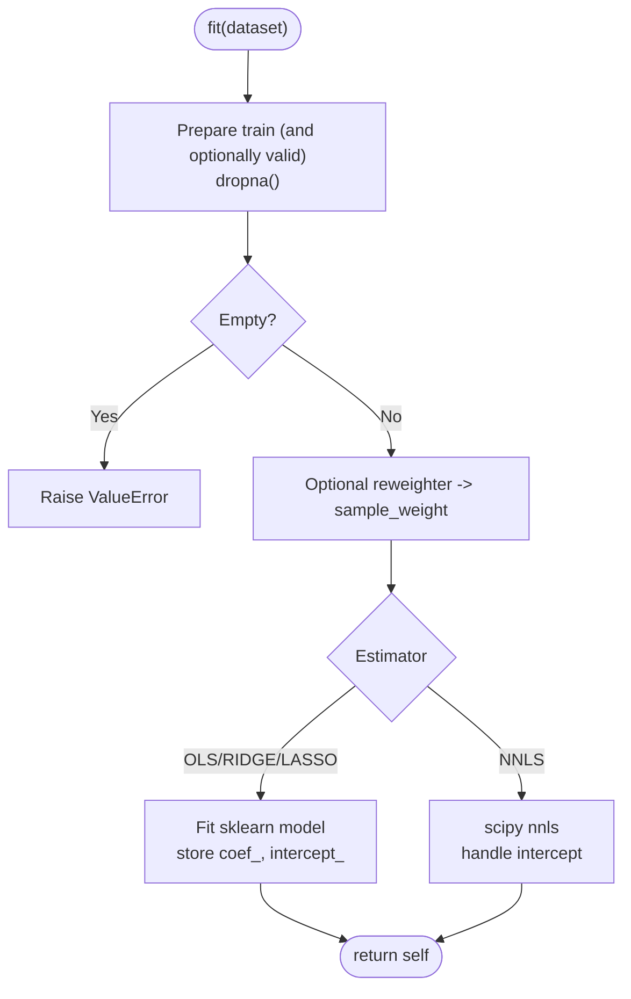
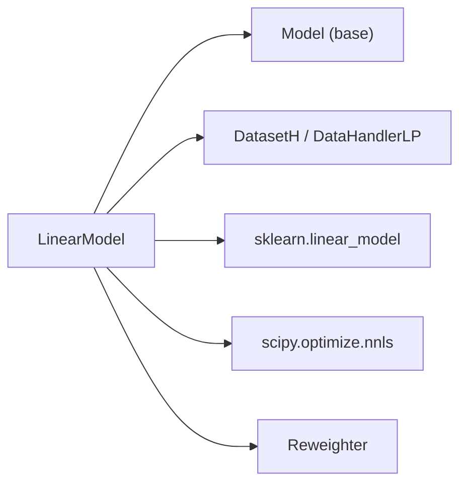

# Linear Regression Models

<cite>
**Referenced Files in This Document**
- [linear.py](file://qlib/contrib/model/linear.py)
- [base.py](file://qlib/model/base.py)
- [handler.py](file://qlib/contrib/data/handler.py)
- [loader.py](file://qlib/contrib/data/loader.py)
- [workflow_config_linear_Alpha158.yaml](file://examples/benchmarks/Linear/workflow_config_linear_Alpha158.yaml)
- [workflow_config_linear_Alpha158_csi500.yaml](file://examples/benchmarks/Linear/workflow_config_linear_Alpha158_csi500.yaml)
- [workflow_config_linear_Alpha158_multi_pass_bt.yaml](file://examples/benchmarks/Linear/workflow_config_linear_Alpha158_multi_pass_bt.yaml)
</cite>

## Table of Contents
1. [Introduction](#introduction)
2. [Project Structure](#project-structure)
3. [Core Components](#core-components)
4. [Architecture Overview](#architecture-overview)
5. [Detailed Component Analysis](#detailed-component-analysis)
6. [Dependency Analysis](#dependency-analysis)
7. [Performance Considerations](#performance-considerations)
8. [Troubleshooting Guide](#troubleshooting-guide)
9. [Conclusion](#conclusion)
10. [Appendices](#appendices)

## Introduction
This document explains QLib’s linear regression models for financial forecasting, focusing on the LinearModel implementation, regularization options, and statistical assumptions. It also covers appropriate use cases (e.g., baseline comparisons, interpretable predictions), configuration examples using Alpha158 features, feature engineering considerations, expected performance relative to more complex models, computational efficiency, and interpretability benefits.

## Project Structure
QLib provides a modular pipeline: data handlers generate features and labels, datasets split time segments, and models implement fit/predict interfaces. The linear model is implemented as a lightweight estimator that integrates with QLib’s dataset and workflow.

**Diagram sources**
- [handler.py:98-152](file://qlib/contrib/data/handler.py#L98-L152)
- [loader.py:61-200](file://qlib/contrib/data/loader.py#L61-L200)
- [linear.py:17-114](file://qlib/contrib/model/linear.py#L17-L114)
- [workflow_config_linear_Alpha158.yaml:44-77](file://examples/benchmarks/Linear/workflow_config_linear_Alpha158.yaml#L44-L77)

**Section sources**
- [handler.py:98-152](file://qlib/contrib/data/handler.py#L98-L152)
- [loader.py:61-200](file://qlib/contrib/data/loader.py#L61-L200)
- [linear.py:17-114](file://qlib/contrib/model/linear.py#L17-L114)
- [workflow_config_linear_Alpha158.yaml:44-77](file://examples/benchmarks/Linear/workflow_config_linear_Alpha158.yaml#L44-L77)

## Core Components
- LinearModel: Implements OLS, NNLS, Ridge, Lasso via scikit-learn and scipy; supports optional intercept fitting, validation inclusion, and sample reweighting.
- Model base class: Defines the contract for fit/predict used by workflows.
- Data handlers: Alpha158 constructs standardized price/volume/rolling features; label is next-day return over two days.
- Workflow configs: Demonstrate end-to-end training and evaluation with signal and portfolio analysis records.

Key responsibilities:
- Feature preparation and normalization are handled by handlers and processors.
- Training uses efficient linear solvers; prediction is a matrix multiply plus intercept.
- Configuration drives estimator choice, regularization strength, and whether to include validation in training.

**Section sources**
- [linear.py:17-114](file://qlib/contrib/model/linear.py#L17-L114)
- [base.py:22-78](file://qlib/model/base.py#L22-L78)
- [handler.py:98-152](file://qlib/contrib/data/handler.py#L98-L152)
- [workflow_config_linear_Alpha158.yaml:44-77](file://examples/benchmarks/Linear/workflow_config_linear_Alpha158.yaml#L44-L77)

## Architecture Overview
The linear model fits within QLib’s standard modeling loop:

**Diagram sources**
- [linear.py:58-114](file://qlib/contrib/model/linear.py#L58-L114)
- [base.py:22-78](file://qlib/model/base.py#L22-L78)
- [workflow_config_linear_Alpha158.yaml:44-77](file://examples/benchmarks/Linear/workflow_config_linear_Alpha158.yaml#L44-L77)

## Detailed Component Analysis

### LinearModel Implementation
- Estimators supported:
  - OLS: Ordinary least squares via scikit-learn LinearRegression.
  - Ridge: L2 regularization via Ridge; controls overfitting with alpha.
  - Lasso: L1 regularization via Lasso; promotes sparsity with alpha.
  - NNLS: Non-negative least squares via scipy.nnls; enforces non-negative coefficients.
- Parameters:
  - estimator: selects algorithm.
  - alpha: regularization strength (only for Ridge/Lasso).
  - fit_intercept: whether to learn an intercept term.
  - include_valid: whether to concatenate validation data into training before fitting.
- Training flow:
  - Extract features and labels from DatasetH for train (optionally valid).
  - Drop missing values; raise error if empty.
  - Optional sample weights via Reweighter.
  - Fit chosen estimator; store coef_ and intercept_.
- Prediction flow:
  - Prepare features for requested segment.
  - Compute dot product with coef_ and add intercept_; return pandas Series aligned to index.

**Diagram sources**
- [linear.py:58-107](file://qlib/contrib/model/linear.py#L58-L107)

**Section sources**
- [linear.py:17-114](file://qlib/contrib/model/linear.py#L17-L114)

### Statistical Assumptions and Interpretation
- OLS minimizes squared residuals; assumes linear relationship between features and label.
- Ridge adds L2 penalty to reduce variance and handle multicollinearity.
- Lasso adds L1 penalty to encourage sparse solutions and feature selection.
- NNLS constrains coefficients to be non-negative; useful when positive contributions are required.
- Predictions are linear combinations of features plus intercept; coefficients provide direct interpretability of feature impact.

[No sources needed since this section summarizes conceptual assumptions]

### Use Cases
- Baseline comparisons: Quick, stable reference against tree-based or deep learning models.
- Interpretable signals: Coefficients reveal direction and magnitude of feature effects.
- Fast iteration: Minimal tuning and fast training make it suitable for prototyping and ablation studies.

[No sources needed since this section provides general guidance]

### Configuration Examples
- Basic Alpha158 setup with OLS:
  - See [workflow_config_linear_Alpha158.yaml:44-77](file://examples/benchmarks/Linear/workflow_config_linear_Alpha158.yaml#L44-L77)
- CSI500 market variant:
  - See [workflow_config_linear_Alpha158_csi500.yaml:44-77](file://examples/benchmarks/Linear/workflow_config_linear_Alpha158_csi500.yaml#L44-L77)
- Multi-pass backtesting record:
  - See [workflow_config_linear_Alpha158_multi_pass_bt.yaml:46-79](file://examples/benchmarks/Linear/workflow_config_linear_Alpha158_multi_pass_bt.yaml#L46-L79)

Typical settings:
- estimator: "ols", "ridge", "lasso", or "nnls"
- alpha: regularization strength (for ridge/lasso)
- fit_intercept: true/false
- include_valid: true/false (to merge validation into training)

**Section sources**
- [workflow_config_linear_Alpha158.yaml:44-77](file://examples/benchmarks/Linear/workflow_config_linear_Alpha158.yaml#L44-L77)
- [workflow_config_linear_Alpha158_csi500.yaml:44-77](file://examples/benchmarks/Linear/workflow_config_linear_Alpha158_csi500.yaml#L44-L77)
- [workflow_config_linear_Alpha158_multi_pass_bt.yaml:46-79](file://examples/benchmarks/Linear/workflow_config_linear_Alpha158_multi_pass_bt.yaml#L46-L79)

### Feature Engineering Considerations
- Alpha158 features:
  - Price ratios and returns normalized by close price.
  - Rolling statistics (ROC, MA, STD, slope, R-squared, residuals, quantiles, ranks).
  - K-bar derived features capturing intraday patterns.
- Label:
  - Two-day forward return computed as Ref($close, -2)/$close - 1.
- Preprocessing:
  - RobustZScoreNorm and Fillna applied to features.
  - CSRankNorm applied to labels during learning phase.

These steps improve numerical stability and comparability across instruments.

**Section sources**
- [handler.py:98-152](file://qlib/contrib/data/handler.py#L98-L152)
- [loader.py:61-200](file://qlib/contrib/data/loader.py#L61-L200)

### Performance Expectations vs. Complex Models
- Strengths:
  - Very fast training and inference; low memory footprint.
  - Transparent coefficients aid interpretation and debugging.
  - Stable baselines; less prone to overfitting with regularization.
- Limitations:
  - Captures only linear relationships; may underperform nonlinear models (e.g., LightGBM, XGBoost, MLP, LSTM) on complex patterns.
  - Sensitive to feature scaling and multicollinearity; regularization helps but does not fully resolve nonlinearity.

[No sources needed since this section provides general guidance]

## Dependency Analysis
LinearModel depends on:
- QLib Model base class for interface consistency.
- DatasetH/DataHandlerLP for data access and segmentation.
- scikit-learn estimators (LinearRegression, Ridge, Lasso) and scipy.nnls for solving.
- Reweighter for optional sample weighting.

**Diagram sources**
- [linear.py:1-14](file://qlib/contrib/model/linear.py#L1-L14)
- [base.py:22-78](file://qlib/model/base.py#L22-L78)

**Section sources**
- [linear.py:1-14](file://qlib/contrib/model/linear.py#L1-L14)
- [base.py:22-78](file://qlib/model/base.py#L22-L78)

## Performance Considerations
- Computational efficiency:
  - OLS/Ridge/Lasso use optimized linear algebra routines; NNLS uses scipy’s specialized solver.
  - Matrix multiplication in predict is highly efficient; minimal overhead beyond data preparation.
- Memory usage:
  - No large model artifacts; stores only coefficients and intercept.
- Scalability:
  - Suitable for high-dimensional feature sets typical in Alpha158; consider dimensionality reduction or feature selection if needed.
- Regularization tuning:
  - Ridge/Lasso alpha should be tuned via cross-validation or workflow tools to balance bias-variance trade-off.

[No sources needed since this section provides general guidance]

## Troubleshooting Guide
Common issues and resolutions:
- Empty training data after dropna:
  - Ensure sufficient non-missing samples; check preprocessing and label generation.
- Unsupported estimator or alpha misuse:
  - Only Ridge/Lasso support alpha; ensure estimator matches constraints.
- Missing coefficient error on predict:
  - Fit must be called before predicting; verify workflow order.
- NNLS with sample weights:
  - Not currently supported; remove reweighter or switch to OLS/Ridge/Lasso if weights are essential.

**Section sources**
- [linear.py:47-51](file://qlib/contrib/model/linear.py#L47-L51)
- [linear.py:66-69](file://qlib/contrib/model/linear.py#L66-L69)
- [linear.py:96-99](file://qlib/contrib/model/linear.py#L96-L99)
- [linear.py:109-113](file://qlib/contrib/model/linear.py#L109-L113)

## Conclusion
QLib’s LinearModel offers a fast, interpretable baseline for financial forecasting using standardized Alpha158 features. With options for OLS, Ridge, Lasso, and NNLS, it supports flexible regularization and non-negativity constraints. While it may not match the predictive power of nonlinear models on complex patterns, its speed, transparency, and stability make it ideal for baselines, ablations, and scenarios where interpretability is paramount. Proper feature engineering and regularization tuning can further enhance performance.

[No sources needed since this section summarizes without analyzing specific files]

## Appendices

### API Reference Summary
- LinearModel.fit(dataset, reweighter=None): Trains the model on prepared data; supports optional validation inclusion and reweighting.
- LinearModel.predict(dataset, segment="test"): Returns predictions as a pandas Series aligned to the dataset index.
- Parameters:
  - estimator: "ols", "ridge", "lasso", "nnls"
  - alpha: float (regularization strength for ridge/lasso)
  - fit_intercept: bool
  - include_valid: bool

**Section sources**
- [linear.py:17-114](file://qlib/contrib/model/linear.py#L17-L114)
- [base.py:22-78](file://qlib/model/base.py#L22-L78)