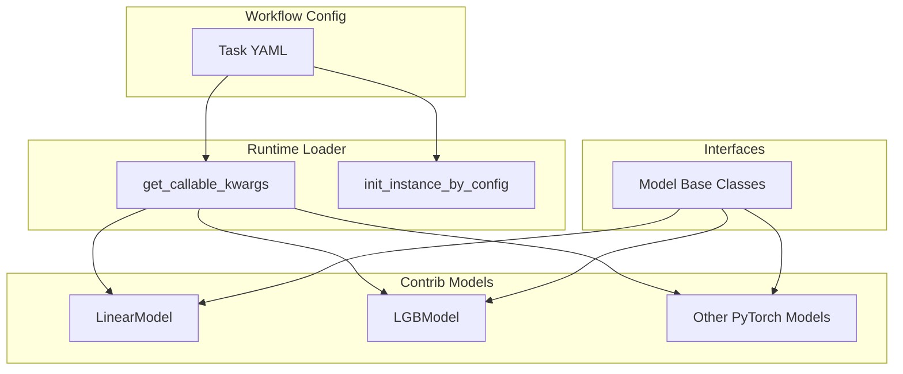
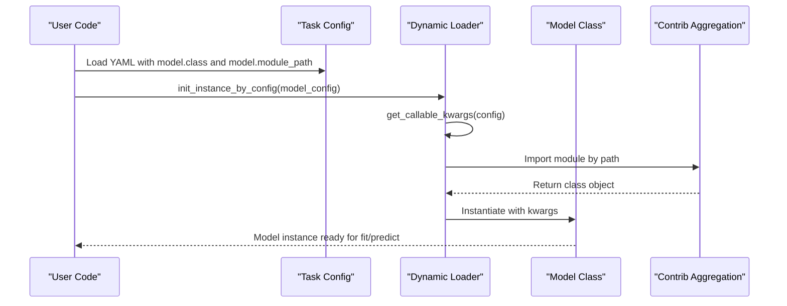
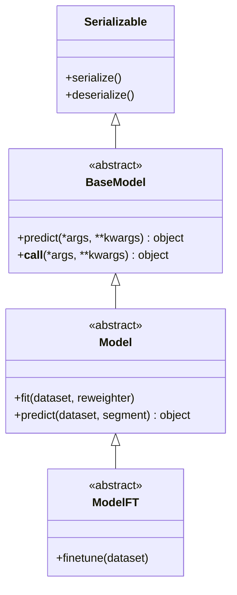
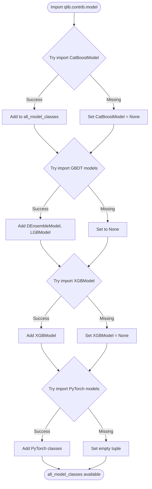
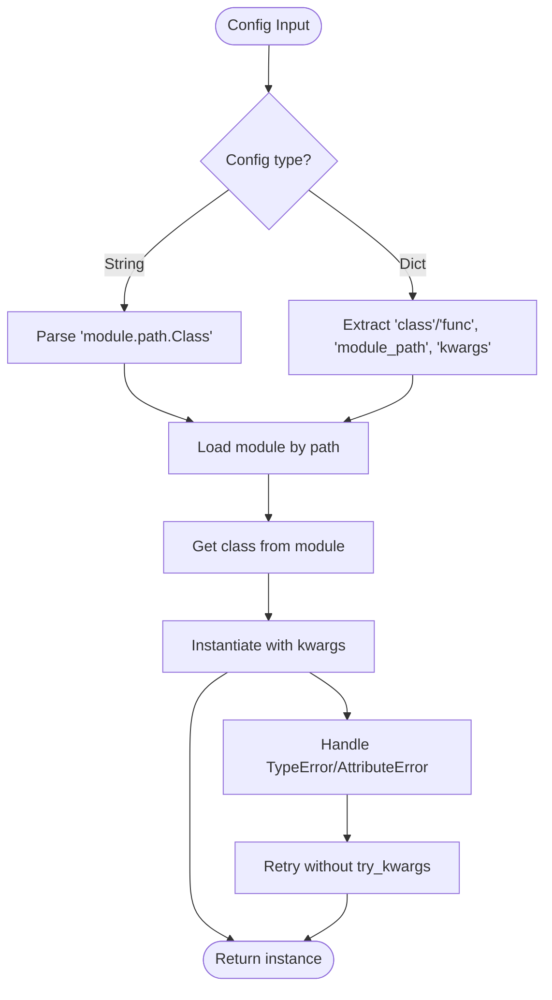
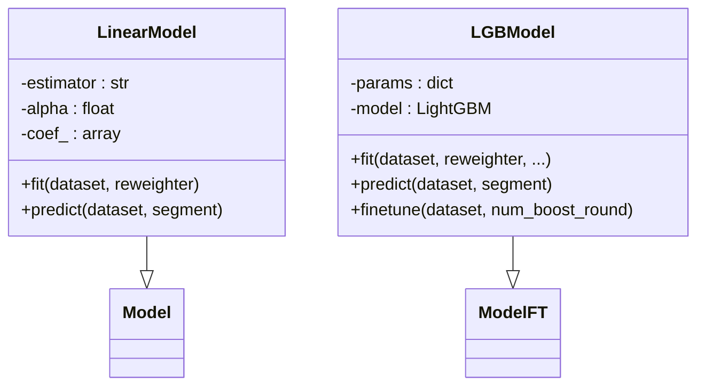
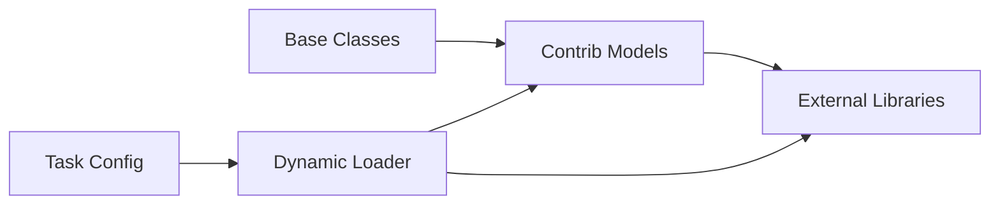

# Model Registration System

<cite>
**Referenced Files in This Document**
- [qlib/model/base.py](file://qlib/model/base.py)
- [qlib/contrib/model/__init__.py](file://qlib/contrib/model/__init__.py)
- [qlib/contrib/model/linear.py](file://qlib/contrib/model/linear.py)
- [qlib/contrib/model/gbdt.py](file://qlib/contrib/model/gbdt.py)
- [qlib/utils/mod.py](file://qlib/utils/mod.py)
- [qlib/workflow/task/gen.py](file://qlib/workflow/task/gen.py)
- [examples/benchmarks/LightGBM/workflow_config_lightgbm_Alpha158.yaml](file://examples/benchmarks/LightGBM/workflow_config_lightgbm_Alpha158.yaml)
</cite>

## Table of Contents
1. [Introduction](#introduction)
2. [Project Structure](#project-structure)
3. [Core Components](#core-components)
4. [Architecture Overview](#architecture-overview)
5. [Detailed Component Analysis](#detailed-component-analysis)
6. [Dependency Analysis](#dependency-analysis)
7. [Performance Considerations](#performance-considerations)
8. [Troubleshooting Guide](#troubleshooting-guide)
9. [Conclusion](#conclusion)

## Introduction
This document explains QLib’s model registration and loading system that enables dynamic discovery and instantiation of models at runtime. It covers:
- How models are registered through the contrib module with graceful handling of optional dependencies
- The base model interface that all models implement
- Configuration-driven instantiation via a registry-like mechanism
- Workflow integration for seamless model switching
- Error handling for missing dependencies and misconfigurations
- Examples for registering custom models and troubleshooting common issues

## Project Structure
QLib separates concerns into three main areas relevant to model registration and loading:
- Base interfaces define the contract for models (fit, predict, finetune)
- Contrib module aggregates available models and handles optional dependencies
- Utility functions parse configuration strings/dicts to dynamically import classes and instantiate them
- Workflow task definitions reference models by class name and module path, enabling declarative switching

**Diagram sources**
- [qlib/model/base.py:10-111](file://qlib/model/base.py#L10-L111)
- [qlib/contrib/model/__init__.py:1-44](file://qlib/contrib/model/__init__.py#L1-L44)
- [qlib/utils/mod.py:67-184](file://qlib/utils/mod.py#L67-L184)
- [examples/benchmarks/LightGBM/workflow_config_lightgbm_Alpha158.yaml:31-44](file://examples/benchmarks/LightGBM/workflow_config_lightgbm_Alpha158.yaml#L31-L44)

**Section sources**
- [qlib/model/base.py:10-111](file://qlib/model/base.py#L10-L111)
- [qlib/contrib/model/__init__.py:1-44](file://qlib/contrib/model/__init__.py#L1-L44)
- [qlib/utils/mod.py:67-184](file://qlib/utils/mod.py#L67-L184)
- [examples/benchmarks/LightGBM/workflow_config_lightgbm_Alpha158.yaml:31-44](file://examples/benchmarks/LightGBM/workflow_config_lightgbm_Alpha158.yaml#L31-L44)

## Core Components
- Base model interface: defines fit, predict, and optional finetune contracts
- Contrib model aggregation: imports models and gracefully degrades when optional dependencies are missing
- Dynamic loader: parses configuration to locate and instantiate model classes
- Workflow task config: declares which model to use via class name and module path

Key responsibilities:
- Base classes ensure consistent training and prediction APIs across models
- Contrib module centralizes availability checks and exposes a unified list of models
- Loader supports both string and dict configurations, with fallbacks for compatibility
- Task configs enable switching models without code changes

**Section sources**
- [qlib/model/base.py:10-111](file://qlib/model/base.py#L10-L111)
- [qlib/contrib/model/__init__.py:1-44](file://qlib/contrib/model/__init__.py#L1-L44)
- [qlib/utils/mod.py:67-184](file://qlib/utils/mod.py#L67-L184)
- [qlib/workflow/task/gen.py:239-272](file://qlib/workflow/task/gen.py#L239-L272)

## Architecture Overview
The system uses a configuration-driven approach to discover and instantiate models at runtime. A typical workflow:
1. A task YAML specifies the model class and module path
2. The loader resolves the class from the module path
3. The class is instantiated with provided kwargs
4. The model implements fit/predict according to the base interface
5. Optional dependencies are handled gracefully in the contrib layer

**Diagram sources**
- [qlib/utils/mod.py:67-184](file://qlib/utils/mod.py#L67-L184)
- [examples/benchmarks/LightGBM/workflow_config_lightgbm_Alpha158.yaml:31-44](file://examples/benchmarks/LightGBM/workflow_config_lightgbm_Alpha158.yaml#L31-L44)
- [qlib/contrib/model/__init__.py:1-44](file://qlib/contrib/model/__init__.py#L1-L44)

## Detailed Component Analysis

### Base Model Interface
Defines the standard API for all models:
- BaseModel: abstract predict method and callable wrapper
- Model: adds fit and abstract predict with dataset and segment support
- ModelFT: adds finetune capability for incremental training workflows

**Diagram sources**
- [qlib/model/base.py:10-111](file://qlib/model/base.py#L10-L111)

**Section sources**
- [qlib/model/base.py:10-111](file://qlib/model/base.py#L10-L111)

### Contrib Module Registration
Aggregates available models and handles optional dependencies:
- Imports each model class within try-except blocks
- Sets missing classes to None with informative messages
- Exposes a combined tuple of all model classes for introspection

**Diagram sources**
- [qlib/contrib/model/__init__.py:1-44](file://qlib/contrib/model/__init__.py#L1-L44)

**Section sources**
- [qlib/contrib/model/__init__.py:1-44](file://qlib/contrib/model/__init__.py#L1-L44)

### Dynamic Loading Mechanism
Resolves classes from configuration and instantiates them:
- Supports both string format ("module.path.ClassName") and dict format with class/module_path/kwargs
- Uses split_module_path to separate module path from class name
- Falls back to default module if no path specified
- Handles TypeError during instantiation for backward compatibility

**Diagram sources**
- [qlib/utils/mod.py:67-184](file://qlib/utils/mod.py#L67-L184)

**Section sources**
- [qlib/utils/mod.py:67-184](file://qlib/utils/mod.py#L67-L184)

### Workflow Integration
Task configurations declare models declaratively:
- YAML files specify model class and module path under task.model
- Dataset and handler configurations follow similar patterns
- Task generators can create rolling tasks with different segments

Example task structure shows how models are referenced:
- model.class: "LGBModel"
- model.module_path: "qlib.contrib.model.gbdt"
- model.kwargs: hyperparameters for the model

**Section sources**
- [qlib/workflow/task/gen.py:239-272](file://qlib/workflow/task/gen.py#L239-L272)
- [examples/benchmarks/LightGBM/workflow_config_lightgbm_Alpha158.yaml:31-44](file://examples/benchmarks/LightGBM/workflow_config_lightgbm_Alpha158.yaml#L31-L44)

### Example Model Implementations

#### LinearModel
Implements linear regression variants (OLS, Ridge, Lasso, NNLS):
- Inherits from Model base class
- Supports weighted training via Reweighter
- Validates input data and handles edge cases

#### LGBModel
Implements LightGBM with fine-tuning capabilities:
- Inherits from ModelFT for incremental training
- Integrates with QLib's workflow for metric logging
- Supports early stopping and evaluation callbacks

**Diagram sources**
- [qlib/contrib/model/linear.py:17-114](file://qlib/contrib/model/linear.py#L17-L114)
- [qlib/contrib/model/gbdt.py:16-127](file://qlib/contrib/model/gbdt.py#L16-L127)

**Section sources**
- [qlib/contrib/model/linear.py:17-114](file://qlib/contrib/model/linear.py#L17-L114)
- [qlib/contrib/model/gbdt.py:16-127](file://qlib/contrib/model/gbdt.py#L16-L127)

## Dependency Analysis
The model system has clear dependency boundaries:
- Base classes have minimal dependencies (Dataset, Reweighter)
- Contrib models depend on specific libraries (scikit-learn, lightgbm, pytorch)
- Loader depends on Python's import system and utility functions
- Workflow components depend on configuration parsing utilities

**Diagram sources**
- [qlib/model/base.py:10-111](file://qlib/model/base.py#L10-L111)
- [qlib/contrib/model/__init__.py:1-44](file://qlib/contrib/model/__init__.py#L1-L44)
- [qlib/utils/mod.py:67-184](file://qlib/utils/mod.py#L67-L184)

**Section sources**
- [qlib/model/base.py:10-111](file://qlib/model/base.py#L10-L111)
- [qlib/contrib/model/__init__.py:1-44](file://qlib/contrib/model/__init__.py#L1-L44)
- [qlib/utils/mod.py:67-184](file://qlib/utils/mod.py#L67-L184)

## Performance Considerations
- Lazy loading: Models are only imported when needed, reducing startup time
- Optional dependencies: Missing libraries don't prevent core functionality
- Configuration caching: Repeated instantiation of the same model class is efficient
- Dataset preparation: Efficient data handling through DatasetH abstraction

## Troubleshooting Guide

### Common Issues and Solutions

#### Missing Dependencies
Symptoms:
- ImportError or ModuleNotFoundError when importing models
- Warning messages about skipped models

Solutions:
- Install required packages (e.g., lightgbm, xgboost, torch)
- Check contrib module initialization for error messages
- Verify environment setup matches model requirements

#### Configuration Errors
Symptoms:
- AttributeError when resolving class names
- TypeError during model instantiation

Solutions:
- Verify module paths are correct and accessible
- Check class names match actual implementations
- Ensure kwargs match constructor signatures
- Use absolute module paths for clarity

#### Data Validation Errors
Symptoms:
- ValueError for empty datasets
- Shape mismatch errors during training

Solutions:
- Validate dataset segments and data availability
- Check feature and label column names
- Ensure proper data preprocessing

**Section sources**
- [qlib/contrib/model/__init__.py:3-44](file://qlib/contrib/model/__init__.py#L3-L44)
- [qlib/utils/mod.py:91-116](file://qlib/utils/mod.py#L91-L116)
- [qlib/contrib/model/linear.py:58-83](file://qlib/contrib/model/linear.py#L58-L83)

## Conclusion
QLib's model registration system provides a flexible, configuration-driven approach to model management. The separation of base interfaces, contrib aggregation, and dynamic loading enables:
- Easy addition of new models through simple registration
- Graceful handling of optional dependencies
- Seamless model switching through configuration changes
- Consistent APIs across different model implementations

This design promotes modularity, maintainability, and extensibility while providing robust error handling for production environments.