# Model Zoo

<cite>
**Referenced Files in This Document**
- [__init__.py](file://qlib/contrib/model/__init__.py)
- [gbdt.py](file://qlib/contrib/model/gbdt.py)
- [xgboost.py](file://qlib/contrib/model/xgboost.py)
- [catboost_model.py](file://qlib/contrib/model/catboost_model.py)
- [pytorch_lstm.py](file://qlib/contrib/model/pytorch_lstm.py)
- [pytorch_gru.py](file://qlib/contrib/model/pytorch_gru.py)
- [pytorch_alstm.py](file://qlib/contrib/model/pytorch_alstm.py)
- [pytorch_gats.py](file://qlib/contrib/model/pytorch_gats.py)
- [pytorch_transformer.py](file://qlib/contrib/model/pytorch_transformer.py)
- [pytorch_tra.py](file://qlib/contrib/model/pytorch_tra.py)
- [workflow_config_lightgbm_Alpha158.yaml](file://examples/benchmarks/LightGBM/workflow_config_lightgbm_Alpha158.yaml)
- [workflow_config_xgboost_Alpha158.yaml](file://examples/benchmarks/XGBoost/workflow_config_xgboost_Alpha158.yaml)
- [workflow_config_catboost_Alpha158.yaml](file://examples/benchmarks/CatBoost/workflow_config_catboost_Alpha158.yaml)
- [workflow_config_alstm_Alpha158.yaml](file://examples/benchmarks/ALSTM/workflow_config_alstm_Alpha158.yaml)
- [workflow_config_transformer_Alpha158.yaml](file://examples/benchmarks/Transformer/workflow_config_transformer_Alpha158.yaml)
</cite>

## Table of Contents
1. Introduction
2. Project Structure
3. Core Components
4. Architecture Overview
5. Detailed Component Analysis
6. Dependency Analysis
7. Performance Considerations
8. Troubleshooting Guide
9. Conclusion
10. Appendices

## Introduction
This document provides a comprehensive guide to QLib’s model zoo, covering tree-based models (LightGBM, XGBoost, CatBoost) and neural network models implemented in PyTorch (LSTM, GRU, Transformer, ALSTM, GATs, TRa). It explains how models are registered and exposed through the workflow system, details configuration parameters and hyperparameters, outlines performance characteristics, and offers practical guidance for selecting and running models based on data characteristics and computational constraints.

## Project Structure
QLib organizes models under qlib/contrib/model with each algorithm implemented as a class that integrates with the dataset and workflow systems. Example workflows in examples/benchmarks demonstrate how to configure and run models via YAML task definitions.

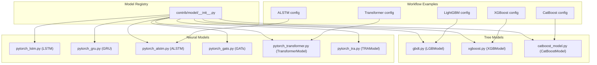

**Diagram sources**
- [__init__.py:1-44](file://qlib/contrib/model/__init__.py#L1-L44)
- [gbdt.py:16-127](file://qlib/contrib/model/gbdt.py#L16-L127)
- [xgboost.py:15-86](file://qlib/contrib/model/xgboost.py#L15-L86)
- [catboost_model.py:17-101](file://qlib/contrib/model/catboost_model.py#L17-L101)
- [pytorch_lstm.py:24-307](file://qlib/contrib/model/pytorch_lstm.py#L24-L307)
- [pytorch_gru.py:25-340](file://qlib/contrib/model/pytorch_gru.py#L25-L340)
- [pytorch_alstm.py:25-345](file://qlib/contrib/model/pytorch_alstm.py#L25-L345)
- [pytorch_gats.py:26-385](file://qlib/contrib/model/pytorch_gats.py#L26-L385)
- [pytorch_transformer.py:27-286](file://qlib/contrib/model/pytorch_transformer.py#L27-L286)
- [pytorch_tra.py:33-511](file://qlib/contrib/model/pytorch_tra.py#L33-L511)
- [workflow_config_lightgbm_Alpha158.yaml:31-72](file://examples/benchmarks/LightGBM/workflow_config_lightgbm_Alpha158.yaml#L31-L72)
- [workflow_config_xgboost_Alpha158.yaml:31-70](file://examples/benchmarks/XGBoost/workflow_config_xgboost_Alpha158.yaml#L31-L70)
- [workflow_config_catboost_Alpha158.yaml:31-71](file://examples/benchmarks/CatBoost/workflow_config_catboost_Alpha158.yaml#L31-L71)
- [workflow_config_alstm_Alpha158.yaml:53-99](file://examples/benchmarks/ALSTM/workflow_config_alstm_Alpha158.yaml#L53-L99)
- [workflow_config_transformer_Alpha158.yaml:53-88](file://examples/benchmarks/Transformer/workflow_config_transformer_Alpha158.yaml#L53-L88)

**Section sources**
- [__init__.py:1-44](file://qlib/contrib/model/__init__.py#L1-L44)
- [workflow_config_lightgbm_Alpha158.yaml:1-72](file://examples/benchmarks/LightGBM/workflow_config_lightgbm_Alpha158.yaml#L1-L72)
- [workflow_config_xgboost_Alpha158.yaml:1-70](file://examples/benchmarks/XGBoost/workflow_config_xgboost_Alpha158.yaml#L1-L70)
- [workflow_config_catboost_Alpha158.yaml:1-71](file://examples/benchmarks/CatBoost/workflow_config_catboost_Alpha158.yaml#L1-L71)
- [workflow_config_alstm_Alpha158.yaml:1-99](file://examples/benchmarks/ALSTM/workflow_config_alstm_Alpha158.yaml#L1-L99)
- [workflow_config_transformer_Alpha158.yaml:1-88](file://examples/benchmarks/Transformer/workflow_config_transformer_Alpha158.yaml#L1-L88)

## Core Components
- Tree-based models:
  - LightGBM (LGBModel): Gradient boosting with configurable objective, early stopping, and optional reweighting.
  - XGBoost (XGBModel): Gradient boosting with DMatrix inputs, early stopping, and feature importance utilities.
  - CatBoost (CatBoostModel): Gradient boosting with automatic GPU detection and built-in regularization options.
- Neural network models (PyTorch):
  - LSTM: Sequence modeling with configurable layers, dropout, optimizer, loss, batch size, and early stopping.
  - GRU: Similar to LSTM with gating mechanisms; supports training loops, evaluation, and saving best models.
  - ALSTM: Attention-augmented LSTM/GRU with attention over time steps and concatenation of last hidden state.
  - GATs: Graph attention mechanism over sequence representations using RNN backbones (LSTM/GRU), with optional pretrained base model loading.
  - Transformer: Standard transformer encoder with positional encoding and linear output head.
  - TRa (Temporal Routing Adaptor): Multi-predictor routing with optional optimal transport, supporting RNN or Transformer backbones and advanced memory modes.

Key integration points:
- All models implement fit/predict interfaces compatible with DatasetH/TSDatasetH.
- Models support early stopping, logging, and saving best checkpoints.
- Some models integrate with QLib’s workflow recorder for metrics logging.

**Section sources**
- [gbdt.py:16-127](file://qlib/contrib/model/gbdt.py#L16-L127)
- [xgboost.py:15-86](file://qlib/contrib/model/xgboost.py#L15-L86)
- [catboost_model.py:17-101](file://qlib/contrib/model/catboost_model.py#L17-L101)
- [pytorch_lstm.py:24-307](file://qlib/contrib/model/pytorch_lstm.py#L24-L307)
- [pytorch_gru.py:25-340](file://qlib/contrib/model/pytorch_gru.py#L25-L340)
- [pytorch_alstm.py:25-345](file://qlib/contrib/model/pytorch_alstm.py#L25-L345)
- [pytorch_gats.py:26-385](file://qlib/contrib/model/pytorch_gats.py#L26-L385)
- [pytorch_transformer.py:27-286](file://qlib/contrib/model/pytorch_transformer.py#L27-L286)
- [pytorch_tra.py:33-511](file://qlib/contrib/model/pytorch_tra.py#L33-L511)

## Architecture Overview
The model zoo is exposed via a central registry that conditionally imports available models and aggregates them into a tuple for discovery by the workflow system. Each model adheres to a common interface and integrates with QLib’s dataset abstractions and workflow recording.

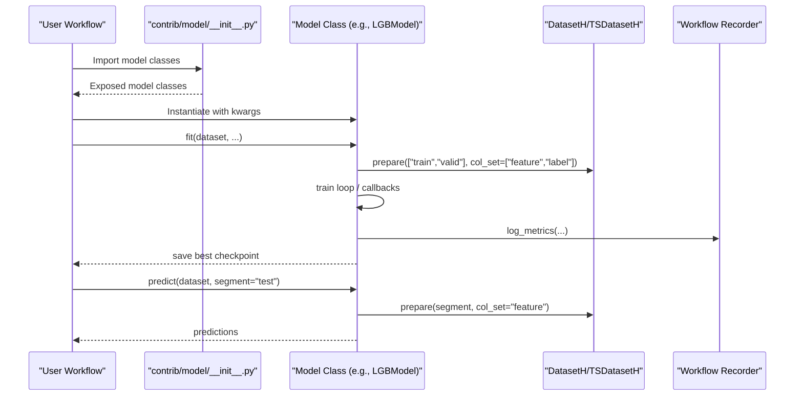

**Diagram sources**
- [__init__.py:1-44](file://qlib/contrib/model/__init__.py#L1-L44)
- [gbdt.py:57-96](file://qlib/contrib/model/gbdt.py#L57-L96)
- [xgboost.py:23-75](file://qlib/contrib/model/xgboost.py#L23-L75)
- [catboost_model.py:28-84](file://qlib/contrib/model/catboost_model.py#L28-L84)
- [pytorch_lstm.py:204-283](file://qlib/contrib/model/pytorch_lstm.py#L204-L283)
- [pytorch_gru.py:209-316](file://qlib/contrib/model/pytorch_gru.py#L209-L316)
- [pytorch_alstm.py:209-291](file://qlib/contrib/model/pytorch_alstm.py#L209-L291)
- [pytorch_gats.py:224-323](file://qlib/contrib/model/pytorch_gats.py#L224-L323)
- [pytorch_transformer.py:157-239](file://qlib/contrib/model/pytorch_transformer.py#L157-L239)
- [pytorch_tra.py:416-511](file://qlib/contrib/model/pytorch_tra.py#L416-L511)

## Detailed Component Analysis

### Tree-Based Models

#### LightGBM (LGBModel)
- Purpose: Gradient boosting trees optimized for tabular features; supports binary/mse objectives and early stopping.
- Key parameters:
  - loss: objective function ("mse", "binary")
  - num_boost_round: total boosting iterations
  - early_stopping_rounds: stop if no improvement
  - Additional LightGBM params passed via kwargs (e.g., learning_rate, max_depth, num_leaves, subsample, colsample_bytree, lambda_l1, lambda_l2, num_threads)
- Data handling:
  - Uses DatasetH.prepare to extract features and labels; ensures single-label format.
  - Supports Reweighter for sample weighting.
- Training flow:
  - Constructs lgb.Dataset for train/valid; applies callbacks for early stopping, logging, and evaluation recording.
- Prediction:
  - Returns Series aligned to input index.

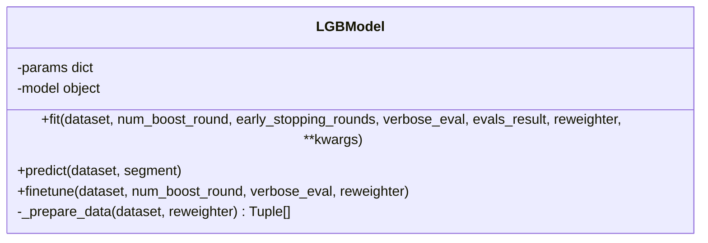

**Diagram sources**
- [gbdt.py:16-127](file://qlib/contrib/model/gbdt.py#L16-L127)

**Section sources**
- [gbdt.py:16-127](file://qlib/contrib/model/gbdt.py#L16-L127)
- [workflow_config_lightgbm_Alpha158.yaml:31-72](file://examples/benchmarks/LightGBM/workflow_config_lightgbm_Alpha158.yaml#L31-L72)

#### XGBoost (XGBModel)
- Purpose: Gradient boosting with robust DMatrix handling; supports early stopping and feature importance.
- Key parameters:
  - Any XGBoost booster params via kwargs (e.g., eval_metric, colsample_bytree, eta, max_depth, n_estimators, subsample, nthread)
  - num_boost_round, early_stopping_rounds, verbose_eval
- Data handling:
  - Prepares train/valid sets; squeezes labels to 1D; supports Reweighter.
- Training flow:
  - Builds DMatrix objects; trains with evals and early stopping; records eval results.
- Prediction:
  - Predicts via DMatrix; returns Series aligned to input index.

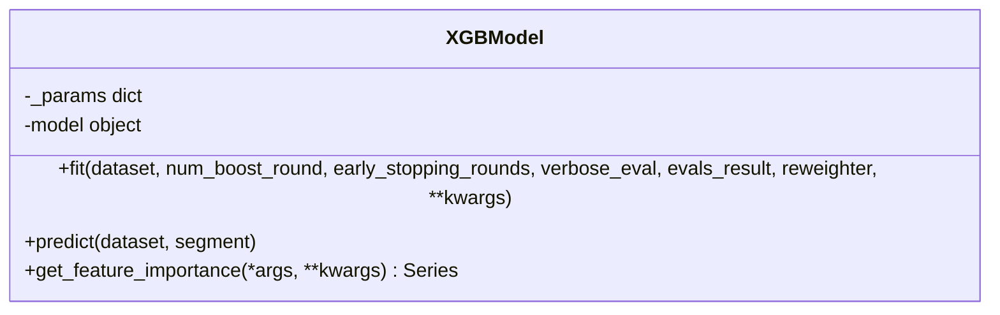

**Diagram sources**
- [xgboost.py:15-86](file://qlib/contrib/model/xgboost.py#L15-L86)

**Section sources**
- [xgboost.py:15-86](file://qlib/contrib/model/xgboost.py#L15-L86)
- [workflow_config_xgboost_Alpha158.yaml:31-70](file://examples/benchmarks/XGBoost/workflow_config_xgboost_Alpha158.yaml#L31-L70)

#### CatBoost (CatBoostModel)
- Purpose: Gradient boosting with automatic GPU detection and rich regularization options.
- Key parameters:
  - loss: "RMSE", "Logloss"
  - Additional CatBoost params via kwargs (e.g., learning_rate, subsample, max_depth, num_leaves, thread_count, grow_policy, bootstrap_type)
  - Iterations and early stopping set internally from fit args
- Data handling:
  - Prepares train/valid; ensures single-label; supports Reweighter.
- Training flow:
  - Creates Pool objects; initializes CatBoost with task_type auto-detected; fits with use_best_model.
- Prediction:
  - Returns Series aligned to input index.

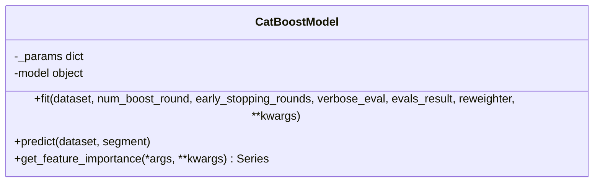

**Diagram sources**
- [catboost_model.py:17-101](file://qlib/contrib/model/catboost_model.py#L17-L101)

**Section sources**
- [catboost_model.py:17-101](file://qlib/contrib/model/catboost_model.py#L17-L101)
- [workflow_config_catboost_Alpha158.yaml:31-71](file://examples/benchmarks/CatBoost/workflow_config_catboost_Alpha158.yaml#L31-L71)

### Neural Network Models

#### LSTM
- Purpose: Sequence modeling using LSTM cells; supports multiple layers, dropout, optimizers, and early stopping.
- Key parameters:
  - d_feat, hidden_size, num_layers, dropout, n_epochs, lr, metric, batch_size, early_stop, loss, optimizer, GPU, seed
- Training flow:
  - Prepares train/valid/test; trains epoch-wise with gradient clipping; saves best model; logs metrics.
- Prediction:
  - Batched inference returning Series aligned to input index.

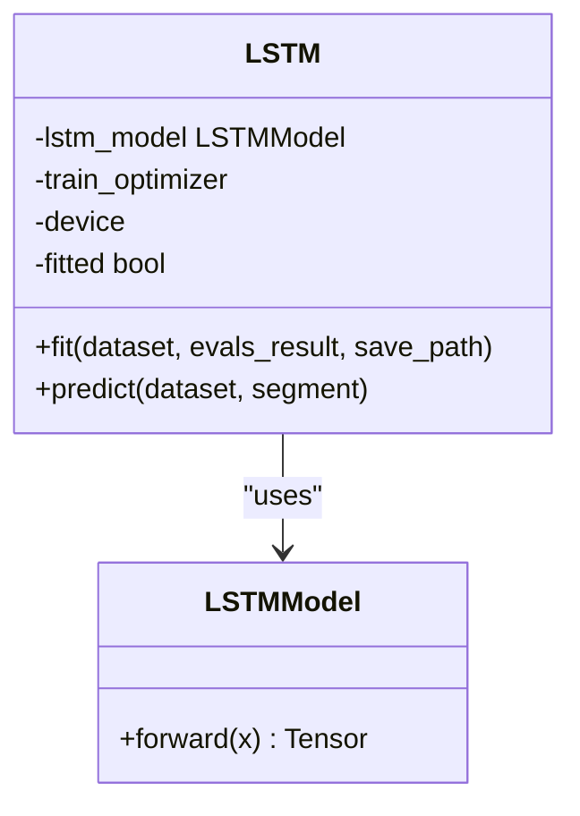

**Diagram sources**
- [pytorch_lstm.py:24-307](file://qlib/contrib/model/pytorch_lstm.py#L24-L307)

**Section sources**
- [pytorch_lstm.py:24-307](file://qlib/contrib/model/pytorch_lstm.py#L24-L307)

#### GRU
- Purpose: Sequence modeling using GRU cells; similar API to LSTM with gated recurrent units.
- Key parameters:
  - d_feat, hidden_size, num_layers, dropout, n_epochs, lr, metric, batch_size, early_stop, loss, optimizer, GPU, seed
- Training flow:
  - Optional validation; early stopping; saves best model; logs metrics via workflow recorder.
- Prediction:
  - Batched inference returning Series aligned to input index.

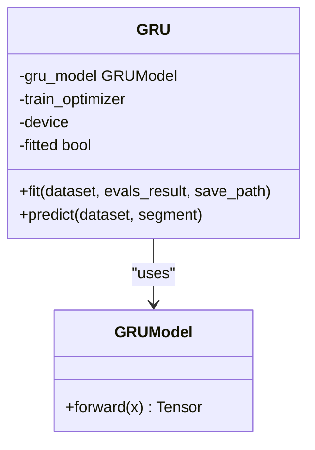

**Diagram sources**
- [pytorch_gru.py:25-340](file://qlib/contrib/model/pytorch_gru.py#L25-L340)

**Section sources**
- [pytorch_gru.py:25-340](file://qlib/contrib/model/pytorch_gru.py#L25-L340)

#### ALSTM (Attention LSTM/GRU)
- Purpose: Combines RNN (LSTM/GRU) with attention over time steps; concatenates last hidden state and attention-aggregated representation.
- Key parameters:
  - d_feat, hidden_size, num_layers, dropout, n_epochs, lr, metric, batch_size, early_stop, loss, optimizer, GPU, seed, rnn_type
- Training flow:
  - Prepares train/valid/test; trains with gradient clipping; saves best model; logs metrics.
- Prediction:
  - Batched inference returning Series aligned to input index.

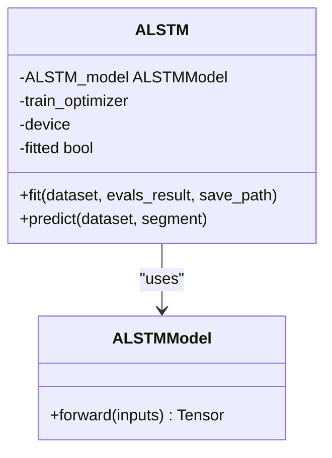

**Diagram sources**
- [pytorch_alstm.py:25-345](file://qlib/contrib/model/pytorch_alstm.py#L25-L345)

**Section sources**
- [pytorch_alstm.py:25-345](file://qlib/contrib/model/pytorch_alstm.py#L25-L345)
- [workflow_config_alstm_Alpha158.yaml:53-99](file://examples/benchmarks/ALSTM/workflow_config_alstm_Alpha158.yaml#L53-L99)

#### GATs (Graph Attention Networks)
- Purpose: Applies graph attention over sequence representations produced by RNN backbones (LSTM/GRU); supports optional pretrained base model loading.
- Key parameters:
  - d_feat, hidden_size, num_layers, dropout, n_epochs, lr, metric, early_stop, loss, base_model ("LSTM"/"GRU"), model_path, optimizer, GPU, seed
- Training flow:
  - Organizes daily batches; trains with gradient clipping; loads pretrained weights if provided; saves best model; logs metrics.
- Prediction:
  - Daily-batch inference returning Series aligned to input index.

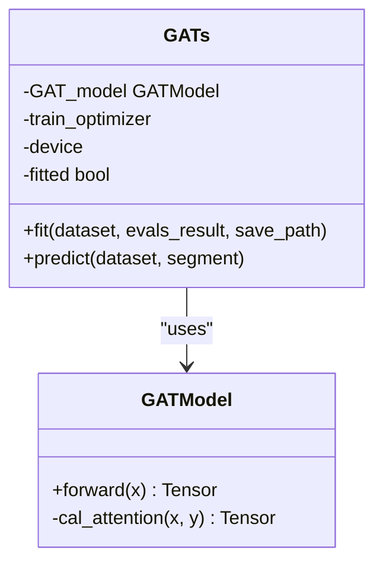

**Diagram sources**
- [pytorch_gats.py:26-385](file://qlib/contrib/model/pytorch_gats.py#L26-L385)

**Section sources**
- [pytorch_gats.py:26-385](file://qlib/contrib/model/pytorch_gats.py#L26-L385)

#### Transformer
- Purpose: Standard transformer encoder with positional encoding and linear output head for sequence prediction.
- Key parameters:
  - d_feat, d_model, batch_size, nhead, num_layers, dropout, n_epochs, lr, metric, early_stop, loss, optimizer, reg, n_jobs, GPU, seed
- Training flow:
  - Prepares train/valid/test; trains with gradient clipping; saves best model; logs metrics.
- Prediction:
  - Batched inference returning Series aligned to input index.

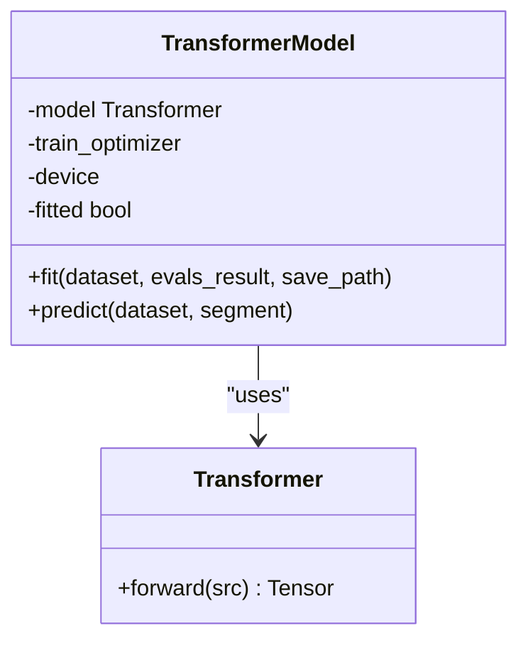

**Diagram sources**
- [pytorch_transformer.py:27-286](file://qlib/contrib/model/pytorch_transformer.py#L27-L286)

**Section sources**
- [pytorch_transformer.py:27-286](file://qlib/contrib/model/pytorch_transformer.py#L27-L286)
- [workflow_config_transformer_Alpha158.yaml:53-88](file://examples/benchmarks/Transformer/workflow_config_transformer_Alpha158.yaml#L53-L88)

#### TRa (Temporal Routing Adaptor)
- Purpose: Routes samples to specialized predictors using a router; supports optimal transport and memory modes; works with RNN or Transformer backbones.
- Key parameters:
  - model_config, tra_config, model_type ("RNN"/"Transformer"), lr, n_epochs, early_stop, update_freq, max_steps_per_epoch, lamb, rho, alpha, seed, logdir, eval_train, eval_test, pretrain, init_state, reset_router, freeze_model, freeze_predictors, transport_method ("none"/"router"/"oracle"), memory_mode ("sample"/"daily")
- Training flow:
  - Initializes backbone and TRA modules; optionally pretrains backbone; trains with transport loss and router regularization; logs metrics and saves artifacts.
- Prediction:
  - Produces per-sample predictions and probabilities; supports returning detailed outputs.

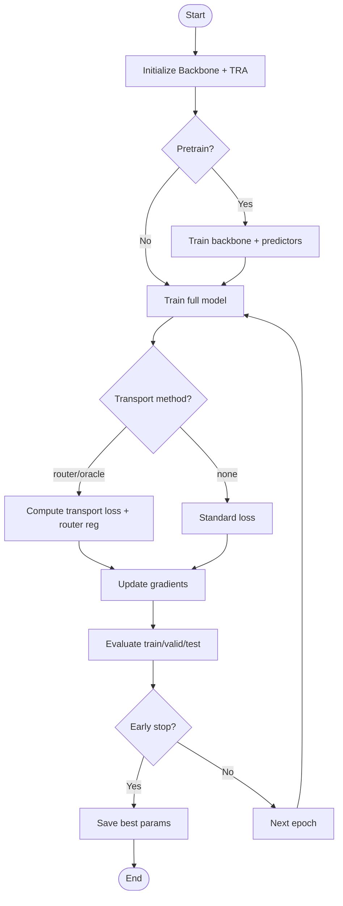

**Diagram sources**
- [pytorch_tra.py:33-511](file://qlib/contrib/model/pytorch_tra.py#L33-L511)

**Section sources**
- [pytorch_tra.py:33-511](file://qlib/contrib/model/pytorch_tra.py#L33-L511)

## Dependency Analysis
- Model registry:
  - Central __init__.py conditionally imports models and aggregates them into all_model_classes for discovery.
- External dependencies:
  - LightGBM, XGBoost, CatBoost for tree models.
  - PyTorch for neural models.
- Dataset integration:
  - All models rely on DatasetH/TSDatasetH to prepare features and labels; some use MTSDatasetH (TRa).
- Workflow integration:
  - Models log metrics via QLib’s workflow recorder; configurations specify record tasks for signal analysis and portfolio analysis.

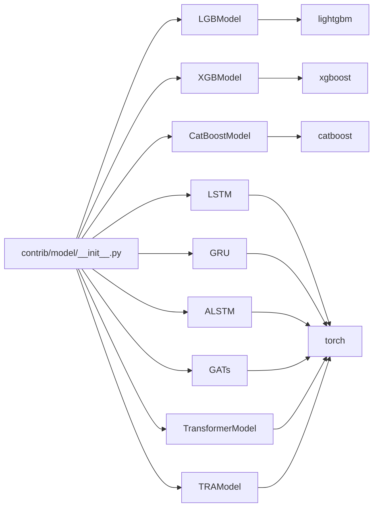

**Diagram sources**
- [__init__.py:1-44](file://qlib/contrib/model/__init__.py#L1-L44)
- [gbdt.py:1-127](file://qlib/contrib/model/gbdt.py#L1-L127)
- [xgboost.py:1-86](file://qlib/contrib/model/xgboost.py#L1-L86)
- [catboost_model.py:1-101](file://qlib/contrib/model/catboost_model.py#L1-L101)
- [pytorch_lstm.py:1-307](file://qlib/contrib/model/pytorch_lstm.py#L1-L307)
- [pytorch_gru.py:1-340](file://qlib/contrib/model/pytorch_gru.py#L1-L340)
- [pytorch_alstm.py:1-345](file://qlib/contrib/model/pytorch_alstm.py#L1-L345)
- [pytorch_gats.py:1-385](file://qlib/contrib/model/pytorch_gats.py#L1-L385)
- [pytorch_transformer.py:1-286](file://qlib/contrib/model/pytorch_transformer.py#L1-L286)
- [pytorch_tra.py:1-511](file://qlib/contrib/model/pytorch_tra.py#L1-L511)

**Section sources**
- [__init__.py:1-44](file://qlib/contrib/model/__init__.py#L1-L44)

## Performance Considerations
- Tree-based models:
  - LightGBM: Fast training, good scalability; tune learning_rate, max_depth, num_leaves, subsample, colsample_bytree; early stopping prevents overfitting.
  - XGBoost: Robust with many hyperparameters; adjust eta, max_depth, n_estimators, subsample; use eval_metric for monitoring.
  - CatBoost: Strong default behavior; leverage GPU when available; tune learning_rate, max_depth, num_leaves, grow_policy; early stopping via iterations.
- Neural models:
  - LSTM/GRU: Control capacity via hidden_size, num_layers, dropout; batch_size affects throughput; early_stop prevents overfitting; consider gradient clipping.
  - ALSTM: Adds attention; may improve performance on long sequences; tune rnn_type, hidden_size, dropout.
  - GATs: Attention over sequence representations; can benefit from pretrained base models; tune base_model selection and early_stop.
  - Transformer: Scales well with larger datasets; tune d_model, nhead, num_layers, dropout; watch memory usage with batch_size.
  - TRa: Multi-predictor routing; transport_method influences complexity; memory_mode impacts memory footprint; pretrain can stabilize training.

[No sources needed since this section provides general guidance]

## Troubleshooting Guide
Common issues and resolutions:
- Empty dataset errors:
  - Ensure segments are correctly defined and data exists for train/valid/test.
  - Check handler configurations and label processing.
- Multi-label not supported:
  - Tree models require single-label targets; ensure labels are squeezed to 1D.
- Unsupported optimizer:
  - Neural models only support specific optimizers (e.g., adam, gd); verify optimizer name.
- Missing optional dependencies:
  - If optional libraries (lightgbm, xgboost, catboost, pytorch) are not installed, corresponding models will be skipped; install required packages.
- GPU availability:
  - For CatBoost, GPU detection is automatic; for PyTorch models, ensure CUDA is available and GPU ID is valid.

**Section sources**
- [gbdt.py:28-55](file://qlib/contrib/model/gbdt.py#L28-L55)
- [xgboost.py:33-57](file://qlib/contrib/model/xgboost.py#L33-L57)
- [catboost_model.py:38-74](file://qlib/contrib/model/catboost_model.py#L38-L74)
- [pytorch_lstm.py:118-127](file://qlib/contrib/model/pytorch_lstm.py#L118-L127)
- [pytorch_gru.py:122-128](file://qlib/contrib/model/pytorch_gru.py#L122-L128)
- [pytorch_alstm.py:122-128](file://qlib/contrib/model/pytorch_alstm.py#L122-L128)
- [pytorch_gats.py:130-136](file://qlib/contrib/model/pytorch_gats.py#L130-L136)
- [pytorch_transformer.py:70-76](file://qlib/contrib/model/pytorch_transformer.py#L70-L76)
- [__init__.py:3-44](file://qlib/contrib/model/__init__.py#L3-L44)

## Conclusion
QLib’s model zoo provides a cohesive set of tree-based and neural network models integrated with a unified workflow. Models are registered centrally and configured via YAML tasks, enabling seamless experimentation across algorithms. By understanding each model’s parameters, training dynamics, and integration points, users can select appropriate models based on data characteristics and computational resources, and efficiently run experiments with consistent evaluation and reporting.

[No sources needed since this section summarizes without analyzing specific files]

## Appendices

### Configuration and Running Examples
- LightGBM:
  - Configure model class and kwargs in task.model; define dataset handler and segments; add record tasks for signal and portfolio analysis.
  - Reference: [workflow_config_lightgbm_Alpha158.yaml:31-72](file://examples/benchmarks/LightGBM/workflow_config_lightgbm_Alpha158.yaml#L31-L72)
- XGBoost:
  - Set XGBoost-specific parameters (eval_metric, colsample_bytree, eta, max_depth, n_estimators, subsample, nthread).
  - Reference: [workflow_config_xgboost_Alpha158.yaml:31-70](file://examples/benchmarks/XGBoost/workflow_config_xgboost_Alpha158.yaml#L31-L70)
- CatBoost:
  - Specify loss and CatBoost parameters (learning_rate, subsample, max_depth, num_leaves, thread_count, grow_policy, bootstrap_type).
  - Reference: [workflow_config_catboost_Alpha158.yaml:31-71](file://examples/benchmarks/CatBoost/workflow_config_catboost_Alpha158.yaml#L31-L71)
- ALSTM:
  - Use TSDatasetH with step_len; configure d_feat, hidden_size, num_layers, dropout, n_epochs, lr, early_stop, batch_size, metric, loss, GPU, rnn_type.
  - Reference: [workflow_config_alstm_Alpha158.yaml:53-99](file://examples/benchmarks/ALSTM/workflow_config_alstm_Alpha158.yaml#L53-L99)
- Transformer:
  - Use TSDatasetH with step_len; configure seed, n_jobs; ensure handler preprocessing aligns with model expectations.
  - Reference: [workflow_config_transformer_Alpha158.yaml:53-88](file://examples/benchmarks/Transformer/workflow_config_transformer_Alpha158.yaml#L53-L88)

[No additional sources beyond those already cited above]