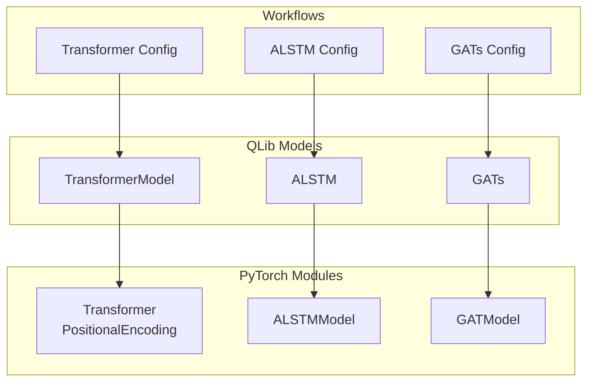
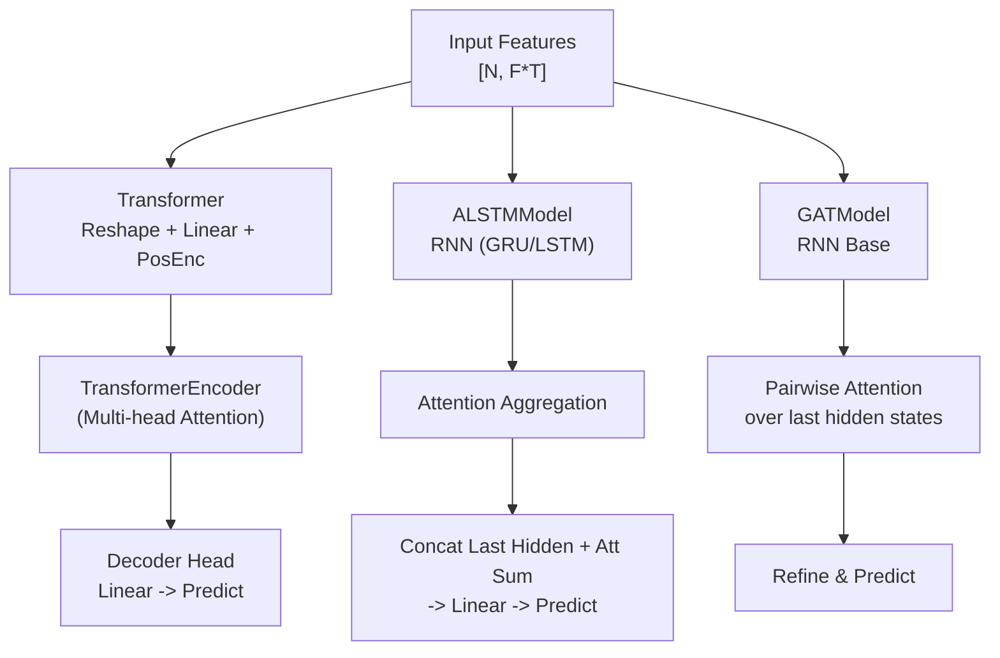
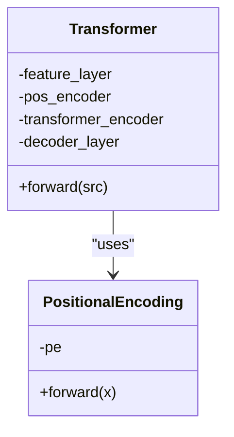
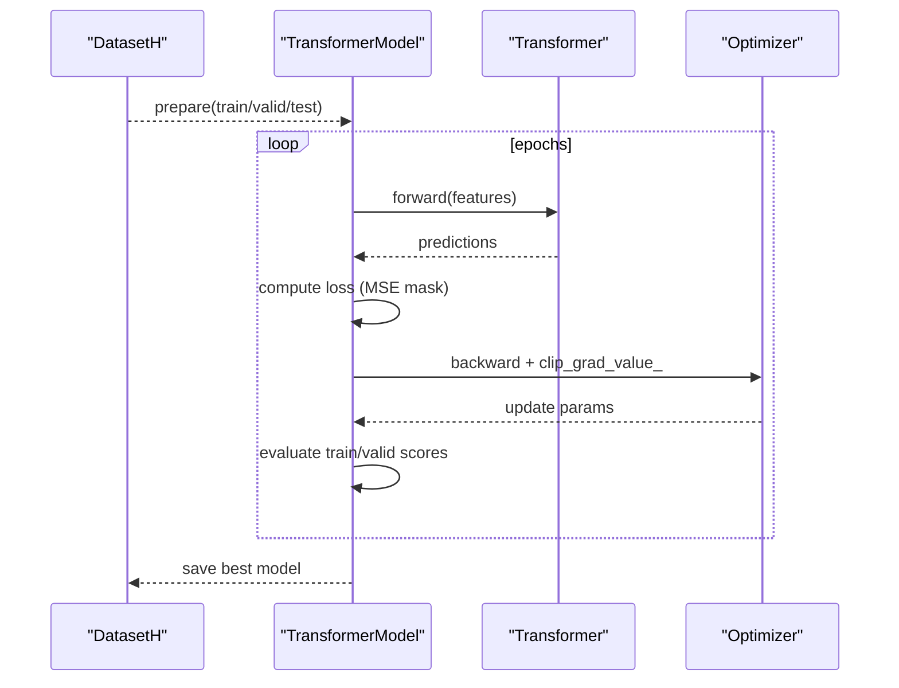
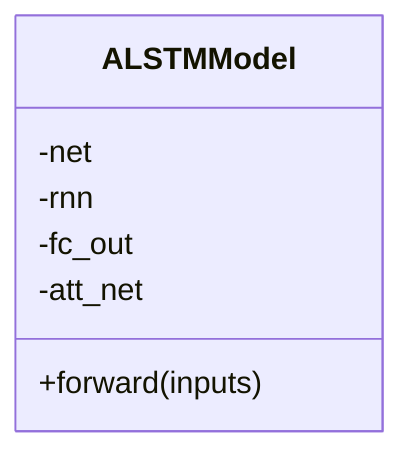
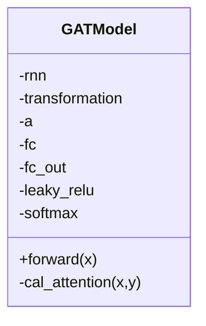
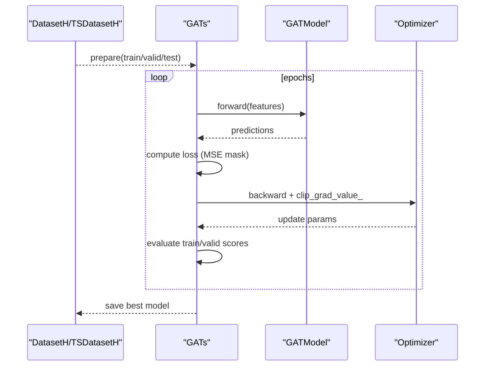
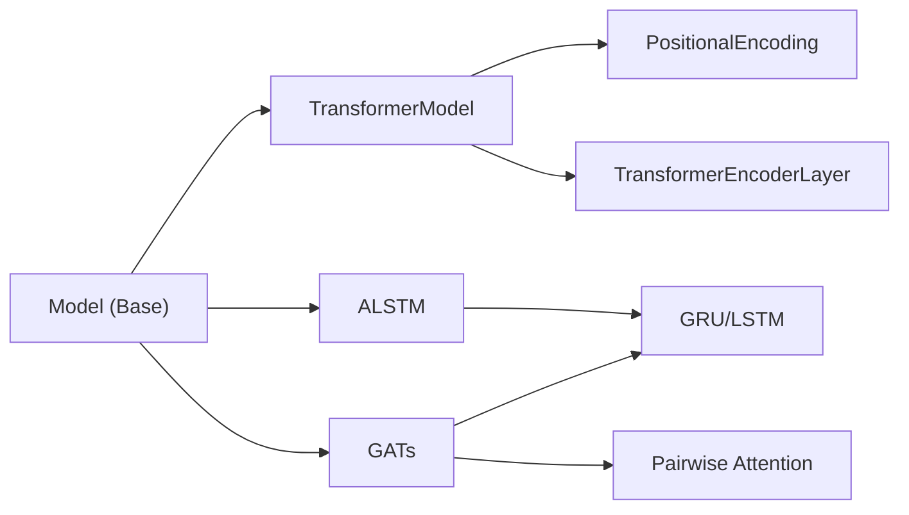

# Advanced Architectures (Transformer, ALSTM, GATs)

<cite>
**Referenced Files in This Document**
- [pytorch_transformer.py](file://qlib/contrib/model/pytorch_transformer.py)
- [pytorch_alstm.py](file://qlib/contrib/model/pytorch_alstm.py)
- [pytorch_gats.py](file://qlib/contrib/model/pytorch_gats.py)
- [workflow_config_transformer_Alpha360.yaml](file://examples/benchmarks/Transformer/workflow_config_transformer_Alpha360.yaml)
- [workflow_config_alstm_Alpha360.yaml](file://examples/benchmarks/ALSTM/workflow_config_alstm_Alpha360.yaml)
- [workflow_config_gats_Alpha360.yaml](file://examples/benchmarks/GATs/workflow_config_gats_Alpha360.yaml)
- [workflow_config_alstm_Alpha158.yaml](file://examples/benchmarks/ALSTM/workflow_config_alstm_Alpha158.yaml)
- [workflow_config_gats_Alpha158.yaml](file://examples/benchmarks/GATs/workflow_config_gats_Alpha158.yaml)
- [base.py](file://qlib/model/base.py)
- [README.md (Transformer)](file://examples/benchmarks/Transformer/README.md)
- [README.md (ALSTM)](file://examples/benchmarks/ALSTM/README.md)
- [README.md (GATs)](file://examples/benchmarks/GATs/README.md)
</cite>

## Table of Contents
1. Introduction
2. Project Structure
3. Core Components
4. Architecture Overview
5. Detailed Component Analysis
6. Dependency Analysis
7. Performance Considerations
8. Troubleshooting Guide
9. Conclusion

## Introduction
This document provides a comprehensive guide to QLib’s advanced neural network architectures for financial time series modeling: Transformer, ALSTM (Attention-augmented LSTM), and Graph Attention Networks (GATs). It explains how each model is implemented, configured, trained, and used within QLib’s workflow for large-scale financial datasets. The focus includes attention mechanisms, multi-head attention, positional encoding, long-term dependency capture via attention-augmented RNNs, and graph-based modeling of inter-security relationships.

## Project Structure
QLib organizes these models under the contrib model layer with PyTorch implementations and integrates them into benchmark workflows via YAML configurations. Each architecture has:
- A PyTorch model class implementing forward pass and training utilities
- A QLib Model wrapper that handles dataset preparation, training loops, early stopping, and prediction
- Example workflow configurations demonstrating data handlers, segments, and backtesting settings

**Diagram sources**
- [pytorch_transformer.py:27-286](file://qlib/contrib/model/pytorch_transformer.py#L27-L286)
- [pytorch_alstm.py:25-345](file://qlib/contrib/model/pytorch_alstm.py#L25-L345)
- [pytorch_gats.py:26-385](file://qlib/contrib/model/pytorch_gats.py#L26-L385)
- [workflow_config_transformer_Alpha360.yaml:46-63](file://examples/benchmarks/Transformer/workflow_config_transformer_Alpha360.yaml#L46-L63)
- [workflow_config_alstm_Alpha360.yaml:46-73](file://examples/benchmarks/ALSTM/workflow_config_alstm_Alpha360.yaml#L46-L73)
- [workflow_config_gats_Alpha360.yaml:46-73](file://examples/benchmarks/GATs/workflow_config_gats_Alpha360.yaml#L46-L73)

**Section sources**
- [pytorch_transformer.py:27-286](file://qlib/contrib/model/pytorch_transformer.py#L27-L286)
- [pytorch_alstm.py:25-345](file://qlib/contrib/model/pytorch_alstm.py#L25-L345)
- [pytorch_gats.py:26-385](file://qlib/contrib/model/pytorch_gats.py#L26-L385)
- [workflow_config_transformer_Alpha360.yaml:1-79](file://examples/benchmarks/Transformer/workflow_config_transformer_Alpha360.yaml#L1-L79)
- [workflow_config_alstm_Alpha360.yaml:1-89](file://examples/benchmarks/ALSTM/workflow_config_alstm_Alpha360.yaml#L1-L89)
- [workflow_config_gats_Alpha360.yaml:1-89](file://examples/benchmarks/GATs/workflow_config_gats_Alpha360.yaml#L1-L89)

## Core Components
- TransformerModel: Wraps a Transformer encoder with positional encoding and a linear decoder head; supports Adam/SGD optimizers, MSE loss, gradient clipping, early stopping, and batched training/prediction.
- ALSTM: Attention-augmented RNN (GRU/LSTM) where an attention layer aggregates temporal representations; supports configurable hidden size, layers, dropout, optimizer, and early stopping.
- GATs: Graph Attention Network built on top of an RNN base (LSTM/GRU); computes pairwise attention over the last hidden states across securities and refines features before prediction; supports pretrained base model loading.

Key shared behaviors:
- Dataset integration via QLib’s DatasetH/TSDatasetH
- Training loop with per-epoch evaluation, best model saving, and early stopping
- Prediction batching and device placement (CPU/GPU)

**Section sources**
- [pytorch_transformer.py:27-239](file://qlib/contrib/model/pytorch_transformer.py#L27-L239)
- [pytorch_alstm.py:25-291](file://qlib/contrib/model/pytorch_alstm.py#L25-L291)
- [pytorch_gats.py:26-323](file://qlib/contrib/model/pytorch_gats.py#L26-L323)
- [base.py:22-78](file://qlib/model/base.py#L22-L78)

## Architecture Overview
The three architectures target different aspects of financial time series modeling:
- Transformer: Captures global dependencies across time steps using self-attention and positional encodings.
- ALSTM: Enhances RNNs with attention to emphasize informative time steps while preserving sequential modeling.
- GATs: Models cross-sectional relationships among securities by computing attention weights between node embeddings derived from RNN outputs.

**Diagram sources**
- [pytorch_transformer.py:258-286](file://qlib/contrib/model/pytorch_transformer.py#L258-L286)
- [pytorch_alstm.py:294-345](file://qlib/contrib/model/pytorch_alstm.py#L294-L345)
- [pytorch_gats.py:326-385](file://qlib/contrib/model/pytorch_gats.py#L326-L385)

## Detailed Component Analysis

### Transformer
- Positional Encoding: Adds sinusoidal position signals to input embeddings to preserve temporal order.
- Multi-head Attention: Uses PyTorch’s TransformerEncoderLayer which implements scaled dot-product multi-head attention with dropout.
- Data Flow: Input reshaped to sequence format, projected to d_model, encoded through stacked transformer layers, and decoded via a linear layer taking the last time step representation.

Training and configuration highlights:
- Optimizer: Adam or SGD with weight decay
- Loss: MSE with NaN masking
- Early stopping based on validation metric
- Batched training and inference with GPU support

Configuration parameters (Alpha360 example):
- d_feat, seed, dataset segments, handler Alpha360, label definition, port analysis strategy

Performance considerations:
- Sequence length handling via reshape and permutation
- Gradient clipping to stabilize training
- Early stopping prevents overfitting

**Section sources**
- [pytorch_transformer.py:242-286](file://qlib/contrib/model/pytorch_transformer.py#L242-L286)
- [pytorch_transformer.py:27-239](file://qlib/contrib/model/pytorch_transformer.py#L27-L239)
- [workflow_config_transformer_Alpha360.yaml:46-63](file://examples/benchmarks/Transformer/workflow_config_transformer_Alpha360.yaml#L46-L63)
- [README.md (Transformer):1-4](file://examples/benchmarks/Transformer/README.md#L1-L4)

### ALSTM (Attention-augmented LSTM/GRU)
- RNN Backbone: Supports GRU or LSTM with configurable layers and dropout.
- Attention Mechanism: Computes attention scores over RNN outputs and aggregates temporally weighted representations.
- Output: Concatenates last hidden state with attention-aggregated vector, then predicts via a linear layer.

Training and configuration highlights:
- Optimizer: Adam or SGD
- Loss: MSE with NaN masking
- Early stopping and batched training/inference
- Optional use of TSDatasetH for time-series windows

Configuration parameters (Alpha360/Alpha158 examples):
- d_feat, hidden_size, num_layers, dropout, n_epochs, lr, early_stop, batch_size, rnn_type
- For Alpha158: TSDatasetH with step_len and Alpha158 handler

Performance considerations:
- Attention aggregation emphasizes informative time steps
- Dropout regularizes RNN and attention layers
- Gradient clipping stabilizes training

**Section sources**
- [pytorch_alstm.py:294-345](file://qlib/contrib/model/pytorch_alstm.py#L294-L345)
- [pytorch_alstm.py:25-291](file://qlib/contrib/model/pytorch_alstm.py#L25-L291)
- [workflow_config_alstm_Alpha360.yaml:46-73](file://examples/benchmarks/ALSTM/workflow_config_alstm_Alpha360.yaml#L46-L73)
- [workflow_config_alstm_Alpha158.yaml:53-83](file://examples/benchmarks/ALSTM/workflow_config_alstm_Alpha158.yaml#L53-L83)
- [README.md (ALSTM):1-10](file://examples/benchmarks/ALSTM/README.md#L1-L10)

### GATs (Graph Attention Networks)
- RNN Base: Uses LSTM or GRU to encode temporal sequences per security.
- Graph Attention: Computes pairwise attention between last hidden states across securities to refine node representations.
- Output: Applies transformation and linear head to produce predictions.

Training and configuration highlights:
- Pretrained base model loading (LSTM/GRU) for transfer learning
- Daily-batch processing aligned with trading days
- Optimizer: Adam or SGD; MSE loss with NaN masking; early stopping

Configuration parameters (Alpha360/Alpha158 examples):
- d_feat, hidden_size, num_layers, dropout, n_epochs, lr, early_stop, base_model, model_path
- For Alpha158: TSDatasetH with step_len and Alpha158 handler

Performance considerations:
- Pairwise attention scales quadratically with number of securities; consider batch size and sequence length
- Pretraining base model can improve convergence and performance

**Section sources**
- [pytorch_gats.py:326-385](file://qlib/contrib/model/pytorch_gats.py#L326-L385)
- [pytorch_gats.py:26-323](file://qlib/contrib/model/pytorch_gats.py#L26-L323)
- [workflow_config_gats_Alpha360.yaml:46-73](file://examples/benchmarks/GATs/workflow_config_gats_Alpha360.yaml#L46-L73)
- [workflow_config_gats_Alpha158.yaml:53-82](file://examples/benchmarks/GATs/workflow_config_gats_Alpha158.yaml#L53-L82)
- [README.md (GATs):1-5](file://examples/benchmarks/GATs/README.md#L1-L5)

## Dependency Analysis
- All models inherit from QLib’s Model base class, ensuring consistent fit/predict interfaces and dataset integration.
- Transformers rely on PyTorch’s TransformerEncoderLayer for multi-head attention.
- ALSTM uses PyTorch RNN modules (GRU/LSTM) plus custom attention.
- GATs depend on RNN base models and implement custom pairwise attention.

**Diagram sources**
- [base.py:22-78](file://qlib/model/base.py#L22-L78)
- [pytorch_transformer.py:258-286](file://qlib/contrib/model/pytorch_transformer.py#L258-L286)
- [pytorch_alstm.py:294-345](file://qlib/contrib/model/pytorch_alstm.py#L294-L345)
- [pytorch_gats.py:326-385](file://qlib/contrib/model/pytorch_gats.py#L326-L385)

**Section sources**
- [base.py:22-78](file://qlib/model/base.py#L22-L78)
- [pytorch_transformer.py:258-286](file://qlib/contrib/model/pytorch_transformer.py#L258-L286)
- [pytorch_alstm.py:294-345](file://qlib/contrib/model/pytorch_alstm.py#L294-L345)
- [pytorch_gats.py:326-385](file://qlib/contrib/model/pytorch_gats.py#L326-L385)

## Performance Considerations
- Batch Size and Memory: Larger batches improve throughput but increase memory usage; tune batch_size per hardware constraints.
- Sequence Length: Longer sequences increase computation and memory; consider truncation or sliding windows (e.g., step_len in TSDatasetH).
- Attention Complexity: Transformer and GATs attention scale with sequence length and number of securities respectively; monitor quadratic growth.
- Gradient Clipping: Applied to prevent exploding gradients during training.
- Early Stopping: Prevents overfitting by halting training when validation metric stops improving.
- Device Placement: Use GPU when available; ensure tensors are moved appropriately.

[No sources needed since this section provides general guidance]

## Troubleshooting Guide
Common issues and resolutions:
- Empty dataset errors: Ensure dataset segments and handler configurations produce non-empty train/valid splits.
- Unknown optimizer/loss/metric: Verify parameter values match supported options in model classes.
- Device mismatch: Confirm tensors and models are on the same device (CPU/GPU).
- Pretrained model path: For GATs, ensure model_path points to a valid checkpoint matching the base_model type.

Operational checks:
- Validate YAML configurations for correct module paths and kwargs.
- Inspect logs for parameter settings and device selection.
- Monitor training metrics to detect divergence or overfitting.

**Section sources**
- [pytorch_transformer.py:157-210](file://qlib/contrib/model/pytorch_transformer.py#L157-L210)
- [pytorch_alstm.py:209-262](file://qlib/contrib/model/pytorch_alstm.py#L209-L262)
- [pytorch_gats.py:224-296](file://qlib/contrib/model/pytorch_gats.py#L224-L296)
- [workflow_config_transformer_Alpha360.yaml:46-63](file://examples/benchmarks/Transformer/workflow_config_transformer_Alpha360.yaml#L46-L63)
- [workflow_config_alstm_Alpha360.yaml:46-73](file://examples/benchmarks/ALSTM/workflow_config_alstm_Alpha360.yaml#L46-L73)
- [workflow_config_gats_Alpha360.yaml:46-73](file://examples/benchmarks/GATs/workflow_config_gats_Alpha360.yaml#L46-L73)

## Conclusion
QLib’s advanced architectures provide robust tools for financial time series modeling:
- Transformer leverages multi-head attention and positional encoding to capture global temporal dependencies.
- ALSTM augments RNNs with attention to highlight informative time steps for long-term dependency modeling.
- GATs incorporate graph attention to model cross-sectional relationships among securities, enhancing predictive power through relational reasoning.

These models integrate seamlessly with QLib’s dataset and workflow infrastructure, supporting efficient training, evaluation, and deployment for large-scale financial data.

[No sources needed since this section summarizes without analyzing specific files]