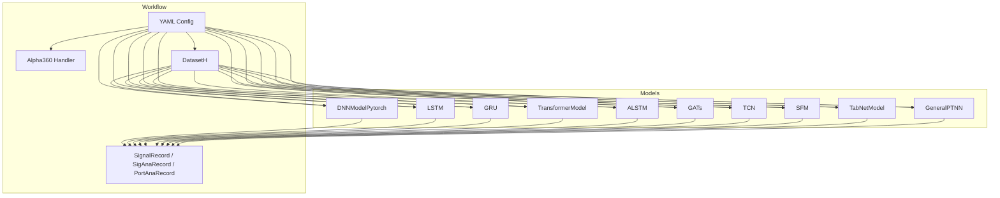
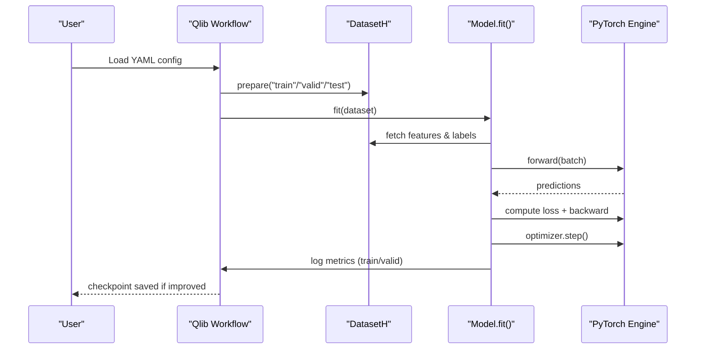
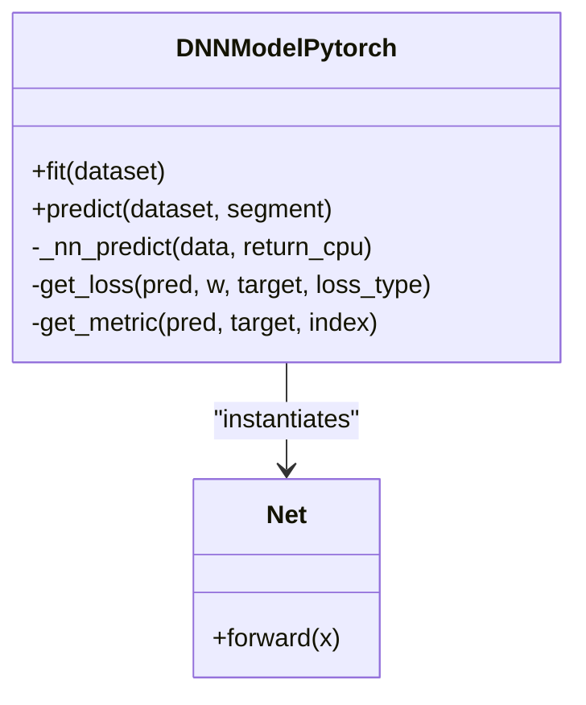
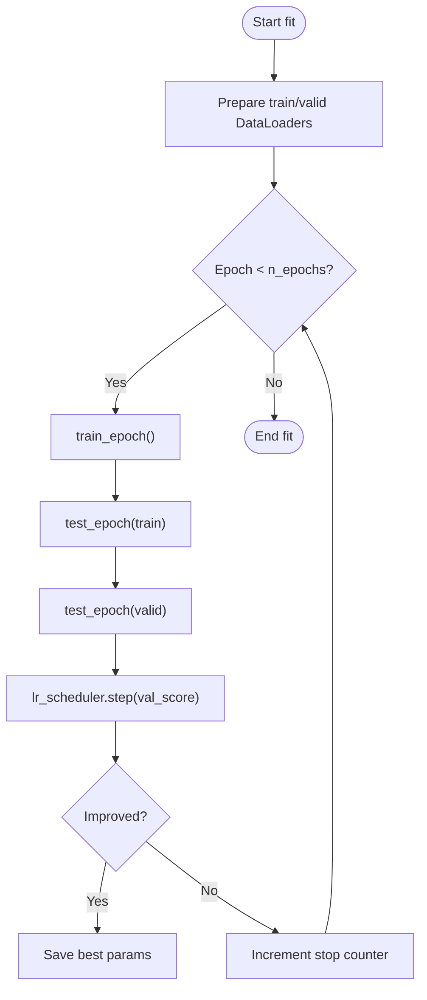
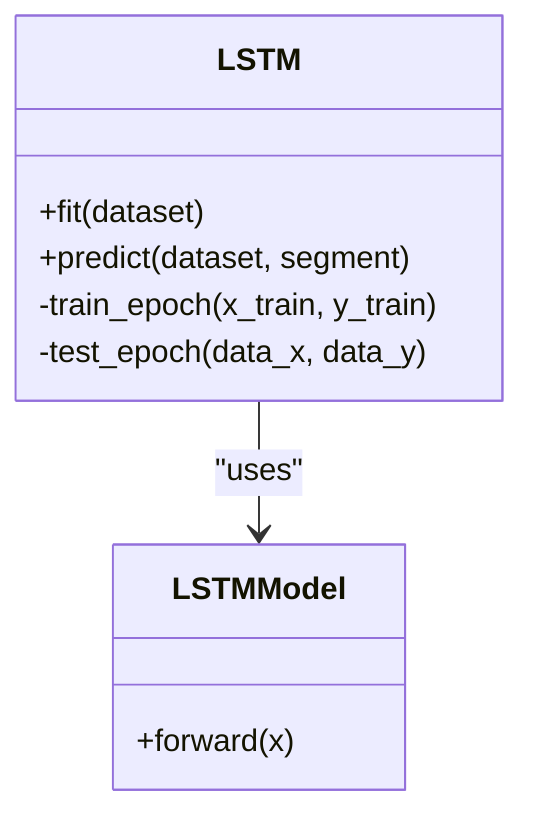
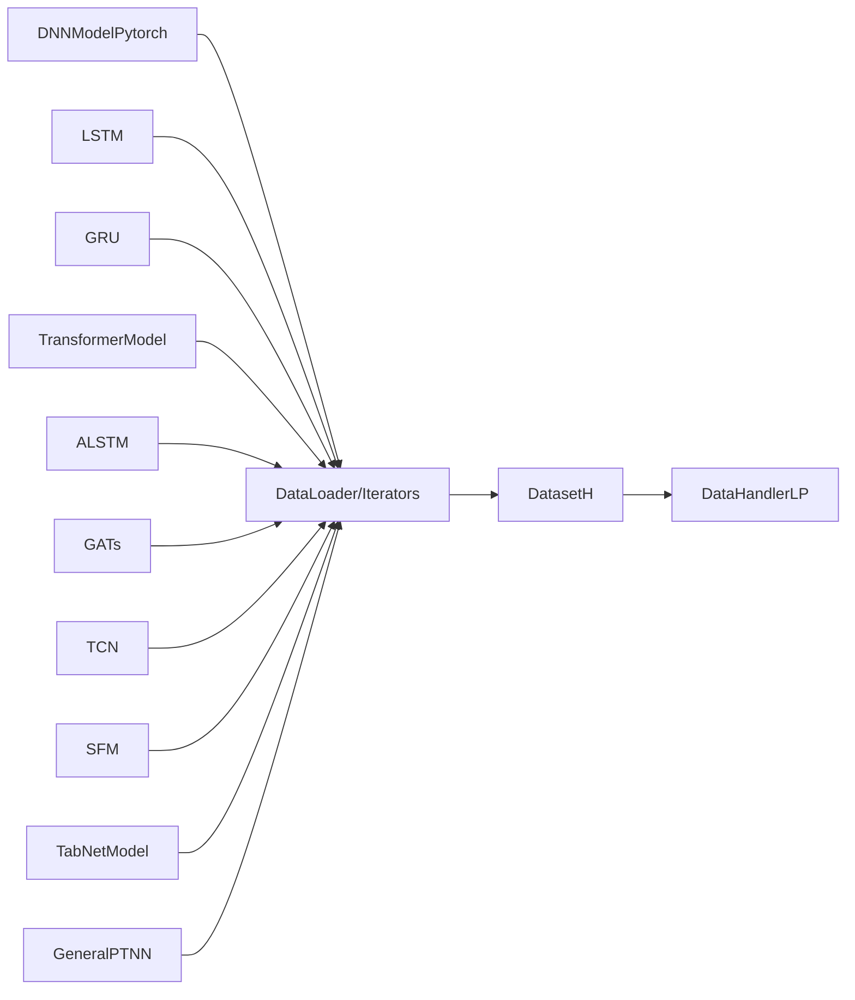

# Neural Network Models

<cite>
**Referenced Files in This Document**
- [pytorch_nn.py](file://qlib/contrib/model/pytorch_nn.py)
- [pytorch_general_nn.py](file://qlib/contrib/model/pytorch_general_nn.py)
- [pytorch_lstm.py](file://qlib/contrib/model/pytorch_lstm.py)
- [pytorch_gru.py](file://qlib/contrib/model/pytorch_gru.py)
- [pytorch_transformer.py](file://qlib/contrib/model/pytorch_transformer.py)
- [pytorch_alstm.py](file://qlib/contrib/model/pytorch_alstm.py)
- [pytorch_gats.py](file://qlib/contrib/model/pytorch_gats.py)
- [pytorch_tcn.py](file://qlib/contrib/model/pytorch_tcn.py)
- [tcn.py](file://qlib/contrib/model/tcn.py)
- [pytorch_sfm.py](file://qlib/contrib/model/pytorch_sfm.py)
- [pytorch_tabnet.py](file://qlib/contrib/model/pytorch_tabnet.py)
- [workflow_config_lstm_Alpha360.yaml](file://examples/benchmarks/LSTM/workflow_config_lstm_Alpha360.yaml)
- [workflow_config_transformer_Alpha360.yaml](file://examples/benchmarks/Transformer/workflow_config_transformer_Alpha360.yaml)
- [workflow_config_add_Alpha360.yaml](file://examples/benchmarks/ADD/workflow_config_add_Alpha360.yaml)
</cite>

## Table of Contents
1. [Introduction](#introduction)
2. [Project Structure](#project-structure)
3. [Core Components](#core-components)
4. [Architecture Overview](#architecture-overview)
5. [Detailed Component Analysis](#detailed-component-analysis)
6. [Dependency Analysis](#dependency-analysis)
7. [Performance Considerations](#performance-considerations)
8. [Troubleshooting Guide](#troubleshooting-guide)
9. [Conclusion](#conclusion)
10. [Appendices](#appendices)

## Introduction
This document explains QLib’s PyTorch-based neural network models for financial time series forecasting. It covers standard networks (DNN, LSTM, GRU), advanced architectures (Transformer, ALSTM, GATs), and specialized models (TCN, SFM, TabNet, ADD). For each model, we describe configuration options, training procedures, architectural choices, integration with QLib’s workflow system, GPU acceleration, batch processing, and memory management strategies for large-scale training.

## Project Structure
QLib organizes PyTorch models under qlib/contrib/model as per-model modules, each exposing a Model subclass that implements fit/predict and integrates with DatasetH and DataHandlerLP. Workflow configurations in examples/benchmarks demonstrate how to instantiate models via YAML and run end-to-end training, evaluation, and backtesting.

**Diagram sources**
- [workflow_config_lstm_Alpha360.yaml:46-88](file://examples/benchmarks/LSTM/workflow_config_lstm_Alpha360.yaml#L46-L88)
- [workflow_config_transformer_Alpha360.yaml:46-79](file://examples/benchmarks/Transformer/workflow_config_transformer_Alpha360.yaml#L46-L79)
- [workflow_config_add_Alpha360.yaml:46-93](file://examples/benchmarks/ADD/workflow_config_add_Alpha360.yaml#L46-L93)

**Section sources**
- [workflow_config_lstm_Alpha360.yaml:1-88](file://examples/benchmarks/LSTM/workflow_config_lstm_Alpha360.yaml#L1-L88)
- [workflow_config_transformer_Alpha360.yaml:1-79](file://examples/benchmarks/Transformer/workflow_config_transformer_Alpha360.yaml#L1-L79)
- [workflow_config_add_Alpha360.yaml:1-93](file://examples/benchmarks/ADD/workflow_config_add_Alpha360.yaml#L1-L93)

## Core Components
- DNNModelPytorch: A configurable feedforward network with support for MSE or binary loss, optional data parallelism, learning rate scheduling, and early stopping.
- GeneralPTNN: A generic trainer wrapper that adapts any PyTorch model to Qlib’s dataset interface, supports both tabular and time-series datasets, DataLoader-based batching, and ReduceLROnPlateau.
- LSTM/GRU: Recurrent baselines using nn.LSTM/nn.GRU with batch-first handling, gradient clipping, and early stopping on validation metric.
- TransformerModel: A naive transformer encoder with positional encoding and linear decoder head; supports weight decay regularization.
- ALSTM: Attention-augmented LSTM/GRU with an attention mechanism over the sequence outputs concatenated with the last hidden state.
- GATs: Graph Attention Networks over sequences using RNN features and pairwise attention; supports pretrained base model initialization.
- TCN: Temporal Convolutional Network using causal dilated convolutions for long-range dependencies.
- SFM: Spectral Filter Memory model combining recurrent gating with frequency-domain representations and spectral attention.
- TabNetModel: Tabular self-supervised pretraining with a decoder, sparse feature selection via Sparsemax, and fine-tuning head for prediction.

**Section sources**
- [pytorch_nn.py:39-184](file://qlib/contrib/model/pytorch_nn.py#L39-L184)
- [pytorch_general_nn.py:33-146](file://qlib/contrib/model/pytorch_general_nn.py#L33-L146)
- [pytorch_lstm.py:24-130](file://qlib/contrib/model/pytorch_lstm.py#L24-L130)
- [pytorch_gru.py:25-131](file://qlib/contrib/model/pytorch_gru.py#L25-L131)
- [pytorch_transformer.py:27-79](file://qlib/contrib/model/pytorch_transformer.py#L27-L79)
- [pytorch_alstm.py:25-131](file://qlib/contrib/model/pytorch_alstm.py#L25-L131)
- [pytorch_gats.py:26-139](file://qlib/contrib/model/pytorch_gats.py#L26-L139)
- [pytorch_tcn.py:26-139](file://qlib/contrib/model/pytorch_tcn.py#L26-L139)
- [pytorch_sfm.py:180-303](file://qlib/contrib/model/pytorch_sfm.py#L180-L303)
- [pytorch_tabnet.py:25-110](file://qlib/contrib/model/pytorch_tabnet.py#L25-L110)

## Architecture Overview
The training loop across models follows a consistent pattern:
- Prepare train/valid/test splits from DatasetH via DataHandlerLP keys.
- Convert to tensors and move to device (CPU/GPU).
- Iterate epochs with mini-batches, compute loss, backward pass, optimizer step, and gradient clipping where applicable.
- Evaluate on validation set, track best metrics, apply early stopping, and save checkpoints.
- Predict by batching inference and concatenating results.

**Diagram sources**
- [pytorch_lstm.py:204-260](file://qlib/contrib/model/pytorch_lstm.py#L204-L260)
- [pytorch_gru.py:209-290](file://qlib/contrib/model/pytorch_gru.py#L209-L290)
- [pytorch_transformer.py:157-213](file://qlib/contrib/model/pytorch_transformer.py#L157-L213)
- [pytorch_general_nn.py:235-332](file://qlib/contrib/model/pytorch_general_nn.py#L235-L332)

## Detailed Component Analysis

### DNNModelPytorch
- Architecture: Configurable MLP with dropout, BatchNorm, and activation layers; output dimension defaults to 1.
- Training: Random sampling per step, MSE or binary loss, Adam/SGD, ReduceLROnPlateau scheduler, early stopping on validation loss, optional data parallelism.
- Prediction: Batches of size 8096 for efficient inference; returns CPU tensor unless requested otherwise.
- Integration: Uses Qlib’s logging and workflow recording utilities; supports reweighting via Reweighter.

**Diagram sources**
- [pytorch_nn.py:39-184](file://qlib/contrib/model/pytorch_nn.py#L39-L184)
- [pytorch_nn.py:426-464](file://qlib/contrib/model/pytorch_nn.py#L426-L464)

**Section sources**
- [pytorch_nn.py:39-184](file://qlib/contrib/model/pytorch_nn.py#L39-L184)
- [pytorch_nn.py:190-337](file://qlib/contrib/model/pytorch_nn.py#L190-L337)
- [pytorch_nn.py:358-404](file://qlib/contrib/model/pytorch_nn.py#L358-L404)
- [pytorch_nn.py:426-464](file://qlib/contrib/model/pytorch_nn.py#L426-L464)

### GeneralPTNN
- Purpose: Generic adapter to wrap arbitrary PyTorch models with Qlib’s dataset interface.
- Data handling: Supports both TSDatasetH (time series) and tabular datasets; uses ConcatDataset and DataLoader for batching; handles NaN filling for time series.
- Training: Epoch-based loop with separate train/val loaders, ReduceLROnPlateau, gradient clipping, early stopping, and saving best parameters.
- Prediction: Iterates test loader, aggregates predictions into a pandas Series aligned to dataset index.

**Diagram sources**
- [pytorch_general_nn.py:235-332](file://qlib/contrib/model/pytorch_general_nn.py#L235-L332)

**Section sources**
- [pytorch_general_nn.py:33-146](file://qlib/contrib/model/pytorch_general_nn.py#L33-L146)
- [pytorch_general_nn.py:174-233](file://qlib/contrib/model/pytorch_general_nn.py#L174-L233)
- [pytorch_general_nn.py:235-372](file://qlib/contrib/model/pytorch_general_nn.py#L235-L372)

### LSTM
- Architecture: nn.LSTM with batch_first=True; final time-step output passed through a linear layer.
- Training: Manual mini-batch iteration, MSE loss, Adam/SGD, gradient clipping, early stopping on validation score.
- Prediction: Batches processed sequentially; results concatenated and returned as a Series.

**Diagram sources**
- [pytorch_lstm.py:24-130](file://qlib/contrib/model/pytorch_lstm.py#L24-L130)
- [pytorch_lstm.py:286-307](file://qlib/contrib/model/pytorch_lstm.py#L286-L307)

**Section sources**
- [pytorch_lstm.py:24-130](file://qlib/contrib/model/pytorch_lstm.py#L24-L130)
- [pytorch_lstm.py:152-203](file://qlib/contrib/model/pytorch_lstm.py#L152-L203)
- [pytorch_lstm.py:204-284](file://qlib/contrib/model/pytorch_lstm.py#L204-L284)
- [pytorch_lstm.py:286-307](file://qlib/contrib/model/pytorch_lstm.py#L286-L307)

### GRU
- Architecture: nn.GRU with batch_first=True; final time-step output through a linear layer.
- Training: Similar to LSTM with manual batching, MSE loss, gradient clipping, early stopping.
- Prediction: Sequential batching and concatenation.

**Section sources**
- [pytorch_gru.py:25-131](file://qlib/contrib/model/pytorch_gru.py#L25-L131)
- [pytorch_gru.py:156-208](file://qlib/contrib/model/pytorch_gru.py#L156-L208)
- [pytorch_gru.py:209-317](file://qlib/contrib/model/pytorch_gru.py#L209-L317)
- [pytorch_gru.py:319-340](file://qlib/contrib/model/pytorch_gru.py#L319-L340)

### TransformerModel
- Architecture: Linear projection to d_model, positional encoding, TransformerEncoder stack, linear decoder head.
- Training: Manual batching, MSE loss, Adam/SGD with weight decay, gradient clipping, early stopping.
- Notes: Naive implementation suitable for baseline comparisons.

**Section sources**
- [pytorch_transformer.py:27-79](file://qlib/contrib/model/pytorch_transformer.py#L27-L79)
- [pytorch_transformer.py:104-155](file://qlib/contrib/model/pytorch_transformer.py#L104-L155)
- [pytorch_transformer.py:157-239](file://qlib/contrib/model/pytorch_transformer.py#L157-L239)
- [pytorch_transformer.py:242-286](file://qlib/contrib/model/pytorch_transformer.py#L242-L286)

### ALSTM
- Architecture: Optional RNN type (GRU/LSTM) after input linearization; attention over sequence outputs concatenated with last hidden state.
- Training: Manual batching, MSE loss, gradient clipping, early stopping.
- Use case: Captures temporal dynamics with attention weighting.

**Section sources**
- [pytorch_alstm.py:25-131](file://qlib/contrib/model/pytorch_alstm.py#L25-L131)
- [pytorch_alstm.py:156-208](file://qlib/contrib/model/pytorch_alstm.py#L156-L208)
- [pytorch_alstm.py:209-292](file://qlib/contrib/model/pytorch_alstm.py#L209-L292)
- [pytorch_alstm.py:294-345](file://qlib/contrib/model/pytorch_alstm.py#L294-L345)

### GATs
- Architecture: RNN (GRU/LSTM) followed by pairwise attention over hidden states; includes transformation and softmax attention weights; residual addition and nonlinearity before output.
- Training: Daily-batched iteration, MSE loss, gradient clipping, early stopping; supports loading pretrained base model weights.
- Notes: Attention computed between all pairs of samples’ last hidden states.

**Section sources**
- [pytorch_gats.py:26-139](file://qlib/contrib/model/pytorch_gats.py#L26-L139)
- [pytorch_gats.py:164-223](file://qlib/contrib/model/pytorch_gats.py#L164-L223)
- [pytorch_gats.py:224-324](file://qlib/contrib/model/pytorch_gats.py#L224-L324)
- [pytorch_gats.py:326-385](file://qlib/contrib/model/pytorch_gats.py#L326-L385)

### TCN
- Architecture: TemporalConvNet with causal dilated convolutions; final time-step output through a linear layer.
- Training: Manual batching, MSE loss, gradient clipping, early stopping.
- Notes: Efficient for long-range temporal dependencies with parallelizable convolutions.

**Section sources**
- [pytorch_tcn.py:26-139](file://qlib/contrib/model/pytorch_tcn.py#L26-L139)
- [pytorch_tcn.py:164-215](file://qlib/contrib/model/pytorch_tcn.py#L164-L215)
- [pytorch_tcn.py:216-297](file://qlib/contrib/model/pytorch_tcn.py#L216-L297)
- [pytorch_tcn.py:299-311](file://qlib/contrib/model/pytorch_tcn.py#L299-L311)
- [tcn.py:1-200](file://qlib/contrib/model/tcn.py#L1-L200)

### SFM
- Architecture: Spectral Filter Memory model with recurrent gating and frequency-domain components; computes spectral energy and applies attention to produce predictions.
- Training: Manual batching, MSE loss, gradient clipping, early stopping.
- Notes: Integrates time and frequency information via complex-valued operations and spectral attention.

**Section sources**
- [pytorch_sfm.py:180-303](file://qlib/contrib/model/pytorch_sfm.py#L180-L303)
- [pytorch_sfm.py:308-359](file://qlib/contrib/model/pytorch_sfm.py#L308-L359)
- [pytorch_sfm.py:360-461](file://qlib/contrib/model/pytorch_sfm.py#L360-L461)
- [pytorch_sfm.py:25-179](file://qlib/contrib/model/pytorch_sfm.py#L25-L179)

### TabNetModel
- Architecture: Encoder-decoder with FeatureTransformer and DecisionStep blocks; Sparsemax-based feature selection; optional pretraining with a decoder; fine-tuning head added for prediction.
- Training: Pretraining phase reconstructs masked inputs; supervised fine-tuning with MSE loss; virtual batch normalization for stability.
- Notes: Handles missing values by zero-filling; uses priors to guide sparse selection.

**Section sources**
- [pytorch_tabnet.py:25-110](file://qlib/contrib/model/pytorch_tabnet.py#L25-L110)
- [pytorch_tabnet.py:112-163](file://qlib/contrib/model/pytorch_tabnet.py#L112-L163)
- [pytorch_tabnet.py:151-243](file://qlib/contrib/model/pytorch_tabnet.py#L151-L243)
- [pytorch_tabnet.py:245-367](file://qlib/contrib/model/pytorch_tabnet.py#L245-L367)
- [pytorch_tabnet.py:385-644](file://qlib/contrib/model/pytorch_tabnet.py#L385-L644)

### ADD (Advanced Deep Denoising)
- Configuration example demonstrates usage of ADD with GRU base model, hyperparameters like gamma, mu, dec_dropout, and IC metric.
- Integration: Same workflow structure as other models; configured via YAML task.model and dataset sections.

**Section sources**
- [workflow_config_add_Alpha360.yaml:46-93](file://examples/benchmarks/ADD/workflow_config_add_Alpha360.yaml#L46-L93)

## Dependency Analysis
- Common dependencies: torch.nn, torch.optim, numpy, pandas; Qlib’s DatasetH, DataHandlerLP, and workflow recording utilities.
- Model-specific dependencies:
  - GATs imports LSTMModel and GRUModel for pretrained base initialization.
  - TCN depends on a separate TemporalConvNet module.
  - TabNet includes custom SparsemaxFunction and Ghost Batch Normalization.
- Workflow integration: All models accept DatasetH and use DataHandlerLP keys to access features and labels; some models integrate with Reweighter for sample weighting.

**Diagram sources**
- [pytorch_gats.py:18-24](file://qlib/contrib/model/pytorch_gats.py#L18-L24)
- [pytorch_tcn.py:19-24](file://qlib/contrib/model/pytorch_tcn.py#L19-L24)
- [pytorch_tabnet.py:19-23](file://qlib/contrib/model/pytorch_tabnet.py#L19-L23)
- [pytorch_general_nn.py:18-31](file://qlib/contrib/model/pytorch_general_nn.py#L18-L31)

**Section sources**
- [pytorch_gats.py:18-24](file://qlib/contrib/model/pytorch_gats.py#L18-L24)
- [pytorch_tcn.py:19-24](file://qlib/contrib/model/pytorch_tcn.py#L19-L24)
- [pytorch_tabnet.py:19-23](file://qlib/contrib/model/pytorch_tabnet.py#L19-L23)
- [pytorch_general_nn.py:18-31](file://qlib/contrib/model/pytorch_general_nn.py#L18-L31)

## Performance Considerations
- GPU Acceleration:
  - Most models detect CUDA availability and move models/data to device; ensure GPU ID is correctly specified in configs.
  - DNNModelPytorch supports DataParallel for multi-GPU training when enabled.
- Batch Processing:
  - Manual batching loops are used in many models; adjust batch_size to balance throughput and memory.
  - GeneralPTNN uses DataLoader with num_workers for parallel data loading; tune n_jobs accordingly.
- Memory Management:
  - Free intermediate tensors and call torch.cuda.empty_cache() after training where implemented.
  - Avoid moving entire datasets to GPU at once; prefer streaming batches.
  - For large datasets, consider reducing batch_size or enabling gradient accumulation patterns outside the provided code.
- Learning Rate Scheduling:
  - DNNModelPytorch and GeneralPTNN implement ReduceLROnPlateau; tune patience and factor for your dataset.
- Early Stopping:
  - Consistent across models; monitor validation metric to prevent overfitting.

[No sources needed since this section provides general guidance]

## Troubleshooting Guide
- Empty Data Errors:
  - Ensure dataset segments (train/valid/test) are defined and not empty; check handler configuration and time ranges.
- Device Mismatch:
  - Verify that tensors and models are on the same device; avoid mixing CPU and GPU tensors during operations.
- NaN Handling:
  - Some models mask NaN labels; others fill NaNs (e.g., TabNet zeros out NaNs); ensure preprocessing aligns with model expectations.
- Optimizer/Loss Support:
  - Only specific optimizers (Adam/SGD) and losses (MSE/binary) are supported; extend or switch implementations if needed.
- Gradient Clipping:
  - If gradients explode, increase clip value or reduce learning rate; most models already clip gradients.
- Workflow Recording:
  - Ensure recorder is available and paths exist; logs are written via Qlib’s workflow utilities.

**Section sources**
- [pytorch_lstm.py:204-217](file://qlib/contrib/model/pytorch_lstm.py#L204-L217)
- [pytorch_gru.py:215-230](file://qlib/contrib/model/pytorch_gru.py#L215-L230)
- [pytorch_transformer.py:157-170](file://qlib/contrib/model/pytorch_transformer.py#L157-L170)
- [pytorch_tabnet.py:151-173](file://qlib/contrib/model/pytorch_tabnet.py#L151-L173)

## Conclusion
QLib provides a comprehensive suite of PyTorch-based neural models tailored for financial time series forecasting. Standard models (DNN, LSTM, GRU) offer reliable baselines, while advanced architectures (Transformer, ALSTM, GATs) introduce attention and graph mechanisms. Specialized models (TCN, SFM, TabNet, ADD) address domain-specific needs such as long-range dependencies, spectral features, and tabular self-supervision. The unified workflow integration simplifies experimentation, and careful tuning of batch size, learning rate schedule, and early stopping ensures robust training on large-scale datasets.

[No sources needed since this section summarizes without analyzing specific files]

## Appendices

### Example Instantiation via Workflow Configurations
- LSTM: Configure model class, hyperparameters, dataset segments, and recorders in YAML; run via Qlib’s workflow engine.
- Transformer: Minimal configuration focusing on d_feat and seed; relies on default hyperparameters.
- ADD: Demonstrates advanced hyperparameters including base model choice, gamma, mu, and metric selection.

**Section sources**
- [workflow_config_lstm_Alpha360.yaml:46-88](file://examples/benchmarks/LSTM/workflow_config_lstm_Alpha360.yaml#L46-L88)
- [workflow_config_transformer_Alpha360.yaml:46-79](file://examples/benchmarks/Transformer/workflow_config_transformer_Alpha360.yaml#L46-L79)
- [workflow_config_add_Alpha360.yaml:46-93](file://examples/benchmarks/ADD/workflow_config_add_Alpha360.yaml#L46-L93)