# Specialized Models (TCN, SFM, TabNet, ADD)

<cite>
**Referenced Files in This Document**
- [pytorch_tcn.py](file://qlib/contrib/model/pytorch_tcn.py)
- [tcn.py](file://qlib/contrib/model/tcn.py)
- [workflow_config_tcn_Alpha360.yaml](file://examples/benchmarks/TCN/workflow_config_tcn_Alpha360.yaml)
- [pytorch_sfm.py](file://qlib/contrib/model/pytorch_sfm.py)
- [workflow_config_sfm_Alpha360.yaml](file://examples/benchmarks/SFM/workflow_config_sfm_Alpha360.yaml)
- [pytorch_tabnet.py](file://qlib/contrib/model/pytorch_tabnet.py)
- [workflow_config_TabNet_Alpha360.yaml](file://examples/benchmarks/TabNet/workflow_config_TabNet_Alpha360.yaml)
- [pytorch_add.py](file://qlib/contrib/model/pytorch_add.py)
- [workflow_config_add_Alpha360.yaml](file://examples/benchmarks/ADD/workflow_config_add_Alpha360.yaml)
</cite>

## Table of Contents
1. [Introduction](#introduction)
2. [Project Structure](#project-structure)
3. [Core Components](#core-components)
4. [Architecture Overview](#architecture-overview)
5. [Detailed Component Analysis](#detailed-component-analysis)
6. [Dependency Analysis](#dependency-analysis)
7. [Performance Considerations](#performance-considerations)
8. [Troubleshooting Guide](#troubleshooting-guide)
9. [Conclusion](#conclusion)
10. [Appendices](#appendices)

## Introduction
This document provides comprehensive documentation for QLib’s specialized neural network models designed for financial forecasting tasks:
- Temporal Convolutional Networks (TCN): captures temporal dependencies with dilated convolutions and residual connections.
- Squeeze-and-Excitation Factorization Machine (SFM): integrates a frequency-aware recurrent unit with attention to model feature interactions over time series.
- TabNet: sequential decision-making architecture for tabular data with sparse feature selection and optional self-supervised pretraining.
- Additive Deep Network (ADD): interpretable deep learning framework that decomposes predictions into additive components and uses adversarial training for robustness.

The document covers model-specific configurations, training procedures, interpretability features, and performance optimization techniques grounded in the repository implementation.

## Project Structure
QLib organizes specialized models under qlib/contrib/model as PyTorch implementations integrated with QLib’s dataset and workflow system. Each model exposes a Model subclass implementing fit, predict, and evaluation routines, and is configured via YAML workflows in examples/benchmarks.

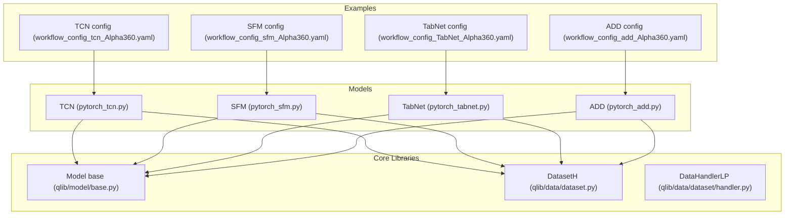

**Diagram sources**
- [pytorch_tcn.py:26-139](file://qlib/contrib/model/pytorch_tcn.py#L26-L139)
- [pytorch_sfm.py:180-303](file://qlib/contrib/model/pytorch_sfm.py#L180-L303)
- [pytorch_tabnet.py:25-110](file://qlib/contrib/model/pytorch_tabnet.py#L25-L110)
- [pytorch_add.py:29-162](file://qlib/contrib/model/pytorch_add.py#L29-L162)
- [workflow_config_tcn_Alpha360.yaml:46-63](file://examples/benchmarks/TCN/workflow_config_tcn_Alpha360.yaml#L46-L63)
- [workflow_config_sfm_Alpha360.yaml:46-63](file://examples/benchmarks/SFM/workflow_config_sfm_Alpha360.yaml#L46-L63)
- [workflow_config_TabNet_Alpha360.yaml:46-66](file://examples/benchmarks/TabNet/workflow_config_TabNet_Alpha360.yaml#L46-L66)
- [workflow_config_add_Alpha360.yaml:46-65](file://examples/benchmarks/ADD/workflow_config_add_Alpha360.yaml#L46-L65)

**Section sources**
- [pytorch_tcn.py:26-139](file://qlib/contrib/model/pytorch_tcn.py#L26-L139)
- [pytorch_sfm.py:180-303](file://qlib/contrib/model/pytorch_sfm.py#L180-L303)
- [pytorch_tabnet.py:25-110](file://qlib/contrib/model/pytorch_tabnet.py#L25-L110)
- [pytorch_add.py:29-162](file://qlib/contrib/model/pytorch_add.py#L29-L162)
- [workflow_config_tcn_Alpha360.yaml:46-63](file://examples/benchmarks/TCN/workflow_config_tcn_Alpha360.yaml#L46-L63)
- [workflow_config_sfm_Alpha360.yaml:46-63](file://examples/benchmarks/SFM/workflow_config_sfm_Alpha360.yaml#L46-L63)
- [workflow_config_TabNet_Alpha360.yaml:46-66](file://examples/benchmarks/TabNet/workflow_config_TabNet_Alpha360.yaml#L46-L66)
- [workflow_config_add_Alpha360.yaml:46-65](file://examples/benchmarks/ADD/workflow_config_add_Alpha360.yaml#L46-L65)

## Core Components
- TCN: A wrapper around a TemporalConvNet with a linear head; supports MSE loss, Adam/SGD optimizers, early stopping, and batched training/prediction.
- SFM: A frequency-aware recurrent model with squeeze-excitation style gating and attention; supports MSE loss, Adam/SGD, early stopping, and batched training/prediction.
- TabNet: Encoder-decoder architecture with sparsemax-based feature selection, virtual batch normalization, and optional self-supervised pretraining; supports MSE loss, Adam/SGD, early stopping, and batched training/prediction.
- ADD: Multi-task architecture with excess return prediction, market classification, adversarial branches, and reconstruction; supports IC metric optimization, early stopping, and daily-batched evaluation.

Key shared patterns:
- All models inherit from QLib’s Model base class and implement fit, predict, and evaluation methods.
- Data preparation uses DatasetH and DataHandlerLP to extract features and labels.
- Training loops include gradient clipping, early stopping, and best-model checkpointing.
- Predictions are batched and returned as pandas Series aligned to input indices.

**Section sources**
- [pytorch_tcn.py:26-139](file://qlib/contrib/model/pytorch_tcn.py#L26-L139)
- [pytorch_sfm.py:180-303](file://qlib/contrib/model/pytorch_sfm.py#L180-L303)
- [pytorch_tabnet.py:25-110](file://qlib/contrib/model/pytorch_tabnet.py#L25-L110)
- [pytorch_add.py:29-162](file://qlib/contrib/model/pytorch_add.py#L29-L162)

## Architecture Overview
The four models address different aspects of financial forecasting:
- TCN excels at capturing long-range temporal dependencies via dilated convolutions and residual blocks.
- SFM combines frequency-domain processing with recurrent dynamics and attention to model complex interactions.
- TabNet performs sequential feature selection and representation learning suitable for high-dimensional tabular inputs.
- ADD decomposes predictions into interpretable additive components and employs adversarial training to improve robustness.

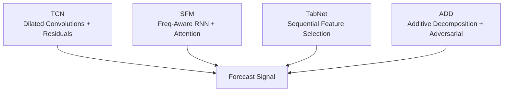

[No sources needed since this diagram shows conceptual workflow, not actual code structure]

## Detailed Component Analysis

### Temporal Convolutional Networks (TCN)
TCN uses stacked TemporalBlocks with exponential dilation to expand receptive fields efficiently. The wrapper constructs a TemporalConvNet and a linear output layer, trains with MSE loss, and supports early stopping based on validation score.

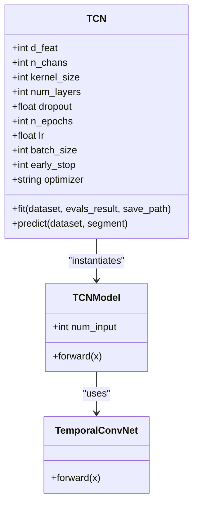

**Diagram sources**
- [pytorch_tcn.py:26-139](file://qlib/contrib/model/pytorch_tcn.py#L26-L139)
- [pytorch_tcn.py:299-311](file://qlib/contrib/model/pytorch_tcn.py#L299-L311)
- [tcn.py:16-77](file://qlib/contrib/model/tcn.py#L16-L77)

Training and evaluation flow:
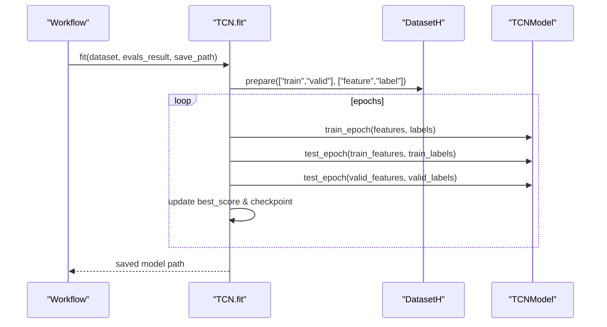

**Diagram sources**
- [pytorch_tcn.py:216-271](file://qlib/contrib/model/pytorch_tcn.py#L216-L271)
- [pytorch_tcn.py:164-215](file://qlib/contrib/model/pytorch_tcn.py#L164-L215)

Configuration highlights:
- Input dimension d_feat typically set to 6 or higher depending on handler features.
- Dilated convolution depth controlled by num_layers and kernel_size.
- Dropout regularization and early stopping prevent overfitting.
- Optimizer options include Adam and SGD; MSE loss is used.

Interpretability:
- TCN focuses on temporal pattern extraction; interpretability is limited compared to attention-based models.

Performance considerations:
- Batch size tuning impacts memory usage and convergence speed.
- Gradient clipping stabilizes training.
- Early stopping reduces training time and improves generalization.

**Section sources**
- [pytorch_tcn.py:26-139](file://qlib/contrib/model/pytorch_tcn.py#L26-L139)
- [pytorch_tcn.py:164-215](file://qlib/contrib/model/pytorch_tcn.py#L164-L215)
- [pytorch_tcn.py:216-271](file://qlib/contrib/model/pytorch_tcn.py#L216-L271)
- [tcn.py:16-77](file://qlib/contrib/model/tcn.py#L16-L77)
- [workflow_config_tcn_Alpha360.yaml:46-63](file://examples/benchmarks/TCN/workflow_config_tcn_Alpha360.yaml#L46-L63)

### Squeeze-and-Excitation Factorization Machine (SFM)
SFM integrates a frequency-aware recurrent unit with squeeze-excitation style gating and attention to capture both temporal and spectral characteristics of financial time series. It outputs a scalar prediction after processing sequences.

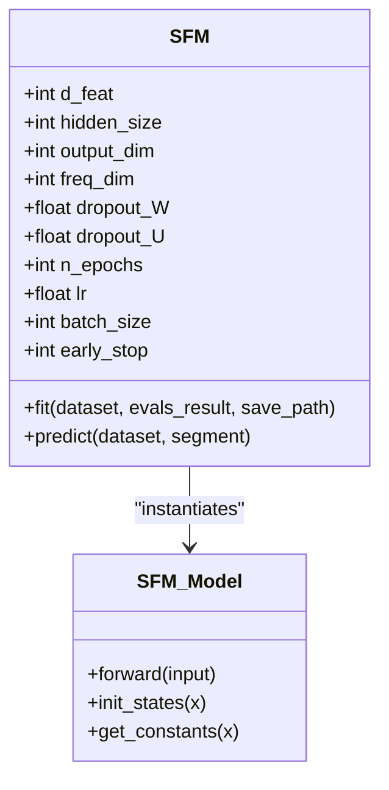

**Diagram sources**
- [pytorch_sfm.py:180-303](file://qlib/contrib/model/pytorch_sfm.py#L180-L303)
- [pytorch_sfm.py:25-179](file://qlib/contrib/model/pytorch_sfm.py#L25-L179)

Training and evaluation flow:
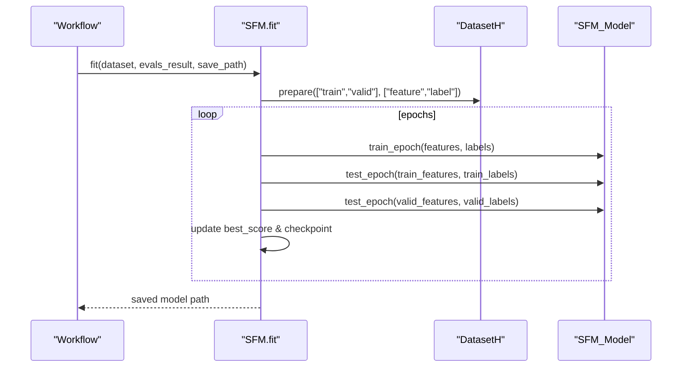

**Diagram sources**
- [pytorch_sfm.py:360-415](file://qlib/contrib/model/pytorch_sfm.py#L360-L415)
- [pytorch_sfm.py:336-359](file://qlib/contrib/model/pytorch_sfm.py#L336-L359)

Configuration highlights:
- Hidden size and frequency dimension control capacity and spectral resolution.
- Dropout rates on weights and recurrent states help regularize.
- Early stopping and batch size tuning are essential for stability.

Interpretability:
- Frequency-domain processing and attention provide insights into which frequencies contribute most to predictions.

Performance considerations:
- Gradient clipping prevents exploding gradients during recurrent updates.
- Proper initialization (Xavier/orthogonal) aids convergence.

**Section sources**
- [pytorch_sfm.py:25-179](file://qlib/contrib/model/pytorch_sfm.py#L25-L179)
- [pytorch_sfm.py:180-303](file://qlib/contrib/model/pytorch_sfm.py#L180-L303)
- [pytorch_sfm.py:336-415](file://qlib/contrib/model/pytorch_sfm.py#L336-L415)
- [workflow_config_sfm_Alpha360.yaml:46-63](file://examples/benchmarks/SFM/workflow_config_sfm_Alpha360.yaml#L46-L63)

### TabNet
TabNet implements sequential decision making through attention-based feature selection and multi-step feature transformation. It includes an encoder (TabNet), a decoder for self-supervised pretraining, and a finetuning head for downstream tasks. Sparsemax enforces sparsity in selected features, aiding interpretability.

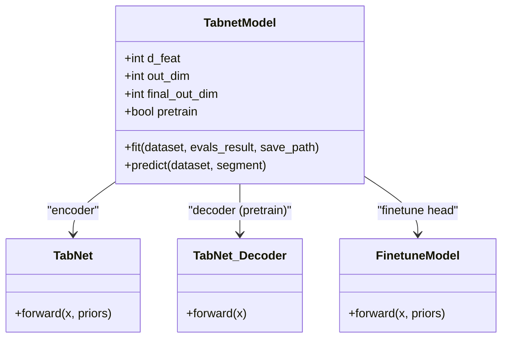

**Diagram sources**
- [pytorch_tabnet.py:25-110](file://qlib/contrib/model/pytorch_tabnet.py#L25-L110)
- [pytorch_tabnet.py:436-481](file://qlib/contrib/model/pytorch_tabnet.py#L436-L481)
- [pytorch_tabnet.py:410-434](file://qlib/contrib/model/pytorch_tabnet.py#L410-L434)
- [pytorch_tabnet.py:385-397](file://qlib/contrib/model/pytorch_tabnet.py#L385-L397)

Pretraining and fine-tuning flow:
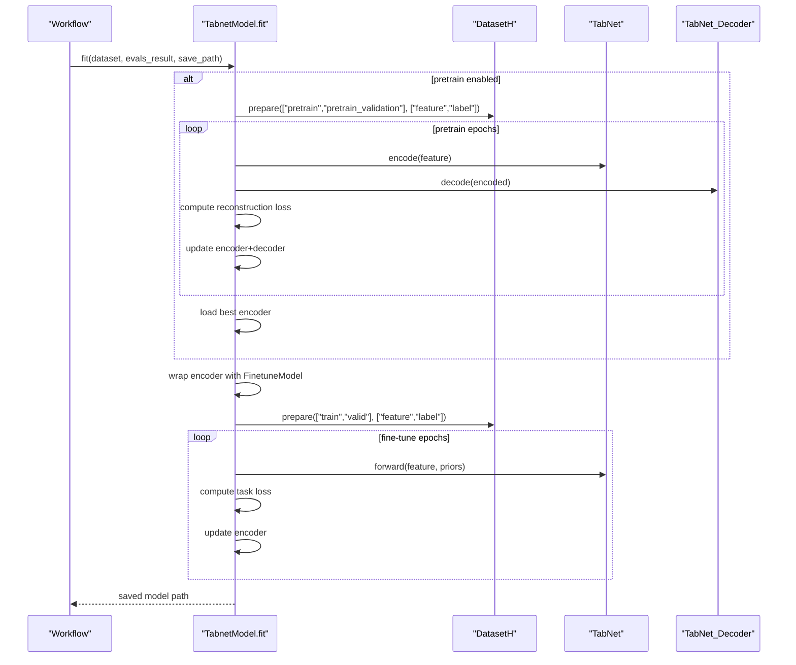

**Diagram sources**
- [pytorch_tabnet.py:112-163](file://qlib/contrib/model/pytorch_tabnet.py#L112-L163)
- [pytorch_tabnet.py:151-216](file://qlib/contrib/model/pytorch_tabnet.py#L151-L216)
- [pytorch_tabnet.py:299-358](file://qlib/contrib/model/pytorch_tabnet.py#L299-L358)

Configuration highlights:
- d_feat must match the number of features produced by the handler (e.g., 360 for Alpha360).
- Pretraining improves representation quality; virtual batch size controls normalization behavior.
- Sparsemax coefficient relax balances sparsity vs. information retention.

Interpretability:
- Sparse masks indicate which features are selected at each step, enabling feature importance analysis.

Performance considerations:
- Virtual batch normalization stabilizes training with small batches.
- Gradient clipping and early stopping ensure stable convergence.

**Section sources**
- [pytorch_tabnet.py:25-110](file://qlib/contrib/model/pytorch_tabnet.py#L25-L110)
- [pytorch_tabnet.py:112-216](file://qlib/contrib/model/pytorch_tabnet.py#L112-L216)
- [pytorch_tabnet.py:299-358](file://qlib/contrib/model/pytorch_tabnet.py#L299-L358)
- [pytorch_tabnet.py:436-481](file://qlib/contrib/model/pytorch_tabnet.py#L436-L481)
- [workflow_config_TabNet_Alpha360.yaml:46-66](file://examples/benchmarks/TabNet/workflow_config_TabNet_Alpha360.yaml#L46-L66)

### Additive Deep Network (ADD)
ADD decomposes predictions into additive components: excess return prediction, market classification, and adversarial branches for robustness. It also reconstructs input features to encourage meaningful representations. The model supports IC as a metric and uses daily batching for evaluation.

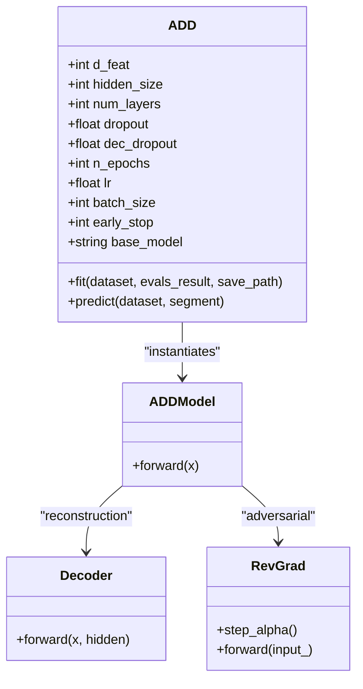

**Diagram sources**
- [pytorch_add.py:29-162](file://qlib/contrib/model/pytorch_add.py#L29-L162)
- [pytorch_add.py:442-525](file://qlib/contrib/model/pytorch_add.py#L442-L525)
- [pytorch_add.py:527-558](file://qlib/contrib/model/pytorch_add.py#L527-L558)
- [pytorch_add.py:576-598](file://qlib/contrib/model/pytorch_add.py#L576-L598)

Training and evaluation flow:
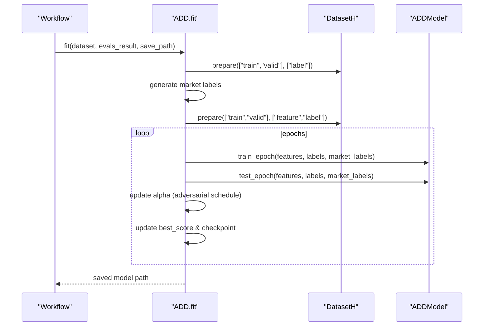

**Diagram sources**
- [pytorch_add.py:363-418](file://qlib/contrib/model/pytorch_add.py#L363-L418)
- [pytorch_add.py:278-303](file://qlib/contrib/model/pytorch_add.py#L278-L303)
- [pytorch_add.py:249-277](file://qlib/contrib/model/pytorch_add.py#L249-L277)

Configuration highlights:
- Base model can be GRU or LSTM; hidden size and layers control capacity.
- Adversarial parameters gamma and gamma_clip regulate robustness.
- Reconstruction weight mu balances fidelity vs. prediction accuracy.

Interpretability:
- Additive decomposition separates excess return and market effects.
- Reconstructed features reveal learned representations.
- Adversarial branches discourage reliance on spurious correlations.

Performance considerations:
- Daily batching aligns evaluation with trading calendar.
- Gradient clipping and early stopping stabilize training.
- IC metric directly optimizes rank correlation with returns.

**Section sources**
- [pytorch_add.py:29-162](file://qlib/contrib/model/pytorch_add.py#L29-L162)
- [pytorch_add.py:249-303](file://qlib/contrib/model/pytorch_add.py#L249-L303)
- [pytorch_add.py:363-418](file://qlib/contrib/model/pytorch_add.py#L363-L418)
- [pytorch_add.py:442-525](file://qlib/contrib/model/pytorch_add.py#L442-L525)
- [workflow_config_add_Alpha360.yaml:46-65](file://examples/benchmarks/ADD/workflow_config_add_Alpha360.yaml#L46-L65)

## Dependency Analysis
All models depend on QLib’s core abstractions:
- Model base class defines common interface and utilities.
- DatasetH and DataHandlerLP handle data loading, preprocessing, and segmentation.
- Configuration files specify hyperparameters, segments, and recorders.

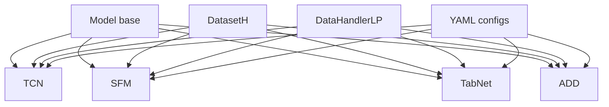

**Diagram sources**
- [pytorch_tcn.py:26-139](file://qlib/contrib/model/pytorch_tcn.py#L26-L139)
- [pytorch_sfm.py:180-303](file://qlib/contrib/model/pytorch_sfm.py#L180-L303)
- [pytorch_tabnet.py:25-110](file://qlib/contrib/model/pytorch_tabnet.py#L25-L110)
- [pytorch_add.py:29-162](file://qlib/contrib/model/pytorch_add.py#L29-L162)
- [workflow_config_tcn_Alpha360.yaml:46-63](file://examples/benchmarks/TCN/workflow_config_tcn_Alpha360.yaml#L46-L63)
- [workflow_config_sfm_Alpha360.yaml:46-63](file://examples/benchmarks/SFM/workflow_config_sfm_Alpha360.yaml#L46-L63)
- [workflow_config_TabNet_Alpha360.yaml:46-66](file://examples/benchmarks/TabNet/workflow_config_TabNet_Alpha360.yaml#L46-L66)
- [workflow_config_add_Alpha360.yaml:46-65](file://examples/benchmarks/ADD/workflow_config_add_Alpha360.yaml#L46-L65)

**Section sources**
- [pytorch_tcn.py:26-139](file://qlib/contrib/model/pytorch_tcn.py#L26-L139)
- [pytorch_sfm.py:180-303](file://qlib/contrib/model/pytorch_sfm.py#L180-L303)
- [pytorch_tabnet.py:25-110](file://qlib/contrib/model/pytorch_tabnet.py#L25-L110)
- [pytorch_add.py:29-162](file://qlib/contrib/model/pytorch_add.py#L29-L162)
- [workflow_config_tcn_Alpha360.yaml:46-63](file://examples/benchmarks/TCN/workflow_config_tcn_Alpha360.yaml#L46-L63)
- [workflow_config_sfm_Alpha360.yaml:46-63](file://examples/benchmarks/SFM/workflow_config_sfm_Alpha360.yaml#L46-L63)
- [workflow_config_TabNet_Alpha360.yaml:46-66](file://examples/benchmarks/TabNet/workflow_config_TabNet_Alpha360.yaml#L46-L66)
- [workflow_config_add_Alpha360.yaml:46-65](file://examples/benchmarks/ADD/workflow_config_add_Alpha360.yaml#L46-L65)

## Performance Considerations
- Batch size: Larger batches improve throughput but require more memory; tune per hardware constraints.
- Learning rate: Start with default values (e.g., 1e-3) and adjust based on convergence behavior.
- Early stopping: Prevents overfitting and reduces training time; monitor validation metrics closely.
- Gradient clipping: Stabilizes training, especially for recurrent models like SFM and ADD.
- Pretraining (TabNet): Improves representation quality when sufficient unlabeled data is available.
- Regularization: Dropout and sparse masks reduce overfitting and enhance interpretability.

[No sources needed since this section provides general guidance]

## Troubleshooting Guide
Common issues and resolutions:
- Empty dataset errors: Ensure dataset configuration specifies correct segments and handlers; verify data availability.
- NaN handling: Models mask NaN labels during loss computation; ensure input features are properly normalized and filled.
- GPU memory errors: Reduce batch size or use virtual batch normalization (TabNet) to manage memory usage.
- Convergence problems: Adjust learning rate, increase dropout, or enable pretraining (TabNet).
- Interpretability limitations: Use attention masks (TabNet) and frequency analysis (SFM) to understand feature contributions.

**Section sources**
- [pytorch_tabnet.py:151-176](file://qlib/contrib/model/pytorch_tabnet.py#L151-L176)
- [pytorch_sfm.py:420-434](file://qlib/contrib/model/pytorch_sfm.py#L420-L434)
- [pytorch_tcn.py:148-163](file://qlib/contrib/model/pytorch_tcn.py#L148-L163)
- [pytorch_add.py:249-277](file://qlib/contrib/model/pytorch_add.py#L249-L277)

## Conclusion
QLib’s specialized models offer diverse approaches to financial forecasting:
- TCN leverages dilated convolutions for efficient temporal modeling.
- SFM integrates frequency-aware processing with attention for rich feature interactions.
- TabNet provides interpretable sequential decision making with self-supervised pretraining.
- ADD delivers interpretable additive decomposition with adversarial robustness.

Each model is integrated with QLib’s workflow, supporting standardized training, evaluation, and deployment. Proper configuration and tuning are essential for optimal performance.

[No sources needed since this section summarizes without analyzing specific files]

## Appendices
- For detailed hyperparameter ranges and example configurations, refer to the YAML files in examples/benchmarks for each model.
- To extend models, follow the existing Model interface and integrate with DatasetH for data handling.

[No sources needed since this section provides general guidance]