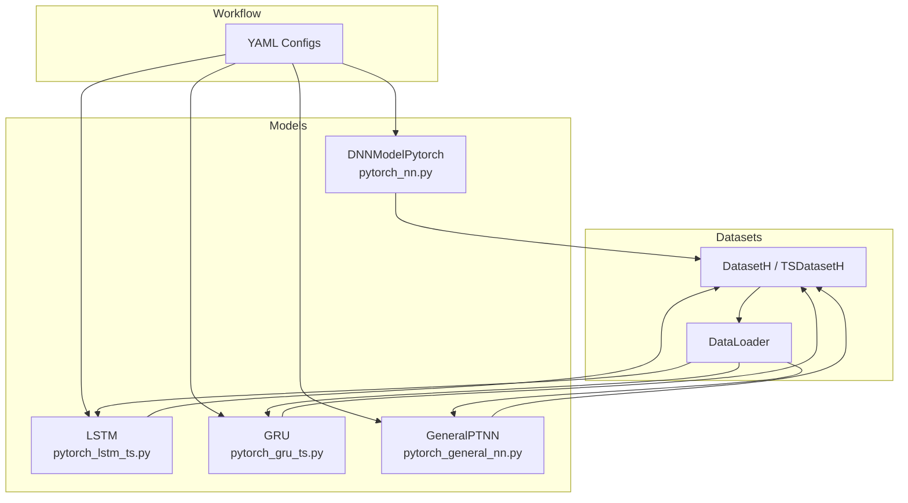
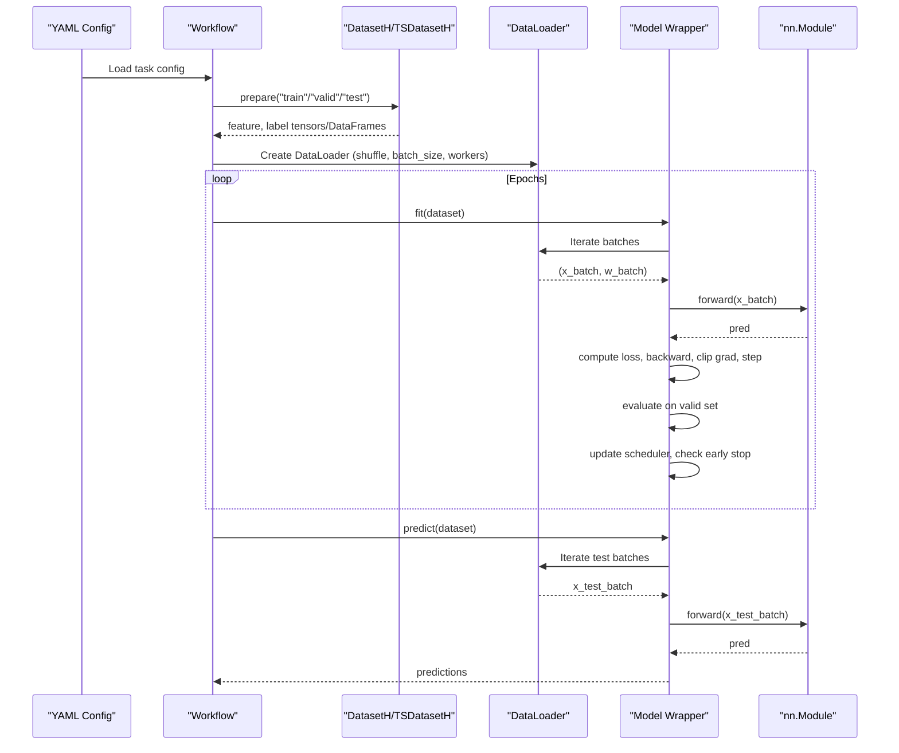
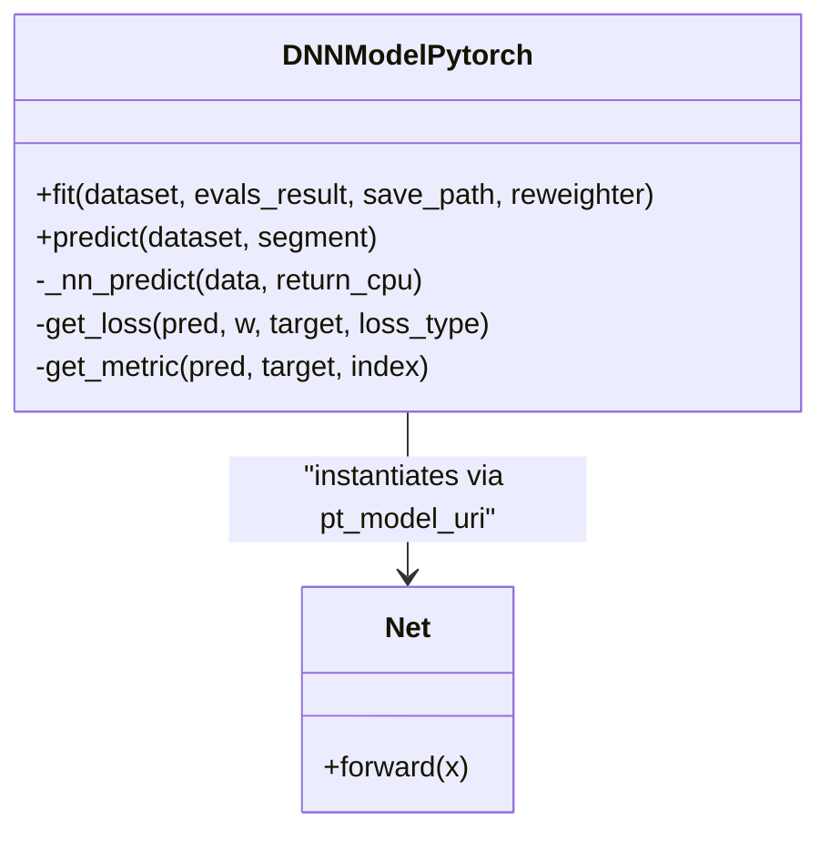
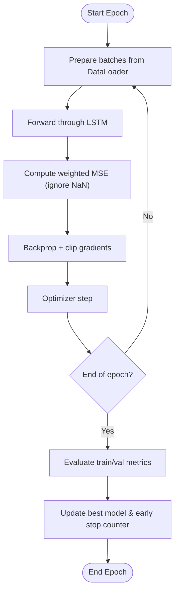
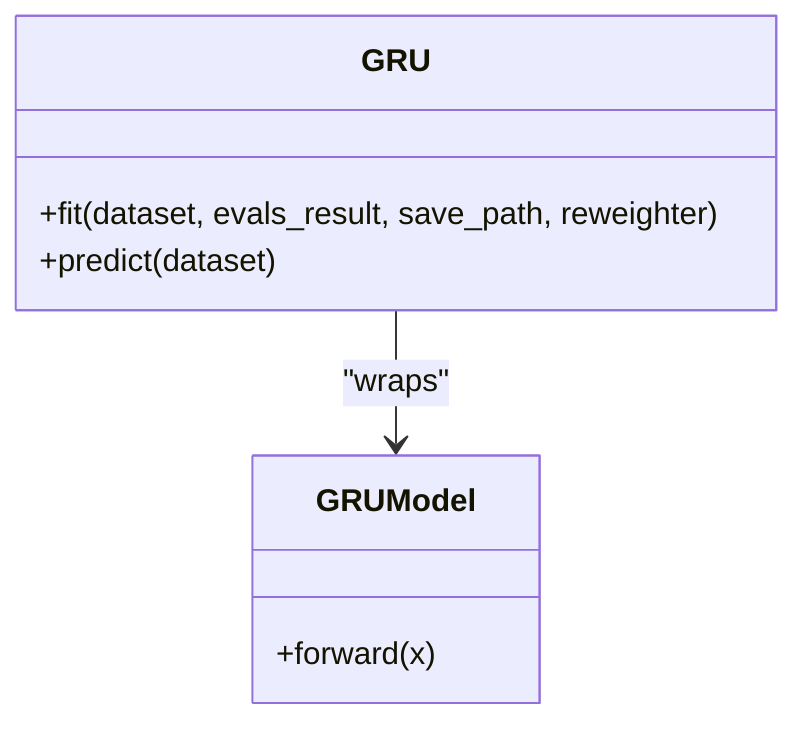
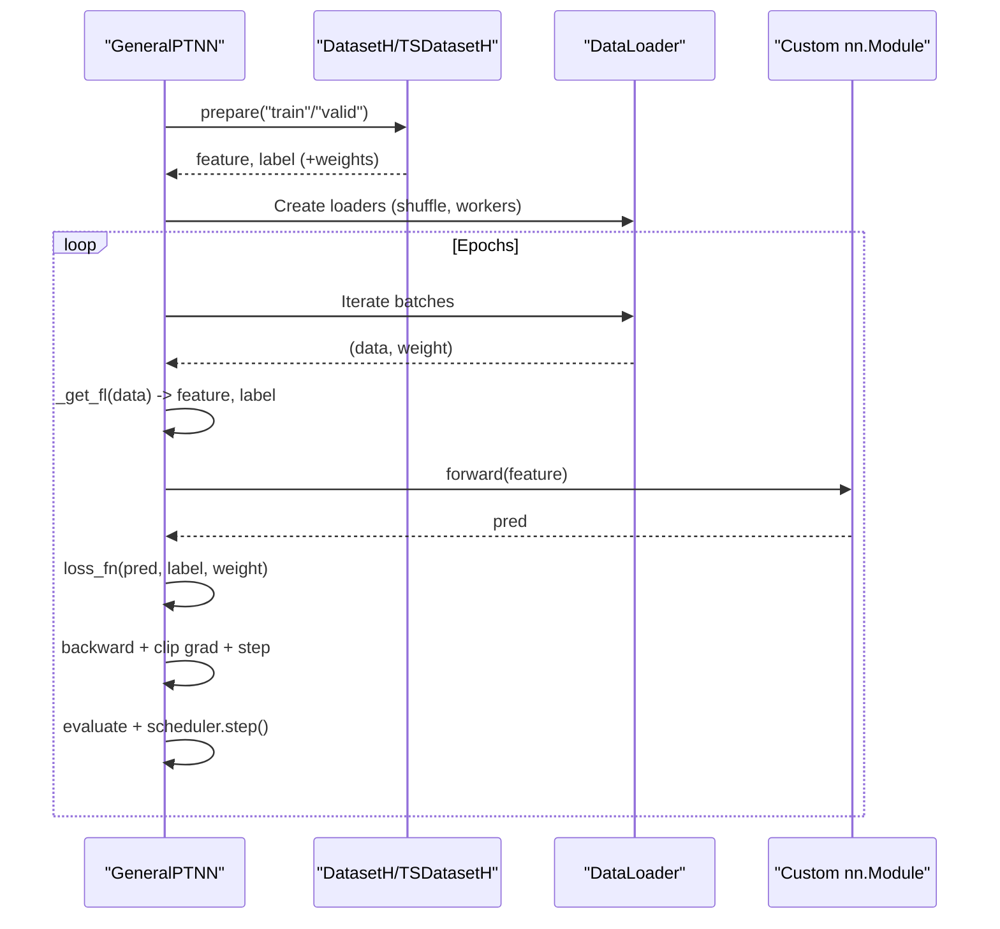
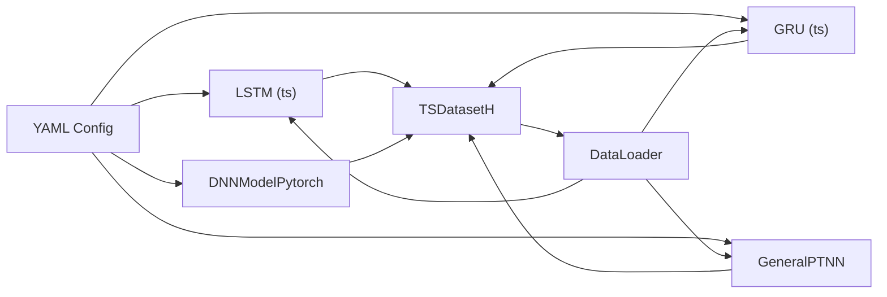

# Standard Networks (DNN, LSTM, GRU)

<cite>
**Referenced Files in This Document**
- [pytorch_nn.py](file://qlib/contrib/model/pytorch_nn.py)
- [pytorch_lstm.py](file://qlib/contrib/model/pytorch_lstm.py)
- [pytorch_gru.py](file://qlib/contrib/model/pytorch_gru.py)
- [pytorch_lstm_ts.py](file://qlib/contrib/model/pytorch_lstm_ts.py)
- [pytorch_gru_ts.py](file://qlib/contrib/model/pytorch_gru_ts.py)
- [pytorch_general_nn.py](file://qlib/contrib/model/pytorch_general_nn.py)
- [workflow_config_lstm_Alpha158.yaml](file://examples/benchmarks/LSTM/workflow_config_lstm_Alpha158.yaml)
- [workflow_config_gru_Alpha158.yaml](file://examples/benchmarks/GRU/workflow_config_gru_Alpha158.yaml)
- [workflow_config_mlp.yaml](file://examples/benchmarks/GeneralPtNN/workflow_config_mlp.yaml)
</cite>

## Table of Contents
1. Introduction
2. Project Structure
3. Core Components
4. Architecture Overview
5. Detailed Component Analysis
6. Dependency Analysis
7. Performance Considerations
8. Troubleshooting Guide
9. Conclusion
10. Appendices

## Introduction
This document explains QLib’s standard neural network models for tabular and time series data: DNN (via DNNModelPytorch), LSTM, and GRU. It covers model architectures, configuration options, training procedures (including early stopping and learning rate scheduling), integration with QLib’s dataset pipeline, and practical guidance for hyperparameter tuning, batch processing optimization, and GPU acceleration.

## Project Structure
QLib provides multiple implementations:
- Tabular DNN via a configurable wrapper and a default MLP Net.
- Time-series LSTM and GRU with dedicated wrappers that integrate with QLib’s TSDatasetH and DataLoader.
- A general PyTorch adapter to wrap arbitrary torch.nn.Module models.

**Diagram sources**
- [pytorch_nn.py:39-184](file://qlib/contrib/model/pytorch_nn.py#L39-L184)
- [pytorch_lstm_ts.py:25-131](file://qlib/contrib/model/pytorch_lstm_ts.py#L25-L131)
- [pytorch_gru_ts.py:26-135](file://qlib/contrib/model/pytorch_gru_ts.py#L26-L135)
- [pytorch_general_nn.py:33-145](file://qlib/contrib/model/pytorch_general_nn.py#L33-L145)
- [workflow_config_lstm_Alpha158.yaml:53-82](file://examples/benchmarks/LSTM/workflow_config_lstm_Alpha158.yaml#L53-L82)
- [workflow_config_gru_Alpha158.yaml:53-82](file://examples/benchmarks/GRU/workflow_config_gru_Alpha158.yaml#L53-L82)
- [workflow_config_mlp.yaml:58-83](file://examples/benchmarks/GeneralPtNN/workflow_config_mlp.yaml#L58-L83)

**Section sources**
- [pytorch_nn.py:39-184](file://qlib/contrib/model/pytorch_nn.py#L39-L184)
- [pytorch_lstm_ts.py:25-131](file://qlib/contrib/model/pytorch_lstm_ts.py#L25-L131)
- [pytorch_gru_ts.py:26-135](file://qlib/contrib/model/pytorch_gru_ts.py#L26-L135)
- [pytorch_general_nn.py:33-145](file://qlib/contrib/model/pytorch_general_nn.py#L33-L145)
- [workflow_config_lstm_Alpha158.yaml:53-82](file://examples/benchmarks/LSTM/workflow_config_lstm_Alpha158.yaml#L53-L82)
- [workflow_config_gru_Alpha158.yaml:53-82](file://examples/benchmarks/GRU/workflow_config_gru_Alpha158.yaml#L53-L82)
- [workflow_config_mlp.yaml:58-83](file://examples/benchmarks/GeneralPtNN/workflow_config_mlp.yaml#L58-L83)

## Core Components
- DNNModelPytorch: A tabular DNN trainer with configurable layers, activation functions, optimizer, loss, device placement, and learning rate scheduling. Uses a default MLP Net unless overridden.
- LSTM (time-series): Wraps nn.LSTM with a linear head; supports weighted MSE loss, gradient clipping, early stopping, and DataLoader-based batching.
- GRU (time-series): Same structure as LSTM but using nn.GRU.
- GeneralPTNN: A generic wrapper to train any torch.nn.Module with QLib datasets, including automatic handling of 2D (tabular) vs 3D (time series) inputs, weight support, and ReduceLROnPlateau scheduler.

Key capabilities across components:
- Early stopping based on validation metric.
- Gradient clipping to stabilize training.
- Device selection (CPU/GPU).
- Integration with QLib’s DatasetH/TSDatasetH and DataLoaders.
- Optional reweighting via Reweighter.

**Section sources**
- [pytorch_nn.py:39-184](file://qlib/contrib/model/pytorch_nn.py#L39-L184)
- [pytorch_lstm_ts.py:25-131](file://qlib/contrib/model/pytorch_lstm_ts.py#L25-L131)
- [pytorch_gru_ts.py:26-135](file://qlib/contrib/model/pytorch_gru_ts.py#L26-L135)
- [pytorch_general_nn.py:33-145](file://qlib/contrib/model/pytorch_general_nn.py#L33-L145)

## Architecture Overview
The models follow a consistent pattern:
- Data preparation via QLib handlers and datasets.
- Batching through DataLoader (for time-series and general NN).
- Training loop with per-batch forward/backward steps, optional gradient clipping, and periodic evaluation.
- Early stopping and best checkpoint saving.
- Inference with no-grad mode and batched prediction.

**Diagram sources**
- [pytorch_lstm_ts.py:195-274](file://qlib/contrib/model/pytorch_lstm_ts.py#L195-L274)
- [pytorch_gru_ts.py:200-279](file://qlib/contrib/model/pytorch_gru_ts.py#L200-L279)
- [pytorch_general_nn.py:235-332](file://qlib/contrib/model/pytorch_general_nn.py#L235-L332)
- [workflow_config_lstm_Alpha158.yaml:53-82](file://examples/benchmarks/LSTM/workflow_config_lstm_Alpha158.yaml#L53-L82)
- [workflow_config_gru_Alpha158.yaml:53-82](file://examples/benchmarks/GRU/workflow_config_gru_Alpha158.yaml#L53-L82)
- [workflow_config_mlp.yaml:58-83](file://examples/benchmarks/GeneralPtNN/workflow_config_mlp.yaml#L58-L83)

## Detailed Component Analysis

### DNNModelPytorch (Tabular DNN)
- Model definition: Default MLP Net built from input_dim, layers tuple, activation (LeakyReLU or SiLU), BatchNorm, Dropout, and Kaiming initialization.
- Training loop: Random mini-batches, MSE or binary cross-entropy with optional sample weights, periodic validation, early stopping by best validation loss, and saving checkpoints.
- Learning rate scheduling: Built-in ReduceLROnPlateau when scheduler is "default", or accept a custom callable.
- Device management: Automatic CPU/GPU selection; optional DataParallel wrapping.
- Metrics: Uses an IC-based metric for ranking tasks; supports both MSE and binary classification losses.

**Diagram sources**
- [pytorch_nn.py:39-184](file://qlib/contrib/model/pytorch_nn.py#L39-L184)
- [pytorch_nn.py:426-463](file://qlib/contrib/model/pytorch_nn.py#L426-L463)

Practical notes
- Configure layers and activations via pt_model_kwargs to tailor the MLP depth and width.
- Use data_parall=True to enable DataParallel if you have multiple GPUs.
- For classification, set loss="binary"; for regression, use loss="mse".
- Early stopping is driven by validation loss; adjust early_stop_rounds and eval_steps to balance speed and stability.

**Section sources**
- [pytorch_nn.py:39-184](file://qlib/contrib/model/pytorch_nn.py#L39-L184)
- [pytorch_nn.py:190-337](file://qlib/contrib/model/pytorch_nn.py#L190-L337)
- [pytorch_nn.py:358-387](file://qlib/contrib/model/pytorch_nn.py#L358-L387)
- [pytorch_nn.py:426-463](file://qlib/contrib/model/pytorch_nn.py#L426-L463)

### LSTM (Time Series)
- Architecture: nn.LSTM with configurable hidden size, number of layers, dropout; final linear head predicts next-step value.
- Sequence handling: Expects 3D input [batch, features, time]; reshapes internally to [batch, time, features] before feeding into RNN.
- Training: Weighted MSE loss ignoring NaN labels; gradient clipping; epoch-wise evaluation on train and validation sets; early stopping by best validation score.
- Data pipeline: Integrates with TSDatasetH and DataLoader; supports fillna_type for robustness during dataloading.

**Diagram sources**
- [pytorch_lstm_ts.py:160-193](file://qlib/contrib/model/pytorch_lstm_ts.py#L160-L193)
- [pytorch_lstm_ts.py:195-274](file://qlib/contrib/model/pytorch_lstm_ts.py#L195-L274)

**Section sources**
- [pytorch_lstm_ts.py:25-131](file://qlib/contrib/model/pytorch_lstm_ts.py#L25-L131)
- [pytorch_lstm_ts.py:160-193](file://qlib/contrib/model/pytorch_lstm_ts.py#L160-L193)
- [pytorch_lstm_ts.py:195-274](file://qlib/contrib/model/pytorch_lstm_ts.py#L195-L274)
- [pytorch_lstm_ts.py:276-294](file://qlib/contrib/model/pytorch_lstm_ts.py#L276-L294)

### GRU (Time Series)
- Architecture: Identical workflow to LSTM but uses nn.GRU; often slightly faster with comparable performance.
- Sequence handling: Same [batch, features, time] convention; extracts last time-step representation for prediction.
- Training: Weighted MSE loss, gradient clipping, early stopping, and DataLoader-based batching.

**Diagram sources**
- [pytorch_gru_ts.py:26-135](file://qlib/contrib/model/pytorch_gru_ts.py#L26-L135)
- [pytorch_gru_ts.py:302-319](file://qlib/contrib/model/pytorch_gru_ts.py#L302-L319)

**Section sources**
- [pytorch_gru_ts.py:26-135](file://qlib/contrib/model/pytorch_gru_ts.py#L26-L135)
- [pytorch_gru_ts.py:164-198](file://qlib/contrib/model/pytorch_gru_ts.py#L164-L198)
- [pytorch_gru_ts.py:200-279](file://qlib/contrib/model/pytorch_gru_ts.py#L200-L279)
- [pytorch_gru_ts.py:281-299](file://qlib/contrib/model/pytorch_gru_ts.py#L281-L299)

### GeneralPTNN (Generic PyTorch Adapter)
- Purpose: Train any torch.nn.Module with QLib datasets, supporting both tabular (2D) and time-series (3D) inputs.
- Features:
  - Automatic detection of input shape to extract features and labels.
  - Supports sample weights via Reweighter.
  - Built-in ReduceLROnPlateau scheduler.
  - Multi-worker DataLoader for efficient data loading.
- Usage: Provide pt_model_uri and pt_model_kwargs to instantiate your custom model.

**Diagram sources**
- [pytorch_general_nn.py:33-145](file://qlib/contrib/model/pytorch_general_nn.py#L33-L145)
- [pytorch_general_nn.py:174-233](file://qlib/contrib/model/pytorch_general_nn.py#L174-L233)
- [pytorch_general_nn.py:235-332](file://qlib/contrib/model/pytorch_general_nn.py#L235-L332)

**Section sources**
- [pytorch_general_nn.py:33-145](file://qlib/contrib/model/pytorch_general_nn.py#L33-L145)
- [pytorch_general_nn.py:174-233](file://qlib/contrib/model/pytorch_general_nn.py#L174-L233)
- [pytorch_general_nn.py:235-332](file://qlib/contrib/model/pytorch_general_nn.py#L235-L332)

## Dependency Analysis
- Models depend on QLib’s dataset abstractions (DatasetH/TSDatasetH) and DataHandlerLP for data access keys.
- Time-series models rely on DataLoader and ConcatDataset to pair samples with weights.
- DNNModelPytorch optionally uses DataParallel for multi-GPU training and can be configured via pt_model_uri/kwargs to swap the underlying architecture.
- YAML configs bind models to datasets and specify segments, step_len, and handler configurations.

**Diagram sources**
- [workflow_config_lstm_Alpha158.yaml:53-82](file://examples/benchmarks/LSTM/workflow_config_lstm_Alpha158.yaml#L53-L82)
- [workflow_config_gru_Alpha158.yaml:53-82](file://examples/benchmarks/GRU/workflow_config_gru_Alpha158.yaml#L53-L82)
- [workflow_config_mlp.yaml:58-83](file://examples/benchmarks/GeneralPtNN/workflow_config_mlp.yaml#L58-L83)
- [pytorch_lstm_ts.py:195-274](file://qlib/contrib/model/pytorch_lstm_ts.py#L195-L274)
- [pytorch_gru_ts.py:200-279](file://qlib/contrib/model/pytorch_gru_ts.py#L200-L279)
- [pytorch_general_nn.py:235-332](file://qlib/contrib/model/pytorch_general_nn.py#L235-L332)

**Section sources**
- [workflow_config_lstm_Alpha158.yaml:53-82](file://examples/benchmarks/LSTM/workflow_config_lstm_Alpha158.yaml#L53-L82)
- [workflow_config_gru_Alpha158.yaml:53-82](file://examples/benchmarks/GRU/workflow_config_gru_Alpha158.yaml#L53-L82)
- [workflow_config_mlp.yaml:58-83](file://examples/benchmarks/GeneralPtNN/workflow_config_mlp.yaml#L58-L83)

## Performance Considerations
- Batch size: Larger batches improve throughput but require more memory. Tune batch_size per dataset size and GPU capacity.
- Workers: Increase n_jobs for faster data loading; ensure sufficient CPU cores and RAM.
- Gradient clipping: Present in LSTM/GRU to prevent exploding gradients; keep values moderate.
- Memory: Time-series models load sequences into memory; consider step_len and batch_size trade-offs.
- GPU usage: Ensure GPU ID is set correctly; free CUDA cache after training to avoid leaks.
- Scheduling: Use ReduceLROnPlateau to adapt learning rates based on validation performance.

[No sources needed since this section provides general guidance]

## Troubleshooting Guide
Common issues and resolutions:
- Empty dataset error: Ensure segments are defined and non-empty in dataset configuration.
- NaN labels: Loss functions mask NaN labels; verify preprocessing to minimize missing values.
- Out-of-memory: Reduce batch_size or sequence length; lower n_jobs; ensure GPU memory is freed.
- Slow training: Increase n_jobs; use DataLoader drop_last to avoid partial batches; consider mixed precision if supported by your environment.
- Poor convergence: Adjust learning rate; enable/disable gradient clipping; tune early_stop; try different optimizers or schedulers.

**Section sources**
- [pytorch_lstm_ts.py:195-274](file://qlib/contrib/model/pytorch_lstm_ts.py#L195-L274)
- [pytorch_gru_ts.py:200-279](file://qlib/contrib/model/pytorch_gru_ts.py#L200-L279)
- [pytorch_general_nn.py:235-332](file://qlib/contrib/model/pytorch_general_nn.py#L235-L332)

## Conclusion
QLib’s standard networks provide robust, configurable solutions for both tabular and time-series forecasting:
- DNNModelPytorch offers a flexible MLP with tunable layers, activations, and scheduling.
- LSTM and GRU implement efficient sequence modeling with integrated data pipelines, early stopping, and gradient clipping.
- GeneralPTNN enables rapid experimentation with custom PyTorch models while leveraging QLib’s dataset infrastructure.

Use the provided YAML configurations as starting points and iteratively tune hyperparameters for your specific datasets and hardware constraints.

[No sources needed since this section summarizes without analyzing specific files]

## Appendices

### Hyperparameter Tuning Guidelines
- DNN:
  - Layers: Increase depth/width gradually; monitor overfitting.
  - Activation: LeakyReLU or SiLU; choose based on empirical results.
  - Optimizer: Adam typically stable; SGD with momentum may generalize better with careful tuning.
  - Scheduler: ReduceLROnPlateau recommended; tune patience and factor.
- LSTM/GRU:
  - Hidden size and layers: Start small (e.g., 64–128, 1–2 layers); increase if underfitting.
  - Dropout: Apply to mitigate overfitting; typical range 0.0–0.3.
  - Learning rate: 1e-3 to 2e-4; reduce if unstable.
  - Early stopping: Set patience to avoid overtraining; monitor validation metric.
- GeneralPTNN:
  - Provide a well-initialized nn.Module; ensure correct input shapes for tabular vs time-series.
  - Use weight_decay and scheduler to regularize and stabilize training.

[No sources needed since this section provides general guidance]

### Practical Examples and Configuration References
- LSTM time-series workflow: See example configuration for dataset segments, handler, and model parameters.
- GRU time-series workflow: Similar structure with tuned learning rate and batch size.
- DNN via GeneralPTNN: Configure pt_model_uri to point to qlib.contrib.model.pytorch_nn.Net and set input_dim accordingly.

**Section sources**
- [workflow_config_lstm_Alpha158.yaml:53-82](file://examples/benchmarks/LSTM/workflow_config_lstm_Alpha158.yaml#L53-L82)
- [workflow_config_gru_Alpha158.yaml:53-82](file://examples/benchmarks/GRU/workflow_config_gru_Alpha158.yaml#L53-L82)
- [workflow_config_mlp.yaml:58-83](file://examples/benchmarks/GeneralPtNN/workflow_config_mlp.yaml#L58-L83)