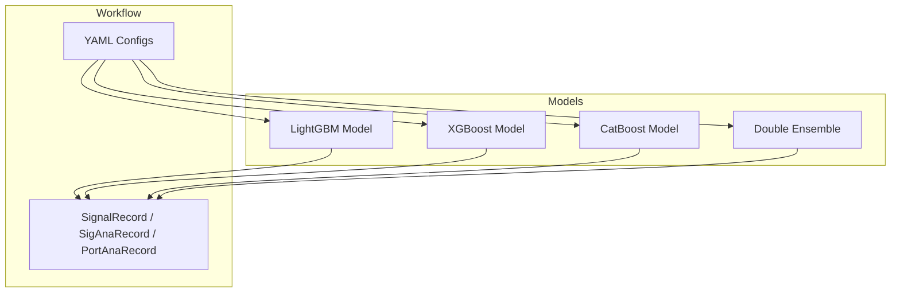
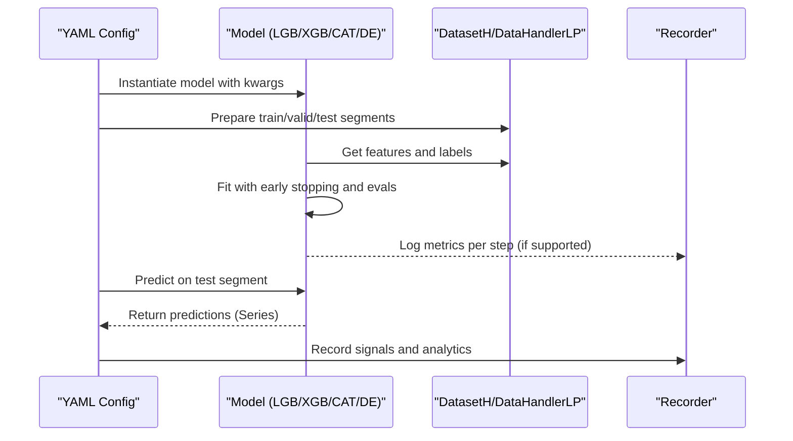
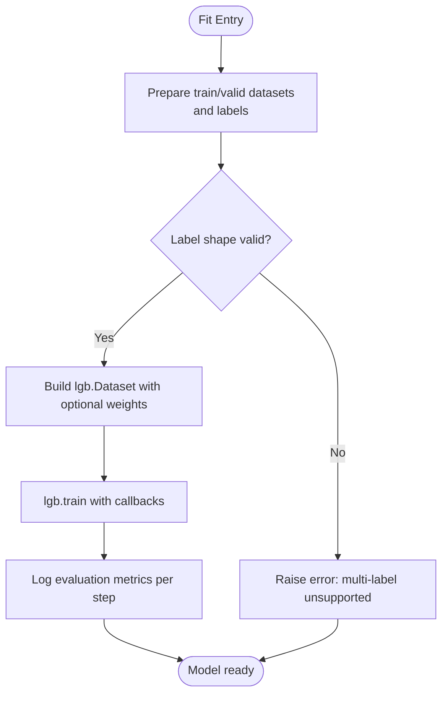
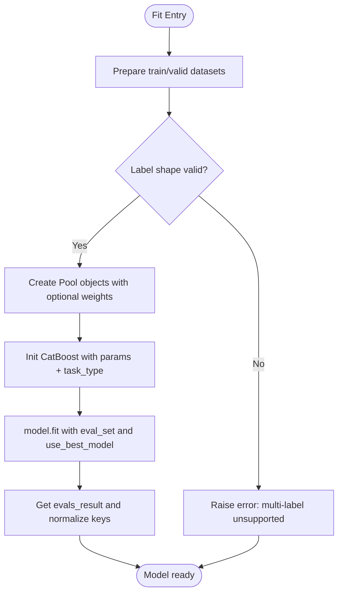
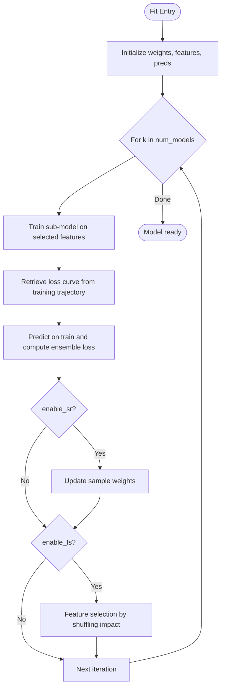
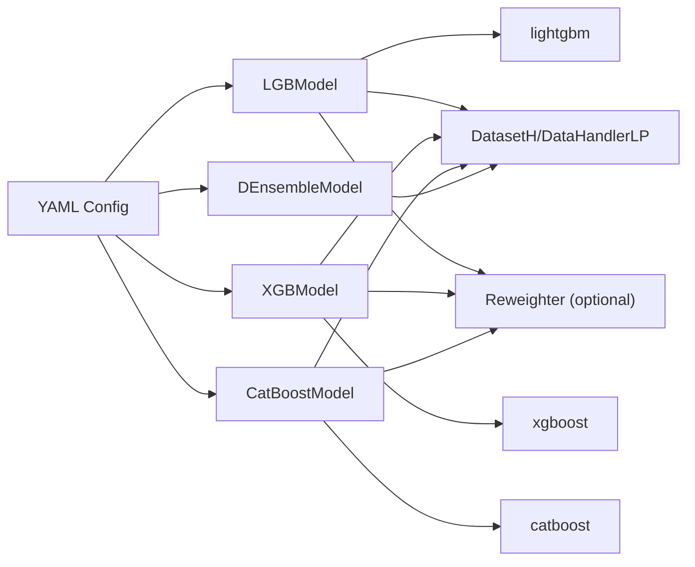

# Tree-Based Models

<cite>
**Referenced Files in This Document**
- [gbdt.py](file://qlib/contrib/model/gbdt.py)
- [xgboost.py](file://qlib/contrib/model/xgboost.py)
- [catboost_model.py](file://qlib/contrib/model/catboost_model.py)
- [double_ensemble.py](file://qlib/contrib/model/double_ensemble.py)
- [workflow_config_lightgbm_Alpha158.yaml](file://examples/benchmarks/LightGBM/workflow_config_lightgbm_Alpha158.yaml)
- [workflow_config_xgboost_Alpha158.yaml](file://examples/benchmarks/XGBoost/workflow_config_xgboost_Alpha158.yaml)
- [workflow_config_catboost_Alpha158.yaml](file://examples/benchmarks/CatBoost/workflow_config_catboost_Alpha158.yaml)
- [workflow_config_doubleensemble_Alpha158.yaml](file://examples/benchmarks/DoubleEnsemble/workflow_config_doubleensemble_Alpha158.yaml)
- [hyperparameter_158.py](file://examples/hyperparameter/LightGBM/hyperparameter_158.py)
- [record_temp.py](file://qlib/workflow/record_temp.py)
</cite>

## Table of Contents
1. Introduction
2. Project Structure
3. Core Components
4. Architecture Overview
5. Detailed Component Analysis
6. Dependency Analysis
7. Performance Considerations
8. Troubleshooting Guide
9. Conclusion
10. Appendices

## Introduction
This document provides comprehensive documentation for QLib’s tree-based machine learning models: LightGBM, XGBoost, CatBoost, and the Double Ensemble method. It explains configuration parameters, hyperparameter tuning options, performance characteristics, and best practices for financial time series data. It also covers computational efficiency, memory usage, and scalability considerations for large datasets, with practical examples from workflow configuration files.

## Project Structure
QLib organizes tree-based models under contrib/model and exposes them via workflow configurations in examples/benchmarks. Each model implements a consistent interface (fit/predict/feature importance where applicable), integrates with QLib’s dataset handler, and supports optional sample reweighting. Workflow YAMLs define tasks that instantiate models, datasets, and recording pipelines.

**Diagram sources**
- [workflow_config_lightgbm_Alpha158.yaml:31-72](file://examples/benchmarks/LightGBM/workflow_config_lightgbm_Alpha158.yaml#L31-L72)
- [workflow_config_xgboost_Alpha158.yaml:31-70](file://examples/benchmarks/XGBoost/workflow_config_xgboost_Alpha158.yaml#L31-L70)
- [workflow_config_catboost_Alpha158.yaml:31-71](file://examples/benchmarks/CatBoost/workflow_config_catboost_Alpha158.yaml#L31-L71)
- [workflow_config_doubleensemble_Alpha158.yaml:31-93](file://examples/benchmarks/DoubleEnsemble/workflow_config_doubleensemble_Alpha158.yaml#L31-L93)

**Section sources**
- [workflow_config_lightgbm_Alpha158.yaml:1-72](file://examples/benchmarks/LightGBM/workflow_config_lightgbm_Alpha158.yaml#L1-L72)
- [workflow_config_xgboost_Alpha158.yaml:1-70](file://examples/benchmarks/XGBoost/workflow_config_xgboost_Alpha158.yaml#L1-L70)
- [workflow_config_catboost_Alpha158.yaml:1-71](file://examples/benchmarks/CatBoost/workflow_config_catboost_Alpha158.yaml#L1-L71)
- [workflow_config_doubleensemble_Alpha158.yaml:1-93](file://examples/benchmarks/DoubleEnsemble/workflow_config_doubleensemble_Alpha158.yaml#L1-L93)

## Core Components
- LightGBM Model: Gradient boosting with efficient leaf-wise growth; supports early stopping, logging, evaluation callbacks, and finetuning on existing models.
- XGBoost Model: Scalable gradient boosting with DMatrix inputs; supports early stopping and evaluation result aggregation.
- CatBoost Model: Gradient boosting with categorical feature support; auto GPU detection; uses Pool objects and built-in early stopping.
- Double Ensemble: Iterative ensemble of sub-models with sample reweighting and feature selection to improve stability and reduce overfitting on noisy financial data.

Key shared behaviors:
- Data preparation via DatasetH and DataHandlerLP.
- Optional sample reweighting through Reweighter.
- Consistent fit/predict interfaces and optional feature importance methods.

**Section sources**
- [gbdt.py:16-127](file://qlib/contrib/model/gbdt.py#L16-L127)
- [xgboost.py:15-86](file://qlib/contrib/model/xgboost.py#L15-L86)
- [catboost_model.py:17-101](file://qlib/contrib/model/catboost_model.py#L17-L101)
- [double_ensemble.py:15-278](file://qlib/contrib/model/double_ensemble.py#L15-L278)

## Architecture Overview
The training and prediction flow is standardized across models:
- Workflow YAML instantiates a model class and dataset segments (train/valid/test).
- The model prepares features and labels, optionally applies sample weights, and trains with early stopping and evaluation callbacks.
- Predictions are returned as pandas Series aligned to the dataset index.
- SignalRecord/SigAnaRecord compute IC, Rank IC, precision, and long-short returns for evaluation.

**Diagram sources**
- [gbdt.py:57-96](file://qlib/contrib/model/gbdt.py#L57-L96)
- [xgboost.py:23-75](file://qlib/contrib/model/xgboost.py#L23-L75)
- [catboost_model.py:28-84](file://qlib/contrib/model/catboost_model.py#L28-L84)
- [double_ensemble.py:65-259](file://qlib/contrib/model/double_ensemble.py#L65-L259)
- [record_temp.py:258-294](file://qlib/workflow/record_temp.py#L258-L294)

## Detailed Component Analysis

### LightGBM Model
- Purpose: Fast, accurate gradient boosting with leaf-wise tree growth and robust regularization.
- Key parameters:
  - loss: objective function (e.g., mse, binary)
  - num_boost_round: total boosting iterations
  - early_stopping_rounds: stop if no improvement for N rounds
  - colsample_bytree, subsample, lambda_l1, lambda_l2, max_depth, num_leaves, num_threads
- Data handling:
  - Requires 1D label arrays; multi-label not supported
  - Supports optional sample weights via Reweighter
- Training:
  - Uses lgb.Dataset and callbacks for early stopping, logging, and evaluation recording
  - Logs metrics to QLib recorder during training
- Finetuning:
  - Continues training from an existing model with additional rounds

**Diagram sources**
- [gbdt.py:28-90](file://qlib/contrib/model/gbdt.py#L28-L90)

**Section sources**
- [gbdt.py:16-127](file://qlib/contrib/model/gbdt.py#L16-L127)
- [workflow_config_lightgbm_Alpha158.yaml:31-72](file://examples/benchmarks/LightGBM/workflow_config_lightgbm_Alpha158.yaml#L31-L72)

### XGBoost Model
- Purpose: Scalable gradient boosting with DMatrix-backed training and strong performance.
- Key parameters:
  - eval_metric: evaluation metric (e.g., rmse)
  - colsample_bytree, eta (learning rate), max_depth, n_estimators, subsample, nthread
- Data handling:
  - Requires 1D label arrays; multi-label not supported
  - Supports optional sample weights via Reweighter
- Training:
  - Uses xgb.DMatrix and xgb.train with early stopping and evaluation results
  - Aggregates train/valid evaluation histories

```mermaid
flowchart TD
Start(["Fit Entry"]) --> Prep["Prepare train/valid datasets"]
Prep --> LabelCheck{"Label shape valid?"}
LabelCheck --> |No| Err["Raise error: multi-label unsupported"]
LabelCheck --> |Yes| DM["Create DMatrix with optional weights"]
DM --> Train["xgb.train with early stopping"]
Train --> Eval["Aggregate evals_result"]
Eval --> End(["Model ready"])
Err --> End
```

**Diagram sources**
- [xgboost.py:23-69](file://qlib/contrib/model/xgboost.py#L23-L69)

**Section sources**
- [xgboost.py:15-86](file://qlib/contrib/model/xgboost.py#L15-L86)
- [workflow_config_xgboost_Alpha158.yaml:31-70](file://examples/benchmarks/XGBoost/workflow_config_xgboost_Alpha158.yaml#L31-L70)

### CatBoost Model
- Purpose: Gradient boosting optimized for categorical features with automatic GPU detection.
- Key parameters:
  - loss_function: RMSE or Logloss
  - iterations, early_stopping_rounds, verbose_eval
  - thread_count, grow_policy, bootstrap_type
- Data handling:
  - Uses catboost.Pool for train/valid sets with optional weights
  - Requires 1D label arrays; multi-label not supported
- Training:
  - Initializes CatBoost with task_type set to GPU if available
  - Trains with use_best_model=True and records evaluation results

**Diagram sources**
- [catboost_model.py:28-79](file://qlib/contrib/model/catboost_model.py#L28-L79)

**Section sources**
- [catboost_model.py:17-101](file://qlib/contrib/model/catboost_model.py#L17-L101)
- [workflow_config_catboost_Alpha158.yaml:31-71](file://examples/benchmarks/CatBoost/workflow_config_catboost_Alpha158.yaml#L31-L71)

### Double Ensemble Model
- Purpose: Iterative ensemble framework combining multiple sub-models with:
  - Sample Re-weighting (SR): Emphasizes samples that are harder to predict based on training dynamics and ensemble loss
  - Feature Selection (FS): Selects informative features by measuring impact of shuffling each feature
- Key parameters:
  - base_model: currently supports "gbm" (LightGBM)
  - num_models: number of sub-models to train sequentially
  - enable_sr, enable_fs: toggles for SR and FS modules
  - alpha1, alpha2: weights for SR components
  - bins_sr, bins_fs: binning granularity for SR and FS
  - decay: decay factor for SR weight updates
  - sample_ratios: fraction of features sampled per FS bin
  - sub_weights: weighting of each sub-model in final prediction
  - epochs, early_stopping_rounds: training controls
- Training loop:
  - For each sub-model:
    - Train sub-model on current feature set and sample weights
    - Retrieve per-sample loss curve from training trajectory
    - Compute ensemble loss and update sample weights (if enabled)
    - Perform feature selection to refine feature set for next iteration
- Prediction:
  - Weighted average of sub-model predictions using sub_weights

**Diagram sources**
- [double_ensemble.py:65-219](file://qlib/contrib/model/double_ensemble.py#L65-L219)

**Section sources**
- [double_ensemble.py:15-278](file://qlib/contrib/model/double_ensemble.py#L15-L278)
- [workflow_config_doubleensemble_Alpha158.yaml:31-93](file://examples/benchmarks/DoubleEnsemble/workflow_config_doubleensemble_Alpha158.yaml#L31-L93)

## Dependency Analysis
- Model classes depend on:
  - QLib DatasetH and DataHandlerLP for data access
  - External libraries: lightgbm, xgboost, catboost
  - Optional Reweighter for sample weighting
- Workflow configs depend on:
  - Task definitions that instantiate models and datasets
  - Recording pipeline components for signal and portfolio analysis

**Diagram sources**
- [gbdt.py:1-13](file://qlib/contrib/model/gbdt.py#L1-L13)
- [xgboost.py:1-13](file://qlib/contrib/model/xgboost.py#L1-L13)
- [catboost_model.py:1-15](file://qlib/contrib/model/catboost_model.py#L1-L15)
- [double_ensemble.py:1-13](file://qlib/contrib/model/double_ensemble.py#L1-L13)

**Section sources**
- [gbdt.py:1-13](file://qlib/contrib/model/gbdt.py#L1-L13)
- [xgboost.py:1-13](file://qlib/contrib/model/xgboost.py#L1-L13)
- [catboost_model.py:1-15](file://qlib/contrib/model/catboost_model.py#L1-L15)
- [double_ensemble.py:1-13](file://qlib/contrib/model/double_ensemble.py#L1-L13)

## Performance Considerations
- Computational efficiency:
  - LightGBM: Leaf-wise growth and histogram-based splitting provide fast training; tune num_leaves, max_depth, subsample, and colsample_bytree for speed vs accuracy trade-offs.
  - XGBoost: Efficient DMatrix and parallel tree building; control n_estimators, max_depth, and subsample to balance performance and runtime.
  - CatBoost: Built-in categorical handling and GPU acceleration; use thread_count and appropriate grow_policy for optimal throughput.
  - Double Ensemble: Multiple sub-models increase compute cost; adjust num_models and epochs to manage resource usage.
- Memory usage:
  - All models load features into memory; ensure sufficient RAM for large datasets.
  - Use free_raw_data=False in LightGBM to avoid redundant copies when possible.
  - CatBoost Pool objects hold data; consider batching or sampling for very large datasets.
- Scalability:
  - Parallelism: Set num_threads/nthread/thread_count appropriately for CPU utilization.
  - Early stopping: Prevent overfitting and reduce unnecessary iterations.
  - Dataset segmentation: Use rolling windows or time-based splits to scale training across periods.
- Evaluation metrics:
  - SignalRecord computes IC, Rank IC, precision, and long-short returns for model assessment.

[No sources needed since this section provides general guidance]

## Troubleshooting Guide
Common issues and resolutions:
- Multi-label training errors:
  - LightGBM, XGBoost, CatBoost require 1D labels; ensure labels are flattened before training.
  - Errors raised explicitly when multi-label detected.
- Empty dataset errors:
  - Ensure segments (train/valid/test) are correctly configured and non-empty.
- Unsupported reweighter type:
  - Only Reweighter instances are accepted; verify type before passing to fit.
- Model not fitted:
  - Predict raises an error if model is None; ensure fit is called before predict.
- GPU availability:
  - CatBoost automatically selects CPU/GPU based on device count; verify environment setup for GPU usage.

**Section sources**
- [gbdt.py:28-55](file://qlib/contrib/model/gbdt.py#L28-L55)
- [xgboost.py:33-57](file://qlib/contrib/model/xgboost.py#L33-L57)
- [catboost_model.py:38-74](file://qlib/contrib/model/catboost_model.py#L38-L74)
- [double_ensemble.py:65-138](file://qlib/contrib/model/double_ensemble.py#L65-L138)

## Conclusion
QLib’s tree-based models provide robust, scalable solutions for financial time series prediction. LightGBM, XGBoost, and CatBoost offer efficient implementations with flexible hyperparameters and integration with QLib’s dataset and workflow systems. The Double Ensemble method enhances stability and predictive power through iterative sample reweighting and feature selection. Proper configuration, hyperparameter tuning, and attention to computational constraints are key to achieving high performance on large-scale financial datasets.

[No sources needed since this section summarizes without analyzing specific files]

## Appendices

### Practical Configuration Examples
- LightGBM workflow:
  - See model class and kwargs for loss, regularization, tree parameters, and threads.
  - Dataset segments define train/valid/test periods.
- XGBoost workflow:
  - Configure eval_metric, learning rate, tree depth, estimators, and threading.
- CatBoost workflow:
  - Set loss_function, learning_rate, subsample, depth, leaves, threading, and growth policy.
- Double Ensemble workflow:
  - Tune num_models, enable_sr/enable_fs, alpha1/alpha2, bins, decay, sample_ratios, sub_weights, epochs, and LightGBM-specific parameters passed via kwargs.

**Section sources**
- [workflow_config_lightgbm_Alpha158.yaml:31-72](file://examples/benchmarks/LightGBM/workflow_config_lightgbm_Alpha158.yaml#L31-L72)
- [workflow_config_xgboost_Alpha158.yaml:31-70](file://examples/benchmarks/XGBoost/workflow_config_xgboost_Alpha158.yaml#L31-L70)
- [workflow_config_catboost_Alpha158.yaml:31-71](file://examples/benchmarks/CatBoost/workflow_config_catboost_Alpha158.yaml#L31-L71)
- [workflow_config_doubleensemble_Alpha158.yaml:31-93](file://examples/benchmarks/DoubleEnsemble/workflow_config_doubleensemble_Alpha158.yaml#L31-L93)

### Hyperparameter Tuning Strategies
- Use Optuna to search over key parameters:
  - LightGBM: colsample_bytree, learning_rate, subsample, lambda_l1, lambda_l2, num_leaves, feature_fraction, bagging_fraction, bagging_freq, min_data_in_leaf, min_child_samples.
  - Objective minimizes validation loss recorded in evals_result.
- Best practices:
  - Start with conservative learning rates and moderate tree sizes.
  - Apply early stopping to prevent overfitting.
  - Use cross-validation or time-series aware splits for robust tuning.

**Section sources**
- [hyperparameter_158.py:9-45](file://examples/hyperparameter/LightGBM/hyperparameter_158.py#L9-L45)

### Evaluation Metrics and Recording
- SignalRecord computes:
  - IC, Rank IC, Long precision, Short precision
  - Long-Short Average Return and Sharpe
- These metrics help assess predictive quality and trading potential.

**Section sources**
- [record_temp.py:258-294](file://qlib/workflow/record_temp.py#L258-L294)