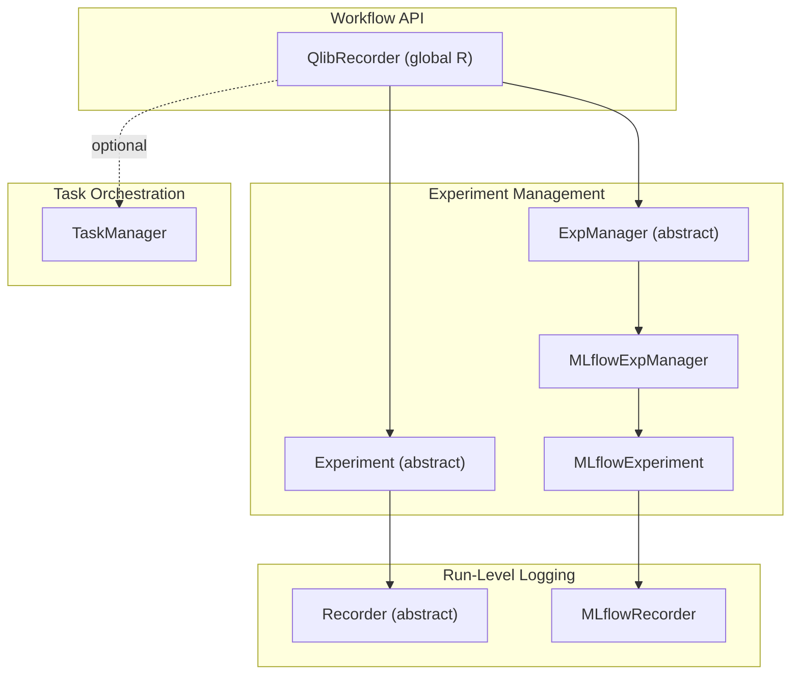
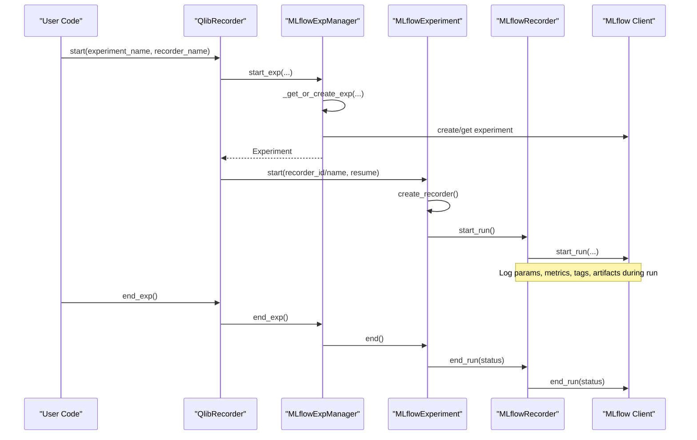
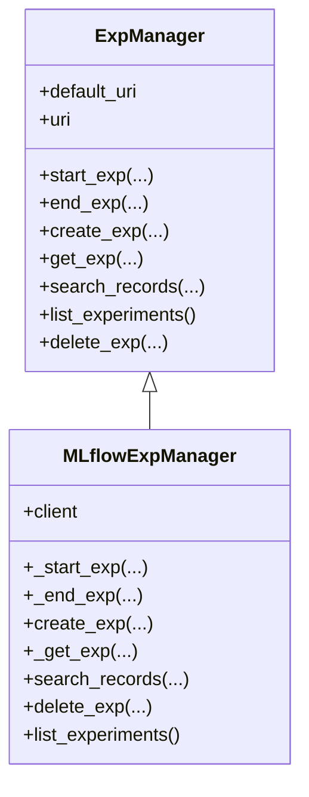
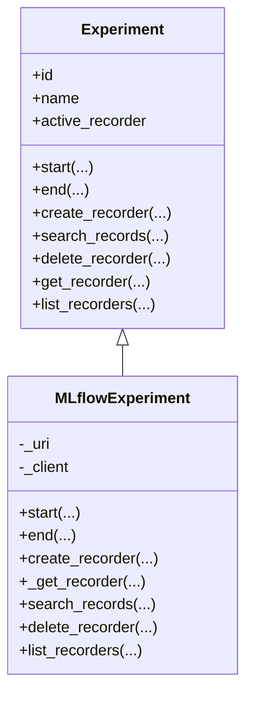
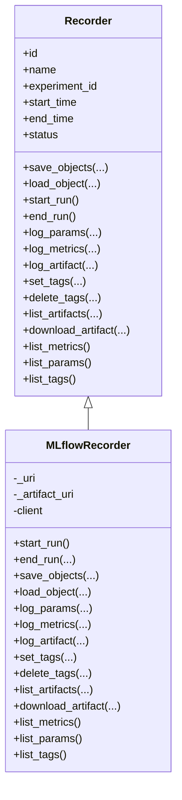
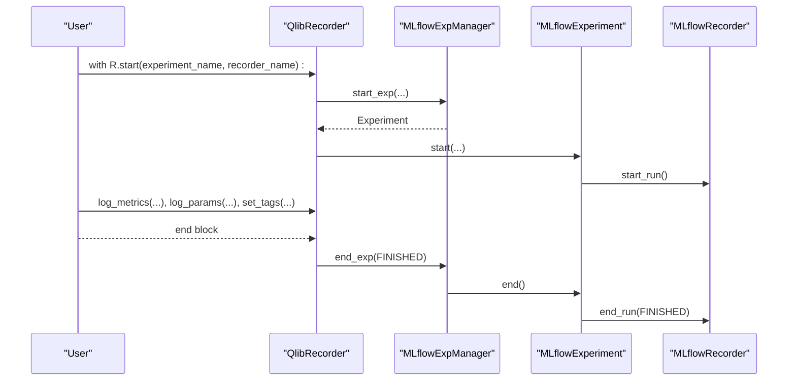
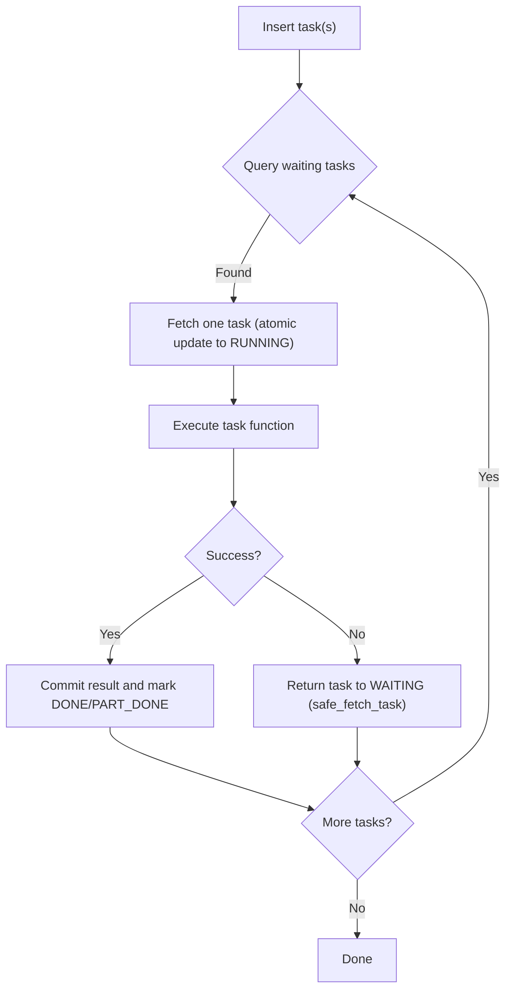
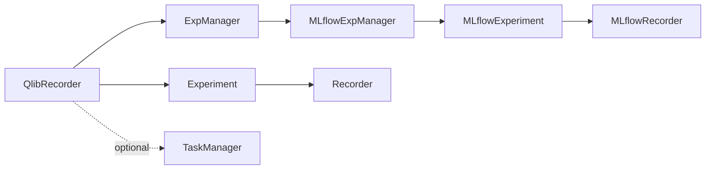

# Experiment Organization

<cite>
**Referenced Files in This Document**
- [expm.py](file://qlib/workflow/expm.py)
- [exp.py](file://qlib/workflow/exp.py)
- [recorder.py](file://qlib/workflow/recorder.py)
- [__init__.py](file://qlib/workflow/__init__.py)
- [utils.py](file://qlib/workflow/utils.py)
- [manage.py](file://qlib/workflow/task/manage.py)
- [run_all_model.py](file://examples/run_all_model.py)
</cite>

## Table of Contents
1. [Introduction](#introduction)
2. [Project Structure](#project-structure)
3. [Core Components](#core-components)
4. [Architecture Overview](#architecture-overview)
5. [Detailed Component Analysis](#detailed-component-analysis)
6. [Dependency Analysis](#dependency-analysis)
7. [Performance Considerations](#performance-considerations)
8. [Troubleshooting Guide](#troubleshooting-guide)
9. [Conclusion](#conclusion)
10. [Appendices](#appendices)

## Introduction
This document explains QLib’s experiment organization and management system with a focus on the ExperimentManager class and its MLflow-backed implementation. It covers how to create, list, and manage experiments across projects; experiment naming conventions and hierarchical organization via tags and names; metadata storage through parameters, metrics, and artifacts; comparison workflows using search and filtering; result retrieval patterns; lifecycle management; cleanup strategies; and best practices for maintaining organized experiment repositories.

## Project Structure
QLib’s experiment management is implemented under qlib/workflow:
- ExpManager (abstract) and MLflowExpManager provide experiment lifecycle and listing/searching.
- Experiment (abstract) and MLflowExperiment encapsulate per-experiment operations like starting/ending and recorder management.
- Recorder (abstract) and MLflowRecorder implement run-level logging of parameters, metrics, tags, and artifacts.
- The workflow package exposes a global R interface that wraps these components for convenient usage.
- Task management utilities support distributed task orchestration and status tracking.

**Diagram sources**
- [__init__.py:26-163](file://qlib/workflow/__init__.py#L26-L163)
- [expm.py:22-117](file://qlib/workflow/expm.py#L22-L117)
- [exp.py:15-241](file://qlib/workflow/exp.py#L15-L241)
- [recorder.py:28-245](file://qlib/workflow/recorder.py#L28-L245)
- [manage.py:35-117](file://qlib/workflow/task/manage.py#L35-L117)

**Section sources**
- [__init__.py:26-163](file://qlib/workflow/__init__.py#L26-L163)
- [expm.py:22-117](file://qlib/workflow/expm.py#L22-L117)
- [exp.py:15-241](file://qlib/workflow/exp.py#L15-L241)
- [recorder.py:28-245](file://qlib/workflow/recorder.py#L28-L245)
- [manage.py:35-117](file://qlib/workflow/task/manage.py#L35-L117)

## Core Components
- ExpManager and MLflowExpManager: Manage experiment creation, activation, deletion, listing, and record searching. They handle URI scoping and concurrency safeguards for local file-based backends.
- Experiment and MLflowExperiment: Represent an experiment container; manage active recorder, start/end flows, and list/search recorders.
- Recorder and MLflowRecorder: Represent individual runs within an experiment; log parameters, metrics, tags, and artifacts; support object save/load and artifact download.
- QlibRecorder (R): High-level convenience API to start/end experiments, log metrics/params/tags, save/load objects, and query/list experiments and recorders.
- TaskManager: Optional component for distributed task scheduling and state persistence (MongoDB-backed), useful for large-scale experiment pipelines.

Key responsibilities:
- Experiment naming and hierarchy: Use meaningful experiment names and leverage tags to encode model type, dataset version, and research phase.
- Metadata storage: Parameters, metrics, tags, and artifacts are stored per run; use tags for categorical dimensions (e.g., model, dataset, phase).
- Comparison and retrieval: Use search_records and list_recorders with filters to compare results across runs and experiments.
- Lifecycle and cleanup: Start/end experiments explicitly or via context managers; delete experiments or recorders when no longer needed.

**Section sources**
- [expm.py:22-117](file://qlib/workflow/expm.py#L22-L117)
- [exp.py:15-241](file://qlib/workflow/exp.py#L15-L241)
- [recorder.py:28-245](file://qlib/workflow/recorder.py#L28-L245)
- [__init__.py:26-163](file://qlib/workflow/__init__.py#L26-L163)
- [manage.py:35-117](file://qlib/workflow/task/manage.py#L35-L117)

## Architecture Overview
The architecture layers separate concerns:
- API layer (QlibRecorder) provides user-friendly methods to start experiments, log data, and retrieve results.
- Management layer (ExpManager/MLflowExpManager) abstracts backend-specific details and enforces consistent lifecycle semantics.
- Storage layer (MLflowExperiment/MLflowRecorder) interacts with MLflow to persist runs, metrics, params, tags, and artifacts.
- Optional orchestration layer (TaskManager) manages distributed tasks and their states.

**Diagram sources**
- [__init__.py:37-95](file://qlib/workflow/__init__.py#L37-L95)
- [expm.py:46-117](file://qlib/workflow/expm.py#L46-L117)
- [exp.py:243-285](file://qlib/workflow/exp.py#L243-L285)
- [recorder.py:335-395](file://qlib/workflow/recorder.py#L335-L395)

## Detailed Component Analysis

### ExperimentManager and MLflowExpManager
Responsibilities:
- Create, get, list, and delete experiments.
- Start/end experiments and maintain active experiment context.
- Search records across experiments with filters, ordering, and limits.
- Handle URI scoping and default URI fallback.

Key behaviors:
- get_exp supports automatic creation if not found and can optionally start the experiment.
- search_records delegates to underlying client with filter_string, run_view_type, max_results, order_by.
- File-based URIs use locking to avoid concurrent creation conflicts.

**Diagram sources**
- [expm.py:22-117](file://qlib/workflow/expm.py#L22-L117)
- [expm.py:317-434](file://qlib/workflow/expm.py#L317-L434)

**Section sources**
- [expm.py:22-117](file://qlib/workflow/expm.py#L22-L117)
- [expm.py:317-434](file://qlib/workflow/expm.py#L317-L434)

### Experiment and MLflowExperiment
Responsibilities:
- Encapsulate a single experiment with id and name.
- Manage active recorder and lifecycle (start/end).
- List and search recorders with filters and status constraints.
- Provide convenience info and representation.

Key behaviors:
- list_recorders supports returning dict or list and filtering by status and MLflow filter strings.
- get_recorder supports auto-create and optional start behavior.

**Diagram sources**
- [exp.py:15-241](file://qlib/workflow/exp.py#L15-L241)
- [exp.py:243-380](file://qlib/workflow/exp.py#L243-L380)

**Section sources**
- [exp.py:15-241](file://qlib/workflow/exp.py#L15-L241)
- [exp.py:243-380](file://qlib/workflow/exp.py#L243-L380)

### Recorder and MLflowRecorder
Responsibilities:
- Represent a run within an experiment.
- Log parameters, metrics, tags, and artifacts.
- Save and load Python objects as artifacts.
- Support async logging and environment capture.

Key behaviors:
- start_run initializes MLflow run, sets status, logs command and environment variables, and captures uncommitted code diffs.
- end_run finalizes run and waits for async logs before closing.
- save_objects supports saving files/directories or serializing objects directly.
- list_metrics, list_params, list_tags expose run metadata.

**Diagram sources**
- [recorder.py:28-245](file://qlib/workflow/recorder.py#L28-L245)
- [recorder.py:247-494](file://qlib/workflow/recorder.py#L247-L494)

**Section sources**
- [recorder.py:28-245](file://qlib/workflow/recorder.py#L28-L245)
- [recorder.py:247-494](file://qlib/workflow/recorder.py#L247-L494)

### QlibRecorder (Global API)
Responsibilities:
- Provide high-level methods to start/end experiments, log metrics/params/tags, save/load objects, and query/list experiments and recorders.
- Ensure proper error handling and status transitions.
- Offer URI context management for temporary overrides.

Usage patterns:
- Context manager start ensures experiments end properly even on exceptions.
- Convenience methods automatically create experiments/recorders when needed.

**Diagram sources**
- [__init__.py:37-95](file://qlib/workflow/__init__.py#L37-L95)
- [expm.py:46-117](file://qlib/workflow/expm.py#L46-L117)
- [exp.py:243-285](file://qlib/workflow/exp.py#L243-L285)
- [recorder.py:335-395](file://qlib/workflow/recorder.py#L335-L395)

**Section sources**
- [__init__.py:37-95](file://qlib/workflow/__init__.py#L37-L95)
- [__init__.py:165-212](file://qlib/workflow/__init__.py#L165-L212)
- [__init__.py:242-323](file://qlib/workflow/__init__.py#L242-L323)
- [__init__.py:481-653](file://qlib/workflow/__init__.py#L481-L653)

### TaskManager (Optional Orchestration)
Responsibilities:
- Manage distributed tasks with statuses (waiting, running, done, part_done).
- Provide safe fetching, committing results, and waiting for completion.
- Persist tasks in MongoDB with encoded fields and priority support.

Use cases:
- Batch training jobs where each task corresponds to an experiment configuration.
- Resilient execution with automatic return-to-waiting on errors.

**Diagram sources**
- [manage.py:177-215](file://qlib/workflow/task/manage.py#L177-L215)
- [manage.py:265-286](file://qlib/workflow/task/manage.py#L265-L286)
- [manage.py:354-382](file://qlib/workflow/task/manage.py#L354-L382)
- [manage.py:458-480](file://qlib/workflow/task/manage.py#L458-L480)

**Section sources**
- [manage.py:35-117](file://qlib/workflow/task/manage.py#L35-L117)
- [manage.py:177-215](file://qlib/workflow/task/manage.py#L177-L215)
- [manage.py:265-286](file://qlib/workflow/task/manage.py#L265-L286)
- [manage.py:354-382](file://qlib/workflow/task/manage.py#L354-L382)
- [manage.py:458-480](file://qlib/workflow/task/manage.py#L458-L480)

## Dependency Analysis
- QlibRecorder depends on ExpManager for experiment lifecycle and uses Experiment/Recorder abstractions for run-level operations.
- MLflowExpManager and MLflowExperiment rely on MLflow clients for persistence and querying.
- MLflowRecorder integrates MLflow run APIs and handles artifact storage and environment capture.
- TaskManager depends on MongoDB for task state and provides utilities for distributed execution.

**Diagram sources**
- [__init__.py:26-163](file://qlib/workflow/__init__.py#L26-L163)
- [expm.py:22-117](file://qlib/workflow/expm.py#L22-L117)
- [exp.py:15-241](file://qlib/workflow/exp.py#L15-L241)
- [recorder.py:28-245](file://qlib/workflow/recorder.py#L28-L245)
- [manage.py:35-117](file://qlib/workflow/task/manage.py#L35-L117)

**Section sources**
- [__init__.py:26-163](file://qlib/workflow/__init__.py#L26-L163)
- [expm.py:22-117](file://qlib/workflow/expm.py#L22-L117)
- [exp.py:15-241](file://qlib/workflow/exp.py#L15-L241)
- [recorder.py:28-245](file://qlib/workflow/recorder.py#L28-L245)
- [manage.py:35-117](file://qlib/workflow/task/manage.py#L35-L117)

## Performance Considerations
- Asynchronous logging: MLflowRecorder uses async logging for params/metrics/tags to reduce blocking overhead during runs.
- Max results limits: list_recorders and search_records support max_results to control memory and query time.
- Filter strings: Use MLflow filter strings to narrow down runs early and reduce result sets.
- Artifact size: Prefer storing lightweight artifacts; use directories judiciously and clean up unnecessary files.
- Concurrency: For local file-based URIs, ExpManager uses file locks to prevent concurrent creation conflicts.

[No sources needed since this section provides general guidance]

## Troubleshooting Guide
Common issues and resolutions:
- Uncaught exceptions: Global exception hooks ensure experiments end with FAILED status to keep repository consistent.
- Missing URI: Default URI must be configured; otherwise, retrieving default URI raises an error.
- Duplicate experiment names: Creating an existing experiment raises a specific error; handle by checking existence or using get_or_create flow.
- Recorder not started: Attempting to access artifacts before starting a run raises an error; ensure start_run is called.
- Deletion errors: Deleting non-existent experiments or recorders raises validation errors; verify IDs/names before deletion.

Operational tips:
- Use context managers to guarantee end_exp on exceptions.
- Set meaningful tags (model, dataset, phase) to facilitate filtering and comparison.
- Periodically delete old experiments or recorders to free storage.

**Section sources**
- [utils.py:16-48](file://qlib/workflow/utils.py#L16-L48)
- [expm.py:282-304](file://qlib/workflow/expm.py#L282-L304)
- [expm.py:353-363](file://qlib/workflow/expm.py#L353-L363)
- [recorder.py:315-333](file://qlib/workflow/recorder.py#L315-L333)
- [expm.py:405-420](file://qlib/workflow/expm.py#L405-L420)

## Conclusion
QLib’s experiment management system provides a robust, extensible framework for organizing and comparing experiments. By leveraging ExperimentManager and related classes, users can create hierarchical experiment structures through naming and tagging, store rich metadata, and perform powerful comparisons using search and filtering. Best practices include using context managers for lifecycle safety, employing tags for categorization, and regularly cleaning up unused experiments and artifacts.

[No sources needed since this section summarizes without analyzing specific files]

## Appendices

### Experiment Naming Conventions and Hierarchical Organization
- Use descriptive experiment names to group related work (e.g., model family or dataset series).
- Encode additional dimensions (dataset version, research phase) via tags to enable flexible filtering and comparison.
- Keep recorder names unique within an experiment to avoid ambiguity when retrieving by name.

Practical example pattern:
- Experiment name: model_family or project_phase
- Tags: dataset_version, model_type, research_phase
- Recorders: distinct runs for different hyperparameters or seeds

[No sources needed since this section doesn't analyze specific files]

### Result Retrieval Patterns and Filtering Capabilities
- Retrieve all recorders for an experiment and filter by status or MLflow filter strings.
- Use search_records across multiple experiments with order_by and max_results to compare metrics efficiently.
- Load saved objects (predictions, models) from recorders for downstream analysis.

Reference usage patterns:
- Listing recorders and loading artifacts for benchmark aggregation.
- Searching records with filters to isolate specific configurations.

**Section sources**
- [exp.py:342-380](file://qlib/workflow/exp.py#L342-L380)
- [expm.py:398-403](file://qlib/workflow/expm.py#L398-L403)
- [run_all_model.py:133-185](file://examples/run_all_model.py#L133-L185)

### Lifecycle Management and Cleanup Strategies
- Always end experiments explicitly or via context managers to ensure proper status transitions.
- Delete experiments or recorders when no longer needed to conserve storage.
- Use TaskManager for long-running pipelines to track and reset stuck tasks.

Cleanup recommendations:
- Remove outdated experiments periodically.
- Archive critical artifacts externally if retention policies require it.
- Monitor storage usage and adjust artifact sizes.

**Section sources**
- [__init__.py:37-95](file://qlib/workflow/__init__.py#L37-L95)
- [expm.py:269-280](file://qlib/workflow/expm.py#L269-L280)
- [exp.py:325-338](file://qlib/workflow/exp.py#L325-L338)
- [manage.py:384-396](file://qlib/workflow/task/manage.py#L384-L396)