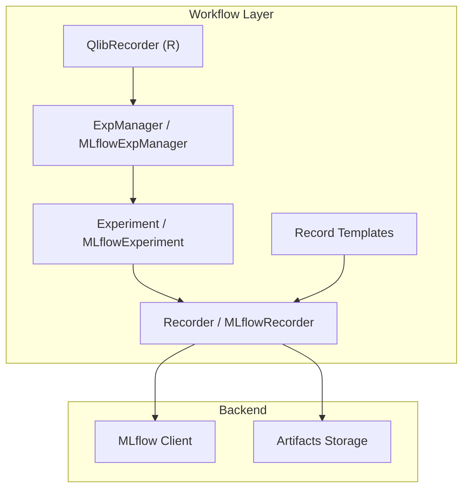
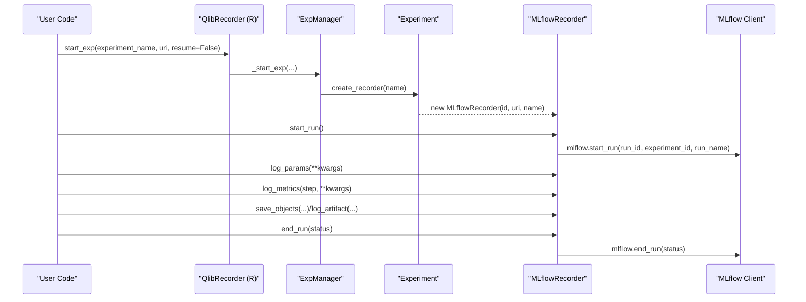
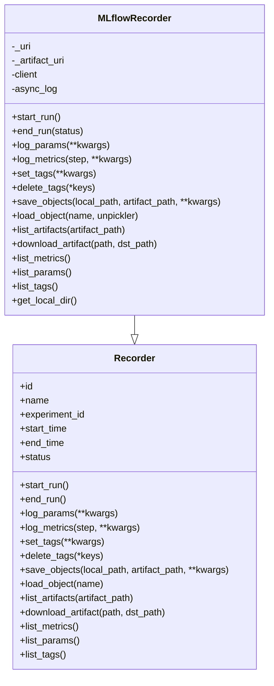
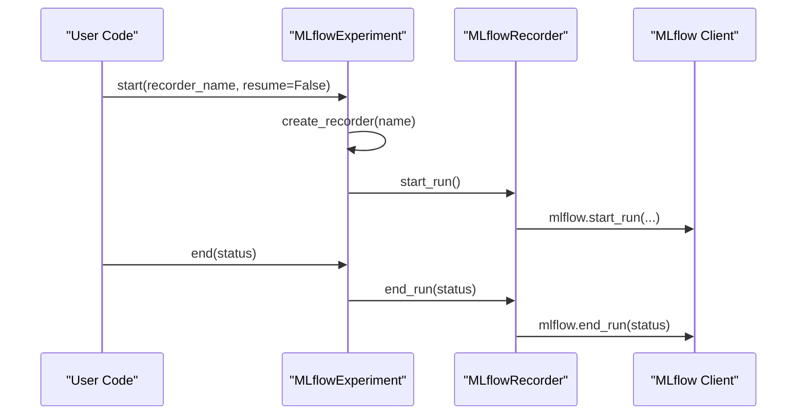
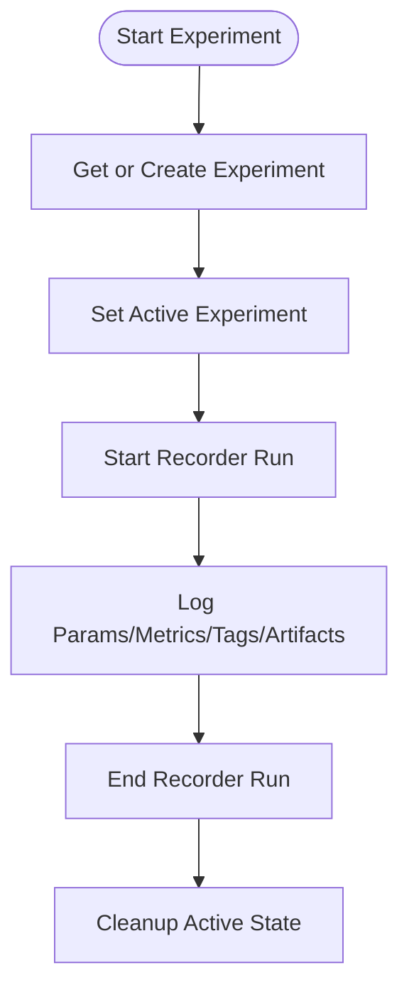
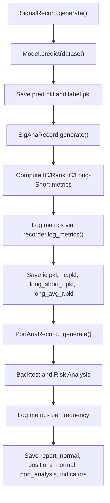
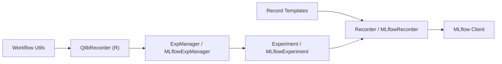

# Experiment Tracking and Recording

<cite>
**Referenced Files in This Document**
- [recorder.py](file://qlib/workflow/recorder.py)
- [exp.py](file://qlib/workflow/exp.py)
- [expm.py](file://qlib/workflow/expm.py)
- [record_temp.py](file://qlib/workflow/record_temp.py)
- [utils.py](file://qlib/workflow/utils.py)
- [__init__.py](file://qlib/workflow/__init__.py)
- [recorder.rst](file://docs/component/recorder.rst)
- [run_all_model.py](file://examples/run_all_model.py)
</cite>

## Table of Contents
1. [Introduction](#introduction)
2. [Project Structure](#project-structure)
3. [Core Components](#core-components)
4. [Architecture Overview](#architecture-overview)
5. [Detailed Component Analysis](#detailed-component-analysis)
6. [Dependency Analysis](#dependency-analysis)
7. [Performance Considerations](#performance-considerations)
8. [Troubleshooting Guide](#troubleshooting-guide)
9. [Conclusion](#conclusion)
10. [Appendices](#appendices)

## Introduction
This document explains QLib’s experiment tracking and recording system with a focus on the Recorder class, MLflow integration, experiment organization, naming conventions, metadata storage, and practical usage patterns for custom recording logic, experiment comparison, and result retrieval. It also covers performance considerations for large-scale experiments and data management strategies.

QLib provides an abstraction layer over MLflow to standardize how experiments are started, parameters/metrics/artifacts are logged, and results are retrieved. The core classes include:
- Recorder (abstract interface)
- MLflowRecorder (MLflow-backed implementation)
- Experiment and MLflowExperiment (experiment lifecycle and recorder management)
- ExpManager and MLflowExpManager (global experiment manager)
- Record templates (SignalRecord, SigAnaRecord, PortAnaRecord, etc.) for standardized artifact generation

The system supports:
- Parameter logging, metric tracking, tagging, and artifact storage
- Automatic capture of command-line arguments and environment variables
- Asynchronous logging to reduce overhead during training loops
- Robust error handling and status transitions for runs
- Retrieval and comparison across multiple runs and experiments

## Project Structure
The experiment tracking subsystem is primarily implemented under qlib/workflow:
- recorder.py: Defines Recorder abstract API and MLflowRecorder implementation
- exp.py: Defines Experiment and MLflowExperiment
- expm.py: Defines ExpManager and MLflowExpManager
- record_temp.py: Provides RecordTemplate classes for generating and saving artifacts like predictions, IC analysis, and backtest reports
- utils.py: Provides experiment exit hooks and exception handling to ensure proper run finalization
- __init__.py: Exposes high-level APIs via QlibRecorder (R)

**Diagram sources**
- [expm.py:22-434](file://qlib/workflow/expm.py#L22-L434)
- [exp.py:15-380](file://qlib/workflow/exp.py#L15-L380)
- [recorder.py:28-494](file://qlib/workflow/recorder.py#L28-L494)
- [record_temp.py:28-694](file://qlib/workflow/record_temp.py#L28-L694)

**Section sources**
- [recorder.py:28-494](file://qlib/workflow/recorder.py#L28-L494)
- [exp.py:15-380](file://qlib/workflow/exp.py#L15-L380)
- [expm.py:22-434](file://qlib/workflow/expm.py#L22-L434)
- [record_temp.py:28-694](file://qlib/workflow/record_temp.py#L28-L694)
- [utils.py:16-47](file://qlib/workflow/utils.py#L16-L47)
- [__init__.py:221-257](file://qlib/workflow/__init__.py#L221-L257)
- [recorder.rst:8-155](file://docs/component/recorder.rst#L8-L155)

## Core Components
- Recorder (abstract): Defines the interface for starting/ending runs, logging parameters, metrics, tags, and artifacts; listing and downloading artifacts; retrieving metrics, params, and tags.
- MLflowRecorder: Implements Recorder using MLflow. Supports asynchronous logging, automatic capture of uncommitted code diffs/status, environment variable logging, artifact upload/download, and status transitions.
- Experiment / MLflowExperiment: Manages experiment lifecycle, creates/retrieves recorders, starts/resumes runs, lists recorders, and searches records.
- ExpManager / MLflowExpManager: Global singleton-like manager that handles default URIs, get_or_create experiments, and search/list operations.
- Record Templates: Standardized workflows to generate and save artifacts such as predictions, signal analysis metrics, and portfolio backtest reports. They use the recorder to log metrics and save objects.

Key capabilities:
- Parameter logging: log_params(**kwargs)
- Metric tracking: log_metrics(step=None, **kwargs)
- Tagging: set_tags(**kwargs), delete_tags(*keys)
- Artifacts: save_objects(local_path=None, artifact_path=None, **kwargs), load_object(name), list_artifacts(artifact_path=None), download_artifact(path, dst_path=None)
- Listing: list_metrics(), list_params(), list_tags()

**Section sources**
- [recorder.py:28-245](file://qlib/workflow/recorder.py#L28-L245)
- [recorder.py:247-494](file://qlib/workflow/recorder.py#L247-L494)
- [exp.py:15-380](file://qlib/workflow/exp.py#L15-L380)
- [expm.py:22-434](file://qlib/workflow/expm.py#L22-L434)
- [record_temp.py:28-694](file://qlib/workflow/record_temp.py#L28-L694)

## Architecture Overview
The architecture layers separate user-facing APIs from backend storage:
- User interacts with QlibRecorder (R) or direct Experiment/Recorder APIs
- ExpManager coordinates experiment creation and active state
- Experiment manages recorder instances and run lifecycle
- MLflowRecorder delegates to MLflow client for persistence
- Record templates encapsulate common workflows to produce artifacts and metrics

**Diagram sources**
- [expm.py:328-346](file://qlib/workflow/expm.py#L328-L346)
- [exp.py:257-273](file://qlib/workflow/exp.py#L257-L273)
- [recorder.py:335-360](file://qlib/workflow/recorder.py#L335-L360)
- [recorder.py:380-395](file://qlib/workflow/recorder.py#L380-L395)

## Detailed Component Analysis

### Recorder and MLflowRecorder
- Recorder defines a consistent API similar to MLflow but decoupled from backend specifics.
- MLflowRecorder implements:
  - start_run(): sets tracking URI, starts MLflow run, captures command-line args and environment variables prefixed with a specific marker, logs uncommitted code diffs/status/cached changes, initializes async logging queue.
  - end_run(): updates timestamps, waits for async logging, sets final status, ends MLflow run.
  - Logging: log_params, log_metrics, set_tags, delete_tags are wrapped with async decorators to avoid blocking training loops.
  - Artifacts: save_objects supports both file/directory and in-memory objects serialized via Serializable.general_dump; load_object uses pickle-based unpickler with custom support; list_artifacts and download_artifact delegate to MLflow client.
  - Metadata: list_metrics, list_params, list_tags retrieve run data via MLflow client.

**Diagram sources**
- [recorder.py:28-245](file://qlib/workflow/recorder.py#L28-L245)
- [recorder.py:247-494](file://qlib/workflow/recorder.py#L247-L494)

**Section sources**
- [recorder.py:28-245](file://qlib/workflow/recorder.py#L28-L245)
- [recorder.py:247-494](file://qlib/workflow/recorder.py#L247-L494)

### Experiment and MLflowExperiment
- Experiment abstracts run lifecycle and recorder management.
- MLflowExperiment:
  - start(): gets or creates a recorder by name/id, sets it as active, calls start_run().
  - end(): ends the active recorder and clears active reference.
  - create_recorder(): instantiates MLflowRecorder with experiment id, uri, and name.
  - list_recorders(): queries MLflow runs within the experiment and returns dict/list of recorders filtered by status if provided.
  - search_records(): wraps MLflow search_runs with filter_string, view type, max_results, order_by.

**Diagram sources**
- [exp.py:257-278](file://qlib/workflow/exp.py#L257-L278)
- [exp.py:280-323](file://qlib/workflow/exp.py#L280-L323)
- [recorder.py:335-360](file://qlib/workflow/recorder.py#L335-L360)
- [recorder.py:380-395](file://qlib/workflow/recorder.py#L380-L395)

**Section sources**
- [exp.py:15-380](file://qlib/workflow/exp.py#L15-L380)

### ExpManager and MLflowExpManager
- ExpManager provides global management of experiments and default URI handling.
- MLflowExpManager:
  - start_exp(): sets active URI, delegates to _start_exp which creates/get experiment and starts it.
  - get_exp(): get_or_create experiment by id/name; optionally start it.
  - search_records(): wraps MLflow search_runs across experiments.
  - list_experiments(): enumerates active experiments via MLflow client.

**Diagram sources**
- [expm.py:46-92](file://qlib/workflow/expm.py#L46-L92)
- [expm.py:152-215](file://qlib/workflow/expm.py#L152-L215)
- [expm.py:328-346](file://qlib/workflow/expm.py#L328-L346)

**Section sources**
- [expm.py:22-434](file://qlib/workflow/expm.py#L22-L434)

### Record Templates and Artifact Generation
Record templates provide standardized workflows to generate and persist artifacts:
- SignalRecord: generates model predictions and labels, saves as artifacts, prints preview.
- SigAnaRecord: computes IC, Rank IC, Long-Short metrics, logs metrics, saves intermediate artifacts.
- PortAnaRecord: performs backtesting, risk analysis, indicator analysis, logs metrics per frequency, saves reports and positions.
- MultiPassPortAnaRecord: repeats backtests multiple times with optional shuffling, aggregates statistics, logs metrics.

These templates rely on the recorder to log metrics and save/load artifacts consistently.

**Diagram sources**
- [record_temp.py:161-210](file://qlib/workflow/record_temp.py#L161-L210)
- [record_temp.py:295-355](file://qlib/workflow/record_temp.py#L295-L355)
- [record_temp.py:358-573](file://qlib/workflow/record_temp.py#L358-L573)
- [record_temp.py:575-694](file://qlib/workflow/record_temp.py#L575-L694)

**Section sources**
- [record_temp.py:28-694](file://qlib/workflow/record_temp.py#L28-L694)

### Integration with MLflow
- MLflowRecorder integrates directly with MLflow client for:
  - Parameter logging: log_params asynchronously
  - Metric tracking: log_metrics with optional step
  - Tags: set_tags and delete_tags
  - Artifacts: save_objects/log_artifact/list_artifacts/download_artifact
  - Environment capture: automatically logs command-line arguments and environment variables with a specific prefix
  - Uncommitted code: logs git diff/status/cached diffs as text artifacts
- Experiment and ExpManager leverage MLflow’s search and listing capabilities for retrieval and comparison.

**Section sources**
- [recorder.py:335-395](file://qlib/workflow/recorder.py#L335-L395)
- [recorder.py:445-494](file://qlib/workflow/recorder.py#L445-L494)
- [exp.py:317-323](file://qlib/workflow/exp.py#L317-L323)
- [expm.py:398-403](file://qlib/workflow/expm.py#L398-L403)

### Experiment Organization and Naming Conventions
- Experiments are identified by id and name; recorders (runs) are identified by run id and can be named.
- Default recorder name is used when not specified; unique names help distinguish runs.
- When searching by recorder name, only the latest matching recorder is returned unless filtering by id.
- Status transitions: SCHEDULED -> RUNNING -> FINISHED/FAILED; end_run enforces valid statuses.

Practical guidance:
- Use descriptive experiment names to group related runs (e.g., dataset/model variants).
- Assign meaningful recorder names for different configurations or hyperparameter sweeps.
- Use tags to annotate runs with additional context (e.g., branch, commit hash, feature flags).

**Section sources**
- [exp.py:257-315](file://qlib/workflow/exp.py#L257-L315)
- [recorder.py:36-48](file://qlib/workflow/recorder.py#L36-L48)
- [recorder.py:380-395](file://qlib/workflow/recorder.py#L380-L395)

### Metadata Storage
- Parameters: stored via MLflow params; accessible via list_params.
- Metrics: stored via MLflow metrics; accessible via list_metrics; can be logged with steps for time-series tracking.
- Tags: stored via MLflow tags; accessible via list_tags; useful for categorization and filtering.
- Artifacts: files and directories saved via MLflow artifacts; accessible via list_artifacts and download_artifact.
- Environment and code diffs: automatically captured at run start for reproducibility.

**Section sources**
- [recorder.py:445-494](file://qlib/workflow/recorder.py#L445-L494)
- [recorder.py:356-379](file://qlib/workflow/recorder.py#L356-L379)

### Custom Recording Logic
You can implement custom RecordTemplate subclasses to:
- Generate domain-specific artifacts
- Compute custom metrics and log them via recorder.log_metrics
- Save intermediate results via recorder.save_objects
- Load dependencies via recorder.load_object with parent fallback

Example pattern:
- Define artifact_path and depend_cls to declare outputs and dependencies
- Implement _generate to compute and return a dict of artifacts
- Use recorder.log_metrics to persist key numbers
- Use recorder.save_objects to persist complex objects

**Section sources**
- [record_temp.py:212-246](file://qlib/workflow/record_temp.py#L212-L246)
- [record_temp.py:295-355](file://qlib/workflow/record_temp.py#L295-L355)

### Experiment Comparison and Result Retrieval
- Use Experiment.list_recorders() to enumerate runs and filter by status.
- Use Experiment.search_records() to apply MLflow filter strings and ordering.
- Retrieve metrics via recorder.list_metrics() and compare across runs.
- Download artifacts via recorder.download_artifact() for detailed inspection.
- Example scripts demonstrate collecting metrics across experiments and building summary tables.

**Section sources**
- [exp.py:342-379](file://qlib/workflow/exp.py#L342-L379)
- [expm.py:398-403](file://qlib/workflow/expm.py#L398-L403)
- [run_all_model.py:133-166](file://examples/run_all_model.py#L133-L166)

## Dependency Analysis
- Recorder depends on MLflow client for persistence and on serialization utilities for object storage.
- Experiment depends on Recorder and MLflow client for run management.
- ExpManager depends on Experiment and MLflow client for global orchestration.
- Record templates depend on Recorder and evaluation utilities to compute metrics and artifacts.
- Workflow utilities hook into QlibRecorder to ensure experiments end properly on exceptions.

**Diagram sources**
- [recorder.py:247-494](file://qlib/workflow/recorder.py#L247-L494)
- [exp.py:243-380](file://qlib/workflow/exp.py#L243-L380)
- [expm.py:317-434](file://qlib/workflow/expm.py#L317-L434)
- [record_temp.py:28-694](file://qlib/workflow/record_temp.py#L28-L694)
- [utils.py:16-47](file://qlib/workflow/utils.py#L16-L47)

**Section sources**
- [recorder.py:247-494](file://qlib/workflow/recorder.py#L247-L494)
- [exp.py:243-380](file://qlib/workflow/exp.py#L243-L380)
- [expm.py:317-434](file://qlib/workflow/expm.py#L317-L434)
- [record_temp.py:28-694](file://qlib/workflow/record_temp.py#L28-L694)
- [utils.py:16-47](file://qlib/workflow/utils.py#L16-L47)

## Performance Considerations
- Asynchronous logging: MLflowRecorder wraps log_params, log_metrics, and set_tags with async decorators to avoid blocking training loops. This reduces overhead but may delay uploads slightly and affect precise timing.
- Large artifacts: Prefer streaming or chunking where possible; use artifact_path to organize large outputs; clean up temporary directories after downloads.
- Search limits: MLflow has limits on listing/searching runs; use filter_string and max_results to constrain queries.
- Pickle compatibility: Objects are pickled; ensure consistent environments between dump and load to avoid compatibility issues.
- File locking: For local file-based MLflow backends, concurrent experiment creation is protected via file locks to prevent conflicts.

Recommendations:
- Batch log metrics where feasible to reduce network calls.
- Use tags to pre-filter runs before loading heavy artifacts.
- Monitor disk usage for artifact storage; consider remote backends for scalability.
- Avoid excessive parameter values beyond supported lengths; QLib extends MLflow param length limits.

[No sources needed since this section provides general guidance]

## Troubleshooting Guide
Common issues and resolutions:
- Missing recorder start: Ensure start_run is called before logging artifacts or metrics; otherwise, methods will raise errors indicating the recorder was not started.
- Incomplete results: Check recorder.status; incomplete runs may lack expected artifacts; use list_artifacts to verify presence.
- Exception handling: QLib registers an exit handler to mark experiments as FAILED on uncaught exceptions; inspect logs for stack traces and ensure end_exp is called appropriately.
- Artifact loading errors: If load_object fails, verify the artifact exists and the environment matches the one used to serialize; custom unpicklers can be passed to handle version differences.
- Concurrent experiment creation: On local file backends, file locks prevent race conditions; ensure unique experiment names or handle conflicts gracefully.

**Section sources**
- [recorder.py:397-444](file://qlib/workflow/recorder.py#L397-L444)
- [utils.py:16-47](file://qlib/workflow/utils.py#L16-L47)
- [expm.py:232-245](file://qlib/workflow/expm.py#L232-L245)

## Conclusion
QLib’s experiment tracking system provides a robust, MLflow-backed framework for capturing parameters, metrics, tags, and artifacts while offering a consistent API through Recorder and Experiment abstractions. Record templates streamline common workflows for prediction, signal analysis, and backtesting. With asynchronous logging, automatic metadata capture, and powerful retrieval tools, users can efficiently manage large-scale experiments, compare results, and maintain reproducibility. Proper naming conventions, tagging strategies, and performance-aware practices further enhance usability and scalability.

[No sources needed since this section summarizes without analyzing specific files]

## Appendices

### Practical Usage Patterns
- Starting an experiment and logging:
  - Use QlibRecorder (R) to start an experiment, then obtain a recorder via Experiment.get_recorder or Experiment.start.
  - Log parameters and metrics throughout training; save artifacts as needed.
  - End the experiment to finalize status and flush async logs.
- Retrieving and comparing results:
  - List recorders and filter by status; fetch metrics via list_metrics; download artifacts for deep inspection.
  - Use search_records with filter_string to narrow down runs based on parameters/tags.

**Section sources**
- [exp.py:114-176](file://qlib/workflow/exp.py#L114-L176)
- [exp.py:342-379](file://qlib/workflow/exp.py#L342-L379)
- [run_all_model.py:133-166](file://examples/run_all_model.py#L133-L166)