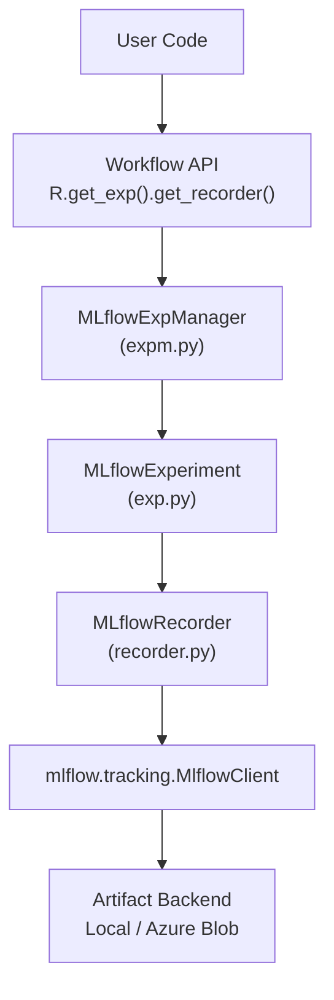
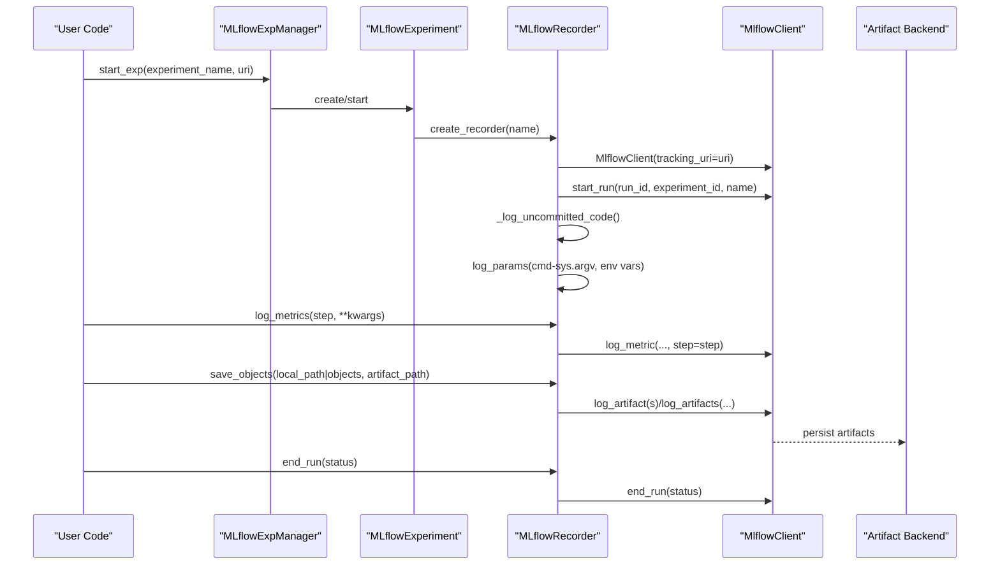
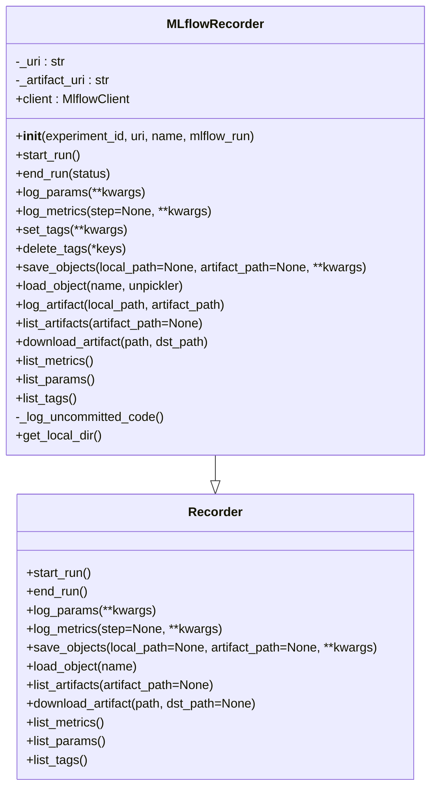
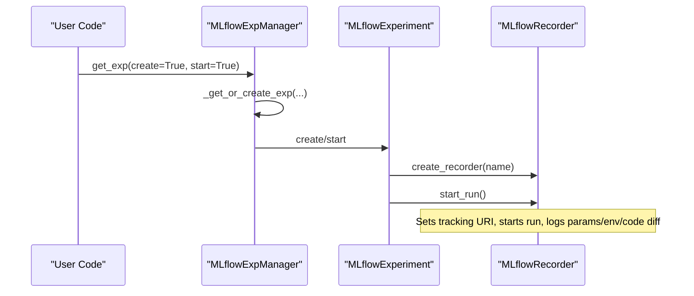
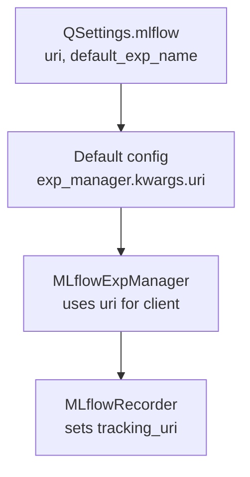
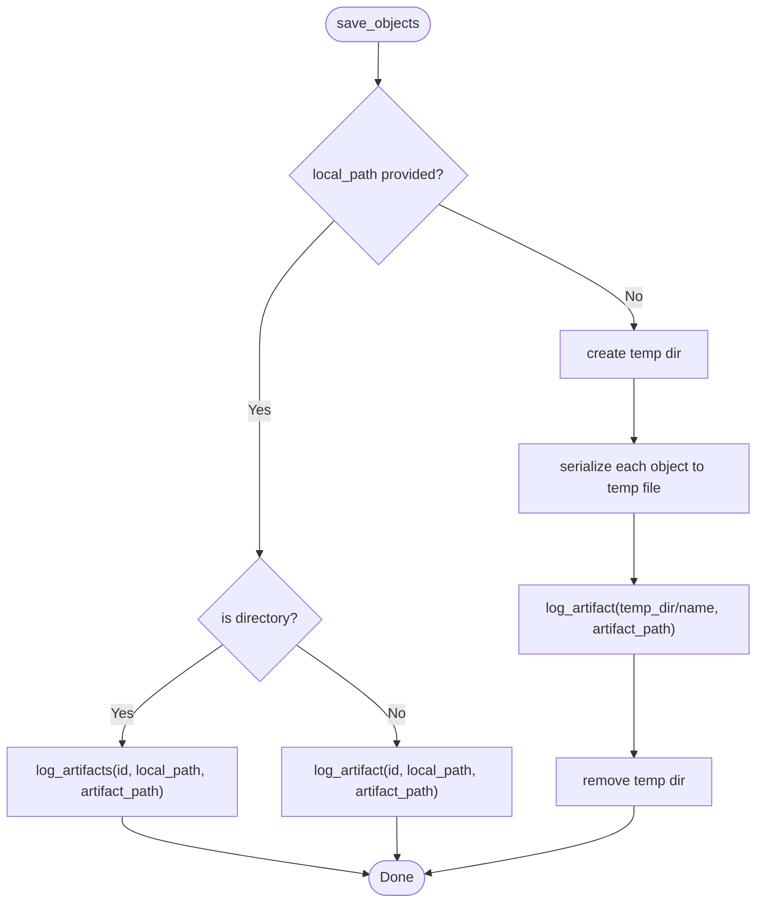
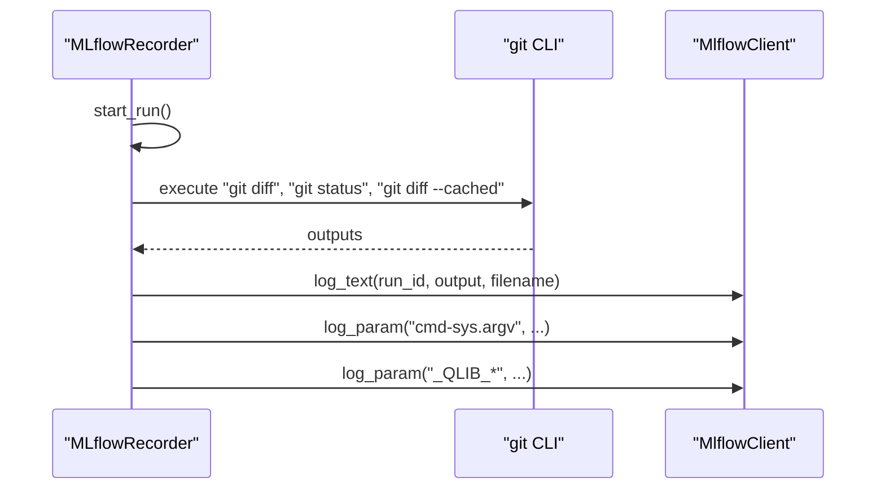
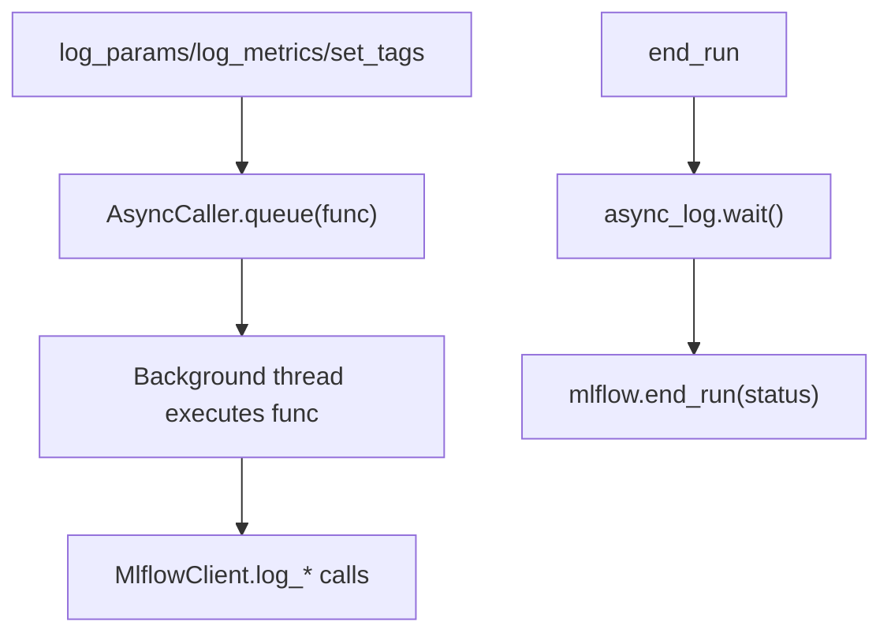
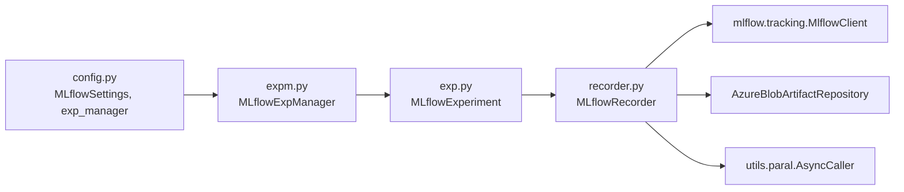

# MLflow Integration

<cite>
**Referenced Files in This Document**
- [recorder.py](file://qlib/workflow/recorder.py)
- [exp.py](file://qlib/workflow/exp.py)
- [expm.py](file://qlib/workflow/expm.py)
- [config.py](file://qlib/config.py)
- [paral.py](file://qlib/utils/paral.py)
- [test_mlflow.py](file://tests/dependency_tests/test_mlflow.py)
</cite>

## Table of Contents
1. [Introduction](#introduction)
2. [Project Structure](#project-structure)
3. [Core Components](#core-components)
4. [Architecture Overview](#architecture-overview)
5. [Detailed Component Analysis](#detailed-component-analysis)
6. [Dependency Analysis](#dependency-analysis)
7. [Performance Considerations](#performance-considerations)
8. [Troubleshooting Guide](#troubleshooting-guide)
9. [Conclusion](#conclusion)
10. [Appendices](#appendices)

## Introduction
This document explains QLib’s integration with MLflow via the MLflowRecorder class and its surrounding workflow components. It covers:
- Configuring MLflow tracking URIs and experiment managers
- Artifact storage backends (local filesystem and Azure Blob Storage)
- Client initialization and run lifecycle management
- Parameter logging with extended value limits, metric logging with step support
- Artifact management including save_objects() and load_object()
- Automatic code diff logging, environment variable capture, and async logging
- Examples for configuring different backends, handling large artifacts, and troubleshooting common issues

## Project Structure
QLib’s MLflow integration is implemented primarily under qlib/workflow:
- recorder.py: Defines Recorder base class and MLflowRecorder implementation
- exp.py: Experiment abstraction and MLflowExperiment that creates/runs recorders
- expm.py: Experiment manager (MLflowExpManager) that manages experiments and provides client access
- config.py: Global configuration including default MLflow settings and experiment manager wiring
- paral.py: AsyncCaller used to make logging calls asynchronous
- tests/dependency_tests/test_mlflow.py: Tests validating MLflow client creation performance

**Diagram sources**
- [expm.py:317-363](file://qlib/workflow/expm.py#L317-L363)
- [exp.py:243-285](file://qlib/workflow/exp.py#L243-L285)
- [recorder.py:247-360](file://qlib/workflow/recorder.py#L247-L360)

**Section sources**
- [recorder.py:247-494](file://qlib/workflow/recorder.py#L247-L494)
- [exp.py:243-380](file://qlib/workflow/exp.py#L243-L380)
- [expm.py:317-434](file://qlib/workflow/expm.py#L317-L434)
- [config.py:34-52](file://qlib/config.py#L34-L52)
- [config.py:218-226](file://qlib/config.py#L218-L226)
- [paral.py:72-117](file://qlib/utils/paral.py#L72-L117)
- [test_mlflow.py:18-34](file://tests/dependency_tests/test_mlflow.py#L18-L34)

## Core Components
- MLflowRecorder: Implements parameter, metric, tag, artifact logging backed by MLflow; supports async logging and automatic code diff/environment capture on run start.
- MLflowExperiment: Creates and starts MLflowRecorder instances within an experiment context.
- MLflowExpManager: Provides experiment lifecycle and a fresh MlflowClient per call to ensure low overhead and correct URI routing.
- Configuration: Default MLflow tracking URI and experiment name are set via global settings and wired into the experiment manager.

Key capabilities:
- Extended parameter value length limit to avoid truncation errors during logging
- Step-aware metric logging
- Artifact persistence to local or remote backends supported by MLflow (including Azure Blob Storage)
- Asynchronous logging using AsyncCaller to reduce blocking time
- Automatic capture of uncommitted code diffs and selected environment variables at run start

**Section sources**
- [recorder.py:24-25](file://qlib/workflow/recorder.py#L24-L25)
- [recorder.py:335-360](file://qlib/workflow/recorder.py#L335-L360)
- [recorder.py:397-443](file://qlib/workflow/recorder.py#L397-L443)
- [exp.py:243-285](file://qlib/workflow/exp.py#L243-L285)
- [expm.py:317-363](file://qlib/workflow/expm.py#L317-L363)
- [config.py:34-52](file://qlib/config.py#L34-L52)
- [config.py:218-226](file://qlib/config.py#L218-L226)

## Architecture Overview
The runtime flow when starting an experiment and recording metrics/parameters/artifacts:

**Diagram sources**
- [expm.py:328-346](file://qlib/workflow/expm.py#L328-L346)
- [exp.py:257-273](file://qlib/workflow/exp.py#L257-L273)
- [recorder.py:263-360](file://qlib/workflow/recorder.py#L263-L360)
- [recorder.py:397-443](file://qlib/workflow/recorder.py#L397-L443)

## Detailed Component Analysis

### MLflowRecorder
Responsibilities:
- Initialize MLflow client with a tracking URI
- Start/end runs and manage run metadata
- Log parameters, metrics (with step), tags, and artifacts
- Save/load objects via serialization and artifact storage
- Capture uncommitted code diffs and environment variables automatically
- Provide async logging via AsyncCaller

Key behaviors:
- Tracking URI: Set via constructor and applied to MLflow before starting a run
- Run lifecycle: start_run sets tracking URI, starts run, records timestamps/status, initializes async logger, logs command line and environment variables, and captures code diffs
- Parameters: Extended max param value length to avoid truncation errors
- Metrics: Support step parameter for time-series metrics
- Artifacts:
  - save_objects supports saving from local path or serializing in-memory objects
  - load_object downloads artifacts and unpickles them; cleans up temporary files for Azure Blob backend to save disk space
- Async logging: Decorated methods queue work to a background thread; wait ensures completion before ending run

**Diagram sources**
- [recorder.py:28-245](file://qlib/workflow/recorder.py#L28-L245)
- [recorder.py:247-494](file://qlib/workflow/recorder.py#L247-L494)

**Section sources**
- [recorder.py:24-25](file://qlib/workflow/recorder.py#L24-L25)
- [recorder.py:263-360](file://qlib/workflow/recorder.py#L263-L360)
- [recorder.py:397-443](file://qlib/workflow/recorder.py#L397-L443)
- [recorder.py:445-494](file://qlib/workflow/recorder.py#L445-L494)

### Experiment and Manager
- MLflowExperiment: Creates MLflowRecorder instances and starts/stops runs within an experiment scope.
- MLflowExpManager: Manages experiments, constructs fresh MlflowClient instances, and handles experiment creation and retrieval.

**Diagram sources**
- [expm.py:152-245](file://qlib/workflow/expm.py#L152-L245)
- [expm.py:328-346](file://qlib/workflow/expm.py#L328-L346)
- [exp.py:257-273](file://qlib/workflow/exp.py#L257-L273)

**Section sources**
- [exp.py:243-380](file://qlib/workflow/exp.py#L243-L380)
- [expm.py:317-434](file://qlib/workflow/expm.py#L317-L434)

### Configuration
- Default MLflow settings:
  - Tracking URI defaults to a local directory under current working directory
  - Default experiment name
- Experiment manager wiring:
  - The default experiment manager class is MLflowExpManager with kwargs containing uri and default_exp_name
- Environment-driven configuration:
  - Settings can be overridden via environment variables with prefix QLIB_ and nested delimiter underscore

**Diagram sources**
- [config.py:34-52](file://qlib/config.py#L34-L52)
- [config.py:218-226](file://qlib/config.py#L218-L226)

**Section sources**
- [config.py:34-52](file://qlib/config.py#L34-L52)
- [config.py:218-226](file://qlib/config.py#L218-L226)

### Artifact Management
- save_objects():
  - If local_path provided: logs file or directory to artifact storage
  - Else: serializes in-memory objects to temporary files and logs them
- load_object():
  - Downloads artifact to local temp location, unpickles, returns object
  - For Azure Blob Storage backend, removes temporary directory after loading to save disk space

**Diagram sources**
- [recorder.py:397-411](file://qlib/workflow/recorder.py#L397-L411)

**Section sources**
- [recorder.py:397-443](file://qlib/workflow/recorder.py#L397-L443)

### Automatic Code Diff Logging and Environment Capture
On run start:
- Captures git diff, status, and cached diff as text artifacts
- Logs command-line arguments and environment variables prefixed with _QLIB_

**Diagram sources**
- [recorder.py:335-360](file://qlib/workflow/recorder.py#L335-L360)
- [recorder.py:362-379](file://qlib/workflow/recorder.py#L362-L379)

**Section sources**
- [recorder.py:335-379](file://qlib/workflow/recorder.py#L335-L379)

### Async Logging
- Methods like log_params, log_metrics, and set_tags are decorated to run asynchronously via AsyncCaller
- On end_run, the recorder waits for all queued tasks to complete before closing MLflow run

**Diagram sources**
- [recorder.py:445-494](file://qlib/workflow/recorder.py#L445-L494)
- [paral.py:72-117](file://qlib/utils/paral.py#L72-L117)

**Section sources**
- [recorder.py:445-494](file://qlib/workflow/recorder.py#L445-L494)
- [paral.py:72-117](file://qlib/utils/paral.py#L72-L117)

## Dependency Analysis
- MLflowRecorder depends on:
  - mlflow.tracking.MlflowClient for all logging operations
  - AzureBlobArtifactRepository detection to optimize cleanup after load
  - AsyncCaller for non-blocking logging
- MLflowExpManager provides a fresh MlflowClient per call to minimize overhead and ensure correct URI usage
- Configuration drives default experiment manager and MLflow URI

**Diagram sources**
- [config.py:34-52](file://qlib/config.py#L34-L52)
- [config.py:218-226](file://qlib/config.py#L218-L226)
- [expm.py:317-363](file://qlib/workflow/expm.py#L317-L363)
- [exp.py:243-285](file://qlib/workflow/exp.py#L243-L285)
- [recorder.py:247-494](file://qlib/workflow/recorder.py#L247-L494)

**Section sources**
- [config.py:34-52](file://qlib/config.py#L34-L52)
- [config.py:218-226](file://qlib/config.py#L218-L226)
- [expm.py:317-363](file://qlib/workflow/expm.py#L317-L363)
- [exp.py:243-285](file://qlib/workflow/exp.py#L243-L285)
- [recorder.py:247-494](file://qlib/workflow/recorder.py#L247-L494)

## Performance Considerations
- Client creation cost: Tests assert that creating MlflowClient instances is fast (< ~10ms on Linux), supporting per-call client construction in MLflowExpManager
- Async logging reduces blocking time for parameter/metric/tag updates; ensure end_run waits for completion
- Large artifacts:
  - Prefer saving directories via save_objects(local_path=...) for efficient upload
  - For Azure Blob Storage, load_object cleans up temporary files to conserve disk space
- Parameter value length: Extended limit avoids truncation errors for large parameter values

**Section sources**
- [test_mlflow.py:18-34](file://tests/dependency_tests/test_mlflow.py#L18-L34)
- [recorder.py:24-25](file://qlib/workflow/recorder.py#L24-L25)
- [recorder.py:439-443](file://qlib/workflow/recorder.py#L439-L443)

## Troubleshooting Guide
Common issues and resolutions:
- Missing or invalid tracking URI:
  - Ensure the experiment manager’s uri is correctly configured; defaults to a local directory unless overridden
  - Verify that the URI scheme matches your backend (e.g., file:// for local, http(s) for server, azblob:// for Azure)
- No active recorder when calling logging methods:
  - Always start an experiment and recorder before logging; use R.get_exp(start=True).get_recorder(start=True)
- Artifact not found when loading:
  - Confirm the artifact path exists in the run; use list_artifacts to inspect available paths
  - For Azure Blob Storage, ensure credentials are configured in MLflow environment
- Git commands fail during code diff capture:
  - If running outside a git repository or without git installed, logging will skip capturing diffs; this is expected and logged
- Async logging incomplete:
  - Ensure end_run is called; it waits for async_log to finish before closing the run
- Parameter value truncation:
  - QLib extends MLflow’s default parameter value length limit; if you encounter truncation elsewhere, verify MLflow version compatibility

**Section sources**
- [config.py:34-52](file://qlib/config.py#L34-L52)
- [config.py:218-226](file://qlib/config.py#L218-L226)
- [recorder.py:335-379](file://qlib/workflow/recorder.py#L335-L379)
- [recorder.py:397-443](file://qlib/workflow/recorder.py#L397-L443)
- [recorder.py:445-494](file://qlib/workflow/recorder.py#L445-L494)

## Conclusion
QLib’s MLflow integration through MLflowRecorder provides a robust, extensible interface for experiment tracking with convenient automation (code diffs, environment capture), flexible artifact storage (local and Azure Blob), and performance optimizations (async logging, extended parameter limits). Proper configuration of the tracking URI and experiment manager enables seamless switching between backends while maintaining a consistent API for logging parameters, metrics, tags, and artifacts.

## Appendices

### Example Scenarios

- Configure local MLflow backend:
  - Use default settings or set QLIB_MLFLOW_URI to a local directory path
  - Start experiment and recorder, then log metrics and artifacts as usual

- Configure remote HTTP backend:
  - Set QLIB_MLFLOW_URI to an HTTP(S) MLflow server URL
  - Ensure authentication and network access are configured per MLflow requirements

- Configure Azure Blob Storage backend:
  - Set QLIB_MLFLOW_URI to an azblob:// URI with appropriate credentials
  - Artifacts will be persisted to Azure Blob Storage; load_object will clean up temporary files after download

- Handle large artifacts:
  - Save directories directly via save_objects(local_path=...) to leverage efficient uploads
  - Monitor disk usage when downloading artifacts locally; Azure backend cleanup helps reduce local footprint

- Troubleshoot async logging delays:
  - Verify end_run is called to flush async queue
  - Inspect logs for warnings about failed git commands or network timeouts

[No sources needed since this section provides general guidance]