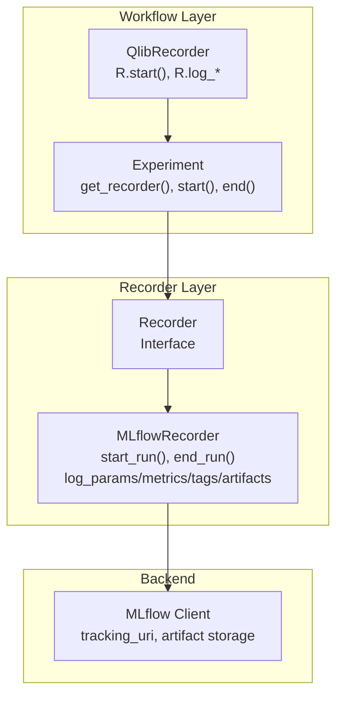
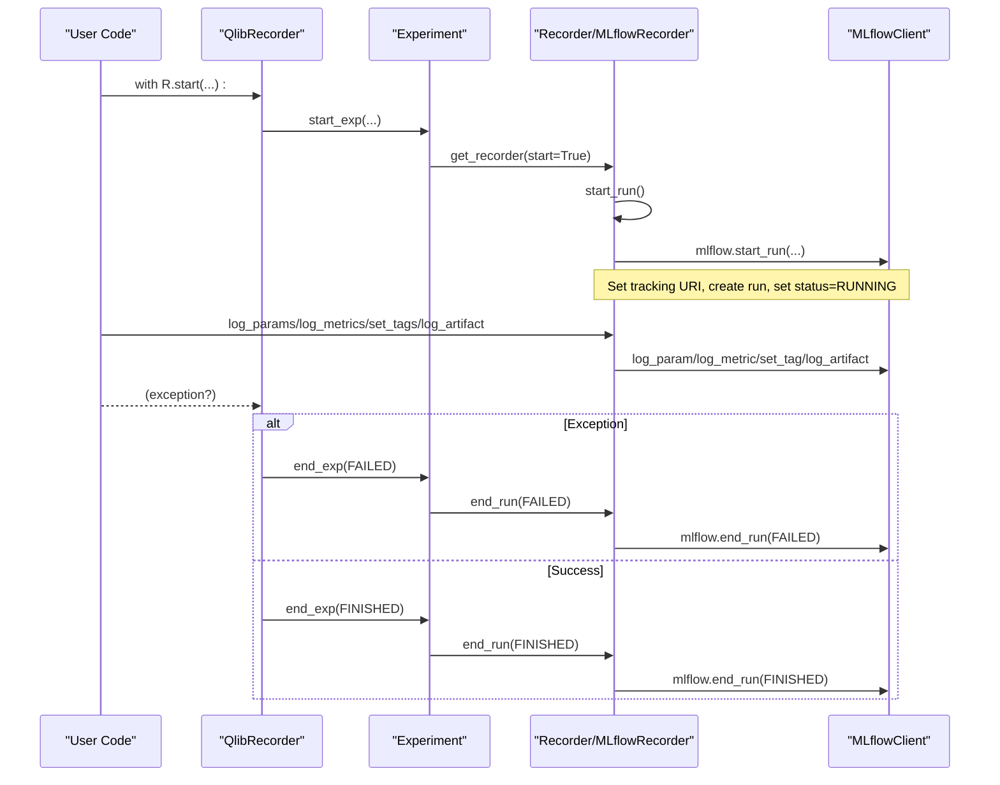
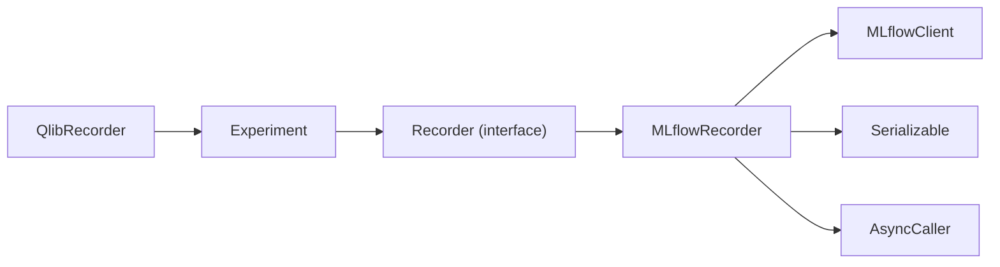
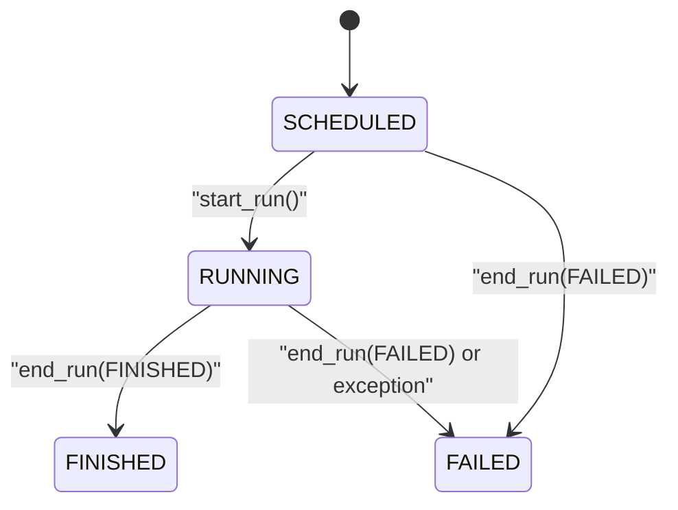

# Recorder Management

<cite>
**Referenced Files in This Document**
- [recorder.py](file://qlib/workflow/recorder.py)
- [exp.py](file://qlib/workflow/exp.py)
- [workflow_init.py](file://qlib/workflow/__init__.py)
- [record_temp.py](file://qlib/workflow/record_temp.py)
- [exceptions.py](file://qlib/utils/exceptions.py)
</cite>

## Table of Contents
1. [Introduction](#introduction)
2. [Project Structure](#project-structure)
3. [Core Components](#core-components)
4. [Architecture Overview](#architecture-overview)
5. [Detailed Component Analysis](#detailed-component-analysis)
6. [Dependency Analysis](#dependency-analysis)
7. [Performance Considerations](#performance-considerations)
8. [Troubleshooting Guide](#troubleshooting-guide)
9. [Conclusion](#conclusion)
10. [Appendices](#appendices)

## Introduction
This document explains QLib’s Recorder lifecycle and management, focusing on the base Recorder interface, status transitions (SCHEDULED, RUNNING, FINISHED, FAILED), core methods start_run() and end_run(), context manager usage via R.start(), naming conventions, experiment association, metadata tracking, error handling patterns, resource cleanup, and best practices for creating custom recorders by extending the base class.

## Project Structure
QLib’s experiment recording system centers around:
- A base Recorder interface defining the contract for logging parameters, metrics, tags, artifacts, and run lifecycle control.
- An MLflow-backed implementation that persists experiments and artifacts to an MLflow backend.
- Experiment and workflow orchestration classes that manage active recorder state and provide high-level APIs like R.start().

**Diagram sources**
- [workflow_init.py:37-95](file://qlib/workflow/__init__.py#L37-L95)
- [exp.py:114-176](file://qlib/workflow/exp.py#L114-L176)
- [recorder.py:28-244](file://qlib/workflow/recorder.py#L28-L244)
- [recorder.py:247-493](file://qlib/workflow/recorder.py#L247-L493)

**Section sources**
- [workflow_init.py:37-95](file://qlib/workflow/__init__.py#L37-L95)
- [exp.py:114-176](file://qlib/workflow/exp.py#L114-L176)
- [recorder.py:28-244](file://qlib/workflow/recorder.py#L28-L244)
- [recorder.py:247-493](file://qlib/workflow/recorder.py#L247-L493)

## Core Components
- Recorder (base): Defines the abstract interface for run lifecycle and metadata logging. It exposes constants for statuses and methods for starting/ending runs, logging params/metrics/tags, saving/loading artifacts, and listing stored data.
- MLflowRecorder (implementation): Implements Recorder using MLflow. It manages tracking URI, artifact URI, async logging, automatic code diff/status capture, environment variable logging, and provides utilities to list/download artifacts and retrieve metrics/params/tags.
- Experiment: Manages active recorder per experiment and provides get_recorder/create_recorder/start/end semantics.
- QlibRecorder (R): High-level API with a context manager start() that ensures proper end_exp() calls and status updates, including failure handling.

Key responsibilities:
- Lifecycle: SCHEDULED -> RUNNING -> FINISHED or FAILED.
- Metadata: Parameters, metrics, tags, artifacts, timestamps, and status.
- Context safety: Exceptions during a run set status to FAILED and ensure resources are released.

**Section sources**
- [recorder.py:28-244](file://qlib/workflow/recorder.py#L28-L244)
- [recorder.py:247-493](file://qlib/workflow/recorder.py#L247-L493)
- [exp.py:114-176](file://qlib/workflow/exp.py#L114-L176)
- [workflow_init.py:37-95](file://qlib/workflow/__init__.py#L37-L95)

## Architecture Overview
The Recorder abstraction decouples experiment logging from the underlying backend. The MLflowRecorder implements this interface and integrates with MLflow’s client to persist runs, parameters, metrics, tags, and artifacts. The Experiment class maintains an active recorder per experiment and coordinates creation/retrieval. QlibRecorder provides user-friendly context managers and convenience logging methods that delegate to the active recorder.

**Diagram sources**
- [workflow_init.py:37-95](file://qlib/workflow/__init__.py#L37-L95)
- [exp.py:114-176](file://qlib/workflow/exp.py#L114-L176)
- [recorder.py:335-395](file://qlib/workflow/recorder.py#L335-L395)

## Detailed Component Analysis

### Recorder Base Interface
- Status constants: SCHEDULED, RUNNING, FINISHED, FAILED.
- Lifecycle:
  - start_run(): Start/resume a run; returns an active run object suitable for context use.
  - end_run(status): End a run and finalize status; must be called if not using context manager.
- Metadata:
  - log_params(**kwargs), log_metrics(step=None, **kwargs), set_tags(**kwargs), delete_tags(*keys).
  - log_artifact(local_path, artifact_path=None).
  - save_objects(local_path=None, artifact_path=None, **kwargs), load_object(name).
  - list_artifacts(artifact_path=None), download_artifact(path, dst_path=None).
  - list_metrics(), list_params(), list_tags().
- Identity and info:
  - id, name, experiment_id, start_time, end_time, status.
  - info property aggregates these fields.

Best practices:
- Always pair start_run() with end_run() unless using a context manager that guarantees it.
- Use set_recorder_name() to assign a meaningful name for identification.
- Prefer logging parameters and tags early in start_run() to capture configuration and environment.

**Section sources**
- [recorder.py:28-244](file://qlib/workflow/recorder.py#L28-L244)

### MLflowRecorder Implementation
- Initialization:
  - Requires experiment_id and uri; optional name and existing mlflow_run for reconstruction.
  - Creates MlflowClient with tracking_uri.
- Run lifecycle:
  - start_run(): Sets tracking URI, starts run, records id/artifact_uri/timestamps, sets status to RUNNING, initializes async logging, logs uncommitted code diffs/status/cached changes, logs command-line args and _QLIB_* environment variables.
  - end_run(status): Validates status, sets end_time, updates status if not SCHEDULED, waits for async logs, ends MLflow run.
- Artifact handling:
  - save_objects(): Supports saving local files/directories or pickling arbitrary objects into a temp directory and logging them; cleans up temp dir.
  - load_object(name): Downloads artifact and unpickles; wraps exceptions in LoadObjectError; handles Azure Blob artifact repository cleanup.
- Logging:
  - log_params(), log_metrics(), set_tags() are decorated for asynchronous logging via AsyncCaller to avoid blocking.
  - log_artifact() directly delegates to MLflow client.
- Listing and retrieval:
  - list_artifacts(), download_artifact(), list_metrics(), list_params(), list_tags() wrap MLflow client operations.

Resource cleanup and error handling:
- Temporary directories created for object serialization are removed after upload.
- For Azure Blob artifact repositories, downloaded temporary files are explicitly removed to save disk space.
- Asynchronous logging is drained before ending the run to prevent incomplete uploads.

**Section sources**
- [recorder.py:247-493](file://qlib/workflow/recorder.py#L247-L493)
- [exceptions.py:10-11](file://qlib/utils/exceptions.py#L10-L11)

### Experiment and Active Recorder Management
- Experiment tracks an active recorder and default recorder name.
- get_recorder(recorder_id=None, recorder_name=None, create=True, start=False):
  - Returns active recorder if available; otherwise creates or retrieves one based on id/name.
  - If create=True and start=True, automatically starts the new recorder via start_run().
- start()/end(): Abstract; implemented by concrete experiment classes to coordinate recorder lifecycle.
- Default behavior:
  - When no recorder specified, uses a default name to simplify logging without explicit recorder management.

Context integration:
- QlibRecorder.start() yields the active run and ensures end_exp() is called with appropriate status, setting FAILED on exceptions.

**Section sources**
- [exp.py:114-176](file://qlib/workflow/exp.py#L114-L176)
- [workflow_init.py:37-95](file://qlib/workflow/__init__.py#L37-L95)

### Context Manager Usage and Best Practices
Recommended pattern:
- Use R.start(experiment_name=..., recorder_name=...) as a context manager to guarantee proper lifecycle and status updates.
- Inside the block, call R.log_params(), R.log_metrics(), R.log_artifact(), or operate on a specific recorder obtained via R.get_recorder().
- Avoid manual start_run()/end_run() unless you have precise control needs; if used, always ensure end_run() is called even on exceptions.

Status transitions:
- SCHEDULED: Initial state when constructed.
- RUNNING: After start_run() completes successfully.
- FINISHED: On successful completion via end_run(FINISHED).
- FAILED: On exception within context or explicit end_run(FAILED).

Naming conventions:
- recorder_name: Human-readable identifier for the run; set via constructor or set_recorder_name().
- experiment_id: Groups related runs; provided at construction or via experiment management APIs.
- id: Unique run identifier assigned by backend (e.g., MLflow run_id).

Metadata tracking:
- Parameters: Configuration and hyperparameters via log_params().
- Metrics: Training/validation scores via log_metrics(step, ...).
- Tags: Labels and flags via set_tags(); deletable via delete_tags().
- Artifacts: Models, predictions, reports via log_artifact/save_objects/load_object.

**Section sources**
- [workflow_init.py:37-95](file://qlib/workflow/__init__.py#L37-L95)
- [recorder.py:335-395](file://qlib/workflow/recorder.py#L335-L395)

### Creating Custom Recorders
To implement a custom recorder:
- Subclass Recorder and implement all abstract methods:
  - start_run(), end_run(status)
  - log_params(**kwargs), log_metrics(step=None, **kwargs)
  - set_tags(**kwargs), delete_tags(*keys)
  - log_artifact(local_path, artifact_path=None)
  - save_objects(local_path=None, artifact_path=None, **kwargs), load_object(name)
  - list_artifacts(artifact_path=None), download_artifact(path, dst_path=None)
  - list_metrics(), list_params(), list_tags()
- Maintain consistent status transitions and timestamps.
- Ensure thread-safety and resource cleanup similar to MLflowRecorder (e.g., handle temporary files, flush async queues).
- Optionally integrate with your own artifact store and tracking backend.

Example outline (conceptual):
- Initialize with experiment_id and name; set initial status to SCHEDULED.
- In start_run(), transition to RUNNING, initialize backend session, record start_time.
- In end_run(status), update end_time, transition to final status, close backend session.
- Implement logging methods to persist params/metrics/tags to your backend.
- Implement artifact methods to store/retrieve files or serialized objects.

**Section sources**
- [recorder.py:28-244](file://qlib/workflow/recorder.py#L28-L244)

### Error Handling Patterns
- Context manager safety: R.start() catches exceptions and ends the experiment with FAILED status, ensuring consistent state.
- MLflowRecorder.end_run() validates status values and waits for async logging before closing the run.
- load_object() wraps exceptions in LoadObjectError to signal loading failures clearly.
- Resource cleanup: Temporary directories are removed after artifact upload; Azure Blob downloads are cleaned up to save disk space.

Operational tips:
- Always use context managers where possible to avoid leaked runs.
- Handle LoadObjectError when retrieving artifacts to gracefully recover or retry.
- Monitor async logging delays; consider batching metrics/params to reduce overhead.

**Section sources**
- [workflow_init.py:37-95](file://qlib/workflow/__init__.py#L37-L95)
- [recorder.py:380-395](file://qlib/workflow/recorder.py#L380-L395)
- [recorder.py:413-443](file://qlib/workflow/recorder.py#L413-L443)
- [exceptions.py:10-11](file://qlib/utils/exceptions.py#L10-L11)

## Dependency Analysis
- Recorder depends on qlib.utils.serial.Serializable for object dumping and qlib.utils.paral.AsyncCaller for async logging.
- MLflowRecorder depends on mlflow.tracking.MlflowClient and platform-specific path handling; also uses subprocess to capture git diffs/status.
- Experiment depends on Recorder and MLflowRecorder to create and manage active runs.
- QlibRecorder orchestrates Experiment and Recorder through start/end flows and convenience logging methods.

**Diagram sources**
- [workflow_init.py:37-95](file://qlib/workflow/__init__.py#L37-L95)
- [exp.py:114-176](file://qlib/workflow/exp.py#L114-L176)
- [recorder.py:247-493](file://qlib/workflow/recorder.py#L247-L493)

**Section sources**
- [workflow_init.py:37-95](file://qlib/workflow/__init__.py#L37-L95)
- [exp.py:114-176](file://qlib/workflow/exp.py#L114-L176)
- [recorder.py:247-493](file://qlib/workflow/recorder.py#L247-L493)

## Performance Considerations
- Asynchronous logging: MLflowRecorder decorates log_params, log_metrics, and set_tags with AsyncCaller to avoid blocking; however, this may delay uploads and affect timing accuracy.
- Artifact size: Large artifacts increase upload time; prefer streaming or chunking where possible.
- Temp file management: Objects are serialized to temporary directories and then uploaded; ensure sufficient disk space and timely cleanup.
- Batch operations: Group multiple metrics/params in single calls to reduce network overhead.

[No sources needed since this section provides general guidance]

## Troubleshooting Guide
Common issues and resolutions:
- Missing start_run(): Attempting to log or access artifacts before starting results in errors; ensure R.start() or explicit start_run() is called first.
- Incomplete end_run(): Not calling end_run() can leave runs open; use context managers to guarantee closure.
- LoadObjectError: Occurs when artifacts cannot be loaded; verify artifact existence and environment compatibility (pickle versions).
- Azure Blob cleanup: Downloaded artifacts are removed after load; if paths disappear unexpectedly, this is expected behavior.
- Git commands fail: Uncommitted code logging relies on git; if unavailable, logs are skipped with informational messages.

Diagnostic steps:
- Check recorder.info for id, status, timestamps.
- List artifacts and metrics to confirm persistence.
- Inspect logs for async queue waits and errors.

**Section sources**
- [recorder.py:315-333](file://qlib/workflow/recorder.py#L315-L333)
- [recorder.py:362-379](file://qlib/workflow/recorder.py#L362-L379)
- [recorder.py:413-443](file://qlib/workflow/recorder.py#L413-L443)

## Conclusion
QLib’s Recorder abstraction provides a robust, backend-agnostic interface for experiment lifecycle and metadata tracking. The MLflowRecorder implementation offers comprehensive features including async logging, automatic code capture, environment logging, and artifact management. Using R.start() as a context manager ensures safe lifecycle management and consistent status transitions. Extending Recorder allows integration with alternative backends while preserving QLib’s workflow semantics. Adhering to best practices—explicit naming, proper context usage, careful artifact handling, and thorough error handling—ensures reliable and maintainable experiment tracking.

[No sources needed since this section summarizes without analyzing specific files]

## Appendices

### Status Flow Diagram

**Diagram sources**
- [recorder.py:36-40](file://qlib/workflow/recorder.py#L36-L40)
- [recorder.py:335-395](file://qlib/workflow/recorder.py#L335-L395)

### Record Template Integration
RecordTemp leverages Recorder to save and load generated artifacts such as predictions and analysis outputs, providing convenient wrappers around save_objects and load_object with artifact path resolution.

**Section sources**
- [record_temp.py:49-118](file://qlib/workflow/record_temp.py#L49-L118)