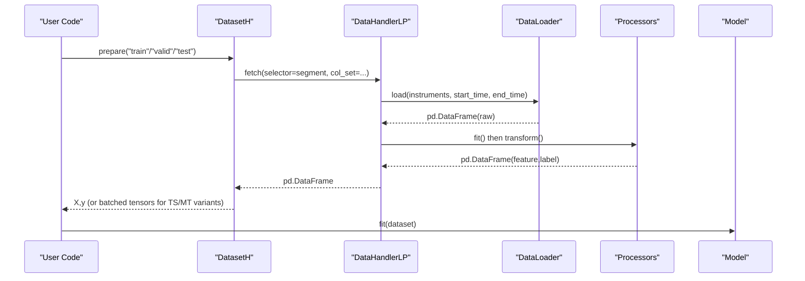
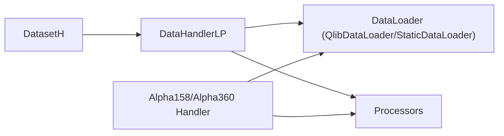

# Dataset Integration and Data Handling

<cite>
**Referenced Files in This Document**
- [dataset.py](file://qlib/data/dataset/__init__.py)
- [handler.py](file://qlib/data/dataset/handler.py)
- [processor.py](file://qlib/data/dataset/processor.py)
- [dataset.py](file://qlib/contrib/data/dataset.py)
- [handler.py](file://qlib/contrib/data/handler.py)
- [loader.py](file://qlib/contrib/data/loader.py)
- [workflow_config_lightgbm_Alpha158.yaml](file://examples/benchmarks/LightGBM/workflow_config_lightgbm_Alpha158.yaml)
- [workflow_config_lightgbm_Alpha360.yaml](file://examples/benchmarks/LightGBM/workflow_config_lightgbm_Alpha360.yaml)
- [workflow_by_code.py](file://examples/workflow_by_code.py)
</cite>

## Table of Contents
1. [Introduction](#introduction)
2. [Project Structure](#project-structure)
3. [Core Components](#core-components)
4. [Architecture Overview](#architecture-overview)
5. [Detailed Component Analysis](#detailed-component-analysis)
6. [Dependency Analysis](#dependency-analysis)
7. [Performance Considerations](#performance-considerations)
8. [Troubleshooting Guide](#troubleshooting-guide)
9. [Conclusion](#conclusion)
10. [Appendices](#appendices)

## Introduction
This document explains how to integrate datasets with QLib’s model training framework. It covers preparing data using Dataset objects, handling feature matrices and target variables, managing train/validation/test splits, and the full data preparation pipeline including feature engineering, label encoding, normalization, and weight handling. It also documents supported data formats (pandas DataFrame and numpy arrays), conversion patterns, and how to create custom handlers and processors for specific requirements.

## Project Structure
QLib’s data layer is organized around a clear separation of concerns:
- Data loading and storage abstraction via DataHandler and DataLoader
- Preprocessing via Processor chain
- Dataset orchestration via DatasetH/TSDatasetH/MTSDatasetH
- Contributed handlers for common factor sets (Alpha158, Alpha360)
- Example workflows demonstrating configuration-driven setup

```mermaid
graph TB
subgraph "Data Layer"
DL["DataLoader"] --> DH["DataHandler / DataHandlerLP"]
DH --> Proc["Processor Chain"]
Proc --> DF["pd.DataFrame (feature,label)"]
end
subgraph "Dataset Layer"
DS["DatasetH / TSDatasetH / MTSDatasetH"] --> |prepare(segments)| DF
end
subgraph "Models"
M["Model.fit(dataset)"] --> DS
end
```

**Diagram sources**
- [handler.py:105-195](file://qlib/data/dataset/handler.py#L105-L195)
- [handler.py:382-610](file://qlib/data/dataset/handler.py#L382-L610)
- [processor.py:35-91](file://qlib/data/dataset/processor.py#L35-L91)
- [dataset.py:15-247](file://qlib/data/dataset/__init__.py#L15-L247)

**Section sources**
- [handler.py:105-195](file://qlib/data/dataset/handler.py#L105-L195)
- [handler.py:382-610](file://qlib/data/dataset/handler.py#L382-L610)
- [processor.py:35-91](file://qlib/data/dataset/processor.py#L35-L91)
- [dataset.py:15-247](file://qlib/data/dataset/__init__.py#L15-L247)

## Core Components
- DataHandler/DataHandlerLP: Loads raw data via a DataLoader, applies processor chains for inference and learning, and exposes a unified fetch interface returning pandas DataFrames with multi-level columns (e.g., feature, label).
- Processor: Base class for transformations such as dropping NaNs, normalization (Z-score, robust Z-score, cross-sectional rank), filling values, and more. Processors can be fit on training windows and applied consistently during inference.
- DatasetH/TSDatasetH/MTSDatasetH: Wraps a DataHandler and segments (train/valid/test) to prepare data for models. TSDatasetH converts tabular data into time-series samplers; MTSDatasetH provides memory-augmented batching for sequence models.
- Contrib Handlers (Alpha158, Alpha360): Predefined handlers that configure features and labels from Qlib’s expression engine and apply default learn/infer processors.

Key responsibilities:
- Feature engineering: handled by DataLoaders and processors
- Label encoding: defined in handler configurations or expressions
- Train/val/test splits: configured via segments in DatasetH
- Weights: not built-in by default; can be added via custom processors or by extending fetch/prepare to return weights alongside X/y

**Section sources**
- [handler.py:105-195](file://qlib/data/dataset/handler.py#L105-L195)
- [handler.py:382-610](file://qlib/data/dataset/handler.py#L382-L610)
- [processor.py:94-371](file://qlib/data/dataset/processor.py#L94-L371)
- [dataset.py:15-247](file://qlib/data/dataset/__init__.py#L15-L247)
- [dataset.py:102-363](file://qlib/contrib/data/dataset.py#L102-L363)
- [handler.py:48-158](file://qlib/contrib/data/handler.py#L48-L158)
- [loader.py:4-311](file://qlib/contrib/data/loader.py#L4-L311)

## Architecture Overview
The typical flow from raw data to model training:



**Diagram sources**
- [dataset.py:185-247](file://qlib/data/dataset/__init__.py#L185-L247)
- [handler.py:173-195](file://qlib/data/dataset/handler.py#L173-L195)
- [handler.py:633-661](file://qlib/data/dataset/handler.py#L633-L661)
- [handler.py:552-610](file://qlib/data/dataset/handler.py#L552-L610)

## Detailed Component Analysis

### DataHandler and DataHandlerLP
- DataHandler loads data via a configured DataLoader and returns slices of a pandas DataFrame through fetch. It supports selecting column groups (raw, all, or named groups) and slicing by datetime/instrument index.
- DataHandlerLP extends this with separate processing pipelines for inference and learning:
  - shared_processors run first
  - infer_processors produce _infer
  - learn_processors append to produce _learn (depending on process_type)
- Processors are initialized from configs or instances and can declare whether they are safe for inference and whether they mutate input data.

Practical implications:
- Use learn_processors for label-based filtering and normalization fitted only on training windows
- Use infer_processors for transformations required at inference time
- DropnaLabel is not usable for inference because it depends on labels

**Section sources**
- [handler.py:105-195](file://qlib/data/dataset/handler.py#L105-L195)
- [handler.py:382-610](file://qlib/data/dataset/handler.py#L382-L610)
- [processor.py:94-112](file://qlib/data/dataset/processor.py#L94-L112)

### Processors
Built-in processors include:
- DropnaLabel/DropnaFeature: remove rows with missing labels/features
- Fillna: fill NaNs with a constant or group-wise mean
- MinMaxNorm/ZScoreNorm/RobustZScoreNorm: normalize per-column using training window statistics
- CSZScoreNorm/CSRankNorm: cross-sectional normalization across instruments per day
- ProcessInf: handle infinities
- HashStockFormat: convert to hashing storage format

Custom processors:
- Implement __call__ to transform a DataFrame
- Optionally implement fit to compute parameters over a training window
- Mark readonly if no in-place mutation occurs to avoid unnecessary copies
- Use fields_group to target “feature” or “label” column groups

**Section sources**
- [processor.py:35-91](file://qlib/data/dataset/processor.py#L35-L91)
- [processor.py:94-371](file://qlib/data/dataset/processor.py#L94-L371)

### DatasetH, TSDatasetH, MTSDatasetH
- DatasetH wraps a DataHandler and segments (train/valid/test). prepare(segment) returns processed data for that segment.
- TSDatasetH builds time-series samples with a fixed step length and optional filtering column. It returns a TSDataSampler that supports indexing by integer or (datetime, instrument) pairs.
- MTSDatasetH prepares memory-augmented batches for sequence models, supporting daily or sample-wise memory modes and configurable batch sizes.

Splits:
- Define segments as time ranges in dataset config
- prepare accepts string names (“train”, “valid”, “test”) or lists of them

**Section sources**
- [dataset.py:15-247](file://qlib/data/dataset/__init__.py#L15-L247)
- [dataset.py:272-720](file://qlib/data/dataset/__init__.py#L272-L720)
- [dataset.py:102-363](file://qlib/contrib/data/dataset.py#L102-L363)

### Contrib Handlers (Alpha158, Alpha360)
- Alpha158/Alpha360 define feature and label configurations using Qlib’s expression language and set default learn/infer processors.
- They use QlibDataLoader under the hood to generate factors and labels.
- You can customize features via loader configs and override labels in handler kwargs.

**Section sources**
- [handler.py:48-158](file://qlib/contrib/data/handler.py#L48-L158)
- [loader.py:4-311](file://qlib/contrib/data/loader.py#L4-L311)

### Workflow Examples
- Configuration-driven workflow defines dataset, segments, and handler settings.
- The same components can be composed programmatically.

Typical elements:
- data_handler_config: instruments, time range, fit windows, processors
- dataset: class DatasetH with handler and segments
- record: SignalRecord/SigAnaRecord/PortAnaRecord for evaluation and backtesting

**Section sources**
- [workflow_config_lightgbm_Alpha158.yaml:1-72](file://examples/benchmarks/LightGBM/workflow_config_lightgbm_Alpha158.yaml#L1-L72)
- [workflow_config_lightgbm_Alpha360.yaml:1-79](file://examples/benchmarks/LightGBM/workflow_config_lightgbm_Alpha360.yaml#L1-L79)
- [workflow_by_code.py:1-86](file://examples/workflow_by_code.py#L1-L86)

## Dependency Analysis
High-level dependencies:
- DatasetH depends on DataHandlerLP for data fetching and processing
- DataHandlerLP depends on a DataLoader implementation (QlibDataLoader or StaticDataLoader)
- Processors depend on pandas/numpy utilities and may rely on Qlib’s calendar and tools
- Contrib handlers depend on contrib loaders to build factor expressions



**Diagram sources**
- [handler.py:105-195](file://qlib/data/dataset/handler.py#L105-L195)
- [handler.py:382-610](file://qlib/data/dataset/handler.py#L382-L610)
- [handler.py:48-158](file://qlib/contrib/data/handler.py#L48-L158)
- [loader.py:4-311](file://qlib/contrib/data/loader.py#L4-L311)

**Section sources**
- [handler.py:105-195](file://qlib/data/dataset/handler.py#L105-L195)
- [handler.py:382-610](file://qlib/data/dataset/handler.py#L382-L610)
- [handler.py:48-158](file://qlib/contrib/data/handler.py#L48-L158)
- [loader.py:4-311](file://qlib/contrib/data/loader.py#L4-L311)

## Performance Considerations
- Prefer CS_RAW when possible to avoid extra copies and leverage efficient storage-backed fetches where available.
- Use readonly processors to minimize unnecessary DataFrame copies in DataHandlerLP.
- For time-series models, TSDatasetH and MTSDatasetH optimize sampling and batching; choose appropriate step_len and batch_size.
- Fit normalization parameters strictly within training windows to prevent leakage and ensure stable inference.
- Avoid heavy in-place modifications unless necessary; prefer vectorized operations.

[No sources needed since this section provides general guidance]

## Troubleshooting Guide
Common issues and resolutions:
- Data leakage in normalization: Ensure fit_start_time and fit_end_time exclude validation/test periods for processors like ZScoreNorm/MinMaxNorm/RobustZScoreNorm.
- Inference-time errors with label-dependent processors: DropnaLabel is not usable for inference; move label-based filtering to learn-only path.
- Index ordering and sorting: DataHandler ensures sorted indices; if building custom loaders, maintain consistent MultiIndex order.
- Memory pressure: Use drop_raw to discard raw data after processing; consider HashingStockFormat for large datasets.
- Time-series slicing: TSDatasetH extends slices to ensure complete sequences; verify step_len and filter columns.

**Section sources**
- [processor.py:196-297](file://qlib/data/dataset/processor.py#L196-L297)
- [processor.py:94-112](file://qlib/data/dataset/processor.py#L94-L112)
- [handler.py:552-610](file://qlib/data/dataset/handler.py#L552-L610)
- [dataset.py:679-719](file://qlib/data/dataset/__init__.py#L679-L719)

## Conclusion
QLib’s data layer provides a flexible, composable pipeline for preparing financial datasets for model training. By combining DataHandlers, processors, and Dataset wrappers, you can engineer features, encode labels, manage splits, and deliver data in formats suitable for both classical ML and deep learning. Customization points include custom processors, handlers, and loaders, enabling tailored solutions for domain-specific requirements.

[No sources needed since this section summarizes without analyzing specific files]

## Appendices

### A. Data Preparation Checklist
- Define instruments and time ranges
- Choose or build a DataHandler (use Alpha158/Alpha360 as starting points)
- Configure learn_processors for training (e.g., DropnaLabel, normalization)
- Configure infer_processors for inference (e.g., Fillna, ZScoreNorm)
- Set segments for train/valid/test
- Validate outputs via dataset.prepare("train") and inspect shapes and dtypes

**Section sources**
- [workflow_config_lightgbm_Alpha158.yaml:1-72](file://examples/benchmarks/LightGBM/workflow_config_lightgbm_Alpha158.yaml#L1-L72)
- [workflow_config_lightgbm_Alpha360.yaml:1-79](file://examples/benchmarks/LightGBM/workflow_config_lightgbm_Alpha360.yaml#L1-L79)
- [workflow_by_code.py:1-86](file://examples/workflow_by_code.py#L1-L86)

### B. Supported Data Formats and Conversions
- Internal representation: pandas DataFrame with MultiIndex columns (feature, label)
- Models typically consume:
  - pandas DataFrames via DatasetH.prepare
  - numpy arrays via TSDataSampler/MTSDatasetH iteration
  - PyTorch tensors via MTSDatasetH batch iterators
- Conversion patterns:
  - From DataFrame to numpy: use .values on selected groups
  - From numpy to DataFrame: construct with appropriate MultiIndex columns
  - For time-series: use TSDatasetH to slice sequences; for memory-augmented batches: use MTSDatasetH

**Section sources**
- [handler.py:105-195](file://qlib/data/dataset/handler.py#L105-L195)
- [dataset.py:272-720](file://qlib/data/dataset/__init__.py#L272-L720)
- [dataset.py:102-363](file://qlib/contrib/data/dataset.py#L102-L363)

### C. Creating Custom Handlers and Processors
- Custom Handler:
  - Subclass DataHandlerLP or use existing contrib handlers as templates
  - Provide data_loader config (QlibDataLoader or StaticDataLoader)
  - Define get_feature_config/get_label_config if needed
- Custom Processor:
  - Implement __call__(df) to transform data
  - Optionally implement fit(df) to compute parameters on training window
  - Use fields_group to target feature or label columns
  - Return new DataFrame or modify in place (mark readonly if not mutating)

**Section sources**
- [handler.py:382-610](file://qlib/data/dataset/handler.py#L382-L610)
- [handler.py:48-158](file://qlib/contrib/data/handler.py#L48-L158)
- [processor.py:35-91](file://qlib/data/dataset/processor.py#L35-L91)
- [processor.py:94-371](file://qlib/data/dataset/processor.py#L94-L371)

### D. Weight Handling
- QLib does not expose sample weights by default in the standard fetch/prepare interfaces.
- To incorporate weights:
  - Add a “weight” column in the label group via a custom processor or loader
  - Extend DatasetH.prepare to return weights alongside X/y for your model
  - Alternatively, subclass MTSDatasetH to yield a “weight” tensor in batches

[No sources needed since this section provides general guidance]