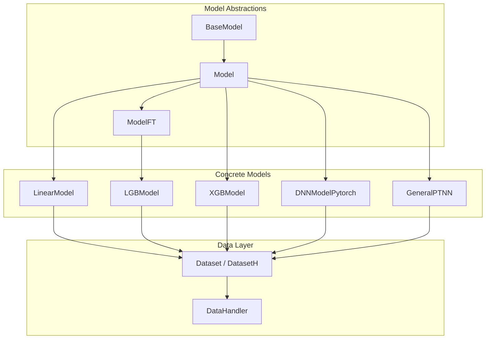
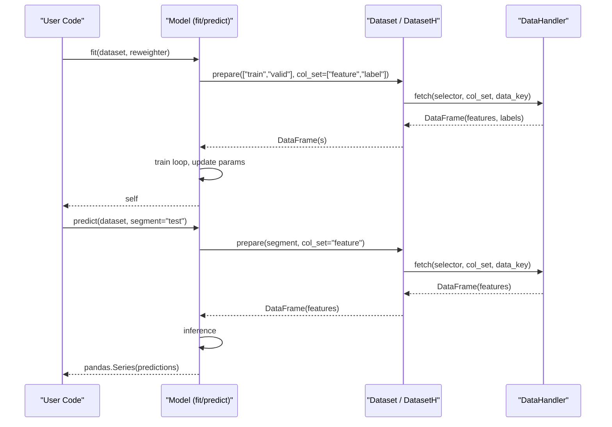
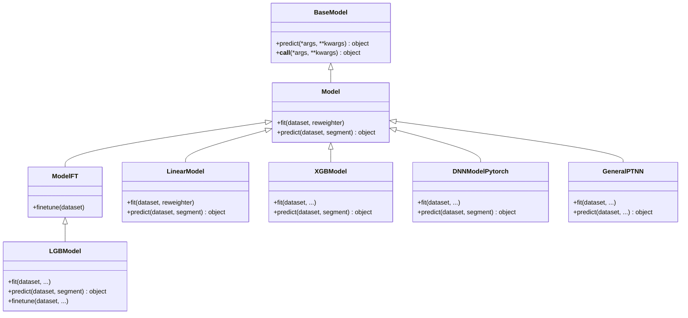
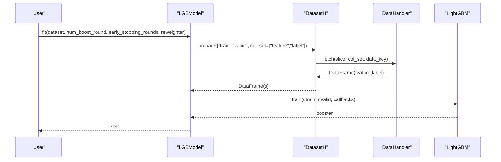
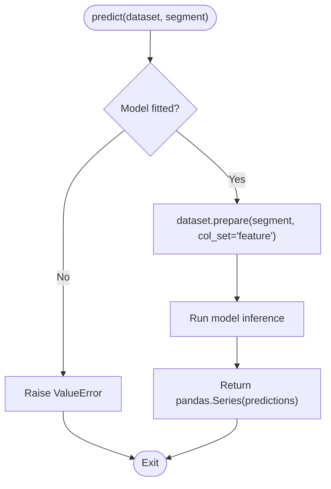
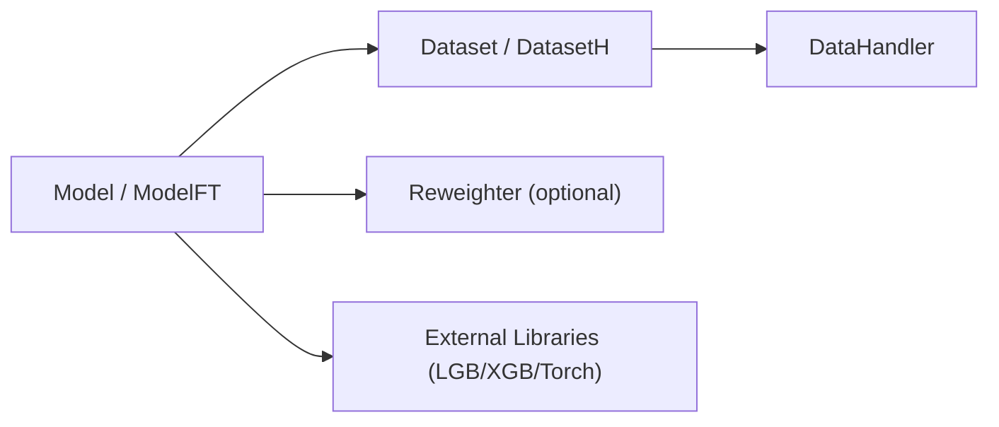

# Model Base Interface and Core Methods

<cite>
**Referenced Files in This Document**
- [base.py](file://qlib/model/base.py)
- [__init__.py](file://qlib/model/__init__.py)
- [linear.py](file://qlib/contrib/model/linear.py)
- [gbdt.py](file://qlib/contrib/model/gbdt.py)
- [xgboost.py](file://qlib/contrib/model/xgboost.py)
- [pytorch_nn.py](file://qlib/contrib/model/pytorch_nn.py)
- [pytorch_general_nn.py](file://qlib/contrib/model/pytorch_general_nn.py)
- [dataset.py](file://qlib/data/dataset/__init__.py)
- [handler.py](file://qlib/data/dataset/handler.py)
</cite>

## Table of Contents
1. [Introduction](#introduction)
2. [Project Structure](#project-structure)
3. [Core Components](#core-components)
4. [Architecture Overview](#architecture-overview)
5. [Detailed Component Analysis](#detailed-component-analysis)
6. [Dependency Analysis](#dependency-analysis)
7. [Performance Considerations](#performance-considerations)
8. [Troubleshooting Guide](#troubleshooting-guide)
9. [Conclusion](#conclusion)
10. [Appendices](#appendices)

## Introduction
This document explains QLib’s model base interface and the core methods that define how models are trained, predicted, and fine-tuned. It focuses on:
- BaseModel: the abstract foundation with predict and __call__
- Model: the learnable base with fit and predict contracts
- ModelFT: the fine-tunable extension with finetune
It also shows how concrete models implement these interfaces and how they interact with QLib’s dataset system to prepare data for training and inference.

## Project Structure
QLib organizes model abstractions under qlib/model and provides concrete implementations under qlib/contrib/model. Data preparation is handled by Dataset and DatasetH in qlib/data/dataset, which models use to fetch features, labels, and weights.

**Diagram sources**
- [base.py:10-111](file://qlib/model/base.py#L10-L111)
- [linear.py:17-114](file://qlib/contrib/model/linear.py#L17-L114)
- [gbdt.py:16-127](file://qlib/contrib/model/gbdt.py#L16-L127)
- [xgboost.py:15-86](file://qlib/contrib/model/xgboost.py#L15-L86)
- [pytorch_nn.py:39-404](file://qlib/contrib/model/pytorch_nn.py#L39-L404)
- [pytorch_general_nn.py:33-372](file://qlib/contrib/model/pytorch_general_nn.py#L33-L372)
- [dataset.py:15-248](file://qlib/data/dataset/__init__.py#L15-L248)
- [handler.py:25-64](file://qlib/data/dataset/handler.py#L25-L64)

**Section sources**
- [base.py:10-111](file://qlib/model/base.py#L10-L111)
- [dataset.py:15-248](file://qlib/data/dataset/__init__.py#L15-L248)
- [handler.py:25-64](file://qlib/data/dataset/handler.py#L25-L64)

## Core Components
- BaseModel: Abstract base defining predict and a callable interface via __call__.
- Model: Extends BaseModel; requires implementing fit(dataset, reweighter) and predict(dataset, segment).
- ModelFT: Extends Model; requires implementing finetune(dataset) for continuing training from a previously fitted model.

Key behaviors:
- fit: Trains the model using features and labels prepared from Dataset (and optional Reweighter).
- predict: Generates predictions for a given dataset segment (train/valid/test or custom slices).
- __call__: Allows calling the model like a function, delegating to predict.
- finetune: Continues training from an existing model state using new data.

Return types and parameters are defined per implementation but generally follow:
- fit returns self (for chaining)
- predict returns a pandas Series aligned with the input index
- finetune updates internal model state and may return self

**Section sources**
- [base.py:10-111](file://qlib/model/base.py#L10-L111)

## Architecture Overview
The model layer integrates tightly with QLib’s dataset layer. Models request data through Dataset.prepare, which delegates to DataHandler.fetch to retrieve feature and label columns for specified segments. Training loops iterate over batches or datasets, compute losses, update parameters, and optionally evaluate on validation splits. Prediction uses the same dataset interface to obtain features for inference.

**Diagram sources**
- [dataset.py:185-248](file://qlib/data/dataset/__init__.py#L185-L248)
- [handler.py:56-64](file://qlib/data/dataset/handler.py#L56-L64)
- [linear.py:58-114](file://qlib/contrib/model/linear.py#L58-L114)
- [pytorch_nn.py:190-387](file://qlib/contrib/model/pytorch_nn.py#L190-L387)

## Detailed Component Analysis

### BaseModel
- Purpose: Defines the minimal contract for all models in QLib.
- Required methods:
  - predict(*args, **kwargs) -> object: Abstract method to produce predictions.
  - __call__(*args, **kwargs) -> object: Delegates to predict for function-like invocation.
- Notes: Inherits serialization support to enable saving/loading model states.

Usage example path:
- See any concrete model’s predict implementation for expected behavior and return type.

**Section sources**
- [base.py:10-20](file://qlib/model/base.py#L10-L20)

### Model
- Purpose: Learnable model base with training and prediction contracts.
- Required methods:
  - fit(dataset: Dataset, reweighter: Reweighter): Train the model. Implementations typically extract features and labels via dataset.prepare and apply optional sample weights from Reweighter.
  - predict(dataset: Dataset, segment: Union[Text, slice] = "test"): Predict on a specified segment. Returns a pandas Series aligned with the dataset index.
- Common patterns:
  - Use dataset.prepare("train", col_set=["feature","label"]) to get training data.
  - Optionally include validation data if present in dataset.segments.
  - Handle empty data and raise informative errors.

Example implementations:
- LinearModel.fit and .predict
- XGBModel.fit and .predict
- DNNModelPytorch.fit and .predict
- GeneralPTNN.fit and .predict

**Section sources**
- [base.py:22-79](file://qlib/model/base.py#L22-L79)
- [linear.py:58-114](file://qlib/contrib/model/linear.py#L58-L114)
- [xgboost.py:23-86](file://qlib/contrib/model/xgboost.py#L23-L86)
- [pytorch_nn.py:190-387](file://qlib/contrib/model/pytorch_nn.py#L190-L387)
- [pytorch_general_nn.py:235-372](file://qlib/contrib/model/pytorch_general_nn.py#L235-L372)

### ModelFT
- Purpose: Adds fine-tuning capability to models that can be continued from a previously trained state.
- Required methods:
  - finetune(dataset: Dataset): Continue training using new data while preserving prior learned parameters.
- Typical workflow:
  - Train an initial model with fit.
  - Save the model via workflow recording or persistence utilities.
  - Load the saved model and call finetune with additional data.

Example implementation:
- LGBModel.finetune continues LightGBM training from an existing booster.

**Section sources**
- [base.py:81-111](file://qlib/model/base.py#L81-L111)
- [gbdt.py:98-127](file://qlib/contrib/model/gbdt.py#L98-L127)

### Concrete Model Examples

#### LinearModel
- Estimators: OLS, NNLS, Ridge, Lasso.
- fit:
  - Extracts features and labels from dataset.prepare("train").
  - Optionally concatenates validation data if configured.
  - Applies Reweighter to compute sample weights.
  - Fits underlying estimator and stores coefficients and intercept.
- predict:
  - Requires model to be fitted; otherwise raises an error.
  - Computes linear predictions and returns a pandas Series.

Parameters:
- estimator: string selecting regression method
- alpha: regularization strength (Ridge/Lasso)
- fit_intercept: whether to fit an intercept
- include_valid: whether to include validation data in training

**Section sources**
- [linear.py:17-114](file://qlib/contrib/model/linear.py#L17-L114)

#### LGBModel (LightGBM)
- fit:
  - Prepares LightGBM datasets for train and optional valid segments.
  - Uses callbacks for early stopping, logging, and evaluation metrics.
  - Logs metrics via workflow recorder.
- predict:
  - Requires model to be fitted; otherwise raises an error.
  - Returns predictions as a pandas Series.
- finetune:
  - Continues training from an existing booster with additional rounds.

Parameters:
- loss: objective ("mse" or "binary")
- early_stopping_rounds: number of rounds without improvement to stop
- num_boost_round: total boosting iterations
- verbose_eval: frequency of logging during training

**Section sources**
- [gbdt.py:16-127](file://qlib/contrib/model/gbdt.py#L16-L127)

#### XGBModel (XGBoost)
- fit:
  - Prepares DMatrix objects for train and valid sets.
  - Supports sample weights via Reweighter.
  - Trains with early stopping and logs evaluation results.
- predict:
  - Requires model to be fitted; otherwise raises an error.
  - Returns predictions as a pandas Series.

Parameters:
- kwargs: passed to xgb.train (e.g., num_boost_round, early_stopping_rounds, verbose_eval)

**Section sources**
- [xgboost.py:15-86](file://qlib/contrib/model/xgboost.py#L15-L86)

#### DNNModelPytorch
- fit:
  - Loads dataset features and labels for train and optional valid segments.
  - Converts data to tensors and moves to device (CPU/GPU).
  - Iterates steps with mini-batches, computes loss, backpropagates, and optimizes.
  - Evaluates on validation periodically, saves best checkpoint, and restores best parameters.
  - Supports learning rate scheduling and metric logging.
- predict:
  - Requires model to be fitted; otherwise raises an error.
  - Performs batched inference and returns a pandas Series.

Parameters:
- lr, max_steps, batch_size, early_stop_rounds, eval_steps
- optimizer, loss, GPU, seed, weight_decay, data_parall
- scheduler configuration and model URI/kwarg for neural network definition

**Section sources**
- [pytorch_nn.py:39-404](file://qlib/contrib/model/pytorch_nn.py#L39-L404)

#### GeneralPTNN
- fit:
  - Wraps tabular or time-series datasets into DataLoaders.
  - Trains with configurable loss and optimizer; supports early stopping and LR scheduling.
  - Saves best model parameters and restores them after training.
- predict:
  - Requires model to be fitted; otherwise raises an error.
  - Batches inference and returns a pandas Series.

Parameters:
- n_epochs, lr, metric, batch_size, early_stop, loss, weight_decay, optimizer, n_jobs, GPU, seed
- pt_model_uri and pt_model_kwargs to instantiate the underlying PyTorch model

**Section sources**
- [pytorch_general_nn.py:33-372](file://qlib/contrib/model/pytorch_general_nn.py#L33-L372)

### Class Diagram

**Diagram sources**
- [base.py:10-111](file://qlib/model/base.py#L10-L111)
- [linear.py:17-114](file://qlib/contrib/model/linear.py#L17-L114)
- [gbdt.py:16-127](file://qlib/contrib/model/gbdt.py#L16-L127)
- [xgboost.py:15-86](file://qlib/contrib/model/xgboost.py#L15-L86)
- [pytorch_nn.py:39-404](file://qlib/contrib/model/pytorch_nn.py#L39-L404)
- [pytorch_general_nn.py:33-372](file://qlib/contrib/model/pytorch_general_nn.py#L33-L372)

### Sequence Diagram: Training Flow (LightGBM Example)

**Diagram sources**
- [gbdt.py:28-91](file://qlib/contrib/model/gbdt.py#L28-L91)
- [dataset.py:185-248](file://qlib/data/dataset/__init__.py#L185-L248)
- [handler.py:56-64](file://qlib/data/dataset/handler.py#L56-L64)

### Flowchart: Prediction Logic (Generic)

**Diagram sources**
- [linear.py:109-114](file://qlib/contrib/model/linear.py#L109-L114)
- [xgboost.py:71-86](file://qlib/contrib/model/xgboost.py#L71-L86)
- [pytorch_nn.py:382-387](file://qlib/contrib/model/pytorch_nn.py#L382-L387)
- [pytorch_general_nn.py:334-372](file://qlib/contrib/model/pytorch_general_nn.py#L334-L372)

## Dependency Analysis
- Model classes depend on Dataset/DatasetH to access features and labels.
- DatasetH delegates to DataHandler to fetch data with specific column sets and data keys.
- Reweighter is optional and used to compute sample weights during training.
- Concrete models integrate with external libraries (LightGBM, XGBoost, PyTorch) while adhering to the QLib model interface.

**Diagram sources**
- [base.py:22-111](file://qlib/model/base.py#L22-L111)
- [dataset.py:185-248](file://qlib/data/dataset/__init__.py#L185-L248)
- [handler.py:56-64](file://qlib/data/dataset/handler.py#L56-L64)
- [linear.py:58-114](file://qlib/contrib/model/linear.py#L58-L114)
- [gbdt.py:28-91](file://qlib/contrib/model/gbdt.py#L28-L91)
- [xgboost.py:23-86](file://qlib/contrib/model/xgboost.py#L23-L86)
- [pytorch_nn.py:190-387](file://qlib/contrib/model/pytorch_nn.py#L190-L387)
- [pytorch_general_nn.py:235-372](file://qlib/contrib/model/pytorch_general_nn.py#L235-L372)

**Section sources**
- [base.py:22-111](file://qlib/model/base.py#L22-L111)
- [dataset.py:185-248](file://qlib/data/dataset/__init__.py#L185-L248)
- [handler.py:56-64](file://qlib/data/dataset/handler.py#L56-L64)

## Performance Considerations
- Prefer using DatasetH segments to efficiently slice data for train/valid/test.
- Use Reweighter only when necessary; it adds computation overhead.
- For deep learning models:
  - Choose appropriate batch sizes and device placement (CPU/GPU).
  - Enable early stopping and learning rate scheduling to reduce overfitting and training time.
  - Use DataLoader batching to manage memory usage.
- For tree-based models:
  - Tune num_boost_round and early_stopping_rounds to balance accuracy and speed.
  - Avoid unnecessary logging in production runs.

## Troubleshooting Guide
Common issues and resolutions:
- Empty data from dataset:
  - Ensure dataset segments are correctly configured and contain non-empty feature/label columns.
  - Validate handler configuration and data loader settings.
- Model not fitted yet:
  - Call fit before predict; many implementations raise ValueError if predict is invoked without fitting.
- Unsupported reweighter type:
  - Pass a valid Reweighter instance; some models validate the type and raise errors otherwise.
- Multi-label not supported:
  - Some models (e.g., LightGBM, XGBoost) require single-label targets; reshape or select appropriate label columns.

**Section sources**
- [linear.py:67-82](file://qlib/contrib/model/linear.py#L67-L82)
- [gbdt.py:38-55](file://qlib/contrib/model/gbdt.py#L38-L55)
- [xgboost.py:41-55](file://qlib/contrib/model/xgboost.py#L41-L55)
- [pytorch_nn.py:382-387](file://qlib/contrib/model/pytorch_nn.py#L382-L387)
- [pytorch_general_nn.py:248-259](file://qlib/contrib/model/pytorch_general_nn.py#L248-L259)

## Conclusion
QLib’s model base interface standardizes how models are trained, predicted, and fine-tuned across diverse algorithms. By implementing fit and predict (and finetune when applicable), developers can integrate custom models seamlessly with QLib’s dataset pipeline. Concrete implementations demonstrate best practices for data handling, optimization, and evaluation, enabling robust and scalable modeling workflows.

## Appendices

### How to Implement a Custom Model
Steps:
- Inherit from Model or ModelFT depending on whether you need fine-tuning.
- Implement fit(dataset, reweighter):
  - Use dataset.prepare to extract features and labels.
  - Apply Reweighter if needed.
  - Train your model and store learned parameters.
- Implement predict(dataset, segment="test"):
  - Use dataset.prepare to extract features for the specified segment.
  - Run inference and return a pandas Series aligned with the dataset index.
- If using ModelFT, implement finetune(dataset):
  - Load or reference an existing model state.
  - Continue training with new data.

Reference paths:
- Base interface: [base.py:10-111](file://qlib/model/base.py#L10-L111)
- Dataset usage: [dataset.py:185-248](file://qlib/data/dataset/__init__.py#L185-L248)
- Example implementations:
  - [linear.py:58-114](file://qlib/contrib/model/linear.py#L58-L114)
  - [gbdt.py:28-127](file://qlib/contrib/model/gbdt.py#L28-L127)
  - [xgboost.py:23-86](file://qlib/contrib/model/xgboost.py#L23-L86)
  - [pytorch_nn.py:190-387](file://qlib/contrib/model/pytorch_nn.py#L190-L387)
  - [pytorch_general_nn.py:235-372](file://qlib/contrib/model/pytorch_general_nn.py#L235-L372)