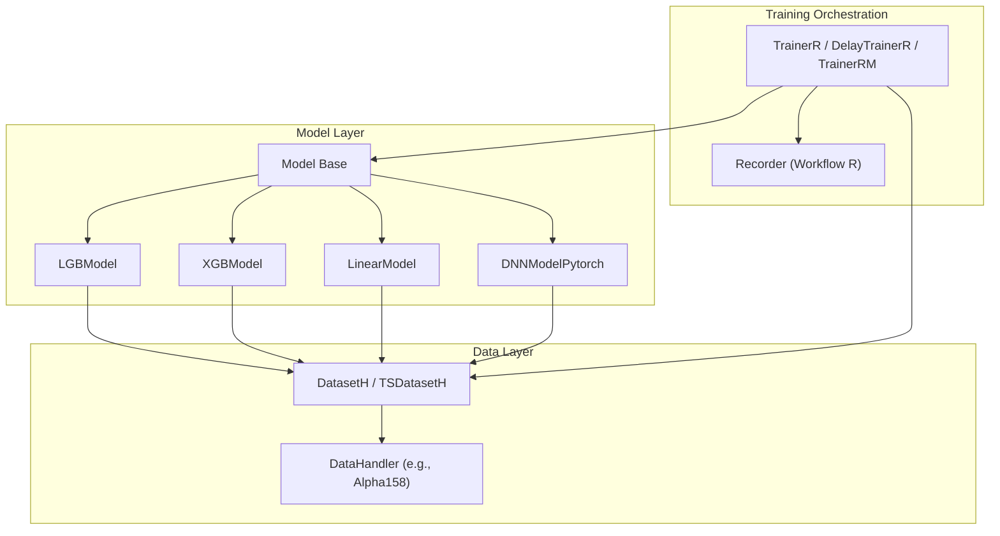
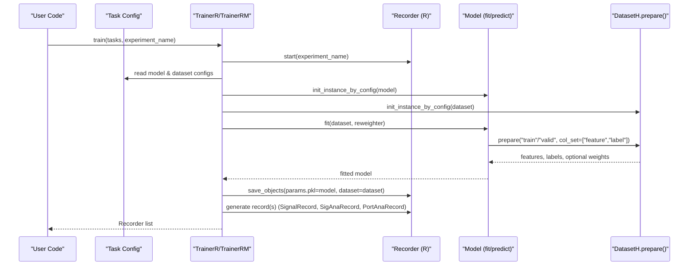
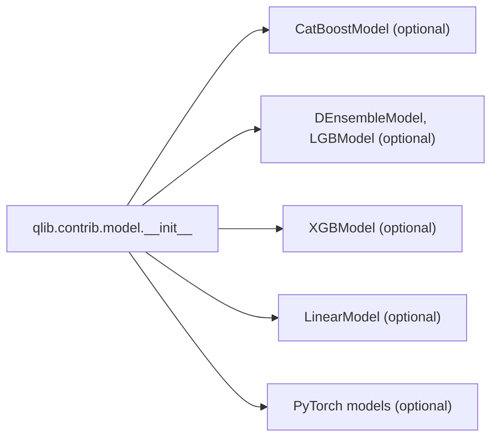

# Model Integration and Training Interface

<cite>
**Referenced Files in This Document**
- [base.py](file://qlib/model/base.py)
- [trainer.py](file://qlib/model/trainer.py)
- [__init__.py (contrib model)](file://qlib/contrib/model/__init__.py)
- [linear.py](file://qlib/contrib/model/linear.py)
- [gbdt.py](file://qlib/contrib/model/gbdt.py)
- [xgboost.py](file://qlib/contrib/model/xgboost.py)
- [pytorch_nn.py](file://qlib/contrib/model/pytorch_nn.py)
- [dataset __init__.py](file://qlib/data/dataset/__init__.py)
- [workflow_by_code.py](file://examples/workflow_by_code.py)
- [workflow_config_lightgbm_Alpha158.yaml](file://examples/benchmarks/LightGBM/workflow_config_lightgbm_Alpha158.yaml)
- [workflow_config_mlp_Alpha158.yaml](file://examples/benchmarks/MLP/workflow_config_mlp_Alpha158.yaml)
</cite>

## Table of Contents
1. Introduction
2. Project Structure
3. Core Components
4. Architecture Overview
5. Detailed Component Analysis
6. Dependency Analysis
7. Performance Considerations
8. Troubleshooting Guide
9. Conclusion
10. Appendices

## Introduction
This document explains how to integrate models with QLib’s training framework. It covers the Model base class interface, required methods for training and prediction, and how different model families (scikit-learn style, tree-based, PyTorch) plug into QLib. It also documents dataset preparation, feature engineering, target handling, custom model implementation, serialization/loading, and deployment considerations.

## Project Structure
QLib provides a consistent abstraction for models and datasets:
- Models inherit from qlib.model.base.Model or its subclasses and implement fit/predict (and optionally finetune).
- Datasets are provided via DatasetH/TSDatasetH and expose prepare() to return features, labels, and optional weights for train/valid/test segments.
- The trainer orchestrates experiment recording, task execution, and saving of models and datasets.

**Diagram sources**
- [base.py:10-111](file://qlib/model/base.py#L10-L111)
- [dataset __init__.py:15-248](file://qlib/data/dataset/__init__.py#L15-L248)
- [trainer.py:131-488](file://qlib/model/trainer.py#L131-L488)

**Section sources**
- [base.py:10-111](file://qlib/model/base.py#L10-L111)
- [dataset __init__.py:15-248](file://qlib/data/dataset/__init__.py#L15-L248)
- [trainer.py:131-488](file://qlib/model/trainer.py#L131-L488)

## Core Components
- Model base classes define the contract:
  - BaseModel: abstract predict() and callable wrapper.
  - Model: adds fit(dataset, reweighter) and predict(dataset, segment).
  - ModelFT: adds finetune(dataset) for incremental training workflows.
- DatasetH/TSDatasetH provide prepare(segments, col_set, data_key) to fetch features, labels, and optional weights for train/valid/test slices.
- TrainerR/DelayTrainerR/TrainerRM orchestrate experiments, run tasks, save models and datasets, and generate records (signals, analysis, backtest).

Key integration points:
- Models call dataset.prepare() to get features and labels; they may also request weights via a Reweighter.
- Trainers initialize model and dataset by config, call model.fit(), then persist model and dataset for later inference.

**Section sources**
- [base.py:10-111](file://qlib/model/base.py#L10-L111)
- [dataset __init__.py:72-248](file://qlib/data/dataset/__init__.py#L72-L248)
- [trainer.py:42-72](file://qlib/model/trainer.py#L42-L72)

## Architecture Overview
The training flow is configuration-driven and recorder-backed:

**Diagram sources**
- [trainer.py:42-72](file://qlib/model/trainer.py#L42-L72)
- [workflow_by_code.py:67-85](file://examples/workflow_by_code.py#L67-L85)
- [workflow_config_lightgbm_Alpha158.yaml:31-72](file://examples/benchmarks/LightGBM/workflow_config_lightgbm_Alpha158.yaml#L31-L72)
- [workflow_config_mlp_Alpha158.yaml:58-99](file://examples/benchmarks/MLP/workflow_config_mlp_Alpha158.yaml#L58-L99)

## Detailed Component Analysis

### Model Base Interface
- BaseModel:
  - Abstract predict(*args, **kwargs) -> object.
  - __call__ delegates to predict for function-like usage.
- Model:
  - fit(dataset, reweighter): learn from dataset; must not use attributes starting with “_” if you want them serialized.
  - predict(dataset, segment="test"): return predictions aligned to dataset index.
- ModelFT:
  - finetune(dataset): continue training from an existing model state.

Practical implications:
- Implementers should ensure fit returns self or None consistently and that predict expects a DatasetH/TSDatasetH instance.
- For scikit-learn-like models, wrap your estimator inside Model and map dataset.prepare outputs to your estimator’s API.

**Section sources**
- [base.py:10-111](file://qlib/model/base.py#L10-L111)

### Tree-Based Models (LightGBM, XGBoost, Linear)
- LGBModel (ModelFT):
  - Uses dataset.prepare(["train","valid"], col_set=["feature","label"]).
  - Supports reweighter via Reweighter.reweight().
  - Logs evaluation metrics per step via workflow recorder.
  - Implements finetune by continuing training from an existing model.
- XGBModel (Model):
  - Similar data preparation and reweighting support.
  - Provides feature importance utility.
- LinearModel (Model):
  - Supports OLS, NNLS, Ridge, Lasso estimators.
  - Optionally includes validation data in training.
  - Returns predictions as pandas Series aligned to dataset index.

Common patterns:
- Extract features and labels via dataset.prepare with col_set=["feature","label"].
- Use data_key=DataHandlerLP.DK_L for training and DK_I for inference when needed.
- Handle multi-label constraints (some libraries require 1D labels).

**Section sources**
- [gbdt.py:16-127](file://qlib/contrib/model/gbdt.py#L16-L127)
- [xgboost.py:15-86](file://qlib/contrib/model/xgboost.py#L15-L86)
- [linear.py:17-114](file://qlib/contrib/model/linear.py#L17-L114)

### Deep Learning Model (PyTorch)
- DNNModelPytorch (Model):
  - Configurable network via pt_model_uri and pt_model_kwargs.
  - Training loop with batched sampling, early stopping, learning rate scheduling, and validation metrics.
  - Uses dataset.prepare to build tensors for train/valid; supports reweighter.
  - Predicts in batches and returns a pandas Series aligned to dataset index.
  - Serialization: save/load state_dict with helper utilities.

Performance notes:
- Moves data to device during training; uses batching to control memory.
- Supports DataParallel for multi-GPU.
- Records metrics and best step via workflow recorder.

**Section sources**
- [pytorch_nn.py:39-404](file://qlib/contrib/model/pytorch_nn.py#L39-L404)

### Dataset Preparation and Feature Engineering
- DatasetH:
  - Wraps a DataHandler and time segments (train/valid/test).
  - prepare(segments, col_set, data_key) returns DataFrame(s) or lists based on segments.
  - col_set can be "feature", "label", or combined; data_key selects training vs inference data keys.
- TSDatasetH:
  - Converts tabular data to time-series samples via TSDataSampler.
  - Extends slices to include historical context for sequence models.

Feature engineering:
- Configure DataHandler processors (infer_processors, learn_processors) in YAML to handle missing values, normalization, and column selection.
- Example configurations show dropping columns, filling NaNs, and scaling labels.

Target variable handling:
- Labels are fetched via col_set="label". Some models require 1D labels; implementations squeeze or validate shapes accordingly.

**Section sources**
- [dataset __init__.py:72-248](file://qlib/data/dataset/__init__.py#L72-L248)
- [dataset __init__.py:642-719](file://qlib/data/dataset/__init__.py#L642-L719)
- [workflow_config_mlp_Alpha158.yaml:6-38](file://examples/benchmarks/MLP/workflow_config_mlp_Alpha158.yaml#L6-L38)

### Workflow Configuration and Execution
- Task configuration defines model, dataset, and record generators.
- TrainerR/TrainerRM execute tasks, log parameters, save model and dataset, and generate signals and analyses.
- Examples demonstrate LightGBM and MLP configurations with Alpha158 handler and standard segments.

Execution modes:
- In-process training via TrainerR.
- Distributed/multiprocessing via TrainerRM with TaskManager.
- Delayed training via DelayTrainer variants to separate setup and fitting phases.

**Section sources**
- [trainer.py:131-488](file://qlib/model/trainer.py#L131-L488)
- [workflow_config_lightgbm_Alpha158.yaml:31-72](file://examples/benchmarks/LightGBM/workflow_config_lightgbm_Alpha158.yaml#L31-L72)
- [workflow_config_mlp_Alpha158.yaml:58-99](file://examples/benchmarks/MLP/workflow_config_mlp_Alpha158.yaml#L58-L99)

### Custom Model Implementation Guide
Steps to integrate a new model:
1. Subclass Model (or ModelFT if you need finetune).
2. Implement fit(dataset, reweighter=None):
   - Use dataset.prepare to extract features and labels for train/valid.
   - Optionally compute sample weights using reweighter.reweight(df).
   - Train your underlying estimator and store learned attributes without leading underscores.
3. Implement predict(dataset, segment="test"):
   - Use dataset.prepare(segment, col_set="feature") to get inference features.
   - Return predictions as a pandas Series aligned to dataset index.
4. (Optional) Implement finetune(dataset, ...) if supporting incremental training.
5. Register or reference your model in task configuration under task.model.

Data format expectations:
- Features: typically a DataFrame with datetime x instrument index.
- Labels: scalar or single-column series; some libraries require 1D arrays.
- Weights: optional per-sample weights from Reweighter.

Serialization:
- Ensure all persistent attributes do not start with “_”.
- For deep learning models, save model state_dict and restore it in load().

**Section sources**
- [base.py:22-111](file://qlib/model/base.py#L22-L111)
- [linear.py:58-114](file://qlib/contrib/model/linear.py#L58-L114)
- [pytorch_nn.py:389-404](file://qlib/contrib/model/pytorch_nn.py#L389-L404)

### Handling Different Data Formats
- Tabular features: DatasetH.prepare returns DataFrames suitable for scikit-learn/tree models.
- Time-series sequences: TSDatasetH prepares TSDataSampler for sequence models; extend slices to include history.
- Multi-label constraints: Some models (e.g., LightGBM, XGBoost) require 1D labels; implementations squeeze or raise errors otherwise.

**Section sources**
- [dataset __init__.py:185-248](file://qlib/data/dataset/__init__.py#L185-L248)
- [gbdt.py:28-55](file://qlib/contrib/model/gbdt.py#L28-L55)
- [xgboost.py:23-67](file://qlib/contrib/model/xgboost.py#L23-L67)

### Optimizing Training Performance
- Batch size and steps: Tune batch_size and max_steps for neural networks to balance speed and memory.
- Early stopping: Use validation loss to stop training early; save best checkpoint.
- Learning rate scheduling: Apply ReduceLROnPlateau or custom schedulers.
- Parallelism: Use TrainerRM with TaskManager for multiprocessing across tasks; enable DataParallel for multi-GPU.
- Memory management: Free intermediate DataFrames after tensor conversion; avoid unnecessary copies.

**Section sources**
- [pytorch_nn.py:190-337](file://qlib/contrib/model/pytorch_nn.py#L190-L337)
- [trainer.py:341-488](file://qlib/model/trainer.py#L341-L488)

### Model Serialization, Loading, and Deployment
- Scikit-learn/tree models: Save entire model objects; ensure no underscore-prefixed attributes.
- PyTorch models: Save/load state_dict; reconstruct model architecture at load time; map device appropriately.
- QLib workflow: Trainers automatically save params.pkl and dataset; recorders can be used to retrieve artifacts.

Deployment considerations:
- Pin dependencies and versions for reproducibility.
- For online inference, reuse saved dataset configuration and model artifacts; ensure data pipeline matches training preprocessing.
- Validate input index alignment and feature ordering before prediction.

**Section sources**
- [base.py:25-33](file://qlib/model/base.py#L25-L33)
- [pytorch_nn.py:389-404](file://qlib/contrib/model/pytorch_nn.py#L389-L404)
- [trainer.py:42-72](file://qlib/model/trainer.py#L42-L72)

## Dependency Analysis
Model-family availability is managed via conditional imports:
- Optional packages (CatBoost, LightGBM, XGBoost, sklearn, PyTorch) are imported with fallbacks; missing modules are gracefully skipped with messages.
- All available model classes are aggregated for discovery.

**Diagram sources**
- [__init__.py (contrib model):1-44](file://qlib/contrib/model/__init__.py#L1-L44)

**Section sources**
- [__init__.py (contrib model):1-44](file://qlib/contrib/model/__init__.py#L1-L44)

## Performance Considerations
- Prefer vectorized operations and avoid Python loops over large datasets.
- Use appropriate batch sizes and device placement for deep learning models.
- Leverage early stopping and validation to reduce overfitting and wasted compute.
- Utilize TrainerRM for parallel task execution across multiple models or hyperparameter settings.
- Minimize memory footprint by deleting intermediate DataFrames and using free_raw_data where supported.

[No sources needed since this section provides general guidance]

## Troubleshooting Guide
Common issues and resolutions:
- Empty data from dataset:
  - Ensure segments and handlers are correctly configured; verify time ranges and instruments.
  - Check that label columns exist and are not entirely dropped by preprocessing.
- Unsupported reweighter type:
  - Pass a valid Reweighter instance; check types and ensure compatibility.
- Multi-label not supported:
  - Some tree models require 1D labels; reshape or adjust targets accordingly.
- Model not fitted:
  - Call fit before predict; ensure attributes are set and not prefixed with “_”.
- Device mismatch (PyTorch):
  - Ensure model and inputs are on the same device; map device during load.

**Section sources**
- [gbdt.py:28-55](file://qlib/contrib/model/gbdt.py#L28-L55)
- [xgboost.py:23-67](file://qlib/contrib/model/xgboost.py#L23-L67)
- [linear.py:58-83](file://qlib/contrib/model/linear.py#L58-L83)
- [pytorch_nn.py:382-404](file://qlib/contrib/model/pytorch_nn.py#L382-L404)

## Conclusion
QLib’s model integration centers on a clean Model interface and a robust DatasetH/TSDatasetH abstraction, enabling seamless training and inference across scikit-learn-style, tree-based, and deep learning models. The trainer orchestrates experiments, persists artifacts, and generates comprehensive records. By following the documented patterns—preparing data via dataset.prepare, implementing fit/predict consistently, and leveraging configuration-driven workflows—you can integrate custom models efficiently and deploy them reliably.

[No sources needed since this section summarizes without analyzing specific files]

## Appendices

### Example Workflows
- End-to-end script demonstrating initialization, model instantiation, training, signal generation, and analysis.
- YAML configurations for LightGBM and MLP showing handler settings, segments, and record templates.

**Section sources**
- [workflow_by_code.py:19-86](file://examples/workflow_by_code.py#L19-L86)
- [workflow_config_lightgbm_Alpha158.yaml:1-72](file://examples/benchmarks/LightGBM/workflow_config_lightgbm_Alpha158.yaml#L1-L72)
- [workflow_config_mlp_Alpha158.yaml:1-99](file://examples/benchmarks/MLP/workflow_config_mlp_Alpha158.yaml#L1-L99)