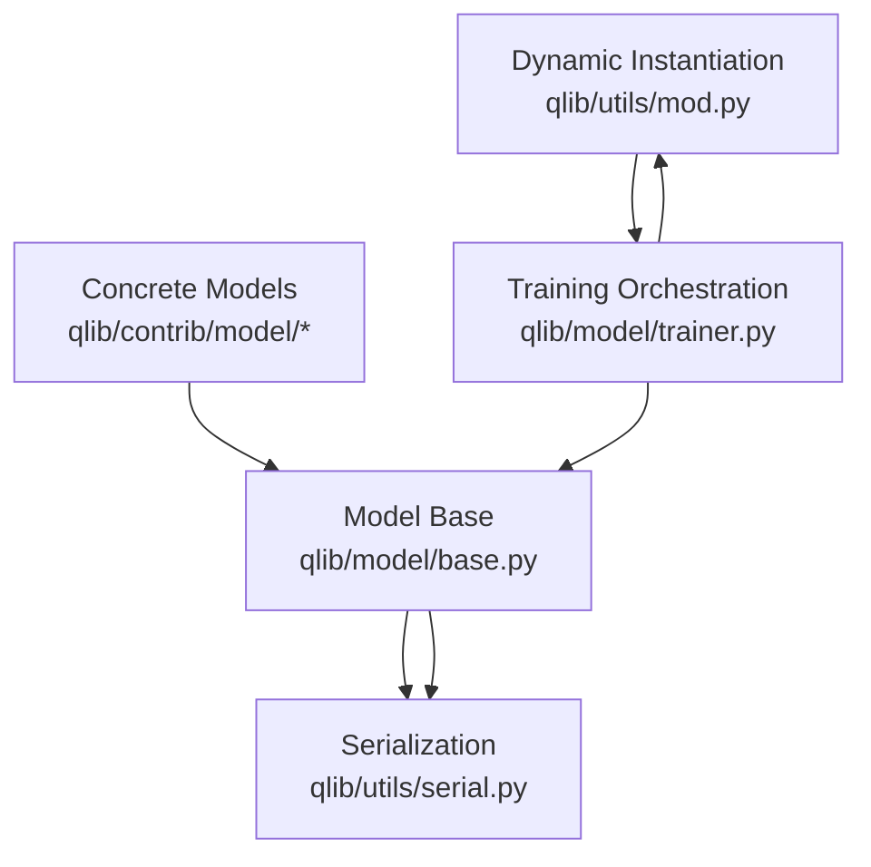
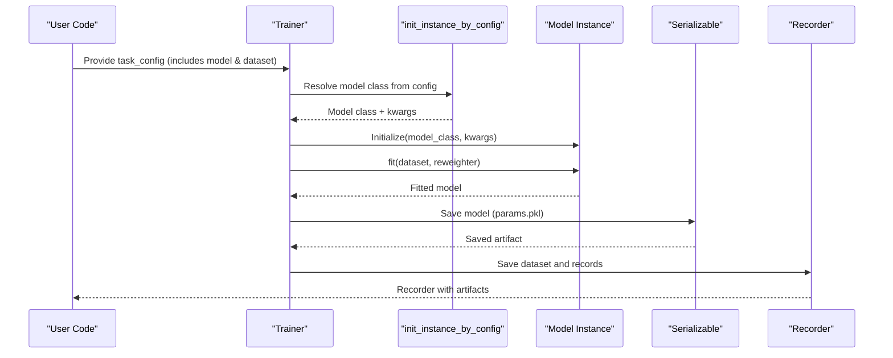
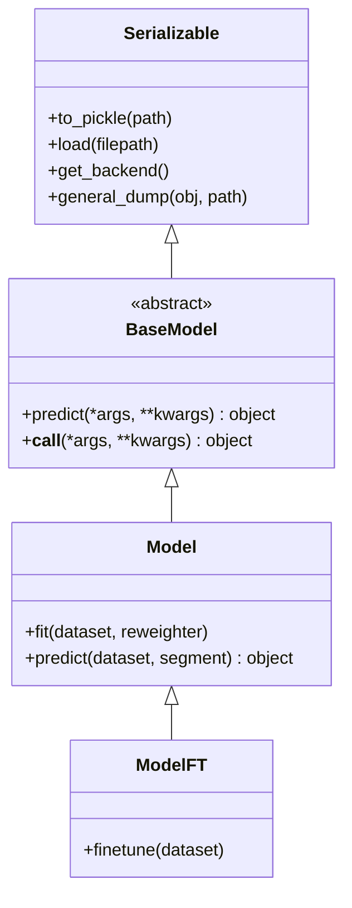
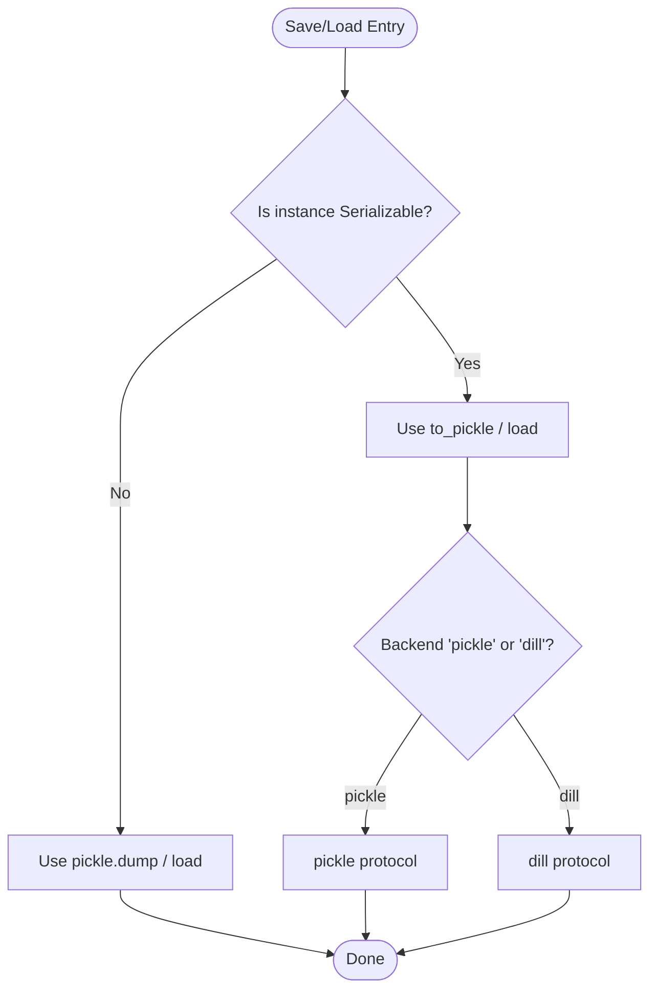
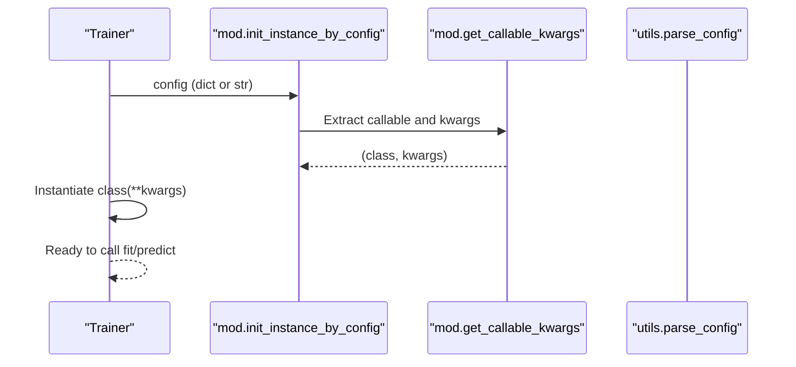
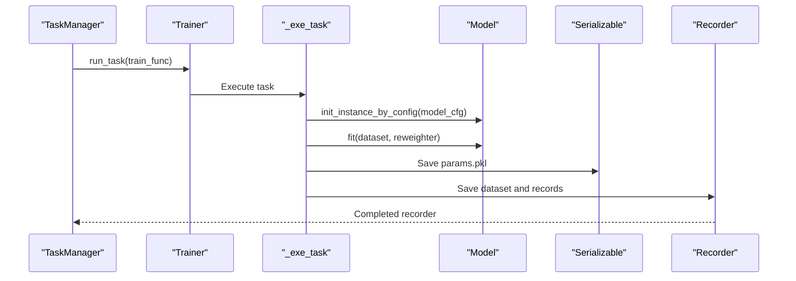
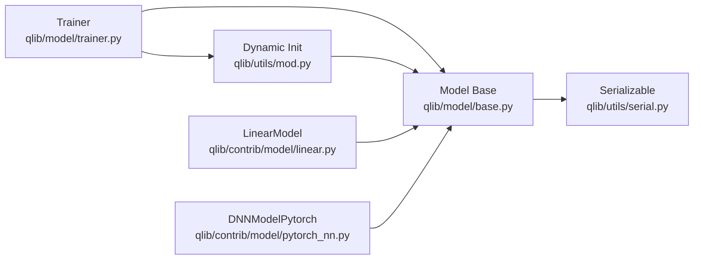

# Model Registration and Loading System

<cite>
**Referenced Files in This Document**
- [qlib/model/base.py](file://qlib/model/base.py)
- [qlib/utils/serial.py](file://qlib/utils/serial.py)
- [qlib/utils/mod.py](file://qlib/utils/mod.py)
- [qlib/utils/__init__.py](file://qlib/utils/__init__.py)
- [qlib/model/trainer.py](file://qlib/model/trainer.py)
- [qlib/contrib/model/linear.py](file://qlib/contrib/model/linear.py)
- [qlib/contrib/model/pytorch_nn.py](file://qlib/contrib/model/pytorch_nn.py)
</cite>

## Table of Contents
1. Introduction
2. Project Structure
3. Core Components
4. Architecture Overview
5. Detailed Component Analysis
6. Dependency Analysis
7. Performance Considerations
8. Troubleshooting Guide
9. Conclusion

## Introduction
This document explains QLib’s model registration and loading system with a focus on how models are defined, discovered, instantiated from configuration, trained, serialized, and loaded for inference. It covers:
- The base model interface and serialization support
- Dynamic instantiation via configuration-driven module loading
- Training orchestration that loads models from task configurations
- Saving and loading trained models to disk
- How to register custom models and integrate third-party ML libraries

## Project Structure
QLib separates the model abstraction, serialization utilities, dynamic instantiation helpers, training orchestration, and concrete model implementations across several modules:
- Model abstraction and base classes live under qlib/model
- Serialization utilities live under qlib/utils/serial.py
- Dynamic instantiation and module resolution live under qlib/utils/mod.py and qlib/utils/__init__.py
- Training orchestration lives under qlib/model/trainer.py
- Concrete models (e.g., linear, PyTorch DNN) live under qlib/contrib/model

**Diagram sources**
- [qlib/model/base.py:10-111](file://qlib/model/base.py#L10-L111)
- [qlib/utils/serial.py:11-190](file://qlib/utils/serial.py#L11-L190)
- [qlib/utils/mod.py:49-162](file://qlib/utils/mod.py#L49-L162)
- [qlib/model/trainer.py:42-71](file://qlib/model/trainer.py#L42-L71)
- [qlib/contrib/model/linear.py:17-114](file://qlib/contrib/model/linear.py#L17-L114)
- [qlib/contrib/model/pytorch_nn.py:39-404](file://qlib/contrib/model/pytorch_nn.py#L39-L404)

**Section sources**
- [qlib/model/base.py:10-111](file://qlib/model/base.py#L10-L111)
- [qlib/utils/serial.py:11-190](file://qlib/utils/serial.py#L11-L190)
- [qlib/utils/mod.py:49-162](file://qlib/utils/mod.py#L49-L162)
- [qlib/model/trainer.py:42-71](file://qlib/model/trainer.py#L42-L71)
- [qlib/contrib/model/linear.py:17-114](file://qlib/contrib/model/linear.py#L17-L114)
- [qlib/contrib/model/pytorch_nn.py:39-404](file://qlib/contrib/model/pytorch_nn.py#L39-L404)

## Core Components
- BaseModel and Model define the contract for prediction and fitting, and provide a callable interface. They also expose finetuning capability in ModelFT.
- Serializable provides robust pickling/dill-based saving/loading with attribute inclusion/exclusion rules and configurable backends.
- Dynamic instantiation utilities resolve class/function references from strings or dicts, supporting default modules and fallbacks.
- Trainer orchestrates task execution: it instantiates models and datasets from config, fits models, saves artifacts, and generates records.

Key responsibilities:
- Model interface: fit, predict, finetune (optional)
- Serialization: save/load with controlled attribute persistence
- Configuration-driven loading: resolve module paths and instantiate objects
- Training workflow: initialize, fit, save, and record metrics

**Section sources**
- [qlib/model/base.py:10-111](file://qlib/model/base.py#L10-L111)
- [qlib/utils/serial.py:11-190](file://qlib/utils/serial.py#L11-L190)
- [qlib/utils/mod.py:49-162](file://qlib/utils/mod.py#L49-L162)
- [qlib/model/trainer.py:42-71](file://qlib/model/trainer.py#L42-L71)

## Architecture Overview
The system uses a configuration-driven plugin architecture:
- Task configurations specify model and dataset definitions as either fully qualified class names or dictionaries with class/module_path and kwargs.
- During training, the trainer resolves these definitions dynamically and instantiates them.
- Models implement a consistent interface (fit/predict), enabling interchangeable use.
- Trained models are saved using Serializable or model-specific save methods; they can be reloaded later for inference.

**Diagram sources**
- [qlib/model/trainer.py:42-71](file://qlib/model/trainer.py#L42-L71)
- [qlib/utils/mod.py:122-162](file://qlib/utils/mod.py#L122-L162)
- [qlib/utils/serial.py:115-154](file://qlib/utils/serial.py#L115-L154)

## Detailed Component Analysis

### Model Abstraction and Finetuning
- BaseModel defines an abstract predict method and a callable wrapper.
- Model extends BaseModel with fit and predict contracts tailored to QLib’s Dataset and Reweighter.
- ModelFT adds a finetune method for workflows that first train an initial model and then continue training.

**Diagram sources**
- [qlib/model/base.py:10-111](file://qlib/model/base.py#L10-L111)
- [qlib/utils/serial.py:11-190](file://qlib/utils/serial.py#L11-L190)

**Section sources**
- [qlib/model/base.py:10-111](file://qlib/model/base.py#L10-L111)

### Serialization and Deserialization
- Serializable controls which attributes are persisted based on include/exclude lists and naming conventions.
- Supports both pickle and dill backends via a configurable backend selector.
- Provides to_pickle for instance saving and load for type-safe restoration.
- general_dump handles both Serializable instances and arbitrary objects.

**Diagram sources**
- [qlib/utils/serial.py:11-190](file://qlib/utils/serial.py#L11-L190)

**Section sources**
- [qlib/utils/serial.py:11-190](file://qlib/utils/serial.py#L11-L190)

### Dynamic Model Loading from Configuration
- init_instance_by_config supports multiple input forms:
  - String specifying a fully qualified class name
  - Dict with class/module_path and kwargs
  - Direct class/type reference
- get_callable_kwargs extracts the callable and kwargs from config, resolving module paths and defaults.
- split_module_path parses dotted paths into module and class components.

**Diagram sources**
- [qlib/utils/mod.py:49-162](file://qlib/utils/mod.py#L49-L162)
- [qlib/utils/__init__.py:242-255](file://qlib/utils/__init__.py#L242-L255)

**Section sources**
- [qlib/utils/mod.py:49-162](file://qlib/utils/mod.py#L49-L162)
- [qlib/utils/__init__.py:242-255](file://qlib/utils/__init__.py#L242-L255)

### Training Orchestration and Model Artifacts
- _exe_task initializes model and dataset from task_config, calls fit, and saves model parameters and dataset for later use.
- TrainerR and DelayTrainer variants manage recorder lifecycle and optional delayed execution.
- Records generation is driven by task_config entries resolved via init_instance_by_config.

**Diagram sources**
- [qlib/model/trainer.py:42-71](file://qlib/model/trainer.py#L42-L71)
- [qlib/model/trainer.py:209-290](file://qlib/model/trainer.py#L209-L290)
- [qlib/utils/serial.py:115-154](file://qlib/utils/serial.py#L115-L154)

**Section sources**
- [qlib/model/trainer.py:42-71](file://qlib/model/trainer.py#L42-L71)
- [qlib/model/trainer.py:209-290](file://qlib/model/trainer.py#L209-L290)

### Concrete Model Examples

#### Linear Model
- Implements fit and predict using scikit-learn estimators or non-negative least squares.
- Integrates with QLib Dataset and Reweighter to prepare features, labels, and weights.

**Section sources**
- [qlib/contrib/model/linear.py:17-114](file://qlib/contrib/model/linear.py#L17-L114)

#### PyTorch DNN Model
- Wraps a PyTorch network with training loop, validation, early stopping, and learning rate scheduling.
- Uses init_instance_by_config to construct the underlying network from configuration.
- Saves model state dict during training and provides save/load methods compatible with QLib’s workflow.

**Section sources**
- [qlib/contrib/model/pytorch_nn.py:39-404](file://qlib/contrib/model/pytorch_nn.py#L39-L404)

## Dependency Analysis
- Model base classes depend on Serializable for persistence and Dataset/Reweighter for data access.
- Trainer depends on dynamic instantiation utilities to resolve model and dataset classes from configuration.
- Concrete models depend on external libraries (scikit-learn, PyTorch) but conform to the Model interface.

**Diagram sources**
- [qlib/model/base.py:10-111](file://qlib/model/base.py#L10-L111)
- [qlib/utils/serial.py:11-190](file://qlib/utils/serial.py#L11-L190)
- [qlib/model/trainer.py:42-71](file://qlib/model/trainer.py#L42-L71)
- [qlib/utils/mod.py:49-162](file://qlib/utils/mod.py#L49-L162)
- [qlib/contrib/model/linear.py:17-114](file://qlib/contrib/model/linear.py#L17-L114)
- [qlib/contrib/model/pytorch_nn.py:39-404](file://qlib/contrib/model/pytorch_nn.py#L39-L404)

**Section sources**
- [qlib/model/base.py:10-111](file://qlib/model/base.py#L10-L111)
- [qlib/utils/serial.py:11-190](file://qlib/utils/serial.py#L11-L190)
- [qlib/model/trainer.py:42-71](file://qlib/model/trainer.py#L42-L71)
- [qlib/utils/mod.py:49-162](file://qlib/utils/mod.py#L49-L162)
- [qlib/contrib/model/linear.py:17-114](file://qlib/contrib/model/linear.py#L17-L114)
- [qlib/contrib/model/pytorch_nn.py:39-404](file://qlib/contrib/model/pytorch_nn.py#L39-L404)

## Performance Considerations
- Use Serializable’s include/exclude lists to avoid persisting large transient attributes.
- For deep learning models, prefer saving only state dicts and reconstructing networks at load time to reduce artifact size.
- Leverage DelayTrainer variants to separate lightweight preparation from heavy training phases.
- When using GPU-backed models, ensure device placement and memory management are handled in load routines.

[No sources needed since this section provides general guidance]

## Troubleshooting Guide
Common issues and resolutions:
- Unknown pickle backend: Ensure Serializable.pickle_backend is set to "pickle" or "dill".
- Type mismatch when loading: Verify that the loaded object matches the expected class type.
- Module not found during instantiation: Confirm that module_path and class names are correct and importable.
- Empty dataset errors: Validate dataset configuration segments and column sets before training.

**Section sources**
- [qlib/utils/serial.py:156-170](file://qlib/utils/serial.py#L156-L170)
- [qlib/utils/serial.py:135-154](file://qlib/utils/serial.py#L135-L154)
- [qlib/utils/mod.py:91-116](file://qlib/utils/mod.py#L91-L116)
- [qlib/contrib/model/linear.py:58-83](file://qlib/contrib/model/linear.py#L58-L83)

## Conclusion
QLib’s model system centers on a clean interface (Model), robust serialization (Serializable), and flexible configuration-driven instantiation (init_instance_by_config). The training pipeline integrates these pieces to automate model discovery, fitting, and artifact management. By following the patterns shown in the linear and PyTorch examples, you can register custom models and integrate third-party libraries seamlessly while leveraging QLib’s orchestration and recording capabilities.

[No sources needed since this section summarizes without analyzing specific files]