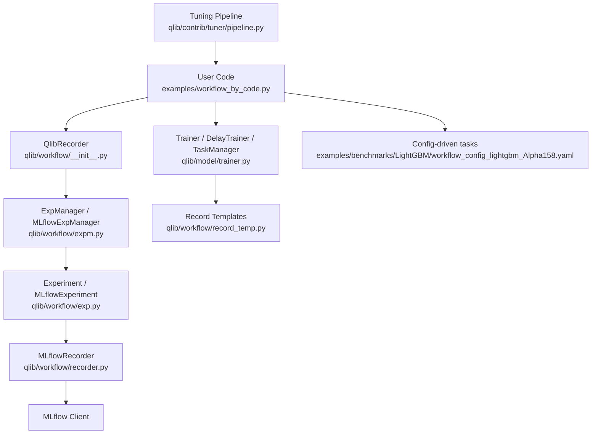
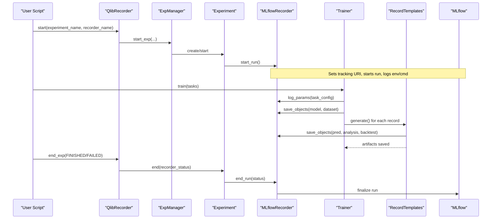
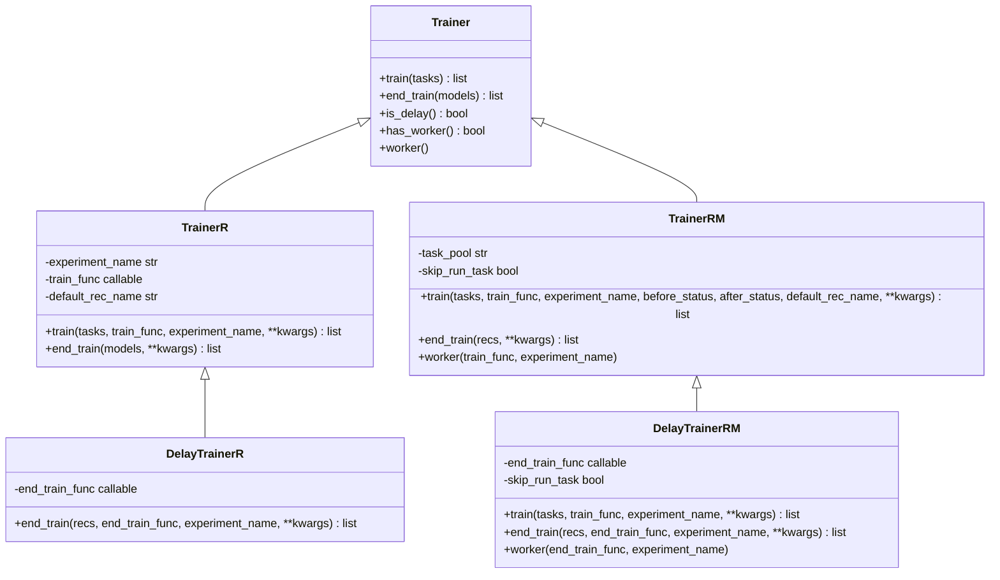
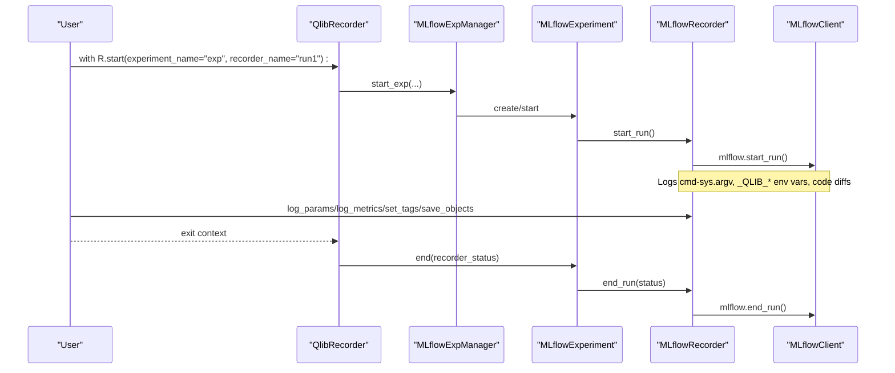
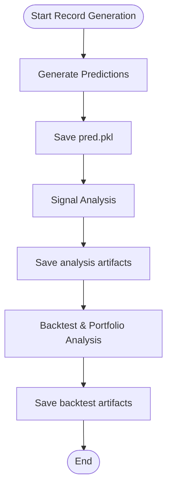
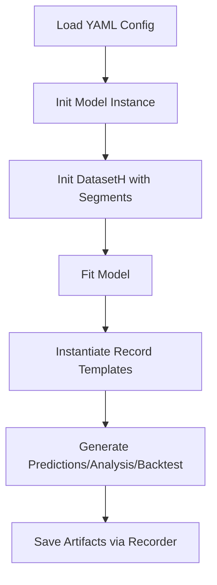
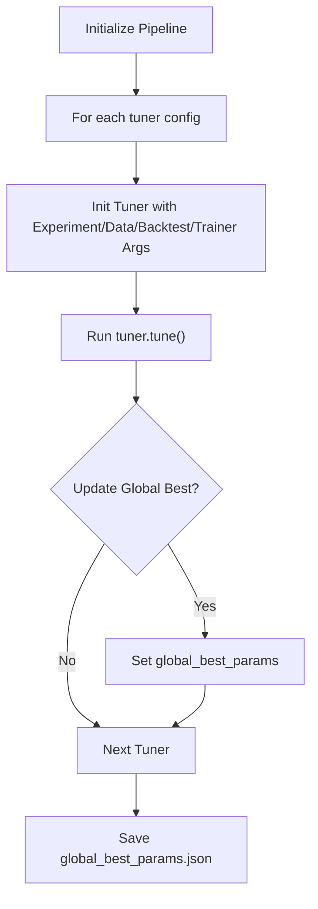
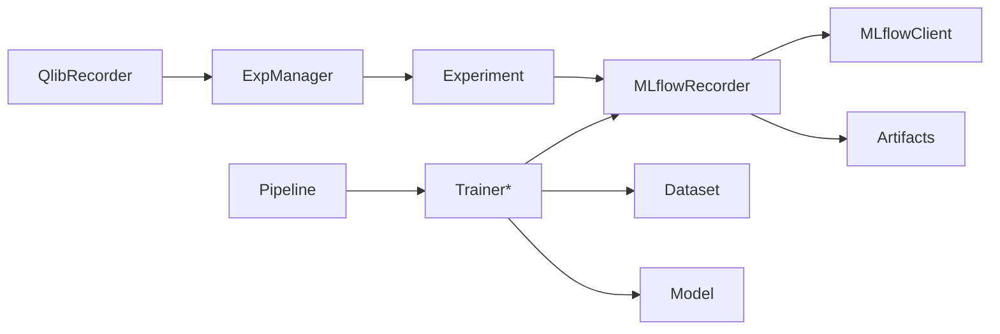

# Training Workflow and Pipeline Integration

<cite>
**Referenced Files in This Document**
- [trainer.py](file://qlib/model/trainer.py)
- [expm.py](file://qlib/workflow/expm.py)
- [recorder.py](file://qlib/workflow/recorder.py)
- [exp.py](file://qlib/workflow/exp.py)
- [__init__.py](file://qlib/workflow/__init__.py)
- [record_temp.py](file://qlib/workflow/record_temp.py)
- [workflow_by_code.py](file://examples/workflow_by_code.py)
- [workflow_config_lightgbm_Alpha158.yaml](file://examples/benchmarks/LightGBM/workflow_config_lightgbm_Alpha158.yaml)
- [pipeline.py](file://qlib/contrib/tuner/pipeline.py)
</cite>

## Table of Contents
1. [Introduction](#introduction)
2. [Project Structure](#project-structure)
3. [Core Components](#core-components)
4. [Architecture Overview](#architecture-overview)
5. [Detailed Component Analysis](#detailed-component-analysis)
6. [Dependency Analysis](#dependency-analysis)
7. [Performance Considerations](#performance-considerations)
8. [Troubleshooting Guide](#troubleshooting-guide)
9. [Conclusion](#conclusion)
10. [Appendices](#appendices)

## Introduction
This document explains QLib’s training workflow and pipeline integration with a focus on how models integrate with the experiment management system, automatic logging, hyperparameter tracking, result recording, and the trainer component that orchestrates training, cross-validation via task pools, and evaluation. It also covers MLflow-based experiment tracking, model versioning through artifacts, and performance monitoring. Practical examples show how to set up training pipelines using configuration files or code, and how to customize the workflow.

## Project Structure
QLib organizes training and experiment management across several modules:
- Experiment management and MLflow integration: expm.py, exp.py, recorder.py
- Global API for experiments and recorders: __init__.py (QlibRecorder)
- Trainer orchestration and task execution: trainer.py
- Result generation templates (predictions, signal analysis, backtest): record_temp.py
- Example workflows by config and by code: workflow_config_lightgbm_Alpha158.yaml, workflow_by_code.py
- Hyperparameter tuning pipeline: pipeline.py



**Diagram sources**
- [__init__.py:37-95](file://qlib/workflow/__init__.py#L37-L95)
- [expm.py:317-434](file://qlib/workflow/expm.py#L317-L434)
- [exp.py:243-380](file://qlib/workflow/exp.py#L243-L380)
- [recorder.py:247-494](file://qlib/workflow/recorder.py#L247-L494)
- [trainer.py:131-620](file://qlib/model/trainer.py#L131-L620)
- [record_temp.py:28-200](file://qlib/workflow/record_temp.py#L28-L200)
- [workflow_by_code.py:1-86](file://examples/workflow_by_code.py#L1-L86)
- [workflow_config_lightgbm_Alpha158.yaml:1-72](file://examples/benchmarks/LightGBM/workflow_config_lightgbm_Alpha158.yaml#L1-L72)
- [pipeline.py:17-86](file://qlib/contrib/tuner/pipeline.py#L17-L86)

**Section sources**
- [__init__.py:37-95](file://qlib/workflow/__init__.py#L37-L95)
- [expm.py:317-434](file://qlib/workflow/expm.py#L317-L434)
- [exp.py:243-380](file://qlib/workflow/exp.py#L243-L380)
- [recorder.py:247-494](file://qlib/workflow/recorder.py#L247-L494)
- [trainer.py:131-620](file://qlib/model/trainer.py#L131-L620)
- [record_temp.py:28-200](file://qlib/workflow/record_temp.py#L28-L200)
- [workflow_by_code.py:1-86](file://examples/workflow_by_code.py#L1-L86)
- [workflow_config_lightgbm_Alpha158.yaml:1-72](file://examples/benchmarks/LightGBM/workflow_config_lightgbm_Alpha158.yaml#L1-L72)
- [pipeline.py:17-86](file://qlib/contrib/tuner/pipeline.py#L17-L86)

## Core Components
- QlibRecorder (R): Global context manager to start/end experiments, log parameters/metrics/tags, save/load objects, and manage artifact URIs.
- ExpManager and MLflowExpManager: Manage experiments and their lifecycle; bridge to MLflow.
- Experiment and MLflowExperiment: Represent an experiment and its active recorder; handle creation, listing, and deletion.
- Recorder and MLflowRecorder: Log metrics, params, tags, artifacts; wrap MLflow runs; support async logging and uncommitted code capture.
- Trainer family: Trainer, TrainerR, DelayTrainerR, TrainerRM, DelayTrainerRM: Orchestrate training tasks, optionally via TaskManager for distributed execution; support delayed training phases.
- Record templates: SignalRecord, SigAnaRecord, PortAnaRecord: Generate predictions, signal analysis, and portfolio/backtest results as artifacts.
- Tuning pipeline: Orchestrates multiple tuners and tracks global best parameters.

**Section sources**
- [__init__.py:26-682](file://qlib/workflow/__init__.py#L26-L682)
- [expm.py:22-434](file://qlib/workflow/expm.py#L22-L434)
- [exp.py:15-380](file://qlib/workflow/exp.py#L15-L380)
- [recorder.py:28-494](file://qlib/workflow/recorder.py#L28-L494)
- [trainer.py:131-620](file://qlib/model/trainer.py#L131-L620)
- [record_temp.py:28-200](file://qlib/workflow/record_temp.py#L28-L200)
- [pipeline.py:17-86](file://qlib/contrib/tuner/pipeline.py#L17-L86)

## Architecture Overview
The training workflow integrates models with QLib’s experiment management and MLflow backend. Users define tasks (model + dataset + records) either via YAML or code. The trainer executes tasks, logs parameters and artifacts, and generates evaluation outputs. MLflow provides persistent storage for experiments, runs, metrics, parameters, and artifacts.



**Diagram sources**
- [__init__.py:37-95](file://qlib/workflow/__init__.py#L37-L95)
- [expm.py:317-434](file://qlib/workflow/expm.py#L317-L434)
- [exp.py:243-380](file://qlib/workflow/exp.py#L243-L380)
- [recorder.py:247-494](file://qlib/workflow/recorder.py#L247-L494)
- [trainer.py:36-128](file://qlib/model/trainer.py#L36-L128)
- [record_temp.py:161-200](file://qlib/workflow/record_temp.py#L161-L200)

## Detailed Component Analysis

### Trainer Orchestration and Task Execution
- Trainer base class defines train/end_train lifecycle and optional worker support.
- TrainerR trains tasks linearly, tagging recorders with status markers.
- DelayTrainerR splits preparation and fitting into two phases for parallel/delayed execution.
- TrainerRM uses TaskManager to queue tasks and supports multiprocessing workers; can skip immediate execution to run later on GPU nodes.
- DelayTrainerRM coordinates partial completion states and finalization via workers.



**Diagram sources**
- [trainer.py:131-620](file://qlib/model/trainer.py#L131-L620)

**Section sources**
- [trainer.py:131-620](file://qlib/model/trainer.py#L131-L620)

### Experiment Management and MLflow Integration
- QlibRecorder provides a user-friendly context manager to start/end experiments and automatically handles status transitions.
- ExpManager abstracts experiment lifecycle; MLflowExpManager implements it using MLflow client APIs.
- Experiment/MLflowExperiment manages active recorder and lists/searches runs.
- MLflowRecorder wraps MLflow runs, logs parameters/metrics/tags/artifacts, captures uncommitted code diffs, and supports async logging.



**Diagram sources**
- [__init__.py:37-95](file://qlib/workflow/__init__.py#L37-L95)
- [expm.py:317-434](file://qlib/workflow/expm.py#L317-L434)
- [exp.py:243-380](file://qlib/workflow/exp.py#L243-L380)
- [recorder.py:247-494](file://qlib/workflow/recorder.py#L247-L494)

**Section sources**
- [__init__.py:37-95](file://qlib/workflow/__init__.py#L37-L95)
- [expm.py:317-434](file://qlib/workflow/expm.py#L317-L434)
- [exp.py:243-380](file://qlib/workflow/exp.py#L243-L380)
- [recorder.py:247-494](file://qlib/workflow/recorder.py#L247-L494)

### Result Recording and Evaluation
- RecordTemp base class standardizes saving/loading artifacts under artifact paths.
- SignalRecord generates predictions and saves them as artifacts.
- SigAnaRecord and PortAnaRecord perform signal analysis and backtest/portfolio analysis respectively, saving results as artifacts.



**Diagram sources**
- [record_temp.py:28-200](file://qlib/workflow/record_temp.py#L28-L200)

**Section sources**
- [record_temp.py:28-200](file://qlib/workflow/record_temp.py#L28-L200)

### Configuration-Driven Training Pipelines
- YAML-based tasks define model, dataset segments, and record templates.
- The trainer reads these configurations, initializes instances, and executes training and recording steps.



**Diagram sources**
- [workflow_config_lightgbm_Alpha158.yaml:31-72](file://examples/benchmarks/LightGBM/workflow_config_lightgbm_Alpha158.yaml#L31-L72)
- [trainer.py:42-72](file://qlib/model/trainer.py#L42-L72)

**Section sources**
- [workflow_config_lightgbm_Alpha158.yaml:31-72](file://examples/benchmarks/LightGBM/workflow_config_lightgbm_Alpha158.yaml#L31-L72)
- [trainer.py:42-72](file://qlib/model/trainer.py#L42-L72)

### Programmatic Training Pipelines
- Example script demonstrates initializing data, building model/dataset, starting an experiment, logging parameters, fitting, and generating records.

```mermaid
sequenceDiagram
participant S as "Script"
participant R as "QlibRecorder"
participant M as "Model"
participant D as "Dataset"
participant SR as "SignalRecord"
participant SAR as "SigAnaRecord"
participant PAR as "PortAnaRecord"
S->>R : start(experiment_name="workflow")
S->>R : log_params(flat_dict(task))
S->>M : fit(D)
S->>R : save_objects(params.pkl=model)
S->>SR : generate()
S->>SAR : generate()
S->>PAR : generate()
S-->>R : end_exp(FINISHED)
```

**Diagram sources**
- [workflow_by_code.py:19-86](file://examples/workflow_by_code.py#L19-L86)

**Section sources**
- [workflow_by_code.py:19-86](file://examples/workflow_by_code.py#L19-L86)

### Hyperparameter Tuning Pipeline
- Pipeline orchestrates multiple tuners, updates trainer args, and saves global best parameters.



**Diagram sources**
- [pipeline.py:17-86](file://qlib/contrib/tuner/pipeline.py#L17-L86)

**Section sources**
- [pipeline.py:17-86](file://qlib/contrib/tuner/pipeline.py#L17-L86)

## Dependency Analysis
Key dependencies and relationships:
- QlibRecorder depends on ExpManager for experiment lifecycle.
- ExpManager implementations depend on MLflow clients for tracking.
- Trainer components depend on Qlib’s data.Dataset and model.Model abstractions, and use QlibRecorder for logging and artifact storage.
- Record templates depend on Recorder to persist results.
- Tuning pipeline depends on trainer configuration and external tuner classes.



**Diagram sources**
- [__init__.py:26-682](file://qlib/workflow/__init__.py#L26-L682)
- [expm.py:317-434](file://qlib/workflow/expm.py#L317-L434)
- [exp.py:243-380](file://qlib/workflow/exp.py#L243-L380)
- [recorder.py:247-494](file://qlib/workflow/recorder.py#L247-L494)
- [trainer.py:131-620](file://qlib/model/trainer.py#L131-L620)
- [pipeline.py:17-86](file://qlib/contrib/tuner/pipeline.py#L17-L86)

**Section sources**
- [__init__.py:26-682](file://qlib/workflow/__init__.py#L26-L682)
- [expm.py:317-434](file://qlib/workflow/expm.py#L317-L434)
- [exp.py:243-380](file://qlib/workflow/exp.py#L243-L380)
- [recorder.py:247-494](file://qlib/workflow/recorder.py#L247-L494)
- [trainer.py:131-620](file://qlib/model/trainer.py#L131-L620)
- [pipeline.py:17-86](file://qlib/contrib/tuner/pipeline.py#L17-L86)

## Performance Considerations
- Use DelayTrainer variants to separate preparation from heavy fitting, enabling parallel execution across workers or machines.
- Leverage TrainerRM with TaskManager to distribute tasks and scale horizontally; use skip_run_task to decouple submission and execution.
- Enable subprocess execution in TrainerR when memory release is critical.
- Async logging in MLflowRecorder reduces blocking during metric/param uploads; be aware of potential delays and timing inaccuracies.
- Minimize artifact sizes; store only essential model checkpoints and results.

[No sources needed since this section provides general guidance]

## Troubleshooting Guide
Common issues and resolutions:
- Experiment already exists: MLflowExpManager raises specific errors; ensure unique names or reuse existing experiments.
- No valid experiment/recorder found: Provide correct IDs/names or allow auto-creation; verify default experiment setup.
- Artifact retrieval failures: Ensure recorder started properly; check artifact paths and permissions; Azure Blob artifacts are cleaned up post-download.
- Reinitializing Qlib while experiment active: RecorderInitializationError prevents changing tracking location mid-run.
- Uncommitted code logging: If git commands fail, warnings are logged; ensure repository state and permissions.

**Section sources**
- [expm.py:353-420](file://qlib/workflow/expm.py#L353-L420)
- [exp.py:287-338](file://qlib/workflow/exp.py#L287-L338)
- [recorder.py:362-379](file://qlib/workflow/recorder.py#L362-L379)
- [recorder.py:413-444](file://qlib/workflow/recorder.py#L413-L444)
- [__init__.py:656-682](file://qlib/workflow/__init__.py#L656-L682)

## Conclusion
QLib’s training workflow integrates models with robust experiment management and MLflow-backed tracking. Trainers provide flexible orchestration for single-process, delayed, and distributed training. Record templates standardize result generation and artifact storage. Configuration-driven and programmatic approaches enable both quick experimentation and deep customization. With clear separation of concerns and extensible components, users can build scalable, reproducible training pipelines tailored to quantitative research needs.

[No sources needed since this section summarizes without analyzing specific files]

## Appendices

### Examples of Setting Up Training Pipelines
- Configuration-driven: Define model, dataset segments, and record templates in YAML; the trainer initializes and executes tasks accordingly.
- Code-driven: Initialize data, instantiate model/dataset, start an experiment, log parameters, fit, and generate records programmatically.

**Section sources**
- [workflow_config_lightgbm_Alpha158.yaml:31-72](file://examples/benchmarks/LightGBM/workflow_config_lightgbm_Alpha158.yaml#L31-L72)
- [workflow_by_code.py:19-86](file://examples/workflow_by_code.py#L19-L86)

### Customizing the Training Workflow
- Replace train_func in TrainerR/DelayTrainerR to customize per-task execution.
- Implement custom RecordTemp subclasses to generate domain-specific artifacts.
- Extend TrainerRM workers to integrate with external job schedulers or cloud platforms.
- Use Pipeline to coordinate multiple tuners and track global best parameters.

**Section sources**
- [trainer.py:222-338](file://qlib/model/trainer.py#L222-L338)
- [trainer.py:384-489](file://qlib/model/trainer.py#L384-L489)
- [record_temp.py:28-160](file://qlib/workflow/record_temp.py#L28-L160)
- [pipeline.py:17-86](file://qlib/contrib/tuner/pipeline.py#L17-L86)