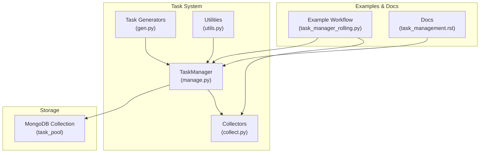
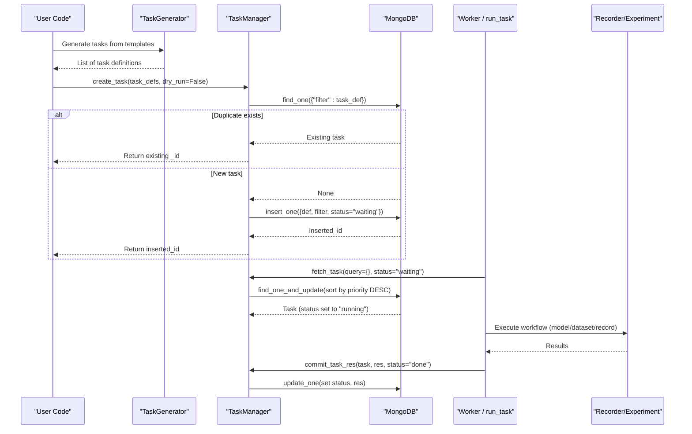
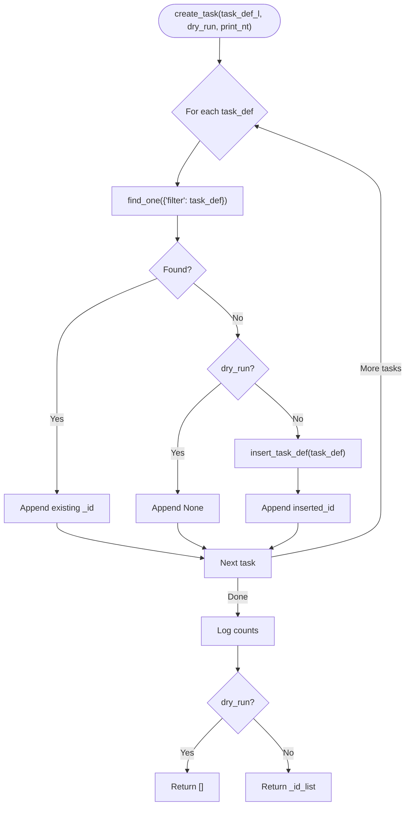
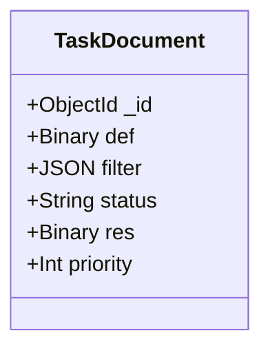
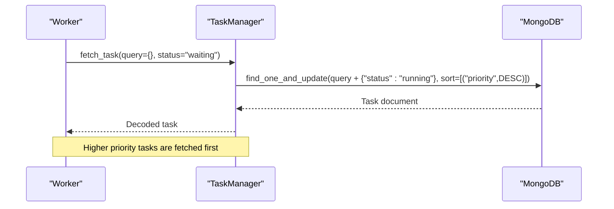
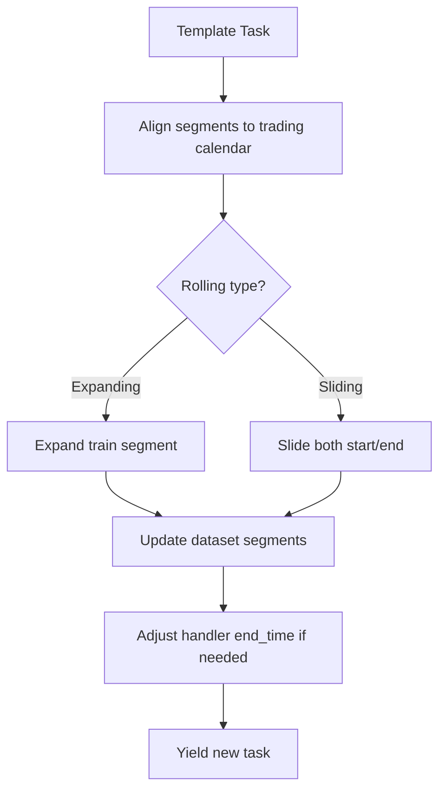
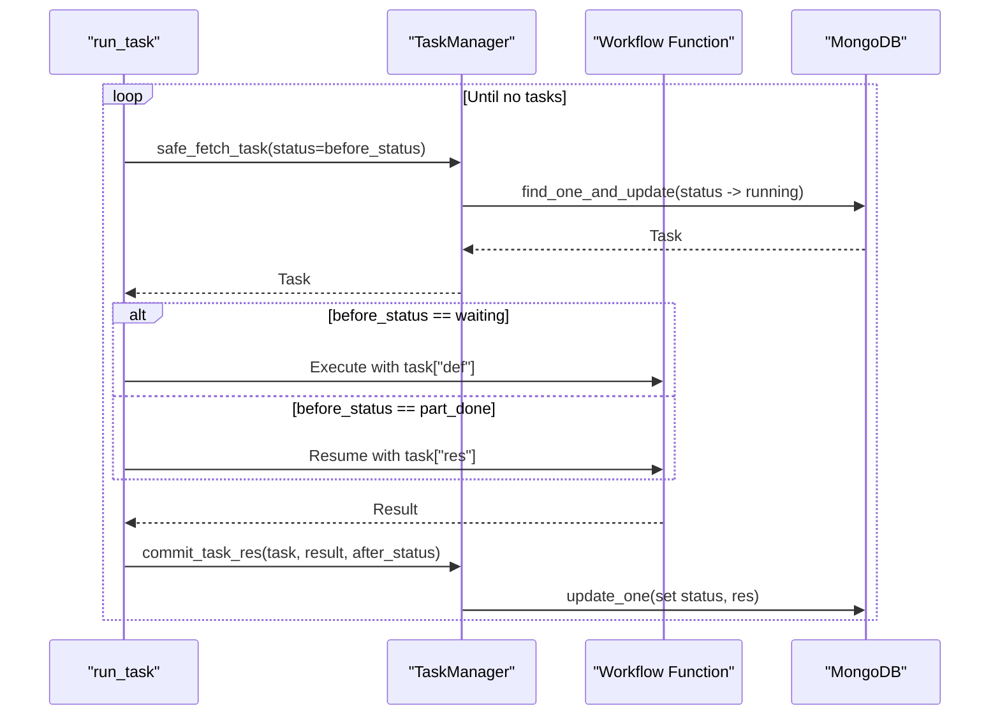
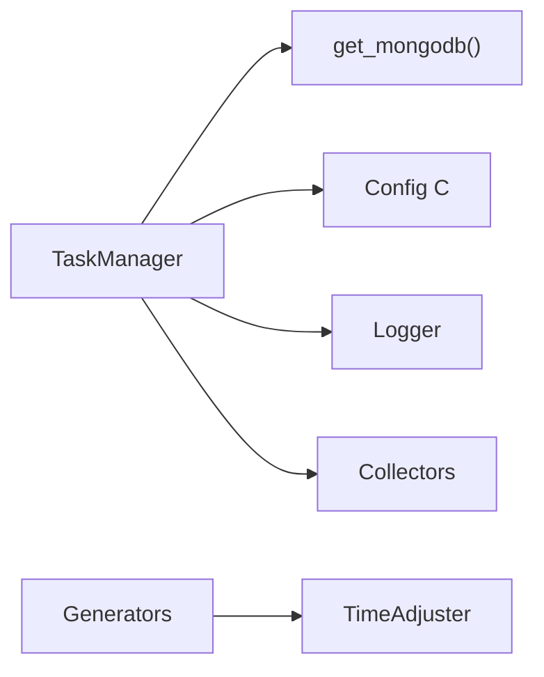

# Task Creation and Definition

<cite>
**Referenced Files in This Document**
- [manage.py](file://qlib/workflow/task/manage.py)
- [gen.py](file://qlib/workflow/task/gen.py)
- [utils.py](file://qlib/workflow/task/utils.py)
- [collect.py](file://qlib/workflow/task/collect.py)
- [task_management.rst](file://docs/advanced/task_management.rst)
- [config.py](file://qlib/tests/config.py)
- [task_manager_rolling.py](file://examples/model_rolling/task_manager_rolling.py)
</cite>

## Table of Contents
1. [Introduction](#introduction)
2. [Project Structure](#project-structure)
3. [Core Components](#core-components)
4. [Architecture Overview](#architecture-overview)
5. [Detailed Component Analysis](#detailed-component-analysis)
6. [Dependency Analysis](#dependency-analysis)
7. [Performance Considerations](#performance-considerations)
8. [Troubleshooting Guide](#troubleshooting-guide)
9. [Conclusion](#conclusion)
10. [Appendices](#appendices)

## Introduction
This document explains QLib’s task creation system with a focus on how tasks are defined, stored, and executed via the TaskManager. It covers:
- The structure of a task object (fields def, filter, status, res, and priority)
- Batch creation using TaskManager.create_task(), including duplicate detection and dry-run mode
- Task filtering criteria and priority-based execution ordering
- Storage in MongoDB collections and lifecycle management
- Examples for creating different types of tasks, handling dependencies conceptually, and best practices for designing robust task definitions

## Project Structure
The task system is implemented under qlib/workflow/task with supporting utilities and examples:
- manage.py: TaskManager class and run_task helper for fetching/executing tasks
- gen.py: Task generators (e.g., RollingGen) to produce multiple tasks from templates
- utils.py: MongoDB connection helpers, time alignment tools, and handler caching
- collect.py: Collectors for aggregating results after training
- docs/advanced/task_management.rst: High-level overview and usage guidance
- tests/config.py: Example task configurations used in tests and examples
- examples/model_rolling/task_manager_rolling.py: End-to-end example using TaskManager and rolling tasks

**Diagram sources**
- [manage.py:35-116](file://qlib/workflow/task/manage.py#L35-L116)
- [gen.py:16-50](file://qlib/workflow/task/gen.py#L16-L50)
- [utils.py:22-57](file://qlib/workflow/task/utils.py#L22-L57)
- [collect.py:19-87](file://qlib/workflow/task/collect.py#L19-L87)
- [task_manager_rolling.py:63-80](file://examples/model_rolling/task_manager_rolling.py#L63-L80)
- [task_management.rst:23-68](file://docs/advanced/task_management.rst#L23-L68)

**Section sources**
- [manage.py:35-116](file://qlib/workflow/task/manage.py#L35-L116)
- [gen.py:16-50](file://qlib/workflow/task/gen.py#L16-L50)
- [utils.py:22-57](file://qlib/workflow/task/utils.py#L22-L57)
- [collect.py:19-87](file://qlib/workflow/task/collect.py#L19-L87)
- [task_management.rst:23-68](file://docs/advanced/task_management.rst#L23-L68)
- [task_manager_rolling.py:63-80](file://examples/model_rolling/task_manager_rolling.py#L63-L80)

## Core Components
- TaskManager: Manages task lifecycle in a MongoDB collection, supports batch creation, querying, fetching with priority, committing results, and waiting for completion.
- Task Generators: Transform a base task template into multiple concrete tasks (e.g., rolling windows).
- Utilities: Provide MongoDB access, time alignment/truncation, and handler caching to improve performance.
- Collectors: Aggregate artifacts produced by trained tasks for analysis or downstream use.

Key aspects:
- Task object fields:
  - def: Pickle-serialized task definition (the user-provided task template)
  - filter: JSON-like data used for duplicate detection and querying; typically mirrors the task definition
  - status: One of waiting, running, part_done, done
  - res: Pickle-serialized result committed after execution
  - priority: Optional integer used to sort fetch order (higher number = higher priority)

**Section sources**
- [manage.py:35-84](file://qlib/workflow/task/manage.py#L35-L84)
- [manage.py:111-137](file://qlib/workflow/task/manage.py#L111-L137)
- [manage.py:194-215](file://qlib/workflow/task/manage.py#L194-L215)
- [manage.py:265-286](file://qlib/workflow/task/manage.py#L265-L286)
- [manage.py:354-382](file://qlib/workflow/task/manage.py#L354-L382)
- [manage.py:434-446](file://qlib/workflow/task/manage.py#L434-L446)

## Architecture Overview
The task creation and execution flow:
1. Define one or more task templates (dicts with model, dataset, record sections).
2. Optionally transform templates into multiple tasks using generators (e.g., RollingGen).
3. Use TaskManager.create_task() to insert new tasks into a MongoDB collection (task_pool), detecting duplicates via exact match on filter.
4. Workers call run_task() or fetch_task() to pick up tasks by status and priority, execute them, and commit results.
5. Collectors gather outputs from experiments/recorders for analysis.

**Diagram sources**
- [gen.py:16-50](file://qlib/workflow/task/gen.py#L16-L50)
- [manage.py:217-263](file://qlib/workflow/task/manage.py#L217-L263)
- [manage.py:265-286](file://qlib/workflow/task/manage.py#L265-L286)
- [manage.py:354-382](file://qlib/workflow/task/manage.py#L354-L382)
- [task_manager_rolling.py:63-80](file://examples/model_rolling/task_manager_rolling.py#L63-L80)

## Detailed Component Analysis

### TaskManager.create_task(): Batch creation, duplicate detection, dry-run
- Purpose: Insert new tasks into the task pool if they do not already exist; otherwise return the existing task id.
- Duplicate detection: Uses an exact match on the filter field against each incoming task definition. If a matching document is found, it is considered a duplicate and its _id is returned without insertion.
- Dry-run: When dry_run=True, no documents are inserted; returns empty list. Useful for validating inputs before persisting.
- Output: Returns a list of ids corresponding to the input task definitions (inserted or existing).

**Diagram sources**
- [manage.py:217-263](file://qlib/workflow/task/manage.py#L217-L263)

**Section sources**
- [manage.py:217-263](file://qlib/workflow/task/manage.py#L217-L263)

### Task object structure and storage
- Fields:
  - def: Serialized task definition (pickle)
  - filter: JSON-like queryable representation used for deduplication and queries
  - status: waiting | running | part_done | done
  - res: Serialized result (pickle)
  - priority: Integer used for sorting during fetch
- Storage: Each task is a document in a MongoDB collection named by the task pool. TaskManager encodes/decodes pickle fields when interacting with MongoDB.

**Diagram sources**
- [manage.py:35-84](file://qlib/workflow/task/manage.py#L35-L84)
- [manage.py:111-137](file://qlib/workflow/task/manage.py#L111-L137)
- [manage.py:194-215](file://qlib/workflow/task/manage.py#L194-L215)

**Section sources**
- [manage.py:35-84](file://qlib/workflow/task/manage.py#L35-L84)
- [manage.py:111-137](file://qlib/workflow/task/manage.py#L111-L137)
- [manage.py:194-215](file://qlib/workflow/task/manage.py#L194-L215)

### Task filtering and priority assignment
- Filtering:
  - fetch_task accepts a query dict combined with status to select tasks.
  - create_task uses exact match on filter to detect duplicates.
- Priority:
  - Tasks are fetched sorted by priority descending. Higher numbers are processed first.
  - Priorities can be updated per task via prioritize().

**Diagram sources**
- [manage.py:265-286](file://qlib/workflow/task/manage.py#L265-L286)
- [manage.py:434-446](file://qlib/workflow/task/manage.py#L434-L446)

**Section sources**
- [manage.py:265-286](file://qlib/workflow/task/manage.py#L265-L286)
- [manage.py:434-446](file://qlib/workflow/task/manage.py#L434-L446)

### Task generation patterns
- RollingGen: Generates multiple tasks by shifting segments across time windows (expanding or sliding). It also adjusts dataset handler end times to avoid data leakage and truncates non-test segments to prevent future information leakage.
- MultiHorizonGenBase: Generates tasks for multiple prediction horizons with appropriate segment adjustments.

**Diagram sources**
- [gen.py:140-301](file://qlib/workflow/task/gen.py#L140-L301)
- [gen.py:94-123](file://qlib/workflow/task/gen.py#L94-L123)

**Section sources**
- [gen.py:140-301](file://qlib/workflow/task/gen.py#L140-L301)
- [gen.py:94-123](file://qlib/workflow/task/gen.py#L94-L123)

### Task execution and result commitment
- run_task: Continuously fetches tasks in a given status, executes a provided task function, and commits results back to the task document with a final status.
- safe_fetch_task: Context manager that ensures tasks are returned to their original status on exceptions.
- commit_task_res: Stores results and updates status.

**Diagram sources**
- [manage.py:485-551](file://qlib/workflow/task/manage.py#L485-L551)
- [manage.py:288-317](file://qlib/workflow/task/manage.py#L288-L317)
- [manage.py:354-382](file://qlib/workflow/task/manage.py#L354-L382)

**Section sources**
- [manage.py:485-551](file://qlib/workflow/task/manage.py#L485-L551)
- [manage.py:288-317](file://qlib/workflow/task/manage.py#L288-L317)
- [manage.py:354-382](file://qlib/workflow/task/manage.py#L354-L382)

### Examples: Creating different types of tasks
- Rolling tasks: Use RollingGen to generate multiple tasks with shifted segments for different evaluation windows. See example workflow orchestration.
- Multiple models/horizons: Combine task templates with different model configurations and/or horizon generators to produce varied tasks.

References:
- Example script demonstrates generating tasks, training via TrainerRM, and collecting results.
- Test configs show minimal task structures with model, dataset, and record sections.

**Section sources**
- [task_manager_rolling.py:63-80](file://examples/model_rolling/task_manager_rolling.py#L63-L80)
- [config.py:94-127](file://qlib/tests/config.py#L94-L127)

### Handling task dependencies
- The current TaskManager does not implement explicit dependency graphs between tasks. Dependencies should be modeled at the application level:
  - Compose dependent steps within a single task definition so that intermediate results are captured in res and resumed later.
  - Use status transitions (waiting → part_done → done) to represent multi-stage workflows within one task.
  - For cross-task dependencies, coordinate externally (e.g., trigger subsequent tasks only after upstream tasks reach done status).

[No sources needed since this section provides conceptual guidance based on observed capabilities]

### Best practices for task definition design
- Keep filter stable and deterministic: Since duplicates are detected by exact match on filter, ensure consistent serialization and ordering of keys to avoid accidental duplicates.
- Use priorities to control execution order when tasks have implicit precedence.
- Prefer rolling generators to systematically explore time segments and reduce manual duplication.
- Ensure handlers’ end times align with test segments to avoid data leakage; RollingGen includes logic to adjust handler end times automatically.
- Use safe_fetch_task context managers to handle failures gracefully and restore task status.

**Section sources**
- [gen.py:94-123](file://qlib/workflow/task/gen.py#L94-L123)
- [manage.py:288-317](file://qlib/workflow/task/manage.py#L288-L317)
- [manage.py:217-263](file://qlib/workflow/task/manage.py#L217-L263)

## Dependency Analysis
- TaskManager depends on:
  - MongoDB via utils.get_mongodb()
  - Configuration C for pickle protocol version
  - Logging and tqdm for progress reporting
- Generators depend on:
  - TimeAdjuster for calendar-aware segment manipulation
  - Copy/deepcopy to avoid mutating shared templates
- Collectors depend on:
  - Experiment/Recorder APIs to retrieve artifacts

**Diagram sources**
- [utils.py:22-57](file://qlib/workflow/task/utils.py#L22-L57)
- [gen.py:140-301](file://qlib/workflow/task/gen.py#L140-L301)
- [manage.py:16-32](file://qlib/workflow/task/manage.py#L16-L32)
- [collect.py:19-87](file://qlib/workflow/task/collect.py#L19-L87)

**Section sources**
- [utils.py:22-57](file://qlib/workflow/task/utils.py#L22-L57)
- [gen.py:140-301](file://qlib/workflow/task/gen.py#L140-L301)
- [manage.py:16-32](file://qlib/workflow/task/manage.py#L16-L32)
- [collect.py:19-87](file://qlib/workflow/task/collect.py#L19-L87)

## Performance Considerations
- Batch creation: create_task processes all task definitions in a loop; consider batching large lists to minimize round trips.
- Priority sorting: Fetch operations sort by priority; ensure indexes on priority and status in MongoDB for large pools.
- Serialization overhead: def and res are pickled; keep payloads reasonable in size.
- Handler caching: replace_task_handler_with_cache can reduce repeated handler initialization costs by serializing handlers to disk and referencing file paths.

[No sources needed since this section provides general guidance]

## Troubleshooting Guide
- MongoDB configuration missing: get_mongodb raises an error if mongo config is not set. Ensure C["mongo"] contains task_url and task_db_name.
- InvalidDocument errors: Some filter values may need conversion to strings; TaskManager handles this by converting filter dicts to stringified versions when necessary.
- Stuck tasks: Use reset_waiting or reset_status to move stuck tasks back to waiting.
- Long-running iterations: Query iterators may raise cursor-related errors; prefer bounded queries or re-query periodically.

**Section sources**
- [utils.py:22-57](file://qlib/workflow/task/utils.py#L22-L57)
- [manage.py:177-192](file://qlib/workflow/task/manage.py#L177-L192)
- [manage.py:416-432](file://qlib/workflow/task/manage.py#L416-L432)

## Conclusion
QLib’s task system centers around TaskManager for persistent, prioritized, and resilient task scheduling backed by MongoDB. Tasks are defined as structured dictionaries and can be generated in bulk using generators like RollingGen. Duplicate detection relies on exact matches of the filter field, while priority controls execution order. Results are committed back to the same document, enabling multi-stage workflows through status transitions. Following the best practices outlined here will help you design scalable, maintainable task pipelines for research and production workloads.

## Appendices

### Appendix A: Task definition examples
- Minimal task template includes model, dataset, and optional record sections. See test configuration for concrete examples.
- Rolling tasks extend templates by adjusting dataset segments and handler end times.

**Section sources**
- [config.py:94-127](file://qlib/tests/config.py#L94-L127)
- [gen.py:140-301](file://qlib/workflow/task/gen.py#L140-L301)

### Appendix B: MongoDB setup
- Configure mongo URL and database name prior to using TaskManager.

**Section sources**
- [task_management.rst:45-53](file://docs/advanced/task_management.rst#L45-L53)
- [utils.py:22-57](file://qlib/workflow/task/utils.py#L22-L57)