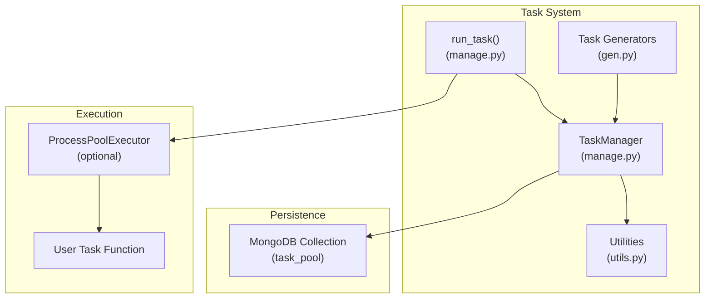
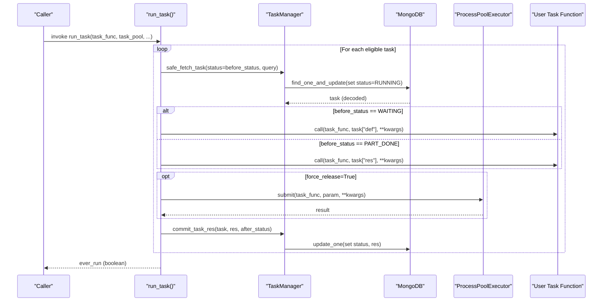
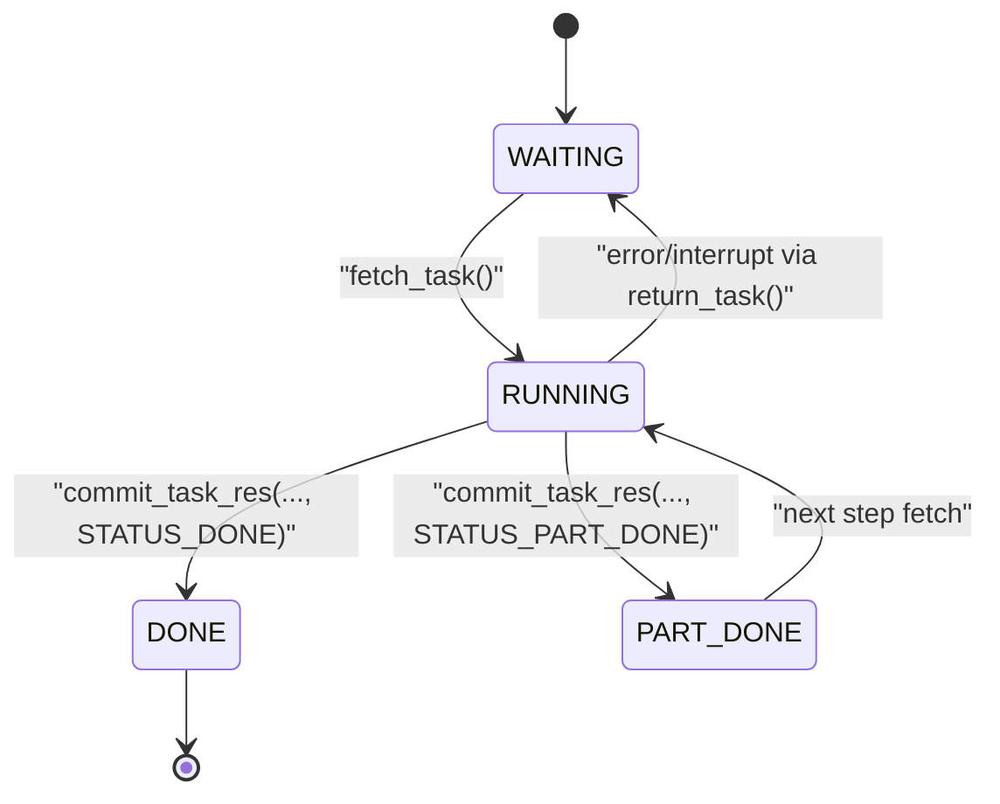
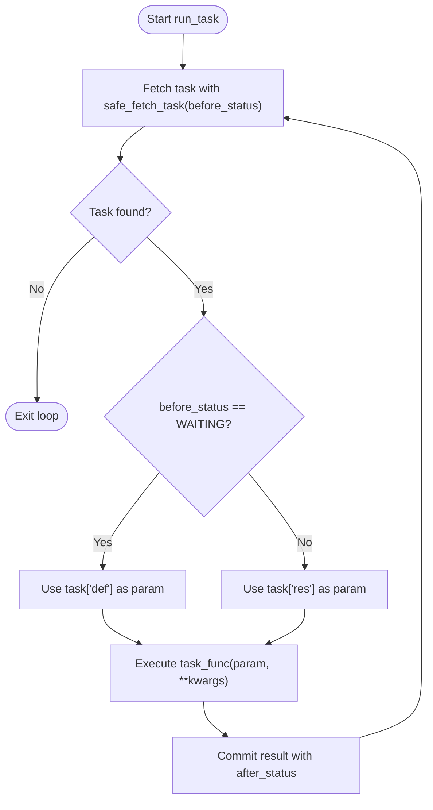
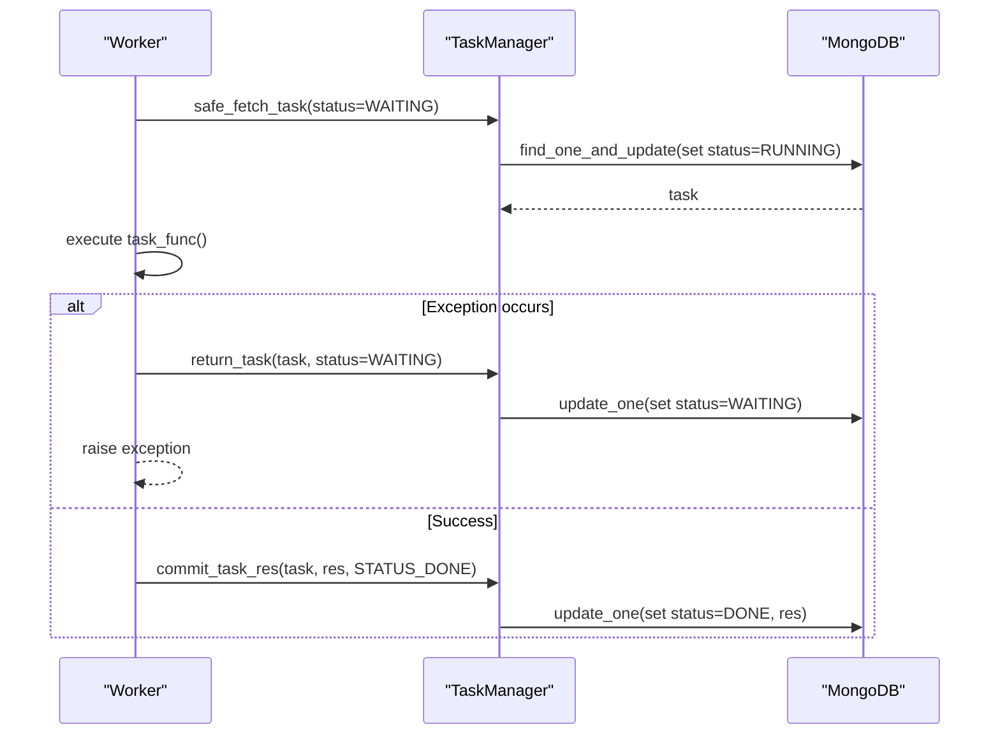
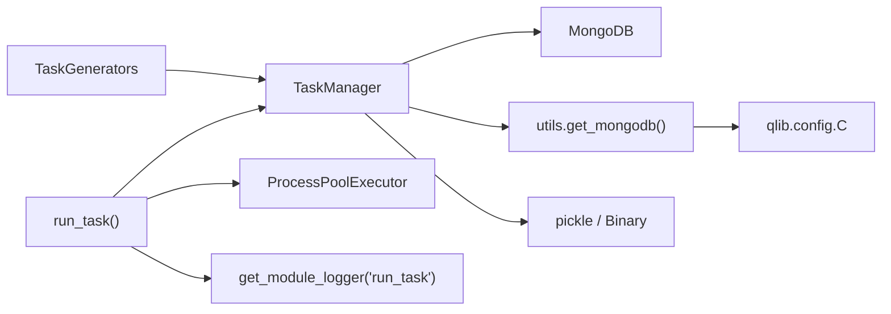

# Task Execution and Lifecycle

<cite>
**Referenced Files in This Document**
- [manage.py](file://qlib/workflow/task/manage.py)
- [gen.py](file://qlib/workflow/task/gen.py)
- [utils.py](file://qlib/workflow/task/utils.py)
- [__init__.py](file://qlib/workflow/task/__init__.py)
- [exp.py](file://qlib/workflow/exp.py)
- [workflow_by_code.py](file://examples/workflow_by_code.py)
</cite>

## Table of Contents
1. [Introduction](#introduction)
2. [Project Structure](#project-structure)
3. [Core Components](#core-components)
4. [Architecture Overview](#architecture-overview)
5. [Detailed Component Analysis](#detailed-component-analysis)
6. [Dependency Analysis](#dependency-analysis)
7. [Performance Considerations](#performance-considerations)
8. [Troubleshooting Guide](#troubleshooting-guide)
9. [Conclusion](#conclusion)
10. [Appendices](#appendices)

## Introduction
This document explains QLib’s task execution engine with a focus on the complete task lifecycle from WAITING to RUNNING to DONE, including the PART_DONE intermediate state for multi-step tasks. It details how run_task() orchestrates automatic status management, error handling, resource cleanup, concurrent execution, process isolation via ProcessPoolExecutor, and fault tolerance. It also provides guidance for implementing custom task functions, handling failures, monitoring progress, and managing long-running tasks across multiple processes or machines.

## Project Structure
QLib’s task system is organized under qlib/workflow/task:
- manage.py: TaskManager class and run_task() function that implement task lifecycle, persistence, and execution orchestration.
- gen.py: Task generators (e.g., RollingGen) to produce many tasks from templates.
- utils.py: Utilities such as MongoDB connection helpers and time alignment tools used by generators and managers.
- __init__.py: High-level overview of the workflow steps.

**Diagram sources**
- [manage.py:35-116](file://qlib/workflow/task/manage.py#L35-L116)
- [manage.py:265-382](file://qlib/workflow/task/manage.py#L265-L382)
- [manage.py:485-551](file://qlib/workflow/task/manage.py#L485-L551)
- [gen.py:16-50](file://qlib/workflow/task/gen.py#L16-L50)
- [utils.py:22-57](file://qlib/workflow/task/utils.py#L22-L57)

**Section sources**
- [__init__.py:1-14](file://qlib/workflow/task/__init__.py#L1-L14)
- [manage.py:35-116](file://qlib/workflow/task/manage.py#L35-L116)
- [gen.py:16-50](file://qlib/workflow/task/gen.py#L16-L50)
- [utils.py:22-57](file://qlib/workflow/task/utils.py#L22-L57)

## Core Components
- TaskManager: Manages tasks stored in a MongoDB collection. Provides methods to insert, fetch, commit results, return tasks on errors, reset statuses, and wait for completion.
- run_task(): A high-level loop that fetches tasks in a given status, executes user-defined task functions, commits results, and updates status. Supports optional process isolation via ProcessPoolExecutor.
- Task Generators: Create multiple tasks from templates (e.g., rolling windows), enabling scalable experimentation.
- Utilities: Provide MongoDB access and time alignment utilities used by generators and managers.

Key capabilities:
- Automatic status transitions: WAITING → RUNNING → DONE or PART_DONE.
- Fault-tolerant fetching: safe_fetch_task returns tasks back to original status on exceptions.
- Optional process isolation: run_task can execute each task in a separate process to isolate resources.
- Progress monitoring: wait() polls task statistics and shows a progress bar until all tasks are completed.

**Section sources**
- [manage.py:35-116](file://qlib/workflow/task/manage.py#L35-L116)
- [manage.py:265-382](file://qlib/workflow/task/manage.py#L265-L382)
- [manage.py:458-482](file://qlib/workflow/task/manage.py#L458-L482)
- [manage.py:485-551](file://qlib/workflow/task/manage.py#L485-L551)
- [gen.py:140-301](file://qlib/workflow/task/gen.py#L140-L301)
- [utils.py:22-57](file://qlib/workflow/task/utils.py#L22-L57)

## Architecture Overview
The task execution architecture centers around TaskManager and run_task(), backed by MongoDB for persistence and optional ProcessPoolExecutor for isolation.

**Diagram sources**
- [manage.py:265-382](file://qlib/workflow/task/manage.py#L265-L382)
- [manage.py:485-551](file://qlib/workflow/task/manage.py#L485-L551)

## Detailed Component Analysis

### Task Lifecycle and States
QLib defines four states:
- STATUS_WAITING: Task is queued and ready to be executed.
- STATUS_RUNNING: Task has been fetched and is currently executing.
- STATUS_PART_DONE: Intermediate state indicating partial completion; suitable for multi-step tasks that need to resume later.
- STATUS_DONE: Task completed successfully.

Transitions:
- WAITING → RUNNING: When a worker fetches a task using fetch_task().
- RUNNING → DONE or PART_DONE: After committing results via commit_task_res().
- RUNNING → WAITING: On error or interruption via return_task() inside safe_fetch_task().

**Diagram sources**
- [manage.py:79-82](file://qlib/workflow/task/manage.py#L79-L82)
- [manage.py:265-286](file://qlib/workflow/task/manage.py#L265-L286)
- [manage.py:354-382](file://qlib/workflow/task/manage.py#L354-L382)

**Section sources**
- [manage.py:79-82](file://qlib/workflow/task/manage.py#L79-L82)
- [manage.py:265-382](file://qlib/workflow/task/manage.py#L265-L382)

### run_task(): Execution Loop and Status Management
run_task() implements a robust execution loop:
- Fetches tasks matching before_status and query.
- Determines input parameter: task["def"] for WAITING, task["res"] for PART_DONE.
- Executes task_func either in-process or via ProcessPoolExecutor if force_release is True.
- Commits result and sets after_status.
- Uses safe_fetch_task context manager to ensure tasks are returned to original status on exceptions.

**Diagram sources**
- [manage.py:485-551](file://qlib/workflow/task/manage.py#L485-L551)

**Section sources**
- [manage.py:485-551](file://qlib/workflow/task/manage.py#L485-L551)

### Concurrent Execution and Process Isolation
- In-process execution: Default behavior calls task_func directly.
- Process isolation: When force_release=True, run_task uses ProcessPoolExecutor(max_workers=1) to run each task in a separate process, isolating memory and resources.

Benefits:
- Isolation prevents resource leaks and crashes from affecting other tasks.
- Suitable for long-running or heavy tasks that require clean process boundaries.

Trade-offs:
- Serialization overhead when passing parameters between processes.
- Slightly higher latency due to process startup.

**Section sources**
- [manage.py:543-547](file://qlib/workflow/task/manage.py#L543-L547)

### Fault Tolerance and Error Handling
- safe_fetch_task ensures that any exception during task execution triggers return_task(), restoring the task to its original status so it can be retried later.
- commit_task_res persists both result and final status atomically per task update.
- wait() monitors task statistics and blocks until all tasks reach DONE, providing a progress bar based on total and undone counts.

**Diagram sources**
- [manage.py:288-310](file://qlib/workflow/task/manage.py#L288-L310)
- [manage.py:354-382](file://qlib/workflow/task/manage.py#L354-L382)

**Section sources**
- [manage.py:288-310](file://qlib/workflow/task/manage.py#L288-L310)
- [manage.py:354-382](file://qlib/workflow/task/manage.py#L354-L382)

### Multi-Step Tasks with PART_DONE
For complex workflows that span multiple steps:
- First step: Execute with before_status=WAITING, after_status=PART_DONE, saving intermediate results into task["res"].
- Subsequent steps: Run again with before_status=PART_DONE, after_status=PART_DONE or STATUS_DONE, using task["res"] as input.

This pattern enables checkpointing and resumability without manual bookkeeping.

**Section sources**
- [manage.py:497-505](file://qlib/workflow/task/manage.py#L497-L505)
- [manage.py:535-547](file://qlib/workflow/task/manage.py#L535-L547)

### Monitoring Execution Progress
- task_stat(query) returns counts per status.
- wait(query) polls task_stat and displays a progress bar until all tasks are done.
- Useful for coordinating main processes that must wait for distributed workers to finish.

**Section sources**
- [manage.py:398-414](file://qlib/workflow/task/manage.py#L398-L414)
- [manage.py:458-482](file://qlib/workflow/task/manage.py#L458-L482)

### Implementing Custom Task Functions
A custom task function should:
- Accept a single primary argument (either task definition or previous result).
- Return a result object that will be serialized and stored in task["res"].
- Be deterministic and idempotent where possible to support retries.

Typical usage patterns:
- Training models: Input is dataset configuration; output is model artifacts.
- Prediction pipelines: Input is model; output is predictions.
- Backtesting: Input is strategy and model; output is performance metrics.

Integration examples:
- Workflow scripts demonstrate starting experiments, logging parameters, fitting models, generating signals, and recording analysis outputs.

**Section sources**
- [manage.py:509-524](file://qlib/workflow/task/manage.py#L509-L524)
- [workflow_by_code.py:67-85](file://examples/workflow_by_code.py#L67-L85)
- [exp.py:44-72](file://qlib/workflow/exp.py#L44-L72)

### Managing Long-Running Tasks Across Multiple Processes or Machines
- Deploy multiple workers calling run_task() concurrently against the same task_pool.
- Each worker independently fetches and executes tasks; MongoDB ensures each task is processed exactly once.
- Use wait() in orchestrator processes to synchronize completion.
- For cross-machine execution, ensure all workers share the same MongoDB instance and task_pool name.

Best practices:
- Set appropriate before_status and after_status to control flow (WAITING→DONE for simple tasks; WAITING→PART_DONE→DONE for multi-step).
- Use force_release=True for tasks requiring strict resource isolation.
- Log task definitions and results for traceability.

**Section sources**
- [manage.py:265-286](file://qlib/workflow/task/manage.py#L265-L286)
- [manage.py:458-482](file://qlib/workflow/task/manage.py#L458-L482)
- [manage.py:485-551](file://qlib/workflow/task/manage.py#L485-L551)

## Dependency Analysis

**Diagram sources**
- [manage.py:16-33](file://qlib/workflow/task/manage.py#L16-L33)
- [manage.py:265-382](file://qlib/workflow/task/manage.py#L265-L382)
- [manage.py:485-551](file://qlib/workflow/task/manage.py#L485-L551)
- [utils.py:22-57](file://qlib/workflow/task/utils.py#L22-L57)

**Section sources**
- [manage.py:16-33](file://qlib/workflow/task/manage.py#L16-L33)
- [utils.py:22-57](file://qlib/workflow/task/utils.py#L22-L57)

## Performance Considerations
- Concurrency: Multiple workers can safely run against the same task pool; MongoDB’s atomic find_one_and_update ensures no duplicate processing.
- Process isolation: Enabling force_release adds overhead but improves stability for long-running or memory-intensive tasks.
- Serialization: Large task definitions or results increase pickle serialization cost; consider minimizing payload size or using efficient formats.
- Polling interval: wait() sleeps 10 seconds between checks; adjust logic externally if finer granularity is needed.

[No sources needed since this section provides general guidance]

## Troubleshooting Guide
Common issues and resolutions:
- No tasks being picked up: Ensure tasks are inserted with correct filter fields and initial status WAITING; verify query filters match expected values.
- Tasks stuck in RUNNING: Check for unhandled exceptions in task_func; safe_fetch_task should return them to original status, but confirm logs and database state.
- Partial completions not progressing: Verify multi-step flows set after_status correctly (PART_DONE then DONE); ensure subsequent runs use before_status=PART_DONE.
- MongoDB connectivity: Confirm C["mongo"] configuration includes task_url and task_db_name; get_mongodb() requires these settings.

Operational tips:
- Use task_stat() to inspect distribution of statuses.
- Use reset_waiting() to recover stuck RUNNING tasks back to WAITING when necessary.
- Leverage wait() to block until all tasks complete in orchestrator processes.

**Section sources**
- [manage.py:265-382](file://qlib/workflow/task/manage.py#L265-L382)
- [manage.py:416-432](file://qlib/workflow/task/manage.py#L416-L432)
- [manage.py:458-482](file://qlib/workflow/task/manage.py#L458-L482)
- [utils.py:22-57](file://qlib/workflow/task/utils.py#L22-L57)

## Conclusion
QLib’s task execution engine provides a robust, persistent, and fault-tolerant framework for running tasks at scale. The TaskManager and run_task() function automate lifecycle management, support multi-step workflows via PART_DONE, enable concurrent execution, and offer optional process isolation. With clear status transitions, error recovery, and progress monitoring, users can reliably orchestrate complex workflows across multiple processes and machines.

[No sources needed since this section summarizes without analyzing specific files]

## Appendices

### Example: Typical Task Flow in Code
- Define tasks using generators or direct insertion.
- Start workers that call run_task() with appropriate before_status and after_status.
- Use wait() in orchestrator to synchronize completion.
- Collect results via recorders or external storage.

**Section sources**
- [gen.py:16-50](file://qlib/workflow/task/gen.py#L16-L50)
- [manage.py:485-551](file://qlib/workflow/task/manage.py#L485-L551)
- [workflow_by_code.py:67-85](file://examples/workflow_by_code.py#L67-L85)