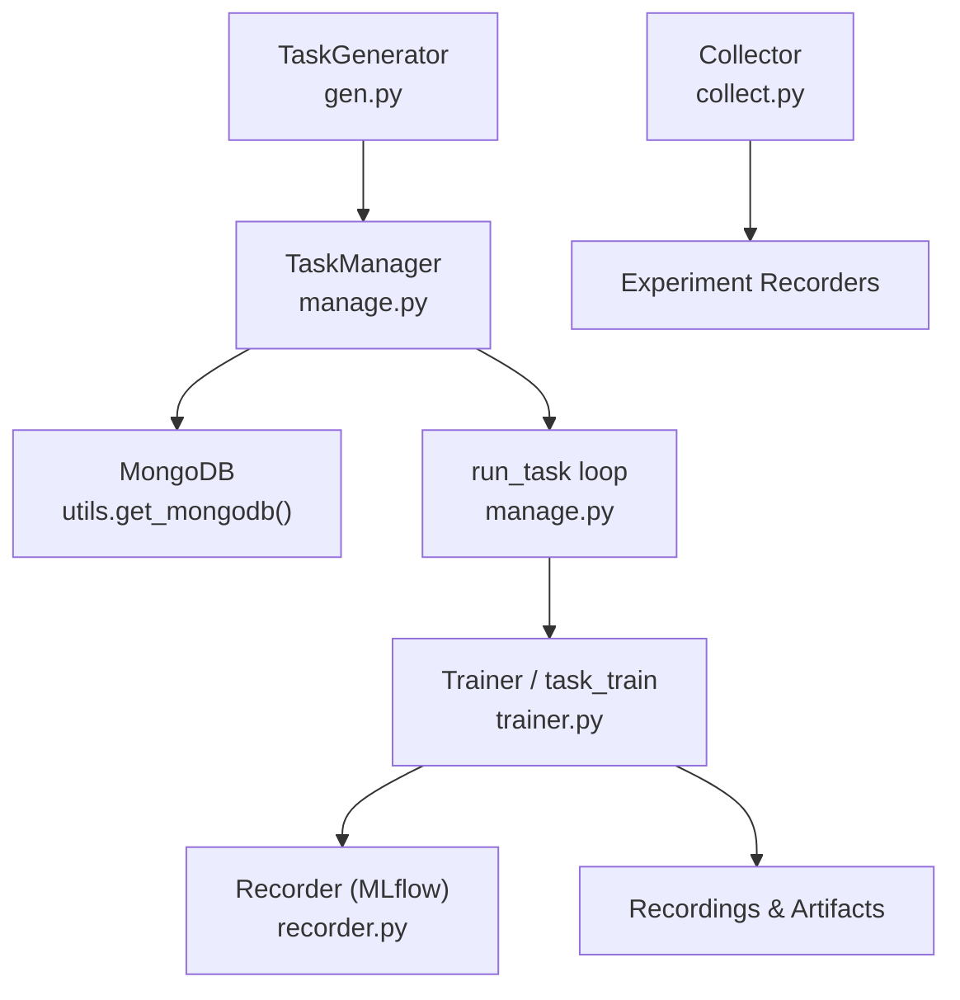
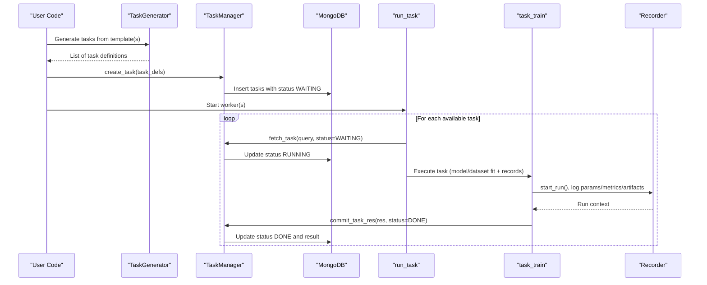
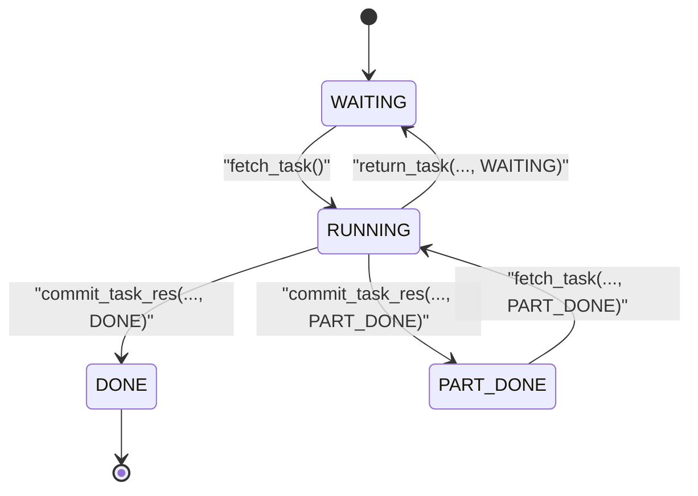
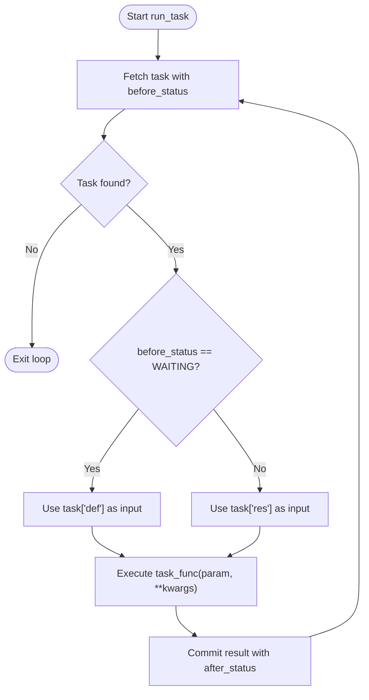
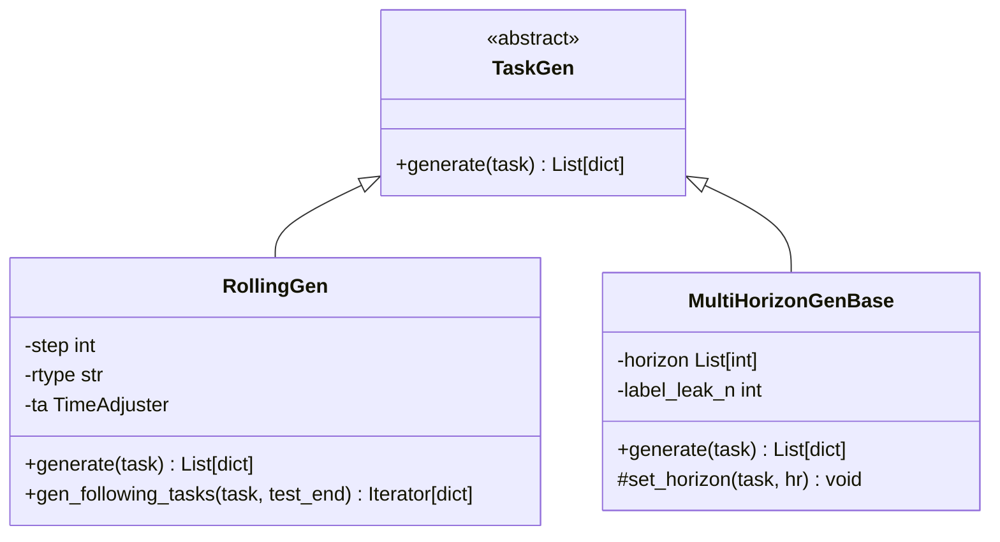
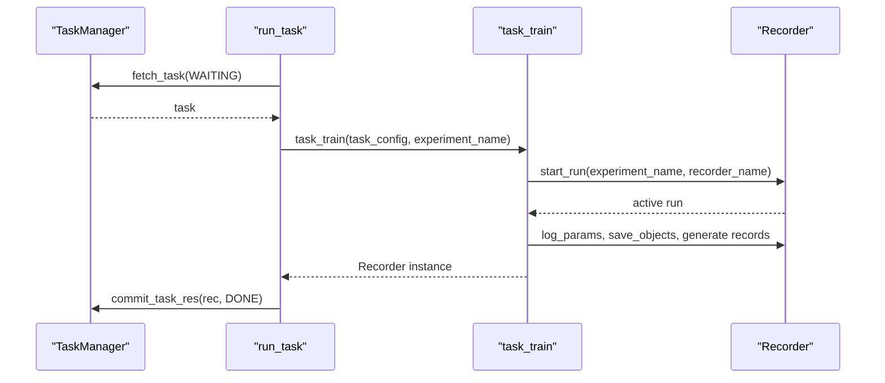
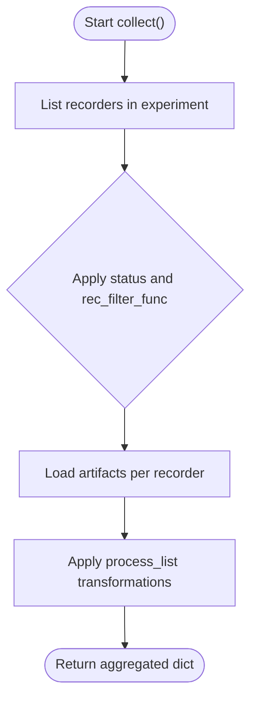
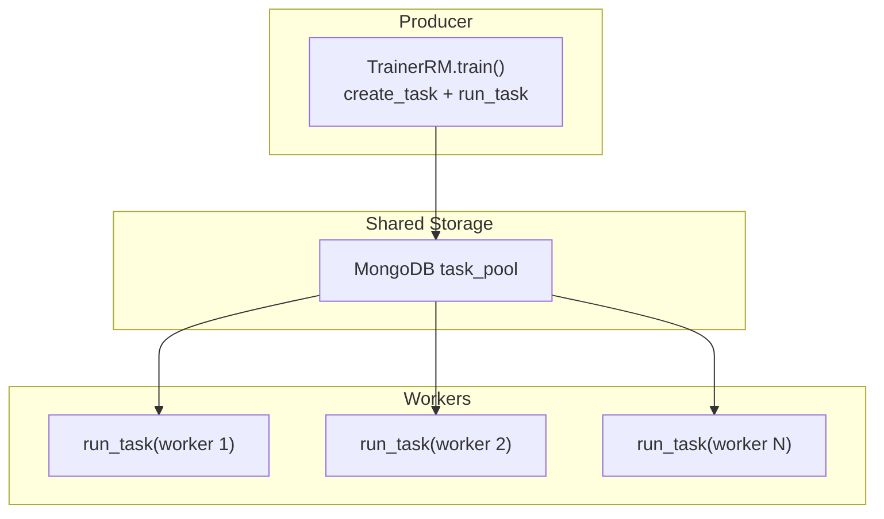
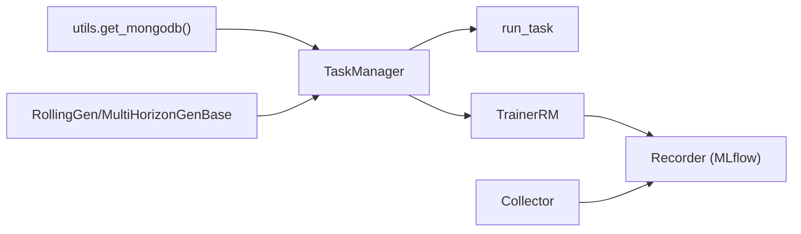

# Task Management and Execution

<cite>
**Referenced Files in This Document**
- [manage.py](file://qlib/workflow/task/manage.py)
- [gen.py](file://qlib/workflow/task/gen.py)
- [collect.py](file://qlib/workflow/task/collect.py)
- [utils.py](file://qlib/workflow/task/utils.py)
- [recorder.py](file://qlib/workflow/recorder.py)
- [trainer.py](file://qlib/model/trainer.py)
- [task_manager_rolling.py](file://examples/model_rolling/task_manager_rolling.py)
</cite>

## Table of Contents
1. [Introduction](#introduction)
2. [Project Structure](#project-structure)
3. [Core Components](#core-components)
4. [Architecture Overview](#architecture-overview)
5. [Detailed Component Analysis](#detailed-component-analysis)
6. [Dependency Analysis](#dependency-analysis)
7. [Performance Considerations](#performance-considerations)
8. [Troubleshooting Guide](#troubleshooting-guide)
9. [Conclusion](#conclusion)
10. [Appendices](#appendices)

## Introduction
This document explains QLib’s task management system: how tasks are created from configurations, stored in a persistent task pool, executed across processes or machines, and tracked via recorders. It covers the lifecycle states (WAITING, PART_DONE, DONE), transitions, collection and filtering of results, error handling, progress monitoring, and distributed execution patterns.

## Project Structure
QLib’s task system spans several modules:
- Task creation and generation: qlib/workflow/task/gen.py
- Task persistence and execution loop: qlib/workflow/task/manage.py
- Utilities for MongoDB access and time alignment: qlib/workflow/task/utils.py
- Result collection from experiments: qlib/workflow/task/collect.py
- Experiment/recorder abstraction: qlib/workflow/recorder.py
- Training orchestration with TaskManager integration: qlib/model/trainer.py
- End-to-end example demonstrating rolling tasks and workers: examples/model_rolling/task_manager_rolling.py

**Diagram sources**
- [manage.py:35-116](file://qlib/workflow/task/manage.py#L35-L116)
- [gen.py:16-50](file://qlib/workflow/task/gen.py#L16-L50)
- [utils.py:22-57](file://qlib/workflow/task/utils.py#L22-L57)
- [trainer.py:108-128](file://qlib/model/trainer.py#L108-L128)
- [recorder.py:247-395](file://qlib/workflow/recorder.py#L247-L395)
- [collect.py:136-249](file://qlib/workflow/task/collect.py#L136-L249)

**Section sources**
- [manage.py:35-116](file://qlib/workflow/task/manage.py#L35-L116)
- [gen.py:16-50](file://qlib/workflow/task/gen.py#L16-L50)
- [utils.py:22-57](file://qlib/workflow/task/utils.py#L22-L57)
- [trainer.py:108-128](file://qlib/model/trainer.py#L108-L128)
- [recorder.py:247-395](file://qlib/workflow/recorder.py#L247-L395)
- [collect.py:136-249](file://qlib/workflow/task/collect.py#L136-L249)

## Core Components
- TaskManager: Persistent task store and executor coordinator backed by MongoDB. It defines task states and provides methods to create, fetch, commit results, reset, prioritize, and wait on tasks.
- run_task: A reusable worker loop that pulls tasks from TaskManager, executes a user-provided function, and commits results with state transitions.
- Task generators: RollingGen and MultiHorizonGenBase transform base task templates into multiple concrete tasks (e.g., rolling windows).
- Recorder: Abstraction over experiment tracking (implemented via MLflowRecorder) for logging parameters, metrics, artifacts, and managing run lifecycle.
- Collector: Aggregates artifacts from multiple recorders with filtering and processing pipelines.
- TrainerR/TrainerRM: Orchestrate training; TrainerRM integrates with TaskManager to support distributed execution.

**Section sources**
- [manage.py:35-116](file://qlib/workflow/task/manage.py#L35-L116)
- [manage.py:485-551](file://qlib/workflow/task/manage.py#L485-L551)
- [gen.py:53-179](file://qlib/workflow/task/gen.py#L53-L179)
- [recorder.py:28-395](file://qlib/workflow/recorder.py#L28-L395)
- [collect.py:19-87](file://qlib/workflow/task/collect.py#L19-L87)
- [trainer.py:209-488](file://qlib/model/trainer.py#L209-L488)

## Architecture Overview
The system separates concerns:
- Creation: Task templates are expanded into concrete tasks using generators.
- Persistence: Tasks are stored in MongoDB with status fields and serialized payloads.
- Execution: Worker processes pull tasks, execute logic, and update status/results atomically.
- Tracking: Each task run creates a Recorder (experiment/run) to log params, metrics, and artifacts.
- Collection: Post-run, collectors aggregate artifacts across recorders for analysis.

**Diagram sources**
- [gen.py:16-50](file://qlib/workflow/task/gen.py#L16-L50)
- [manage.py:217-286](file://qlib/workflow/task/manage.py#L217-L286)
- [manage.py:485-551](file://qlib/workflow/task/manage.py#L485-L551)
- [trainer.py:108-128](file://qlib/model/trainer.py#L108-L128)
- [recorder.py:335-395](file://qlib/workflow/recorder.py#L335-L395)

## Detailed Component Analysis

### TaskManager and State Machine
TaskManager manages tasks with four states:
- WAITING: Ready to be picked up by workers.
- RUNNING: Currently being processed (internal transient state).
- PART_DONE: Intermediate checkpoint; can resume later.
- DONE: Completed successfully.

Key operations:
- insert_task_def: Creates a new task with status WAITING.
- create_task: Deduplicates by filter and inserts only new tasks.
- fetch_task: Atomically picks one waiting task and sets it to RUNNING.
- commit_task_res: Saves result and updates status to DONE or PART_DONE.
- return_task: Resets status (useful on errors).
- safe_fetch_task: Context manager ensuring tasks are returned on exceptions.
- wait: Polls until all undone tasks complete; shows progress with a progress bar.

**Diagram sources**
- [manage.py:68-82](file://qlib/workflow/task/manage.py#L68-L82)
- [manage.py:265-382](file://qlib/workflow/task/manage.py#L265-L382)

**Section sources**
- [manage.py:68-82](file://qlib/workflow/task/manage.py#L68-L82)
- [manage.py:217-382](file://qlib/workflow/task/manage.py#L217-L382)
- [manage.py:458-480](file://qlib/workflow/task/manage.py#L458-L480)

### run_task Worker Loop
run_task is the core execution engine:
- Continuously fetches tasks matching query and before_status.
- Executes task_func with either task definition (for WAITING) or saved result (for PART_DONE).
- Commits result and updates after_status.
- Supports force_release to run in a separate process for memory isolation.

**Diagram sources**
- [manage.py:485-551](file://qlib/workflow/task/manage.py#L485-L551)

**Section sources**
- [manage.py:485-551](file://qlib/workflow/task/manage.py#L485-L551)

### Task Generation from Configurations
Generators expand base task templates into multiple concrete tasks:
- RollingGen: Produces rolling windows with expanding or sliding segments; aligns dates to trading calendar; optionally truncates to avoid future leakage; adjusts handler end times when needed.
- MultiHorizonGenBase: Generates tasks for different prediction horizons with label-leak adjustments.
- task_generator: Composes multiple generators to produce a Cartesian product of variations.

**Diagram sources**
- [gen.py:53-179](file://qlib/workflow/task/gen.py#L53-L179)
- [gen.py:304-351](file://qlib/workflow/task/gen.py#L304-L351)

**Section sources**
- [gen.py:16-50](file://qlib/workflow/task/gen.py#L16-L50)
- [gen.py:140-301](file://qlib/workflow/task/gen.py#L140-L301)
- [gen.py:304-351](file://qlib/workflow/task/gen.py#L304-L351)

### Relationship Between Tasks and Recorders
Each task execution typically starts a Recorder (experiment/run) to persist metadata and artifacts:
- begin_task_train/task_train: Starts a recorder, logs task config, runs model fitting, generates records, and saves artifacts.
- Delayed workflows: begin_task_train prepares metadata; end_task_train resumes and performs heavy work.

**Diagram sources**
- [trainer.py:74-128](file://qlib/model/trainer.py#L74-L128)
- [manage.py:485-551](file://qlib/workflow/task/manage.py#L485-L551)

**Section sources**
- [trainer.py:74-128](file://qlib/model/trainer.py#L74-L128)
- [recorder.py:335-395](file://qlib/workflow/recorder.py#L335-L395)

### Task Collection and Filtering
Collectors aggregate artifacts from multiple recorders:
- RecorderCollector: Lists recorders in an experiment, filters by status or custom predicate, loads specified artifacts, and applies processing functions.
- MergeCollector: Combines outputs from multiple collectors with key merging strategies.

**Diagram sources**
- [collect.py:136-249](file://qlib/workflow/task/collect.py#L136-L249)

**Section sources**
- [collect.py:19-87](file://qlib/workflow/task/collect.py#L19-L87)
- [collect.py:136-249](file://qlib/workflow/task/collect.py#L136-L249)

### Distributed Task Execution
Distributed execution is enabled by separating producers (task creators) and consumers (workers):
- Producer: Uses TrainerRM.train to create tasks in TaskManager and optionally run them locally.
- Consumer: Runs TrainerRM.worker or directly calls run_task in separate processes/machines sharing the same MongoDB task pool.
- The example demonstrates generating rolling tasks, training via TrainerRM, and collecting results.

**Diagram sources**
- [trainer.py:341-488](file://qlib/model/trainer.py#L341-L488)
- [manage.py:485-551](file://qlib/workflow/task/manage.py#L485-L551)
- [task_manager_rolling.py:72-80](file://examples/model_rolling/task_manager_rolling.py#L72-L80)

**Section sources**
- [trainer.py:341-488](file://qlib/model/trainer.py#L341-L488)
- [task_manager_rolling.py:24-80](file://examples/model_rolling/task_manager_rolling.py#L24-L80)

## Dependency Analysis
- TaskManager depends on MongoDB via utils.get_mongodb and uses pymongo for atomic updates.
- run_task depends on TaskManager and a user-defined task function (commonly task_train).
- Generators depend on TimeAdjuster for date alignment and segment manipulation.
- Collectors depend on Experiment and Recorder APIs to list and load artifacts.
- Trainers integrate TaskManager and Recorder to coordinate distributed training.

**Diagram sources**
- [utils.py:22-57](file://qlib/workflow/task/utils.py#L22-L57)
- [manage.py:35-116](file://qlib/workflow/task/manage.py#L35-L116)
- [gen.py:140-301](file://qlib/workflow/task/gen.py#L140-L301)
- [trainer.py:341-488](file://qlib/model/trainer.py#L341-L488)
- [collect.py:136-249](file://qlib/workflow/task/collect.py#L136-L249)

**Section sources**
- [utils.py:22-57](file://qlib/workflow/task/utils.py#L22-L57)
- [manage.py:35-116](file://qlib/workflow/task/manage.py#L35-L116)
- [gen.py:140-301](file://qlib/workflow/task/gen.py#L140-L301)
- [trainer.py:341-488](file://qlib/model/trainer.py#L341-L488)
- [collect.py:136-249](file://qlib/workflow/task/collect.py#L136-L249)

## Performance Considerations
- Atomic task claiming: fetch_task uses find_one_and_update to ensure each task is processed once.
- Priority-based scheduling: tasks can be prioritized; higher priority values are fetched first.
- Memory isolation: run_task supports force_release to execute tasks in a subprocess to free memory between tasks.
- Asynchronous logging: Recorder uses async logging to reduce overhead during artifact uploads.
- Efficient iteration: task_stat and wait use polling with progress feedback to minimize CPU usage while monitoring completion.

[No sources needed since this section provides general guidance]

## Troubleshooting Guide
Common issues and remedies:
- Missing MongoDB configuration: Ensure mongo settings are initialized before using TaskManager; otherwise, get_mongodb raises an error.
- Stuck RUNNING tasks: If a worker crashes, tasks may remain RUNNING; use reset_waiting or reset_status to return them to WAITING.
- Duplicate keys in collection: When collecting artifacts, duplicate recorder keys will overwrite previous values; adjust rec_key_func to ensure uniqueness.
- Artifact loading failures: RecorderCollector can ignore missing artifacts if configured; otherwise, exceptions are raised.
- Long-running queries: Querying large collections may cause cursor timeouts; prefer targeted queries and limit iterations.

**Section sources**
- [utils.py:22-57](file://qlib/workflow/task/utils.py#L22-L57)
- [manage.py:416-432](file://qlib/workflow/task/manage.py#L416-L432)
- [collect.py:227-249](file://qlib/workflow/task/collect.py#L227-L249)
- [manage.py:288-317](file://qlib/workflow/task/manage.py#L288-L317)

## Conclusion
QLib’s task management system provides a robust, scalable framework for orchestrating complex workflows. By decoupling task creation, persistence, execution, and result collection, it supports both single-process and distributed environments. The state machine ensures reliable progress tracking, while generators and collectors enable flexible experimentation and analysis. Integrating with MongoDB and MLflow-backed recorders makes it suitable for production-grade machine learning pipelines.

[No sources needed since this section summarizes without analyzing specific files]

## Appendices

### Example: Rolling Tasks with TaskManager
A practical example demonstrates:
- Initializing Qlib with MongoDB configuration.
- Generating rolling tasks using RollingGen.
- Training via TrainerRM to push tasks into TaskManager.
- Running workers to execute tasks across processes/machines.
- Collecting results with RecorderCollector and RollingGroup.

**Section sources**
- [task_manager_rolling.py:24-117](file://examples/model_rolling/task_manager_rolling.py#L24-L117)