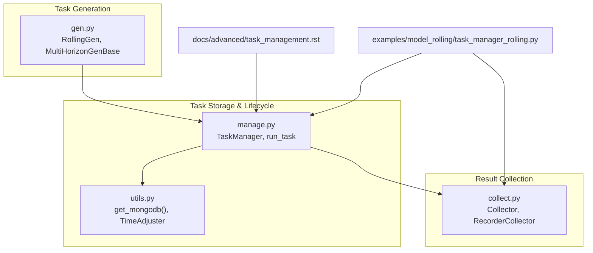
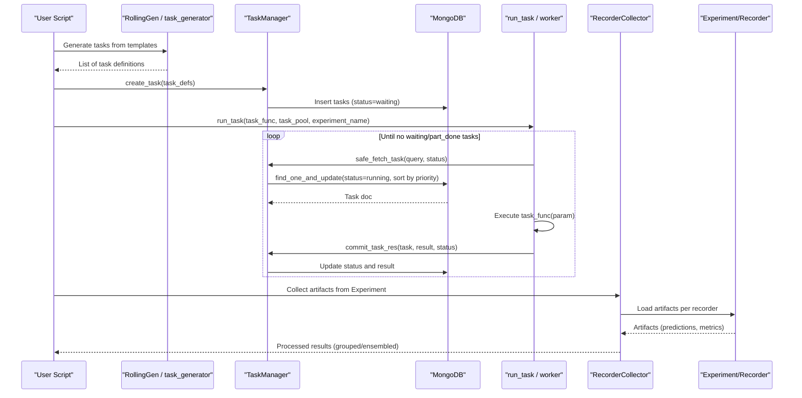
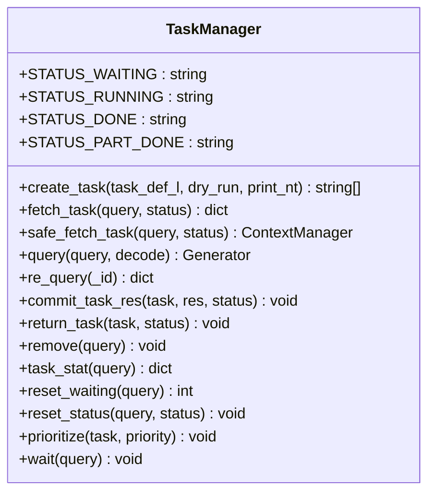
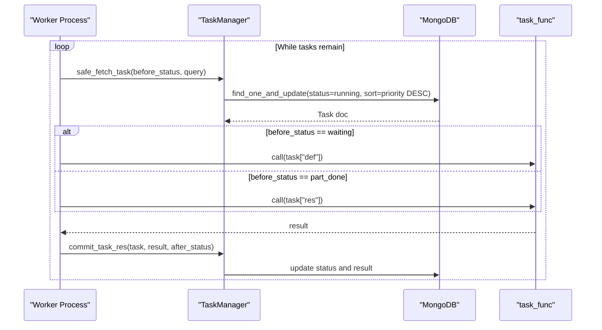
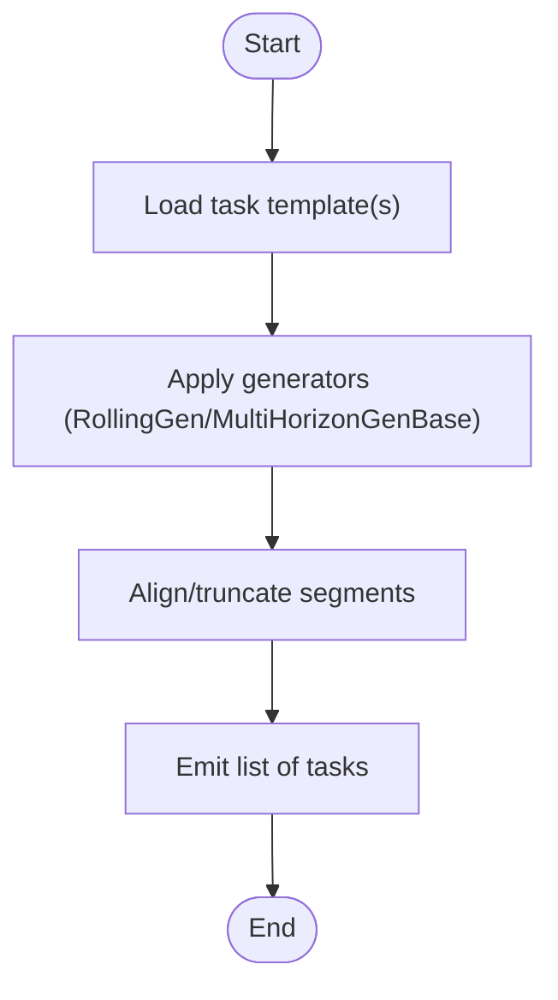
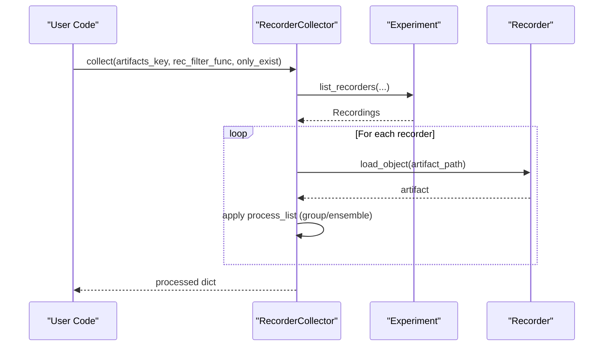
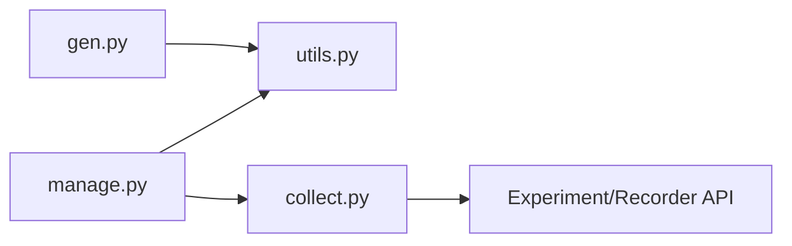

# Task Monitoring and Management

<cite>
**Referenced Files in This Document**
- [manage.py](file://qlib/workflow/task/manage.py)
- [gen.py](file://qlib/workflow/task/gen.py)
- [collect.py](file://qlib/workflow/task/collect.py)
- [utils.py](file://qlib/workflow/task/utils.py)
- [task_management.rst](file://docs/advanced/task_management.rst)
- [task_manager_rolling.py](file://examples/model_rolling/task_manager_rolling.py)
</cite>

## Table of Contents
1. [Introduction](#introduction)
2. [Project Structure](#project-structure)
3. [Core Components](#core-components)
4. [Architecture Overview](#architecture-overview)
5. [Detailed Component Analysis](#detailed-component-analysis)
6. [Dependency Analysis](#dependency-analysis)
7. [Performance Considerations](#performance-considerations)
8. [Troubleshooting Guide](#troubleshooting-guide)
9. [Conclusion](#conclusion)
10. [Appendices](#appendices)

## Introduction
This document explains QLib’s task monitoring and management capabilities with a focus on:
- Querying task status using filters
- Viewing task statistics via task_stat()
- Monitoring progress through command-line interfaces
- Recovery mechanisms including reset_waiting(), return_task(), and safe_fetch_task()
- Task prioritization, bulk operations, and integration points for external monitoring systems
- Practical examples for dashboards, alerts, and custom workflows

QLib’s task system is designed to generate, store, execute, and collect tasks across distributed workers while ensuring robust lifecycle management and error recovery.

## Project Structure
The task management subsystem spans several modules:
- Task generation (templates and rolling strategies)
- Task storage and lifecycle management (MongoDB-backed)
- Task execution helpers and CLI
- Result collection from experiments/recorders

**Diagram sources**
- [manage.py:35-483](file://qlib/workflow/task/manage.py#L35-L483)
- [gen.py:16-351](file://qlib/workflow/task/gen.py#L16-L351)
- [collect.py:19-259](file://qlib/workflow/task/collect.py#L19-L259)
- [utils.py:22-58](file://qlib/workflow/task/utils.py#L22-L58)
- [task_management.rst:9-101](file://docs/advanced/task_management.rst#L9-L101)
- [task_manager_rolling.py:24-117](file://examples/model_rolling/task_manager_rolling.py#L24-L117)

**Section sources**
- [manage.py:35-483](file://qlib/workflow/task/manage.py#L35-L483)
- [gen.py:16-351](file://qlib/workflow/task/gen.py#L16-L351)
- [collect.py:19-259](file://qlib/workflow/task/collect.py#L19-L259)
- [utils.py:22-58](file://qlib/workflow/task/utils.py#L22-L58)
- [task_management.rst:9-101](file://docs/advanced/task_management.rst#L9-L101)
- [task_manager_rolling.py:24-117](file://examples/model_rolling/task_manager_rolling.py#L24-L117)

## Core Components
- TaskManager: Central orchestrator for storing, fetching, updating, and recovering tasks backed by MongoDB. Provides query, stats, priority, and recovery APIs.
- RollingGen and MultiHorizonGenBase: Generate multiple tasks from templates (e.g., rolling windows, multi-horizon).
- Collector and RecorderCollector: Collect artifacts from experiments/recorders and process them (grouping, ensembling).
- Utilities: MongoDB connection helper and time alignment tools for segment manipulation.

Key responsibilities:
- Create and manage task lifecycles (waiting, running, part_done, done)
- Provide safe context-managed task acquisition with automatic recovery
- Offer CLI access via Fire for operational commands
- Support filtering and statistics for monitoring

**Section sources**
- [manage.py:35-483](file://qlib/workflow/task/manage.py#L35-L483)
- [gen.py:53-351](file://qlib/workflow/task/gen.py#L53-L351)
- [collect.py:19-259](file://qlib/workflow/task/collect.py#L19-L259)
- [utils.py:22-58](file://qlib/workflow/task/utils.py#L22-L58)

## Architecture Overview
The end-to-end flow integrates task generation, storage, execution, and collection:

**Diagram sources**
- [manage.py:217-263](file://qlib/workflow/task/manage.py#L217-L263)
- [manage.py:265-317](file://qlib/workflow/task/manage.py#L265-L317)
- [manage.py:354-382](file://qlib/workflow/task/manage.py#L354-L382)
- [manage.py:485-551](file://qlib/workflow/task/manage.py#L485-L551)
- [collect.py:136-249](file://qlib/workflow/task/collect.py#L136-L249)
- [task_manager_rolling.py:63-104](file://examples/model_rolling/task_manager_rolling.py#L63-L104)

## Detailed Component Analysis

### TaskManager: Lifecycle, Queries, Stats, Priority, Recovery
- Status model: waiting, running, part_done, done
- Encoded fields: def, res are pickled for MongoDB compatibility
- Querying:
  - fetch_task(query, status): atomically picks a task, sets to running, sorted by priority descending
  - query(query, decode=True): iterate over tasks with optional decoding
  - re_query(_id): get a specific task by id
- Statistics:
  - task_stat(query): returns counts per status for matching tasks
- Recovery:
  - safe_fetch_task(query, status): context manager that returns the task to its original status on exceptions
  - return_task(task, status): manually set task status (useful for manual intervention)
  - reset_waiting(query): bulk reset running tasks back to waiting
  - reset_status(query, status): generic bulk status update
- Prioritization:
  - prioritize(task, priority): set priority field; higher values processed first due to DESC sorting
- Bulk operations:
  - remove(query): delete many tasks
  - create_task(task_def_l, dry_run=False, print_nt=False): batch insert or deduplicate existing tasks
- CLI:
  - Exposed via Fire at module entry point; supports commands like list, wait, task_stat, query, etc.

**Diagram sources**
- [manage.py:35-483](file://qlib/workflow/task/manage.py#L35-L483)

**Section sources**
- [manage.py:35-483](file://qlib/workflow/task/manage.py#L35-L483)

### Task Execution Helper: run_task
- Continuously fetches tasks in specified before_status (waiting or part_done), executes task_func, and commits results with after_status
- Supports force_release mode to run in a separate process for isolation
- Integrates with safe_fetch_task for robust error handling

**Diagram sources**
- [manage.py:485-551](file://qlib/workflow/task/manage.py#L485-L551)
- [manage.py:265-317](file://qlib/workflow/task/manage.py#L265-L317)
- [manage.py:354-382](file://qlib/workflow/task/manage.py#L354-L382)

**Section sources**
- [manage.py:485-551](file://qlib/workflow/task/manage.py#L485-L551)

### Task Generation: Rolling and Multi-Horizon
- RollingGen:
  - Generates rolling tasks by shifting segments based on step and rtype (expanding/sliding)
  - Adjusts dataset handler end_time to avoid data leakage
  - Truncates segments to prevent future information leakage
- MultiHorizonGenBase:
  - Generates tasks for multiple horizons with label leak adjustments
- task_generator:
  - Composes multiple generators to produce a cartesian product of tasks

**Diagram sources**
- [gen.py:16-50](file://qlib/workflow/task/gen.py#L16-L50)
- [gen.py:140-301](file://qlib/workflow/task/gen.py#L140-L301)
- [gen.py:304-351](file://qlib/workflow/task/gen.py#L304-L351)

**Section sources**
- [gen.py:16-351](file://qlib/workflow/task/gen.py#L16-L351)

### Result Collection: RecorderCollector
- Filters recorders by status and custom functions
- Loads artifacts by configured paths
- Groups and processes results via process_list (e.g., RollingGroup)
- Returns structured outputs suitable for dashboards and analysis

**Diagram sources**
- [collect.py:136-249](file://qlib/workflow/task/collect.py#L136-L249)

**Section sources**
- [collect.py:136-249](file://qlib/workflow/task/collect.py#L136-L249)

### Command-Line Interfaces
- The TaskManager module exposes CLI commands via Fire:
  - list: list all collections (task pools)
  - wait: wait until undone tasks complete
  - task_stat: show status counts
  - query: query tasks with filters
  - Additional methods can be invoked similarly
- Usage example pattern:
  - python -m qlib.workflow.task.manage -t <pool_name> <command> [args]

**Section sources**
- [manage.py:53-62](file://qlib/workflow/task/manage.py#L53-L62)
- [manage.py:554-559](file://qlib/workflow/task/manage.py#L554-L559)

### Integration Example: Rolling Workflow
- Demonstrates end-to-end usage:
  - Initialize Qlib with MongoDB config
  - Generate rolling tasks
  - Train using TrainerRM (which uses TaskManager)
  - Run workers via run_task
  - Collect results with RecorderCollector and RollingGroup

**Section sources**
- [task_manager_rolling.py:24-117](file://examples/model_rolling/task_manager_rolling.py#L24-L117)

## Dependency Analysis
- TaskManager depends on:
  - MongoDB via utils.get_mongodb()
  - Pickle utilities for serialization
  - Logging and configuration modules
- Task generation depends on:
  - TimeAdjuster for calendar alignment and segment manipulation
- Collection depends on:
  - Experiment/Recorder APIs to retrieve artifacts
- External integrations:
  - MongoDB for persistent task state
  - MLflow-based experiment tracking (via Qlib’s R interface)

**Diagram sources**
- [gen.py:16-351](file://qlib/workflow/task/gen.py#L16-L351)
- [manage.py:35-483](file://qlib/workflow/task/manage.py#L35-L483)
- [collect.py:19-259](file://qlib/workflow/task/collect.py#L19-L259)
- [utils.py:22-58](file://qlib/workflow/task/utils.py#L22-L58)

**Section sources**
- [manage.py:35-483](file://qlib/workflow/task/manage.py#L35-L483)
- [gen.py:16-351](file://qlib/workflow/task/gen.py#L16-L351)
- [collect.py:19-259](file://qlib/workflow/task/collect.py#L19-L259)
- [utils.py:22-58](file://qlib/workflow/task/utils.py#L22-L58)

## Performance Considerations
- Task fetching uses atomic find_one_and_update with priority sorting to ensure single consumption and deterministic ordering
- Batch creation via create_task reduces round-trips and avoids duplicates
- Safe context managers prevent long-running locks and ensure tasks are returned on failure
- Use of binary-encoded fields for complex objects minimizes schema constraints but consider size implications
- For large-scale runs, prefer multiprocessing workers with run_task and isolate heavy workloads if needed

[No sources needed since this section provides general guidance]

## Troubleshooting Guide
Common issues and resolutions:
- Missing MongoDB configuration:
  - Ensure C["mongo"] is set with task_url and task_db_name before using TaskManager
- Cursor not found errors during long iterations:
  - Avoid long-running cursor iteration; use pagination or limit queries when querying large datasets
- Unexpected running tasks:
  - Use reset_waiting() to recover stuck tasks back to waiting
- Manual intervention:
  - Use return_task() to restore a task to a desired status
- Priority misconfiguration:
  - Verify priority values; higher numbers are processed first due to DESC sorting
- Artifact loading failures:
  - In RecorderCollector, handle missing artifacts gracefully with only_exist flag or filter functions

**Section sources**
- [utils.py:22-58](file://qlib/workflow/task/utils.py#L22-L58)
- [manage.py:319-340](file://qlib/workflow/task/manage.py#L319-L340)
- [manage.py:416-432](file://qlib/workflow/task/manage.py#L416-L432)
- [manage.py:434-446](file://qlib/workflow/task/manage.py#L434-L446)
- [collect.py:184-249](file://qlib/workflow/task/collect.py#L184-L249)

## Conclusion
QLib’s task management system provides a robust, scalable foundation for generating, executing, and collecting tasks with strong lifecycle control, recovery mechanisms, and extensibility. By leveraging TaskManager’s query, stats, priority, and recovery features alongside task generation and collection utilities, users can build reliable pipelines and integrate with external monitoring systems for dashboards and alerts.

[No sources needed since this section summarizes without analyzing specific files]

## Appendices

### Building Dashboards and Alerts
- Dashboards:
  - Periodically call task_stat() to gather status counts and render charts
  - Use RecorderCollector to aggregate metrics/artifacts and feed visualization tools
- Alerts:
  - Monitor for high counts of running or failed tasks via periodic checks
  - Trigger notifications when stuck tasks exceed thresholds or when certain statuses persist too long

[No sources needed since this section provides general guidance]

### Custom Task Management Workflows
- Extend RollingGen or implement custom TaskGen subclasses to tailor task generation logic
- Wrap task execution with safe_fetch_task to guarantee recovery on errors
- Use RecorderCollector’s process_list to group and ensemble results according to domain needs

**Section sources**
- [gen.py:53-92](file://qlib/workflow/task/gen.py#L53-L92)
- [manage.py:288-317](file://qlib/workflow/task/manage.py#L288-L317)
- [collect.py:19-88](file://qlib/workflow/task/collect.py#L19-L88)