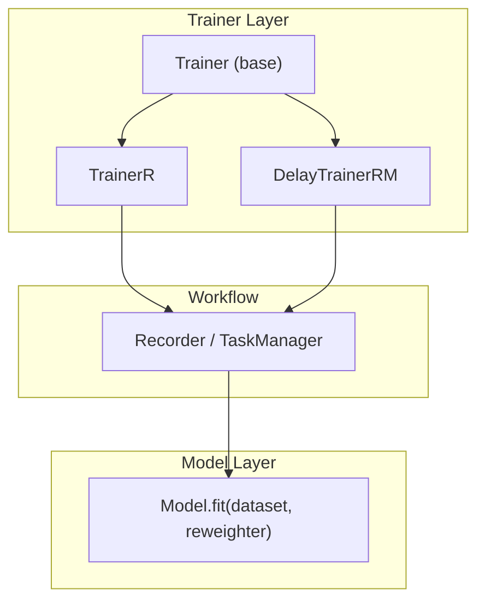
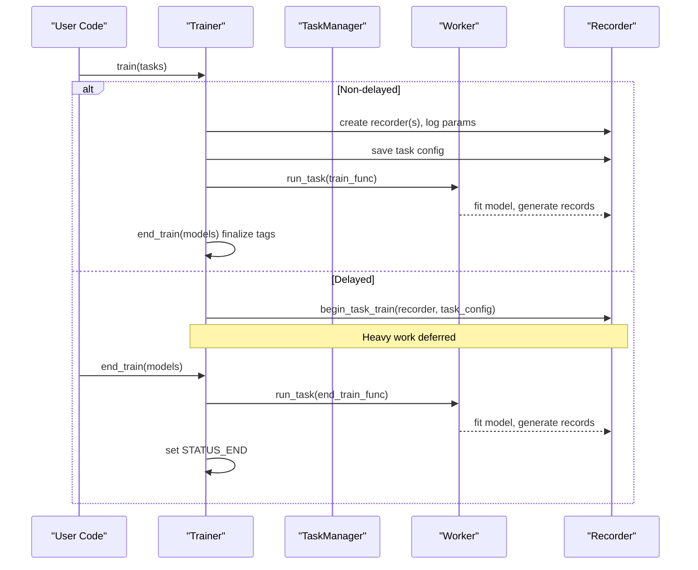
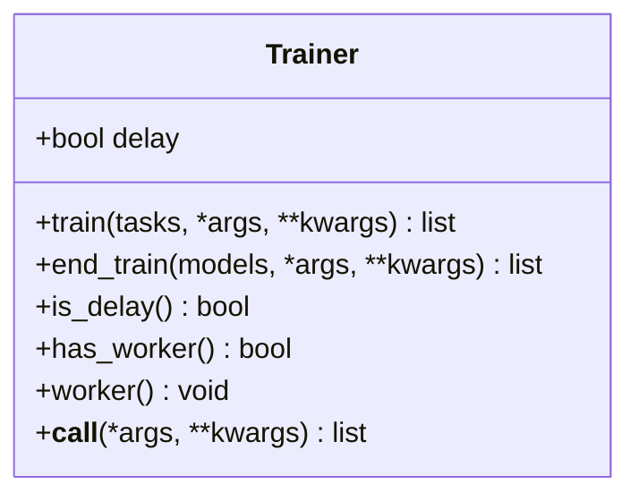
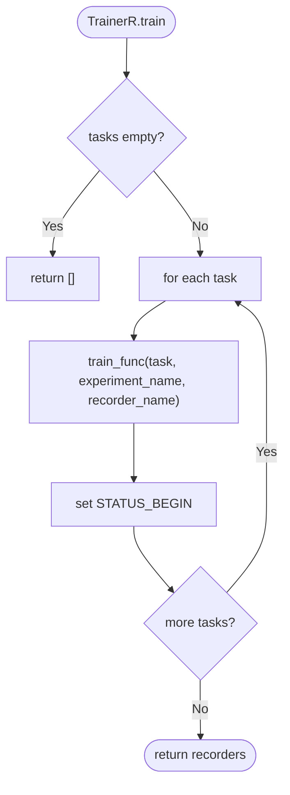
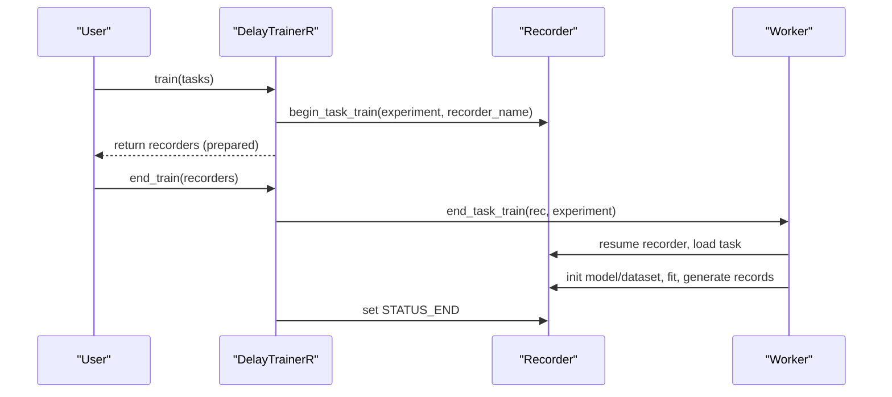
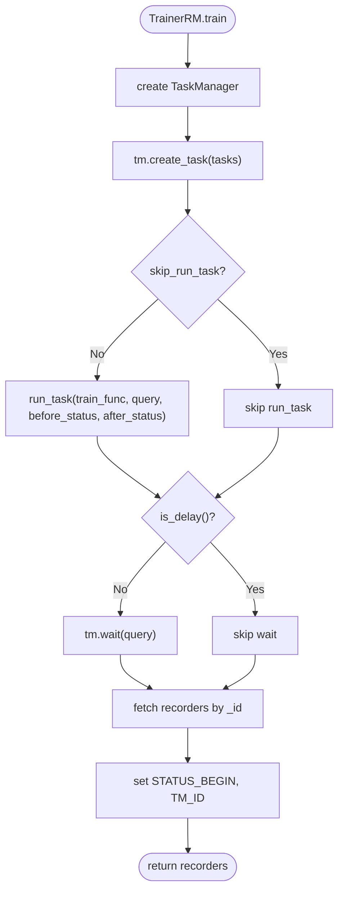
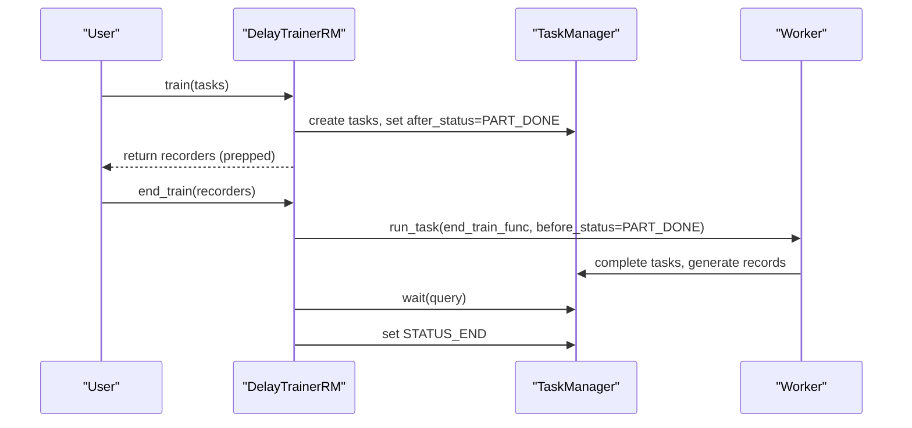
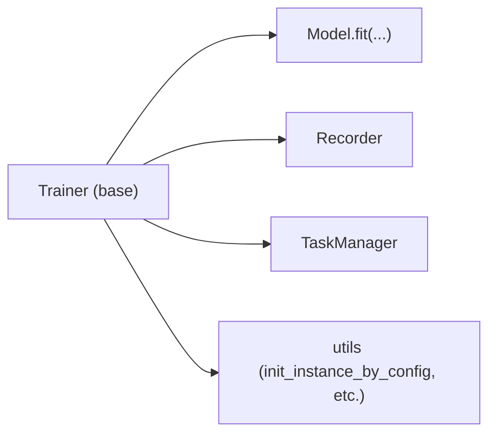

# Base Trainer Interface

<cite>
**Referenced Files in This Document**
- [trainer.py](file://qlib/model/trainer.py)
- [base.py](file://qlib/model/base.py)
- [manager.py](file://qlib/workflow/online/manager.py)
</cite>

## Table of Contents
1. [Introduction](#introduction)
2. [Project Structure](#project-structure)
3. [Core Components](#core-components)
4. [Architecture Overview](#architecture-overview)
5. [Detailed Component Analysis](#detailed-component-analysis)
6. [Dependency Analysis](#dependency-analysis)
7. [Performance Considerations](#performance-considerations)
8. [Troubleshooting Guide](#troubleshooting-guide)
9. [Conclusion](#conclusion)

## Introduction
This document explains the base Trainer interface in QLib and its lifecycle pattern for training tasks. It focuses on the core abstract methods train(), end_train(), is_delay(), has_worker(), and worker(). The key idea is a two-phase training pattern:
- train() performs preparation work (e.g., creating recorders, saving task configs).
- end_train() completes the actual training (e.g., model fitting, generating predictions).

The delay mechanism separates setup from execution to enable flexible scheduling patterns such as parallel or distributed training across processes or machines.

## Project Structure
The Trainer interface and its implementations live under qlib/model/trainer.py. Related concepts include:
- Model.fit() used by trainers during task execution.
- Online manager documentation that describes how DelayTrainer integrates with online workflows.

**Diagram sources**
- [trainer.py:131-206](file://qlib/model/trainer.py#L131-L206)
- [trainer.py:209-290](file://qlib/model/trainer.py#L209-L290)
- [trainer.py:341-488](file://qlib/model/trainer.py#L341-L488)
- [base.py:22-60](file://qlib/model/base.py#L22-L60)

**Section sources**
- [trainer.py:131-206](file://qlib/model/trainer.py#L131-L206)
- [base.py:22-60](file://qlib/model/base.py#L22-L60)

## Core Components
- Trainer (base): Defines the contract for training orchestration with two phases and optional worker support.
- TrainerR: Recorder-based trainer that runs training in a linear fashion using a configurable train function.
- DelayTrainerR: Delayed variant where train() prepares tasks and end_train() executes them.
- TrainerRM: TaskManager-based trainer enabling multiprocessing via run_task and status management.
- DelayTrainerRM: Delayed variant of TrainerRM that defers heavy work to end_train() and supports separate workers.

Key methods:
- train(tasks, ...): Prepare and optionally execute training; returns models (often Recorders).
- end_train(models, ...): Finalize training; may perform heavy operations like model fitting.
- is_delay(): Indicates whether this trainer delays real training until end_train().
- has_worker(): Indicates if the trainer provides a worker() method for background execution.
- worker(...): Starts a backend worker to execute training asynchronously.

**Section sources**
- [trainer.py:131-206](file://qlib/model/trainer.py#L131-L206)
- [trainer.py:209-290](file://qlib/model/trainer.py#L209-L290)
- [trainer.py:341-488](file://qlib/model/trainer.py#L341-L488)
- [trainer.py:491-619](file://qlib/model/trainer.py#L491-L619)

## Architecture Overview
The Trainer interface enforces a consistent lifecycle:
- Immediate trainers (non-delayed): train() does the heavy lifting; end_train() finalizes.
- Delay trainers: train() only prepares; end_train() executes the heavy work.

This separation enables:
- Parallelization across multiple workers or machines.
- Decoupling of task submission from execution.
- Integration with TaskManager for distributed task queues.

**Diagram sources**
- [trainer.py:74-128](file://qlib/model/trainer.py#L74-L128)
- [trainer.py:209-290](file://qlib/model/trainer.py#L209-L290)
- [trainer.py:341-488](file://qlib/model/trainer.py#L341-L488)
- [trainer.py:491-619](file://qlib/model/trainer.py#L491-L619)

## Detailed Component Analysis

### Base Trainer Interface
- train(tasks, *args, **kwargs): Abstract; must be implemented by subclasses. For immediate trainers, do all work here; for delayed trainers, prepare only.
- end_train(models, *args, **kwargs): Optional finalization; default returns models unchanged.
- is_delay(): Returns self.delay; True for DelayTrainers.
- has_worker(): Default False; overridden to True when worker() is supported.
- worker(): Abstract; raises NotImplementedError unless implemented.

Lifecycle hook:
- __call__(*args, **kwargs): Convenience wrapper that calls train() then end_train().

**Diagram sources**
- [trainer.py:131-206](file://qlib/model/trainer.py#L131-L206)

**Section sources**
- [trainer.py:131-206](file://qlib/model/trainer.py#L131-L206)

### TrainerR (Recorder-based Trainer)
- train(tasks, ...): Iterates tasks, invokes a train function (default task_train), creates recorders, sets BEGIN status tag.
- end_train(models, ...): Sets END status tag on each recorder.
- Supports optional subprocess execution to force memory release.

**Diagram sources**
- [trainer.py:243-274](file://qlib/model/trainer.py#L243-L274)
- [trainer.py:276-290](file://qlib/model/trainer.py#L276-L290)

**Section sources**
- [trainer.py:209-290](file://qlib/model/trainer.py#L209-L290)

### DelayTrainerR (Delayed Recorder-based Trainer)
- train(tasks, ...): Uses begin_task_train to start recording and save task configuration without executing heavy work.
- end_train(models, ...): Executes end_task_train to load task config, initialize model/dataset, call model.fit(), generate records, and mark END status.

**Diagram sources**
- [trainer.py:293-338](file://qlib/model/trainer.py#L293-L338)
- [trainer.py:74-105](file://qlib/model/trainer.py#L74-L105)

**Section sources**
- [trainer.py:293-338](file://qlib/model/trainer.py#L293-L338)

### TrainerRM (TaskManager-based Trainer)
- train(tasks, ...): Creates tasks in TaskManager, optionally runs them immediately via run_task, waits unless delayed, retrieves recorders, sets BEGIN and TM_ID tags.
- end_train(recs, ...): Sets END status tag.
- worker(train_func, experiment_name): Starts a worker process to execute run_task against the shared task pool.
- has_worker(): Returns True.

**Diagram sources**
- [trainer.py:384-448](file://qlib/model/trainer.py#L384-L448)
- [trainer.py:466-488](file://qlib/model/trainer.py#L466-L488)

**Section sources**
- [trainer.py:341-488](file://qlib/model/trainer.py#L341-L488)

### DelayTrainerRM (Delayed TaskManager-based Trainer)
- train(tasks, ...): Forces after_status=STATUS_PART_DONE so tasks are queued but not fully completed; defers heavy work.
- end_train(recs, ...): Runs end_task_train via run_task with before_status=STATUS_PART_DONE, waits for completion, marks END.
- worker(end_train_func, experiment_name): Starts a worker to execute end_task_train.
- has_worker(): Returns True.

**Diagram sources**
- [trainer.py:491-619](file://qlib/model/trainer.py#L491-L619)

**Section sources**
- [trainer.py:491-619](file://qlib/model/trainer.py#L491-L619)

### Delay Mechanism and Scheduling Patterns
- Delay flag: is_delay() indicates whether heavy work is deferred to end_train().
- Status tags: STATUS_BEGIN and STATUS_END track progress; PART_DONE allows partial completion for later finishing.
- Worker support: has_worker() and worker() enable offloading execution to separate processes/machines.

Integration note:
- Online workflows can use DelayTrainer to avoid blocking while preparing tasks across strategies, then schedule real training at the end of routines.

**Section sources**
- [trainer.py:131-206](file://qlib/model/trainer.py#L131-L206)
- [trainer.py:293-338](file://qlib/model/trainer.py#L293-L338)
- [trainer.py:491-619](file://qlib/model/trainer.py#L491-L619)
- [manager.py:23-36](file://qlib/workflow/online/manager.py#L23-L36)

## Dependency Analysis
- Trainer depends on:
  - Dataset and Reweighter via Model.fit() during task execution.
  - Recorder and TaskManager for state persistence and distributed task coordination.
  - Utilities for logging, parameter flattening, and instance initialization.

**Diagram sources**
- [trainer.py:131-206](file://qlib/model/trainer.py#L131-L206)
- [base.py:22-60](file://qlib/model/base.py#L22-L60)

**Section sources**
- [trainer.py:131-206](file://qlib/model/trainer.py#L131-L206)
- [base.py:22-60](file://qlib/model/base.py#L22-L60)

## Performance Considerations
- Use DelayTrainer variants to decouple task preparation from heavy computation, enabling parallel or distributed execution via worker() and TaskManager.
- TrainerR supports running training in a subprocess to force memory release when needed.
- Avoid unnecessary waiting in non-delayed trainers; leverage status flags to control flow.

[No sources needed since this section provides general guidance]

## Troubleshooting Guide
Common issues and checks:
- NotImplementedError for train() or worker(): Ensure your custom trainer implements required methods.
- Tasks not completing: Verify TaskManager status transitions (WAITING -> PART_DONE -> DONE) and that worker() is invoked appropriately.
- Memory pressure: Enable subprocess execution in TrainerR or split work across workers.
- Incorrect tagging: Confirm STATUS_BEGIN and STATUS_END are set consistently to track lifecycle.

**Section sources**
- [trainer.py:131-206](file://qlib/model/trainer.py#L131-L206)
- [trainer.py:209-290](file://qlib/model/trainer.py#L209-L290)
- [trainer.py:341-488](file://qlib/model/trainer.py#L341-L488)
- [trainer.py:491-619](file://qlib/model/trainer.py#L491-L619)

## Conclusion
QLib’s Trainer interface standardizes training orchestration through a two-phase lifecycle:
- train() handles preparation and optional lightweight execution.
- end_train() finalizes training, including heavy operations like model fitting and record generation.

The delay mechanism and worker support provide flexible scheduling for parallel and distributed scenarios. Implementing a custom trainer involves extending Trainer (or an existing implementation) and overriding train(), end_train(), and optionally worker() and has_worker() to match your workflow needs.

[No sources needed since this section summarizes without analyzing specific files]