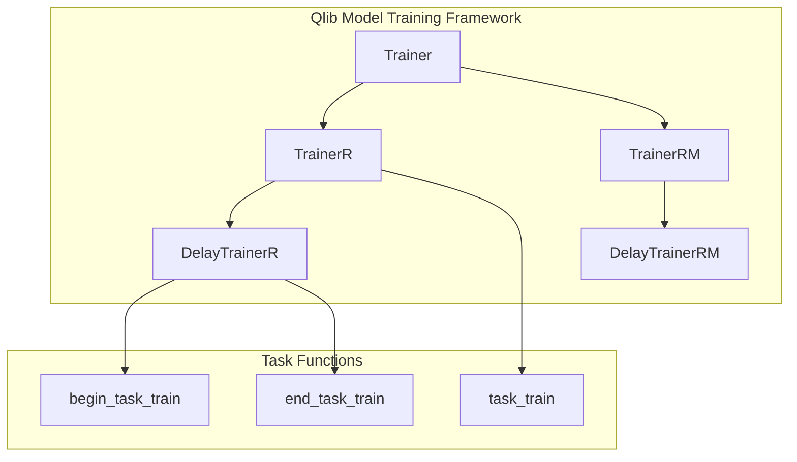
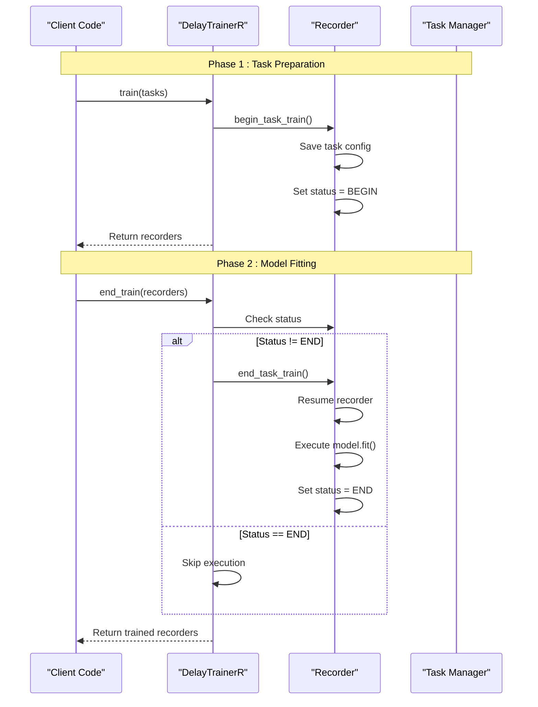
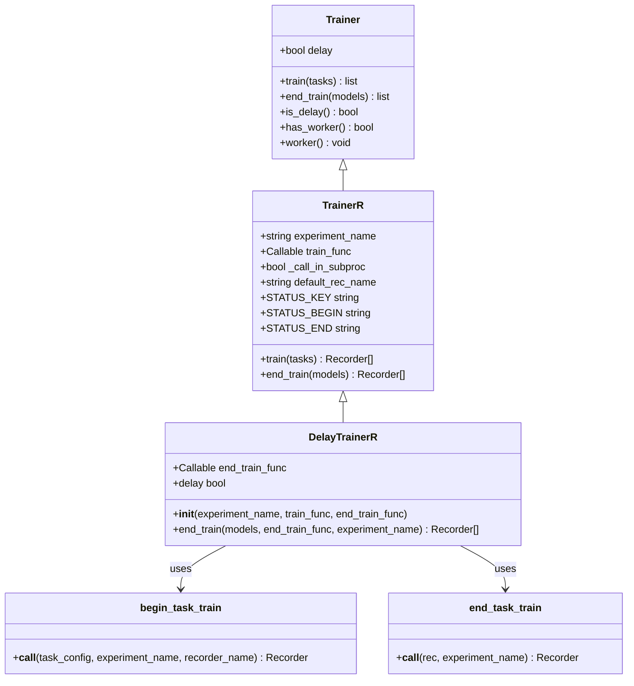
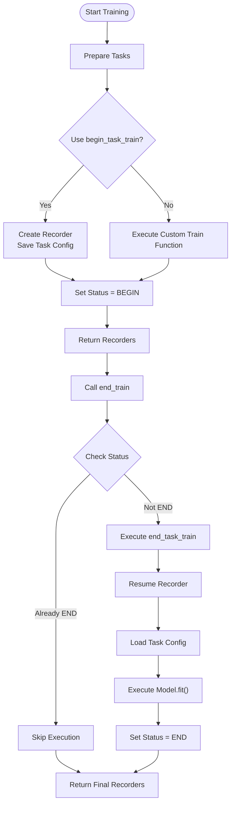
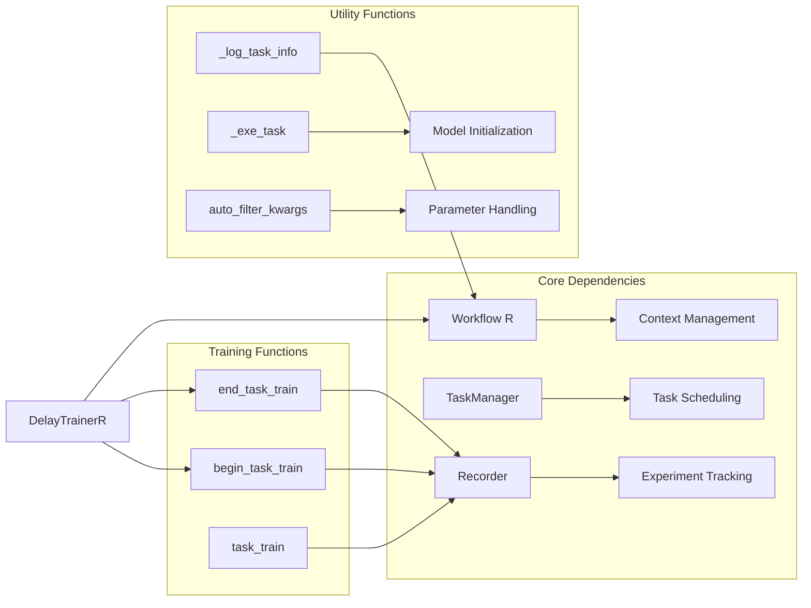

# DelayTrainerR Implementation

<cite>
**Referenced Files in This Document**
- [trainer.py](file://qlib/model/trainer.py)
- [rolling_online_management.py](file://examples/online_srv/rolling_online_management.py)
- [manager.py](file://qlib/workflow/online/manager.py)
</cite>

## Table of Contents
1. [Introduction](#introduction)
2. [Project Structure](#project-structure)
3. [Core Components](#core-components)
4. [Architecture Overview](#architecture-overview)
5. [Detailed Component Analysis](#detailed-component-analysis)
6. [Dependency Analysis](#dependency-analysis)
7. [Performance Considerations](#performance-considerations)
8. [Troubleshooting Guide](#troubleshooting-guide)
9. [Conclusion](#conclusion)

## Introduction
DelayTrainerR is a delayed execution trainer that separates task preparation from actual model fitting. It extends TrainerR to support scenarios where setup and execution happen at different times or locations, enabling resource optimization by decoupling lightweight task scheduling from heavy training workloads.

Key benefits:
- Separates begin_task_train (task preparation) from end_task_train (model fitting)
- Enables parallel execution across processes or machines
- Supports flexible configuration through custom train_func and end_train_func parameters
- Integrates with Qlib's Recorder system for experiment tracking and state management

## Project Structure
The DelayTrainerR implementation is part of Qlib's model training framework, located within the trainer module alongside related components like TrainerR, TrainerRM, and DelayTrainerRM.

**Diagram sources**
- [trainer.py:131-183](file://qlib/model/trainer.py#L131-L183)
- [trainer.py:209-290](file://qlib/model/trainer.py#L209-L290)
- [trainer.py:293-338](file://qlib/model/trainer.py#L293-L338)

**Section sources**
- [trainer.py:1-620](file://qlib/model/trainer.py#L1-L620)

## Core Components
DelayTrainerR provides delayed execution capabilities through two main phases:

### Task Preparation Phase (train method)
- Creates recorders and saves task configurations
- Sets up experiment context using begin_task_train function
- Marks tasks as ready for later execution

### Model Fitting Phase (end_train method)  
- Resumes saved recorders and executes actual training
- Uses end_task_train function to perform model fitting
- Updates task status to completion

### Configuration Options
- **experiment_name**: Default experiment name for task organization
- **train_func**: Customizable function for task preparation (default: begin_task_train)
- **end_train_func**: Customizable function for model fitting (default: end_task_train)

**Section sources**
- [trainer.py:293-338](file://qlib/model/trainer.py#L293-L338)

## Architecture Overview
The DelayTrainerR architecture implements a two-phase training pattern that enables flexible resource allocation and parallel execution.

**Diagram sources**
- [trainer.py:74-105](file://qlib/model/trainer.py#L74-L105)
- [trainer.py:293-338](file://qlib/model/trainer.py#L293-L338)

## Detailed Component Analysis

### DelayTrainerR Class Structure
DelayTrainerR extends TrainerR to provide delayed execution capabilities while maintaining compatibility with the existing trainer interface.

**Diagram sources**
- [trainer.py:131-183](file://qlib/model/trainer.py#L131-L183)
- [trainer.py:209-290](file://qlib/model/trainer.py#L209-L290)
- [trainer.py:293-338](file://qlib/model/trainer.py#L293-L338)
- [trainer.py:74-105](file://qlib/model/trainer.py#L74-L105)

### Task Execution Flow
The delayed execution pattern follows a specific flow that ensures proper state management and resource utilization.

**Diagram sources**
- [trainer.py:293-338](file://qlib/model/trainer.py#L293-L338)
- [trainer.py:74-105](file://qlib/model/trainer.py#L74-L105)

### Integration with Online Management
DelayTrainerR integrates seamlessly with Qlib's online management system for rolling updates and continuous learning scenarios.

**Section sources**
- [rolling_online_management.py:16-30](file://examples/online_srv/rolling_online_management.py#L16-L30)
- [manager.py:23-36](file://qlib/workflow/online/manager.py#L23-L36)

## Dependency Analysis
DelayTrainerR has several key dependencies that enable its delayed execution functionality.

**Diagram sources**
- [trainer.py:36-71](file://qlib/model/trainer.py#L36-L71)
- [trainer.py:74-128](file://qlib/model/trainer.py#L74-L128)

**Section sources**
- [trainer.py:1-620](file://qlib/model/trainer.py#L1-L620)

## Performance Considerations
DelayTrainerR provides several performance optimization opportunities:

### Resource Optimization Scenarios
- **Separate CPU/GPU Workflows**: Schedule tasks on CPU, execute training on GPU
- **Batch Processing**: Group multiple tasks for efficient resource utilization
- **Memory Management**: Defer memory-intensive operations until resources are available
- **Parallel Execution**: Run multiple delayed tasks concurrently across processes

### Best Practices
- Use `skip_run_task` parameter for distributed training scenarios
- Leverage TaskManager for large-scale task orchestration
- Monitor memory usage during delayed execution phases
- Implement proper error handling for failed delayed tasks

## Troubleshooting Guide
Common issues and solutions when working with DelayTrainerR:

### Status Management Issues
- **Problem**: Tasks stuck in BEGIN status
- **Solution**: Ensure end_train is called with correct experiment_name
- **Verification**: Check recorder tags using list_tags()

### Resource Conflicts
- **Problem**: Memory exhaustion during delayed execution
- **Solution**: Use subprocess execution with call_in_subproc parameter
- **Prevention**: Monitor memory usage and implement cleanup strategies

### Experiment Context Problems
- **Problem**: Cannot resume recorder in end_train phase
- **Solution**: Verify experiment_name matches between phases
- **Debugging**: Check recorder.info for proper ID assignment

**Section sources**
- [trainer.py:293-338](file://qlib/model/trainer.py#L293-L338)

## Conclusion
DelayTrainerR provides a powerful abstraction for implementing delayed execution patterns in machine learning workflows. By separating task preparation from model fitting, it enables flexible resource allocation, parallel execution, and optimized training pipelines. The configurable architecture supports various deployment scenarios while maintaining compatibility with Qlib's existing training infrastructure.

Key advantages include:
- Decoupled task scheduling and execution
- Flexible resource allocation across different environments
- Seamless integration with Qlib's experiment tracking system
- Support for both local and distributed training scenarios

The implementation demonstrates best practices for building extensible training frameworks that can adapt to diverse computational requirements and deployment constraints.