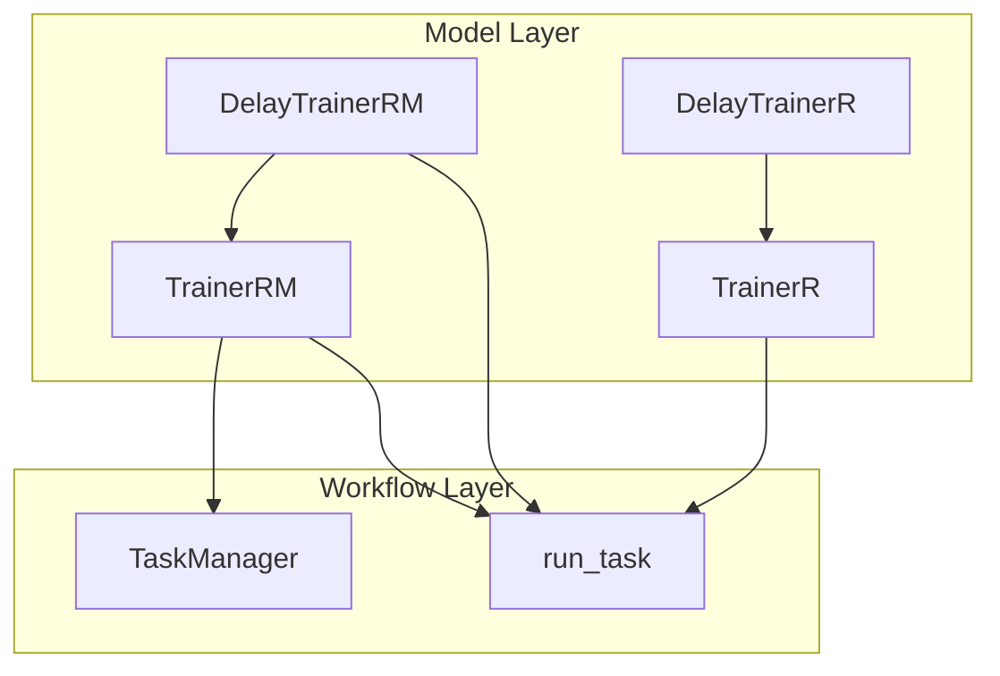
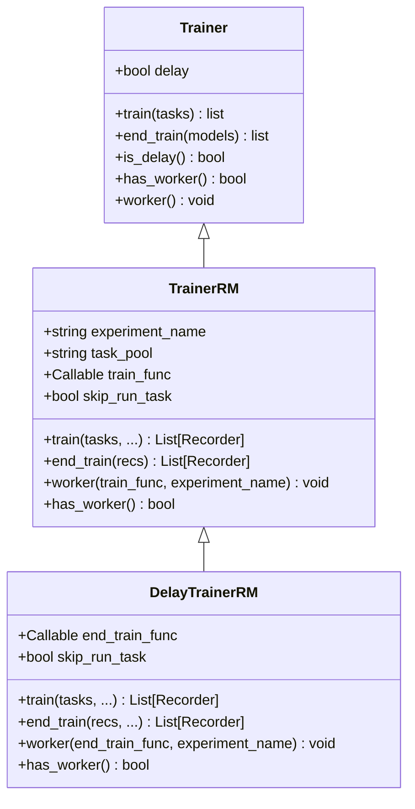
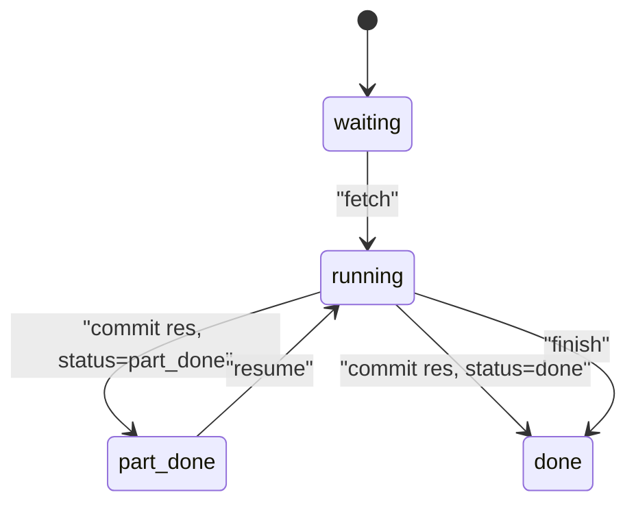
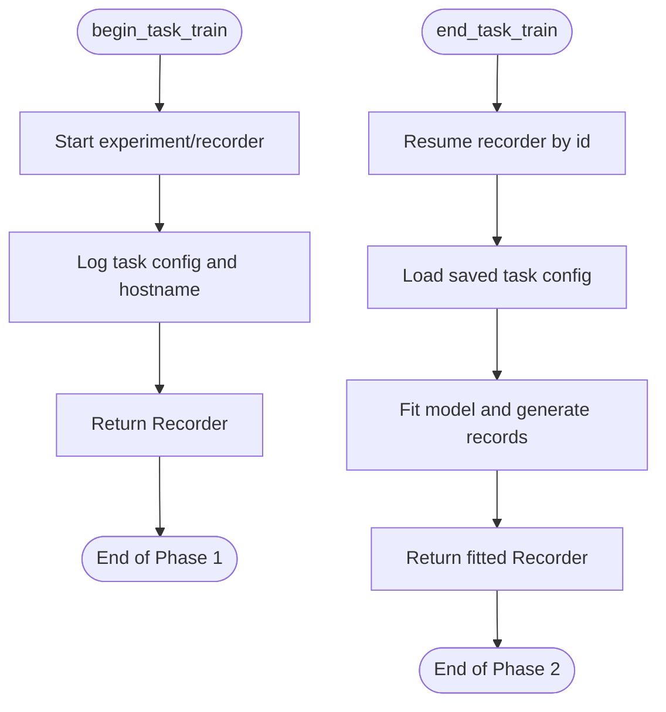
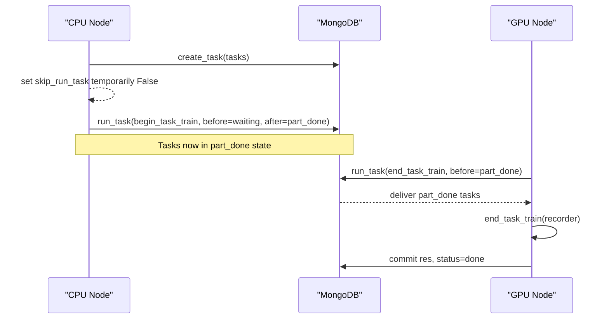
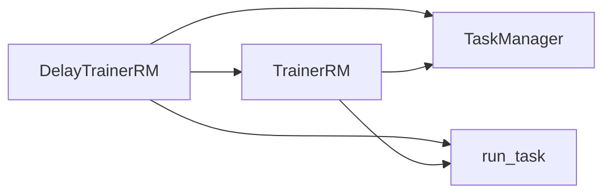

# DelayTrainerRM Implementation

<cite>
**Referenced Files in This Document**
- [trainer.py](file://qlib/model/trainer.py)
- [manage.py](file://qlib/workflow/task/manage.py)
</cite>

## Table of Contents
1. [Introduction](#introduction)
2. [Project Structure](#project-structure)
3. [Core Components](#core-components)
4. [Architecture Overview](#architecture-overview)
5. [Detailed Component Analysis](#detailed-component-analysis)
6. [Dependency Analysis](#dependency-analysis)
7. [Performance Considerations](#performance-considerations)
8. [Troubleshooting Guide](#troubleshooting-guide)
9. [Conclusion](#conclusion)
10. [Appendices](#appendices)

## Introduction
This document explains the DelayTrainerRM implementation that combines a two-phase training pattern with task manager capabilities. It enables:
- Phase 1 (preparation): begin_task_train creates and persists task definitions and recorder metadata, marking tasks as partially done.
- Phase 2 (fitting): end_task_train resumes persisted tasks to perform actual model fitting and record generation.

It also documents the PART_DONE status mechanism for multi-step workflows, the skip_run_task feature for CPU-to-GPU separation scenarios, and provides examples of distributed delayed training across different compute resources.

## Project Structure
DelayTrainerRM is part of Qlib’s model training layer and integrates with the workflow task management subsystem:
- Model trainers define high-level orchestration and two-phase semantics.
- TaskManager and run_task provide persistent task lifecycle control and execution scheduling.



**Diagram sources**
- [trainer.py:341-488](file://qlib/model/trainer.py#L341-L488)
- [trainer.py:491-619](file://qlib/model/trainer.py#L491-L619)
- [manage.py:35-82](file://qlib/workflow/task/manage.py#L35-L82)
- [manage.py:485-521](file://qlib/workflow/task/manage.py#L485-L521)

**Section sources**
- [trainer.py:1-12](file://qlib/model/trainer.py#L1-L12)
- [manage.py:1-14](file://qlib/workflow/task/manage.py#L1-L14)

## Core Components
- DelayTrainerRM: A delayed trainer that splits training into preparation (train) and fitting (end_train), using TaskManager to coordinate multi-step execution.
- TrainerRM: Base class providing task creation, querying, and worker support via TaskManager.
- TaskManager: Persistent task store and lifecycle manager with statuses: waiting, running, part_done, done.
- run_task: Worker loop that fetches tasks by status and executes user-provided functions, updating status accordingly.
- begin_task_train/end_task_train: Two-phase functions that create recorders and later resume them to fit models and generate records.

Key behaviors:
- train() sets after_status=STATUS_PART_DONE so tasks are marked partially done after preparation.
- end_train() runs only on tasks with STATUS_PART_DONE, performs real fitting, then marks tasks complete.
- skip_run_task allows decoupling where preparation runs on one machine (e.g., CPU) and fitting runs on another (e.g., GPU).

**Section sources**
- [trainer.py:74-128](file://qlib/model/trainer.py#L74-L128)
- [trainer.py:341-488](file://qlib/model/trainer.py#L341-L488)
- [trainer.py:491-619](file://qlib/model/trainer.py#L491-L619)
- [manage.py:35-82](file://qlib/workflow/task/manage.py#L35-L82)
- [manage.py:485-521](file://qlib/workflow/task/manage.py#L485-L521)

## Architecture Overview
The two-phase flow leverages TaskManager to persist intermediate state and enable asynchronous or cross-machine execution.

```mermaid
sequenceDiagram
participant User as "User Code"
participant DT as "DelayTrainerRM"
participant TM as "TaskManager"
participant RT as "run_task"
participant Rec as "Recorder"
User->>DT : train(tasks, experiment_name)
DT->>TM : create_task(tasks)
TM-->>DT : _id_list
alt skip_run_task == False
DT->>RT : run_task(begin_task_train, before=waiting, after=part_done)
RT->>Rec : begin_task_train(task_def)
Rec-->>RT : Recorder
RT->>TM : commit_task_res(res=Recorder, status=part_done)
else skip_run_task == True
Note over DT : Preparation skipped here; will be done elsewhere
end
DT-->>User : list of Recorders (tagged with TM_ID)
User->>DT : end_train(recs, experiment_name)
DT->>RT : run_task(end_task_train, before=part_done)
RT->>Rec : end_task_train(recorder)
Rec-->>RT : Recorder (fitted)
RT->>TM : commit_task_res(res=Recorder, status=done)
DT->>TM : wait(query=_id_list)
DT-->>User : completed Recorders
```

**Diagram sources**
- [trainer.py:524-550](file://qlib/model/trainer.py#L524-L550)
- [trainer.py:552-594](file://qlib/model/trainer.py#L552-L594)
- [manage.py:485-521](file://qlib/workflow/task/manage.py#L485-L521)

## Detailed Component Analysis

### DelayTrainerRM Class
- Purpose: Implements two-phase training with TaskManager integration.
- Key parameters:
  - experiment_name: default experiment name.
  - task_pool: MongoDB collection name for tasks.
  - train_func: defaults to begin_task_train.
  - end_train_func: defaults to end_task_train.
  - skip_run_task: when True, skips immediate execution in train(), enabling CPU-to-GPU separation.
- Behavior:
  - train(): ensures preparation always runs (temporarily disables skip_run_task), calls parent TrainerRM.train with after_status=STATUS_PART_DONE, returns Recorders tagged with TM_ID.
  - end_train(): collects TM IDs from Recorders, runs end_task_train on tasks with STATUS_PART_DONE, waits for completion, and tags Recorders as finished.
  - worker(): convenience method to run end_task_train loop on a separate process/machine.



**Diagram sources**
- [trainer.py:131-206](file://qlib/model/trainer.py#L131-L206)
- [trainer.py:341-488](file://qlib/model/trainer.py#L341-L488)
- [trainer.py:491-619](file://qlib/model/trainer.py#L491-L619)

**Section sources**
- [trainer.py:491-619](file://qlib/model/trainer.py#L491-L619)

### TaskManager Status Mechanism (PART_DONE)
- Statuses:
  - waiting: new tasks awaiting execution.
  - running: currently being executed.
  - part_done: partial completion; ready for next phase.
  - done: fully completed.
- run_task transitions:
  - waiting -> done: full single-step training.
  - waiting -> part_done: first phase (preparation).
  - part_done -> part_done: resume partial work without finishing.
  - part_done -> done: second phase (fitting) completes the task.



**Diagram sources**
- [manage.py:35-82](file://qlib/workflow/task/manage.py#L35-L82)
- [manage.py:485-521](file://qlib/workflow/task/manage.py#L485-L521)

**Section sources**
- [manage.py:35-82](file://qlib/workflow/task/manage.py#L35-L82)
- [manage.py:485-521](file://qlib/workflow/task/manage.py#L485-L521)

### Two-Phase Training Functions
- begin_task_train:
  - Starts an experiment and recorder, logs task config, and returns the Recorder instance.
- end_task_train:
  - Resumes the Recorder by id, loads the saved task config, executes model fitting and record generation, and returns the updated Recorder.



**Diagram sources**
- [trainer.py:74-128](file://qlib/model/trainer.py#L74-L128)

**Section sources**
- [trainer.py:74-128](file://qlib/model/trainer.py#L74-L128)

### skip_run_task Feature for CPU-to-GPU Separation
- When skip_run_task=True:
  - train() still prepares tasks (creates task entries and begins recording) but does not execute begin_task_train immediately.
  - The caller can submit these tasks to a GPU worker process/machine that runs end_train or worker() to perform fitting.
- Typical usage:
  - Submit preparation on a CPU node.
  - Run workers on GPU nodes to consume part_done tasks and complete fitting.



**Diagram sources**
- [trainer.py:524-550](file://qlib/model/trainer.py#L524-L550)
- [trainer.py:552-594](file://qlib/model/trainer.py#L552-L594)
- [manage.py:485-521](file://qlib/workflow/task/manage.py#L485-L521)

**Section sources**
- [trainer.py:497-522](file://qlib/model/trainer.py#L497-L522)
- [trainer.py:524-550](file://qlib/model/trainer.py#L524-L550)
- [trainer.py:552-594](file://qlib/model/trainer.py#L552-L594)

### Distributed Delayed Training Workflows
- Single-node multi-process:
  - Use DelayTrainerRM with default settings; train() prepares tasks and end_train() completes them within the same process.
- Multi-node CPU/GPU split:
  - On CPU node: call train() with skip_run_task=True to prepare tasks and mark them part_done.
  - On GPU node(s): start worker() or call end_train() to consume part_done tasks and finish fitting.
- Cross-machine coordination:
  - Share the same task_pool (MongoDB collection) across processes/machines.
  - Use query filters to scope workers to specific experiments or subsets of tasks.

**Section sources**
- [trainer.py:491-619](file://qlib/model/trainer.py#L491-L619)
- [manage.py:485-521](file://qlib/workflow/task/manage.py#L485-L521)

## Dependency Analysis
- DelayTrainerRM depends on:
  - TrainerRM for task creation and worker scaffolding.
  - TaskManager for persistent task storage and status transitions.
  - run_task for executing phases based on status.
- Coupling:
  - Tight coupling between trainer phases and TaskManager statuses ensures consistent multi-step workflows.
  - Loose coupling via callable functions (begin_task_train, end_task_train) allows customization.



**Diagram sources**
- [trainer.py:341-488](file://qlib/model/trainer.py#L341-L488)
- [trainer.py:491-619](file://qlib/model/trainer.py#L491-L619)
- [manage.py:35-82](file://qlib/workflow/task/manage.py#L35-L82)
- [manage.py:485-521](file://qlib/workflow/task/manage.py#L485-L521)

**Section sources**
- [trainer.py:341-488](file://qlib/model/trainer.py#L341-L488)
- [trainer.py:491-619](file://qlib/model/trainer.py#L491-L619)
- [manage.py:35-82](file://qlib/workflow/task/manage.py#L35-L82)
- [manage.py:485-521](file://qlib/workflow/task/manage.py#L485-L521)

## Performance Considerations
- Two-phase design reduces blocking time in preparation; heavy fitting can be deferred and parallelized across workers.
- Using skip_run_task enables resource isolation: lightweight preparation on CPU, intensive fitting on GPU.
- TaskManager.wait() prevents premature termination and provides progress feedback during long-running jobs.
- Proper scoping via query filters avoids contention among multiple workers processing unrelated tasks.

## Troubleshooting Guide
- Tasks stuck in part_done:
  - Ensure a worker is consuming part_done tasks via run_task with before_status=STATUS_PART_DONE.
  - Verify MongoDB connectivity and that task_pool names match across processes.
- Unexpected early completion:
  - Check that end_task_train is correctly committed with status=done.
- Memory pressure:
  - Use TrainerR’s subprocess option if needed; DelayTrainerRM focuses on task lifecycle rather than memory release.
- Debugging:
  - Inspect task_stat to see counts per status.
  - Use wait() to block until all targeted tasks complete.

**Section sources**
- [manage.py:398-482](file://qlib/workflow/task/manage.py#L398-L482)
- [manage.py:485-521](file://qlib/workflow/task/manage.py#L485-L521)

## Conclusion
DelayTrainerRM provides a robust two-phase training pattern integrated with TaskManager to support flexible, distributed workflows. By leveraging PART_DONE status and skip_run_task, users can decouple preparation and fitting across different compute resources, enabling efficient scaling from single-node to multi-node environments while maintaining clear lifecycle control and observability.

## Appendices

### API Reference Summary
- DelayTrainerRM.__init__: configure experiment_name, task_pool, train_func, end_train_func, skip_run_task.
- DelayTrainerRM.train: prepare tasks, mark part_done, return Recorders with TM_ID tags.
- DelayTrainerRM.end_train: run end_task_train on part_done tasks, wait for completion, tag as done.
- DelayTrainerRM.worker: convenience entrypoint to run end_task_train loop.

**Section sources**
- [trainer.py:497-522](file://qlib/model/trainer.py#L497-L522)
- [trainer.py:524-550](file://qlib/model/trainer.py#L524-L550)
- [trainer.py:552-594](file://qlib/model/trainer.py#L552-L594)
- [trainer.py:596-619](file://qlib/model/trainer.py#L596-L619)