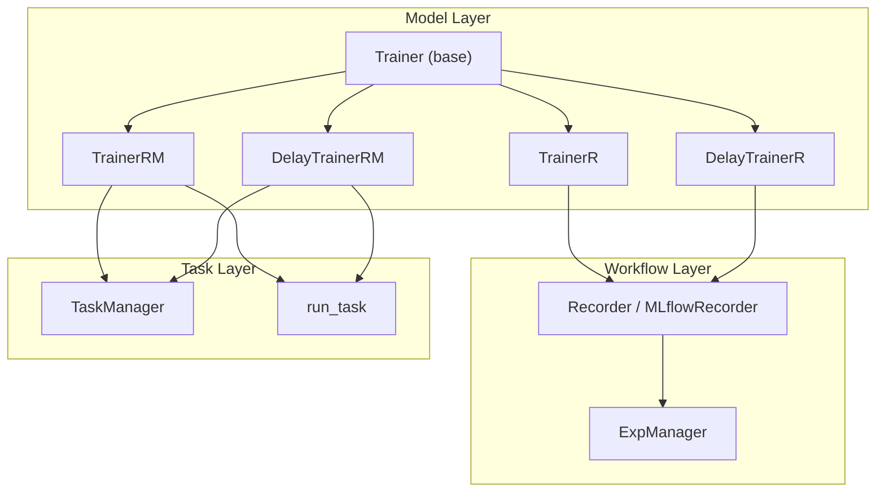
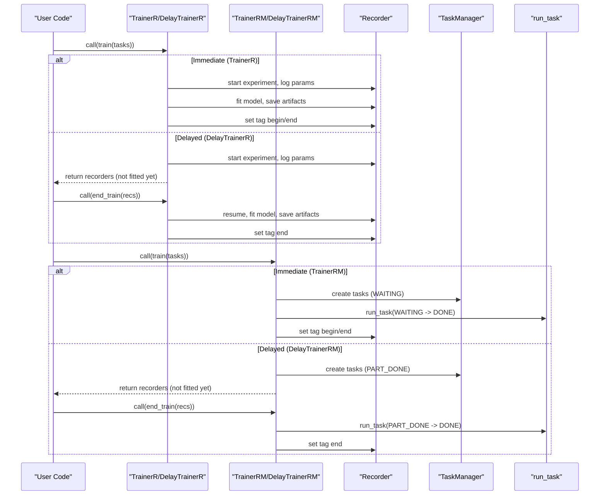
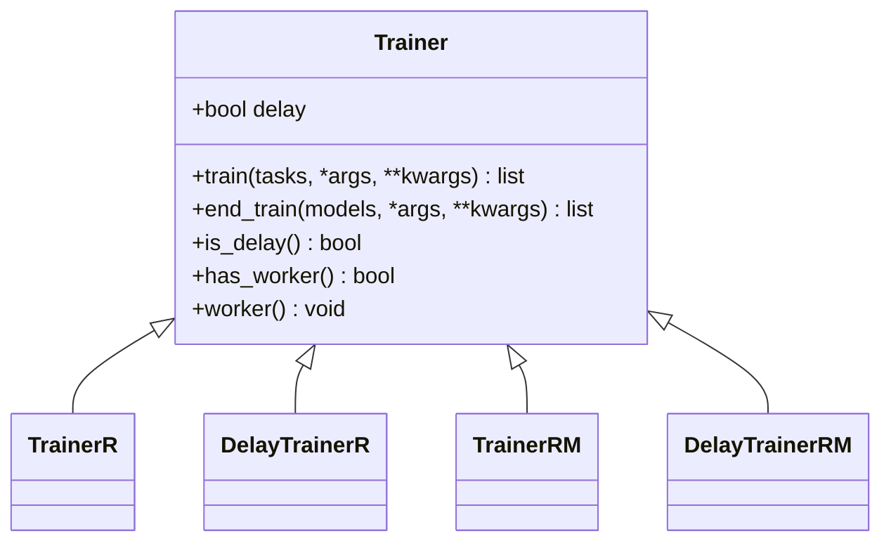
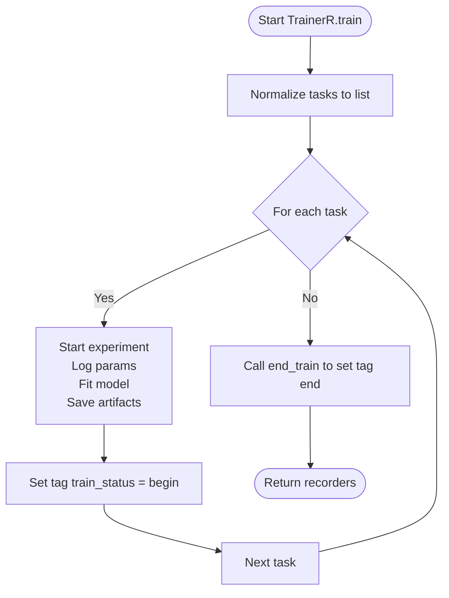
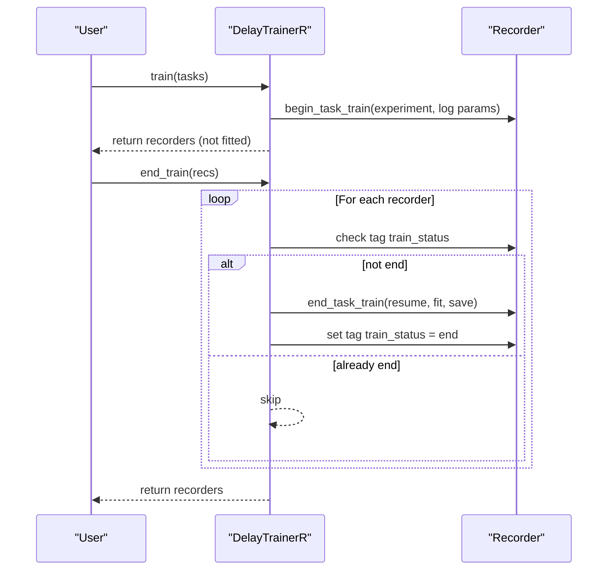
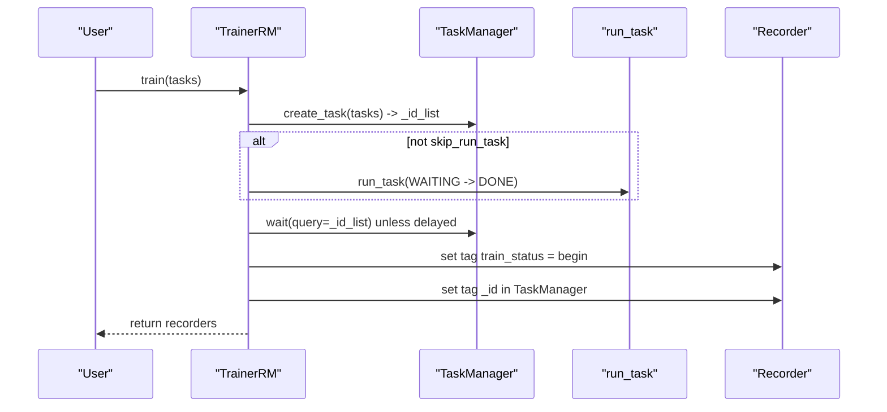
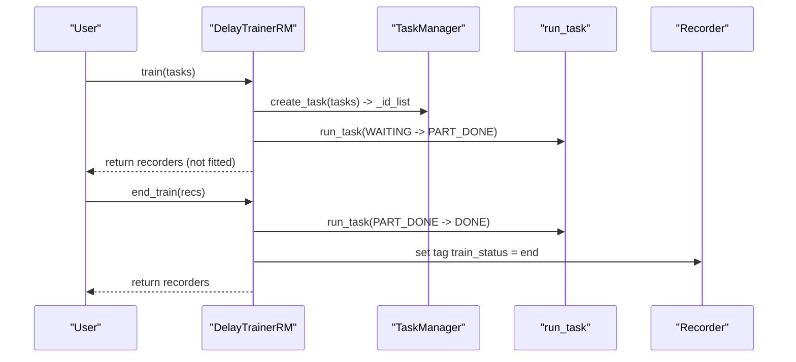
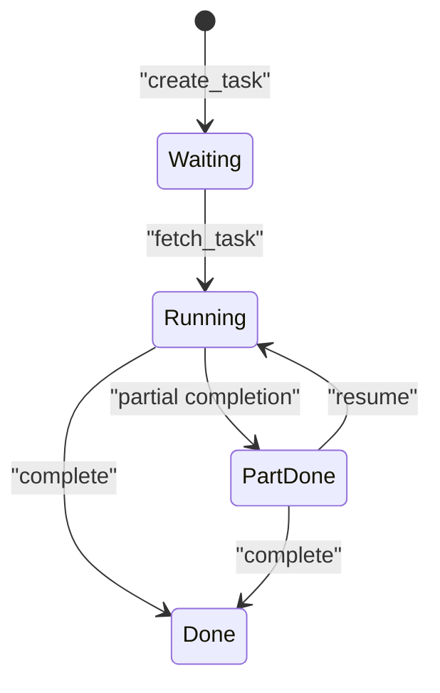
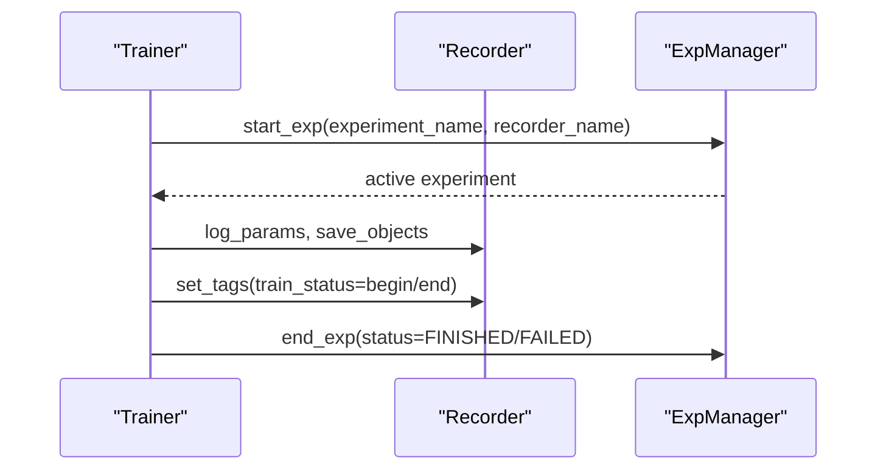
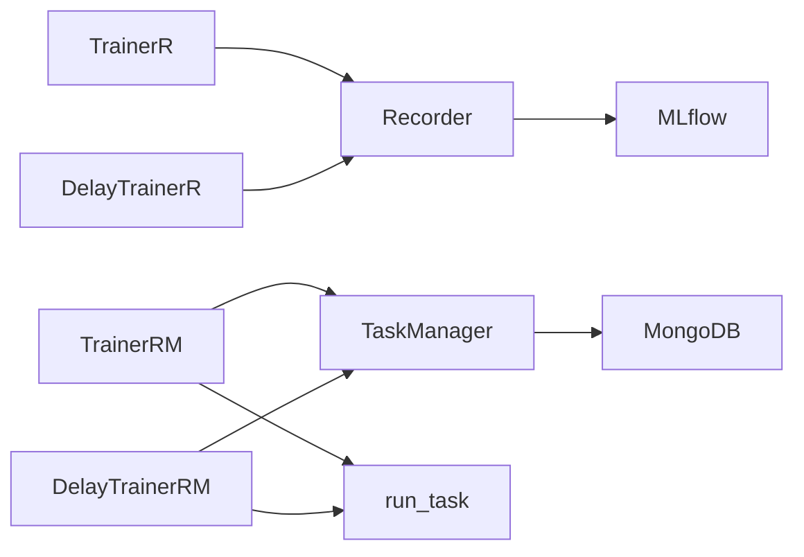

# Trainer Classes and Architecture

<cite>
**Referenced Files in This Document**
- [trainer.py](file://qlib/model/trainer.py)
- [recorder.py](file://qlib/workflow/recorder.py)
- [manage.py](file://qlib/workflow/task/manage.py)
- [base.py](file://qlib/model/base.py)
- [expm.py](file://qlib/workflow/expm.py)
</cite>

## Table of Contents
1. Introduction
2. Project Structure
3. Core Components
4. Architecture Overview
5. Detailed Component Analysis
6. Dependency Analysis
7. Performance Considerations
8. Troubleshooting Guide
9. Conclusion

## Introduction
This document explains QLib’s trainer class hierarchy and architecture for training models across single-process, delayed, and distributed workflows. It covers the base Trainer interface, its core methods (train, end_train, worker), and four concrete implementations:
- TrainerR: simple sequential training using Recorders
- DelayTrainerR: delayed execution where preparation is separated from model fitting
- TrainerRM: task-manager-based parallel training with a shared task pool
- DelayTrainerRM: distributed delayed training that defers heavy work to workers or separate machines

It also documents the trainer lifecycle, state management via status tags, and how trainers coordinate with QLib’s experiment tracking system.

## Project Structure
The trainer subsystem lives under qlib/model and integrates with workflow components for experiment tracking and task management:
- Model layer: base model interfaces and trainer abstractions
- Workflow layer: Recorder and Experiment Manager for logging and artifact storage
- Task layer: TaskManager and run_task for distributed scheduling and lifecycle control

**Diagram sources**
- [trainer.py:131-207](file://qlib/model/trainer.py#L131-L207)
- [trainer.py:209-339](file://qlib/model/trainer.py#L209-L339)
- [trainer.py:341-620](file://qlib/model/trainer.py#L341-L620)
- [recorder.py:28-494](file://qlib/workflow/recorder.py#L28-L494)
- [manage.py:35-559](file://qlib/workflow/task/manage.py#L35-L559)
- [expm.py:22-200](file://qlib/workflow/expm.py#L22-L200)

**Section sources**
- [trainer.py:131-207](file://qlib/model/trainer.py#L131-L207)
- [recorder.py:28-494](file://qlib/workflow/recorder.py#L28-L494)
- [manage.py:35-559](file://qlib/workflow/task/manage.py#L35-L559)
- [expm.py:22-200](file://qlib/workflow/expm.py#L22-L200)

## Core Components
- Base Trainer interface defines the contract for training orchestration:
  - train: prepare and/or execute training; returns models/recordings
  - end_train: finalize training; may be no-op for immediate trainers
  - worker: optional backend worker for distributed execution
  - has_worker: indicates if worker support exists
  - is_delay: indicates whether real training is deferred to end_train
- Concrete trainers:
  - TrainerR: linear, recorder-based training with status tagging
  - DelayTrainerR: separates preparation (begin) from fitting (end)
  - TrainerRM: uses TaskManager to schedule tasks and supports workers
  - DelayTrainerRM: combines delayed execution with task manager for distributed scenarios

Key integration points:
- Experiment tracking via Recorder (MLflow-backed) for parameters, artifacts, metrics, and tags
- TaskManager for distributed scheduling, persistence, and lifecycle states
- Status tags on recorders to track training progress

**Section sources**
- [trainer.py:131-207](file://qlib/model/trainer.py#L131-L207)
- [trainer.py:209-339](file://qlib/model/trainer.py#L209-L339)
- [trainer.py:341-620](file://qlib/model/trainer.py#L341-L620)
- [recorder.py:28-494](file://qlib/workflow/recorder.py#L28-L494)
- [manage.py:35-559](file://qlib/workflow/task/manage.py#L35-L559)

## Architecture Overview
The trainer architecture follows a two-phase pattern for delayed trainers and a single-phase pattern for immediate trainers. Immediate trainers complete all work in train and mark completion in end_train. Delayed trainers split work into:
- Preparation phase (train): create experiments, log parameters, persist task definitions
- Execution phase (end_train): perform heavy operations like model fitting and record generation

Distributed training leverages TaskManager to queue tasks and run_task to fetch and execute them, enabling multi-process or multi-machine execution.

**Diagram sources**
- [trainer.py:209-339](file://qlib/model/trainer.py#L209-L339)
- [trainer.py:341-620](file://qlib/model/trainer.py#L341-L620)
- [manage.py:217-559](file://qlib/workflow/task/manage.py#L217-L559)
- [recorder.py:247-494](file://qlib/workflow/recorder.py#L247-L494)

## Detailed Component Analysis

### Base Trainer Interface
- Purpose: define a uniform API for training orchestration and lifecycle control
- Key methods:
  - train: implement per-trainer logic; immediate trainers do full work here
  - end_train: finalize; delayed trainers do heavy work here
  - worker: optional method to start background workers for distributed execution
  - has_worker: capability flag for worker support
  - is_delay: flag indicating deferred execution
- Integration:
  - Uses Recorder to start experiments, log parameters, and manage artifacts
  - Uses TaskManager and run_task for distributed scheduling when applicable

**Diagram sources**
- [trainer.py:131-207](file://qlib/model/trainer.py#L131-L207)

**Section sources**
- [trainer.py:131-207](file://qlib/model/trainer.py#L131-L207)

### TrainerR: Sequential Recorder-Based Training
- Behavior:
  - Iterates over tasks sequentially
  - Starts an experiment per task, logs parameters, fits model, saves artifacts
  - Sets begin and end status tags on each Recorder
- Configuration options:
  - experiment_name: default experiment name
  - train_func: custom training function (default: task_train)
  - call_in_subproc: force memory release by running in subprocess
  - default_rec_name: optional recorder naming
- Use cases:
  - Simple sequential training without distribution needs
  - When you want explicit control over per-task Recorder lifecycle

**Diagram sources**
- [trainer.py:209-291](file://qlib/model/trainer.py#L209-L291)

**Section sources**
- [trainer.py:209-291](file://qlib/model/trainer.py#L209-L291)

### DelayTrainerR: Delayed Sequential Training
- Behavior:
  - train performs only preparation (start experiment, log params)
  - end_train resumes the Recorder and executes heavy operations (fitting, recording)
  - Skips already completed tasks based on status tags
- Configuration options:
  - experiment_name: default experiment name
  - train_func: default begin_task_train
  - end_train_func: default end_task_train
- Use cases:
  - Online simulation where signal preparation happens at different times but model fitting can be batched later
  - Decoupling lightweight preparation from expensive fitting

**Diagram sources**
- [trainer.py:293-339](file://qlib/model/trainer.py#L293-L339)
- [trainer.py:74-128](file://qlib/model/trainer.py#L74-L128)

**Section sources**
- [trainer.py:293-339](file://qlib/model/trainer.py#L293-L339)
- [trainer.py:74-128](file://qlib/model/trainer.py#L74-L128)

### TrainerRM: Task Manager-Based Parallel Training
- Behavior:
  - Creates tasks in TaskManager (MongoDB-backed collection)
  - Optionally runs tasks immediately via run_task or delegates to workers
  - Tracks task IDs and sets begin/end tags on recorders
  - Supports waiting for completion when not delayed
- Configuration options:
  - experiment_name: default experiment name
  - task_pool: MongoDB collection name (defaults to experiment_name)
  - train_func: default task_train
  - skip_run_task: if True, only run_task in worker; useful for CPU-to-GPU handoff
  - default_rec_name: optional recorder naming
- Use cases:
  - Multi-process or multi-machine training
  - Robust task lifecycle management with retry and status transitions

**Diagram sources**
- [trainer.py:341-489](file://qlib/model/trainer.py#L341-L489)
- [manage.py:217-559](file://qlib/workflow/task/manage.py#L217-L559)

**Section sources**
- [trainer.py:341-489](file://qlib/model/trainer.py#L341-L489)
- [manage.py:217-559](file://qlib/workflow/task/manage.py#L217-L559)

### DelayTrainerRM: Distributed Delayed Training
- Behavior:
  - train creates tasks and marks them PART_DONE (preparation done)
  - end_train triggers run_task to finish fitting and sets final tags
  - worker method can run end_train on separate processes/machines
- Configuration options:
  - experiment_name: default experiment name
  - task_pool: MongoDB collection name
  - train_func: default begin_task_train
  - end_train_func: default end_task_train
  - skip_run_task: allows separating preparation and execution across machines
- Use cases:
  - Distributed pipelines where preparation runs on one machine and heavy training on another
  - Batched training after signals are prepared asynchronously

**Diagram sources**
- [trainer.py:491-620](file://qlib/model/trainer.py#L491-L620)
- [manage.py:485-559](file://qlib/workflow/task/manage.py#L485-L559)

**Section sources**
- [trainer.py:491-620](file://qlib/model/trainer.py#L491-L620)
- [manage.py:485-559](file://qlib/workflow/task/manage.py#L485-L559)

### State Management with Status Tags
- Record-level tags:
  - train_status: begin_task_train vs end_task_train to indicate lifecycle phases
  - _id in TaskManager: links Recorder to TaskManager task for distributed flows
- Task-level statuses (TaskManager):
  - waiting: ready to be executed
  - running: currently being processed
  - part_done: intermediate completion (used by delayed trainers)
  - done: fully completed
- Experiment tracking:
  - Recorder starts/resumes experiments, logs parameters, artifacts, and metrics
  - ExpManager manages active experiments and ensures proper start/end semantics

**Diagram sources**
- [manage.py:79-82](file://qlib/workflow/task/manage.py#L79-L82)
- [manage.py:265-383](file://qlib/workflow/task/manage.py#L265-L383)

**Section sources**
- [trainer.py:217-220](file://qlib/model/trainer.py#L217-L220)
- [trainer.py:349-355](file://qlib/model/trainer.py#L349-L355)
- [manage.py:79-82](file://qlib/workflow/task/manage.py#L79-L82)
- [manage.py:265-383](file://qlib/workflow/task/manage.py#L265-L383)

### Coordinator with Experiment Tracking System
- Trainers use Recorder to:
  - Start experiments and optionally resume existing ones
  - Log parameters and environment variables
  - Save model artifacts and datasets
  - Set tags to track training phases
- ExpManager provides context management for experiments and ensures consistent lifecycle handling

**Diagram sources**
- [trainer.py:74-128](file://qlib/model/trainer.py#L74-L128)
- [recorder.py:247-494](file://qlib/workflow/recorder.py#L247-L494)
- [expm.py:22-200](file://qlib/workflow/expm.py#L22-L200)

**Section sources**
- [trainer.py:74-128](file://qlib/model/trainer.py#L74-L128)
- [recorder.py:247-494](file://qlib/workflow/recorder.py#L247-L494)
- [expm.py:22-200](file://qlib/workflow/expm.py#L22-L200)

## Dependency Analysis
- Trainer classes depend on:
  - Recorder for experiment logging and artifact storage
  - TaskManager and run_task for distributed scheduling and lifecycle control
  - Model base classes for fit/predict contracts
- Coupling:
  - TrainerR and DelayTrainerR couple tightly with Recorder lifecycle
  - TrainerRM and DelayTrainerRM couple with TaskManager for distributed execution
- External dependencies:
  - MongoDB for TaskManager persistence
  - MLflow for Recorder implementation

**Diagram sources**
- [trainer.py:209-620](file://qlib/model/trainer.py#L209-L620)
- [recorder.py:247-494](file://qlib/workflow/recorder.py#L247-L494)
- [manage.py:35-559](file://qlib/workflow/task/manage.py#L35-L559)

**Section sources**
- [trainer.py:209-620](file://qlib/model/trainer.py#L209-L620)
- [recorder.py:247-494](file://qlib/workflow/recorder.py#L247-L494)
- [manage.py:35-559](file://qlib/workflow/task/manage.py#L35-L559)

## Performance Considerations
- Memory usage:
  - TrainerR supports running tasks in subprocesses to force memory release
- Concurrency:
  - TrainerRM and DelayTrainerRM enable parallel execution via TaskManager and run_task
  - Use skip_run_task to decouple preparation and execution across machines
- I/O overhead:
  - Avoid unnecessary artifact writes; Dataset configuration can prevent dumping large data during online inference
- Waiting strategies:
  - TrainerRM waits for tasks to complete unless in delayed mode; ensure workers are running to avoid blocking

[No sources needed since this section provides general guidance]

## Troubleshooting Guide
- Tasks stuck in RUNNING:
  - Check TaskManager status and reset if necessary
  - Ensure run_task is invoked with correct before_status and after_status
- Missing artifacts:
  - Verify Recorder started properly and artifacts saved within experiment context
- Duplicate tasks:
  - TaskManager deduplicates by filter; confirm task definitions are consistent
- Delays in distributed flows:
  - Confirm workers are running and connected to the same task pool
  - Validate query filters match expected task IDs

**Section sources**
- [manage.py:265-383](file://qlib/workflow/task/manage.py#L265-L383)
- [manage.py:458-483](file://qlib/workflow/task/manage.py#L458-L483)
- [recorder.py:335-396](file://qlib/workflow/recorder.py#L335-L396)

## Conclusion
QLib’s trainer hierarchy provides flexible patterns for training workflows:
- Use TrainerR for straightforward sequential training with explicit Recorder lifecycle
- Use DelayTrainerR to decouple preparation from heavy fitting, ideal for online simulation
- Use TrainerRM for robust distributed training with task lifecycle management
- Use DelayTrainerRM for distributed delayed training across machines or processes

Status tags and TaskManager states provide clear visibility into training phases, while Recorder and ExpManager integrate seamlessly with experiment tracking for reproducibility and analysis.

[No sources needed since this section summarizes without analyzing specific files]