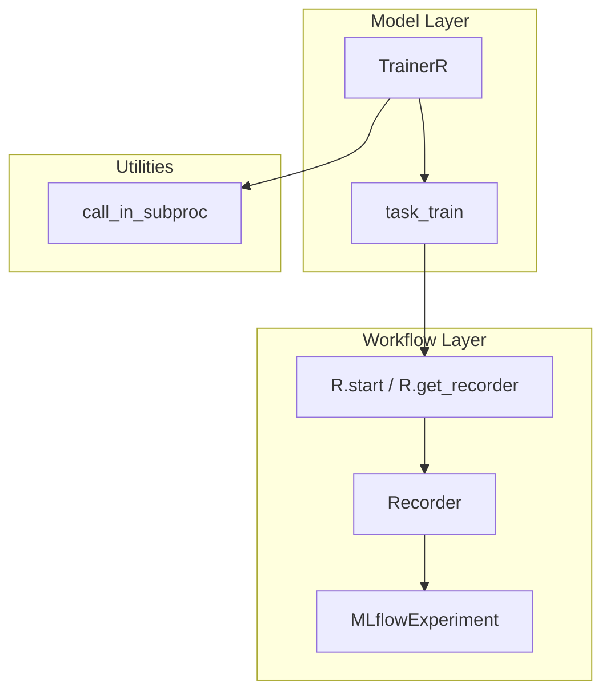
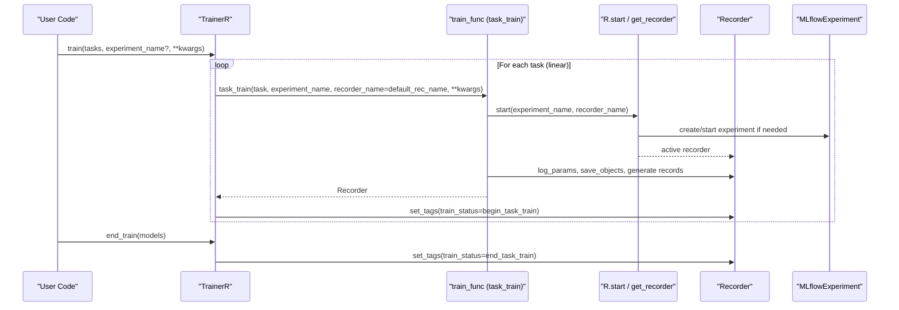
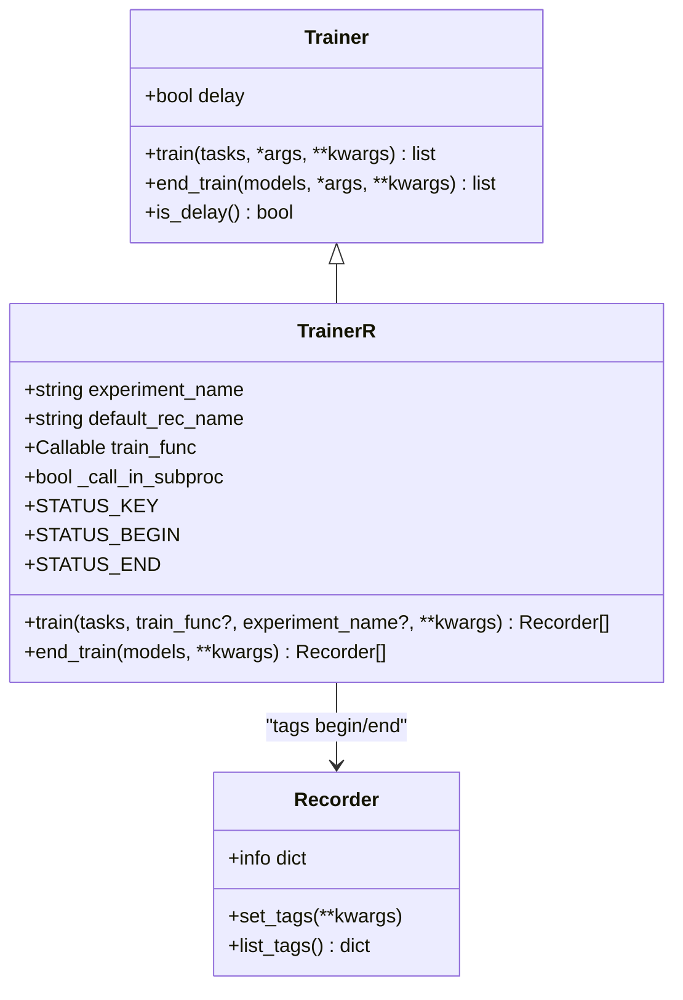
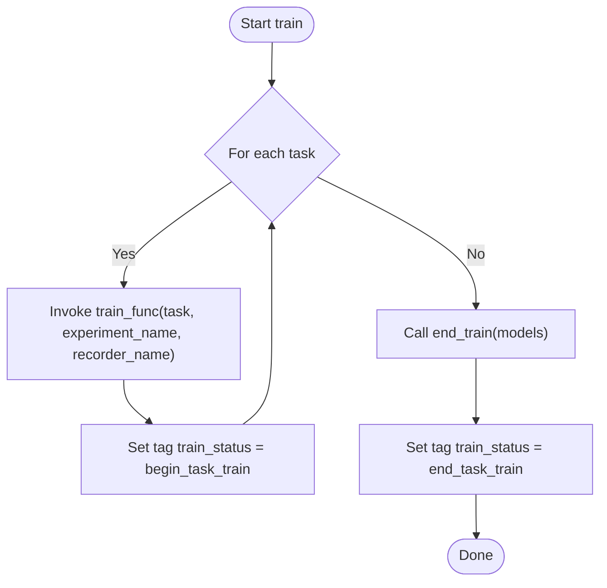
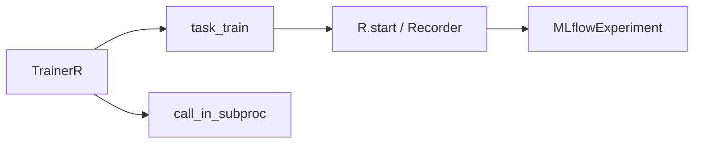

# TrainerR Implementation

<cite>
**Referenced Files in This Document**
- [trainer.py](file://qlib/model/trainer.py)
- [recorder.py](file://qlib/workflow/recorder.py)
- [expm.py](file://qlib/workflow/expm.py)
- [paral.py](file://qlib/utils/paral.py)
</cite>

## Table of Contents
1. [Introduction](#introduction)
2. [Project Structure](#project-structure)
3. [Core Components](#core-components)
4. [Architecture Overview](#architecture-overview)
5. [Detailed Component Analysis](#detailed-component-analysis)
6. [Dependency Analysis](#dependency-analysis)
7. [Performance Considerations](#performance-considerations)
8. [Troubleshooting Guide](#troubleshooting-guide)
9. [Conclusion](#conclusion)

## Introduction
This document explains the TrainerR class, which provides sequential training with recorder-based tracking. It processes tasks linearly using a default task_train function, manages experiment names and recorder naming conventions, and implements status tagging with STATUS_BEGIN and STATUS_END markers. It also covers the call_in_subproc option for memory management, integration with MLflow experiments via Qlib’s workflow layer, and when to use this trainer for simple sequential workflows.

## Project Structure
TrainerR lives in the model training layer and integrates with Qlib’s workflow recording system:
- Training orchestration and lifecycle are implemented in the trainer module.
- Recording and experiment management are handled by the workflow layer (Recorder and MLflow-backed experiment).
- Optional subprocess execution is provided by utilities for memory isolation.

**Diagram sources**
- [trainer.py:108-128](file://qlib/model/trainer.py#L108-L128)
- [trainer.py:209-290](file://qlib/model/trainer.py#L209-L290)
- [recorder.py:28-40](file://qlib/workflow/recorder.py#L28-L40)
- [expm.py:328-346](file://qlib/workflow/expm.py#L328-L346)
- [paral.py:298-330](file://qlib/utils/paral.py#L298-L330)

**Section sources**
- [trainer.py:108-128](file://qlib/model/trainer.py#L108-L128)
- [trainer.py:209-290](file://qlib/model/trainer.py#L209-L290)
- [recorder.py:28-40](file://qlib/workflow/recorder.py#L28-L40)
- [expm.py:328-346](file://qlib/workflow/expm.py#L328-L346)
- [paral.py:298-330](file://qlib/utils/paral.py#L298-L330)

## Core Components
- TrainerR: Sequential trainer that iterates over tasks, invokes a training function per task, and tags recorders with start/end status.
- task_train: Default training function that starts an experiment/recorder context, logs task info, executes the task, and returns the Recorder.
- Recorder: Abstraction backed by MLflow for logging parameters, metrics, artifacts, and tags; supports status transitions and resume semantics.
- call_in_subproc: Utility to wrap functions so they run in a separate process, enabling memory release between tasks.

Key behaviors:
- Linear processing order is preserved across tasks.
- Experiment name resolution uses instance-level defaults or per-call overrides.
- Recorder naming can be set via default_rec_name and passed into the training function.
- Status tagging uses constants to mark begin and end of training for each recorder.

**Section sources**
- [trainer.py:209-290](file://qlib/model/trainer.py#L209-L290)
- [trainer.py:108-128](file://qlib/model/trainer.py#L108-L128)
- [recorder.py:28-40](file://qlib/workflow/recorder.py#L28-L40)
- [paral.py:298-330](file://qlib/utils/paral.py#L298-L330)

## Architecture Overview
The following sequence shows how TrainerR orchestrates a single task through task_train and the workflow layer:

**Diagram sources**
- [trainer.py:243-290](file://qlib/model/trainer.py#L243-L290)
- [trainer.py:108-128](file://qlib/model/trainer.py#L108-L128)
- [expm.py:328-346](file://qlib/workflow/expm.py#L328-L346)
- [recorder.py:28-40](file://qlib/workflow/recorder.py#L28-L40)

## Detailed Component Analysis

### TrainerR Class
Responsibilities:
- Accepts a list of tasks and trains them sequentially.
- Resolves experiment_name from constructor or call-time arguments.
- Optionally wraps the training function with call_in_subproc to isolate memory per task.
- Tags each returned Recorder with a begin status immediately after creation.
- Provides end_train to tag all Recorders with an end status.

Key implementation details:
- Iteration uses a progress bar and preserves order.
- If call_in_subproc is enabled, the training function is wrapped before invocation per task.
- The default_rec_name is forwarded to the training function to control recorder naming.

Status tagging:
- Uses class constants for keys and values to mark begin and end states consistently across recorders.

**Diagram sources**
- [trainer.py:131-182](file://qlib/model/trainer.py#L131-L182)
- [trainer.py:209-290](file://qlib/model/trainer.py#L209-L290)
- [recorder.py:28-40](file://qlib/workflow/recorder.py#L28-L40)

**Section sources**
- [trainer.py:209-290](file://qlib/model/trainer.py#L209-L290)

### task_train Function
Purpose:
- Starts an experiment/recorder context with the given experiment_name and optional recorder_name.
- Logs task configuration and executes the task pipeline (model/dataset initialization, fitting, saving, and record generation).
- Returns the active Recorder for further tagging.

Integration points:
- Uses the workflow layer’s context manager to ensure proper setup and teardown.
- Saves model and dataset artifacts and generates configured records within the same recorder context.

**Section sources**
- [trainer.py:108-128](file://qlib/model/trainer.py#L108-L128)

### call_in_subproc Option
Behavior:
- When enabled, TrainerR wraps the training function with a subprocess wrapper before invoking it for each task.
- This isolates memory usage per task, allowing garbage collection of large objects between tasks.

Use cases:
- Memory-constrained environments where models or datasets are large.
- Long-running pipelines where intermediate memory leaks could accumulate.

Considerations:
- Subprocess overhead may add latency.
- Ensure environment and dependencies are available in child processes.

**Section sources**
- [trainer.py:267-271](file://qlib/model/trainer.py#L267-L271)
- [paral.py:298-330](file://qlib/utils/paral.py#L298-L330)

### Experiment Names and Recorder Naming Conventions
Experiment name resolution:
- TrainerR accepts an experiment_name at construction time and/or at train call time.
- If not provided at call time, it falls back to the instance default.

Recorder naming:
- default_rec_name is stored on TrainerR and passed into the training function as recorder_name.
- The underlying workflow layer creates or resumes a recorder under the active experiment with the specified name.

Implications:
- Consistent naming helps organize runs and enables resuming specific recorders.
- Using meaningful recorder_name improves traceability in experiment dashboards.

**Section sources**
- [trainer.py:222-241](file://qlib/model/trainer.py#L222-L241)
- [trainer.py:243-273](file://qlib/model/trainer.py#L243-L273)
- [expm.py:328-346](file://qlib/workflow/expm.py#L328-L346)

### Status Tagging with STATUS_BEGIN and STATUS_END
Mechanism:
- After each task completes, TrainerR sets a tag key train_status to begin_task_train on the returned Recorder.
- In end_train, it updates the same tag to end_task_train for all provided recorders.

Purpose:
- Enables downstream tools to filter or query recorders by training stage.
- Supports delayed training patterns where begin and end phases are separated.

Flowchart of tagging:

**Diagram sources**
- [trainer.py:267-290](file://qlib/model/trainer.py#L267-L290)

**Section sources**
- [trainer.py:217-220](file://qlib/model/trainer.py#L217-L220)
- [trainer.py:267-290](file://qlib/model/trainer.py#L267-L290)

### Integration with MLflow Experiments
Under the hood:
- Qlib’s workflow layer uses MLflow to implement experiments and recorders.
- R.start creates or resumes an experiment and starts a recorder run, setting up logging contexts.
- Parameters, metrics, artifacts, and tags are persisted via MLflow.

When to rely on this:
- Use TrainerR when you want simple, sequential training with full experiment tracking out-of-the-box.
- Ideal for reproducible runs, parameter sweeps, and artifact versioning without custom tracking code.

**Section sources**
- [recorder.py:28-40](file://qlib/workflow/recorder.py#L28-L40)
- [expm.py:328-346](file://qlib/workflow/expm.py#L328-L346)

### When to Use TrainerR
Recommended scenarios:
- Simple sequential workflows where tasks are independent and executed one-by-one.
- Need for consistent experiment tracking and artifact storage.
- Desire to isolate memory per task using call_in_subproc.
- Preference for minimal boilerplate compared to building custom trainers.

Not recommended when:
- You require complex parallelism or distributed scheduling (consider TaskManager-based trainers).
- You need fine-grained control over worker lifecycles beyond subprocess wrapping.

[No sources needed since this section doesn't analyze specific files]

## Dependency Analysis
TrainerR depends on:
- Workflow layer (R.start, Recorder) for experiment and recorder management.
- Default training function (task_train) for standard task execution.
- Optional subprocess utility (call_in_subproc) for memory isolation.

**Diagram sources**
- [trainer.py:209-290](file://qlib/model/trainer.py#L209-L290)
- [trainer.py:108-128](file://qlib/model/trainer.py#L108-L128)
- [expm.py:328-346](file://qlib/workflow/expm.py#L328-L346)
- [paral.py:298-330](file://qlib/utils/paral.py#L298-L330)

**Section sources**
- [trainer.py:209-290](file://qlib/model/trainer.py#L209-L290)
- [trainer.py:108-128](file://qlib/model/trainer.py#L108-L128)
- [expm.py:328-346](file://qlib/workflow/expm.py#L328-L346)
- [paral.py:298-330](file://qlib/utils/paral.py#L298-L330)

## Performance Considerations
- Sequential execution ensures deterministic ordering but does not parallelize tasks.
- Enabling call_in_subproc adds process startup overhead but can significantly reduce peak memory usage and mitigate memory leaks between tasks.
- Large datasets or models benefit from subprocess isolation; evaluate trade-offs based on workload size and hardware constraints.

[No sources needed since this section provides general guidance]

## Troubleshooting Guide
Common issues and resolutions:
- Missing experiment_name: If neither constructor nor call-time argument provides an experiment name, ensure your workflow layer has a default configured; otherwise, pass experiment_name explicitly.
- Recorder naming conflicts: If multiple tasks share the same recorder_name within an experiment, consider unique names or rely on auto-generated IDs.
- Memory pressure: Enable call_in_subproc to force memory release between tasks.
- Status tags not visible: Verify end_train is called to update train_status to end_task_train; some tools may filter by this tag.

**Section sources**
- [trainer.py:222-241](file://qlib/model/trainer.py#L222-L241)
- [trainer.py:267-290](file://qlib/model/trainer.py#L267-L290)
- [recorder.py:28-40](file://qlib/workflow/recorder.py#L28-L40)

## Conclusion
TrainerR offers a straightforward, sequential training interface with robust recorder-based tracking. It simplifies experiment management, supports clear status tagging, and provides memory isolation via subprocess execution. Use it for simple workflows where reproducibility and ease of tracking are priorities, and consider more advanced trainers when you need parallelism or distributed task management.

[No sources needed since this section summarizes without analyzing specific files]