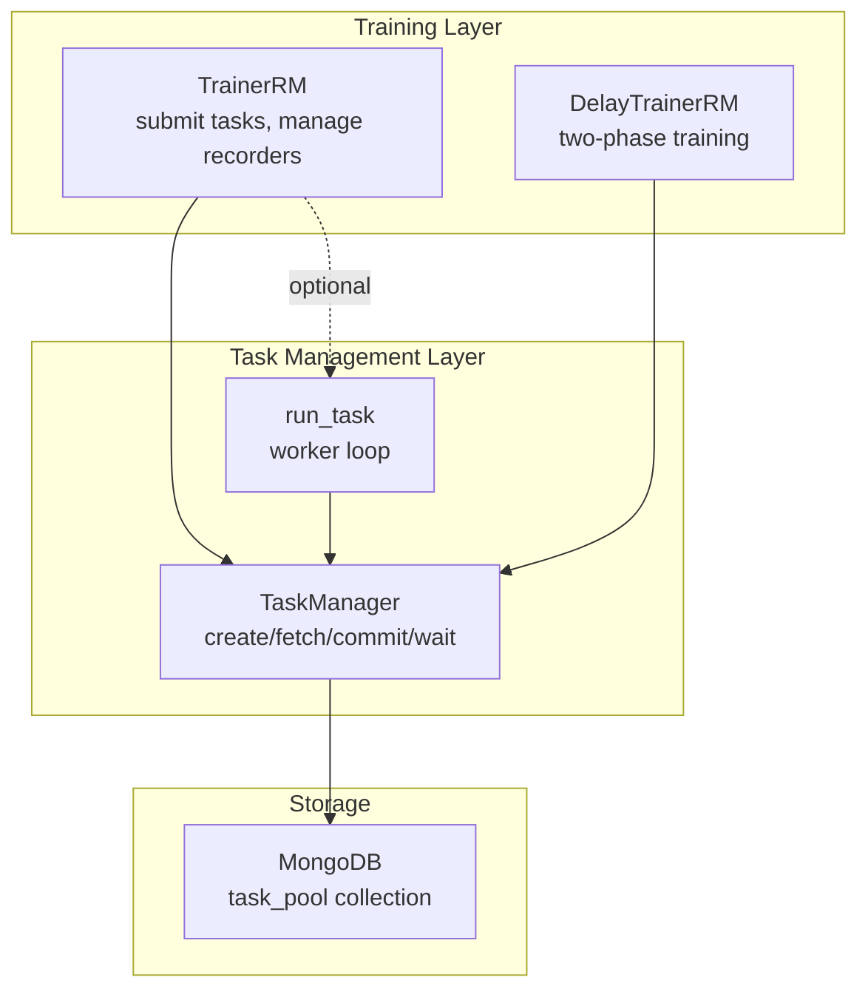
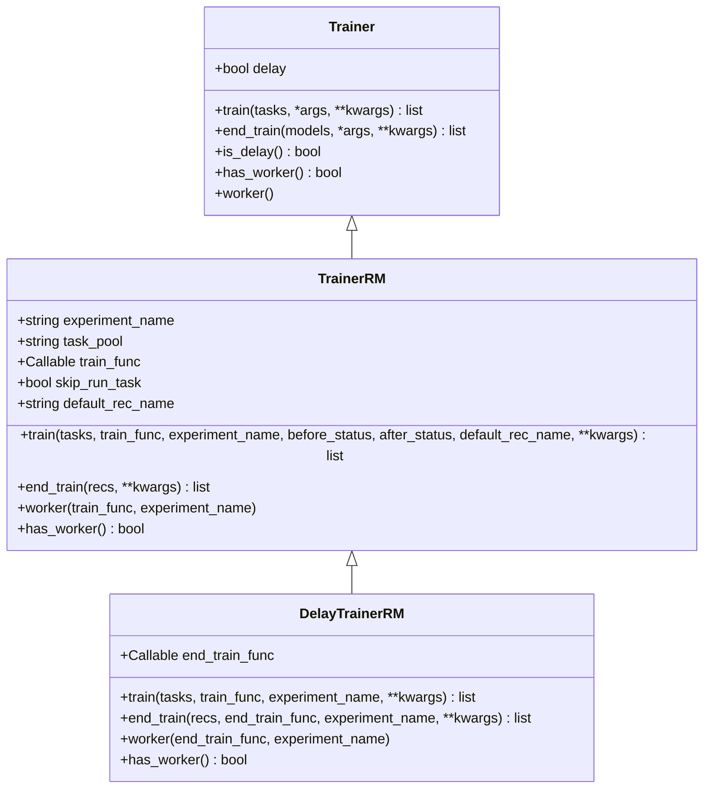
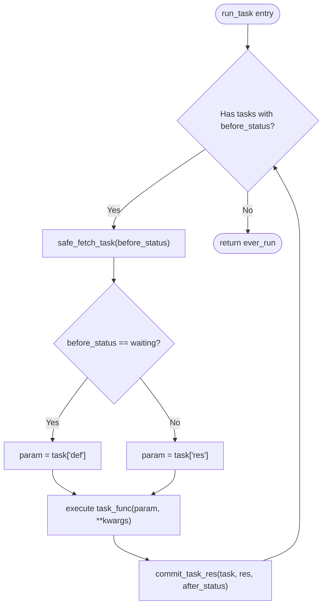
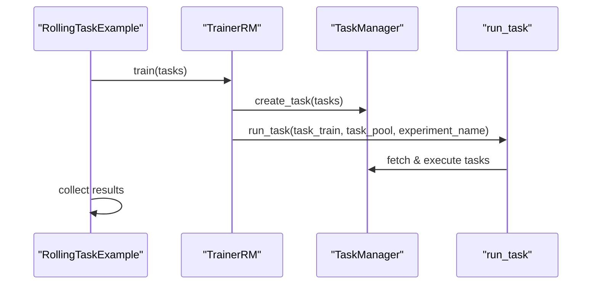
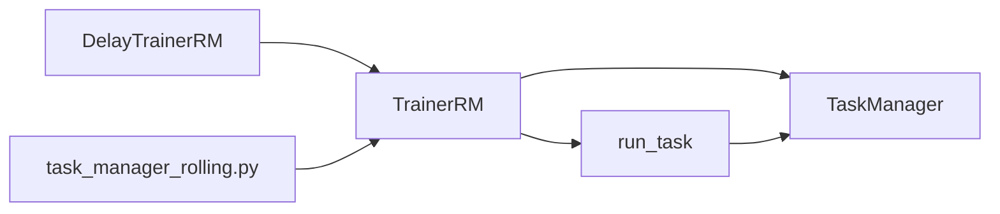

# TrainerRM Implementation

<cite>
**Referenced Files in This Document**
- [trainer.py](file://qlib/model/trainer.py)
- [manage.py](file://qlib/workflow/task/manage.py)
- [task_manager_rolling.py](file://examples/model_rolling/task_manager_rolling.py)
</cite>

## Table of Contents
1. [Introduction](#introduction)
2. [Project Structure](#project-structure)
3. [Core Components](#core-components)
4. [Architecture Overview](#architecture-overview)
5. [Detailed Component Analysis](#detailed-component-analysis)
6. [Dependency Analysis](#dependency-analysis)
7. [Performance Considerations](#performance-considerations)
8. [Troubleshooting Guide](#troubleshooting-guide)
9. [Conclusion](#conclusion)

## Introduction
TrainerRM is a task-manager-based parallel training implementation that coordinates multiple training jobs through TaskManager. It integrates with TaskManager to persist tasks, manage their lifecycle and status transitions, and execute them across processes or machines using a worker loop. Key capabilities include:
- Submitting tasks to a shared task pool (MongoDB-backed collection)
- Running workers that fetch and execute tasks concurrently
- Managing task statuses via before_status and after_status parameters
- Supporting separation of task submission from execution via skip_run_task
- Enabling distributed workflows where trainers submit work and workers run on different machines or processes

## Project Structure
The implementation spans two primary modules:
- qlib/model/trainer.py: Defines TrainerRM, DelayTrainerRM, and related training functions
- qlib/workflow/task/manage.py: Implements TaskManager and the run_task worker loop
- examples/model_rolling/task_manager_rolling.py: Demonstrates usage patterns for rolling tasks with TrainerRM



**Diagram sources**
- [trainer.py:341-488](file://qlib/model/trainer.py#L341-L488)
- [manage.py:35-551](file://qlib/workflow/task/manage.py#L35-L551)

**Section sources**
- [trainer.py:341-488](file://qlib/model/trainer.py#L341-L488)
- [manage.py:35-551](file://qlib/workflow/task/manage.py#L35-L551)
- [task_manager_rolling.py:24-80](file://examples/model_rolling/task_manager_rolling.py#L24-L80)

## Core Components
- TrainerRM: Submits tasks to TaskManager, optionally runs them immediately, waits for completion, and returns recorders with tags indicating progress.
- DelayTrainerRM: Two-phase training; train() prepares tasks and sets partial status; end_train() completes actual fitting.
- TaskManager: Persists tasks in MongoDB, provides safe fetching, status management, result committing, and waiting utilities.
- run_task: Worker loop that repeatedly fetches tasks by status, executes the provided function, and commits results with updated status.

Key behaviors:
- Task states: waiting, running, part_done, done
- Status transitions controlled by before_status and after_status
- Workers can run in separate processes/machines sharing the same task_pool
- skip_run_task allows decoupling submission from execution

**Section sources**
- [trainer.py:341-488](file://qlib/model/trainer.py#L341-L488)
- [trainer.py:491-619](file://qlib/model/trainer.py#L491-L619)
- [manage.py:35-551](file://qlib/workflow/task/manage.py#L35-L551)

## Architecture Overview
TrainerRM orchestrates distributed training by:
1. Creating tasks in TaskManager (stored in MongoDB)
2. Optionally invoking run_task to execute tasks immediately
3. Waiting until all tasks reach desired completion state
4. Returning recorders tagged with begin/end status and linked to TaskManager IDs
5. Allowing external workers to continue processing via worker() or direct run_task calls

```mermaid
sequenceDiagram
participant Client as "Client Code"
participant TR as "TrainerRM"
participant TM as "TaskManager"
participant RT as "run_task"
participant DB as "MongoDB"
Client->>TR : train(tasks, before_status, after_status)
TR->>TM : create_task(tasks)
TM->>DB : insert tasks (status=waiting)
alt skip_run_task == False
TR->>RT : run_task(train_func, task_pool, query, before_status, after_status)
RT->>TM : safe_fetch_task(status=before_status)
TM->>DB : find_one_and_update -> set running
RT-->>RT : execute train_func(param)
RT->>TM : commit_task_res(res, status=after_status)
TM->>DB : update status + res
else skip_run_task == True
Note over TR : Submission only; no immediate execution
end
TR->>TM : wait(query)
TM->>DB : poll until undone == 0
TR->>TM : re_query(_id) to get recorder
TR-->>Client : list of Recorders
```

**Diagram sources**
- [trainer.py:384-448](file://qlib/model/trainer.py#L384-L448)
- [manage.py:217-263](file://qlib/workflow/task/manage.py#L217-L263)
- [manage.py:265-317](file://qlib/workflow/task/manage.py#L265-L317)
- [manage.py:354-382](file://qlib/workflow/task/manage.py#L354-L382)
- [manage.py:458-480](file://qlib/workflow/task/manage.py#L458-L480)
- [manage.py:485-551](file://qlib/workflow/task/manage.py#L485-L551)

## Detailed Component Analysis

### TrainerRM
Responsibilities:
- Initialize experiment_name, task_pool, train_func, skip_run_task, default_rec_name
- Create tasks in TaskManager and return their IDs
- Optionally run tasks immediately via run_task
- Wait for completion if not delayed
- Retrieve recorders and tag them with begin/end status and TaskManager ID

Important parameters:
- before_status: tasks in this state will be fetched and trained (e.g., waiting, part_done)
- after_status: tasks will transition to this state after successful execution (e.g., done, part_done)
- skip_run_task: when True, only submits tasks without executing; useful for separating submission from worker execution

Worker method:
- worker(): starts a persistent worker loop using run_task to process tasks from the shared task_pool



**Diagram sources**
- [trainer.py:131-206](file://qlib/model/trainer.py#L131-L206)
- [trainer.py:341-488](file://qlib/model/trainer.py#L341-L488)
- [trainer.py:491-619](file://qlib/model/trainer.py#L491-L619)

**Section sources**
- [trainer.py:341-488](file://qlib/model/trainer.py#L341-L488)
- [trainer.py:491-619](file://qlib/model/trainer.py#L491-L619)

### TaskManager and run_task
TaskManager manages task persistence and lifecycle:
- create_task: inserts new tasks into MongoDB with status=waiting
- safe_fetch_task: atomically fetches a task and marks it running; returns to original status on error
- commit_task_res: saves result and updates status
- wait: polls until all tasks in query are completed

run_task implements the worker loop:
- Repeatedly fetches tasks with specified before_status
- Executes task_func with either task["def"] or task["res"] depending on before_status
- Commits result and updates status to after_status
- Supports force_release to run in a separate process for memory isolation



**Diagram sources**
- [manage.py:485-551](file://qlib/workflow/task/manage.py#L485-L551)
- [manage.py:265-317](file://qlib/workflow/task/manage.py#L265-L317)
- [manage.py:354-382](file://qlib/workflow/task/manage.py#L354-L382)

**Section sources**
- [manage.py:35-551](file://qlib/workflow/task/manage.py#L35-L551)

### Usage Example: Rolling Tasks
The example demonstrates:
- Initializing qlib with MongoDB configuration
- Using TrainerRM to train rolling tasks
- Running a worker to process tasks asynchronously
- Collecting results post-training



**Diagram sources**
- [task_manager_rolling.py:24-80](file://examples/model_rolling/task_manager_rolling.py#L24-L80)
- [trainer.py:384-448](file://qlib/model/trainer.py#L384-L448)
- [manage.py:485-551](file://qlib/workflow/task/manage.py#L485-L551)

**Section sources**
- [task_manager_rolling.py:24-80](file://examples/model_rolling/task_manager_rolling.py#L24-L80)

## Dependency Analysis
- TrainerRM depends on TaskManager for task persistence and lifecycle management
- run_task depends on TaskManager’s safe_fetch_task and commit_task_res for atomic operations
- DelayTrainerRM extends TrainerRM to support two-phase training with part_done intermediate status
- Example code shows how to configure MongoDB and use TrainerRM with rolling tasks



**Diagram sources**
- [trainer.py:341-488](file://qlib/model/trainer.py#L341-L488)
- [trainer.py:491-619](file://qlib/model/trainer.py#L491-L619)
- [manage.py:35-551](file://qlib/workflow/task/manage.py#L35-L551)
- [task_manager_rolling.py:24-80](file://examples/model_rolling/task_manager_rolling.py#L24-L80)

**Section sources**
- [trainer.py:341-488](file://qlib/model/trainer.py#L341-L488)
- [manage.py:35-551](file://qlib/workflow/task/manage.py#L35-L551)
- [task_manager_rolling.py:24-80](file://examples/model_rolling/task_manager_rolling.py#L24-L80)

## Performance Considerations
- Parallelism: Multiple workers can consume tasks concurrently from the same task_pool, enabling horizontal scaling across processes or machines
- Atomicity: safe_fetch_task ensures each task is processed exactly once by marking it running during execution
- Resource isolation: run_task supports force_release to execute task_func in a separate process for memory cleanup
- Waiting: wait() polls until all tasks complete, preventing premature termination in multi-process scenarios

[No sources needed since this section provides general guidance]

## Troubleshooting Guide
Common issues and resolutions:
- No tasks being executed: Ensure before_status matches current task states; verify tasks are created with correct status
- Stuck workers: Check MongoDB connectivity and permissions; ensure safe_fetch_task can mark tasks as running
- Incomplete results: Verify after_status is correctly set; confirm commit_task_res is called successfully
- Memory pressure: Use force_release in run_task to isolate heavy computations in subprocesses
- Distributed setup: Confirm all workers share the same task_pool and experiment_name; validate network access to MongoDB

**Section sources**
- [manage.py:265-317](file://qlib/workflow/task/manage.py#L265-L317)
- [manage.py:354-382](file://qlib/workflow/task/manage.py#L354-L382)
- [manage.py:458-480](file://qlib/workflow/task/manage.py#L458-L480)
- [manage.py:485-551](file://qlib/workflow/task/manage.py#L485-L551)

## Conclusion
TrainerRM provides a robust framework for distributed, task-based parallel training. By integrating with TaskManager, it enables flexible workflows where task submission and execution can be separated, supporting both single-process and multi-machine deployments. The before_status and after_status parameters offer fine-grained control over task lifecycle, while the worker() method facilitates scalable execution across resources. Combined with DelayTrainerRM, it supports complex multi-stage training pipelines with clear separation of concerns and reliable state management.

[No sources needed since this section summarizes without analyzing specific files]