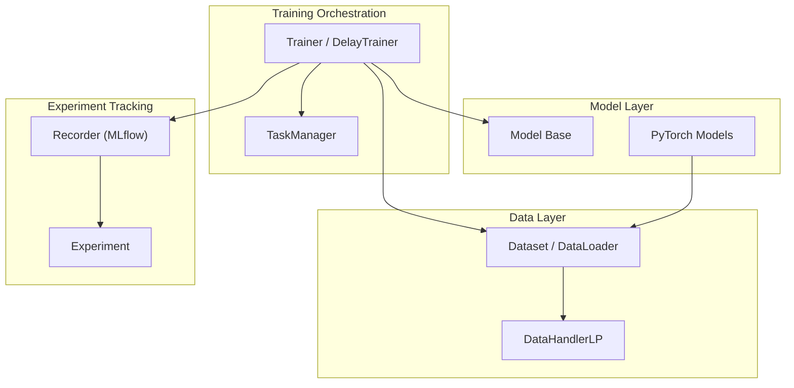
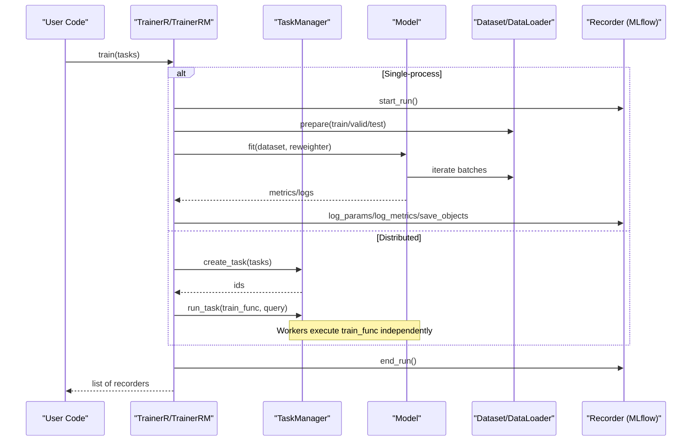
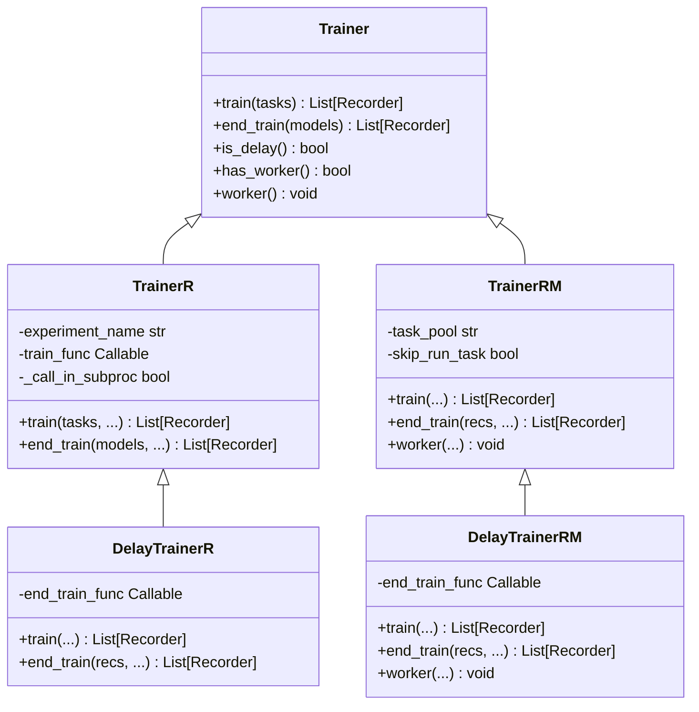
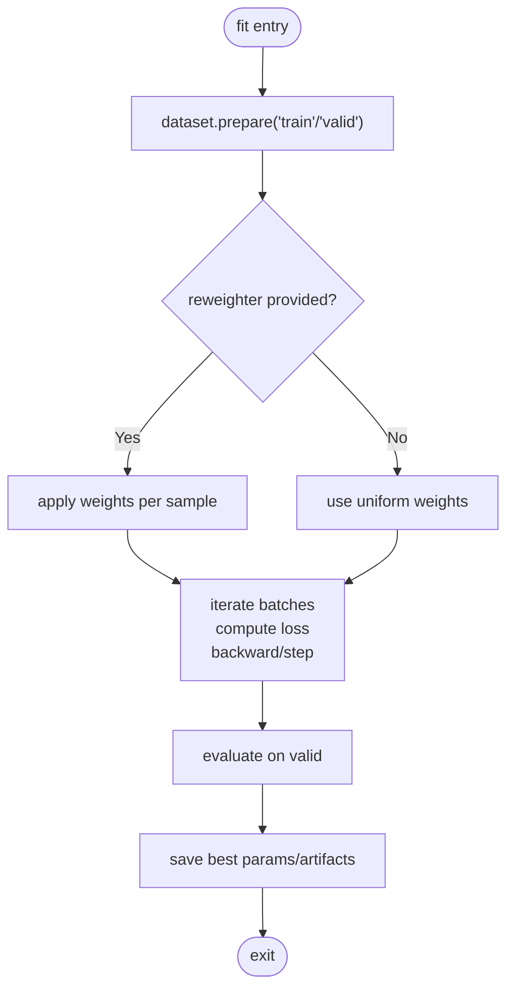
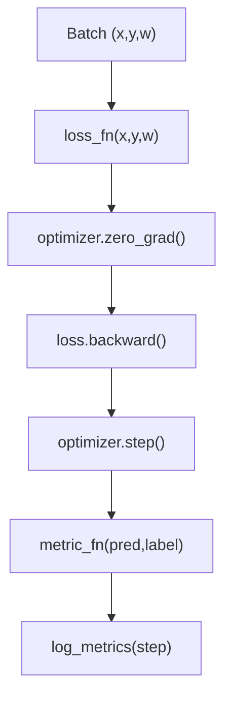
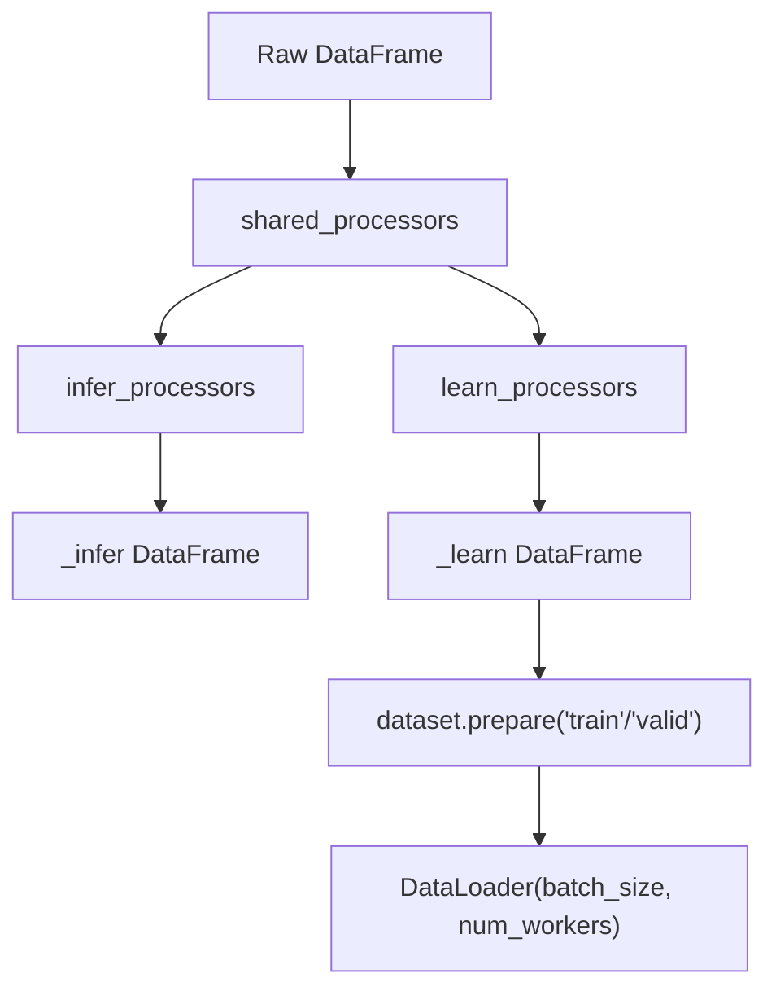
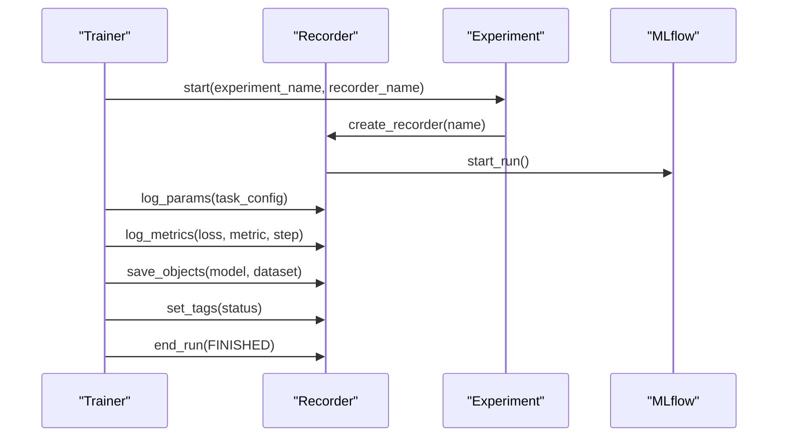
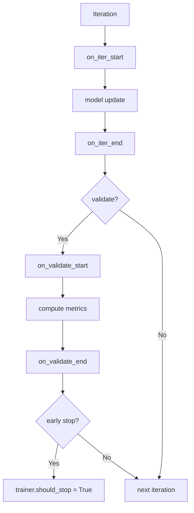
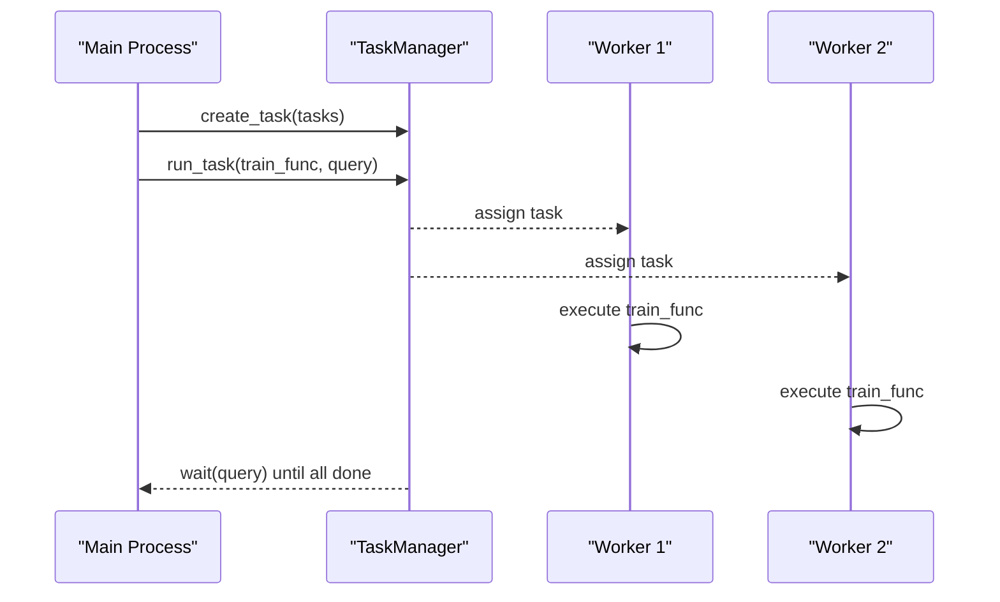
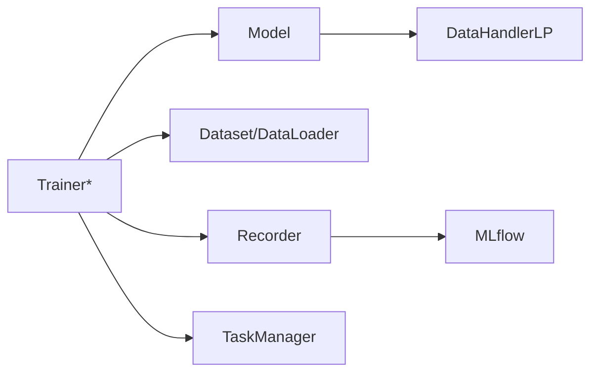

# Training Framework

<cite>
**Referenced Files in This Document**
- [trainer.py](file://qlib/model/trainer.py)
- [base.py](file://qlib/model/base.py)
- [recorder.py](file://qlib/workflow/recorder.py)
- [exp.py](file://qlib/workflow/exp.py)
- [handler.py](file://qlib/data/dataset/handler.py)
- [pytorch_general_nn.py](file://qlib/contrib/model/pytorch_general_nn.py)
- [manage.py](file://qlib/workflow/task/manage.py)
</cite>

## Table of Contents
1. [Introduction](#introduction)
2. [Project Structure](#project-structure)
3. [Core Components](#core-components)
4. [Architecture Overview](#architecture-overview)
5. [Detailed Component Analysis](#detailed-component-analysis)
6. [Dependency Analysis](#dependency-analysis)
7. [Performance Considerations](#performance-considerations)
8. [Troubleshooting Guide](#troubleshooting-guide)
9. [Conclusion](#conclusion)
10. [Appendices](#appendices)

## Introduction
This document explains QLib’s training framework and optimization systems with a focus on how the trainer coordinates model fitting across different algorithm types, how datasets are prepared and batched, how experiments are tracked via MLflow, and how to extend training with callbacks and custom loops. It also covers distributed task execution through TaskManager and provides performance guidance for large-scale financial time-series training.

## Project Structure
QLib’s training stack is organized around:
- Model interface and base classes that define fit/predict semantics
- Trainers that orchestrate one or many tasks (single-process or distributed)
- Dataset handlers that prepare features/labels and support batching
- Experiment/recorder layer backed by MLflow for logging and artifact management
- Optional RL-style callback system for monitoring and early stopping

**Diagram sources**
- [trainer.py:131-183](file://qlib/model/trainer.py#L131-L183)
- [base.py:22-78](file://qlib/model/base.py#L22-L78)
- [handler.py:382-710](file://qlib/data/dataset/handler.py#L382-L710)
- [recorder.py:247-494](file://qlib/workflow/recorder.py#L247-L494)
- [exp.py:243-380](file://qlib/workflow/exp.py#L243-L380)

**Section sources**
- [trainer.py:131-183](file://qlib/model/trainer.py#L131-L183)
- [base.py:22-78](file://qlib/model/base.py#L22-L78)
- [handler.py:382-710](file://qlib/data/dataset/handler.py#L382-L710)
- [recorder.py:247-494](file://qlib/workflow/recorder.py#L247-L494)
- [exp.py:243-380](file://qlib/workflow/exp.py#L243-L380)

## Core Components
- Trainer interfaces:
  - Trainer: abstract lifecycle with train/end_train and optional worker support
  - TrainerR: recorder-based linear training; supports subprocess isolation for memory release
  - DelayTrainerR: defers actual fitting to end_train for parallel online simulation
  - TrainerRM: integrates with TaskManager for multiprocessing/multi-machine scheduling
  - DelayTrainerRM: two-phase training with partial completion states
- Model interface:
  - Model: defines fit(dataset, reweighter) and predict(dataset, segment)
  - ModelFT: adds finetune capability
- Data handling:
  - DataHandler/DataHandlerLP: unified fetch interface, learn/infer processing pipelines, column selection, slicing
- Experiment tracking:
  - Recorder/MLflowRecorder: parameters, metrics, tags, artifacts, async logging
  - Experiment/MLflowExperiment: run lifecycle and recorder management

**Section sources**
- [trainer.py:131-620](file://qlib/model/trainer.py#L131-L620)
- [base.py:22-111](file://qlib/model/base.py#L22-L111)
- [handler.py:25-786](file://qlib/data/dataset/handler.py#L25-L786)
- [recorder.py:28-494](file://qlib/workflow/recorder.py#L28-L494)
- [exp.py:15-380](file://qlib/workflow/exp.py#L15-L380)

## Architecture Overview
The training flow starts from a Trainer which orchestrates tasks. Each task configures a Model and a Dataset. The trainer initializes them, calls model.fit, saves artifacts, and optionally generates records (predictions/backtests). Distributed execution uses TaskManager to schedule tasks across processes/machines. All experiment metadata and artifacts are recorded via MLflow-backed Recorder.

**Diagram sources**
- [trainer.py:42-128](file://qlib/model/trainer.py#L42-L128)
- [trainer.py:243-290](file://qlib/model/trainer.py#L243-L290)
- [trainer.py:384-448](file://qlib/model/trainer.py#L384-L448)
- [manage.py:485-494](file://qlib/workflow/task/manage.py#L485-L494)
- [recorder.py:335-395](file://qlib/workflow/recorder.py#L335-L395)

## Detailed Component Analysis

### Trainer Interface and Coordination
- Trainer base defines train/end_train and optional worker methods.
- TrainerR runs tasks sequentially using a configurable train function (default task_train), tagging recorders with status markers.
- DelayTrainerR splits preparation and fitting into two phases to enable parallelization.
- TrainerRM leverages TaskManager to create tasks, schedule workers, and wait for completion; supports skipping immediate execution for later worker-driven runs.
- DelayTrainerRM extends this with PART_DONE state to defer heavy work.

**Diagram sources**
- [trainer.py:131-183](file://qlib/model/trainer.py#L131-L183)
- [trainer.py:209-338](file://qlib/model/trainer.py#L209-L338)
- [trainer.py:341-619](file://qlib/model/trainer.py#L341-L619)

**Section sources**
- [trainer.py:131-620](file://qlib/model/trainer.py#L131-L620)

### Model Fit/Predict Contract
- Model.fit receives a Dataset and an optional Reweighter; models should extract features/labels/weights via dataset.prepare and implement their own training loop.
- Model.predict takes a Dataset and a segment selector to produce predictions aligned with dataset indices.
- ModelFT adds finetune for incremental training workflows.

**Diagram sources**
- [base.py:22-78](file://qlib/model/base.py#L22-L78)
- [pytorch_general_nn.py:235-333](file://qlib/contrib/model/pytorch_general_nn.py#L235-L333)

**Section sources**
- [base.py:22-111](file://qlib/model/base.py#L22-L111)
- [pytorch_general_nn.py:235-333](file://qlib/contrib/model/pytorch_general_nn.py#L235-L333)

### Loss Functions, Optimizers, and Metrics
- PyTorch-based models typically implement:
  - loss_fn: e.g., MSE with NaN masking and optional weighting
  - metric_fn: returns a scalar metric (often negative loss for minimization)
  - optimizer: Adam or SGD configured with learning rate and weight decay
  - scheduler: ReduceLROnPlateau for adaptive LR
- Example patterns:
  - GeneralPTNN: MSE loss, Adam/SGD, ReduceLROnPlateau, early stopping by validation score
  - Other models follow similar patterns with masked losses and metric wrappers

**Diagram sources**
- [pytorch_general_nn.py:151-172](file://qlib/contrib/model/pytorch_general_nn.py#L151-L172)
- [pytorch_general_nn.py:202-233](file://qlib/contrib/model/pytorch_general_nn.py#L202-L233)
- [pytorch_general_nn.py:126-145](file://qlib/contrib/model/pytorch_general_nn.py#L126-L145)

**Section sources**
- [pytorch_general_nn.py:126-172](file://qlib/contrib/model/pytorch_general_nn.py#L126-L172)
- [pytorch_general_nn.py:202-233](file://qlib/contrib/model/pytorch_general_nn.py#L202-L233)

### Dataset Preparation, Batch Processing, and Memory Management
- DataHandlerLP supports separate processing pipelines for inference and learning, enabling different preprocessing at train vs test time.
- Dataset.prepare yields DataFrames for segments (train/valid/test); models convert to DataLoader-compatible inputs and use torch.utils.data.DataLoader for batching.
- Memory considerations:
  - Use drop_raw to free raw data after processing
  - Convert to numpy when appropriate to reduce overhead
  - Use num_workers for parallel data loading
  - Clear intermediate tensors and caches after epochs
  - In RL-style training, clear shared memory buffers between evaluation phases

**Diagram sources**
- [handler.py:436-610](file://qlib/data/dataset/handler.py#L436-L610)
- [handler.py:633-662](file://qlib/data/dataset/handler.py#L633-L662)
- [pytorch_general_nn.py:244-283](file://qlib/contrib/model/pytorch_general_nn.py#L244-L283)

**Section sources**
- [handler.py:436-662](file://qlib/data/dataset/handler.py#L436-L662)
- [pytorch_general_nn.py:244-283](file://qlib/contrib/model/pytorch_general_nn.py#L244-L283)

### Integration with MLflow for Experiment Tracking and Model Versioning
- Recorder/MLflowRecorder wraps MLflow to log parameters, metrics, tags, and artifacts asynchronously.
- Experiment/MLflowExperiment manages run lifecycles, creates recorders, and lists/searches runs.
- Trainer utilities log task configs and save model/dataset artifacts; record generation can be configured per task.

**Diagram sources**
- [recorder.py:335-395](file://qlib/workflow/recorder.py#L335-L395)
- [recorder.py:397-494](file://qlib/workflow/recorder.py#L397-L494)
- [exp.py:257-285](file://qlib/workflow/exp.py#L257-L285)
- [trainer.py:36-71](file://qlib/model/trainer.py#L36-L71)

**Section sources**
- [recorder.py:247-494](file://qlib/workflow/recorder.py#L247-L494)
- [exp.py:243-380](file://qlib/workflow/exp.py#L243-L380)
- [trainer.py:36-71](file://qlib/model/trainer.py#L36-L71)

### Callback Mechanisms and Custom Training Logic
- RL-style callbacks provide hooks such as on_iter_start/on_iter_end, on_validate_start/end, on_test_start/end, and on_train_end.
- EarlyStopping monitors a metric, tracks patience, and can restore best weights.
- These hooks enable custom monitoring, checkpointing, and dynamic behavior without modifying core training loops.

**Diagram sources**
- [callbacks.py:43-167](file://qlib/rl/trainer/callbacks.py#L43-L167)

**Section sources**
- [callbacks.py:43-167](file://qlib/rl/trainer/callbacks.py#L43-L167)

### Examples of Custom Training Loops and Advanced Configurations
- Implement a custom Model subclassing qlib.model.base.Model:
  - Define fit(dataset, reweighter) to build DataLoaders from dataset.prepare and run your loop
  - Implement predict(dataset, segment) to return predictions aligned with dataset index
  - Use loss_fn/metric_fn patterns consistent with other models
- Advanced configurations:
  - Use TrainerRM with TaskManager for multi-GPU/multi-node training
  - Use DelayTrainerRM to split preparation and heavy fitting across machines
  - Configure subprocess isolation in TrainerR to force memory release between tasks

**Section sources**
- [base.py:22-111](file://qlib/model/base.py#L22-L111)
- [trainer.py:209-619](file://qlib/model/trainer.py#L209-L619)

### Distributed Training Considerations
- TrainerRM delegates task creation and execution to TaskManager, supporting:
  - Multiprocessing workers via run_task
  - Multi-machine execution by sharing a task pool
  - Status transitions (WAITING -> PART_DONE -> DONE) for phased training
- DelayTrainerRM enables splitting light-weight setup and heavy fitting into separate phases, ideal for CPU-to-GPU handoff or cross-machine scheduling.

**Diagram sources**
- [trainer.py:384-448](file://qlib/model/trainer.py#L384-L448)
- [manage.py:485-494](file://qlib/workflow/task/manage.py#L485-L494)

**Section sources**
- [trainer.py:384-448](file://qlib/model/trainer.py#L384-L448)
- [manage.py:485-494](file://qlib/workflow/task/manage.py#L485-L494)

## Dependency Analysis
Key dependencies and coupling:
- Trainers depend on Model and Dataset interfaces; they do not hardcode algorithms
- DataHandlerLP decouples preprocessing from training, enabling reuse across models
- Recorder abstraction isolates MLflow details from trainers and models
- TaskManager decouples scheduling from execution, enabling horizontal scaling

**Diagram sources**
- [trainer.py:131-620](file://qlib/model/trainer.py#L131-L620)
- [base.py:22-111](file://qlib/model/base.py#L22-L111)
- [handler.py:382-710](file://qlib/data/dataset/handler.py#L382-L710)
- [recorder.py:247-494](file://qlib/workflow/recorder.py#L247-L494)

**Section sources**
- [trainer.py:131-620](file://qlib/model/trainer.py#L131-L620)
- [base.py:22-111](file://qlib/model/base.py#L22-L111)
- [handler.py:382-710](file://qlib/data/dataset/handler.py#L382-L710)
- [recorder.py:247-494](file://qlib/workflow/recorder.py#L247-L494)

## Performance Considerations
- Data pipeline:
  - Use DataHandlerLP.process_type to minimize redundant processing
  - Prefer CS_RAW fetching where possible to avoid copies
  - Set appropriate batch_size and num_workers for optimal throughput
- Training loop:
  - Use gradient clipping and early stopping to stabilize and accelerate convergence
  - Leverage ReduceLROnPlateau to adapt learning rate based on validation metrics
  - Clear GPU memory (e.g., empty_cache) after training
- Memory management:
  - Drop raw data after processing if not needed
  - Use subprocess isolation in TrainerR to force memory release between tasks
  - Clear shared memory buffers between evaluation phases in complex models
- Distributed:
  - Use TrainerRM/TaskManager to scale across multiple workers/machines
  - Split heavy work with DelayTrainerRM to optimize resource usage

[No sources needed since this section provides general guidance]

## Troubleshooting Guide
Common issues and resolutions:
- Empty dataset errors: ensure dataset.prepare returns non-empty DataFrames for train/valid segments
- Unknown loss/metric: verify model configuration strings match supported options
- Optimizer not supported: check optimizer name mapping in model initialization
- Artifact saving/loading failures: ensure Recorder has been started and URI is set before saving/loading
- Distributed stalls: confirm TaskManager workers are running and statuses transition correctly

**Section sources**
- [pytorch_general_nn.py:126-145](file://qlib/contrib/model/pytorch_general_nn.py#L126-L145)
- [pytorch_general_nn.py:244-249](file://qlib/contrib/model/pytorch_general_nn.py#L244-L249)
- [recorder.py:397-437](file://qlib/workflow/recorder.py#L397-L437)
- [manage.py:459-480](file://qlib/workflow/task/manage.py#L459-L480)

## Conclusion
QLib’s training framework provides a flexible, extensible architecture for financial machine learning:
- Trainers coordinate diverse models and datasets through well-defined interfaces
- DataHandlerLP enables robust preprocessing and efficient batching
- MLflow-backed Recorder ensures comprehensive experiment tracking and versioning
- TaskManager enables scalable distributed training
- Callbacks and custom loops allow advanced control over training dynamics

Adopting these components allows you to build reproducible, scalable, and maintainable training workflows tailored to financial time-series problems.

[No sources needed since this section summarizes without analyzing specific files]

## Appendices
- Best practices for custom models:
  - Follow Model.fit/predict contracts
  - Handle NaNs and finite checks in loss/metric functions
  - Log metrics consistently via Recorder
- Recommended configurations:
  - Use TrainerRM for multi-GPU setups
  - Use DelayTrainerRM for CPU/GPU separation
  - Tune batch_size and num_workers based on hardware and dataset size

[No sources needed since this section provides general guidance]