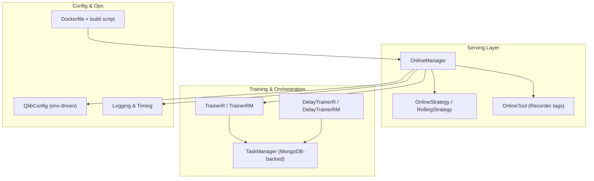
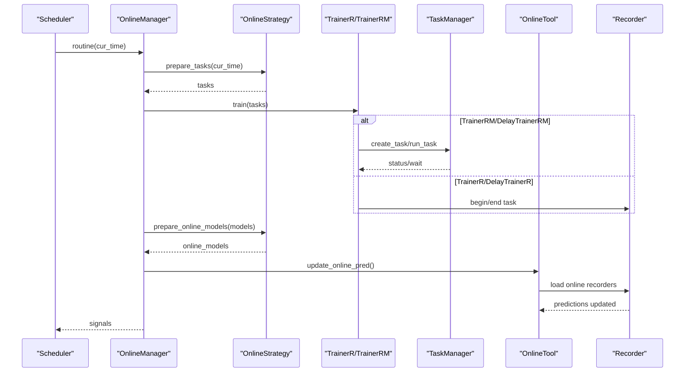
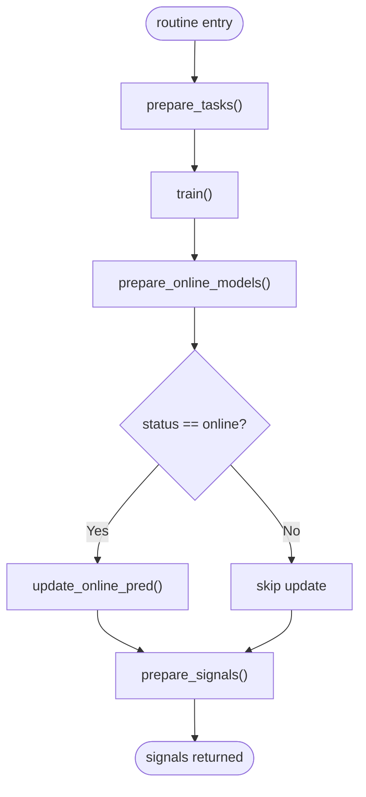
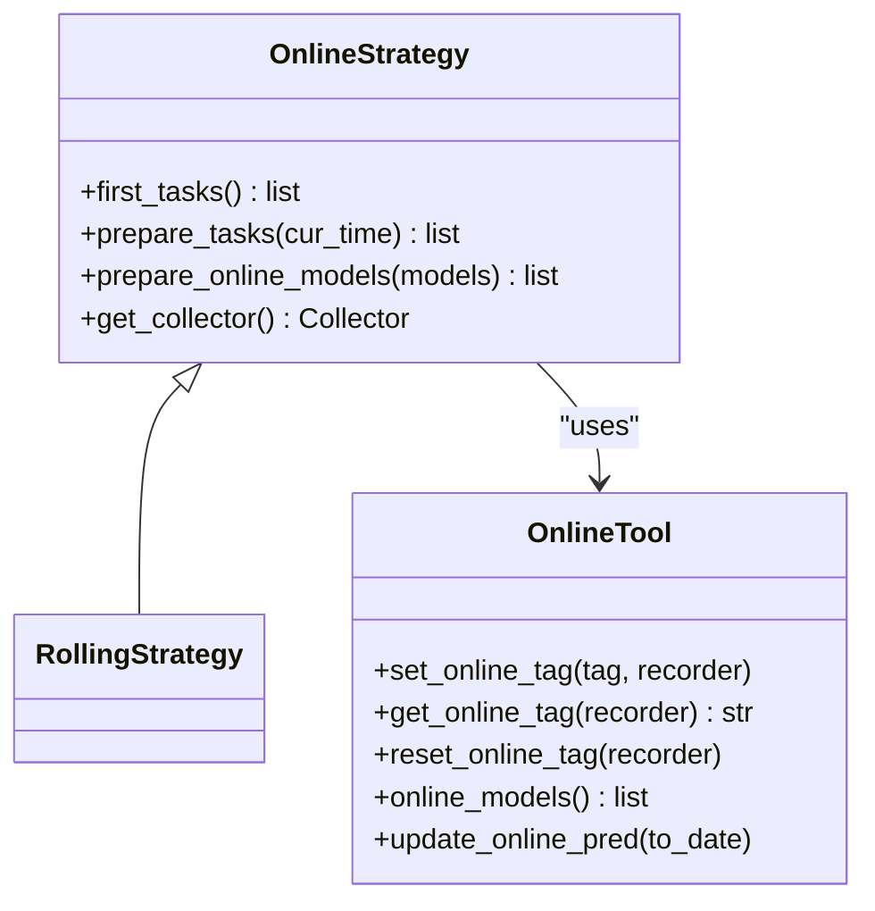
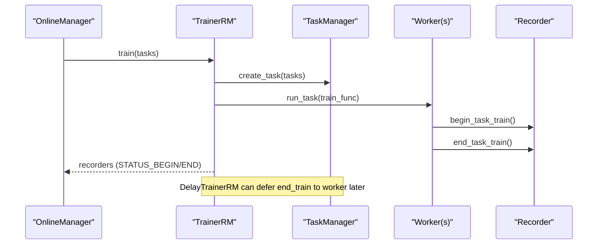
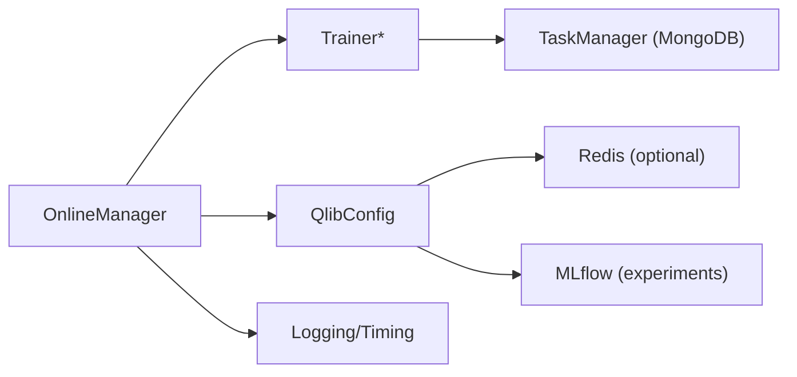

# Production Deployment

<cite>
**Referenced Files in This Document**
- [Dockerfile](file://Dockerfile)
- [build_docker_image.sh](file://build_docker_image.sh)
- [qlib/config.py](file://qlib/config.py)
- [qlib/log.py](file://qlib/log.py)
- [qlib/model/trainer.py](file://qlib/model/trainer.py)
- [qlib/workflow/online/manager.py](file://qlib/workflow/online/manager.py)
- [qlib/workflow/online/utils.py](file://qlib/workflow/online/utils.py)
- [qlib/workflow/online/strategy.py](file://qlib/workflow/online/strategy.py)
- [qlib/contrib/online/manager.py](file://qlib/contrib/online/manager.py)
- [examples/online_srv/rolling_online_management.py](file://examples/online_srv/rolling_online_management.py)
- [examples/online_srv/update_online_pred.py](file://examples/online_srv/update_online_pred.py)
- [SECURITY.md](file://SECURITY.md)
</cite>

## Table of Contents
1. Introduction
2. Project Structure
3. Core Components
4. Architecture Overview
5. Detailed Component Analysis
6. Dependency Analysis
7. Performance Considerations
8. Troubleshooting Guide
9. Conclusion
10. Appendices

## Introduction
This document provides a production-focused guide for deploying QLib in high-throughput, online-serving environments. It covers containerization with Docker, model versioning and rollout strategies, continuous deployment patterns, monitoring/logging/alerting, scaling and resource management, automated retraining pipelines, A/B testing and rollback mechanisms, and security/compliance considerations tailored for financial applications. The guidance is grounded in the repository’s online serving components, training orchestration, configuration, and logging facilities.

## Project Structure
QLib exposes a set of production-ready primitives:
- Online serving lifecycle via OnlineManager and strategies
- Model training and task orchestration via TrainerR/TrainerRM and DelayTrainer variants
- Experiment tracking and model tagging via Recorder-based OnlineTool
- Centralized configuration and environment-driven settings
- Logging utilities for structured logs and performance timing
- Container build assets for reproducible deployments

**Diagram sources**
- [qlib/workflow/online/manager.py:101-228](file://qlib/workflow/online/manager.py#L101-L228)
- [qlib/workflow/online/strategy.py:35-103](file://qlib/workflow/online/strategy.py#L35-L103)
- [qlib/workflow/online/utils.py:19-188](file://qlib/workflow/online/utils.py#L19-L188)
- [qlib/model/trainer.py:131-620](file://qlib/model/trainer.py#L131-L620)
- [qlib/config.py:39-248](file://qlib/config.py#L39-L248)
- [qlib/log.py:24-83](file://qlib/log.py#L24-L83)
- [Dockerfile:1-32](file://Dockerfile#L1-L32)

**Section sources**
- [qlib/workflow/online/manager.py:101-228](file://qlib/workflow/online/manager.py#L101-L228)
- [qlib/model/trainer.py:131-620](file://qlib/model/trainer.py#L131-L620)
- [qlib/config.py:39-248](file://qlib/config.py#L39-L248)
- [qlib/log.py:24-83](file://qlib/log.py#L24-L83)
- [Dockerfile:1-32](file://Dockerfile#L1-L32)

## Core Components
- OnlineManager: Orchestrates daily routines, trains or schedules tasks, selects online models, updates predictions, and produces signals. Supports simulation vs. live modes and delayed training to decouple preparation from fitting.
- Strategies: Define how tasks are generated and which trained models become “online” at each time step. RollingStrategy demonstrates using rolling windows to keep the latest model(s) online.
- Trainers: Provide linear (TrainerR), distributed (TrainerRM), and delayed (DelayTrainer*) execution paths. Delayed trainers enable parallel preparation and batched fitting, ideal for production throughput.
- OnlineTool: Manages model versioning by tagging Recorders as online/offline and updating predictions for active versions.
- Configuration: Environment-driven settings (via pydantic settings) and server/client presets for caching, Redis, and data providers.
- Logging: Structured logging with global level control and timing utilities for performance profiling.

**Section sources**
- [qlib/workflow/online/manager.py:101-228](file://qlib/workflow/online/manager.py#L101-L228)
- [qlib/workflow/online/strategy.py:35-103](file://qlib/workflow/online/strategy.py#L35-L103)
- [qlib/model/trainer.py:131-620](file://qlib/model/trainer.py#L131-L620)
- [qlib/workflow/online/utils.py:19-188](file://qlib/workflow/online/utils.py#L19-L188)
- [qlib/config.py:39-248](file://qlib/config.py#L39-L248)
- [qlib/log.py:24-83](file://qlib/log.py#L24-L83)

## Architecture Overview
The production serving architecture centers on a scheduled routine that:
1. Prepares tasks per strategy
2. Trains or queues tasks (with optional delay)
3. Selects online models and updates their predictions
4. Aggregates signals for downstream trading systems

**Diagram sources**
- [qlib/workflow/online/manager.py:184-228](file://qlib/workflow/online/manager.py#L184-L228)
- [qlib/workflow/online/strategy.py:35-103](file://qlib/workflow/online/strategy.py#L35-L103)
- [qlib/model/trainer.py:209-620](file://qlib/model/trainer.py#L209-L620)
- [qlib/workflow/online/utils.py:76-188](file://qlib/workflow/online/utils.py#L76-L188)

## Detailed Component Analysis

### Online Serving Lifecycle (OnlineManager)
- first_train: Initializes baseline models across strategies and records them as online.
- routine: For each period, prepares tasks, trains or queues, selects online models, updates predictions, and generates signals.
- simulate/delay_prepare: Enables backtesting-style simulation with deferred training and signal preparation for parallel workflows.

**Diagram sources**
- [qlib/workflow/online/manager.py:184-228](file://qlib/workflow/online/manager.py#L184-L228)

**Section sources**
- [qlib/workflow/online/manager.py:101-228](file://qlib/workflow/online/manager.py#L101-L228)

### Model Versioning and Rollout (OnlineTool + Strategies)
- OnlineTool uses Recorder tags to mark models as online/offline within an experiment.
- Strategies decide which trained models become online at each time step; RollingStrategy keeps the latest rolling model(s).
- update_online_pred refreshes predictions for all currently online models up to a target date.

**Diagram sources**
- [qlib/workflow/online/utils.py:19-188](file://qlib/workflow/online/utils.py#L19-L188)
- [qlib/workflow/online/strategy.py:35-103](file://qlib/workflow/online/strategy.py#L35-L103)

**Section sources**
- [qlib/workflow/online/utils.py:19-188](file://qlib/workflow/online/utils.py#L19-L188)
- [qlib/workflow/online/strategy.py:35-103](file://qlib/workflow/online/strategy.py#L35-L103)

### Training Orchestration (Trainers and TaskManager)
- TrainerR: Linear training with Recorder-based lifecycle.
- TrainerRM: Distributed training backed by TaskManager (MongoDB), enabling multi-process/multi-machine execution.
- DelayTrainerR/DelayTrainerRM: Split preparation and fitting into two phases to maximize parallelism and reduce blocking.

**Diagram sources**
- [qlib/model/trainer.py:341-620](file://qlib/model/trainer.py#L341-L620)

**Section sources**
- [qlib/model/trainer.py:131-620](file://qlib/model/trainer.py#L131-L620)

### Multi-User Online Management (Contrib UserManager)
- UserManager manages per-user accounts, strategies, and models persisted under user-specific directories.
- Supports adding/removing users and saving/loading state for isolated online sessions.

**Section sources**
- [qlib/contrib/online/manager.py:17-149](file://qlib/contrib/online/manager.py#L17-L149)

### Example Workflows
- Rolling online management: Demonstrates first_run, routine, add_strategy, and dump/load of OnlineManager state.
- Update online predictions: Trains a model, marks it online, and updates predictions on demand.

**Section sources**
- [examples/online_srv/rolling_online_management.py:25-145](file://examples/online_srv/rolling_online_management.py#L25-L145)
- [examples/online_srv/update_online_pred.py:27-56](file://examples/online_srv/update_online_pred.py#L27-L56)

## Dependency Analysis
Key runtime dependencies and integration points:
- MongoDB: Used by TaskManager for distributed task queues and status tracking when using TrainerRM/DelayTrainerRM.
- Redis: Optional cache backend for expression/dataset caches in server mode; connection failures gracefully degrade.
- MLflow: Default experiment manager for recording experiments and artifacts.
- Data providers: Local or remote storage via provider_uri and mount_path resolution.

**Diagram sources**
- [qlib/model/trainer.py:341-620](file://qlib/model/trainer.py#L341-L620)
- [qlib/config.py:135-248](file://qlib/config.py#L135-L248)

**Section sources**
- [qlib/config.py:135-248](file://qlib/config.py#L135-L248)
- [qlib/model/trainer.py:341-620](file://qlib/model/trainer.py#L341-L620)

## Performance Considerations
- Use DelayTrainerR/DelayTrainerRM to parallelize task preparation and batch model fitting, reducing blocking during routine cycles.
- Leverage TrainerRM with TaskManager to distribute training across multiple workers or machines.
- Configure caching appropriately:
  - In server mode, disk-based dataset/expression caches improve throughput.
  - Redis-backed caches are supported; if unavailable, Qlib degrades gracefully.
- Tune kernels and joblib_backend for CPU-bound workloads; adjust maxtasksperchild for long-running processes.
- Use get_kernels(freq) to scale compute based on data frequency.
- Employ TimeInspector for timing hotspots and log_cost_time for operational metrics.

[No sources needed since this section provides general guidance]

## Troubleshooting Guide
Common issues and mitigations:
- Redis connectivity failure: Caches fall back to non-Redis implementations; verify host/port/password and ensure network access.
- Missing predictions for online models: OnlineTool.update_online_pred skips recorders without pred.pkl and logs warnings; ensure recorders include prediction artifacts.
- Duplicate experiment names: When specifying custom rolling experiment names, duplicates may prevent creation; clean prior runs or use unique names.
- High-frequency data latency: Prefer fewer tasks per child process and appropriate cache settings; consider separate providers for different frequencies.

**Section sources**
- [qlib/config.py:465-482](file://qlib/config.py#L465-L482)
- [qlib/workflow/online/utils.py:159-178](file://qlib/workflow/online/utils.py#L159-L178)
- [qlib/workflow/online/strategy.py:92-103](file://qlib/workflow/online/strategy.py#L92-L103)

## Conclusion
QLib’s online serving stack enables robust, scalable production deployments through:
- Clear separation of task preparation and model fitting via delayed trainers
- Robust model versioning and selection with Recorder-based tagging
- Configurable caching and distributed training for high-throughput scenarios
- Comprehensive logging and timing utilities for observability
Adopt the provided examples and configurations to implement CI/CD pipelines, automated retraining, A/B testing, and safe rollbacks aligned with financial compliance requirements.

[No sources needed since this section summarizes without analyzing specific files]

## Appendices

### Containerization and Cloud Deployment
- Build images using the provided Dockerfile and helper script to produce stable or nightly images.
- Tag and push images to registries for cloud deployment (Kubernetes, ECS, AKS, GKE).
- Mount persistent volumes for data and MLflow artifacts; configure environment variables for provider_uri, region, and cache settings.

**Section sources**
- [Dockerfile:1-32](file://Dockerfile#L1-L32)
- [build_docker_image.sh:1-32](file://build_docker_image.sh#L1-L32)

### Monitoring, Logging, and Alerting
- Use structured logging with configurable levels and filters; integrate with centralized log aggregation.
- Add application-level metrics around routine duration, task queue depth, and prediction freshness.
- Set alerts for failed routines, missing predictions, and cache connectivity issues.

**Section sources**
- [qlib/log.py:24-83](file://qlib/log.py#L24-L83)
- [qlib/config.py:185-217](file://qlib/config.py#L185-L217)

### Security and Compliance
- Follow responsible disclosure practices and secure handling of credentials and keys.
- Enforce least-privilege access to data stores (MongoDB, Redis, object storage).
- Ensure auditability via experiment tracking and immutable model artifacts.

**Section sources**
- [SECURITY.md:1-41](file://SECURITY.md#L1-L41)