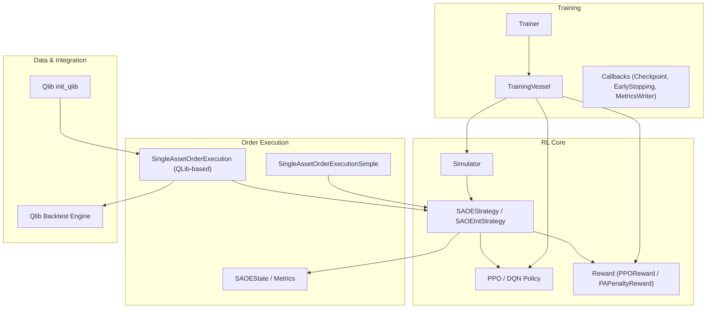
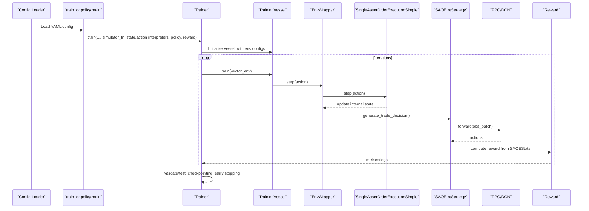
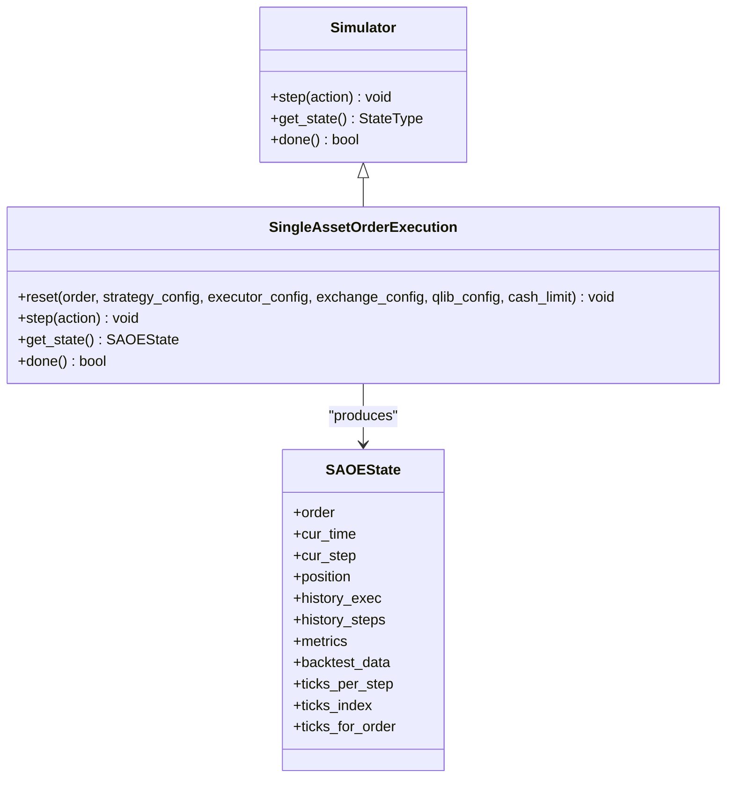
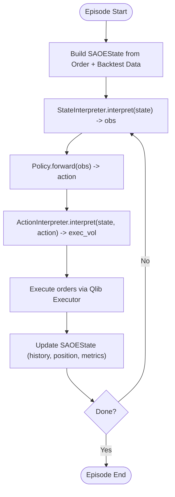
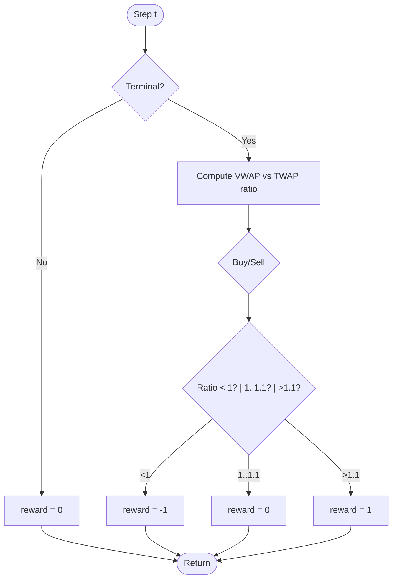
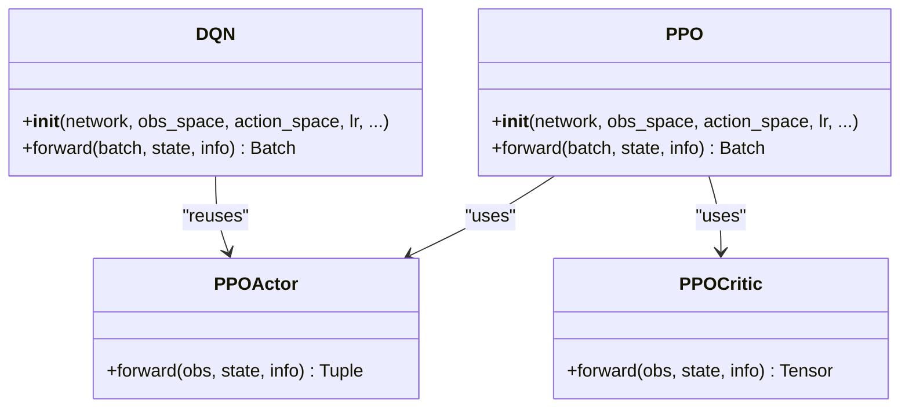
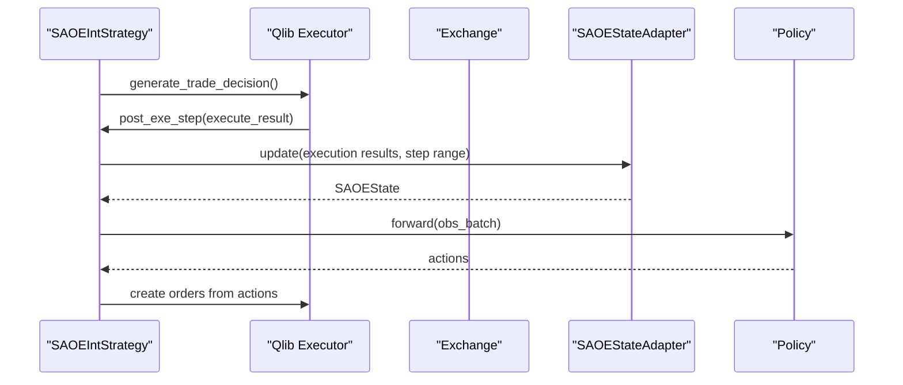
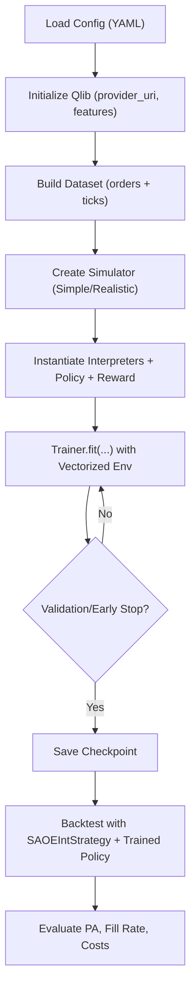
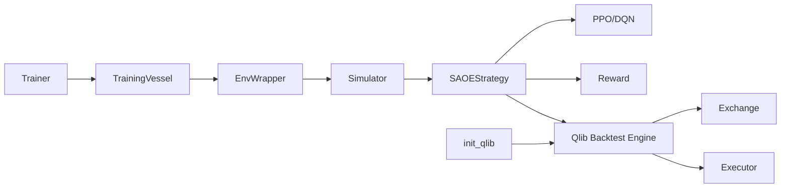

# Reinforcement Learning

<cite>
**Referenced Files in This Document**
- [qlib/rl/__init__.py](file://qlib/rl/__init__.py)
- [qlib/rl/simulator.py](file://qlib/rl/simulator.py)
- [qlib/rl/order_execution/__init__.py](file://qlib/rl/order_execution/__init__.py)
- [qlib/rl/order_execution/simulator_qlib.py](file://qlib/rl/order_execution/simulator_qlib.py)
- [qlib/rl/order_execution/policy.py](file://qlib/rl/order_execution/policy.py)
- [qlib/rl/order_execution/reward.py](file://qlib/rl/order_execution/reward.py)
- [qlib/rl/order_execution/state.py](file://qlib/rl/order_execution/state.py)
- [qlib/rl/order_execution/strategy.py](file://qlib/rl/order_execution/strategy.py)
- [qlib/rl/data/integration.py](file://qlib/rl/data/integration.py)
- [qlib/rl/trainer/__init__.py](file://qlib/rl/trainer/__init__.py)
- [qlib/rl/trainer/trainer.py](file://qlib/rl/trainer/trainer.py)
- [examples/rl_order_execution/README.md](file://examples/rl_order_execution/README.md)
- [examples/rl_order_execution/exp_configs/train_ppo.yml](file://examples/rl_order_execution/exp_configs/train_ppo.yml)
- [examples/rl_order_execution/exp_configs/backtest_ppo.yml](file://examples/rl_order_execution/exp_configs/backtest_ppo.yml)
- [qlib/rl/contrib/train_onpolicy.py](file://qlib/rl/contrib/train_onpolicy.py)
</cite>

## Table of Contents
1. Introduction
2. Project Structure
3. Core Components
4. Architecture Overview
5. Detailed Component Analysis
6. Dependency Analysis
7. Performance Considerations
8. Troubleshooting Guide
9. Conclusion
10. Appendices

## Introduction
This document explains QLib’s reinforcement learning (RL) framework for continuous decision-making in quantitative finance, with a focus on optimal order execution. It covers the RL architecture (environment design, state representation, action spaces, and reward functions), the order execution module supporting algorithms like PPO and OPDS, the simulator that models realistic market impact and liquidity constraints, and the training, evaluation, and deployment workflows. It also provides guidance for implementing custom RL agents and environments and integrating with the broader QLib ecosystem to leverage existing data and strategy components within RL contexts.

## Project Structure
QLib’s RL subsystem is organized into reusable building blocks:
- Simulator abstraction for environment dynamics
- Order execution environment with state, actions, rewards, and interpreters
- Policies (PPO, DQN) and networks tailored for discrete action spaces
- Training infrastructure (trainer, vessel, callbacks)
- Data integration with Qlib backtesting and feature providers
- Example workflows for training and backtesting order execution strategies

**Diagram sources**
- [qlib/rl/simulator.py:21-76](file://qlib/rl/simulator.py#L21-L76)
- [qlib/rl/order_execution/strategy.py:301-552](file://qlib/rl/order_execution/strategy.py#L301-L552)
- [qlib/rl/order_execution/policy.py:102-209](file://qlib/rl/order_execution/policy.py#L102-L209)
- [qlib/rl/order_execution/reward.py:17-100](file://qlib/rl/order_execution/reward.py#L17-L100)
- [qlib/rl/order_execution/simulator_qlib.py:19-142](file://qlib/rl/order_execution/simulator_qlib.py#L19-L142)
- [qlib/rl/trainer/trainer.py:30-356](file://qlib/rl/trainer/trainer.py#L30-L356)
- [qlib/rl/data/integration.py:18-83](file://qlib/rl/data/integration.py#L18-L83)

**Section sources**
- [qlib/rl/__init__.py:1-9](file://qlib/rl/__init__.py#L1-L9)
- [qlib/rl/order_execution/__init__.py:1-39](file://qlib/rl/order_execution/__init__.py#L1-L39)
- [qlib/rl/trainer/__init__.py:1-21](file://qlib/rl/trainer/__init__.py#L1-L21)

## Core Components
- Simulator: A generic interface defining step(), get_state(), and done() semantics for RL environments. Implementations encapsulate environment dynamics and expose states to policies.
- State representation: SAOEState captures order context, current time/step, remaining position, execution history, metrics, and backtest data slices for interpreters.
- Action spaces: Discrete actions via interpreters (e.g., categorical or TWAP-relative). Interpreters map policy outputs to executable volumes per tick.
- Reward functions: PPOReward and PAPenaltyReward provide step-wise or terminal signals aligned with price advantage and execution smoothness.
- Policies: PPO and DQN wrappers over Tianshou policies with auto network creation and weight loading support; designed for discrete action spaces.
- Strategy layer: SAOEStrategy and SAOEIntStrategy bridge RL policies with Qlib’s backtesting engine, managing adapters and decisions.
- Simulators: SingleAssetOrderExecutionSimple (fast, simplified) and SingleAssetOrderExecution (realistic, Qlib-backed) simulate market impact and liquidity constraints.
- Trainer: Orchestrates training loops, vectorized environments, validation, checkpoints, and early stopping.

**Section sources**
- [qlib/rl/simulator.py:21-76](file://qlib/rl/simulator.py#L21-L76)
- [qlib/rl/order_execution/state.py:18-102](file://qlib/rl/order_execution/state.py#L18-L102)
- [qlib/rl/order_execution/policy.py:102-209](file://qlib/rl/order_execution/policy.py#L102-L209)
- [qlib/rl/order_execution/reward.py:17-100](file://qlib/rl/order_execution/reward.py#L17-L100)
- [qlib/rl/order_execution/strategy.py:301-552](file://qlib/rl/order_execution/strategy.py#L301-L552)
- [qlib/rl/order_execution/simulator_qlib.py:19-142](file://qlib/rl/order_execution/simulator_qlib.py#L19-L142)
- [qlib/rl/trainer/trainer.py:30-356](file://qlib/rl/trainer/trainer.py#L30-L356)

## Architecture Overview
The RL system composes interpreters, policies, simulators, and Qlib’s backtesting engine to train and deploy order execution strategies. During training, a simple simulator accelerates rollouts; during backtesting, a realistic simulator enforces practical constraints. The trainer coordinates vectorized environments, collects trajectories, updates policies, and evaluates performance.

**Diagram sources**
- [qlib/rl/contrib/train_onpolicy.py:100-252](file://qlib/rl/contrib/train_onpolicy.py#L100-L252)
- [qlib/rl/trainer/trainer.py:188-249](file://qlib/rl/trainer/trainer.py#L188-L249)
- [qlib/rl/order_execution/strategy.py:445-552](file://qlib/rl/order_execution/strategy.py#L445-L552)
- [qlib/rl/order_execution/policy.py:102-209](file://qlib/rl/order_execution/policy.py#L102-L209)
- [qlib/rl/order_execution/reward.py:17-100](file://qlib/rl/order_execution/reward.py#L17-L100)

## Detailed Component Analysis

### Environment Design and Simulator
- Base Simulator defines a strict lifecycle: reset at construction, evolve via step(action), read-only access to state, and termination detection.
- SingleAssetOrderExecutionSimple: fast simulator for training with minimal constraints.
- SingleAssetOrderExecution: realistic simulator built on Qlib backtest tools; integrates executor, exchange, and strategy to enforce volume limits, trading hours, and market impact.

**Diagram sources**
- [qlib/rl/simulator.py:21-76](file://qlib/rl/simulator.py#L21-L76)
- [qlib/rl/order_execution/simulator_qlib.py:19-142](file://qlib/rl/order_execution/simulator_qlib.py#L19-L142)
- [qlib/rl/order_execution/state.py:18-102](file://qlib/rl/order_execution/state.py#L18-L102)

**Section sources**
- [qlib/rl/simulator.py:21-76](file://qlib/rl/simulator.py#L21-L76)
- [qlib/rl/order_execution/simulator_qlib.py:19-142](file://qlib/rl/order_execution/simulator_qlib.py#L19-L142)

### State Representation and Interpreters
- SAOEState aggregates all necessary information for an order execution episode, including execution histories and backtest data slices.
- Interpreters convert raw SAOEState into observation tensors and policy actions into executable volumes per tick. Examples include FullHistoryStateInterpreter and CategoricalActionInterpreter.

**Diagram sources**
- [qlib/rl/order_execution/state.py:18-102](file://qlib/rl/order_execution/state.py#L18-L102)
- [qlib/rl/order_execution/strategy.py:445-552](file://qlib/rl/order_execution/strategy.py#L445-L552)

**Section sources**
- [qlib/rl/order_execution/state.py:18-102](file://qlib/rl/order_execution/state.py#L18-L102)
- [qlib/rl/order_execution/strategy.py:445-552](file://qlib/rl/order_execution/strategy.py#L445-L552)

### Action Spaces and Interpreters
- Discrete action spaces are supported by default in PPO/DQN wrappers.
- CategoricalActionInterpreter maps discrete actions to concrete trade volumes per step; TwapRelativeActionInterpreter can encode relative-to-TWAP actions.

**Section sources**
- [qlib/rl/order_execution/policy.py:102-209](file://qlib/rl/order_execution/policy.py#L102-L209)
- [qlib/rl/order_execution/__init__.py:9-20](file://qlib/rl/order_execution/__init__.py#L9-L20)

### Reward Functions
- PPOReward: step-wise zero reward until terminal conditions; then compares VWAP vs TWAP to assign positive/negative/neutral reward based on direction and ratio thresholds.
- PAPenaltyReward: encourages higher price advantage while penalizing large bursts of volume in short intervals using a quadratic penalty term.

**Diagram sources**
- [qlib/rl/order_execution/reward.py:53-100](file://qlib/rl/order_execution/reward.py#L53-L100)

**Section sources**
- [qlib/rl/order_execution/reward.py:17-100](file://qlib/rl/order_execution/reward.py#L17-L100)

### Policies and Networks
- PPO wrapper: auto-creates actor/critic sharing a common extractor; supports discrete action spaces; loads checkpoints seamlessly.
- DQN wrapper: reuses actor network structure; supports discrete action spaces; includes double-DQN options.
- Network: Recurrent model suitable for sequential observations.

**Diagram sources**
- [qlib/rl/order_execution/policy.py:69-209](file://qlib/rl/order_execution/policy.py#L69-L209)

**Section sources**
- [qlib/rl/order_execution/policy.py:69-209](file://qlib/rl/order_execution/policy.py#L69-L209)

### Strategy Layer and Qlib Integration
- SAOEStrategy: manages per-order adapters, updates state after executions, and generates trade decisions.
- SAOEIntStrategy: integrates interpreters and policies to produce actionable orders within Qlib’s backtesting engine.
- ProxySAOEStrategy: yields environment state to external agents for decision-making.

**Diagram sources**
- [qlib/rl/order_execution/strategy.py:301-552](file://qlib/rl/order_execution/strategy.py#L301-L552)
- [qlib/rl/order_execution/simulator_qlib.py:19-142](file://qlib/rl/order_execution/simulator_qlib.py#L19-L142)

**Section sources**
- [qlib/rl/order_execution/strategy.py:301-552](file://qlib/rl/order_execution/strategy.py#L301-L552)

### Training, Evaluation, and Deployment Workflows
- Training: Use train_onpolicy CLI to configure simulator, interpreters, policy, reward, and data; supports parallel collection, validation, checkpoints, and early stopping.
- Backtesting: Configure SAOEIntStrategy with a trained policy to run realistic simulations using Qlib’s backtester; compare against TWAP baseline.
- Deployment: Export checkpoints and load them in backtest configs; optionally fine-tune or evaluate on new datasets.

**Diagram sources**
- [qlib/rl/contrib/train_onpolicy.py:100-252](file://qlib/rl/contrib/train_onpolicy.py#L100-L252)
- [qlib/rl/data/integration.py:18-83](file://qlib/rl/data/integration.py#L18-L83)
- [examples/rl_order_execution/exp_configs/train_ppo.yml:1-68](file://examples/rl_order_execution/exp_configs/train_ppo.yml#L1-L68)
- [examples/rl_order_execution/exp_configs/backtest_ppo.yml:1-54](file://examples/rl_order_execution/exp_configs/backtest_ppo.yml#L1-L54)

**Section sources**
- [examples/rl_order_execution/README.md:1-101](file://examples/rl_order_execution/README.md#L1-L101)
- [qlib/rl/contrib/train_onpolicy.py:100-252](file://qlib/rl/contrib/train_onpolicy.py#L100-L252)
- [examples/rl_order_execution/exp_configs/train_ppo.yml:1-68](file://examples/rl_order_execution/exp_configs/train_ppo.yml#L1-L68)
- [examples/rl_order_execution/exp_configs/backtest_ppo.yml:1-54](file://examples/rl_order_execution/exp_configs/backtest_ppo.yml#L1-L54)

## Dependency Analysis
Key dependencies and relationships:
- Trainer depends on TrainingVessel and vectorized environments to collect experiences and update policies.
- Strategies depend on Qlib backtesting primitives (executor, exchange, order helpers) to translate RL actions into trades.
- Simulators wrap either a simplified or full Qlib backtest loop to provide step-wise transitions.
- Data integration initializes Qlib providers and feature pipelines for consistent data access across training and backtesting.

**Diagram sources**
- [qlib/rl/trainer/trainer.py:188-307](file://qlib/rl/trainer/trainer.py#L188-L307)
- [qlib/rl/order_execution/strategy.py:301-552](file://qlib/rl/order_execution/strategy.py#L301-L552)
- [qlib/rl/order_execution/simulator_qlib.py:19-142](file://qlib/rl/order_execution/simulator_qlib.py#L19-L142)
- [qlib/rl/data/integration.py:18-83](file://qlib/rl/data/integration.py#L18-L83)

**Section sources**
- [qlib/rl/trainer/trainer.py:188-307](file://qlib/rl/trainer/trainer.py#L188-L307)
- [qlib/rl/order_execution/strategy.py:301-552](file://qlib/rl/order_execution/strategy.py#L301-L552)
- [qlib/rl/order_execution/simulator_qlib.py:19-142](file://qlib/rl/order_execution/simulator_qlib.py#L19-L142)
- [qlib/rl/data/integration.py:18-83](file://qlib/rl/data/integration.py#L18-L83)

## Performance Considerations
- Use SingleAssetOrderExecutionSimple for faster training iterations; switch to SingleAssetOrderExecution for realistic backtests.
- Increase concurrency and adjust finite_env_type to balance throughput and stability.
- Tune batch_size, repeat_per_collect, and val_every_n_iters to stabilize PPO updates.
- Normalize or scale rewards appropriately; consider reward normalization in PPO settings.
- Ensure data granularity and ticks_per_step align with market microstructure and trading rules.

[No sources needed since this section provides general guidance]

## Troubleshooting Guide
Common issues and resolutions:
- Mismatch between training and backtest simulators: Results differ because backtest uses realistic constraints; use the same simulator or explicitly run backtest-only mode to align metrics.
- Invalid reward values: Ensure no NaN/Inf in reward computation; verify order amounts and execution histories.
- Data initialization errors: Confirm provider_uri paths and feature columns match your dataset; initialize Qlib before running simulators that require it.
- Checkpoint loading failures: Use Trainer.get_policy_state_dict to extract compatible weights; handle key prefix differences if necessary.

**Section sources**
- [examples/rl_order_execution/README.md:62-87](file://examples/rl_order_execution/README.md#L62-L87)
- [qlib/rl/order_execution/reward.py:33-50](file://qlib/rl/order_execution/reward.py#L33-L50)
- [qlib/rl/data/integration.py:18-83](file://qlib/rl/data/integration.py#L18-L83)
- [qlib/rl/trainer/trainer.py:156-161](file://qlib/rl/trainer/trainer.py#L156-L161)

## Conclusion
QLib’s RL framework provides a modular, extensible foundation for continuous decision-making in quantitative finance, particularly for optimal order execution. By combining interpretable state representations, flexible action mappings, robust reward designs, and realistic simulators integrated with Qlib’s backtesting engine, users can train, evaluate, and deploy RL policies such as PPO and OPDS effectively. The provided examples and configuration templates streamline experimentation and productionization.

[No sources needed since this section summarizes without analyzing specific files]

## Appendices

### Example: Implementing a Custom RL Agent and Environment
- Define a custom simulator subclassing the base Simulator to encapsulate domain-specific dynamics.
- Create state and action interpreters to map between SAOEState and policy inputs/outputs.
- Implement a custom reward function to capture task-specific objectives.
- Configure training via YAML and launch with the provided CLI; integrate with Qlib data and backtesting for realistic evaluation.

**Section sources**
- [qlib/rl/simulator.py:21-76](file://qlib/rl/simulator.py#L21-L76)
- [qlib/rl/order_execution/strategy.py:445-552](file://qlib/rl/order_execution/strategy.py#L445-L552)
- [qlib/rl/order_execution/reward.py:17-100](file://qlib/rl/order_execution/reward.py#L17-L100)
- [qlib/rl/contrib/train_onpolicy.py:204-252](file://qlib/rl/contrib/train_onpolicy.py#L204-L252)

### Leveraging Existing QLib Data and Strategy Components
- Use init_qlib to set up providers and feature pipelines for intraday data.
- Integrate rule-based strategies (e.g., TWAP) as baselines alongside RL policies.
- Reuse Qlib’s executor and exchange abstractions to ensure consistency between training and live-like backtesting.

**Section sources**
- [qlib/rl/data/integration.py:18-83](file://qlib/rl/data/integration.py#L18-L83)
- [examples/rl_order_execution/exp_configs/backtest_ppo.yml:1-54](file://examples/rl_order_execution/exp_configs/backtest_ppo.yml#L1-L54)