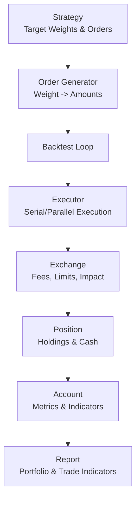
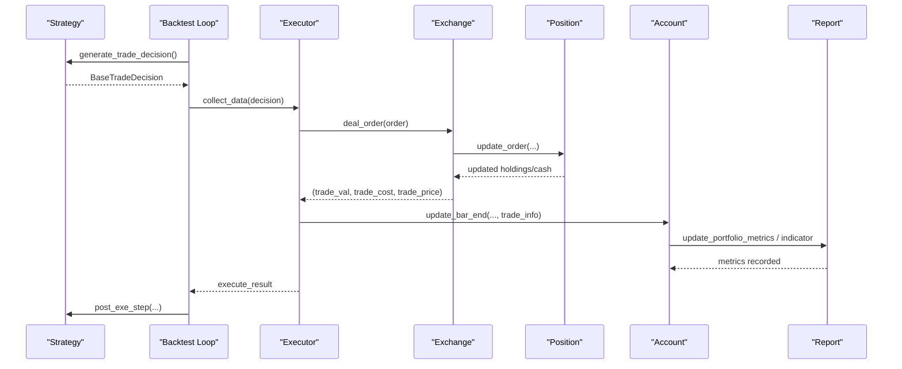
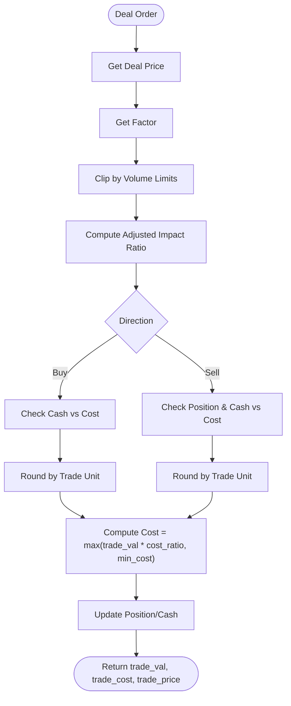
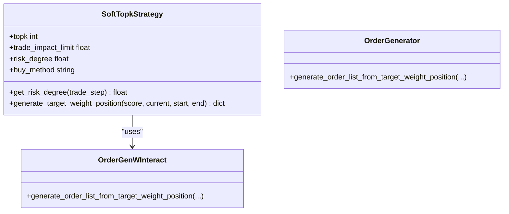
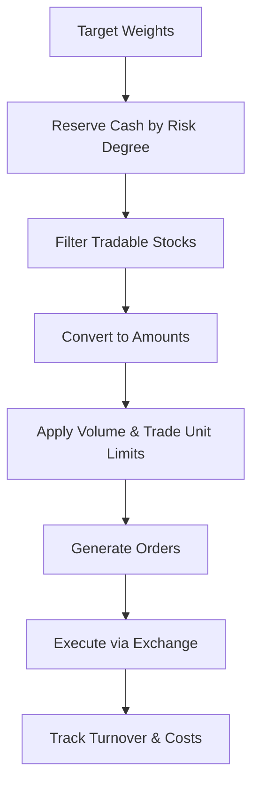
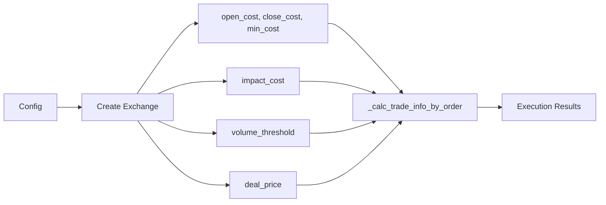
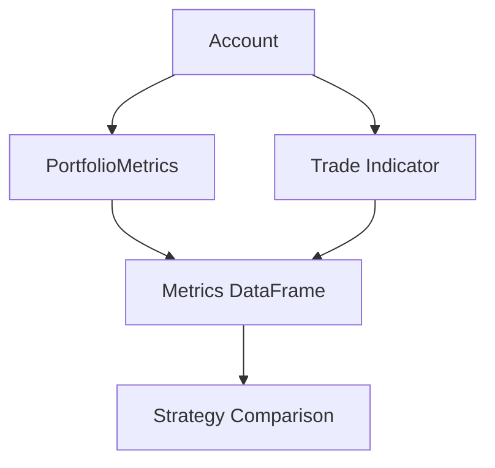
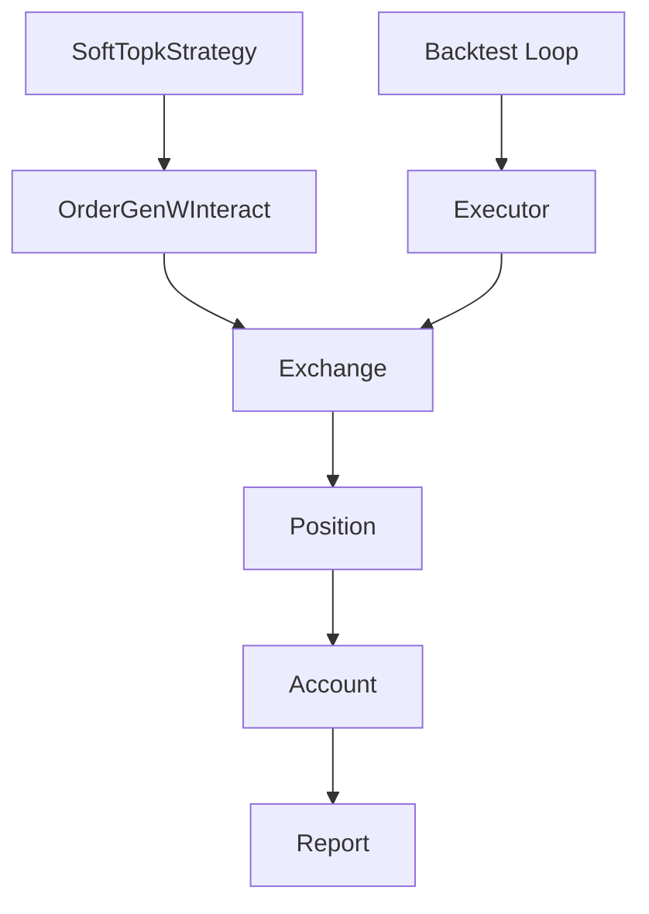

# Cost Control and Transaction Management

<cite>
**Referenced Files in This Document**
- [cost_control.py](file://qlib/contrib/strategy/cost_control.py)
- [order_generator.py](file://qlib/contrib/strategy/order_generator.py)
- [backtest.py](file://qlib/backtest/backtest.py)
- [executor.py](file://qlib/backtest/executor.py)
- [exchange.py](file://qlib/backtest/exchange.py)
- [account.py](file://qlib/backtest/account.py)
- [position.py](file://qlib/backtest/position.py)
- [report.py](file://qlib/backtest/report.py)
- [__init__.py](file://qlib/backtest/__init__.py)
</cite>

## Table of Contents
1. [Introduction](#introduction)
2. [Project Structure](#project-structure)
3. [Core Components](#core-components)
4. [Architecture Overview](#architecture-overview)
5. [Detailed Component Analysis](#detailed-component-analysis)
6. [Dependency Analysis](#dependency-analysis)
7. [Performance Considerations](#performance-considerations)
8. [Troubleshooting Guide](#troubleshooting-guide)
9. [Conclusion](#conclusion)
10. [Appendices](#appendices)

## Introduction
This document explains how QLib models transaction costs and manages trades within strategies and backtesting. It covers:
- How market impact, slippage, commissions, and minimum fees are modeled
- How cost-aware trading algorithms limit turnover and position changes
- How liquidity constraints and trade units affect execution
- How to implement custom cost models and integrate exchange fee structures
- How to analyze performance with cost-aware metrics and optimize execution timing and routing

The goal is to help you design strategies that minimize execution costs while preserving performance targets.

## Project Structure
QLib’s cost control spans strategy-level decisions (target weights and order generation) and backtest-level execution (exchange simulation, account updates, and reporting). Key modules:
- Strategy layer: target weight generation and order list creation
- Backtest loop: orchestrates strategy and executor interactions
- Executor: runs orders through the exchange and updates positions
- Exchange: simulates market, applies fees, limits, and impact
- Account/Position: tracks cash, holdings, and metrics
- Reporting: records portfolio and trade indicators for analysis

**Diagram sources**
- [backtest.py:25-110](file://qlib/backtest/backtest.py#L25-L110)
- [executor.py:22-304](file://qlib/backtest/executor.py#L22-L304)
- [exchange.py:28-200](file://qlib/backtest/exchange.py#L28-L200)
- [account.py:71-180](file://qlib/backtest/account.py#L71-L180)
- [position.py:231-420](file://qlib/backtest/position.py#L231-L420)
- [report.py:22-200](file://qlib/backtest/report.py#L22-L200)

**Section sources**
- [backtest.py:25-110](file://qlib/backtest/backtest.py#L25-L110)
- [executor.py:22-304](file://qlib/backtest/executor.py#L22-L304)

## Core Components
- SoftTopkStrategy: Implements a budget-constrained rebalancing engine with per-stock trade impact limits to control turnover and smooth transitions.
- Order generators: Convert target weights into executable amounts considering tradability, reserved cash, and cost adjustments.
- Exchange: Central place for cost modeling (open/close costs, minimum fees), market impact (slippage), volume limits, and trade unit rounding.
- Account/Position: Track realized costs, turnover, returns, and update holdings and cash after each trade.
- Reporting: Aggregates portfolio metrics and trade indicators to evaluate cost-effectiveness.

**Section sources**
- [cost_control.py:8-118](file://qlib/contrib/strategy/cost_control.py#L8-L118)
- [order_generator.py:15-140](file://qlib/contrib/strategy/order_generator.py#L15-L140)
- [exchange.py:28-200](file://qlib/backtest/exchange.py#L28-L200)
- [account.py:71-180](file://qlib/backtest/account.py#L71-L180)
- [report.py:22-200](file://qlib/backtest/report.py#L22-L200)

## Architecture Overview
The backtest loop coordinates strategy decisions and execution. At each step:
- The strategy generates a trade decision (orders or target weights)
- The executor iterates over orders, calling the exchange to deal them
- The exchange calculates price, value, and cost, applying fees, impact, and limits
- The account updates positions, cash, and metrics; report aggregates indicators

**Diagram sources**
- [backtest.py:25-110](file://qlib/backtest/backtest.py#L25-L110)
- [executor.py:227-304](file://qlib/backtest/executor.py#L227-L304)
- [exchange.py:421-464](file://qlib/backtest/exchange.py#L421-L464)
- [account.py:338-403](file://qlib/backtest/account.py#L338-L403)
- [report.py:153-200](file://qlib/backtest/report.py#L153-L200)

## Detailed Component Analysis

### Transaction Cost Modeling in Exchange
- Commission structure:
  - Open cost (buy): open_cost rate applied to trade value
  - Close cost (sell): close_cost rate applied to trade value
  - Minimum fee: min_cost ensures a floor on commission regardless of trade size
- Market impact (slippage):
  - impact_cost scales quadratically with trade value relative to total traded value in the bar
  - Adjusted cost ratio = impact_cost * (trade_val / total_trade_val)^2
- Volume limits:
  - buy_vol_limit/sell_vol_limit can clip order sizes based on cumulative or current volume expressions
- Trade unit rounding:
  - round_amount_by_trade_unit enforces lot sizes via factor/trade_unit
- Deal price selection:
  - get_deal_price supports configurable fields like $close/$vwap and falls back to close if needed

**Diagram sources**
- [exchange.py:859-952](file://qlib/backtest/exchange.py#L859-L952)
- [exchange.py:786-858](file://qlib/backtest/exchange.py#L786-L858)
- [exchange.py:589-610](file://qlib/backtest/exchange.py#L589-L610)
- [exchange.py:494-514](file://qlib/backtest/exchange.py#L494-L514)

**Section sources**
- [exchange.py:28-200](file://qlib/backtest/exchange.py#L28-L200)
- [exchange.py:859-952](file://qlib/backtest/exchange.py#L859-L952)

### Cost-Aware Trading Algorithms
- SoftTopkStrategy:
  - Uses proportional budget allocation to reach target weights
  - Applies per-stock trade_impact_limit to cap weight changes per step
  - Releases cash from sells and allocates buys proportionally to shortfalls, capped by impact limits
  - Supports risk_degree to control overall exposure
- Order generators:
  - OrderGenWInteract adjusts for reserved cash and cost rates when converting weights to amounts
  - Ensures only tradable stocks receive allocations and respects risk degree
  - Generates orders via exchange APIs to handle rounding and limits

**Diagram sources**
- [cost_control.py:8-118](file://qlib/contrib/strategy/cost_control.py#L8-L118)
- [order_generator.py:51-140](file://qlib/contrib/strategy/order_generator.py#L51-L140)

**Section sources**
- [cost_control.py:8-118](file://qlib/contrib/strategy/cost_control.py#L8-L118)
- [order_generator.py:51-140](file://qlib/contrib/strategy/order_generator.py#L51-L140)

### Position Sizing Constraints, Turnover Limits, Liquidity
- Position sizing:
  - Target weights converted to amounts using exchange methods that respect tradability and prices
  - Reserved cash ensures leverage/risk controls
- Turnover limits:
  - trade_impact_limit caps per-stock weight change per step
  - Accumulated turnover tracked in account and reported
- Liquidity considerations:
  - Volume thresholds clip large orders to available liquidity
  - Suspended/limited stocks are excluded from trading
  - Trade unit rounding prevents fractional lots

**Diagram sources**
- [order_generator.py:51-140](file://qlib/contrib/strategy/order_generator.py#L51-L140)
- [exchange.py:786-858](file://qlib/backtest/exchange.py#L786-L858)
- [account.py:183-224](file://qlib/backtest/account.py#L183-L224)

**Section sources**
- [order_generator.py:51-140](file://qlib/contrib/strategy/order_generator.py#L51-L140)
- [exchange.py:786-858](file://qlib/backtest/exchange.py#L786-L858)
- [account.py:183-224](file://qlib/backtest/account.py#L183-L224)

### Custom Cost Models and Exchange Fee Integration
- Configurable fees:
  - open_cost, close_cost, min_cost parameters define commission structure
  - deal_price allows selecting different price references for buys/sells
- Market impact:
  - impact_cost parameter enables quadratic slippage model based on trade size vs. bar volume
- Volume limits:
  - volume_threshold supports expressions for dynamic capacity limits
- Extensibility:
  - Use init_instance_by_config to plug in custom Exchange implementations
  - Override _calc_trade_info_by_order to implement bespoke cost logic
  - Add extra_quote fields for additional market data used in cost calculations

**Diagram sources**
- [exchange.py:28-200](file://qlib/backtest/exchange.py#L28-L200)
- [exchange.py:859-952](file://qlib/backtest/exchange.py#L859-L952)
- [__init__.py:43-114](file://qlib/backtest/__init__.py#L43-L114)

**Section sources**
- [exchange.py:28-200](file://qlib/backtest/exchange.py#L28-L200)
- [exchange.py:859-952](file://qlib/backtest/exchange.py#L859-L952)
- [__init__.py:43-114](file://qlib/backtest/__init__.py#L43-L114)

### Performance Analysis of Cost-Effective Trading
- Portfolio metrics:
  - Tracks return, cost, turnover, account value, cash, benchmark comparison
  - Return excludes transaction fees; cost includes fees and slippage
- Trade indicators:
  - Price advantage (PA), positive rate (POS), fulfill rate (FFR) aggregated per step
  - Configurable weighting methods (mean, amount-weighted, value-weighted)
- Evaluation:
  - Use report outputs to compare strategies under different cost assumptions
  - Analyze turnover and cost rates to identify excessive trading

**Diagram sources**
- [account.py:338-403](file://qlib/backtest/account.py#L338-L403)
- [report.py:22-200](file://qlib/backtest/report.py#L22-L200)

**Section sources**
- [account.py:338-403](file://qlib/backtest/account.py#L338-L403)
- [report.py:22-200](file://qlib/backtest/report.py#L22-L200)

## Dependency Analysis
- Strategy depends on order generator to convert weights to amounts
- Backtest loop depends on executor to orchestrate steps
- Executor depends on exchange for order dealing and cost calculation
- Account depends on position for holdings and cash updates
- Report depends on account metrics and indicators for evaluation

**Diagram sources**
- [cost_control.py:8-118](file://qlib/contrib/strategy/cost_control.py#L8-L118)
- [order_generator.py:51-140](file://qlib/contrib/strategy/order_generator.py#L51-L140)
- [backtest.py:25-110](file://qlib/backtest/backtest.py#L25-L110)
- [executor.py:227-304](file://qlib/backtest/executor.py#L227-L304)
- [exchange.py:421-464](file://qlib/backtest/exchange.py#L421-L464)
- [account.py:338-403](file://qlib/backtest/account.py#L338-L403)
- [report.py:153-200](file://qlib/backtest/report.py#L153-L200)

**Section sources**
- [backtest.py:25-110](file://qlib/backtest/backtest.py#L25-L110)
- [executor.py:227-304](file://qlib/backtest/executor.py#L227-L304)

## Performance Considerations
- Minimize unnecessary turnover:
  - Use trade_impact_limit to smooth rebalancing and reduce churn
  - Prefer larger, less frequent trades when signal stability permits
- Optimize execution timing:
  - Choose deal_price to reflect realistic execution (e.g., vwap for intraday)
  - Leverage nested execution to split portfolio decisions and order pacing across frequencies
- Manage liquidity:
  - Set volume_threshold to avoid impacting markets excessively
  - Avoid trading illiquid or limited stocks during restricted periods
- Tune cost parameters:
  - Calibrate impact_cost to match historical slippage profiles
  - Adjust open/close costs and min_cost to reflect actual broker fees

[No sources needed since this section provides general guidance]

## Troubleshooting Guide
- Orders clipped due to cost higher than cash:
  - Ensure sufficient cash reserves and consider reducing order sizes
  - Check min_cost and cost_ratio settings
- Orders clipped due to cash limitation:
  - Review reserved cash and risk_degree; adjust to allow more trading
- Volume limits preventing execution:
  - Verify volume_threshold expressions and ensure they align with market conditions
- Suspended or limited stocks:
  - Confirm tradability checks and limit_threshold configuration
- Inconsistent metrics:
  - Validate that portfolio metrics are enabled and account reset properly between runs

**Section sources**
- [exchange.py:919-936](file://qlib/backtest/exchange.py#L919-L936)
- [exchange.py:894-918](file://qlib/backtest/exchange.py#L894-L918)
- [exchange.py:338-419](file://qlib/backtest/exchange.py#L338-L419)
- [account.py:338-403](file://qlib/backtest/account.py#L338-L403)

## Conclusion
QLib provides a robust framework for modeling transaction costs and managing trades in strategies. By combining cost-aware algorithms (like SoftTopkStrategy with impact limits), detailed exchange simulations (fees, slippage, liquidity), and comprehensive reporting, you can design and evaluate strategies that prioritize cost-effective execution. Proper tuning of cost parameters, turnover limits, and liquidity constraints helps maintain strategy performance while minimizing real-world trading frictions.

[No sources needed since this section summarizes without analyzing specific files]

## Appendices

### Implementing Custom Cost Models
- Extend Exchange:
  - Override _calc_trade_info_by_order to implement custom fee structures or non-quadratic impact models
  - Add new fields to extra_quote for advanced market data inputs
- Integrate with Strategies:
  - Modify order generators to incorporate custom cost estimates into target amount calculations
  - Use soft top-k impact limits to enforce conservative rebalancing under high-cost regimes

**Section sources**
- [exchange.py:859-952](file://qlib/backtest/exchange.py#L859-L952)
- [order_generator.py:51-140](file://qlib/contrib/strategy/order_generator.py#L51-L140)

### Examples of Cost-Effective Execution Patterns
- Weekly portfolio generation with daily order execution:
  - Reduces turnover by aligning rebalancing cadence with signal reliability
- High-frequency order execution:
  - Use nested executors to pace orders and manage intraday liquidity constraints

**Section sources**
- [examples/nested_decision_execution/README.md:1-30](file://examples/nested_decision_execution/README.md#L1-L30)