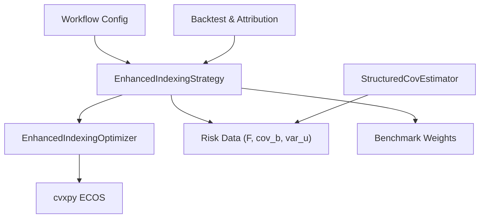
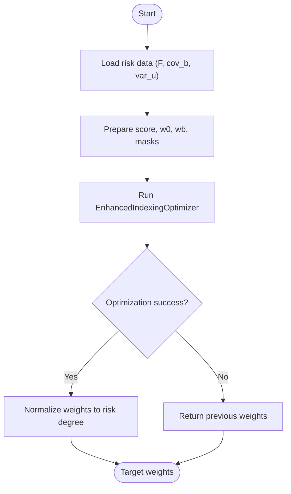
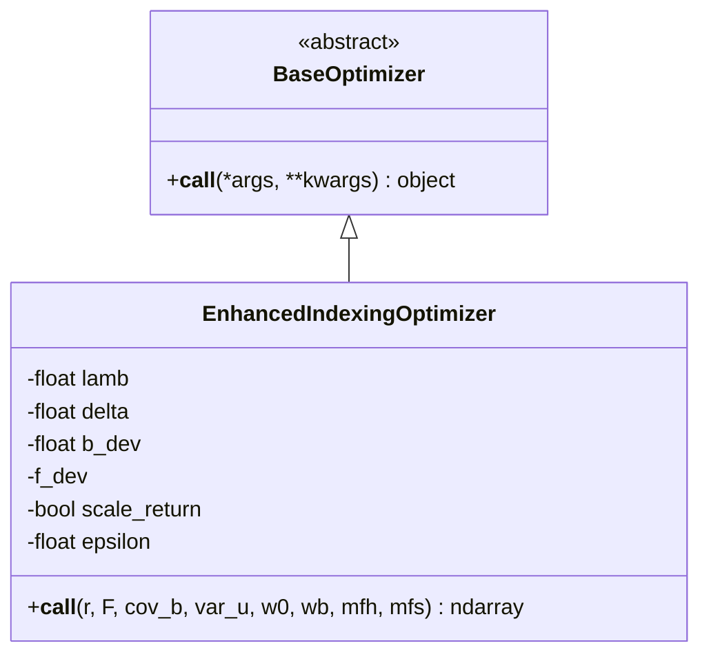
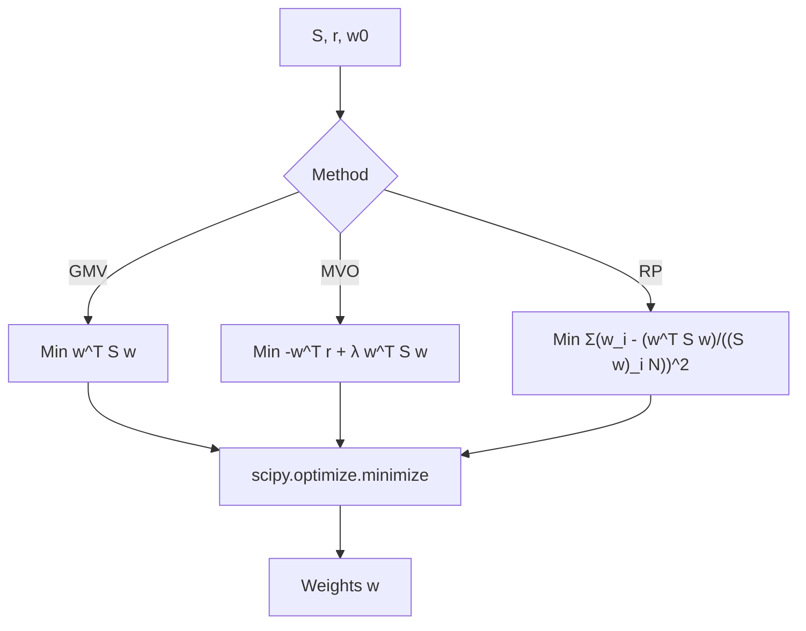
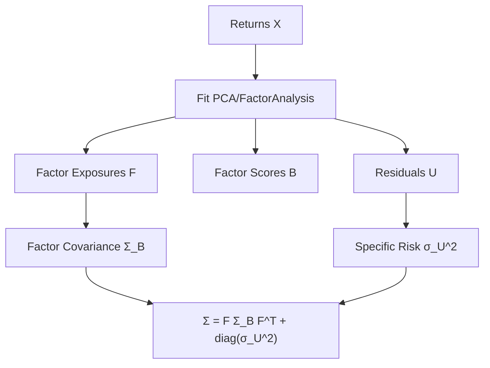
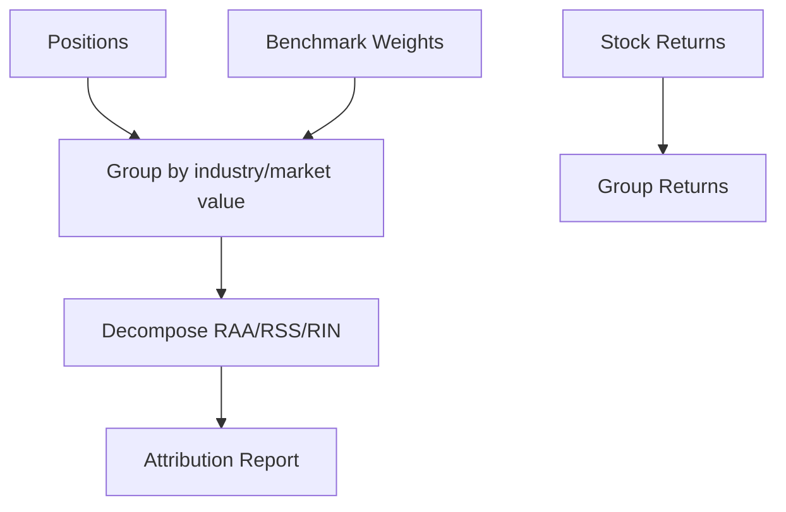
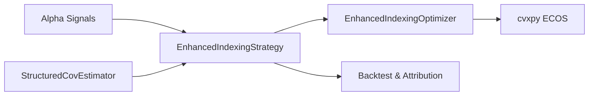

# Portfolio Optimization Strategies

<cite>
**Referenced Files in This Document**
- [config_enhanced_indexing.yaml](file://examples/portfolio/config_enhanced_indexing.yaml)
- [README.md](file://examples/portfolio/README.md)
- [prepare_riskdata.py](file://examples/portfolio/prepare_riskdata.py)
- [enhanced_indexing.py](file://qlib/contrib/strategy/optimizer/enhanced_indexing.py)
- [base.py](file://qlib/contrib/strategy/optimizer/base.py)
- [optimizer.py](file://qlib/contrib/strategy/optimizer/optimizer.py)
- [signal_strategy.py](file://qlib/contrib/strategy/signal_strategy.py)
- [base.py](file://qlib/model/riskmodel/base.py)
- [structured.py](file://qlib/model/riskmodel/structured.py)
- [profit_attribution.py](file://qlib/backtest/profit_attribution.py)
</cite>

## Table of Contents
1. [Introduction](#introduction)
2. [Project Structure](#project-structure)
3. [Core Components](#core-components)
4. [Architecture Overview](#architecture-overview)
5. [Detailed Component Analysis](#detailed-component-analysis)
6. [Dependency Analysis](#dependency-analysis)
7. [Performance Considerations](#performance-considerations)
8. [Troubleshooting Guide](#troubleshooting-guide)
9. [Conclusion](#conclusion)
10. [Appendices](#appendices)

## Introduction
This document explains portfolio optimization strategies implemented in QLib with a focus on modern portfolio theory and practical enhancements for index tracking. It covers:
- Mathematical foundations: mean-variance optimization, risk parity, minimum variance, and enhanced indexing (active return vs. tracking error).
- Risk modeling: structured covariance estimation via factor models and specific risk handling.
- Constraint handling: turnover limits, benchmark deviation bounds, force-hold/force-sell masks, and non-negativity/full investment constraints.
- Transaction cost considerations and rebalancing frequency implications.
- Practical configuration examples for different objectives and risk profiles.
- Performance attribution, risk analysis, and robustness evaluation of optimized portfolios.

## Project Structure
QLib’s portfolio optimization is composed of:
- Strategy layer: EnhancedIndexingStrategy orchestrates signal processing, risk data loading, and optimization calls.
- Optimizer layer: EnhancedIndexingOptimizer formulates and solves the enhanced indexing problem; PortfolioOptimizer provides GMV, MVO, and risk parity solvers.
- Risk model layer: StructuredCovEstimator estimates factor exposures, factor covariance, and specific risk from returns.
- Backtest and attribution: profit attribution utilities decompose excess returns by allocation and selection effects.



**Diagram sources**
- [signal_strategy.py:375-523](file://qlib/contrib/strategy/signal_strategy.py#L375-L523)
- [enhanced_indexing.py:15-202](file://qlib/contrib/strategy/optimizer/enhanced_indexing.py#L15-L202)
- [structured.py:11-95](file://qlib/model/riskmodel/structured.py#L11-L95)
- [config_enhanced_indexing.yaml:1-72](file://examples/portfolio/config_enhanced_indexing.yaml#L1-L72)

**Section sources**
- [README.md:1-48](file://examples/portfolio/README.md#L1-L48)
- [config_enhanced_indexing.yaml:1-72](file://examples/portfolio/config_enhanced_indexing.yaml#L1-L72)

## Core Components
- EnhancedIndexingStrategy: Loads risk model components per date, prepares current weights, benchmark weights, tradability/blacklist masks, and invokes the optimizer to produce target weights.
- EnhancedIndexingOptimizer: Solves an enhanced indexing objective that maximizes expected excess return minus a penalized tracking error term under constraints including turnover, benchmark deviation, and factor exposure limits.
- PortfolioOptimizer: Provides classical methods (GMV, MVO, Risk Parity, Inverse Volatility) with shared constraint handling and optional L2 regularization.
- StructuredCovEstimator: Estimates factor exposures F, factor covariance cov_b, and specific risk var_u using PCA or Factor Analysis, enabling decomposition-based risk modeling.
- Profit Attribution: Decomposes excess returns into allocation, selection, and interaction effects relative to a benchmark.

**Section sources**
- [signal_strategy.py:375-523](file://qlib/contrib/strategy/signal_strategy.py#L375-L523)
- [enhanced_indexing.py:15-202](file://qlib/contrib/strategy/optimizer/enhanced_indexing.py#L15-L202)
- [optimizer.py:14-266](file://qlib/contrib/strategy/optimizer/optimizer.py#L14-L266)
- [structured.py:11-95](file://qlib/model/riskmodel/structured.py#L11-L95)
- [profit_attribution.py:226-335](file://qlib/backtest/profit_attribution.py#L226-L335)

## Architecture Overview
The end-to-end workflow integrates alpha signals with risk-aware optimization:

```mermaid
sequenceDiagram
participant Cfg as "Config"
participant Strat as "EnhancedIndexingStrategy"
participant RM as "StructuredCovEstimator"
participant Opt as "EnhancedIndexingOptimizer"
participant BT as "Backtest & Attribution"
Cfg->>Strat : Initialize strategy and optimizer kwargs
Strat->>RM : Prepare risk data (F, cov_b, var_u)
RM-->>Strat : Risk components per date
Strat->>Opt : r=score, F, cov_b, var_u, w0, wb, masks
Opt-->>Strat : Target weights w
Strat->>BT : Generate orders from target weights
BT-->>Cfg : Reports and attribution metrics
```

**Diagram sources**
- [config_enhanced_indexing.yaml:12-72](file://examples/portfolio/config_enhanced_indexing.yaml#L12-L72)
- [signal_strategy.py:436-523](file://qlib/contrib/strategy/signal_strategy.py#L436-L523)
- [enhanced_indexing.py:87-202](file://qlib/contrib/strategy/optimizer/enhanced_indexing.py#L87-L202)
- [profit_attribution.py:226-335](file://qlib/backtest/profit_attribution.py#L226-L335)

## Detailed Component Analysis

### Enhanced Indexing Strategy
- Purpose: Combine alpha signals with benchmark tracking by optimizing excess return while controlling tracking error through factor-based risk modeling.
- Inputs:
  - Alpha scores (expected returns) aligned to universe.
  - Risk data: factor exposures F, factor covariance cov_b, specific risk var_u.
  - Current weights w0, benchmark weights wb, tradability mask, blacklist mask.
- Outputs: Target weights w satisfying constraints and normalized to sum to risk degree.



**Diagram sources**
- [signal_strategy.py:462-523](file://qlib/contrib/strategy/signal_strategy.py#L462-L523)
- [enhanced_indexing.py:165-202](file://qlib/contrib/strategy/optimizer/enhanced_indexing.py#L165-L202)

**Section sources**
- [signal_strategy.py:375-523](file://qlib/contrib/strategy/signal_strategy.py#L375-L523)

### Enhanced Indexing Optimizer
- Objective: Maximize d^T r − λ (v^T Σ_b v + d^T diag(var_u) d), where d = w − w_b and v = d^T F.
- Constraints:
  - Non-negativity and full investment: 0 ≤ w_i ≤ 1, Σ w_i = 1.
  - Turnover limit: ||w − w0||_1 ≤ δ.
  - Benchmark deviation bounds: |w_i − w_{b,i}| ≤ b_dev.
  - Factor exposure limits: |v_j| ≤ f_dev_j.
  - Force hold/sell masks override bounds for specific assets.
- Solver: cvxpy with ECOS; warm-started from benchmark weights; fallback if turnover constraint causes failure.



**Diagram sources**
- [base.py:7-13](file://qlib/contrib/strategy/optimizer/base.py#L7-L13)
- [enhanced_indexing.py:15-202](file://qlib/contrib/strategy/optimizer/enhanced_indexing.py#L15-L202)

**Section sources**
- [enhanced_indexing.py:15-202](file://qlib/contrib/strategy/optimizer/enhanced_indexing.py#L15-L202)

### Classical Portfolio Optimizers (GMV, MVO, Risk Parity)
- Global Minimum Variance (GMV): Minimize w^T S w subject to w ≥ 0, Σ w_i = 1.
- Mean-Variance Optimization (MVO): Minimize −w^T r + λ w^T S w subject to w ≥ 0, Σ w_i = 1.
- Risk Parity: Minimize Σ_i [w_i − (w^T S w)/((S w)_i N)]^2 subject to w ≥ 0, Σ w_i = 1.
- Shared features:
  - Optional turnover constraint via initial weights w0.
  - Optional L2 regularization α||w||^2.
  - Return scaling to match volatility when enabled.



**Diagram sources**
- [optimizer.py:14-266](file://qlib/contrib/strategy/optimizer/optimizer.py#L14-L266)

**Section sources**
- [optimizer.py:14-266](file://qlib/contrib/strategy/optimizer/optimizer.py#L14-L266)

### Risk Model: Structured Covariance Estimation
- Factor model: X ≈ B F^T + U, leading to covariance decomposition:
  - Σ = F Σ_B F^T + diag(σ_U^2).
- Methods: PCA or Factor Analysis to estimate F and B; compute factor covariance and specific risk.
- Integration: Used to prepare risk data for enhanced indexing and to inform risk-aware optimization.



**Diagram sources**
- [structured.py:11-95](file://qlib/model/riskmodel/structured.py#L11-L95)
- [base.py:12-148](file://qlib/model/riskmodel/base.py#L12-L148)

**Section sources**
- [structured.py:11-95](file://qlib/model/riskmodel/structured.py#L11-L95)
- [base.py:12-148](file://qlib/model/riskmodel/base.py#L12-L148)

### Performance Attribution
- Brinson-style decomposition separates excess return into:
  - Allocation effect (RAA): differences in group weights vs. benchmark.
  - Selection effect (RSS): differences in group returns vs. benchmark.
  - Interaction effect (RIN): combined effect of weight and return deviations.
- Useful for evaluating whether active decisions improve performance beyond benchmark drift.



**Diagram sources**
- [profit_attribution.py:226-335](file://qlib/backtest/profit_attribution.py#L226-L335)

**Section sources**
- [profit_attribution.py:226-335](file://qlib/backtest/profit_attribution.py#L226-L335)

## Dependency Analysis
Key dependencies and relationships:
- EnhancedIndexingStrategy depends on:
  - Signal pipeline for alpha scores.
  - Risk data loader for F, cov_b, var_u.
  - EnhancedIndexingOptimizer for solving the constrained optimization.
- EnhancedIndexingOptimizer depends on:
  - cvxpy ECOS solver.
  - Inputs: expected returns, factor exposures, factor covariance, specific risk, current/benchmark weights, masks.
- StructuredCovEstimator depends on:
  - sklearn PCA/FactorAnalysis to derive factors and residuals.
- Backtest and attribution depend on:
  - Position tracking and benchmark weights to compute allocation/selection effects.



**Diagram sources**
- [signal_strategy.py:375-523](file://qlib/contrib/strategy/signal_strategy.py#L375-L523)
- [enhanced_indexing.py:15-202](file://qlib/contrib/strategy/optimizer/enhanced_indexing.py#L15-L202)
- [structured.py:11-95](file://qlib/model/riskmodel/structured.py#L11-L95)
- [profit_attribution.py:226-335](file://qlib/backtest/profit_attribution.py#L226-L335)

**Section sources**
- [signal_strategy.py:375-523](file://qlib/contrib/strategy/signal_strategy.py#L375-L523)
- [enhanced_indexing.py:15-202](file://qlib/contrib/strategy/optimizer/enhanced_indexing.py#L15-L202)
- [structured.py:11-95](file://qlib/model/riskmodel/structured.py#L11-L95)
- [profit_attribution.py:226-335](file://qlib/backtest/profit_attribution.py#L226-L335)

## Performance Considerations
- Turnover control:
  - Use turnover limits (δ) to reduce transaction costs and slippage.
  - The optimizer falls back to removing turnover constraints if infeasible.
- Rebalancing frequency:
  - Daily rebalancing increases turnover; consider weekly or monthly cadence to balance responsiveness and costs.
  - Adjust risk_degree to control total invested capital and impact trading costs.
- Risk model quality:
  - Structured covariance improves stability over sample covariance; tune number of factors and preprocessing (winsorization).
- Solver robustness:
  - Warm-starting from benchmark weights accelerates convergence.
  - Small weight threshold (ε) prunes negligible positions to reduce noise.

[No sources needed since this section provides general guidance]

## Troubleshooting Guide
Common issues and resolutions:
- Missing risk data:
  - Ensure risk model files exist for each date; strategy logs warnings and skips optimization if absent.
- Infeasible optimization:
  - Tight benchmark deviation or turnover constraints may cause failure; relax constraints or remove turnover constraint fallback.
- Negative current weights:
  - Strategy asserts non-negative current weights; ensure position accounting is correct before optimization.
- Unstable covariance:
  - Increase factor count or use winsorization; validate specific risk values and handle missing entries.

**Section sources**
- [signal_strategy.py:436-470](file://qlib/contrib/strategy/signal_strategy.py#L436-L470)
- [enhanced_indexing.py:165-202](file://qlib/contrib/strategy/optimizer/enhanced_indexing.py#L165-L202)

## Conclusion
QLib’s portfolio optimization framework integrates alpha-driven strategies with rigorous risk modeling and constraint handling. Enhanced indexing balances active return generation with controlled tracking error, while classical optimizers provide flexible baselines. Robust risk estimation, careful constraint tuning, and thoughtful rebalancing frequency are key to achieving stable, cost-effective performance. Attribution tools enable transparent evaluation of active decisions versus benchmark behavior.

[No sources needed since this section summarizes without analyzing specific files]

## Appendices

### Configuration Example: Enhanced Indexing Workflow
- Key elements:
  - Strategy: EnhancedIndexingStrategy with risk model root and optimizer parameters.
  - Backtest settings: account size, benchmark, exchange costs, and price assumptions.
  - Data handler segments: train/valid/test periods for model training and evaluation.
  - Records: signal and portfolio analysis records for performance monitoring.

**Section sources**
- [config_enhanced_indexing.yaml:12-72](file://examples/portfolio/config_enhanced_indexing.yaml#L12-L72)

### Preparing Risk Data
- Steps:
  - Collect prices and compute returns within a rolling window.
  - Apply winsorization to mitigate outliers.
  - Run StructuredCovEstimator to obtain F, cov_b, and specific risk.
  - Save components per date for strategy consumption.

**Section sources**
- [prepare_riskdata.py:11-53](file://examples/portfolio/prepare_riskdata.py#L11-L53)