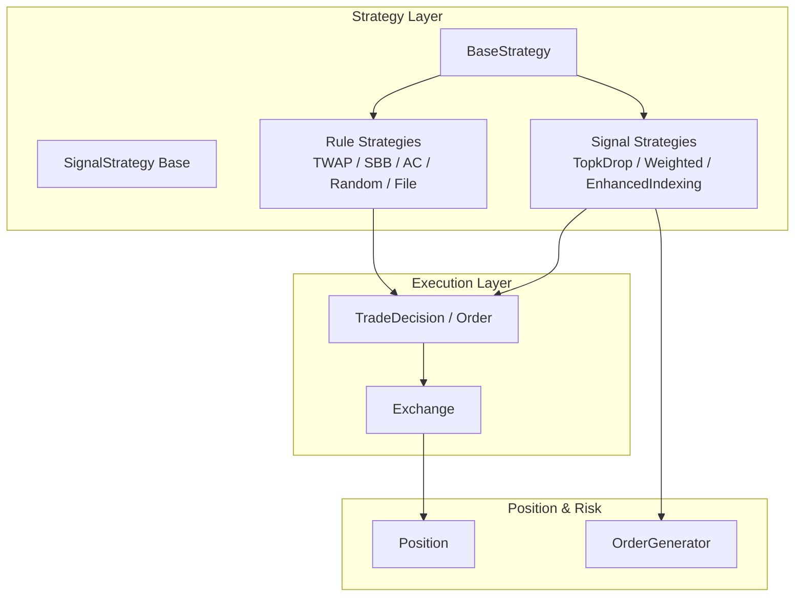
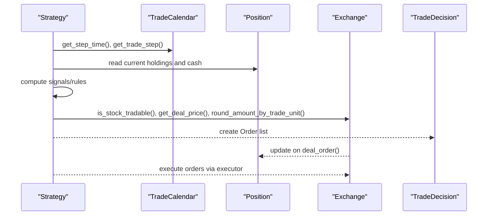
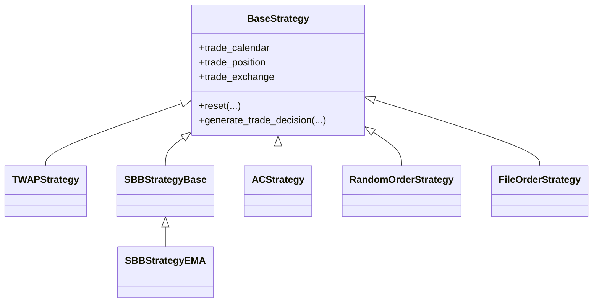
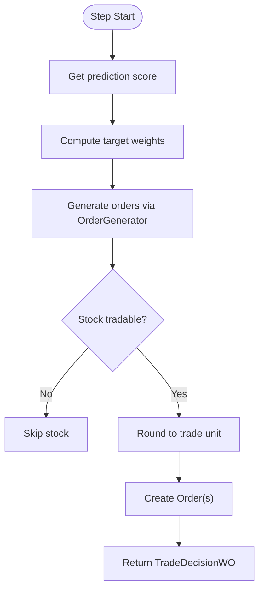
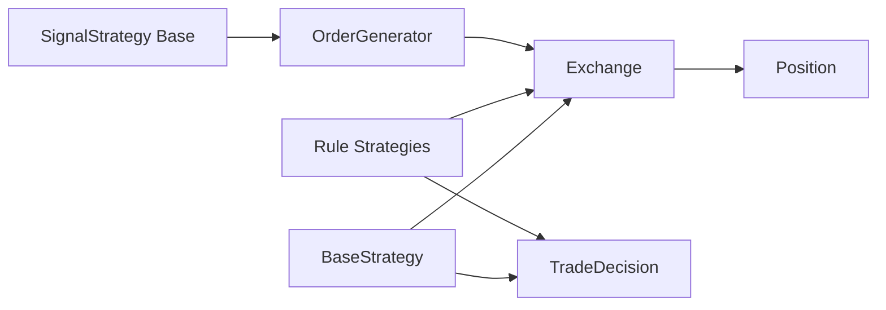

# Rule-Based Strategies

<cite>
**Referenced Files in This Document**
- [rule_strategy.py](file://qlib/contrib/strategy/rule_strategy.py)
- [signal_strategy.py](file://qlib/contrib/strategy/signal_strategy.py)
- [order_generator.py](file://qlib/contrib/strategy/order_generator.py)
- [base.py](file://qlib/strategy/base.py)
- [decision.py](file://qlib/backtest/decision.py)
- [exchange.py](file://qlib/backtest/exchange.py)
- [cost_control.py](file://qlib/contrib/strategy/cost_control.py)
</cite>

## Table of Contents
1. [Introduction](#introduction)
2. [Project Structure](#project-structure)
3. [Core Components](#core-components)
4. [Architecture Overview](#architecture-overview)
5. [Detailed Component Analysis](#detailed-component-analysis)
6. [Dependency Analysis](#dependency-analysis)
7. [Performance Considerations](#performance-considerations)
8. [Troubleshooting Guide](#troubleshooting-guide)
9. [Conclusion](#conclusion)
10. [Appendices](#appendices)

## Introduction
This document explains how to build and configure rule-based trading strategies in QLib, focusing on:
- Predefined strategy patterns that can be adapted for momentum, mean reversion, and breakout logic
- The RuleStrategy implementation family and configuration options
- Order generation mechanisms, position sizing algorithms, and risk management rules
- Building complex rule-based systems with conditional logic and state management
- Strategy parameter optimization, historical validation, and robustness testing across market regimes

QLib’s strategy layer provides a clean abstraction over the backtesting engine (Exchange, Position, TradeDecision), enabling you to implement deterministic rules while leveraging built-in execution constraints, costs, and limits.

## Project Structure
The rule-based strategy ecosystem spans several modules:
- Strategy base classes and lifecycle hooks
- Signal-driven strategies for score-to-order conversion
- Rule-based strategies for direct order generation from indicators or signals
- Order generators that translate target weights into executable orders
- Exchange and decision abstractions for execution, limits, and scheduling

**Diagram sources**
- [base.py:23-146](file://qlib/strategy/base.py#L23-L146)
- [signal_strategy.py:25-73](file://qlib/contrib/strategy/signal_strategy.py#L25-L73)
- [rule_strategy.py:22-123](file://qlib/contrib/strategy/rule_strategy.py#L22-L123)
- [order_generator.py:15-48](file://qlib/contrib/strategy/order_generator.py#L15-L48)
- [decision.py:302-597](file://qlib/backtest/decision.py#L302-L597)
- [exchange.py:28-200](file://qlib/backtest/exchange.py#L28-L200)

**Section sources**
- [base.py:23-146](file://qlib/strategy/base.py#L23-L146)
- [signal_strategy.py:25-73](file://qlib/contrib/strategy/signal_strategy.py#L25-L73)
- [rule_strategy.py:22-123](file://qlib/contrib/strategy/rule_strategy.py#L22-L123)
- [order_generator.py:15-48](file://qlib/contrib/strategy/order_generator.py#L15-L48)
- [decision.py:302-597](file://qlib/backtest/decision.py#L302-L597)
- [exchange.py:28-200](file://qlib/backtest/exchange.py#L28-L200)

## Core Components
- BaseStrategy: Lifecycle and infrastructure accessors (trade calendar, exchange, position). All strategies must implement generate_trade_decision.
- Signal strategies: Convert prediction scores into target positions and then orders via an OrderGenerator. Includes TopkDropoutStrategy and WeightStrategyBase.
- Rule strategies: Directly produce orders based on indicator signals or scheduling logic (e.g., TWAP, SBB with EMA signal, AC volatility-aware allocation, RandomOrderStrategy, FileOrderStrategy).
- OrderGenerator: Translates target weight positions into executable orders using Exchange utilities for pricing, rounding, and cost handling.
- Exchange: Provides deal prices, limits, volume caps, trade units, and order generation helpers.
- Decision objects: Encapsulate orders and optional time ranges for nested execution.

Key responsibilities:
- Stateful rule engines maintain per-stock counters or signals across steps
- Conditional logic gates trades by tradability, limits, and thresholds
- Position sizing uses risk_degree and target weights or explicit amounts
- Execution respects market microstructure (limits, suspension, trade units, costs)

**Section sources**
- [base.py:23-146](file://qlib/strategy/base.py#L23-L146)
- [signal_strategy.py:25-73](file://qlib/contrib/strategy/signal_strategy.py#L25-L73)
- [rule_strategy.py:22-123](file://qlib/contrib/strategy/rule_strategy.py#L22-L123)
- [order_generator.py:15-48](file://qlib/contrib/strategy/order_generator.py#L15-L48)
- [exchange.py:28-200](file://qlib/backtest/exchange.py#L28-L200)
- [decision.py:302-597](file://qlib/backtest/decision.py#L302-L597)

## Architecture Overview
The typical flow for rule-based strategies:
1. Each step, the strategy queries the trade calendar and current position.
2. It computes signals or conditions (e.g., EMA crossover, volatility, trend).
3. It decides whether to buy/sell and how much, respecting risk_degree and trade units.
4. It constructs Orders and wraps them in a TradeDecisionWO.
5. The executor calls Exchange to check tradability, compute deal price, apply limits, and update positions.

**Diagram sources**
- [rule_strategy.py:43-122](file://qlib/contrib/strategy/rule_strategy.py#L43-L122)
- [signal_strategy.py:345-372](file://qlib/contrib/strategy/signal_strategy.py#L345-L372)
- [exchange.py:417-463](file://qlib/backtest/exchange.py#L417-L463)
- [decision.py:547-597](file://qlib/backtest/decision.py#L547-L597)

## Detailed Component Analysis

### RuleStrategy Implementations
- TWAPStrategy: Splits an outer order evenly across a defined horizon, rounding to trade units and ensuring full execution at the last step.
- SBBStrategyBase and SBBStrategyEMA: Alternates between two adjacent bars to decide direction; EMA signal drives long/short/mid trend classification.
- ACStrategy: Uses realized volatility to shape an adaptive allocation curve across the horizon.
- RandomOrderStrategy: Samples stocks by recent average volume and creates random-sized orders within a trade range.
- FileOrderStrategy: Reads orders from CSV and emits them at matching timestamps.

These strategies demonstrate:
- State tracking (remaining amounts, trends)
- Time-aware scheduling (step indices, start/end times)
- Trade unit rounding and last-step completion
- Tradability checks and limit handling via Exchange

**Diagram sources**
- [base.py:23-146](file://qlib/strategy/base.py#L23-L146)
- [rule_strategy.py:22-123](file://qlib/contrib/strategy/rule_strategy.py#L22-L123)
- [rule_strategy.py:125-294](file://qlib/contrib/strategy/rule_strategy.py#L125-L294)
- [rule_strategy.py:297-381](file://qlib/contrib/strategy/rule_strategy.py#L297-L381)
- [rule_strategy.py:383-536](file://qlib/contrib/strategy/rule_strategy.py#L383-L536)
- [rule_strategy.py:539-593](file://qlib/contrib/strategy/rule_strategy.py#L539-L593)
- [rule_strategy.py:596-673](file://qlib/contrib/strategy/rule_strategy.py#L596-L673)

**Section sources**
- [rule_strategy.py:22-123](file://qlib/contrib/strategy/rule_strategy.py#L22-L123)
- [rule_strategy.py:125-294](file://qlib/contrib/strategy/rule_strategy.py#L125-L294)
- [rule_strategy.py:297-381](file://qlib/contrib/strategy/rule_strategy.py#L297-L381)
- [rule_strategy.py:383-536](file://qlib/contrib/strategy/rule_strategy.py#L383-L536)
- [rule_strategy.py:539-593](file://qlib/contrib/strategy/rule_strategy.py#L539-L593)
- [rule_strategy.py:596-673](file://qlib/contrib/strategy/rule_strategy.py#L596-L673)

### Signal-Based Strategies and Order Generation
- BaseSignalStrategy: Wraps a Signal object and exposes risk_degree for dynamic exposure control.
- TopkDropoutStrategy: Selects top-k and drops n each day, generating sell/buy orders with tradability and limit checks.
- WeightStrategyBase: Computes a target weight position from scores and delegates order creation to an OrderGenerator.
- OrderGenWInteract / OrderGenWOInteract: Convert target weights to orders using Exchange APIs for pricing, rounding, and cost adjustments.

**Diagram sources**
- [signal_strategy.py:25-73](file://qlib/contrib/strategy/signal_strategy.py#L25-L73)
- [signal_strategy.py:138-295](file://qlib/contrib/strategy/signal_strategy.py#L138-L295)
- [signal_strategy.py:345-372](file://qlib/contrib/strategy/signal_strategy.py#L345-L372)
- [order_generator.py:51-140](file://qlib/contrib/strategy/order_generator.py#L51-L140)
- [order_generator.py:143-219](file://qlib/contrib/strategy/order_generator.py#L143-L219)

**Section sources**
- [signal_strategy.py:25-73](file://qlib/contrib/strategy/signal_strategy.py#L25-L73)
- [signal_strategy.py:138-295](file://qlib/contrib/strategy/signal_strategy.py#L138-L295)
- [signal_strategy.py:345-372](file://qlib/contrib/strategy/signal_strategy.py#L345-L372)
- [order_generator.py:51-140](file://qlib/contrib/strategy/order_generator.py#L51-L140)
- [order_generator.py:143-219](file://qlib/contrib/strategy/order_generator.py#L143-L219)

### Predefined Patterns: Momentum, Mean Reversion, Breakout
While QLib does not ship dedicated “momentum,” “mean reversion,” or “breakout” strategy classes, these patterns are straightforward to implement using the provided building blocks:

- Momentum: Use a ranking signal (e.g., past returns or model scores) and select top-k assets to hold or rotate via TopkDropoutStrategy or WeightStrategyBase.
- Mean Reversion: Define a signal that identifies overextended assets (e.g., z-score of returns vs. moving average) and use WeightStrategyBase to allocate inversely to deviation.
- Breakout: Compute threshold crossings (e.g., N-day high/low) and trigger entries/exits in a custom BaseStrategy subclass similar to SBBStrategyBase or ACStrategy.

Implementation guidance:
- Derive from BaseStrategy or extend WeightStrategyBase
- In generate_trade_decision, compute your rule-specific signal and conditionally create Orders
- Use Exchange.is_stock_tradable and Exchange.get_deal_price for safe execution
- Apply risk_degree and trade unit rounding via Exchange methods or OrderGenerator

[No sources needed since this section provides conceptual mapping to existing components]

### Order Generation Mechanisms
- Direct order creation: Strategies like TWAP/SBB/AC construct Order objects directly and return TradeDecisionWO.
- Weight-based generation: WeightStrategyBase produces target weights and delegates to OrderGenerator to convert to orders, handling costs, tradability, and rounding.

Key Exchange capabilities used:
- is_stock_tradable: Checks suspension and limit status
- get_deal_price: Resolves buy/sell price expressions
- round_amount_by_trade_unit: Enforces lot sizes
- generate_order_for_target_amount_position: Converts amount targets to orders

**Section sources**
- [decision.py:36-147](file://qlib/backtest/decision.py#L36-L147)
- [decision.py:547-597](file://qlib/backtest/decision.py#L547-L597)
- [exchange.py:417-463](file://qlib/backtest/exchange.py#L417-L463)
- [exchange.py:534-677](file://qlib/backtest/exchange.py#L534-L677)
- [order_generator.py:51-140](file://qlib/contrib/strategy/order_generator.py#L51-L140)
- [order_generator.py:143-219](file://qlib/contrib/strategy/order_generator.py#L143-L219)

### Position Sizing Algorithms
- Explicit sizing: TWAP and AC compute per-step amounts based on remaining balance and allocation curves.
- Risk-degree sizing: Signal strategies scale total exposure by risk_degree and distribute among selected assets.
- Impact-limited rebalancing: SoftTopkStrategy applies trade impact limits to cap per-stock weight changes and synchronizes sells and buys.

Risk controls:
- Reserved cash: OrderGenWInteract reserves (1 - risk_degree) of portfolio value
- Volume and limit constraints: Exchange enforces daily limits and volume caps
- Trade units: Rounding ensures compliance with market lot sizes

**Section sources**
- [rule_strategy.py:43-122](file://qlib/contrib/strategy/rule_strategy.py#L43-L122)
- [rule_strategy.py:461-536](file://qlib/contrib/strategy/rule_strategy.py#L461-L536)
- [signal_strategy.py:345-372](file://qlib/contrib/strategy/signal_strategy.py#L345-L372)
- [order_generator.py:51-140](file://qlib/contrib/strategy/order_generator.py#L51-L140)
- [cost_control.py:8-118](file://qlib/contrib/strategy/cost_control.py#L8-L118)

### Risk Management Rules
- Limit and suspension checks: Exchange.check_stock_limit and check_stock_suspended prevent trading when restricted.
- Volume thresholds: Exchange supports configurable volume limits for buying/selling.
- Cost modeling: Open/close costs and minimum fees are applied during deal_order.
- Exposure control: risk_degree governs maximum invested fraction; dynamic risk_degree enables market timing.

**Section sources**
- [exchange.py:262-336](file://qlib/backtest/exchange.py#L262-L336)
- [exchange.py:338-415](file://qlib/backtest/exchange.py#L338-L415)
- [exchange.py:421-463](file://qlib/backtest/exchange.py#L421-L463)
- [signal_strategy.py:66-73](file://qlib/contrib/strategy/signal_strategy.py#L66-L73)

### Building Complex Rule-Based Systems
- Conditional logic: Combine multiple signals (trend, volatility, liquidity) to gate entries/exits.
- State management: Maintain per-stock counters (e.g., remaining amounts, trend flags) as shown in TWAP/SBB/AC.
- Nested execution: Use TradeRange and nested executors to split decisions across timeframes.
- Customization: Extend BaseStrategy or WeightStrategyBase to embed domain-specific rules while reusing Exchange and OrderGenerator.

Example patterns:
- Trend-following with EMA crossovers (SBBStrategyEMA)
- Volatility-aware pacing (ACStrategy)
- Budget-constrained rebalancing with impact limits (SoftTopkStrategy)

**Section sources**
- [rule_strategy.py:125-294](file://qlib/contrib/strategy/rule_strategy.py#L125-L294)
- [rule_strategy.py:383-536](file://qlib/contrib/strategy/rule_strategy.py#L383-L536)
- [cost_control.py:8-118](file://qlib/contrib/strategy/cost_control.py#L8-L118)
- [decision.py:206-300](file://qlib/backtest/decision.py#L206-L300)

## Dependency Analysis

**Diagram sources**
- [base.py:23-146](file://qlib/strategy/base.py#L23-L146)
- [signal_strategy.py:25-73](file://qlib/contrib/strategy/signal_strategy.py#L25-L73)
- [rule_strategy.py:22-123](file://qlib/contrib/strategy/rule_strategy.py#L22-L123)
- [order_generator.py:15-48](file://qlib/contrib/strategy/order_generator.py#L15-L48)
- [exchange.py:28-200](file://qlib/backtest/exchange.py#L28-L200)
- [decision.py:302-597](file://qlib/backtest/decision.py#L302-L597)

**Section sources**
- [base.py:23-146](file://qlib/strategy/base.py#L23-L146)
- [signal_strategy.py:25-73](file://qlib/contrib/strategy/signal_strategy.py#L25-L73)
- [rule_strategy.py:22-123](file://qlib/contrib/strategy/rule_strategy.py#L22-L123)
- [order_generator.py:15-48](file://qlib/contrib/strategy/order_generator.py#L15-L48)
- [exchange.py:28-200](file://qlib/backtest/exchange.py#L28-L200)
- [decision.py:302-597](file://qlib/backtest/decision.py#L302-L597)

## Performance Considerations
- Prefer daily frequency for faster backtests when intraday detail is unnecessary.
- Use WeightStrategyBase with OrderGenWOInteract to avoid look-ahead bias when prices at trade date are unavailable.
- Minimize repeated data fetching by caching signals per step where appropriate.
- Leverage Exchange’s batch operations (generate_order_for_target_amount_position) to reduce overhead.
- Tune risk_degree and trade impact limits to balance turnover and slippage.

[No sources needed since this section provides general guidance]

## Troubleshooting Guide
Common issues and resolutions:
- Orders not executed due to limits or suspension: Verify Exchange.is_stock_tradable and limit_threshold settings.
- Unexpected zero deals: Ensure deal_price fields are available and not NaN; fallback to close price may occur.
- Rounding discrepancies: Confirm trade_unit and factor availability; use round_amount_by_trade_unit consistently.
- Overexposure: Adjust risk_degree and reserved cash logic in OrderGenWInteract.
- Cold start behavior: For TopkDropoutStrategy and SoftTopkStrategy, ensure initial allocations respect impact limits and tradability.

**Section sources**
- [exchange.py:215-234](file://qlib/backtest/exchange.py#L215-L234)
- [exchange.py:338-415](file://qlib/backtest/exchange.py#L338-L415)
- [exchange.py:494-514](file://qlib/backtest/exchange.py#L494-L514)
- [exchange.py:728-784](file://qlib/backtest/exchange.py#L728-L784)
- [signal_strategy.py:138-295](file://qlib/contrib/strategy/signal_strategy.py#L138-L295)
- [cost_control.py:8-118](file://qlib/contrib/strategy/cost_control.py#L8-L118)

## Conclusion
QLib’s strategy framework provides robust primitives for implementing rule-based trading systems:
- Use BaseStrategy for custom rule engines with explicit order construction
- Use SignalStrategy and WeightStrategyBase for score-driven portfolios with flexible order generation
- Leverage Exchange for realistic execution, limits, and costs
- Apply risk_degree and impact limits to control exposure and turnover

By combining these components, you can build sophisticated strategies that emulate momentum, mean reversion, and breakout patterns while maintaining rigorous risk management and execution fidelity.

[No sources needed since this section summarizes without analyzing specific files]

## Appendices

### A. Parameter Optimization and Validation Workflow
- Parameter search: Vary strategy parameters (e.g., topk, drop count, risk_degree, window sizes) and evaluate via backtest loops.
- Historical validation: Run multi-period backtests across different market regimes to assess stability.
- Robustness tests: Stress-test with varying limit_threshold, volume_threshold, and cost assumptions.

[No sources needed since this section provides general guidance]

### B. Example: Adapting SBBStrategyEMA for Breakout Logic
- Replace EMA signal with a breakout detector (e.g., N-day high/low)
- Keep the alternating bar execution pattern to pace entries/exits
- Use Exchange checks and rounding to ensure feasible execution

[No sources needed since this section provides conceptual guidance]