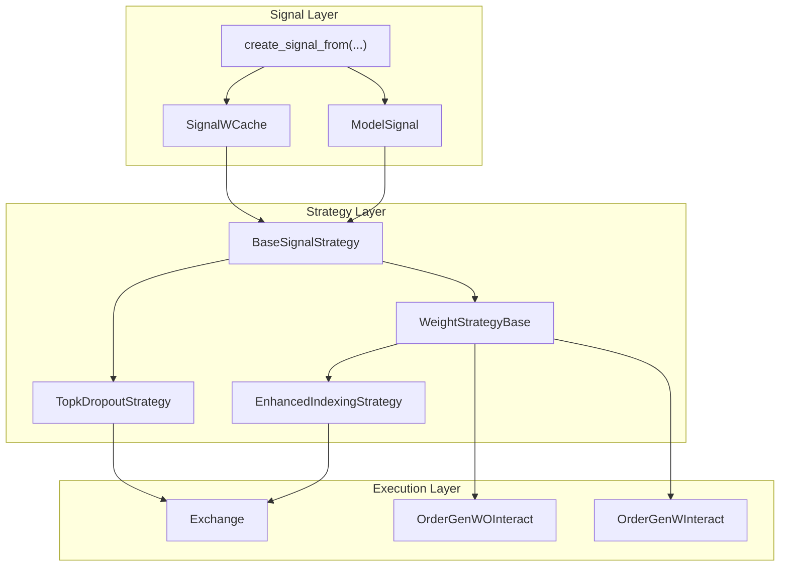
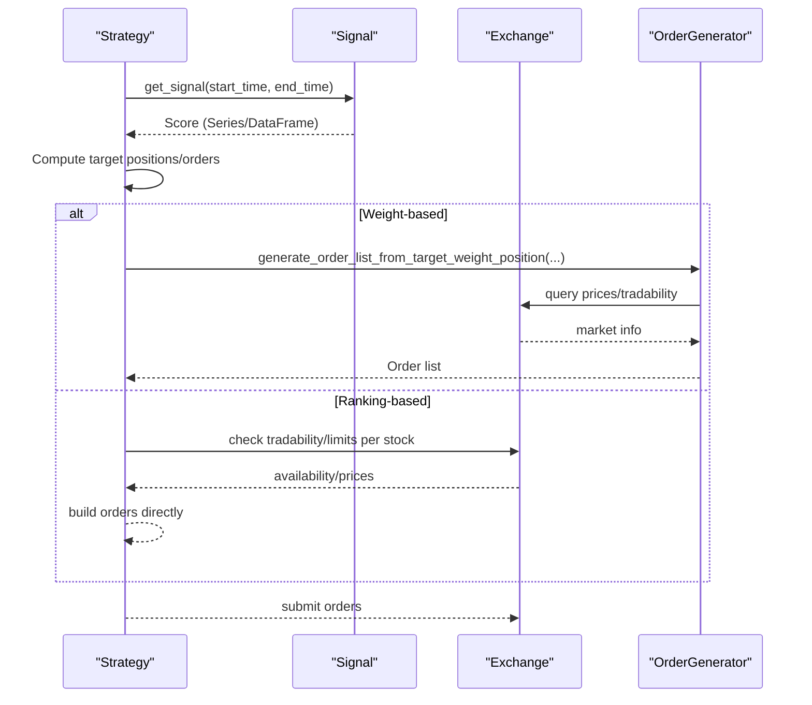
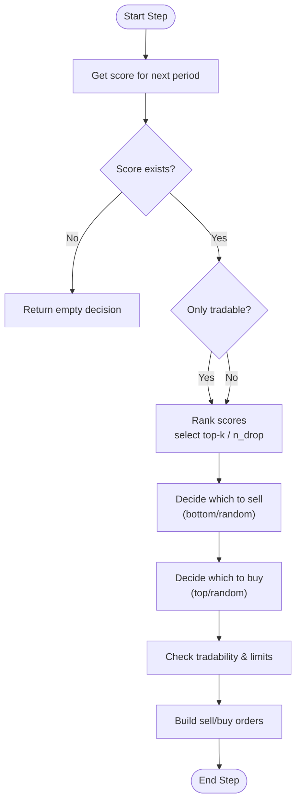
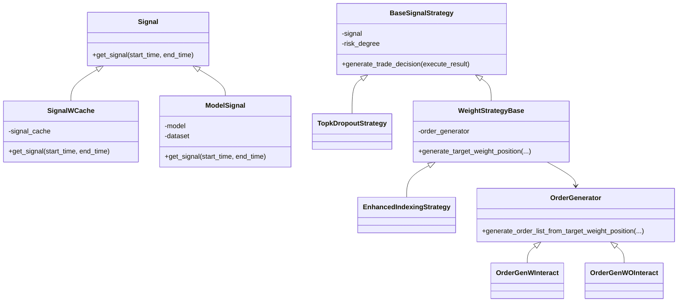

# Signal-Based Strategies

<cite>
**Referenced Files in This Document**
- [signal_strategy.py](file://qlib/contrib/strategy/signal_strategy.py)
- [signal.py](file://qlib/backtest/signal.py)
- [base.py](file://qlib/strategy/base.py)
- [order_generator.py](file://qlib/contrib/strategy/order_generator.py)
- [processor.py](file://qlib/data/dataset/processor.py)
- [workflow_config_lightgbm_Alpha158.yaml](file://examples/benchmarks/LightGBM/workflow_config_lightgbm_Alpha158.yaml)
- [workflow_config_linear_Alpha158.yaml](file://examples/benchmarks/Linear/workflow_config_linear_Alpha158.yaml)
</cite>

## Table of Contents
1. [Introduction](#introduction)
2. [Project Structure](#project-structure)
3. [Core Components](#core-components)
4. [Architecture Overview](#architecture-overview)
5. [Detailed Component Analysis](#detailed-component-analysis)
6. [Dependency Analysis](#dependency-analysis)
7. [Performance Considerations](#performance-considerations)
8. [Troubleshooting Guide](#troubleshooting-guide)
9. [Conclusion](#conclusion)
10. [Appendices](#appendices)

## Introduction
This document explains how QLib converts model predictions into actionable trading signals and executes them via signal-based strategies. It focuses on the Signal abstraction, the strategy classes that consume signals (TopkDropoutStrategy and WeightStrategyBase with EnhancedIndexingStrategy), and the order generation pipeline. It also covers signal normalization and transformation tools available in the data layer, configuration patterns for threshold/ranking/composition approaches, and guidance for robustness testing and performance optimization.

## Project Structure
Signal-based workflows in QLib are composed of:
- Signal sources and adapters that provide time-aligned scores to strategies
- Strategy implementations that translate scores into orders
- Order generators that convert target weights into executable orders
- Data processors that normalize and transform features or labels prior to modeling

**Diagram sources**
- [signal.py:16-105](file://qlib/backtest/signal.py#L16-L105)
- [signal_strategy.py:25-523](file://qlib/contrib/strategy/signal_strategy.py#L25-L523)
- [order_generator.py:15-220](file://qlib/contrib/strategy/order_generator.py#L15-L220)

**Section sources**
- [signal.py:16-105](file://qlib/backtest/signal.py#L16-L105)
- [signal_strategy.py:25-523](file://qlib/contrib/strategy/signal_strategy.py#L25-L523)
- [order_generator.py:15-220](file://qlib/contrib/strategy/order_generator.py#L15-L220)

## Core Components
- Signal abstraction: A unified interface to retrieve time-aligned prediction scores used by strategies. Implementations include a cache-backed signal and a model-driven signal that wraps model.predict outputs.
- BaseSignalStrategy: Common initialization and risk_degree handling for strategies that operate on signals.
- TopkDropoutStrategy: Ranking-based selection that maintains a fixed portfolio size and rotates holdings each step based on score ranking and dropout rules.
- WeightStrategyBase and EnhancedIndexingStrategy: Weight-based strategies that compute target positions from scores and use an order generator to produce trades; EnhancedIndexingStrategy integrates risk model constraints and benchmark alignment.
- Order generators: Convert target weight positions into concrete orders, with options to interact with exchange pricing or rely on pre-trade information.

Key responsibilities:
- Time alignment: Strategies request signals for the decision window shifted one step ahead to avoid look-ahead bias.
- Risk budgeting: Strategies allocate capital according to risk_degree and position sizing logic.
- Trade feasibility: Exchange checks tradability, limit status, and rounding to trade units before order creation.

**Section sources**
- [signal.py:16-105](file://qlib/backtest/signal.py#L16-L105)
- [signal_strategy.py:25-523](file://qlib/contrib/strategy/signal_strategy.py#L25-L523)
- [order_generator.py:15-220](file://qlib/contrib/strategy/order_generator.py#L15-L220)

## Architecture Overview
The end-to-end flow from model predictions to orders:

**Diagram sources**
- [signal_strategy.py:138-295](file://qlib/contrib/strategy/signal_strategy.py#L138-L295)
- [signal_strategy.py:345-372](file://qlib/contrib/strategy/signal_strategy.py#L345-L372)
- [order_generator.py:51-140](file://qlib/contrib/strategy/order_generator.py#L51-L140)
- [order_generator.py:143-219](file://qlib/contrib/strategy/order_generator.py#L143-L219)

## Detailed Component Analysis

### Signal Abstraction and Creation
- Signal: Abstract base defining get_signal(time window).
- SignalWCache: Wraps a pandas Series/DataFrame and resamples to the decision frequency using last observation.
- ModelSignal: Predicts via a model and dataset, then caches results as a SignalWCache.
- create_signal_from: Factory that accepts raw data, model+dataset tuples, configs, or strings to instantiate appropriate Signal.

Practical implications:
- Use ModelSignal when you want strategies to call model.predict internally.
- Use SignalWCache when you already have prepared scores aligned to instruments and timestamps.
- The factory supports configuration-driven instantiation for flexible pipelines.

**Section sources**
- [signal.py:16-105](file://qlib/backtest/signal.py#L16-L105)

### BaseSignalStrategy and Risk Degree
- Centralizes signal ingestion and risk_degree usage.
- Provides default risk_degree behavior; can be overridden for dynamic market timing.

**Section sources**
- [signal_strategy.py:25-73](file://qlib/contrib/strategy/signal_strategy.py#L25-L73)

### TopkDropoutStrategy (Ranking-Based Selection)
Behavior highlights:
- Retrieves score for the next period and selects top-k candidates.
- Supports configurable buy methods (top/random) and sell methods (bottom/random).
- Enforces minimum holding days before selling.
- Optionally filters only tradable stocks at decision time.
- Respects limit-up/down restrictions via exchange checks.

Decision flow:

**Diagram sources**
- [signal_strategy.py:138-295](file://qlib/contrib/strategy/signal_strategy.py#L138-L295)

Configuration tips:
- topk controls portfolio size.
- n_drop controls turnover.
- method_buy/method_sell determine selection heuristics.
- hold_thresh prevents churn on short holds.
- only_tradable ensures trading feasibility.
- forbid_all_trade_at_limit toggles strict limit handling.

**Section sources**
- [signal_strategy.py:75-295](file://qlib/contrib/strategy/signal_strategy.py#L75-L295)

### WeightStrategyBase and Order Generation
WeightStrategyBase:
- Computes target weight positions from scores via an abstract method.
- Delegates order creation to an OrderGenerator instance.

Order generators:
- OrderGenWInteract: Uses live exchange prices and costs to compute amounts and generate orders.
- OrderGenWOInteract: Relies on pre-trade prices or current position prices; suitable when interaction is not desired.

Target weight generation pattern:
- Strategies implement generate_target_weight_position(score, current, times) to return {stock: weight}.
- Order generator translates weights to amounts considering risk_degree and exchange constraints.

**Section sources**
- [signal_strategy.py:298-372](file://qlib/contrib/strategy/signal_strategy.py#L298-L372)
- [order_generator.py:15-220](file://qlib/contrib/strategy/order_generator.py#L15-L220)

### EnhancedIndexingStrategy (Risk-Model-Aware Weights)
Purpose:
- Combines active management with passive benchmark tracking while controlling risk exposure.

Inputs:
- Risk model files per date: factor exposures, covariance, specific risk, optional blacklist.
- Current position weights and benchmark weights.
- Tradability mask derived from recent volume.

Process:
- Loads risk data for the previous trading date.
- Aligns scores to universe, fills missing values conservatively.
- Builds masks for force-hold and force-sell.
- Optimizes target weights against benchmark and risk constraints.
- Returns non-zero target weights for order generation.

Notes:
- Requires external risk model data directory structure.
- Uses optimizer configured via kwargs.

**Section sources**
- [signal_strategy.py:375-523](file://qlib/contrib/strategy/signal_strategy.py#L375-L523)

### Signal Normalization, Filtering, and Transformation
While strategies operate on scores, preprocessing of features/labels influences signal quality:
- RobustZScoreNorm: Median/MAD-based normalization with optional outlier clipping.
- CSZScoreNorm: Cross-sectional z-score or robust z-score per datetime.
- TanhProcess: Non-linear denoising via tanh on features.
- ProcessInf: Handles infinities in feature matrices.

These processors are typically applied in the data handler pipeline before training/prediction, ensuring stable and comparable signals across time and cross-section.

**Section sources**
- [processor.py:146-175](file://qlib/data/dataset/processor.py#L146-L175)
- [processor.py:233-324](file://qlib/data/dataset/processor.py#L233-L324)

### Configuration Examples
Typical workflow configurations wire model predictions into strategies:
- LightGBM example configures TopkDropoutStrategy with signal set to <PRED>, topk and n_drop parameters, and backtest settings.
- Linear example similarly uses TopkDropoutStrategy and includes feature label processors such as RobustZScoreNorm and CSRankNorm.

These examples demonstrate how to plug model outputs into strategies without custom code.

**Section sources**
- [workflow_config_lightgbm_Alpha158.yaml:13-20](file://examples/benchmarks/LightGBM/workflow_config_lightgbm_Alpha158.yaml#L13-L20)
- [workflow_config_linear_Alpha158.yaml:12-24](file://examples/benchmarks/Linear/workflow_config_linear_Alpha158.yaml#L12-L24)
- [workflow_config_linear_Alpha158.yaml:25-32](file://examples/benchmarks/Linear/workflow_config_linear_Alpha158.yaml#L25-L32)

## Dependency Analysis
High-level dependencies among core components:

**Diagram sources**
- [signal.py:16-105](file://qlib/backtest/signal.py#L16-L105)
- [signal_strategy.py:25-523](file://qlib/contrib/strategy/signal_strategy.py#L25-L523)
- [order_generator.py:15-220](file://qlib/contrib/strategy/order_generator.py#L15-L220)

**Section sources**
- [signal.py:16-105](file://qlib/backtest/signal.py#L16-L105)
- [signal_strategy.py:25-523](file://qlib/contrib/strategy/signal_strategy.py#L25-L523)
- [order_generator.py:15-220](file://qlib/contrib/strategy/order_generator.py#L15-L220)

## Performance Considerations
- Signal caching: SignalWCache stores precomputed scores and resamples to decision frequency, reducing repeated computation.
- Avoid unnecessary interactions: OrderGenWOInteract avoids real-time price queries during order generation, improving throughput when exact intraday prices are not required.
- Efficient ranking: TopkDropoutStrategy sorts scores once per step and reuses indices to minimize redundant operations.
- Risk model loading: EnhancedIndexingStrategy caches risk data per date to avoid repeated file reads.
- Data processing: Apply robust normalization (e.g., RobustZScoreNorm) to stabilize signals and reduce sensitivity to outliers.

[No sources needed since this section provides general guidance]

## Troubleshooting Guide
Common issues and remedies:
- No signal returned: If get_signal returns None for a step, strategies return empty decisions. Verify the underlying data availability and time alignment.
- Multi-column signals: TopkDropoutStrategy currently uses the first column if a DataFrame is provided. Ensure your signal is a Series or select the intended column.
- Tradable stocks filter: When only_tradable=True, ensure exchange tradability checks succeed; otherwise, no trades may occur.
- Limit handling: Forbid-all-trades-at-limit can prevent any action near limits; adjust forbid_all_trade_at_limit to allow selective buying/selling if appropriate.
- Missing risk model data: EnhancedIndexingStrategy skips optimization if risk data for the previous date is unavailable; ensure risk model files exist for all relevant dates.

**Section sources**
- [signal_strategy.py:138-149](file://qlib/contrib/strategy/signal_strategy.py#L138-L149)
- [signal_strategy.py:150-187](file://qlib/contrib/strategy/signal_strategy.py#L150-L187)
- [signal_strategy.py:436-470](file://qlib/contrib/strategy/signal_strategy.py#L436-L470)

## Conclusion
QLib’s signal-based strategies provide a modular pipeline from model predictions to executable orders. Signals are abstracted for flexibility, strategies offer both ranking-based and weight-based approaches, and order generators bridge targets to trades with realistic constraints. Data processors enable robust normalization and transformation to improve signal quality. By combining these components thoughtfully—choosing appropriate signal sources, strategy parameters, and order generation modes—you can build scalable, testable, and efficient trading systems.

[No sources needed since this section summarizes without analyzing specific files]

## Appendices

### Implementing Custom Signal Processors
- Extend Processor to transform features or labels before modeling.
- Use RobustZScoreNorm or CSZScoreNorm for robust cross-sectional normalization.
- Apply TanhProcess for non-linear denoising where appropriate.
- Integrate processors in the data handler configuration to ensure consistent application during train/infer phases.

**Section sources**
- [processor.py:146-175](file://qlib/data/dataset/processor.py#L146-L175)
- [processor.py:233-324](file://qlib/data/dataset/processor.py#L233-L324)

### Combining Multiple Signal Sources
- Create multiple Signal instances (e.g., from different models or datasets).
- Aggregate scores externally (e.g., weighted average) and wrap with SignalWCache.
- Feed the combined signal into a strategy via create_signal_from or direct instantiation.

[No sources needed since this section provides general guidance]

### Signal Quality Assessment and Robustness Testing
- Use recorded signal metrics (e.g., IC/Rank IC) from workflow records to evaluate predictive power.
- Perform out-of-sample tests across different periods and markets.
- Stress-test strategies under varying risk_degree, topk/n_drop, and tradability constraints.
- Validate EnhancedIndexingStrategy with complete risk model data to ensure optimization stability.

**Section sources**
- [workflow_config_lightgbm_Alpha158.yaml:57-71](file://examples/benchmarks/LightGBM/workflow_config_lightgbm_Alpha158.yaml#L57-L71)
- [workflow_config_linear_Alpha158.yaml:62-76](file://examples/benchmarks/Linear/workflow_config_linear_Alpha158.yaml#L62-L76)