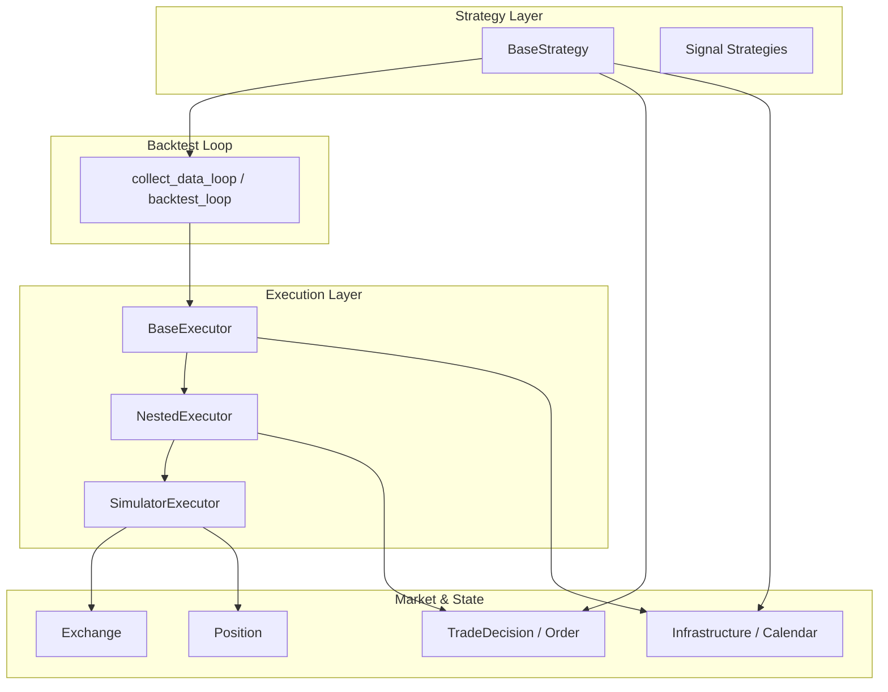
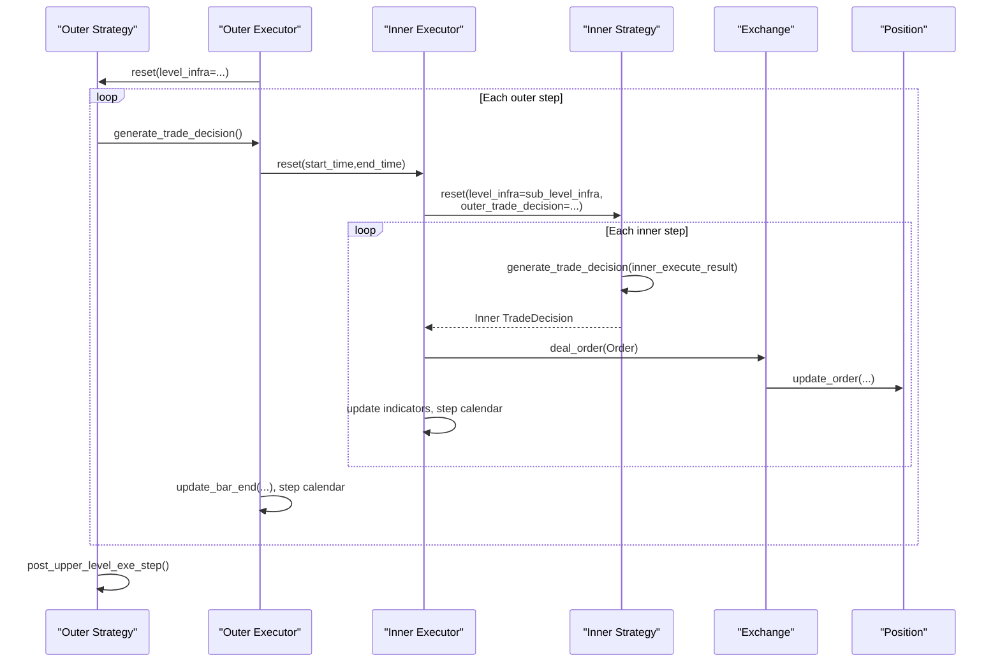
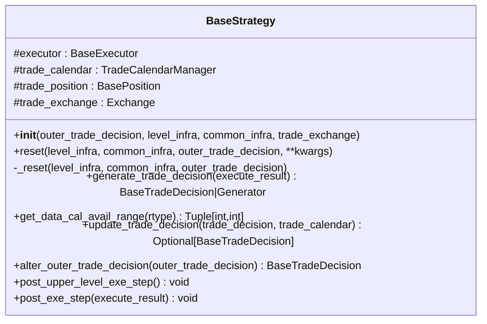
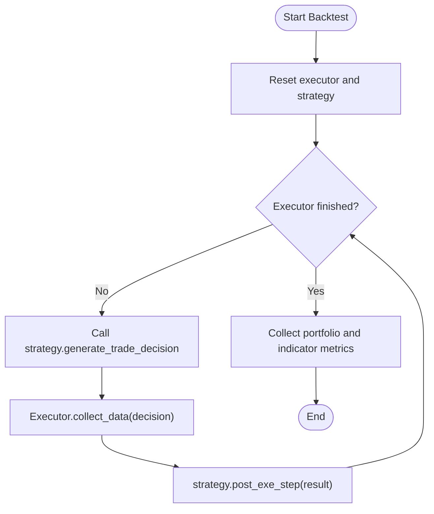
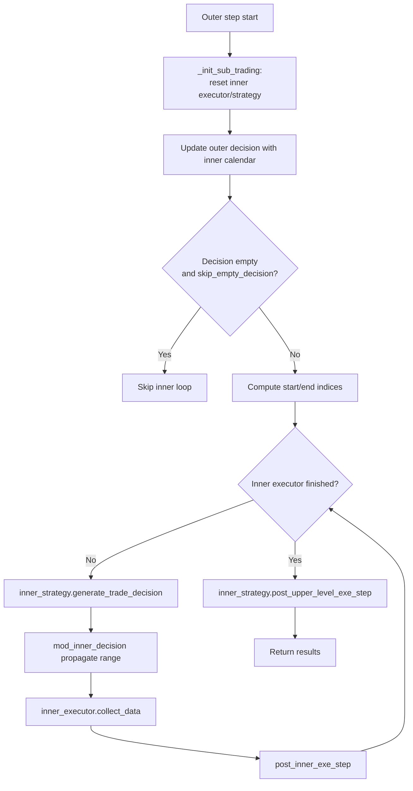
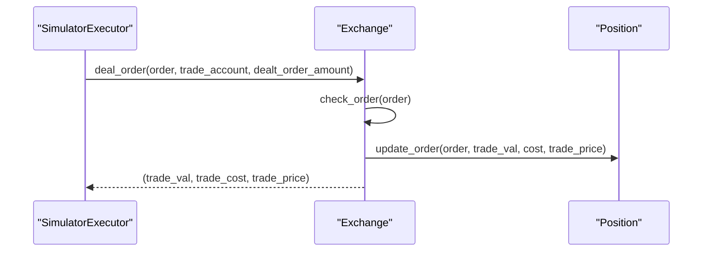
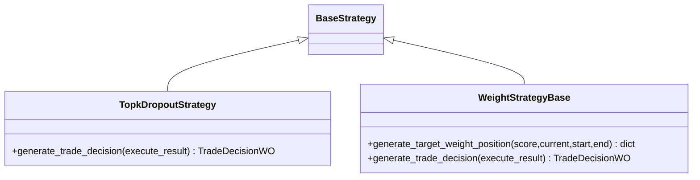
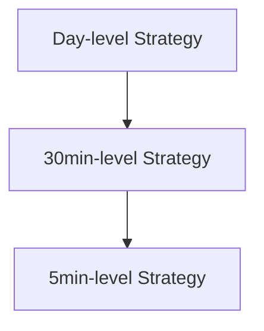
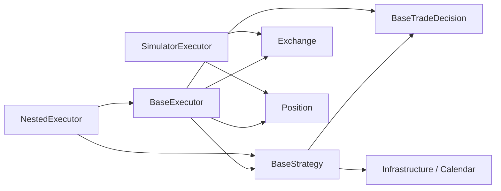

# Strategy Base Framework

<cite>
**Referenced Files in This Document**
- [base.py](file://qlib/strategy/base.py)
- [backtest.py](file://qlib/backtest/backtest.py)
- [executor.py](file://qlib/backtest/executor.py)
- [exchange.py](file://qlib/backtest/exchange.py)
- [position.py](file://qlib/backtest/position.py)
- [decision.py](file://qlib/backtest/decision.py)
- [utils.py](file://qlib/backtest/utils.py)
- [signal_strategy.py](file://qlib/contrib/strategy/signal_strategy.py)
- [workflow.py](file://examples/nested_decision_execution/workflow.py)
</cite>

## Table of Contents
1. [Introduction](#introduction)
2. [Project Structure](#project-structure)
3. [Core Components](#core-components)
4. [Architecture Overview](#architecture-overview)
5. [Detailed Component Analysis](#detailed-component-analysis)
6. [Dependency Analysis](#dependency-analysis)
7. [Performance Considerations](#performance-considerations)
8. [Troubleshooting Guide](#troubleshooting-guide)
9. [Conclusion](#conclusion)
10. [Appendices](#appendices)

## Introduction
This document explains QLib’s strategy base framework, focusing on the BaseStrategy class and how it integrates with the backtesting engine to drive trading decisions across multiple time horizons. It covers:
- The lifecycle of a strategy (initialization, reset, execution hooks)
- The generate_trade_decision interface and its role in the backtesting loop
- The nested execution framework enabling daily and intraday strategies to cooperate
- Relationships among strategies, exchanges, positions, and executors
- Practical guidance for implementing custom strategies by extending BaseStrategy

## Project Structure
The strategy base framework spans several modules:
- Strategy base classes define the contract for user strategies
- Backtest orchestrates the loop between strategy and executor
- Executors manage calendars, account state, and order execution
- Exchange provides market data, limits, costs, and order matching
- Position tracks holdings and cash
- Decision objects encapsulate orders and their execution windows
- Utilities provide shared infrastructure like trade calendars

**Diagram sources**
- [backtest.py:25-110](file://qlib/backtest/backtest.py#L25-L110)
- [executor.py:22-308](file://qlib/backtest/executor.py#L22-L308)
- [executor.py:310-499](file://qlib/backtest/executor.py#L310-L499)
- [exchange.py:28-200](file://qlib/backtest/exchange.py#L28-L200)
- [position.py:16-229](file://qlib/backtest/position.py#L16-L229)
- [decision.py:302-597](file://qlib/backtest/decision.py#L302-L597)
- [utils.py:23-291](file://qlib/backtest/utils.py#L23-L291)

**Section sources**
- [backtest.py:25-110](file://qlib/backtest/backtest.py#L25-L110)
- [executor.py:22-308](file://qlib/backtest/executor.py#L22-L308)
- [executor.py:310-499](file://qlib/backtest/executor.py#L310-L499)
- [exchange.py:28-200](file://qlib/backtest/exchange.py#L28-L200)
- [position.py:16-229](file://qlib/backtest/position.py#L16-L229)
- [decision.py:302-597](file://qlib/backtest/decision.py#L302-L597)
- [utils.py:23-291](file://qlib/backtest/utils.py#L23-L291)

## Core Components
- BaseStrategy: Abstract base defining the strategy lifecycle and decision generation contract.
- BaseExecutor and NestedExecutor: Orchestrate step-by-step execution, calendar management, and nested multi-frequency loops.
- SimulatorExecutor: Executes orders against the Exchange, updating positions and accounting.
- Exchange: Provides market prices, limits, volume constraints, and order settlement logic.
- Position: Tracks holdings, cash, weights, and supports settlement semantics.
- TradeDecision and Order: Encapsulate actionable decisions and their execution windows.
- Infrastructure utilities: TradeCalendarManager and shared infrastructure containers for cross-level communication.

Key responsibilities:
- Strategies produce decisions per bar via generate_trade_decision.
- Executors advance the calendar, invoke strategies, execute orders, update accounts, and collect metrics.
- Nested executors embed lower-frequency strategies inside higher-frequency ones, enabling daily-to-intraday decomposition.

**Section sources**
- [base.py:23-239](file://qlib/strategy/base.py#L23-L239)
- [executor.py:22-308](file://qlib/backtest/executor.py#L22-L308)
- [executor.py:310-499](file://qlib/backtest/executor.py#L310-L499)
- [exchange.py:28-200](file://qlib/backtest/exchange.py#L28-L200)
- [position.py:16-229](file://qlib/backtest/position.py#L16-L229)
- [decision.py:302-597](file://qlib/backtest/decision.py#L302-L597)
- [utils.py:23-291](file://qlib/backtest/utils.py#L23-L291)

## Architecture Overview
The backtesting loop coordinates a top-level strategy with an executor. For nested execution, a higher-frequency inner executor runs an inner strategy within each outer step. Decisions are represented as TradeDecision objects that can carry range limits and be updated at each step.

**Diagram sources**
- [backtest.py:52-110](file://qlib/backtest/backtest.py#L52-L110)
- [executor.py:389-483](file://qlib/backtest/executor.py#L389-L483)
- [executor.py:590-629](file://qlib/backtest/executor.py#L590-L629)
- [exchange.py:421-463](file://qlib/backtest/exchange.py#L421-L463)
- [position.py:390-400](file://qlib/backtest/position.py#L390-L400)

## Detailed Component Analysis

### BaseStrategy Lifecycle and Interface
- Initialization: Accepts optional outer trade decision, level and common infrastructure, and exchange override. Resets infrastructure and stores exchange reference.
- Reset: Separates public reset from internal _reset to allow users to override reset without affecting initialization behavior.
- Infrastructure accessors: Provide convenient properties for executor, trade_calendar, trade_position, and trade_exchange.
- Decision generation: Abstract method generate_trade_decision must be implemented; returns either a concrete decision or a generator for RL-style control handover.
- Cross-level hooks: Methods to update trade decisions during inner execution, alter outer decisions, and post-execution hooks for metrics finalization.

**Diagram sources**
- [base.py:23-239](file://qlib/strategy/base.py#L23-L239)

**Section sources**
- [base.py:23-239](file://qlib/strategy/base.py#L23-L239)

### Backtesting Loop and Strategy Integration
- collect_data_loop initializes executor and strategy, then iterates until the executor finishes.
- At each step, it calls strategy.generate_trade_decision, yields to executor.collect_data, updates strategy post hooks, and collects metrics after completion.
- Supports both direct backtesting and data collection for RL training.

**Diagram sources**
- [backtest.py:52-110](file://qlib/backtest/backtest.py#L52-L110)

**Section sources**
- [backtest.py:52-110](file://qlib/backtest/backtest.py#L52-L110)

### Nested Execution Framework
- NestedExecutor wraps an inner executor and inner strategy, resetting them per outer step with appropriate time ranges.
- It updates the outer decision using the inner calendar and allows the inner strategy to alter the outer decision.
- It propagates trade range limits and supports skipping empty decisions when configured.
- It yields control to inner strategies that may return generators (e.g., RL integration).

**Diagram sources**
- [executor.py:389-483](file://qlib/backtest/executor.py#L389-L483)

**Section sources**
- [executor.py:310-499](file://qlib/backtest/executor.py#L310-L499)

### Exchange, Positions, and Orders
- Exchange manages market data retrieval, limit checks, volume constraints, and order settlement. It computes trade value, cost, and price, and updates position/account accordingly.
- Position maintains holdings, cash, weights, and supports delayed cash settlement modes.
- Orders represent buy/sell intents with time windows; TradeDecision objects wrap orders and can specify execution ranges.

**Diagram sources**
- [executor.py:590-629](file://qlib/backtest/executor.py#L590-L629)
- [exchange.py:421-463](file://qlib/backtest/exchange.py#L421-L463)
- [position.py:390-400](file://qlib/backtest/position.py#L390-L400)

**Section sources**
- [exchange.py:28-200](file://qlib/backtest/exchange.py#L28-L200)
- [exchange.py:421-463](file://qlib/backtest/exchange.py#L421-L463)
- [position.py:16-229](file://qlib/backtest/position.py#L16-L229)
- [position.py:390-400](file://qlib/backtest/position.py#L390-L400)
- [decision.py:302-597](file://qlib/backtest/decision.py#L302-L597)

### Implementing Custom Strategies
- Extend BaseStrategy and implement generate_trade_decision to return a TradeDecisionWO containing orders.
- Use available infrastructure: trade_calendar for timing, trade_position for current holdings, trade_exchange for market info and order validation.
- Optionally override hooks like update_trade_decision or alter_outer_trade_decision for nested scenarios.
- Example patterns:
  - Signal-based strategies compute scores and convert to orders via helpers or order generators.
  - Rule-based strategies use thresholds and position state to decide trades.

**Diagram sources**
- [signal_strategy.py:25-73](file://qlib/contrib/strategy/signal_strategy.py#L25-L73)
- [signal_strategy.py:75-295](file://qlib/contrib/strategy/signal_strategy.py#L75-L295)
- [signal_strategy.py:298-372](file://qlib/contrib/strategy/signal_strategy.py#L298-L372)

**Section sources**
- [signal_strategy.py:25-73](file://qlib/contrib/strategy/signal_strategy.py#L25-L73)
- [signal_strategy.py:75-295](file://qlib/contrib/strategy/signal_strategy.py#L75-L295)
- [signal_strategy.py:298-372](file://qlib/contrib/strategy/signal_strategy.py#L298-L372)

### Nested Execution Example
- The example workflow demonstrates a three-level nested execution: day -> 30min -> 5min, with different strategies at each level.
- It configures executors and strategies via dictionaries, showing how to compose nested layers and enable metrics and indicators.

**Diagram sources**
- [workflow.py:159-220](file://examples/nested_decision_execution/workflow.py#L159-L220)

**Section sources**
- [workflow.py:159-220](file://examples/nested_decision_execution/workflow.py#L159-L220)

## Dependency Analysis
- BaseStrategy depends on infrastructure utilities (LevelInfrastructure, CommonInfrastructure, TradeCalendarManager) and decision types.
- Executors depend on BaseStrategy, Exchange, Account/Position, and decision types.
- NestedExecutor composes inner BaseExecutor and BaseStrategy instances, coordinating calendars and decisions.
- Exchange depends on data accessors and high-performance quote structures.
- Position depends on Order and interacts with Exchange for updates.

**Diagram sources**
- [base.py:23-239](file://qlib/strategy/base.py#L23-L239)
- [executor.py:22-308](file://qlib/backtest/executor.py#L22-L308)
- [executor.py:310-499](file://qlib/backtest/executor.py#L310-L499)
- [exchange.py:28-200](file://qlib/backtest/exchange.py#L28-L200)
- [position.py:16-229](file://qlib/backtest/position.py#L16-L229)
- [decision.py:302-597](file://qlib/backtest/decision.py#L302-L597)
- [utils.py:23-291](file://qlib/backtest/utils.py#L23-L291)

**Section sources**
- [base.py:23-239](file://qlib/strategy/base.py#L23-L239)
- [executor.py:22-308](file://qlib/backtest/executor.py#L22-L308)
- [executor.py:310-499](file://qlib/backtest/executor.py#L310-L499)
- [exchange.py:28-200](file://qlib/backtest/exchange.py#L28-L200)
- [position.py:16-229](file://qlib/backtest/position.py#L16-L229)
- [decision.py:302-597](file://qlib/backtest/decision.py#L302-L597)
- [utils.py:23-291](file://qlib/backtest/utils.py#L23-L291)

## Performance Considerations
- Prefer using the appropriate exchange frequency for the strategy horizon (daily vs intraday) to balance accuracy and speed.
- In nested execution, ensure inner strategies do not perform unnecessary computations when decisions are empty or outside range limits.
- Use indicator configurations judiciously; detailed indicators increase overhead.
- Leverage track_data only when needed (e.g., RL training) to avoid extra logging and memory usage.

[No sources needed since this section provides general guidance]

## Troubleshooting Guide
Common issues and resolutions:
- NotImplementedError in generate_trade_decision: Ensure your strategy implements this method and returns a valid TradeDecision.
- Range limit errors: If using NestedExecutor, confirm that outer decisions provide a trade_range or that default handling is acceptable.
- Order failures due to limits: Verify stock tradability and limit settings in Exchange; adjust limit_threshold or volume_threshold as needed.
- Settlement conflicts: When using delayed cash settlement, ensure settle_start/settle_commit are properly invoked by the executor (handled automatically).
- Missing infrastructure: Ensure LevelInfrastructure and CommonInfrastructure are set before calling strategy methods that rely on trade_calendar or trade_exchange.

**Section sources**
- [base.py:132-146](file://qlib/strategy/base.py#L132-L146)
- [executor.py:267-272](file://qlib/backtest/executor.py#L267-L272)
- [exchange.py:417-463](file://qlib/backtest/exchange.py#L417-L463)
- [position.py:487-500](file://qlib/backtest/position.py#L487-L500)

## Conclusion
QLib’s strategy base framework provides a clean abstraction for trading strategies through BaseStrategy, integrated tightly with a robust backtesting engine. The nested execution model enables sophisticated multi-horizon strategies where daily decisions decompose into intraday executions. By leveraging infrastructure utilities, exchanges, positions, and decision objects, developers can build flexible, efficient, and realistic trading systems.

[No sources needed since this section summarizes without analyzing specific files]

## Appendices

### Key Interfaces Summary
- BaseStrategy.generate_trade_decision: Must be implemented; returns orders wrapped in a TradeDecision.
- BaseExecutor._collect_data: Concrete executors implement order execution logic; base class handles calendar and account updates.
- NestedExecutor._collect_data: Orchestrates inner strategy and executor loops, managing decision updates and range limits.
- Exchange.deal_order: Executes orders, applies costs, and updates positions/accounts.
- Position.update_order: Updates holdings and cash based on executed orders.

**Section sources**
- [base.py:132-146](file://qlib/strategy/base.py#L132-L146)
- [executor.py:205-303](file://qlib/backtest/executor.py#L205-L303)
- [executor.py:406-483](file://qlib/backtest/executor.py#L406-L483)
- [exchange.py:421-463](file://qlib/backtest/exchange.py#L421-L463)
- [position.py:390-400](file://qlib/backtest/position.py#L390-L400)