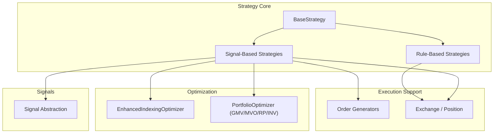
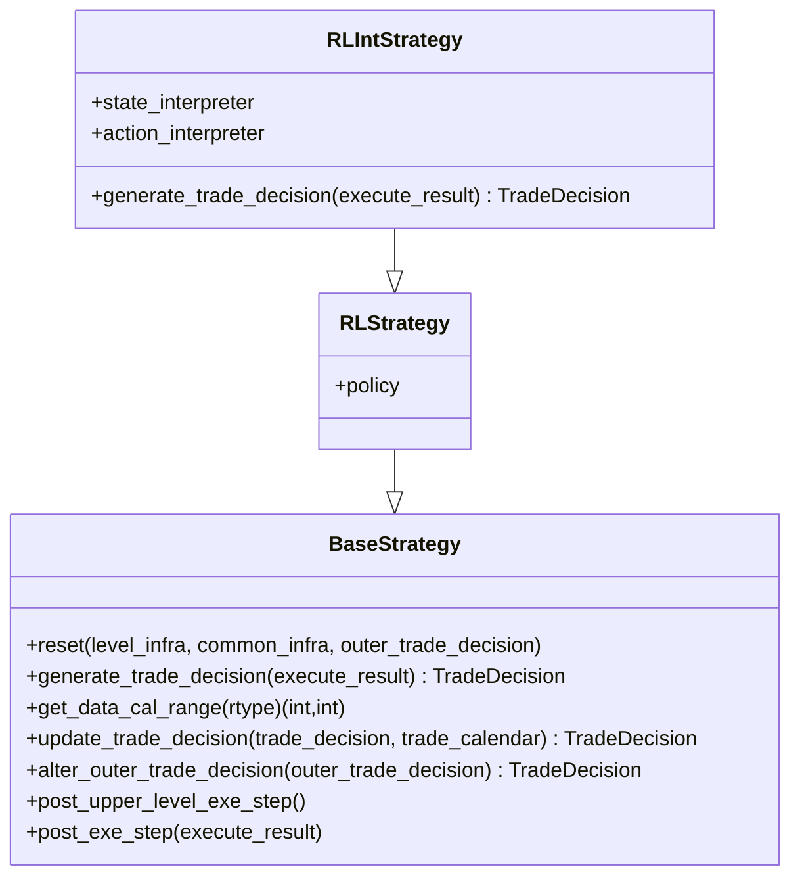
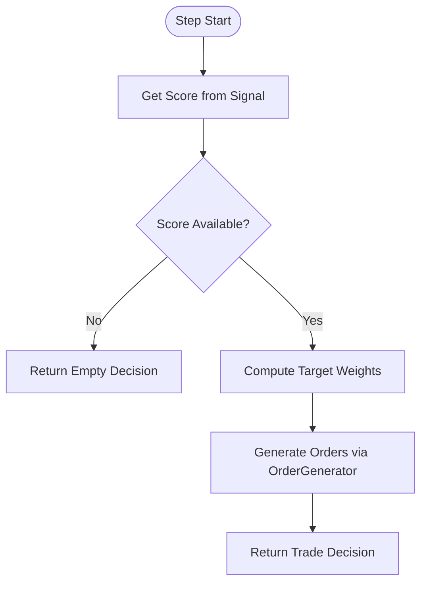
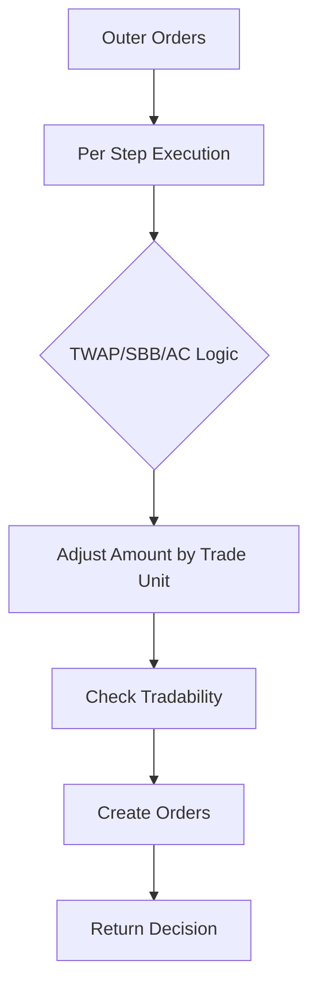
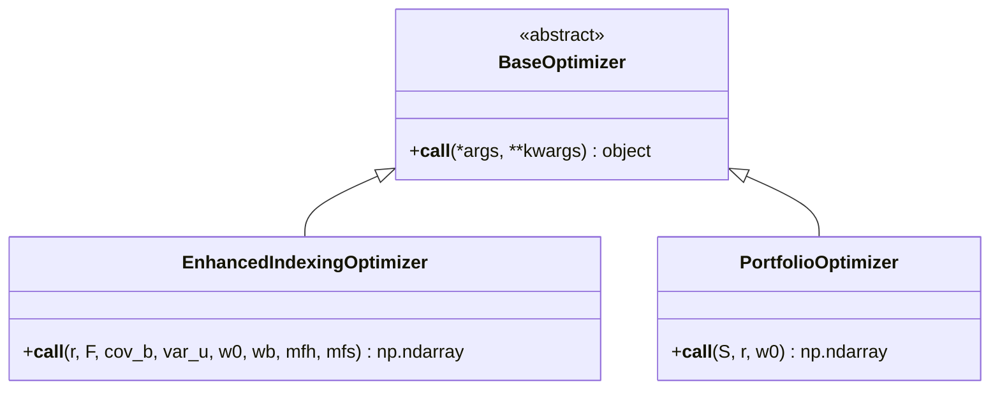
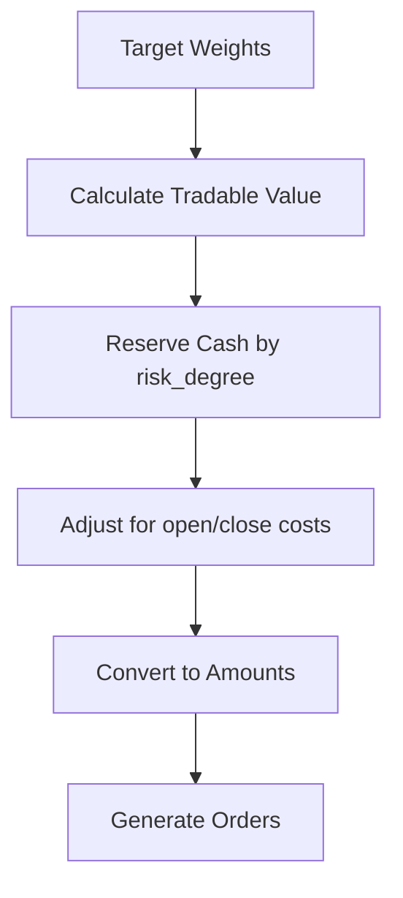
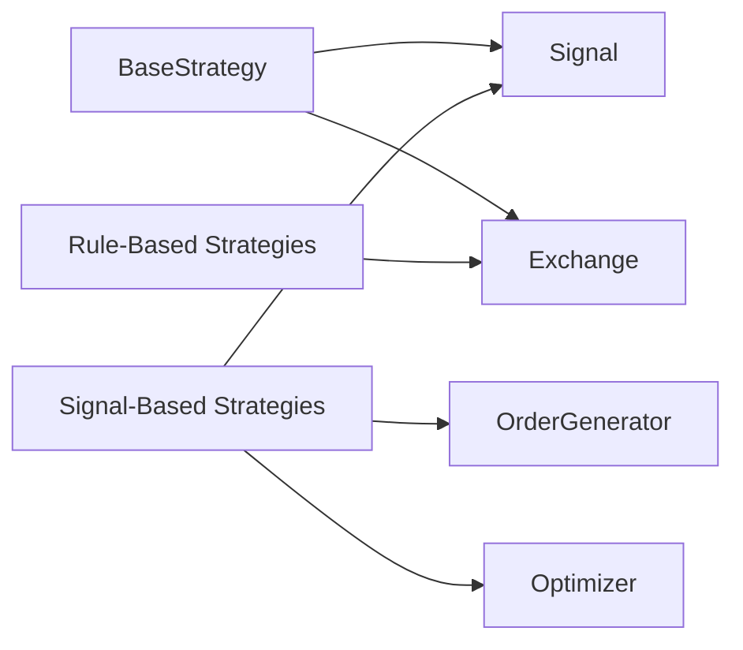

# Trading Strategies

<cite>
**Referenced Files in This Document**
- [base.py](file://qlib/strategy/base.py)
- [signal_strategy.py](file://qlib/contrib/strategy/signal_strategy.py)
- [rule_strategy.py](file://qlib/contrib/strategy/rule_strategy.py)
- [cost_control.py](file://qlib/contrib/strategy/cost_control.py)
- [order_generator.py](file://qlib/contrib/strategy/order_generator.py)
- [enhanced_indexing.py](file://qlib/contrib/strategy/optimizer/enhanced_indexing.py)
- [optimizer.py](file://qlib/contrib/strategy/optimizer/optimizer.py)
- [signal.py](file://qlib/backtest/signal.py)
- [config_enhanced_indexing.yaml](file://examples/portfolio/config_enhanced_indexing.yaml)
</cite>

## Table of Contents
1. [Introduction](#introduction)
2. [Project Structure](#project-structure)
3. [Core Components](#core-components)
4. [Architecture Overview](#architecture-overview)
5. [Detailed Component Analysis](#detailed-component-analysis)
6. [Dependency Analysis](#dependency-analysis)
7. [Performance Considerations](#performance-considerations)
8. [Troubleshooting Guide](#troubleshooting-guide)
9. [Conclusion](#conclusion)
10. [Appendices](#appendices)

## Introduction
This document explains QLib’s trading strategy framework and its implementations. It covers:
- The strategy base class and interface for implementing custom strategies
- Signal-based strategies that convert model predictions into trading signals
- Rule-based strategies with predefined logic and heuristics
- Portfolio optimization strategies including enhanced indexing, risk parity, and mean-variance optimization
- Cost control mechanisms and transaction cost modeling
- Examples of building custom strategies and combining multiple strategy types
- Strategy evaluation, performance attribution, and robustness testing across market conditions

## Project Structure
QLib organizes strategy-related code under the contrib.strategy package and a shared strategy base in qlib.strategy.base. Key modules include:
- Base strategy interfaces and RL integration
- Signal-based strategies (TopkDropout, WeightStrategyBase, EnhancedIndexingStrategy)
- Rule-based strategies (TWAP, SBB variants, AC, RandomOrder, FileOrder)
- Order generators and cost-aware rebalancing
- Portfolio optimizers (Enhanced Indexing, GMV, MVO, Risk Parity, Inverse Volatility)
- Unified signal abstraction to feed strategies from models or datasets



**Diagram sources**
- [base.py:23-146](file://qlib/strategy/base.py#L23-L146)
- [signal_strategy.py:25-373](file://qlib/contrib/strategy/signal_strategy.py#L25-L373)
- [rule_strategy.py:22-123](file://qlib/contrib/strategy/rule_strategy.py#L22-L123)
- [order_generator.py:15-140](file://qlib/contrib/strategy/order_generator.py#L15-L140)
- [enhanced_indexing.py:15-202](file://qlib/contrib/strategy/optimizer/enhanced_indexing.py#L15-L202)
- [optimizer.py:14-231](file://qlib/contrib/strategy/optimizer/optimizer.py#L14-L231)
- [signal.py:16-106](file://qlib/backtest/signal.py#L16-L106)

**Section sources**
- [base.py:23-146](file://qlib/strategy/base.py#L23-L146)
- [signal_strategy.py:25-373](file://qlib/contrib/strategy/signal_strategy.py#L25-L373)
- [rule_strategy.py:22-123](file://qlib/contrib/strategy/rule_strategy.py#L22-L123)
- [order_generator.py:15-140](file://qlib/contrib/strategy/order_generator.py#L15-L140)
- [enhanced_indexing.py:15-202](file://qlib/contrib/strategy/optimizer/enhanced_indexing.py#L15-L202)
- [optimizer.py:14-231](file://qlib/contrib/strategy/optimizer/optimizer.py#L14-L231)
- [signal.py:16-106](file://qlib/backtest/signal.py#L16-L106)

## Core Components
- BaseStrategy: Defines the lifecycle and interface for all strategies, including infrastructure access (trade calendar, exchange, position), reset hooks, and nested execution support.
- Signal abstraction: Provides a unified way to obtain prediction signals from models/datasets or static data.
- Signal-based strategies: Convert signals into target positions and orders via order generators. Includes TopkDropout and WeightStrategyBase with EnhancedIndexingStrategy.
- Rule-based strategies: Implement deterministic execution algorithms like TWAP and trend/volatility-aware splitting strategies.
- Order generators: Translate target weights into executable orders with cost and tradability considerations.
- Optimizers: Provide portfolio construction methods (enhanced indexing, GMV, MVO, risk parity, inverse volatility).

**Section sources**
- [base.py:23-146](file://qlib/strategy/base.py#L23-L146)
- [signal.py:16-106](file://qlib/backtest/signal.py#L16-L106)
- [signal_strategy.py:25-373](file://qlib/contrib/strategy/signal_strategy.py#L25-L373)
- [rule_strategy.py:22-123](file://qlib/contrib/strategy/rule_strategy.py#L22-L123)
- [order_generator.py:15-140](file://qlib/contrib/strategy/order_generator.py#L15-L140)
- [enhanced_indexing.py:15-202](file://qlib/contrib/strategy/optimizer/enhanced_indexing.py#L15-L202)
- [optimizer.py:14-231](file://qlib/contrib/strategy/optimizer/optimizer.py#L14-L231)

## Architecture Overview
The strategy layer sits between signals and the backtest engine. Strategies generate trade decisions each bar using signals and/or rules, then produce orders executed by the exchange. Optimizers compute target weights; order generators translate them into orders respecting costs and tradability.

```mermaid
sequenceDiagram
participant Strat as "Strategy"
participant Sig as "Signal"
participant Opt as "Optimizer"
participant OG as "OrderGenerator"
participant Ex as "Exchange"
Strat->>Sig : get_signal(start_time, end_time)
Sig-->>Strat : score/prediction
Strat->>Opt : compute target weights (optional)
Opt-->>Strat : target_weight_position
Strat->>OG : generate_order_list_from_target_weight_position(...)
OG->>Ex : calculate values/prices, check tradability
Ex-->>OG : amounts/limits
OG-->>Strat : order list
Strat-->>Ex : submit orders (via backtest loop)
```

**Diagram sources**
- [signal_strategy.py:345-373](file://qlib/contrib/strategy/signal_strategy.py#L345-L373)
- [order_generator.py:54-140](file://qlib/contrib/strategy/order_generator.py#L54-L140)
- [enhanced_indexing.py:87-202](file://qlib/contrib/strategy/optimizer/enhanced_indexing.py#L87-L202)
- [signal.py:68-106](file://qlib/backtest/signal.py#L68-L106)

## Detailed Component Analysis

### Base Strategy Interface
- Purpose: Define how strategies interact with the backtest environment, manage state resets, and produce trade decisions per step.
- Key capabilities:
  - Access to trade calendar, exchange, and current position
  - Nested execution hooks for multi-level strategies
  - Abstract method to implement decision generation



**Diagram sources**
- [base.py:23-146](file://qlib/strategy/base.py#L23-L146)
- [base.py:240-297](file://qlib/strategy/base.py#L240-L297)

**Section sources**
- [base.py:23-146](file://qlib/strategy/base.py#L23-L146)
- [base.py:240-297](file://qlib/strategy/base.py#L240-L297)

### Signal-Based Strategies
- BaseSignalStrategy: Wraps a Signal object and provides risk_degree management.
- TopkDropoutStrategy: Selects top-k stocks based on scores, manages dropout/buy methods, hold thresholds, and limit handling.
- WeightStrategyBase: Generates target weight positions from scores and delegates order creation to an OrderGenerator.
- EnhancedIndexingStrategy: Uses factor model data and benchmark weights to optimize tracking error vs excess return.



**Diagram sources**
- [signal_strategy.py:138-295](file://qlib/contrib/strategy/signal_strategy.py#L138-L295)
- [signal_strategy.py:345-373](file://qlib/contrib/strategy/signal_strategy.py#L345-L373)
- [signal_strategy.py:462-523](file://qlib/contrib/strategy/signal_strategy.py#L462-L523)

**Section sources**
- [signal_strategy.py:25-373](file://qlib/contrib/strategy/signal_strategy.py#L25-L373)
- [signal_strategy.py:375-523](file://qlib/contrib/strategy/signal_strategy.py#L375-L523)
- [signal.py:68-106](file://qlib/backtest/signal.py#L68-L106)

### Rule-Based Strategies
- TWAPStrategy: Splits large orders evenly over time steps, accounting for trade units and last-step cleanup.
- SBBStrategyBase and EMA variant: Alternates between two adjacent bars to decide buy/sell intensity based on price trend signals.
- ACStrategy: Uses realized volatility to shape execution profiles; falls back to TWAP when no signal is available.
- RandomOrderStrategy and FileOrderStrategy: Generate synthetic or file-driven orders for testing and simulation.



**Diagram sources**
- [rule_strategy.py:22-123](file://qlib/contrib/strategy/rule_strategy.py#L22-L123)
- [rule_strategy.py:125-295](file://qlib/contrib/strategy/rule_strategy.py#L125-L295)
- [rule_strategy.py:383-537](file://qlib/contrib/strategy/rule_strategy.py#L383-L537)
- [rule_strategy.py:539-673](file://qlib/contrib/strategy/rule_strategy.py#L539-L673)

**Section sources**
- [rule_strategy.py:22-123](file://qlib/contrib/strategy/rule_strategy.py#L22-L123)
- [rule_strategy.py:125-295](file://qlib/contrib/strategy/rule_strategy.py#L125-L295)
- [rule_strategy.py:383-537](file://qlib/contrib/strategy/rule_strategy.py#L383-L537)
- [rule_strategy.py:539-673](file://qlib/contrib/strategy/rule_strategy.py#L539-L673)

### Portfolio Optimization Strategies
- EnhancedIndexingOptimizer: Maximizes excess return minus tracking error subject to turnover, benchmark deviation, factor deviation, and force-hold/sell masks.
- PortfolioOptimizer: Supports global minimum variance (GMV), mean-variance optimization (MVO), risk parity (RP), and inverse volatility (INV). Assumes full investment and no shorting.



**Diagram sources**
- [enhanced_indexing.py:15-202](file://qlib/contrib/strategy/optimizer/enhanced_indexing.py#L15-L202)
- [optimizer.py:14-231](file://qlib/contrib/strategy/optimizer/optimizer.py#L14-L231)

**Section sources**
- [enhanced_indexing.py:15-202](file://qlib/contrib/strategy/optimizer/enhanced_indexing.py#L15-L202)
- [optimizer.py:14-231](file://qlib/contrib/strategy/optimizer/optimizer.py#L14-L231)

### Cost Control Mechanisms and Transaction Cost Modeling
- SoftTopkStrategy: Implements budget-constrained rebalancing with impact limits to smooth trades and reduce turnover costs.
- OrderGenWInteract: Incorporates close/open costs when converting target weights to amounts and respects reserved cash based on risk_degree.
- Exchange interactions: Use tradability checks, amount rounding by trade units, and deal prices to reflect realistic execution.



**Diagram sources**
- [cost_control.py:8-118](file://qlib/contrib/strategy/cost_control.py#L8-L118)
- [order_generator.py:54-140](file://qlib/contrib/strategy/order_generator.py#L54-L140)

**Section sources**
- [cost_control.py:8-118](file://qlib/contrib/strategy/cost_control.py#L8-L118)
- [order_generator.py:54-140](file://qlib/contrib/strategy/order_generator.py#L54-L140)

### Building Custom Strategies and Combining Types
- Implement a custom strategy by subclassing BaseStrategy and overriding generate_trade_decision to produce orders based on your logic.
- Combine signal-based and rule-based approaches:
  - Use a signal to select candidates and a rule-based executor (e.g., TWAP or SBB) to split orders efficiently.
  - Integrate an optimizer to compute target weights and use an order generator to handle costs and tradability.

Example configuration demonstrates wiring a model, dataset, and EnhancedIndexingStrategy within a workflow.

**Section sources**
- [base.py:132-146](file://qlib/strategy/base.py#L132-L146)
- [signal_strategy.py:25-373](file://qlib/contrib/strategy/signal_strategy.py#L25-L373)
- [rule_strategy.py:22-123](file://qlib/contrib/strategy/rule_strategy.py#L22-L123)
- [config_enhanced_indexing.yaml:1-72](file://examples/portfolio/config_enhanced_indexing.yaml#L1-L72)

## Dependency Analysis
- Strategies depend on:
  - Signal abstraction for inputs
  - Exchange and position for execution details
  - Order generators for translating targets to orders
  - Optimizers for portfolio construction
- Coupling points:
  - BaseStrategy integrates with LevelInfrastructure and CommonInfrastructure for calendar and account/exchange access
  - Signal-based strategies rely on create_signal_from to unify input formats
  - Optimizers are invoked by strategies to compute target weights



**Diagram sources**
- [base.py:23-146](file://qlib/strategy/base.py#L23-L146)
- [signal_strategy.py:25-373](file://qlib/contrib/strategy/signal_strategy.py#L25-L373)
- [rule_strategy.py:22-123](file://qlib/contrib/strategy/rule_strategy.py#L22-L123)
- [order_generator.py:15-140](file://qlib/contrib/strategy/order_generator.py#L15-L140)
- [enhanced_indexing.py:15-202](file://qlib/contrib/strategy/optimizer/enhanced_indexing.py#L15-L202)
- [optimizer.py:14-231](file://qlib/contrib/strategy/optimizer/optimizer.py#L14-L231)
- [signal.py:16-106](file://qlib/backtest/signal.py#L16-L106)

**Section sources**
- [base.py:23-146](file://qlib/strategy/base.py#L23-L146)
- [signal_strategy.py:25-373](file://qlib/contrib/strategy/signal_strategy.py#L25-L373)
- [rule_strategy.py:22-123](file://qlib/contrib/strategy/rule_strategy.py#L22-L123)
- [order_generator.py:15-140](file://qlib/contrib/strategy/order_generator.py#L15-L140)
- [enhanced_indexing.py:15-202](file://qlib/contrib/strategy/optimizer/enhanced_indexing.py#L15-L202)
- [optimizer.py:14-231](file://qlib/contrib/strategy/optimizer/optimizer.py#L14-L231)
- [signal.py:16-106](file://qlib/backtest/signal.py#L16-L106)

## Performance Considerations
- Choose appropriate frequency: daily exchanges run faster than intraday where applicable.
- Use risk_degree to control exposure and avoid over-leveraging during volatile periods.
- Limit turnover via optimizer constraints (delta) and impact limits to reduce transaction costs.
- Prefer non-interacting order generation when real-time prices are unavailable at decision time.
- Cache risk model data per date to avoid repeated I/O overhead.

[No sources needed since this section provides general guidance]

## Troubleshooting Guide
- No signal available: Strategies return empty decisions; verify signal source and time alignment.
- Optimization failures: EnhancedIndexingOptimizer may fall back to current weights if constraints are infeasible; relax delta or bounds.
- Tradable assets: Ensure stocks are tradable in the intended direction; limit-up/down handling can be toggled.
- Cost modeling: Confirm open/close costs and minimum costs are set appropriately in exchange configuration.

**Section sources**
- [signal_strategy.py:138-295](file://qlib/contrib/strategy/signal_strategy.py#L138-L295)
- [enhanced_indexing.py:166-202](file://qlib/contrib/strategy/optimizer/enhanced_indexing.py#L166-L202)
- [order_generator.py:54-140](file://qlib/contrib/strategy/order_generator.py#L54-L140)
- [config_enhanced_indexing.yaml:20-31](file://examples/portfolio/config_enhanced_indexing.yaml#L20-L31)

## Conclusion
QLib’s strategy framework provides a flexible foundation for building robust trading systems. By separating signal ingestion, strategy logic, order generation, and optimization, users can mix and match components to suit different objectives—alpha-driven selection, efficient execution, and risk-controlled portfolio construction. Proper cost modeling, tradability checks, and optimizer constraints ensure realistic and stable performance across varying market conditions.

[No sources needed since this section summarizes without analyzing specific files]

## Appendices
- Example configuration for enhanced indexing strategy shows how to wire model, dataset, and strategy in a workflow.

**Section sources**
- [config_enhanced_indexing.yaml:1-72](file://examples/portfolio/config_enhanced_indexing.yaml#L1-L72)