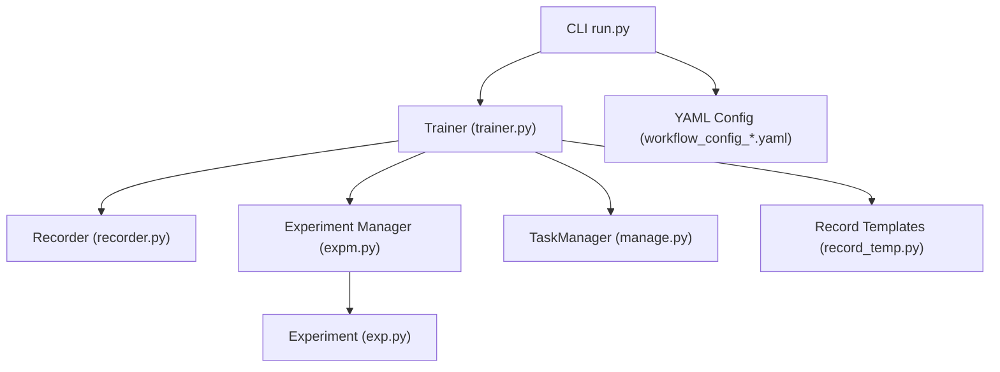
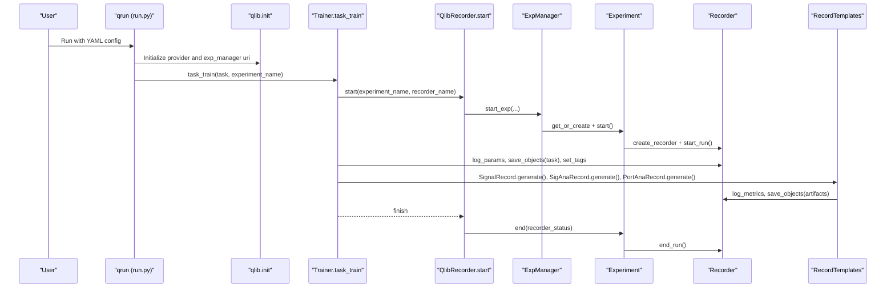
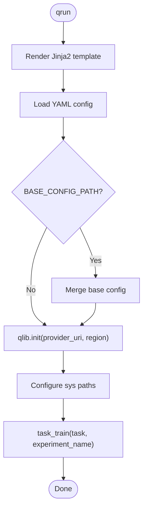
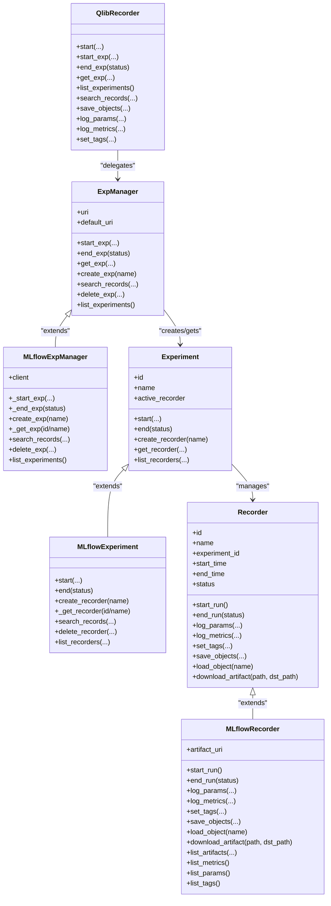
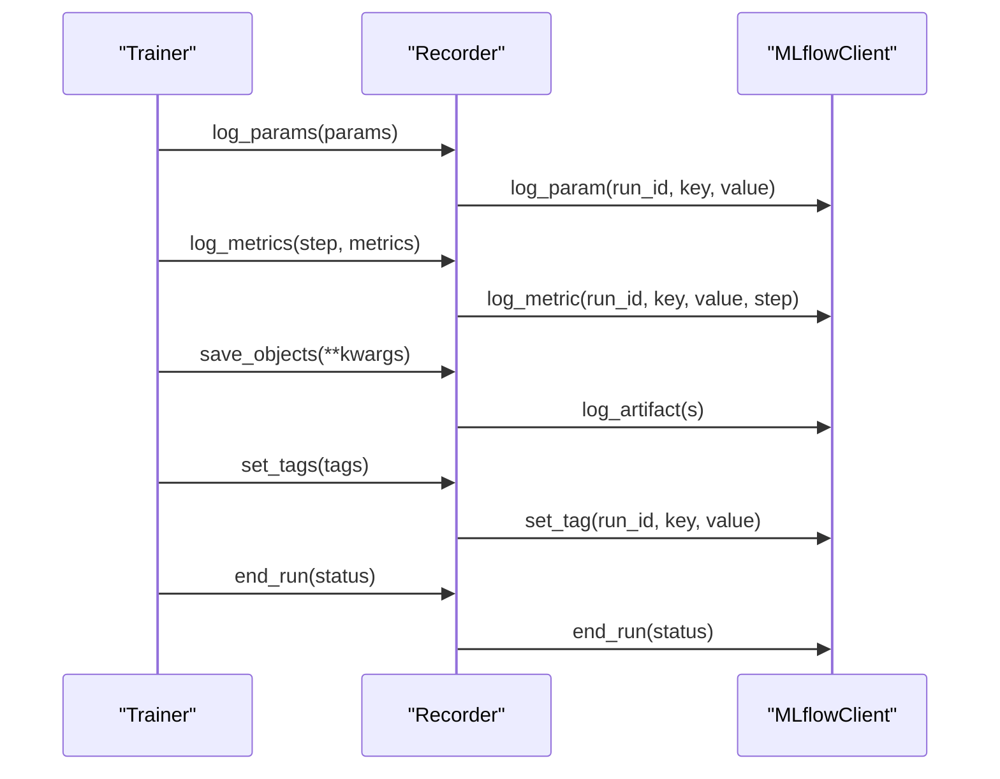
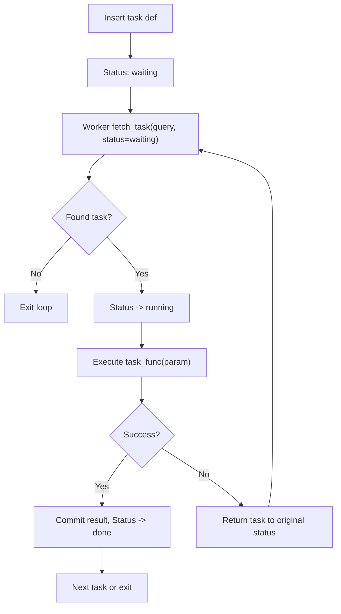
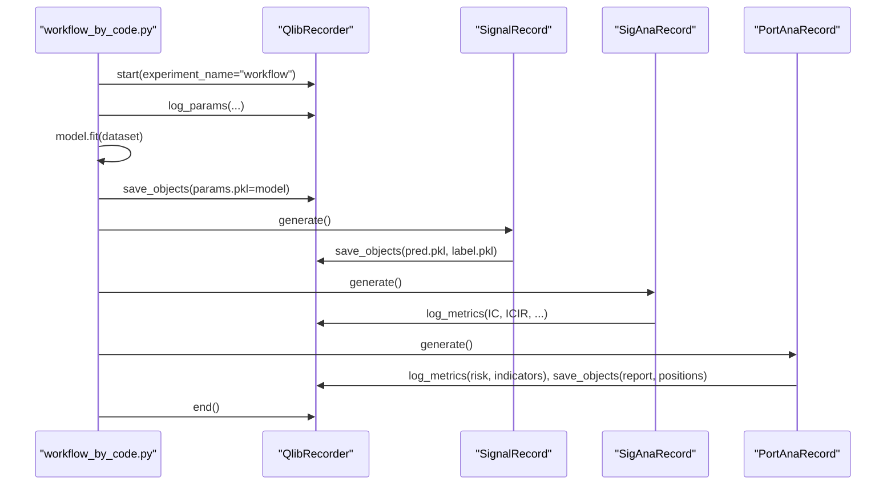
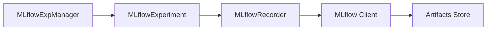
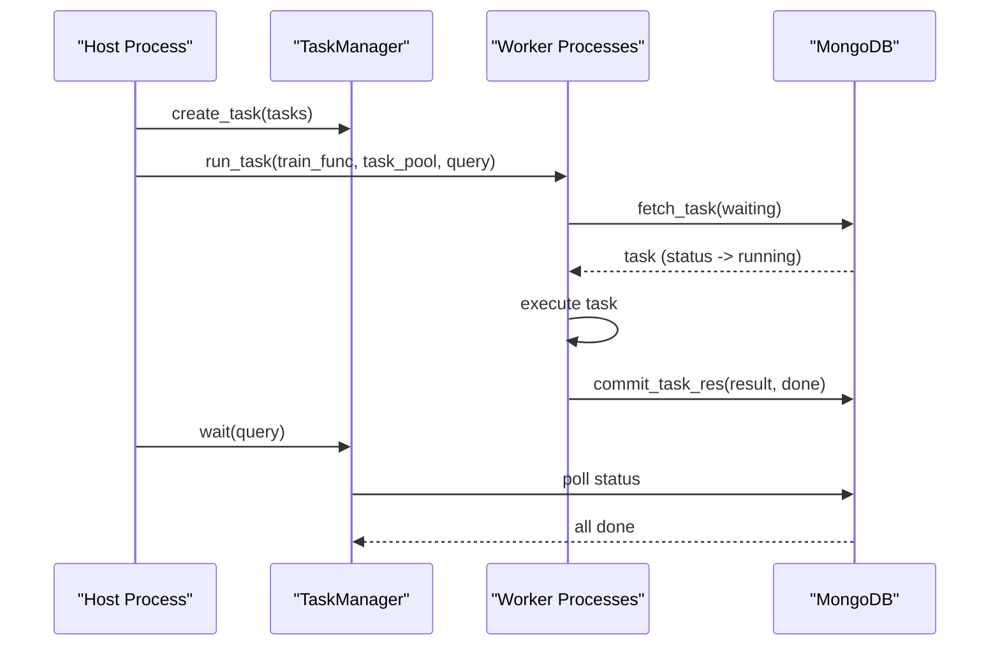
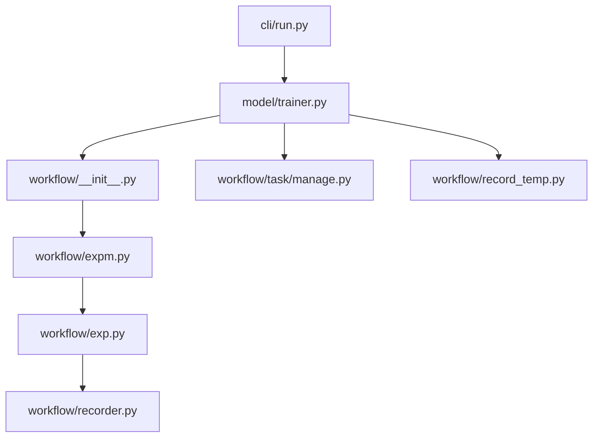

# Workflow and Experiment Management

<cite>
**Referenced Files in This Document**
- [run.py](file://qlib/cli/run.py)
- [expm.py](file://qlib/workflow/expm.py)
- [exp.py](file://qlib/workflow/exp.py)
- [recorder.py](file://qlib/workflow/recorder.py)
- [__init__.py](file://qlib/workflow/__init__.py)
- [trainer.py](file://qlib/model/trainer.py)
- [manage.py](file://qlib/workflow/task/manage.py)
- [record_temp.py](file://qlib/workflow/record_temp.py)
- [workflow_by_code.py](file://examples/workflow_by_code.py)
- [workflow_config_lightgbm_Alpha158.yaml](file://examples/benchmarks/LightGBM/workflow_config_lightgbm_Alpha158.yaml)
</cite>

## Table of Contents
1. [Introduction](#introduction)
2. [Project Structure](#project-structure)
3. [Core Components](#core-components)
4. [Architecture Overview](#architecture-overview)
5. [Detailed Component Analysis](#detailed-component-analysis)
6. [Dependency Analysis](#dependency-analysis)
7. [Performance Considerations](#performance-considerations)
8. [Troubleshooting Guide](#troubleshooting-guide)
9. [Conclusion](#conclusion)
10. [Appendices](#appendices)

## Introduction
This document explains QLib’s workflow orchestration and experiment management system with a focus on:
- Configuration-driven workflows via YAML and the qrun command
- Task management for scheduling, monitoring, and controlling experiments
- The recorder system for tracking experiments, results, and metadata
- Experiment organization, versioning, and reproducibility
- Integration with MLflow for experiment tracking and model registry
- Building custom workflows programmatically and automating research pipelines
- Distributed execution, resource management, and scaling considerations

QLib provides two complementary ways to run research workflows:
- Declarative configuration using YAML files executed by the CLI
- Programmatic construction of workflows using Python APIs

Both approaches integrate tightly with an experiment manager backed by MLflow and a recorder abstraction that standardizes logging, artifacts, and lifecycle management.

## Project Structure
At a high level:
- CLI entrypoint parses YAML, initializes QLib, and invokes training through the trainer layer
- Experiment Manager abstracts experiment creation and lifecycle (MLflow-backed)
- Recorder abstracts run-level logging and artifact storage (MLflow-backed)
- Trainer orchestrates task execution and integrates with optional distributed TaskManager
- Record templates generate predictions, signal analysis, and portfolio backtest artifacts
- Examples demonstrate both YAML-based and code-based workflows

**Diagram sources**
- [run.py:86-148](file://qlib/cli/run.py#L86-L148)
- [trainer.py:108-128](file://qlib/model/trainer.py#L108-L128)
- [expm.py:317-434](file://qlib/workflow/expm.py#L317-L434)
- [exp.py:243-380](file://qlib/workflow/exp.py#L243-L380)
- [recorder.py:247-494](file://qlib/workflow/recorder.py#L247-L494)
- [manage.py:35-559](file://qlib/workflow/task/manage.py#L35-L559)
- [record_temp.py:28-694](file://qlib/workflow/record_temp.py#L28-L694)
- [workflow_config_lightgbm_Alpha158.yaml:1-72](file://examples/benchmarks/LightGBM/workflow_config_lightgbm_Alpha158.yaml#L1-L72)

**Section sources**
- [run.py:86-148](file://qlib/cli/run.py#L86-L148)
- [workflow_config_lightgbm_Alpha158.yaml:1-72](file://examples/benchmarks/LightGBM/workflow_config_lightgbm_Alpha158.yaml#L1-L72)

## Core Components
- QlibRecorder global interface: Provides context-managed start/end of experiments and convenient logging APIs
- Experiment and MLflowExperiment: Encapsulate experiment identity and recorder lifecycle
- ExpManager and MLflowExpManager: Manage experiment creation, activation, and search; handle URI scoping and locking
- Recorder and MLflowRecorder: Standardized API for parameters, metrics, tags, artifacts, and run status
- Trainer classes: Orchestrate task execution, support delayed training, and integrate with TaskManager for distributed runs
- TaskManager: MongoDB-backed task queue with safe fetch/commit, priority, and status transitions
- Record templates: Reusable record generators for signals, analysis, and backtests

Key responsibilities:
- Configuration parsing and initialization (CLI)
- Experiment and recorder lifecycle (Workflow layer)
- Task scheduling and distributed execution (TaskManager + Trainers)
- Artifact and metric persistence (Recorder + MLflow)
- Reproducible outputs (Record templates)

**Section sources**
- [__init__.py:26-682](file://qlib/workflow/__init__.py#L26-L682)
- [exp.py:15-380](file://qlib/workflow/exp.py#L15-L380)
- [expm.py:22-434](file://qlib/workflow/expm.py#L22-L434)
- [recorder.py:28-494](file://qlib/workflow/recorder.py#L28-L494)
- [trainer.py:131-620](file://qlib/model/trainer.py#L131-L620)
- [manage.py:35-559](file://qlib/workflow/task/manage.py#L35-L559)
- [record_temp.py:28-694](file://qlib/workflow/record_temp.py#L28-L694)

## Architecture Overview
The end-to-end flow from YAML to tracked experiment:

**Diagram sources**
- [run.py:86-148](file://qlib/cli/run.py#L86-L148)
- [trainer.py:108-128](file://qlib/model/trainer.py#L108-L128)
- [__init__.py:37-95](file://qlib/workflow/__init__.py#L37-L95)
- [expm.py:328-346](file://qlib/workflow/expm.py#L328-L346)
- [exp.py:257-285](file://qlib/workflow/exp.py#L257-L285)
- [recorder.py:335-360](file://qlib/workflow/recorder.py#L335-L360)
- [record_temp.py:161-573](file://qlib/workflow/record_temp.py#L161-L573)

## Detailed Component Analysis

### Configuration-Driven Workflows with YAML and qrun
- The CLI renders Jinja2 templates, loads YAML, supports BASE_CONFIG_PATH inheritance, sets sys paths, initializes QLib, and calls task_train
- YAML defines data handler segments, model and dataset instantiation, and record steps (signal generation, analysis, backtesting)
- The default experiment name can be overridden via config

**Diagram sources**
- [run.py:52-82](file://qlib/cli/run.py#L52-L82)
- [run.py:86-148](file://qlib/cli/run.py#L86-L148)
- [workflow_config_lightgbm_Alpha158.yaml:1-72](file://examples/benchmarks/LightGBM/workflow_config_lightgbm_Alpha158.yaml#L1-L72)

**Section sources**
- [run.py:52-148](file://qlib/cli/run.py#L52-L148)
- [workflow_config_lightgbm_Alpha158.yaml:1-72](file://examples/benchmarks/LightGBM/workflow_config_lightgbm_Alpha158.yaml#L1-L72)

### Experiment Management and Versioning
- QlibRecorder wraps ExpManager to provide context-managed experiment start/end and convenient logging
- ExpManager handles active experiment scoping, default URI, and file-locking for local file URIs to avoid race conditions during creation
- MLflowExperiment uses MLflow client to manage runs and recorders; supports resume semantics and listing/searching records
- Recorders encapsulate run state (status, timestamps) and expose methods to log params/metrics/tags and artifacts

**Diagram sources**
- [__init__.py:26-682](file://qlib/workflow/__init__.py#L26-L682)
- [expm.py:22-434](file://qlib/workflow/expm.py#L22-L434)
- [exp.py:15-380](file://qlib/workflow/exp.py#L15-L380)
- [recorder.py:28-494](file://qlib/workflow/recorder.py#L28-L494)

**Section sources**
- [__init__.py:26-682](file://qlib/workflow/__init__.py#L26-L682)
- [expm.py:22-434](file://qlib/workflow/expm.py#L22-L434)
- [exp.py:15-380](file://qlib/workflow/exp.py#L15-L380)
- [recorder.py:28-494](file://qlib/workflow/recorder.py#L28-L494)

### Recorder System for Tracking Experiments and Artifacts
- Recorder exposes standardized methods for parameters, metrics, tags, and artifacts
- MLflowRecorder implements these using MLflow client, including:
  - Automatic logging of uncommitted code diffs/status
  - Async logging for params/metrics/tags to reduce blocking overhead
  - Object serialization/deserialization via Serializable utilities
  - Artifact download and cleanup for specific backends
- Record templates build on Recorder to produce reproducible artifacts:
  - SignalRecord: predictions and labels
  - SigAnaRecord/HFSignalRecord: IC/IR and long-short metrics
  - PortAnaRecord/MultiPassPortAnaRecord: backtest reports, risk analysis, indicators

**Diagram sources**
- [recorder.py:335-395](file://qlib/workflow/recorder.py#L335-L395)
- [recorder.py:445-494](file://qlib/workflow/recorder.py#L445-L494)

**Section sources**
- [recorder.py:28-494](file://qlib/workflow/recorder.py#L28-L494)
- [record_temp.py:161-694](file://qlib/workflow/record_temp.py#L161-L694)

### Task Management for Scheduling, Monitoring, and Control
- TaskManager persists tasks in MongoDB collections with encoded definitions/results and status transitions
- Supports:
  - Safe fetching with atomic status updates
  - Priority ordering
  - Partial completion states for multi-step workflows
  - Waiting until all tasks complete
  - Querying and resetting statuses
- run_task orchestrates worker loops to fetch, execute, and commit results safely

**Diagram sources**
- [manage.py:177-215](file://qlib/workflow/task/manage.py#L177-L215)
- [manage.py:265-286](file://qlib/workflow/task/manage.py#L265-L286)
- [manage.py:354-382](file://qlib/workflow/task/manage.py#L354-L382)
- [manage.py:485-551](file://qlib/workflow/task/manage.py#L485-L551)

**Section sources**
- [manage.py:35-559](file://qlib/workflow/task/manage.py#L35-L559)

### Building Custom Workflows Programmatically
- The programmatic example demonstrates initializing data, building model/dataset instances, starting an experiment, logging parameters, saving models, generating signals, performing analysis, and running backtests
- This mirrors what YAML-driven workflows do under the hood, enabling flexible composition and reuse

**Diagram sources**
- [workflow_by_code.py:19-86](file://examples/workflow_by_code.py#L19-L86)
- [record_temp.py:161-573](file://qlib/workflow/record_temp.py#L161-L573)

**Section sources**
- [workflow_by_code.py:19-86](file://examples/workflow_by_code.py#L19-L86)
- [record_temp.py:161-573](file://qlib/workflow/record_temp.py#L161-L573)

### Integrating with MLflow for Experiment Tracking and Model Registry
- Experiment and Recorder implementations are built on MLflow clients
- MLflowExperiment manages runs and recorders via MLflow client
- MLflowRecorder logs parameters, metrics, tags, and artifacts; supports downloading artifacts and cleaning up temporary files
- Qlib adds conveniences like automatic code diff logging and environment variable capture

**Diagram sources**
- [expm.py:317-434](file://qlib/workflow/expm.py#L317-L434)
- [exp.py:243-380](file://qlib/workflow/exp.py#L243-L380)
- [recorder.py:247-494](file://qlib/workflow/recorder.py#L247-L494)

**Section sources**
- [expm.py:317-434](file://qlib/workflow/expm.py#L317-L434)
- [exp.py:243-380](file://qlib/workflow/exp.py#L243-L380)
- [recorder.py:247-494](file://qlib/workflow/recorder.py#L247-L494)

### Distributed Execution, Resource Management, and Scaling
- TrainerRM and DelayTrainerRM integrate with TaskManager to distribute tasks across processes or machines sharing a MongoDB-backed task pool
- run_task provides robust worker loops with safe fetch/commit and error handling
- File locking is used when creating experiments on local file URIs to prevent concurrent creation conflicts
- Asynchronous logging reduces overhead during heavy workloads

**Diagram sources**
- [trainer.py:341-489](file://qlib/model/trainer.py#L341-L489)
- [manage.py:217-263](file://qlib/workflow/task/manage.py#L217-L263)
- [manage.py:485-551](file://qlib/workflow/task/manage.py#L485-L551)
- [expm.py:232-245](file://qlib/workflow/expm.py#L232-L245)

**Section sources**
- [trainer.py:341-489](file://qlib/model/trainer.py#L341-L489)
- [manage.py:217-263](file://qlib/workflow/task/manage.py#L217-L263)
- [manage.py:485-551](file://qlib/workflow/task/manage.py#L485-L551)
- [expm.py:232-245](file://qlib/workflow/expm.py#L232-L245)

## Dependency Analysis
- CLI depends on Jinja2, ruamel.yaml, fire, qlib.config, and trainer
- Trainer depends on qlib.data.dataset, qlib.model.base, qlib.workflow, and qlib.utils
- Experiment Manager depends on MLflow and filelock for local URIs
- Recorder depends on MLflow client and serialization utilities
- TaskManager depends on pymongo and bson for MongoDB operations

**Diagram sources**
- [run.py:1-158](file://qlib/cli/run.py#L1-L158)
- [trainer.py:1-620](file://qlib/model/trainer.py#L1-L620)
- [__init__.py:1-682](file://qlib/workflow/__init__.py#L1-L682)
- [expm.py:1-434](file://qlib/workflow/expm.py#L1-L434)
- [exp.py:1-380](file://qlib/workflow/exp.py#L1-L380)
- [recorder.py:1-494](file://qlib/workflow/recorder.py#L1-L494)
- [manage.py:1-559](file://qlib/workflow/task/manage.py#L1-L559)
- [record_temp.py:1-694](file://qlib/workflow/record_temp.py#L1-L694)

**Section sources**
- [run.py:1-158](file://qlib/cli/run.py#L1-L158)
- [trainer.py:1-620](file://qlib/model/trainer.py#L1-L620)
- [__init__.py:1-682](file://qlib/workflow/__init__.py#L1-L682)
- [expm.py:1-434](file://qlib/workflow/expm.py#L1-L434)
- [exp.py:1-380](file://qlib/workflow/exp.py#L1-L380)
- [recorder.py:1-494](file://qlib/workflow/recorder.py#L1-L494)
- [manage.py:1-559](file://qlib/workflow/task/manage.py#L1-L559)
- [record_temp.py:1-694](file://qlib/workflow/record_temp.py#L1-L694)

## Performance Considerations
- Use async logging for params/metrics/tags to reduce blocking time during heavy workloads
- Prefer TaskManager-based trainers for large-scale parallelism across multiple workers or machines
- Configure appropriate num_threads in model configs (e.g., LightGBM) to match hardware resources
- Avoid redundant artifact uploads; leverage Record templates’ dependency checks to skip already generated outputs
- For local file-based MLflow URIs, rely on internal file locking to prevent race conditions during experiment creation

[No sources needed since this section provides general guidance]

## Troubleshooting Guide
Common issues and remedies:
- Reinitializing Qlib while an experiment is active: The wrapper prevents reinitialization if an experiment is already started to avoid changing stored locations
- Missing or incorrect recorder/experiment IDs: Retrieval methods raise clear errors; ensure IDs or names are correct and experiments are not deleted
- Concurrent experiment creation on local filesystems: File locking ensures only one process creates an experiment at a time; verify URI scheme and path
- Task stuck in running state: Use TaskManager reset_waiting or reset_status to recover from unexpected exits; check MongoDB connectivity and permissions
- Artifact download failures: Ensure recorder has been started and artifacts exist; some backends may require explicit cleanup after download

**Section sources**
- [__init__.py:656-682](file://qlib/workflow/__init__.py#L656-L682)
- [exp.py:287-338](file://qlib/workflow/exp.py#L287-L338)
- [expm.py:232-245](file://qlib/workflow/expm.py#L232-L245)
- [manage.py:416-432](file://qlib/workflow/task/manage.py#L416-L432)
- [recorder.py:413-443](file://qlib/workflow/recorder.py#L413-L443)

## Conclusion
QLib’s workflow orchestration combines declarative YAML configurations with a powerful programmatic API, unified by an experiment manager and recorder layer backed by MLflow. The task management system enables scalable, resilient execution across processes and machines. Record templates standardize the production of reproducible artifacts, while the trainer abstractions support both linear and distributed workflows. Together, these components provide a robust foundation for managing experiments, tracking results, and automating research pipelines at scale.

[No sources needed since this section summarizes without analyzing specific files]

## Appendices

### Example YAML Workflow Structure
A typical workflow YAML includes:
- qlib_init: provider and region
- Data handler configuration with time segments and instruments
- Model and dataset instantiation
- Record steps for signal generation, analysis, and portfolio backtesting

**Section sources**
- [workflow_config_lightgbm_Alpha158.yaml:1-72](file://examples/benchmarks/LightGBM/workflow_config_lightgbm_Alpha158.yaml#L1-L72)